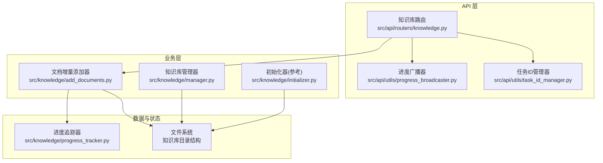
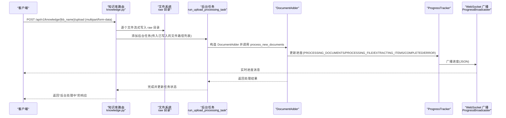
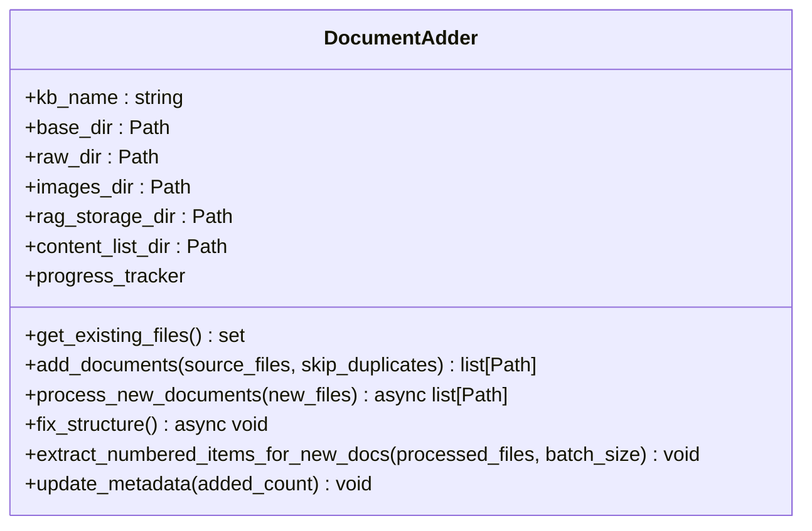
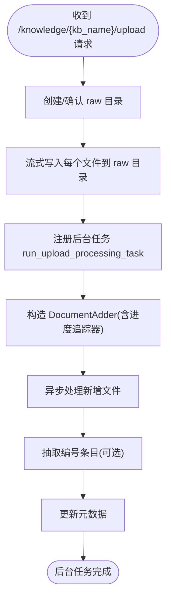
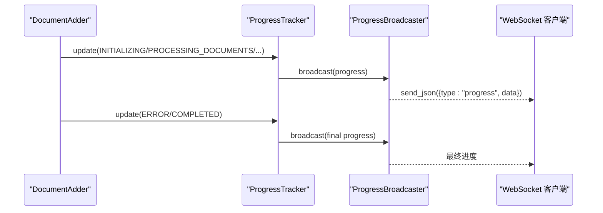
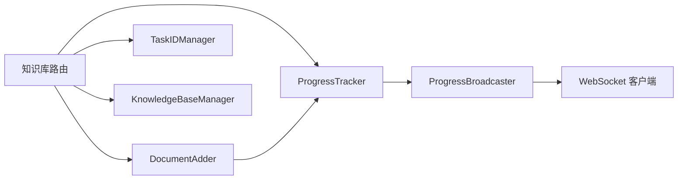

# 后端处理逻辑

<cite>
**本文引用的文件**
- [src/knowledge/add_documents.py](file://src/knowledge/add_documents.py)
- [src/api/routers/knowledge.py](file://src/api/routers/knowledge.py)
- [src/knowledge/progress_tracker.py](file://src/knowledge/progress_tracker.py)
- [src/api/utils/progress_broadcaster.py](file://src/api/utils/progress_broadcaster.py)
- [src/api/utils/task_id_manager.py](file://src/api/utils/task_id_manager.py)
- [src/knowledge/manager.py](file://src/knowledge/manager.py)
- [src/knowledge/initializer.py](file://src/knowledge/initializer.py)
- [src/knowledge/example_add_documents.py](file://src/knowledge/example_add_documents.py)
</cite>

## 目录
1. [简介](#简介)
2. [项目结构](#项目结构)
3. [核心组件](#核心组件)
4. [架构总览](#架构总览)
5. [详细组件分析](#详细组件分析)
6. [依赖关系分析](#依赖关系分析)
7. [性能考量](#性能考量)
8. [故障排查指南](#故障排查指南)
9. [结论](#结论)
10. [附录](#附录)

## 简介
本文件聚焦于后端“增量添加文档”与“文件上传”的完整处理链路，围绕以下目标展开：
- 深入解析 DocumentAdder 类的 add_documents 与 process_new_documents 方法，说明如何将上传文件安全地复制到知识库 raw 目录并进行异步处理。
- 详述文件验证、进度跟踪与错误处理机制。
- 结合 API 路由 knowledge.py 中的 upload_files 端点，阐述多文件上传、流式写入与后台任务调度的全流程。
- 提供实际代码示例路径以展示后端服务的健壮性与可扩展性，并列出常见性能瓶颈与优化策略。

## 项目结构
后端处理逻辑主要分布在以下模块：
- 知识库管理与路由：src/api/routers/knowledge.py
- 文档增量添加：src/knowledge/add_documents.py
- 进度跟踪：src/knowledge/progress_tracker.py、src/api/utils/progress_broadcaster.py
- 任务 ID 管理：src/api/utils/task_id_manager.py
- 知识库管理器：src/knowledge/manager.py
- 初始化器（对比理解）：src/knowledge/initializer.py
- 示例脚本：src/knowledge/example_add_documents.py

图表来源
- [src/api/routers/knowledge.py](file://src/api/routers/knowledge.py#L296-L344)
- [src/knowledge/add_documents.py](file://src/knowledge/add_documents.py#L89-L131)
- [src/knowledge/progress_tracker.py](file://src/knowledge/progress_tracker.py#L38-L192)
- [src/api/utils/progress_broadcaster.py](file://src/api/utils/progress_broadcaster.py#L1-L73)
- [src/api/utils/task_id_manager.py](file://src/api/utils/task_id_manager.py#L1-L103)
- [src/knowledge/manager.py](file://src/knowledge/manager.py#L1-L120)

章节来源
- [src/api/routers/knowledge.py](file://src/api/routers/knowledge.py#L296-L344)
- [src/knowledge/add_documents.py](file://src/knowledge/add_documents.py#L89-L131)
- [src/knowledge/progress_tracker.py](file://src/knowledge/progress_tracker.py#L38-L192)
- [src/api/utils/progress_broadcaster.py](file://src/api/utils/progress_broadcaster.py#L1-L73)
- [src/api/utils/task_id_manager.py](file://src/api/utils/task_id_manager.py#L1-L103)
- [src/knowledge/manager.py](file://src/knowledge/manager.py#L1-L120)

## 核心组件
- DocumentAdder：负责将新文件复制到知识库 raw 目录，并对新增文件执行异步处理（RAGAnything 解析、内容列表生成、图片提取与结构修复），并支持编号条目抽取与元数据更新。
- 知识库路由 upload_files：接收多文件上传，同步写入 raw 目录，随后通过后台任务运行 DocumentAdder 的处理流程，并通过 ProgressTracker 与 WebSocket 广播进度。
- ProgressTracker：统一记录与持久化进度，支持回调与广播。
- ProgressBroadcaster：WebSocket 广播器，向连接的知识库实例推送实时进度。
- TaskIDManager：为后台任务生成唯一 ID，便于日志与状态追踪。
- KnowledgeBaseManager：知识库目录与配置管理，提供路径查询与统计信息。

章节来源
- [src/knowledge/add_documents.py](file://src/knowledge/add_documents.py#L44-L131)
- [src/api/routers/knowledge.py](file://src/api/routers/knowledge.py#L296-L344)
- [src/knowledge/progress_tracker.py](file://src/knowledge/progress_tracker.py#L38-L192)
- [src/api/utils/progress_broadcaster.py](file://src/api/utils/progress_broadcaster.py#L1-L73)
- [src/api/utils/task_id_manager.py](file://src/api/utils/task_id_manager.py#L1-L103)
- [src/knowledge/manager.py](file://src/knowledge/manager.py#L1-L120)

## 架构总览
后端处理链路分为“上传阶段”和“处理阶段”，二者通过 FastAPI 的后台任务解耦，实现高吞吐与低延迟。

图表来源
- [src/api/routers/knowledge.py](file://src/api/routers/knowledge.py#L296-L344)
- [src/api/routers/knowledge.py](file://src/api/routers/knowledge.py#L108-L171)
- [src/knowledge/add_documents.py](file://src/knowledge/add_documents.py#L132-L321)
- [src/knowledge/progress_tracker.py](file://src/knowledge/progress_tracker.py#L119-L172)
- [src/api/utils/progress_broadcaster.py](file://src/api/utils/progress_broadcaster.py#L44-L70)

## 详细组件分析

### 组件一：DocumentAdder 增量添加器
- add_documents
  - 功能：将源文件复制到知识库的 raw 目录；支持跳过同名重复文件或允许覆盖；返回新增文件路径列表。
  - 文件验证：检查源文件是否存在；基于文件名去重（可配置是否跳过重复）。
  - 目录结构：确保知识库存在且已初始化（包含 rag_storage）。
  - 复制策略：使用安全复制函数，避免跨设备硬链接问题。
- process_new_documents
  - 功能：对新增文件执行异步处理，包括：
    - 构建 RAGAnything 配置与模型/嵌入函数（支持文本与视觉模式）。
    - 调用 RAGAnything 的文档处理接口，输出内容列表至 content_list 目录。
    - 提取并复制图片到 images 目录。
    - 修复嵌套结构，移动内容列表与图片，清理临时目录。
  - 进度跟踪：在每个文件处理前后更新 ProgressTracker，支持单文件进度与总体进度。
  - 错误处理：捕获异常并记录堆栈，同时更新进度为错误阶段，不影响整体流程继续。
- 其他能力
  - extract_numbered_items_for_new_docs：对新增内容列表进行编号条目抽取，并合并到全局编号条目文件。
  - update_metadata：更新知识库元数据（最后更新时间、操作历史）。

图表来源
- [src/knowledge/add_documents.py](file://src/knowledge/add_documents.py#L44-L131)
- [src/knowledge/add_documents.py](file://src/knowledge/add_documents.py#L132-L321)
- [src/knowledge/add_documents.py](file://src/knowledge/add_documents.py#L323-L487)

章节来源
- [src/knowledge/add_documents.py](file://src/knowledge/add_documents.py#L89-L131)
- [src/knowledge/add_documents.py](file://src/knowledge/add_documents.py#L132-L321)
- [src/knowledge/add_documents.py](file://src/knowledge/add_documents.py#L323-L487)

### 组件二：API 路由 upload_files 端点
- 多文件处理：接收 UploadFile 列表，逐个写入知识库的 raw 目录，使用流式写入避免内存峰值。
- 后台任务调度：通过 BackgroundTasks 将处理任务委派给 run_upload_processing_task，该任务：
  - 生成任务 ID（TaskIDManager）。
  - 构造 DocumentAdder，传入进度追踪器。
  - 调用 process_new_documents，完成后触发编号条目抽取与元数据更新。
  - 更新进度到“完成”或“错误”阶段。
- 进度广播：ProgressTracker 将进度保存到文件并通过 ProgressBroadcaster 推送至 WebSocket。

图表来源
- [src/api/routers/knowledge.py](file://src/api/routers/knowledge.py#L296-L344)
- [src/api/routers/knowledge.py](file://src/api/routers/knowledge.py#L108-L171)

章节来源
- [src/api/routers/knowledge.py](file://src/api/routers/knowledge.py#L296-L344)
- [src/api/routers/knowledge.py](file://src/api/routers/knowledge.py#L108-L171)

### 组件三：进度跟踪与广播
- ProgressTracker
  - 支持多种阶段：初始化、处理文档、处理单文件、抽取编号条目、完成、错误。
  - 提供 update(message, current, total, file_name, error) 方法，自动计算百分比并持久化到 .progress.json。
  - 通知机制：优先通过 ProgressBroadcaster 广播，回退到本地回调。
- ProgressBroadcaster
  - 单例管理，按知识库名称维护 WebSocket 连接集合，异步广播进度。
  - 自动清理断开的连接。
- TaskIDManager
  - 为后台任务生成稳定且唯一的任务 ID，记录任务类型、键值、创建/结束时间与状态。

图表来源
- [src/knowledge/progress_tracker.py](file://src/knowledge/progress_tracker.py#L119-L172)
- [src/api/utils/progress_broadcaster.py](file://src/api/utils/progress_broadcaster.py#L44-L70)
- [src/api/routers/knowledge.py](file://src/api/routers/knowledge.py#L450-L535)

章节来源
- [src/knowledge/progress_tracker.py](file://src/knowledge/progress_tracker.py#L27-L192)
- [src/api/utils/progress_broadcaster.py](file://src/api/utils/progress_broadcaster.py#L1-L73)
- [src/api/utils/task_id_manager.py](file://src/api/utils/task_id_manager.py#L1-L103)

### 组件四：文件验证、流式写入与安全
- 文件验证
  - 源文件存在性检查（add_documents）。
  - 知识库存在性与初始化完整性检查（DocumentAdder.__init__）。
  - 重复文件跳过（add_documents）。
- 流式写入
  - 使用 shutil.copyfileobj 将 UploadFile 的文件对象直接写入 raw 目录，避免一次性加载到内存。
- 安全性
  - 当前未显式限制文件扩展名或大小；建议在上层网关或中间件增加白名单与大小限制，防止恶意文件上传。
  - 可结合路径规范化与根目录约束（参考其他工具模块的安全做法）。

章节来源
- [src/knowledge/add_documents.py](file://src/knowledge/add_documents.py#L89-L131)
- [src/knowledge/add_documents.py](file://src/knowledge/add_documents.py#L132-L321)
- [src/api/routers/knowledge.py](file://src/api/routers/knowledge.py#L296-L344)

### 组件五：示例与最佳实践
- 示例脚本展示了：
  - 单文件/多文件/目录批量添加。
  - 仅添加不处理、错误处理与元数据更新。
  - 异步处理流程与批处理编号条目。
- 建议
  - 在生产环境为 upload_files 增加文件类型白名单与大小限制。
  - 对大文件分块处理与超时控制。
  - 使用队列或限速策略避免并发过高导致资源争用。

章节来源
- [src/knowledge/example_add_documents.py](file://src/knowledge/example_add_documents.py#L1-L236)

## 依赖关系分析
- 知识库路由依赖：
  - DocumentAdder：执行实际处理。
  - ProgressTracker：记录与广播进度。
  - TaskIDManager：生成任务 ID。
  - KnowledgeBaseManager：提供知识库路径与默认 KB 查询。
- DocumentAdder 依赖：
  - RAGAnything：文档解析与知识图谱构建。
  - 进度追踪器：更新阶段与百分比。
  - 文件系统：raw、images、content_list、rag_storage 目录。
- 进度广播器：
  - 通过 ProgressTracker 的回调或文件读取获取最新进度，再通过 WebSocket 推送。

图表来源
- [src/api/routers/knowledge.py](file://src/api/routers/knowledge.py#L296-L344)
- [src/knowledge/add_documents.py](file://src/knowledge/add_documents.py#L132-L321)
- [src/knowledge/progress_tracker.py](file://src/knowledge/progress_tracker.py#L119-L172)
- [src/api/utils/progress_broadcaster.py](file://src/api/utils/progress_broadcaster.py#L44-L70)
- [src/api/utils/task_id_manager.py](file://src/api/utils/task_id_manager.py#L1-L103)
- [src/knowledge/manager.py](file://src/knowledge/manager.py#L1-L120)

章节来源
- [src/api/routers/knowledge.py](file://src/api/routers/knowledge.py#L296-L344)
- [src/knowledge/add_documents.py](file://src/knowledge/add_documents.py#L132-L321)
- [src/knowledge/progress_tracker.py](file://src/knowledge/progress_tracker.py#L119-L172)
- [src/api/utils/progress_broadcaster.py](file://src/api/utils/progress_broadcaster.py#L44-L70)
- [src/api/utils/task_id_manager.py](file://src/api/utils/task_id_manager.py#L1-L103)
- [src/knowledge/manager.py](file://src/knowledge/manager.py#L1-L120)

## 性能考量
- I/O 与内存
  - 流式写入 raw 目录避免大文件内存占用。
  - 处理阶段使用异步接口，减少阻塞。
- 并发与限流
  - 后台任务并发度取决于系统资源；建议引入队列与速率限制，避免同时处理过多文件。
- 网络与前端
  - WebSocket 广播频率应适度，避免频繁发送造成带宽压力。
- 存储与清理
  - 定期清理临时目录与冗余文件，保持 content_list 与 images 目录整洁。
- 批处理与缓存
  - 编号条目抽取采用批处理参数，可根据数据规模调整批次大小。
- 日志与监控
  - 使用统一日志系统记录任务 ID 与阶段，便于定位性能瓶颈。

[本节为通用指导，无需具体文件分析]

## 故障排查指南
- 常见错误与定位
  - 知识库不存在或未初始化：检查知识库目录与 rag_storage 是否存在。
  - 源文件不存在：确认文件路径与权限。
  - 进度未更新：检查 ProgressTracker 是否成功写入 .progress.json，确认 WebSocket 是否连接。
  - 处理失败：查看后台任务日志与错误阶段信息，必要时清理进度文件后重试。
- 建议步骤
  - 清理进度：通过路由清除进度文件，重新开始。
  - 查看统计：使用知识库管理器获取统计信息，确认 raw、images、content_list、rag_storage 状态。
  - 重试策略：对失败文件单独重试，避免整批重跑。

章节来源
- [src/api/routers/knowledge.py](file://src/api/routers/knowledge.py#L424-L448)
- [src/knowledge/manager.py](file://src/knowledge/manager.py#L138-L260)
- [src/knowledge/progress_tracker.py](file://src/knowledge/progress_tracker.py#L173-L192)

## 结论
该后端处理逻辑通过“上传即写入 raw、后台异步处理”的方式，实现了高可用与可扩展的知识库增量添加能力。DocumentAdder 将文件复制、RAG 解析、内容列表与图片整理、结构修复与元数据更新串联起来；API 路由与进度系统提供了完整的可观测性与用户体验。建议在生产环境中补充文件类型与大小限制、队列与限速策略，以进一步提升安全性与稳定性。

[本节为总结，无需具体文件分析]

## 附录
- 实际代码示例路径（用于演示与调试）
  - 增量添加单文件：[示例脚本](file://src/knowledge/example_add_documents.py#L20-L51)
  - 增量添加多文件：[示例脚本](file://src/knowledge/example_add_documents.py#L52-L89)
  - 从目录批量添加：[示例脚本](file://src/knowledge/example_add_documents.py#L91-L127)
  - 仅添加不处理：[示例脚本](file://src/knowledge/example_add_documents.py#L129-L151)
  - 检查现有文件：[示例脚本](file://src/knowledge/example_add_documents.py#L152-L167)
  - 带错误处理的完整流程：[示例脚本](file://src/knowledge/example_add_documents.py#L167-L215)
- API 端点参考
  - 上传文件并后台处理：[路由定义](file://src/api/routers/knowledge.py#L296-L344)
  - 获取进度：[路由定义](file://src/api/routers/knowledge.py#L424-L448)
  - WebSocket 实时进度：[路由定义](file://src/api/routers/knowledge.py#L450-L535)