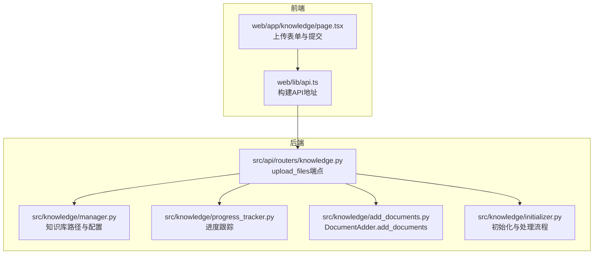
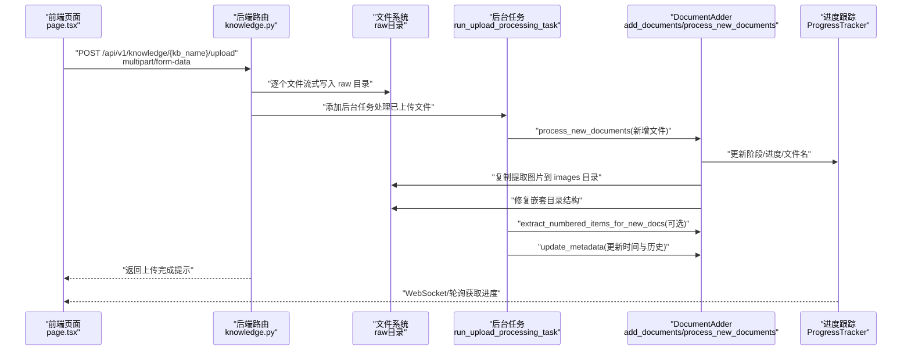
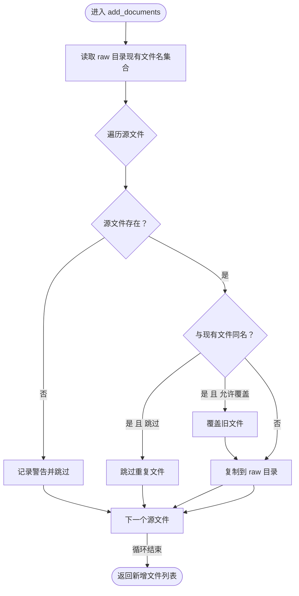
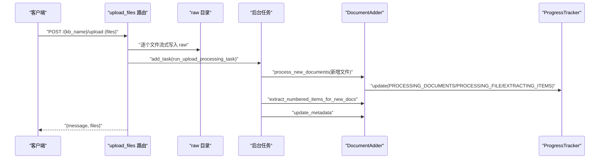
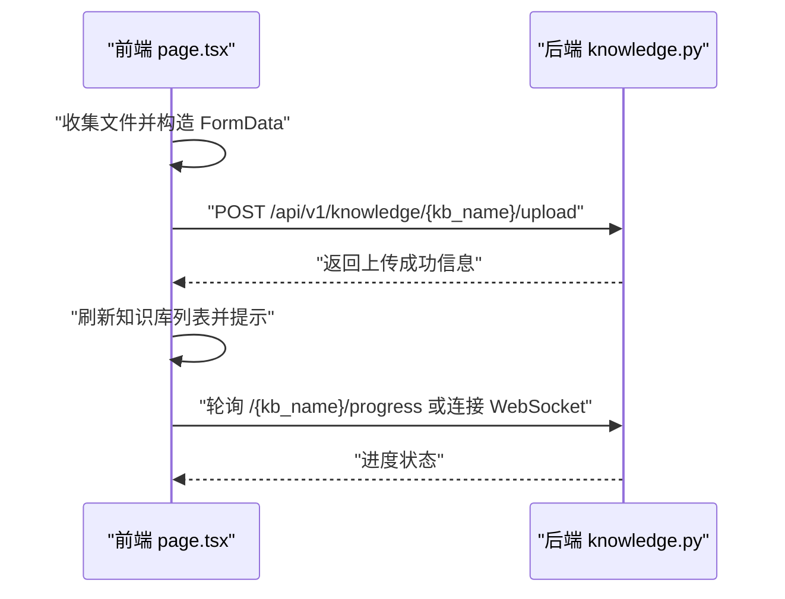
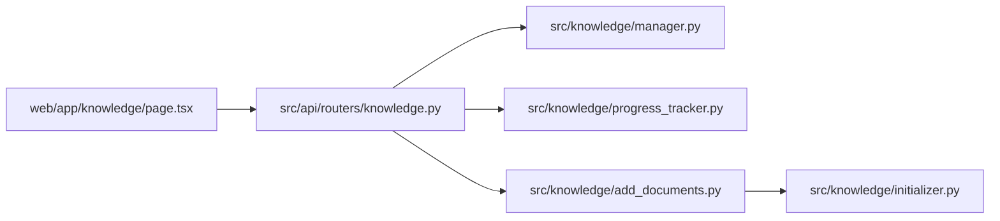

# 文档添加

<cite>
**本文引用的文件列表**
- [add_documents.py](file://src/knowledge/add_documents.py)
- [knowledge.py](file://src/api/routers/knowledge.py)
- [example_add_documents.py](file://src/knowledge/example_add_documents.py)
- [page.tsx](file://web/app/knowledge/page.tsx)
- [api.ts](file://web/lib/api.ts)
- [manager.py](file://src/knowledge/manager.py)
- [progress_tracker.py](file://src/knowledge/progress_tracker.py)
- [initializer.py](file://src/knowledge/initializer.py)
</cite>

## 目录
1. [简介](#简介)
2. [项目结构](#项目结构)
3. [核心组件](#核心组件)
4. [架构总览](#架构总览)
5. [详细组件分析](#详细组件分析)
6. [依赖关系分析](#依赖关系分析)
7. [性能考量](#性能考量)
8. [故障排查指南](#故障排查指南)
9. [结论](#结论)
10. [附录](#附录)

## 简介
本章节面向“文档添加”功能，围绕以下目标展开：
- 深入解析 DocumentAdder 类的 add_documents 方法，说明如何将用户上传的 PDF、DOCX 等格式文档安全地复制到知识库的 raw 目录。
- 详述文件验证机制：源文件存在性检查与重复文件处理策略（跳过或覆盖）。
- 结合 API 路由中的 upload_files 端点，阐述文件上传的完整流程：多文件处理、流式写入与后台任务调度。
- 提供前端上传组件与后端处理的集成示例路径，以及常见文件兼容性问题与解决方案。

## 项目结构
该功能涉及后端知识库管理、API 路由、进度跟踪、以及前端上传页面与工具函数。下图给出与“文档添加”相关的关键模块与交互关系：

图表来源
- [knowledge.py](file://src/api/routers/knowledge.py#L296-L344)
- [manager.py](file://src/knowledge/manager.py#L79-L114)
- [progress_tracker.py](file://src/knowledge/progress_tracker.py#L27-L66)
- [add_documents.py](file://src/knowledge/add_documents.py#L89-L131)
- [initializer.py](file://src/knowledge/initializer.py#L160-L366)
- [page.tsx](file://web/app/knowledge/page.tsx#L444-L471)
- [api.ts](file://web/lib/api.ts#L1-L59)

章节来源
- [knowledge.py](file://src/api/routers/knowledge.py#L296-L344)
- [manager.py](file://src/knowledge/manager.py#L79-L114)
- [progress_tracker.py](file://src/knowledge/progress_tracker.py#L27-L66)
- [add_documents.py](file://src/knowledge/add_documents.py#L89-L131)
- [initializer.py](file://src/knowledge/initializer.py#L160-L366)
- [page.tsx](file://web/app/knowledge/page.tsx#L444-L471)
- [api.ts](file://web/lib/api.ts#L1-L59)

## 核心组件
- DocumentAdder：负责将新文档复制到知识库 raw 目录，并可选择性地对新增文档进行处理、提取编号条目、修复目录结构、更新元数据。
- API 路由 knowledge.py：提供 /{kb_name}/upload 端点，接收多文件上传并异步处理；同时提供进度查询与 WebSocket 实时推送。
- 进度跟踪 ProgressTracker：统一记录与广播处理阶段、百分比、当前/总数、文件名、错误信息等。
- 知识库管理器 KnowledgeBaseManager：提供知识库路径、raw 目录、统计信息等辅助能力。
- 前端页面与工具：page.tsx 构建表单并使用 api.ts 生成 API 地址，提交至后端。

章节来源
- [add_documents.py](file://src/knowledge/add_documents.py#L44-L131)
- [knowledge.py](file://src/api/routers/knowledge.py#L296-L344)
- [progress_tracker.py](file://src/knowledge/progress_tracker.py#L27-L66)
- [manager.py](file://src/knowledge/manager.py#L79-L114)
- [page.tsx](file://web/app/knowledge/page.tsx#L444-L471)
- [api.ts](file://web/lib/api.ts#L1-L59)

## 架构总览
下面以序列图展示“上传并处理文档”的端到端流程：

图表来源
- [knowledge.py](file://src/api/routers/knowledge.py#L296-L344)
- [knowledge.py](file://src/api/routers/knowledge.py#L108-L171)
- [add_documents.py](file://src/knowledge/add_documents.py#L132-L321)
- [progress_tracker.py](file://src/knowledge/progress_tracker.py#L119-L172)
- [page.tsx](file://web/app/knowledge/page.tsx#L444-L471)

## 详细组件分析

### DocumentAdder.add_documents：文件复制与去重策略
- 功能要点
  - 将源文件列表复制到知识库的 raw 目录。
  - 通过读取现有文件名集合实现重复检测。
  - 支持“跳过重复”或“允许覆盖”的策略。
  - 记录日志并返回新增文件路径列表。
- 关键行为
  - 源文件存在性检查：若不存在则跳过并记录警告。
  - 重复文件处理：同名文件在“跳过”模式下直接忽略；在“覆盖”模式下会覆盖旧文件。
  - 复制采用安全复制策略，确保文件完整性。
- 复杂度与性能
  - 时间复杂度：O(n)，n 为源文件数量；重复检测基于集合查找 O(1)。
  - 空间复杂度：O(m)，m 为 raw 目录已有文件数（用于去重集合）。
- 错误处理
  - 对不存在的源文件发出警告并跳过。
  - 对覆盖场景发出警告提示。
- 典型调用路径
  - 命令行入口：参见 [add_documents.py](file://src/knowledge/add_documents.py#L588-L617)
  - 示例脚本：参见 [example_add_documents.py](file://src/knowledge/example_add_documents.py#L33-L50)

图表来源
- [add_documents.py](file://src/knowledge/add_documents.py#L89-L131)

章节来源
- [add_documents.py](file://src/knowledge/add_documents.py#L89-L131)
- [example_add_documents.py](file://src/knowledge/example_add_documents.py#L33-L50)

### API 路由 upload_files：多文件上传与后台处理
- 多文件处理
  - 使用 FastAPI 的 File(...) 接收多个 UploadFile。
  - 逐个写入 raw 目录，使用流式写入避免大文件内存占用。
- 后台任务调度
  - 通过 BackgroundTasks 添加 run_upload_processing_task，异步执行后续处理。
  - 任务内创建 ProgressTracker 并传入 DocumentAdder，实现进度上报。
- 返回响应
  - 立即返回上传完成提示，不阻塞请求线程。
- 错误处理
  - 知识库不存在时返回 404。
  - 其他异常捕获并返回 500。

图表来源
- [knowledge.py](file://src/api/routers/knowledge.py#L296-L344)
- [knowledge.py](file://src/api/routers/knowledge.py#L108-L171)

章节来源
- [knowledge.py](file://src/api/routers/knowledge.py#L296-L344)
- [knowledge.py](file://src/api/routers/knowledge.py#L108-L171)

### 进度跟踪与实时反馈
- ProgressStage 定义了初始化、处理文档、处理单文件、提取编号条目、完成、错误等阶段。
- ProgressTracker 支持：
  - 更新阶段、消息、当前/总数、文件名、错误信息。
  - 文件持久化与回调通知。
  - WebSocket 广播（通过 ProgressBroadcaster），前端可轮询或订阅。
- 在 upload_files 与 run_upload_processing_task 中均有使用，确保用户可感知处理进度。

章节来源
- [progress_tracker.py](file://src/knowledge/progress_tracker.py#L27-L66)
- [progress_tracker.py](file://src/knowledge/progress_tracker.py#L119-L172)
- [knowledge.py](file://src/api/routers/knowledge.py#L108-L171)

### 目录结构修复与图片复制
- 处理完成后，从 RAG 存储中复制提取出的图片到知识库 images 目录。
- 修复嵌套目录结构：将嵌套 auto/images 与 *_content_list.json 移动到正确位置，并清理临时目录。
- 保证最终目录结构整洁，便于后续检索与展示。

章节来源
- [add_documents.py](file://src/knowledge/add_documents.py#L302-L396)

### 编号条目提取与元数据更新
- 对新增文档生成的内容列表进行编号条目提取，支持批量大小控制。
- 更新知识库元数据文件，记录最后更新时间与操作历史（如 add_documents）。

章节来源
- [add_documents.py](file://src/knowledge/add_documents.py#L397-L487)

### 前端上传组件与后端集成
- 前端页面使用 HTML 表单与 FormData，将多个文件以 files 字段提交。
- 使用 api.ts 构造 API 地址，确保与后端配置一致。
- 成功后刷新知识库列表并弹窗提示，随后可通过 WebSocket 或轮询获取进度。

图表来源
- [page.tsx](file://web/app/knowledge/page.tsx#L444-L471)
- [api.ts](file://web/lib/api.ts#L1-L59)
- [knowledge.py](file://src/api/routers/knowledge.py#L424-L448)
- [knowledge.py](file://src/api/routers/knowledge.py#L450-L535)

章节来源
- [page.tsx](file://web/app/knowledge/page.tsx#L444-L471)
- [api.ts](file://web/lib/api.ts#L1-L59)

## 依赖关系分析
- 组件耦合
  - knowledge.py 依赖 DocumentAdder、KnowledgeBaseManager、ProgressTracker。
  - DocumentAdder 依赖 RAGAnything 配置与模型/嵌入函数，以及本地目录结构。
  - 前端仅依赖后端提供的 API 与 WebSocket。
- 外部依赖
  - LLM 与嵌入服务：通过 get_llm_config 获取模型与密钥。
  - RAGAnything：文档解析、内容提取与知识图谱插入。
- 潜在循环依赖
  - 当前模块间通过导入与延迟初始化避免循环依赖。

图表来源
- [knowledge.py](file://src/api/routers/knowledge.py#L296-L344)
- [manager.py](file://src/knowledge/manager.py#L79-L114)
- [progress_tracker.py](file://src/knowledge/progress_tracker.py#L27-L66)
- [add_documents.py](file://src/knowledge/add_documents.py#L132-L321)
- [initializer.py](file://src/knowledge/initializer.py#L160-L366)

章节来源
- [knowledge.py](file://src/api/routers/knowledge.py#L296-L344)
- [manager.py](file://src/knowledge/manager.py#L79-L114)
- [progress_tracker.py](file://src/knowledge/progress_tracker.py#L27-L66)
- [add_documents.py](file://src/knowledge/add_documents.py#L132-L321)
- [initializer.py](file://src/knowledge/initializer.py#L160-L366)

## 性能考量
- 流式写入：后端使用 copyfileobj 将上传文件流式写入磁盘，避免一次性加载到内存，适合大文件。
- 异步处理：上传完成后立即返回，处理逻辑放入后台任务，降低请求延迟。
- 批量处理：编号条目提取支持批量大小参数，可根据资源情况调整。
- I/O 优化：重复文件跳过与去重集合查找为 O(1)，减少不必要的磁盘写入。
- 日志与进度：统一的日志与进度输出有助于定位性能瓶颈与异常。

## 故障排查指南
- 常见错误与定位
  - 知识库不存在：后端返回 404，检查知识库名称与路径。
  - LLM 配置缺失：命令行工具要求设置 API 密钥，否则报错。
  - 源文件不存在：add_documents 会跳过并记录警告，确认文件路径。
  - 重复文件：默认跳过；如需覆盖，请在命令行或业务逻辑中允许覆盖。
  - 处理失败：ProgressTracker 会记录错误阶段与错误信息，前端可通过 WebSocket 或轮询获取。
- 前端提示
  - 若无法连接后端，前端会提示检查环境变量与启动命令。
  - 请求超时：检查网络与服务器负载。
- 建议排查步骤
  - 查看后端日志与进度文件（.progress.json）。
  - 确认 raw 目录权限与磁盘空间。
  - 检查 LLM 服务连通性与配额。
  - 如需清理，可使用知识库管理器提供的清理与重试手段。

章节来源
- [knowledge.py](file://src/api/routers/knowledge.py#L296-L344)
- [add_documents.py](file://src/knowledge/add_documents.py#L545-L552)
- [page.tsx](file://web/app/knowledge/page.tsx#L444-L471)

## 结论
“文档添加”功能通过清晰的职责划分与异步处理实现了高可用的文档入库与处理链路。后端以 DocumentAdder 为核心，结合 API 路由、进度跟踪与知识库管理，形成完整的上传—处理—反馈闭环；前端通过简单表单即可完成多文件上传，并通过 WebSocket 或轮询获得实时进度。针对重复文件与源文件有效性，系统提供了明确的策略与日志提示，便于运维与用户理解。

## 附录

### 文件格式支持与兼容性建议
- 支持格式
  - 初始化与增量处理均扫描以下扩展名：pdf、docx、doc、txt、md。
- 常见问题与建议
  - 图片/表格/公式解析：启用图像、表格与公式处理，提升解析质量。
  - 加密或受保护文档：可能无法解析，建议先解密或转换为开放格式。
  - 超长文本：适当增大批处理大小，平衡吞吐与稳定性。
  - 大文件：利用流式写入与异步处理，避免阻塞请求。
  - 权限与路径：确保后端进程对 data/knowledge_bases 具备读写权限。

章节来源
- [initializer.py](file://src/knowledge/initializer.py#L170-L174)
- [add_documents.py](file://src/knowledge/add_documents.py#L144-L150)