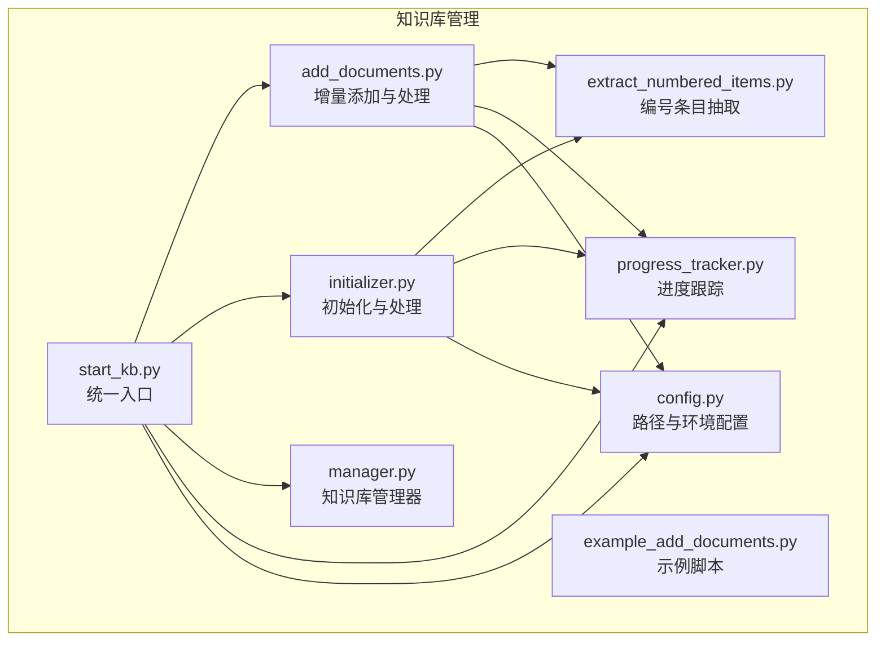
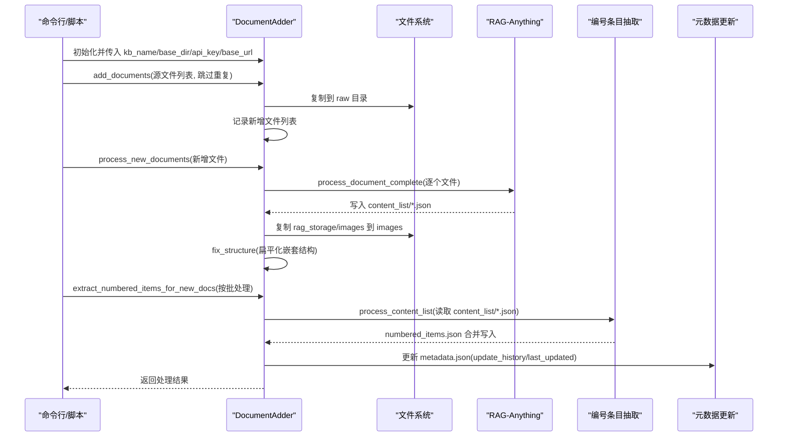
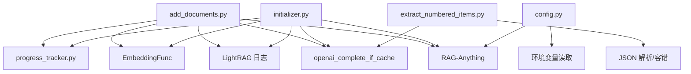

# 文档管理

<cite>
**本文引用的文件**
- [add_documents.py](file://src/knowledge/add_documents.py)
- [initializer.py](file://src/knowledge/initializer.py)
- [extract_numbered_items.py](file://src/knowledge/extract_numbered_items.py)
- [start_kb.py](file://src/knowledge/start_kb.py)
- [manager.py](file://src/knowledge/manager.py)
- [progress_tracker.py](file://src/knowledge/progress_tracker.py)
- [config.py](file://src/knowledge/config.py)
- [example_add_documents.py](file://src/knowledge/example_add_documents.py)
</cite>

## 目录
1. [简介](#简介)
2. [项目结构](#项目结构)
3. [核心组件](#核心组件)
4. [架构总览](#架构总览)
5. [详细组件分析](#详细组件分析)
6. [依赖关系分析](#依赖关系分析)
7. [性能考量](#性能考量)
8. [故障排查指南](#故障排查指南)
9. [结论](#结论)
10. [附录](#附录)

## 简介
本文件围绕“文档管理”能力进行系统化说明，重点覆盖以下目标：
- 解析 add_documents.py 中的文件上传与复制逻辑，说明如何将 PDF、DOCX 等格式文档安全地添加到知识库的 raw 目录。
- 深入分析 copy_documents 方法（来自 initializer.py）的实现细节，包括文件验证、复制操作与错误处理。
- 结合 initializer.py 的 process_documents 流程，阐述文档预处理流程，包括 RAG-Anything 集成、内容提取与结构化存储。
- 说明 content_list 目录的 JSON 输出格式及其在后续检索中的作用。
- 提供实际代码示例路径，展示文档添加的完整工作流。
- 列出常见文件兼容性问题及解决方案。

## 项目结构
知识库相关模块位于 src/knowledge 目录，主要文件职责如下：
- add_documents.py：增量添加文档，支持复制到 raw 目录、调用 RAG-Anything 处理并生成 content_list、复制图片、修复结构、更新元数据。
- initializer.py：初始化知识库，创建目录结构、复制文档、使用 RAG-Anything 处理、提取编号条目、统计信息与结构修复。
- extract_numbered_items.py：从 content_list 中抽取编号条目（定义、定理、公式、图、表等），并输出 numbered_items.json。
- start_kb.py：统一入口脚本，提供 list/info/set-default/init/extract/delete/clean-rag/refresh 等命令。
- manager.py：知识库管理器，提供多 KB 列表、默认 KB 设置、路径查询、统计信息、删除 KB、清理 RAG 存储等。
- progress_tracker.py：进度跟踪器，记录阶段、消息、当前/总数、文件名、百分比、时间戳，并可广播至前端或保存到文件。
- config.py：统一路径与环境变量配置，确保 RAG-Anything 可用路径注入。
- example_add_documents.py：演示如何以编程方式调用 DocumentAdder 完成增量添加。

图表来源
- [add_documents.py](file://src/knowledge/add_documents.py#L1-L120)
- [initializer.py](file://src/knowledge/initializer.py#L1-L120)
- [extract_numbered_items.py](file://src/knowledge/extract_numbered_items.py#L1-L120)
- [start_kb.py](file://src/knowledge/start_kb.py#L1-L120)
- [manager.py](file://src/knowledge/manager.py#L1-L120)
- [progress_tracker.py](file://src/knowledge/progress_tracker.py#L1-L120)
- [config.py](file://src/knowledge/config.py#L1-L66)
- [example_add_documents.py](file://src/knowledge/example_add_documents.py#L1-L60)

章节来源
- [add_documents.py](file://src/knowledge/add_documents.py#L1-L120)
- [initializer.py](file://src/knowledge/initializer.py#L1-L120)
- [extract_numbered_items.py](file://src/knowledge/extract_numbered_items.py#L1-L120)
- [start_kb.py](file://src/knowledge/start_kb.py#L1-L120)
- [manager.py](file://src/knowledge/manager.py#L1-L120)
- [progress_tracker.py](file://src/knowledge/progress_tracker.py#L1-L120)
- [config.py](file://src/knowledge/config.py#L1-L66)
- [example_add_documents.py](file://src/knowledge/example_add_documents.py#L1-L60)

## 核心组件
- DocumentAdder（add_documents.py）
  - 负责：校验知识库存在性、定位 raw/images/rag_storage/content_list 目录；复制新文件到 raw；调用 RAG-Anything 处理新增文档；复制提取的图片；修复嵌套结构；抽取编号条目；更新元数据。
- KnowledgeBaseInitializer（initializer.py）
  - 负责：创建目录结构与 metadata；复制文档到 raw；使用 RAG-Anything 处理；复制图片；修复结构；统计信息；抽取编号条目。
- extract_numbered_items（extract_numbered_items.py）
  - 负责：读取 content_list.json，批量调用 LLM 抽取编号条目，合并输出 numbered_items.json。
- ProgressTracker（progress_tracker.py）
  - 负责：记录阶段、消息、进度百分比、文件名、时间戳，支持回调与文件持久化。
- KnowledgeBaseManager（manager.py）
  - 负责：多知识库管理、默认 KB 设置、路径查询、统计信息、删除 KB、清理 RAG 存储。
- start_kb（start_kb.py）
  - 负责：统一命令行入口，封装 list/info/set-default/init/extract/delete/clean-rag/refresh 等子命令。
- config（config.py）
  - 负责：统一路径、RAG-Anything 路径检查、环境变量读取。

章节来源
- [add_documents.py](file://src/knowledge/add_documents.py#L44-L131)
- [initializer.py](file://src/knowledge/initializer.py#L47-L112)
- [extract_numbered_items.py](file://src/knowledge/extract_numbered_items.py#L762-L800)
- [progress_tracker.py](file://src/knowledge/progress_tracker.py#L27-L120)
- [manager.py](file://src/knowledge/manager.py#L12-L120)
- [start_kb.py](file://src/knowledge/start_kb.py#L1-L120)
- [config.py](file://src/knowledge/config.py#L1-L66)

## 架构总览
下图展示了“增量添加文档”的端到端流程，包括文件复制、RAG-Anything 处理、内容列表生成、图片复制与结构修复、编号条目抽取以及元数据更新。

图表来源
- [add_documents.py](file://src/knowledge/add_documents.py#L89-L131)
- [add_documents.py](file://src/knowledge/add_documents.py#L132-L321)
- [add_documents.py](file://src/knowledge/add_documents.py#L323-L452)
- [extract_numbered_items.py](file://src/knowledge/extract_numbered_items.py#L762-L800)

章节来源
- [add_documents.py](file://src/knowledge/add_documents.py#L89-L131)
- [add_documents.py](file://src/knowledge/add_documents.py#L132-L321)
- [add_documents.py](file://src/knowledge/add_documents.py#L323-L452)
- [extract_numbered_items.py](file://src/knowledge/extract_numbered_items.py#L762-L800)

## 详细组件分析

### 组件一：文件上传与复制（add_documents.py）
- 功能要点
  - 校验知识库是否存在与是否已初始化（存在 rag_storage 才视为已初始化）。
  - 获取现有文件集合，避免重复添加（可选择跳过或允许覆盖）。
  - 将源文件复制到知识库的 raw 目录，记录成功添加的文件列表。
  - 支持命令行参数控制：跳过处理、跳过编号条目抽取、批大小等。
- 关键实现路径
  - 知识库与目录结构校验与初始化：[add_documents.py](file://src/knowledge/add_documents.py#L44-L88)
  - 新增文件去重与复制：[add_documents.py](file://src/knowledge/add_documents.py#L89-L131)
  - 命令行入口与参数解析：[add_documents.py](file://src/knowledge/add_documents.py#L528-L621)

章节来源
- [add_documents.py](file://src/knowledge/add_documents.py#L44-L131)
- [add_documents.py](file://src/knowledge/add_documents.py#L528-L621)

### 组件二：copy_documents 方法（initializer.py）
- 功能要点
  - 将指定文档复制到知识库的 raw 目录，包含源文件存在性检查与日志记录。
  - 返回复制成功的文件路径列表。
- 关键实现路径
  - 复制逻辑与日志：[initializer.py](file://src/knowledge/initializer.py#L142-L159)

章节来源
- [initializer.py](file://src/knowledge/initializer.py#L142-L159)

### 组件三：文档预处理流程（initializer.py process_documents）
- 功能要点
  - 发现 raw 目录下的文档（支持 pdf/docx/doc/txt/md）。
  - 创建 RAG-Anything 配置，定义 LLM/Vision/Embedding 函数。
  - 使用 RAG-Anything 的 process_document_complete 对每个文档执行解析、内容提取与插入。
  - 自动保存 content_list/*.json 并复制提取的图片到 images 目录。
  - 修复嵌套结构（将 auto 下的 content_list 与 images 移动到顶层）。
  - 显示统计信息（实体、关系、文本块数量）。
- 关键实现路径
  - 文档发现与进度更新：[initializer.py](file://src/knowledge/initializer.py#L170-L188)
  - RAG 配置与函数定义：[initializer.py](file://src/knowledge/initializer.py#L190-L302)
  - 文档处理循环与 content_list 保存：[initializer.py](file://src/knowledge/initializer.py#L307-L348)
  - 图片复制与结构修复：[initializer.py](file://src/knowledge/initializer.py#L349-L366)
  - 结构修复（扁平化）：[initializer.py](file://src/knowledge/initializer.py#L367-L443)
  - 统计信息显示：[initializer.py](file://src/knowledge/initializer.py#L525-L567)

章节来源
- [initializer.py](file://src/knowledge/initializer.py#L170-L348)
- [initializer.py](file://src/knowledge/initializer.py#L349-L443)
- [initializer.py](file://src/knowledge/initializer.py#L525-L567)

### 组件四：RAG-Anything 集成与内容提取
- 集成方式
  - 通过 RAGAnythingConfig 指定工作目录（rag_storage），开启图像/表格/公式处理。
  - 定义 llm_model_func/vision_model_func/embedding_func，统一使用 openai_complete_if_cache/openai_embed。
  - 调用 process_document_complete(file_path, output_dir, parse_method="auto")，自动解析并生成 content_list。
- 关键实现路径
  - RAG 配置与函数定义（初始化与增量处理一致）：[add_documents.py](file://src/knowledge/add_documents.py#L144-L248)
  - RAG 配置与函数定义（初始化）：[initializer.py](file://src/knowledge/initializer.py#L190-L302)
  - 文档处理调用（初始化）：[initializer.py](file://src/knowledge/initializer.py#L307-L348)
  - 文档处理调用（增量）：[add_documents.py](file://src/knowledge/add_documents.py#L281-L301)

章节来源
- [add_documents.py](file://src/knowledge/add_documents.py#L144-L248)
- [initializer.py](file://src/knowledge/initializer.py#L190-L302)
- [initializer.py](file://src/knowledge/initializer.py#L307-L348)
- [add_documents.py](file://src/knowledge/add_documents.py#L281-L301)

### 组件五：content_list 目录的 JSON 输出格式与作用
- 输出位置与命名
  - 每个原始文档经 RAG-Anything 处理后，会在 content_list 目录生成一个与原文件同名的 JSON 文件（如 chapter.pdf 对应 chapter.json）。
- 结构与字段
  - JSON 数组，元素为内容项（text/equation/image/table 等），每项包含类型、文本、页码、坐标、图片路径、标题层级等字段。
  - 编号条目抽取会基于该 JSON 进行识别与合并，最终输出 numbered_items.json。
- 在检索中的作用
  - content_list 是结构化的内容载体，便于后续抽取编号条目、构建索引与检索。
  - numbered_items.json 作为检索增强的数据源，提供可直接引用的编号条目（定义、定理、公式、图、表等）。

章节来源
- [initializer.py](file://src/knowledge/initializer.py#L321-L333)
- [add_documents.py](file://src/knowledge/add_documents.py#L290-L295)
- [extract_numbered_items.py](file://src/knowledge/extract_numbered_items.py#L762-L800)

### 组件六：编号条目抽取（extract_numbered_items.py）
- 工作流程
  - 读取 content_list.json，构建待抽取的“纯文本/带编号公式/带编号图”序列。
  - 分批调用 LLM，识别编号条目并返回 JSON 数组。
  - 对于非纯文本项（如公式、图），优先使用 LLM 提供的完整文本；对于纯文本，使用边界判定算法（LLM 判断连续性）扩展完整内容。
  - 合并写入 numbered_items.json（除首个文件外，其余文件采用追加合并策略）。
- 关键实现路径
  - 批量抽取与 LLM 调用：[extract_numbered_items.py](file://src/knowledge/extract_numbered_items.py#L346-L539)
  - 边界判定与内容拼接：[extract_numbered_items.py](file://src/knowledge/extract_numbered_items.py#L173-L262)
  - JSON 解析与容错：[extract_numbered_items.py](file://src/knowledge/extract_numbered_items.py#L443-L471)
  - 入口函数 process_content_list：[extract_numbered_items.py](file://src/knowledge/extract_numbered_items.py#L762-L800)

章节来源
- [extract_numbered_items.py](file://src/knowledge/extract_numbered_items.py#L173-L262)
- [extract_numbered_items.py](file://src/knowledge/extract_numbered_items.py#L346-L539)
- [extract_numbered_items.py](file://src/knowledge/extract_numbered_items.py#L762-L800)

### 组件七：结构修复与图片复制（add_documents.py fix_structure）
- 功能要点
  - 将 RAG-Anything 生成的嵌套目录（doc_dir/auto/_content_list.json 与 images）移动到顶层 content_list 与 images。
  - 清理临时嵌套目录，避免冗余。
- 关键实现路径
  - 结构修复与图片迁移：[add_documents.py](file://src/knowledge/add_documents.py#L323-L396)

章节来源
- [add_documents.py](file://src/knowledge/add_documents.py#L323-L396)

### 组件八：元数据更新（add_documents.py update_metadata）
- 功能要点
  - 读取 metadata.json，更新 last_updated 与 update_history（记录时间戳、动作类型、新增文件数）。
- 关键实现路径
  - 元数据更新：[add_documents.py](file://src/knowledge/add_documents.py#L453-L486)

章节来源
- [add_documents.py](file://src/knowledge/add_documents.py#L453-L486)

### 组件九：进度跟踪（progress_tracker.py）
- 功能要点
  - 记录阶段（初始化/处理文档/处理单文件/抽取编号条目/完成/错误）、消息、当前/总数、文件名、百分比、时间戳。
  - 支持回调与文件持久化（.progress.json），便于前端轮询或日志追踪。
- 关键实现路径
  - 进度枚举与类定义：[progress_tracker.py](file://src/knowledge/progress_tracker.py#L27-L66)
  - 更新与通知：[progress_tracker.py](file://src/knowledge/progress_tracker.py#L119-L172)

章节来源
- [progress_tracker.py](file://src/knowledge/progress_tracker.py#L27-L66)
- [progress_tracker.py](file://src/knowledge/progress_tracker.py#L119-L172)

### 组件十：统一入口与管理（start_kb.py、manager.py）
- start_kb.py
  - 提供 list/info/set-default/init/extract/delete/clean-rag/refresh 等命令，封装各模块能力。
- manager.py
  - 提供多知识库管理、默认 KB 设置、路径查询、统计信息、删除 KB、清理 RAG 存储等。
- 关键实现路径
  - 命令入口与 init/extract/refresh 等子流程：[start_kb.py](file://src/knowledge/start_kb.py#L357-L535)
  - 知识库管理器方法：[manager.py](file://src/knowledge/manager.py#L12-L261)

章节来源
- [start_kb.py](file://src/knowledge/start_kb.py#L357-L535)
- [manager.py](file://src/knowledge/manager.py#L12-L261)

## 依赖关系分析
- add_documents.py 依赖
  - RAG-Anything（process_document_complete）、LightRAG 日志上下文、嵌入与 LLM 调用函数、进度跟踪器、编号条目抽取工具。
- initializer.py 依赖
  - RAG-Anything（process_document_complete）、LightRAG 日志上下文、嵌入与 LLM 调用函数、进度跟踪器、编号条目抽取工具。
- extract_numbered_items.py 依赖
  - LLM 调用函数、JSON 解析与容错、事件循环兼容处理。
- progress_tracker.py 依赖
  - 日志系统、回调机制、WebSocket 广播（可选）。
- config.py 依赖
  - 项目根路径、RAG-Anything 路径、环境变量读取。

图表来源
- [add_documents.py](file://src/knowledge/add_documents.py#L144-L248)
- [initializer.py](file://src/knowledge/initializer.py#L190-L302)
- [extract_numbered_items.py](file://src/knowledge/extract_numbered_items.py#L52-L120)
- [config.py](file://src/knowledge/config.py#L1-L66)

章节来源
- [add_documents.py](file://src/knowledge/add_documents.py#L144-L248)
- [initializer.py](file://src/knowledge/initializer.py#L190-L302)
- [extract_numbered_items.py](file://src/knowledge/extract_numbered_items.py#L52-L120)
- [config.py](file://src/knowledge/config.py#L1-L66)

## 性能考量
- 批处理与并发
  - 编号条目抽取采用分批与并发（最大并发可配置），提升大规模 content_list 的处理效率。
- I/O 与复制
  - 复制 raw 与 images 时尽量避免重复文件（去重/覆盖策略），减少磁盘写入与冲突。
- RAG-Anything 工作目录
  - 将 working_dir 指向 rag_storage，避免跨设备复制带来的性能损耗。
- 进度与可观测性
  - 使用 ProgressTracker 记录阶段与百分比，便于前端实时反馈与任务监控。

[本节为通用指导，不直接分析具体文件]

## 故障排查指南
- 常见错误与定位
  - 知识库不存在或未初始化：检查 kb_name 是否正确，确认 rag_storage 是否存在。
    - 参考：[add_documents.py](file://src/knowledge/add_documents.py#L59-L74)
  - 源文件不存在：检查源路径与权限。
    - 参考：[add_documents.py](file://src/knowledge/add_documents.py#L108-L111)
  - 无文档可处理：确认 raw 目录扩展名匹配（pdf/docx/doc/txt/md）。
    - 参考：[initializer.py](file://src/knowledge/initializer.py#L170-L174)
  - API Key 缺失：命令行或环境变量需提供 LLM_BINDING_API_KEY 或 --api-key。
    - 参考：[add_documents.py](file://src/knowledge/add_documents.py#L547-L552)
  - RAG-Anything 路径缺失：确保 RAG-Anything 模块路径已注入。
    - 参考：[config.py](file://src/knowledge/config.py#L44-L56)
- 错误处理与日志
  - 所有异常均记录日志并打印堆栈，便于定位。
    - 参考：[add_documents.py](file://src/knowledge/add_documents.py#L296-L301)
    - 参考：[initializer.py](file://src/knowledge/initializer.py#L334-L348)
- 结构修复失败
  - 若嵌套目录清理失败，检查权限与文件是否存在。
    - 参考：[add_documents.py](file://src/knowledge/add_documents.py#L387-L394)

章节来源
- [add_documents.py](file://src/knowledge/add_documents.py#L59-L74)
- [add_documents.py](file://src/knowledge/add_documents.py#L108-L111)
- [initializer.py](file://src/knowledge/initializer.py#L170-L174)
- [add_documents.py](file://src/knowledge/add_documents.py#L547-L552)
- [config.py](file://src/knowledge/config.py#L44-L56)
- [add_documents.py](file://src/knowledge/add_documents.py#L296-L301)
- [initializer.py](file://src/knowledge/initializer.py#L334-L348)
- [add_documents.py](file://src/knowledge/add_documents.py#L387-L394)

## 结论
本方案通过“增量添加 + RAG-Anything 预处理 + 编号条目抽取 + 结构修复 + 元数据更新”的闭环流程，实现了对 PDF、DOCX 等格式文档的安全、高效与可追溯的知识库构建。content_list 与 numbered_items 为后续检索与问答提供了高质量的结构化数据基础。配合进度跟踪与统一入口，用户可在命令行或程序化方式下灵活完成知识库的维护与扩展。

[本节为总结性内容，不直接分析具体文件]

## 附录

### 实际代码示例（路径）
- 增量添加单个文档
  - 示例函数：[example_add_documents.py](file://src/knowledge/example_add_documents.py#L20-L51)
- 增量添加多个文档
  - 示例函数：[example_add_documents.py](file://src/knowledge/example_add_documents.py#L52-L90)
- 从目录批量添加
  - 示例函数：[example_add_documents.py](file://src/knowledge/example_add_documents.py#L91-L128)
- 仅复制不处理（稍后手动处理）
  - 示例函数：[example_add_documents.py](file://src/knowledge/example_add_documents.py#L129-L151)
- 检查现有文件
  - 示例函数：[example_add_documents.py](file://src/knowledge/example_add_documents.py#L152-L166)
- 完整错误处理示例
  - 示例函数：[example_add_documents.py](file://src/knowledge/example_add_documents.py#L167-L214)

章节来源
- [example_add_documents.py](file://src/knowledge/example_add_documents.py#L20-L214)

### 常见文件兼容性问题与解决方案
- PDF/DOCX/DOC/TXT/MD 扩展名
  - 问题：扩展名不匹配导致未被发现。
  - 解决：确保使用支持的扩展名，或在目录扫描时包含对应通配符。
  - 参考：[initializer.py](file://src/knowledge/initializer.py#L170-L174)
- 图像/公式/表格解析
  - 问题：图像/公式/表格未正确提取。
  - 解决：确认 RAG-Anything 配置已启用相应处理开关；检查 LLM API Key 与网络连通。
  - 参考：[initializer.py](file://src/knowledge/initializer.py#L190-L196)
- JSON 解析失败
  - 问题：LLM 返回的 JSON 不规范。
  - 解决：使用内置 JSON 容错（严格模式、ast.literal_eval 等回退策略）。
  - 参考：[extract_numbered_items.py](file://src/knowledge/extract_numbered_items.py#L443-L471)
- 权限与路径
  - 问题：文件复制失败或目录不存在。
  - 解决：检查目录权限与路径；确保 rag_storage、content_list、images 目录存在且可写。
  - 参考：[add_documents.py](file://src/knowledge/add_documents.py#L63-L74)

章节来源
- [initializer.py](file://src/knowledge/initializer.py#L170-L174)
- [initializer.py](file://src/knowledge/initializer.py#L190-L196)
- [extract_numbered_items.py](file://src/knowledge/extract_numbered_items.py#L443-L471)
- [add_documents.py](file://src/knowledge/add_documents.py#L63-L74)