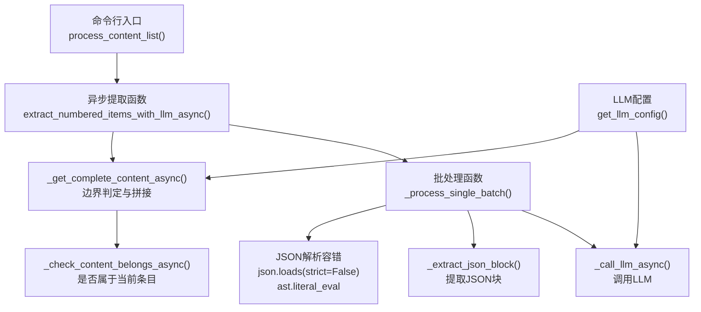
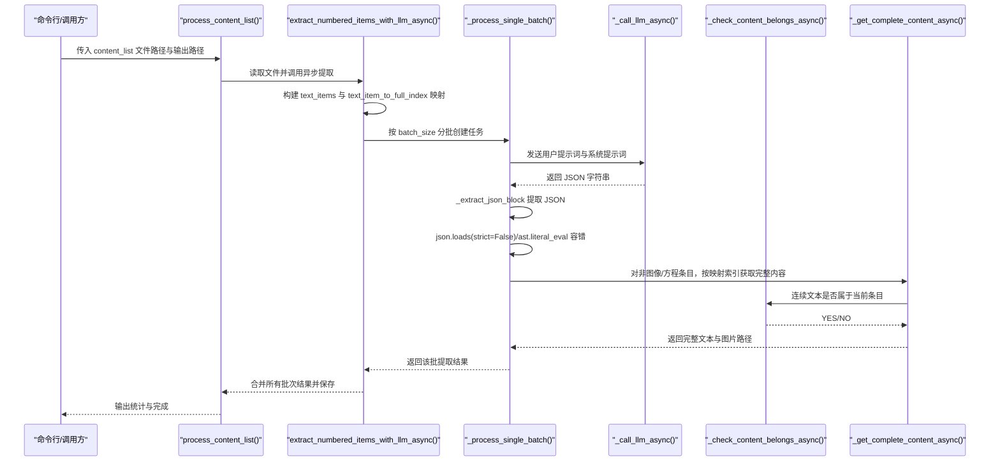
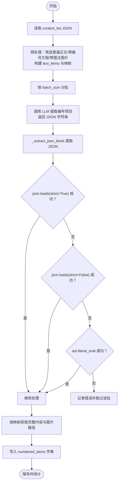
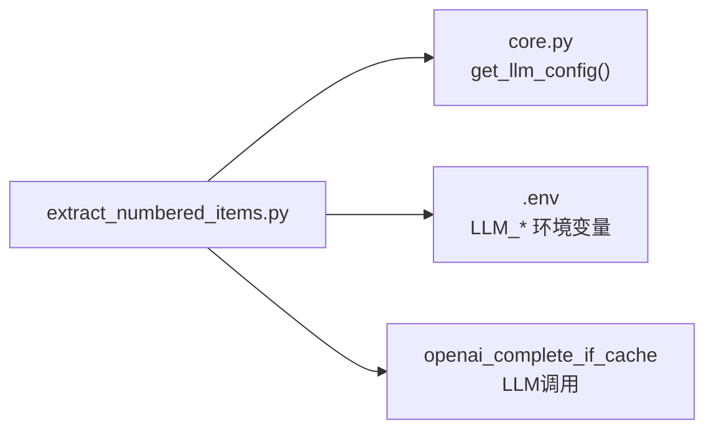

# LLM内容识别

<cite>
**本文引用的文件**
- [extract_numbered_items.py](file://src/knowledge/extract_numbered_items.py)
- [core.py](file://src/core/core.py)
</cite>

## 目录
1. [简介](#简介)
2. [项目结构](#项目结构)
3. [核心组件](#核心组件)
4. [架构总览](#架构总览)
5. [详细组件分析](#详细组件分析)
6. [依赖关系分析](#依赖关系分析)
7. [性能考量](#性能考量)
8. [故障排查指南](#故障排查指南)
9. [结论](#结论)
10. [附录](#附录)

## 简介
本文件围绕知识库内容识别与提取功能展开，重点解析 extract_numbered_items.py 中的 extract_numbered_items_with_llm 函数，说明其如何通过 LLM 批量识别文档中的定义、命题、定理、方程等带编号项目；详细阐述系统提示词（system_prompt）中对不同编号项目的识别规则；解释批处理机制如何将 content_items 分批发送给 LLM 并通过 text_item_to_full_index 映射保持索引一致性；说明 JSON 响应解析过程中的容错策略（如 strict=False 解析、ast.literal_eval 备用方案等）；并提供完整工作流示例与常见识别错误及解决方案。

## 项目结构
该功能位于 src/knowledge 目录下，核心入口为 extract_numbered_items.py，其中包含异步/同步两套接口，以及命令行主程序。LLM 配置由 src/core/core.py 提供统一读取能力。

图表来源
- [extract_numbered_items.py](file://src/knowledge/extract_numbered_items.py#L541-L760)
- [extract_numbered_items.py](file://src/knowledge/extract_numbered_items.py#L346-L539)
- [extract_numbered_items.py](file://src/knowledge/extract_numbered_items.py#L117-L171)
- [extract_numbered_items.py](file://src/knowledge/extract_numbered_items.py#L173-L262)
- [core.py](file://src/core/core.py#L40-L72)

章节来源
- [extract_numbered_items.py](file://src/knowledge/extract_numbered_items.py#L541-L760)
- [core.py](file://src/core/core.py#L40-L72)

## 核心组件
- 异步提取函数：extract_numbered_items_with_llm_async
  - 负责构建文本子集、建立索引映射、分批并发调用 LLM、合并结果并统计类型分布。
- 批处理函数：_process_single_batch
  - 将一批文本组合为提示词，调用 LLM 返回 JSON 结果，执行 JSON 容错解析，并根据映射获取完整内容与图片路径。
- 辅助函数：
  - _call_llm_async：封装 LLM 调用，支持从统一配置读取模型参数。
  - _extract_json_block：从可能包含代码块标记的文本中提取 JSON 片段。
  - _get_complete_content_async/_check_content_belongs_async：判断后续文本/公式/图像是否属于当前条目，用于边界判定与内容拼接。
  - 同步包装器：extract_numbered_items_with_llm，兼容事件循环环境。

章节来源
- [extract_numbered_items.py](file://src/knowledge/extract_numbered_items.py#L541-L760)
- [extract_numbered_items.py](file://src/knowledge/extract_numbered_items.py#L346-L539)
- [extract_numbered_items.py](file://src/knowledge/extract_numbered_items.py#L117-L171)
- [extract_numbered_items.py](file://src/knowledge/extract_numbered_items.py#L173-L262)
- [core.py](file://src/core/core.py#L40-L72)

## 架构总览
以下序列图展示了从输入 content_items 到输出编号项目字典的完整流程。

图表来源
- [extract_numbered_items.py](file://src/knowledge/extract_numbered_items.py#L762-L853)
- [extract_numbered_items.py](file://src/knowledge/extract_numbered_items.py#L541-L760)
- [extract_numbered_items.py](file://src/knowledge/extract_numbered_items.py#L346-L539)
- [extract_numbered_items.py](file://src/knowledge/extract_numbered_items.py#L117-L171)
- [extract_numbered_items.py](file://src/knowledge/extract_numbered_items.py#L173-L262)

## 详细组件分析

### 系统提示词与识别规则
系统提示词明确要求 LLM 识别以下类型的编号项目：
- Definition（定义）
- Proposition（命题）
- Theorem（定理）
- Lemma（引理）
- Corollary（推论）
- Example（例子）
- Remark（注记）
- Figure（图）
- Equation（方程，含标签如 \tag{x.y.z}）
- Table（表）

同时强调：
- 不要提取章节标题或标题级文本；
- 方程标签需提取为仅包含括号内编号的形式，例如 "(1.2.1)"；
- 图片编号从图注中提取；
- 返回严格有效的 JSON 数组，且 LaTeX 反斜杠在 JSON 中需转义为双反斜杠。

这些规则直接体现在 _process_single_batch 的 system_prompt 与 user_prompt 中，确保 LLM 在结构化输出上保持一致。

章节来源
- [extract_numbered_items.py](file://src/knowledge/extract_numbered_items.py#L366-L428)

### 批处理与并发控制
- 文本预处理：仅保留普通正文（text_level==0），并将带编号的方程与带图注的图片转换为“虚拟文本项”，统一纳入 text_items。
- 索引映射：text_item_to_full_index 将 text_items 的相对索引映射到原始 content_items 的绝对索引，保证后续按原顺序定位完整内容。
- 分批策略：按 batch_size 切分 text_items，生成多个批次任务。
- 并发控制：使用 asyncio.Semaphore 控制最大并发数，避免 LLM 限速或资源争用。
- 结果聚合：使用 asyncio.gather 并发等待所有批次完成，再合并到最终字典。

章节来源
- [extract_numbered_items.py](file://src/knowledge/extract_numbered_items.py#L563-L677)

### JSON 响应解析与容错机制
- JSON 提取：_extract_json_block 支持去除代码块标记，优先返回最靠前的 JSON 对象或数组。
- 严格模式失败后的两层容错：
  - 使用 json.loads(strict=False) 解析非严格 JSON；
  - 若仍失败，则尝试 ast.literal_eval 将字符串形式的 Python 字面量安全地解析为对象。
- 结果校验：若返回非数组或 identifier 缺失，跳过该条目；否则按 index 与映射关系定位原文本，补充完整内容与图片路径。

章节来源
- [extract_numbered_items.py](file://src/knowledge/extract_numbered_items.py#L442-L475)
- [extract_numbered_items.py](file://src/knowledge/extract_numbered_items.py#L476-L539)

### 内容边界判定与完整内容拼接
- 对于非图像/方程的条目，LLM 返回的 full_text 可能不完整；此时通过 _get_complete_content_async 智能拼接：
  - 连续的方程文本直接追加；
  - 图像路径收集；
  - 图注文本可选追加；
  - 正文连续性通过 _check_content_belongs_async 判定，遇到标题级文本或判定为独立条目时停止。
- 该过程避免将不同条目误拼接，提升抽取准确性。

章节来源
- [extract_numbered_items.py](file://src/knowledge/extract_numbered_items.py#L173-L262)
- [extract_numbered_items.py](file://src/knowledge/extract_numbered_items.py#L117-L171)

### LLM 调用与配置
- 统一配置：get_llm_config 从环境变量读取绑定提供商、模型名、API Key、Base URL，并进行必要校验。
- 调用封装：_call_llm_async 支持动态模型选择、超时与温度参数，内部通过 openai_complete_if_cache 实现缓存与异步调用。

章节来源
- [core.py](file://src/core/core.py#L40-L72)
- [extract_numbered_items.py](file://src/knowledge/extract_numbered_items.py#L52-L80)

### 工作流示例（步骤化）
以下流程图展示一次完整的工作流，从输入 content_list 到输出 numbered_items.json 的关键步骤。

图表来源
- [extract_numbered_items.py](file://src/knowledge/extract_numbered_items.py#L762-L853)
- [extract_numbered_items.py](file://src/knowledge/extract_numbered_items.py#L346-L539)
- [extract_numbered_items.py](file://src/knowledge/extract_numbered_items.py#L442-L475)

## 依赖关系分析
- 内部依赖
  - extract_numbered_items.py 依赖 src/core/core.py 的 get_llm_config 获取 LLM 配置。
  - 使用 lightrag.llm.openai.openai_complete_if_cache 进行 LLM 调用。
- 外部依赖
  - 环境变量：LLM_MODEL、LLM_BINDING_API_KEY、LLM_BINDING_HOST。
  - 第三方库：json、ast、asyncio、dotenv、pathlib、argparse 等。

图表来源
- [extract_numbered_items.py](file://src/knowledge/extract_numbered_items.py#L20-L30)
- [core.py](file://src/core/core.py#L40-L72)

章节来源
- [extract_numbered_items.py](file://src/knowledge/extract_numbered_items.py#L20-L30)
- [core.py](file://src/core/core.py#L40-L72)

## 性能考量
- 批处理大小与并发度
  - batch_size 影响单次 LLM 调用的上下文长度与成本；过大可能导致上下文溢出或响应变慢。
  - max_concurrent 控制并发任务数量，避免 LLM 速率限制或本地资源瓶颈。
- 事件循环兼容
  - 当运行在 uvloop 或已有事件循环环境中，采用线程池方式创建新事件循环，避免 nest_asyncio 不兼容问题。
- 上下文拼接
  - 仅对非图像/方程条目进行完整内容拼接，减少不必要的 LLM 判定与网络开销。
- 日志与统计
  - 记录每批提取数量、类型分布与错误信息，便于性能优化与问题定位。

章节来源
- [extract_numbered_items.py](file://src/knowledge/extract_numbered_items.py#L541-L760)
- [extract_numbered_items.py](file://src/knowledge/extract_numbered_items.py#L679-L760)

## 故障排查指南
- LLM 配置缺失
  - 症状：启动时报错提示未设置 LLM_MODEL/LLM_BINDING_API_KEY/LLM_BINDING_HOST。
  - 处理：在 .env 中补齐三项配置，或通过命令行参数传入。
- LLM 返回非 JSON
  - 症状：初始 json.loads 抛异常，日志显示“Initial JSON parsing failed”。
  - 处理：检查 system_prompt 是否要求返回纯 JSON 数组；确认 LLM 输出未被截断；启用 strict=False 与 ast.literal_eval 备用方案。
- LLM 返回非数组
  - 症状：日志提示“LLM returned non-array”，跳过该批。
  - 处理：核对 user_prompt 的 JSON 结构约束；确保 identifier、type、full_text 字段齐全。
- 索引映射不一致
  - 症状：identifier 对应的完整内容不正确或图片路径缺失。
  - 处理：确认 text_item_to_full_index 的构建逻辑；检查 content_items 的类型与层级字段（如 text_level、type）。
- 并发环境冲突
  - 症状：在 uvloop 或已有事件循环中报错。
  - 处理：自动降级为线程池创建新事件循环的方式执行；或手动设置 max_concurrent 降低并发。
- 图注/方程标签未识别
  - 症状：图/方程未被提取或标识符为空。
  - 处理：确保 content_items 中存在 image_caption 或 equation 文本包含 \tag{...}；检查 system_prompt 中的特殊规则。

章节来源
- [extract_numbered_items.py](file://src/knowledge/extract_numbered_items.py#L914-L939)
- [extract_numbered_items.py](file://src/knowledge/extract_numbered_items.py#L442-L475)
- [extract_numbered_items.py](file://src/knowledge/extract_numbered_items.py#L563-L677)
- [extract_numbered_items.py](file://src/knowledge/extract_numbered_items.py#L679-L760)

## 结论
该实现通过系统化的提示词设计、严格的 JSON 容错解析与智能的内容边界判定，实现了对学术文本中各类编号项目的高准确率批量抽取。批处理与并发控制有效平衡了成本与效率，索引映射保障了结果与原文档的对应关系。建议在生产环境中结合日志统计持续优化 batch_size 与并发度，并完善输入数据质量以提升整体效果。

## 附录
- 关键实现位置参考
  - 批处理与 JSON 容错：[extract_numbered_items.py](file://src/knowledge/extract_numbered_items.py#L346-L539)
  - 内容边界判定：[extract_numbered_items.py](file://src/knowledge/extract_numbered_items.py#L117-L171)
  - 完整内容拼接：[extract_numbered_items.py](file://src/knowledge/extract_numbered_items.py#L173-L262)
  - LLM 配置读取：[core.py](file://src/core/core.py#L40-L72)