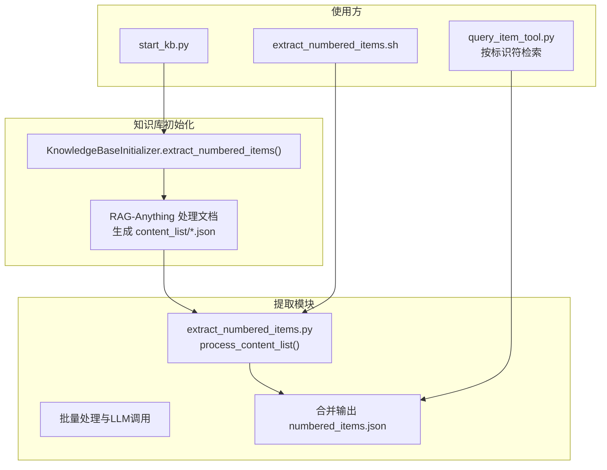
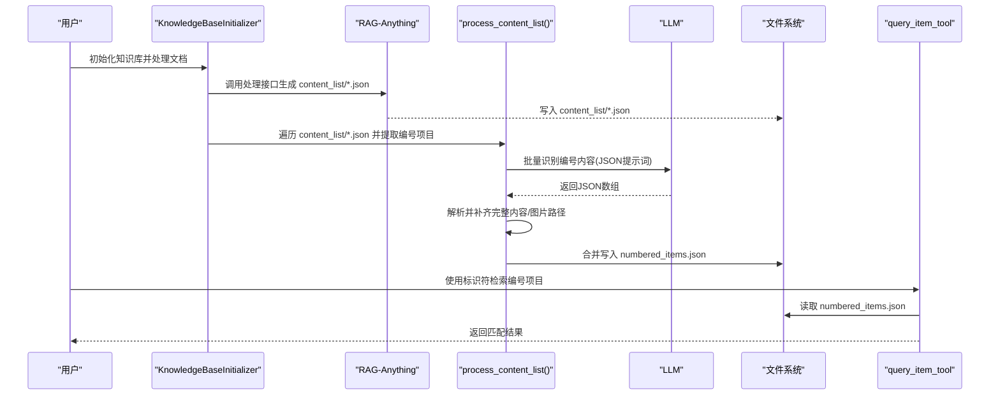
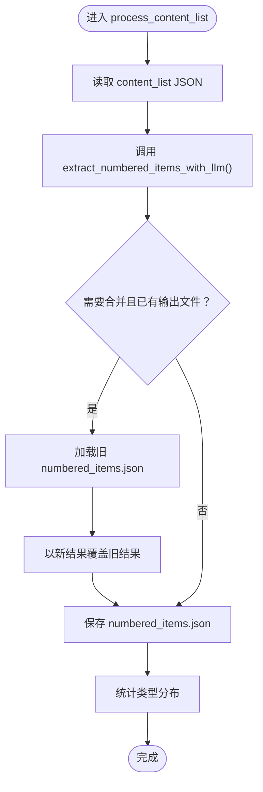
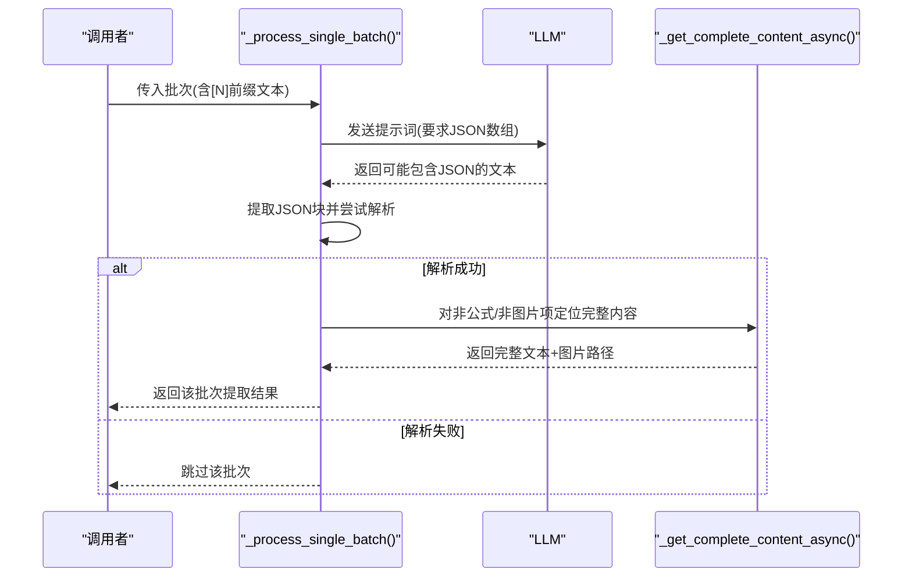
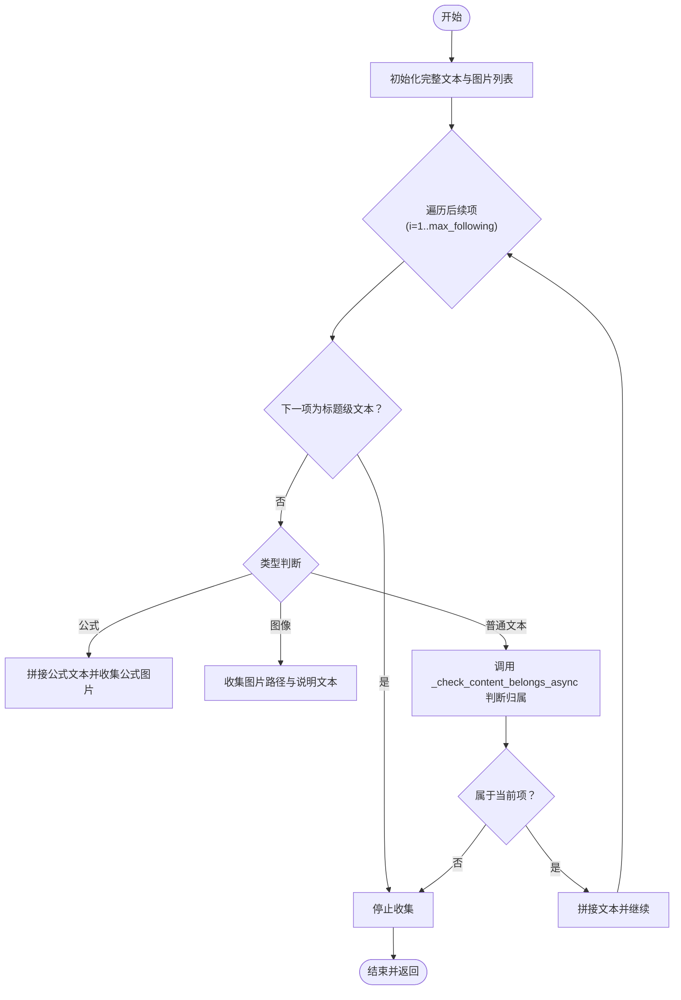
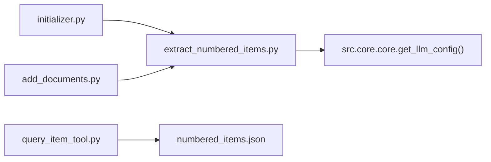

# 内容提取

<cite>
**本文引用的文件**
- [extract_numbered_items.py](file://src/knowledge/extract_numbered_items.py)
- [initializer.py](file://src/knowledge/initializer.py)
- [add_documents.py](file://src/knowledge/add_documents.py)
- [query_item_tool.py](file://src/tools/query_item_tool.py)
- [extract_numbered_items.sh](file://scripts/extract_numbered_items.sh)
- [start_kb.py](file://src/knowledge/start_kb.py)
</cite>

## 目录
1. [简介](#简介)
2. [项目结构](#项目结构)
3. [核心组件](#核心组件)
4. [架构总览](#架构总览)
5. [详细组件分析](#详细组件分析)
6. [依赖关系分析](#依赖关系分析)
7. [性能考量](#性能考量)
8. [故障排查指南](#故障排查指南)
9. [结论](#结论)
10. [附录](#附录)

## 简介
本文件围绕 DeepTutor 项目中的“内容提取”能力，系统性解析以下目标：
- 深入分析 extract_numbered_items.py 中 process_content_list 函数如何从处理后的文档 content_list 中提取定义、命题、定理、引理、推论、示例、注记、图、公式、表格等编号项目。
- 详解 extract_numbered_items_with_llm 函数如何通过 LLM 批量识别与提取编号内容，包括文本分批、提示工程（Prompt）与 JSON 结果解析。
- 结合 initializer.py 中 KnowledgeBaseInitializer 类的 extract_numbered_items 方法，阐述编号项目提取的完整流程。
- 说明 content_list 目录中 JSON 文件的结构及其在后续检索中的作用。
- 提供实际代码示例路径，展示内容提取的完整工作流，并列出常见提取错误及解决方案。

## 项目结构
内容提取功能主要分布在如下模块：
- src/knowledge/extract_numbered_items.py：编号项目提取的核心逻辑与命令行入口。
- src/knowledge/initializer.py：知识库初始化流程，包含自动提取编号项目的调用。
- src/knowledge/add_documents.py：增量添加文档时对新文档进行编号项目提取。
- src/tools/query_item_tool.py：基于 numbered_items.json 的查询工具，验证提取结果的可用性。
- scripts/extract_numbered_items.sh：便捷脚本，直接调用提取脚本。
- src/knowledge/start_kb.py：启动知识库时可选择执行提取流程。

图表来源
- [initializer.py](file://src/knowledge/initializer.py#L444-L515)
- [extract_numbered_items.py](file://src/knowledge/extract_numbered_items.py#L762-L853)
- [query_item_tool.py](file://src/tools/query_item_tool.py#L106-L140)
- [extract_numbered_items.sh](file://scripts/extract_numbered_items.sh#L1-L24)
- [start_kb.py](file://src/knowledge/start_kb.py#L194-L226)

章节来源
- [initializer.py](file://src/knowledge/initializer.py#L444-L515)
- [extract_numbered_items.py](file://src/knowledge/extract_numbered_items.py#L762-L853)
- [query_item_tool.py](file://src/tools/query_item_tool.py#L106-L140)
- [extract_numbered_items.sh](file://scripts/extract_numbered_items.sh#L1-L24)
- [start_kb.py](file://src/knowledge/start_kb.py#L194-L226)

## 核心组件
- process_content_list：读取单个 content_list JSON，调用 LLM 批量提取编号项目，并将结果写入 numbered_items.json；支持首次创建与后续合并。
- extract_numbered_items_with_llm / extract_numbered_items_with_llm_async：异步批量处理 content_list，构建提示词，调用 LLM，解析 JSON，补齐完整内容边界与图片路径。
- _process_single_batch：单批处理逻辑，负责拼接文本、构造提示词、调用 LLM、解析 JSON 并补全内容。
- _get_complete_content_async/_get_complete_content：根据起始索引，使用 LLM 判断后续文本/公式/图像是否属于同一编号项，智能拼接完整内容并收集图片路径。
- _check_content_belongs_async：判断候选文本块是否属于当前编号项。
- KnowledgeBaseInitializer.extract_numbered_items：在知识库初始化完成后，遍历 content_list 下的所有 JSON 文件，逐个调用 process_content_list 完成提取与合并。
- query_item_tool.query_numbered_item：从 numbered_items.json 中按标识符检索，支持精确匹配、前缀匹配与相似度建议。

章节来源
- [extract_numbered_items.py](file://src/knowledge/extract_numbered_items.py#L762-L853)
- [extract_numbered_items.py](file://src/knowledge/extract_numbered_items.py#L541-L759)
- [extract_numbered_items.py](file://src/knowledge/extract_numbered_items.py#L346-L539)
- [extract_numbered_items.py](file://src/knowledge/extract_numbered_items.py#L173-L262)
- [initializer.py](file://src/knowledge/initializer.py#L444-L515)
- [query_item_tool.py](file://src/tools/query_item_tool.py#L106-L140)

## 架构总览
下面的序列图展示了从知识库初始化到编号项目提取再到检索的整体流程。

图表来源
- [initializer.py](file://src/knowledge/initializer.py#L308-L348)
- [initializer.py](file://src/knowledge/initializer.py#L444-L515)
- [extract_numbered_items.py](file://src/knowledge/extract_numbered_items.py#L541-L759)
- [extract_numbered_items.py](file://src/knowledge/extract_numbered_items.py#L762-L853)
- [query_item_tool.py](file://src/tools/query_item_tool.py#L106-L140)

## 详细组件分析

### 组件A：process_content_list（从 content_list 提取编号项目）
- 输入：content_list JSON 文件路径、输出文件路径、API 密钥、基础 URL、批大小、是否合并。
- 主要步骤：
  - 读取 content_list JSON。
  - 调用 extract_numbered_items_with_llm 进行批量提取。
  - 若 merge 为真且输出文件已存在，则加载旧结果，以新结果覆盖同标识符条目，再保存。
  - 输出统计信息并返回提取结果字典。

图表来源
- [extract_numbered_items.py](file://src/knowledge/extract_numbered_items.py#L762-L853)

章节来源
- [extract_numbered_items.py](file://src/knowledge/extract_numbered_items.py#L762-L853)

### 组件B：extract_numbered_items_with_llm（LLM 批量识别与提取）
- 功能概述：将 content_list 中的纯文本、带编号的公式、带标题的图片作为“虚拟文本项”，构建批次，统一交给 LLM 识别编号内容。
- 关键点：
  - 文本映射：建立 text_items 与 content_items 的索引映射，用于后续完整内容拼接。
  - 批次构建：按 batch_size 切分 text_items，每个批次在提示词中以 [N] 前缀标注原始位置。
  - 提示工程：明确要求 LLM 返回仅包含指定字段的 JSON 数组，严格约束格式与转义。
  - JSON 解析：先尝试严格解析，失败则启用非严格模式或 ast.literal_eval 修复；最终过滤非法条目。
  - 完整内容拼接：对于非公式/非图片的普通文本，使用 _get_complete_content_async 智能判断后续内容是否属于同一编号项，拼接公式、图像与说明文字，并收集图片路径。
  - 图像与公式：对图片与带标签的公式，优先使用 LLM 提供的 full_text；否则回退到 content_items 对应索引的完整内容。
  - 并发控制：使用 asyncio.Semaphore 控制最大并发任务数，避免 LLM 资源争用。

图表来源
- [extract_numbered_items.py](file://src/knowledge/extract_numbered_items.py#L346-L539)
- [extract_numbered_items.py](file://src/knowledge/extract_numbered_items.py#L173-L262)

章节来源
- [extract_numbered_items.py](file://src/knowledge/extract_numbered_items.py#L541-L759)
- [extract_numbered_items.py](file://src/knowledge/extract_numbered_items.py#L346-L539)
- [extract_numbered_items.py](file://src/knowledge/extract_numbered_items.py#L173-L262)

### 组件C：_get_complete_content_async（智能拼接完整内容）
- 输入：content_items、起始索引、API 密钥、基础 URL、最大跟随检查数量。
- 行为：
  - 从起始项开始累积文本，同时收集起始项的图片路径。
  - 对后续项逐一判断：
    - 遇到标题级文本（text_level > 0）立即停止。
    - 公式项直接拼接到文本末尾，并收集公式图片路径。
    - 图像项收集图片路径与可选的图像说明文本。
    - 普通文本项通过 _check_content_belongs_async 判断是否属于当前编号项，若是则拼接，否则停止。
  - 返回完整文本与图片路径列表。

图表来源
- [extract_numbered_items.py](file://src/knowledge/extract_numbered_items.py#L173-L262)

章节来源
- [extract_numbered_items.py](file://src/knowledge/extract_numbered_items.py#L173-L262)

### 组件D：_check_content_belongs_async（内容归属判断）
- 输入：起始文本片段、候选文本片段、API 密钥、基础 URL。
- 行为：构造系统提示词与用户提示词，要求 LLM 回答 “YES/NO”，用于判断候选文本是否属于起始编号项。
- 默认策略：若 LLM 判定失败，默认不包含，保证保守性。

章节来源
- [extract_numbered_items.py](file://src/knowledge/extract_numbered_items.py#L117-L172)

### 组件E：KnowledgeBaseInitializer.extract_numbered_items（完整流程入口）
- 步骤：
  - 定位 content_list 目录下的所有 JSON 文件。
  - 遍历每个文件，首次调用 process_content_list 不合并，后续文件强制合并到同一 numbered_items.json。
  - 更新进度跟踪器，记录状态与错误。
- 作用：将 RAG-Anything 产出的 content_list 与提取流程串联起来，形成端到端的知识库编号项目提取管线。

章节来源
- [initializer.py](file://src/knowledge/initializer.py#L444-L515)

### 组件F：content_list 目录 JSON 结构与 numbered_items.json 用途
- content_list 目录 JSON：
  - 每个文档对应一个 JSON 文件，包含若干内容项（如 text、equation、image 等），每项通常包含：
    - type：内容类型（text/equation/image/table 等）
    - text：文本内容
    - page_idx：页码索引
    - img_path：图片路径
    - image_caption：图像说明
    - bbox：边界框（可选）
    - 其他与解析相关的元数据
- numbered_items.json：
  - 键：编号标识符（如 "Definition 1.1"、"(1.2.1)"、"Figure 1.1" 等）
  - 值：包含 text、type、page、img_paths 等字段的对象
  - 用途：作为后续检索与引用的基础数据源，query_item_tool 即基于此文件进行查询。

章节来源
- [extract_numbered_items.py](file://src/knowledge/extract_numbered_items.py#L762-L853)
- [query_item_tool.py](file://src/tools/query_item_tool.py#L106-L140)

## 依赖关系分析
- 外部依赖：
  - LLM 接口：通过 openai_complete_if_cache 调用，支持自定义模型、温度、最大 token 等参数。
  - 日志系统：统一使用 src.core.logging 获取日志器，便于集中管理。
  - 环境变量：LLM_BINDING_API_KEY、LLM_BINDING_HOST。
- 内部依赖：
  - extract_numbered_items.py 依赖 src.core.core 的 get_llm_config 获取模型配置。
  - initializer.py 与 add_documents.py 在知识库初始化/增量添加后调用提取流程。
  - query_item_tool 依赖 numbered_items.json 进行检索。

图表来源
- [extract_numbered_items.py](file://src/knowledge/extract_numbered_items.py#L20-L49)
- [initializer.py](file://src/knowledge/initializer.py#L444-L515)
- [add_documents.py](file://src/knowledge/add_documents.py#L397-L452)
- [query_item_tool.py](file://src/tools/query_item_tool.py#L106-L140)

章节来源
- [extract_numbered_items.py](file://src/knowledge/extract_numbered_items.py#L20-L49)
- [initializer.py](file://src/knowledge/initializer.py#L444-L515)
- [add_documents.py](file://src/knowledge/add_documents.py#L397-L452)
- [query_item_tool.py](file://src/tools/query_item_tool.py#L106-L140)

## 性能考量
- 批大小与并发：
  - batch_size 控制每批文本数量，过大可能导致 LLM 上下文溢出，过小增加调用次数。
  - max_concurrent 控制并发任务数，避免 LLM 限流或资源耗尽。
- 事件循环兼容：
  - 当运行环境已有事件循环（如 Jupyter/某些框架）时，采用 nest_asyncio 或线程池方式创建新的事件循环，确保异步调用稳定。
- JSON 解析鲁棒性：
  - 多种解析策略（严格/非严格/ast.literal_eval）提升 LLM 输出的容错性。
- 内容边界判定：
  - 使用 LLM 判断相邻文本是否属于同一编号项，减少人工规则复杂度，但会增加调用次数；可通过合理批大小与缓存策略优化。

[本节为通用指导，无需特定文件引用]

## 故障排查指南
- 缺少 API Key：
  - 现象：命令行报错提示未设置 LLM_BINDING_API_KEY。
  - 处理：设置环境变量或通过 --api-key 传入。
- content_list 目录不存在：
  - 现象：初始化/提取阶段提示目录不存在。
  - 处理：确认知识库初始化已完成，或手动创建 content_list 目录。
- content_list 文件为空或无 JSON：
  - 现象：扫描不到任何 JSON 文件。
  - 处理：检查 RAG-Anything 是否正确生成 content_list，或重新处理文档。
- LLM 返回非 JSON：
  - 现象：解析失败，日志显示尝试多种解析策略仍失败。
  - 处理：调整提示词、降低批大小、提高温度、检查模型响应稳定性。
- 合并冲突：
  - 现象：numbered_items.json 已存在但无法读取。
  - 处理：检查文件权限与编码，或关闭合并选项重新生成。
- 查询无结果：
  - 现象：query_item_tool 返回未找到，给出相似项建议。
  - 处理：核对标识符格式（如 "(1.2.1)" 与 "Definition 1.1"），尝试前缀匹配或模糊匹配。

章节来源
- [extract_numbered_items.py](file://src/knowledge/extract_numbered_items.py#L910-L970)
- [extract_numbered_items.py](file://src/knowledge/extract_numbered_items.py#L920-L948)
- [extract_numbered_items.py](file://src/knowledge/extract_numbered_items.py#L801-L825)
- [query_item_tool.py](file://src/tools/query_item_tool.py#L106-L140)

## 结论
本功能通过“结构化提示词 + 批量 LLM 调用 + 智能内容边界判定”的组合，实现了对学术文本中定义、命题、定理、公式、图、表等编号项目的高效提取。结合知识库初始化与增量添加流程，形成从文档解析到编号项目检索的闭环。实践中需关注批大小与并发、JSON 解析容错与事件循环兼容性，以获得稳定可靠的提取效果。

[本节为总结，无需特定文件引用]

## 附录

### 实际代码示例（路径）
- 从知识库初始化到提取的完整流程调用链：
  - 知识库初始化入口：[initializer.py](file://src/knowledge/initializer.py#L444-L515)
  - RAG-Anything 处理文档并生成 content_list：[initializer.py](file://src/knowledge/initializer.py#L308-L348)
  - 提取编号项目并合并输出：[extract_numbered_items.py](file://src/knowledge/extract_numbered_items.py#L762-L853)
  - 增量添加文档后的提取调用：[add_documents.py](file://src/knowledge/add_documents.py#L397-L452)
  - 命令行便捷脚本入口：[extract_numbered_items.sh](file://scripts/extract_numbered_items.sh#L1-L24)
  - 启动知识库时可选择执行提取：[start_kb.py](file://src/knowledge/start_kb.py#L194-L226)

### 常见提取错误与解决方案
- 错误：未设置 LLM API Key
  - 解决：设置 LLM_BINDING_API_KEY 或使用 --api-key 传入
  - 参考：[extract_numbered_items.py](file://src/knowledge/extract_numbered_items.py#L910-L919)
- 错误：content_list 目录不存在
  - 解决：确认知识库初始化已完成或手动创建目录
  - 参考：[extract_numbered_items.py](file://src/knowledge/extract_numbered_items.py#L926-L929)
- 错误：LLM 返回非标准 JSON
  - 解决：降低批大小、提高温度、检查模型响应；使用内置解析策略
  - 参考：[extract_numbered_items.py](file://src/knowledge/extract_numbered_items.py#L442-L471)
- 错误：合并 numbered_items.json 失败
  - 解决：检查文件权限与编码，或关闭合并选项
  - 参考：[extract_numbered_items.py](file://src/knowledge/extract_numbered_items.py#L801-L825)
- 错误：查询无结果
  - 解决：核对标识符格式与大小写，尝试前缀匹配或模糊匹配
  - 参考：[query_item_tool.py](file://src/tools/query_item_tool.py#L106-L140)