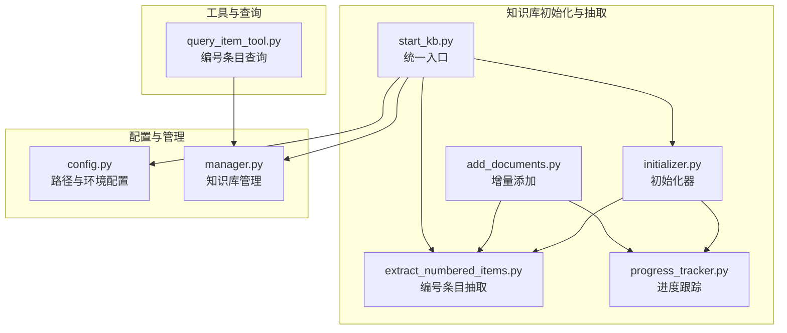
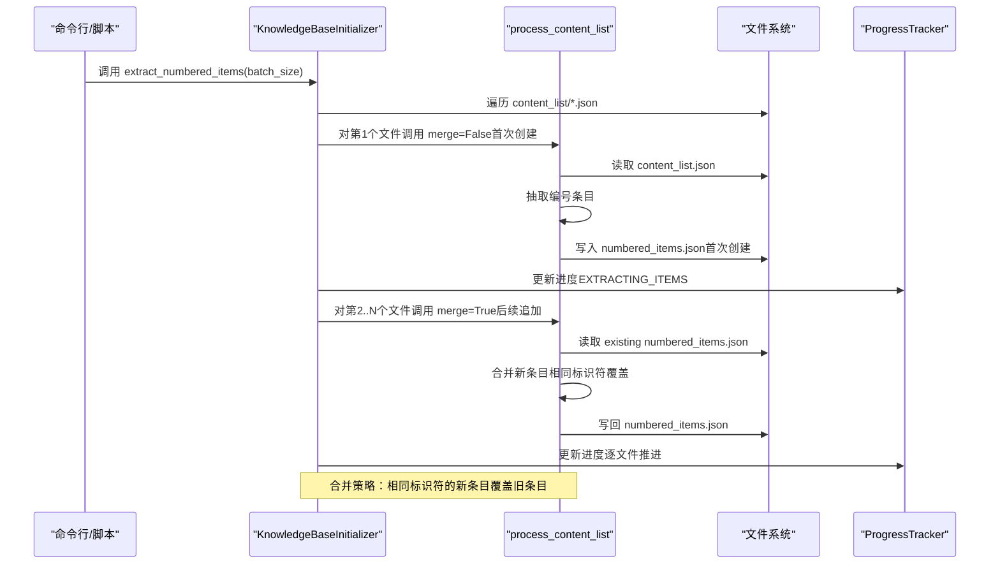
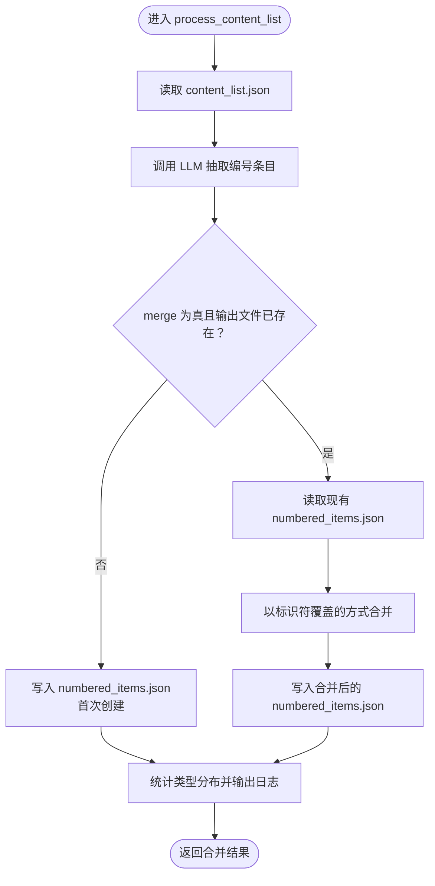
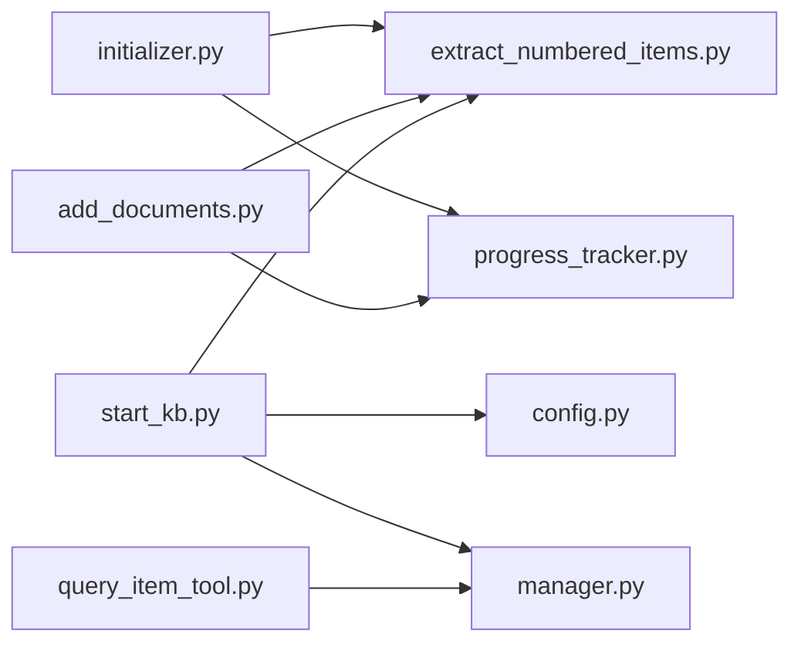

# 结果合并

<cite>
**本文引用的文件**
- [src/knowledge/initializer.py](file://src/knowledge/initializer.py)
- [src/knowledge/extract_numbered_items.py](file://src/knowledge/extract_numbered_items.py)
- [src/knowledge/progress_tracker.py](file://src/knowledge/progress_tracker.py)
- [src/knowledge/add_documents.py](file://src/knowledge/add_documents.py)
- [src/knowledge/start_kb.py](file://src/knowledge/start_kb.py)
- [src/knowledge/config.py](file://src/knowledge/config.py)
- [src/knowledge/manager.py](file://src/knowledge/manager.py)
- [src/tools/query_item_tool.py](file://src/tools/query_item_tool.py)
</cite>

## 目录
1. [简介](#简介)
2. [项目结构](#项目结构)
3. [核心组件](#核心组件)
4. [架构总览](#架构总览)
5. [详细组件分析](#详细组件分析)
6. [依赖关系分析](#依赖关系分析)
7. [性能考量](#性能考量)
8. [故障排查指南](#故障排查指南)
9. [结论](#结论)
10. [附录](#附录)

## 简介
本节聚焦“结果合并”能力，围绕 KnowledgeBaseInitializer 类的 extract_numbered_items 方法与 process_content_list 函数的 merge 参数，系统阐述多文件结果合并策略、首次创建与后续追加的差异、numbered_items.json 的结构设计与一致性保障、以及结合进度跟踪器的合并流程管理。同时给出完整工作流示例与常见冲突及解决方案，帮助读者在大规模知识库初始化与增量添加场景下高效、稳定地完成编号条目抽取与合并。

## 项目结构
本项目采用按功能域划分的模块化组织方式，知识库初始化与编号条目抽取位于 src/knowledge 目录；工具层提供查询等辅助能力；配置与管理模块统一路径与默认行为。

图表来源
- [src/knowledge/initializer.py](file://src/knowledge/initializer.py#L444-L524)
- [src/knowledge/extract_numbered_items.py](file://src/knowledge/extract_numbered_items.py#L762-L853)
- [src/knowledge/progress_tracker.py](file://src/knowledge/progress_tracker.py#L27-L192)
- [src/knowledge/add_documents.py](file://src/knowledge/add_documents.py#L397-L452)
- [src/knowledge/start_kb.py](file://src/knowledge/start_kb.py#L178-L241)
- [src/knowledge/config.py](file://src/knowledge/config.py#L1-L66)
- [src/knowledge/manager.py](file://src/knowledge/manager.py#L1-L120)
- [src/tools/query_item_tool.py](file://src/tools/query_item_tool.py#L106-L140)

章节来源
- [src/knowledge/initializer.py](file://src/knowledge/initializer.py#L444-L524)
- [src/knowledge/extract_numbered_items.py](file://src/knowledge/extract_numbered_items.py#L762-L853)
- [src/knowledge/progress_tracker.py](file://src/knowledge/progress_tracker.py#L27-L192)
- [src/knowledge/add_documents.py](file://src/knowledge/add_documents.py#L397-L452)
- [src/knowledge/start_kb.py](file://src/knowledge/start_kb.py#L178-L241)
- [src/knowledge/config.py](file://src/knowledge/config.py#L1-L66)
- [src/knowledge/manager.py](file://src/knowledge/manager.py#L1-L120)
- [src/tools/query_item_tool.py](file://src/tools/query_item_tool.py#L106-L140)

## 核心组件
- KnowledgeBaseInitializer.extract_numbered_items：遍历 content_list 文件，基于 merge 参数控制首次创建与后续追加，调用 process_content_list 完成合并。
- process_content_list：从 content_list 中抽取编号条目，根据 merge 决定是否与现有 numbered_items.json 合并，支持覆盖与统计输出。
- ProgressTracker：统一记录初始化阶段进度，便于前端或外部监控。
- DocumentAdder.extract_numbered_items_for_new_docs：在增量添加后，针对新增文档执行编号条目抽取并合并到现有结果。
- start_kb.extract：命令行入口，自动对多个 content_list 文件进行合并式抽取。

章节来源
- [src/knowledge/initializer.py](file://src/knowledge/initializer.py#L444-L524)
- [src/knowledge/extract_numbered_items.py](file://src/knowledge/extract_numbered_items.py#L762-L853)
- [src/knowledge/progress_tracker.py](file://src/knowledge/progress_tracker.py#L27-L192)
- [src/knowledge/add_documents.py](file://src/knowledge/add_documents.py#L397-L452)
- [src/knowledge/start_kb.py](file://src/knowledge/start_kb.py#L178-L241)

## 架构总览
下面以序列图展示“多文档结果合并”的端到端流程，涵盖初始化与增量添加两种场景。

图表来源
- [src/knowledge/initializer.py](file://src/knowledge/initializer.py#L444-L524)
- [src/knowledge/extract_numbered_items.py](file://src/knowledge/extract_numbered_items.py#L762-L853)
- [src/knowledge/progress_tracker.py](file://src/knowledge/progress_tracker.py#L27-L192)

## 详细组件分析

### KnowledgeBaseInitializer.extract_numbered_items 方法
- 功能：扫描 content_list 目录下的所有 JSON 文件，依次调用 process_content_list 进行编号条目抽取与合并。
- 合并策略：
  - 第一个文件：merge=False，直接创建 numbered_items.json。
  - 后续文件：merge=True，将新抽取的条目与现有 numbered_items.json 合并。
- 进度管理：使用 ProgressTracker 记录每个文件的处理状态与百分比，错误时更新为 ERROR 阶段。

章节来源
- [src/knowledge/initializer.py](file://src/knowledge/initializer.py#L444-L524)
- [src/knowledge/progress_tracker.py](file://src/knowledge/progress_tracker.py#L27-L192)

### process_content_list 函数的 merge 逻辑
- 输入参数：content_list_file、output_file、api_key、base_url、batch_size、merge。
- 处理流程：
  - 读取 content_list.json，调用 extract_numbered_items_with_llm 获取新条目集合。
  - 若 merge 为真且 output_file 已存在：
    - 读取现有 numbered_items.json。
    - 以“相同标识符覆盖”的策略合并，统计更新与新增数量。
  - 若 merge 为假或不存在旧文件，则直接写入新条目集合。
  - 输出统计信息并返回最终条目字典。

图表来源
- [src/knowledge/extract_numbered_items.py](file://src/knowledge/extract_numbered_items.py#L762-L853)

章节来源
- [src/knowledge/extract_numbered_items.py](file://src/knowledge/extract_numbered_items.py#L762-L853)

### numbered_items.json 的结构设计与一致性保障
- 结构：顶层为字典，键为“标识符”，值为包含文本、类型、页码、图片路径等字段的对象。
- 一致性保障：
  - 标识符唯一性：作为字典键，天然保证同一标识符只保留一份。
  - 覆盖策略：相同标识符的新条目覆盖旧条目，避免重复与冲突。
  - 数据完整性：当 LLM 提供完整文本时优先使用，否则通过边界判定函数补齐相关内容与图片路径。
- 查询验证：工具层通过读取该文件进行检索，若缺失则提示错误并建议检查初始化流程。

章节来源
- [src/knowledge/extract_numbered_items.py](file://src/knowledge/extract_numbered_items.py#L762-L853)
- [src/tools/query_item_tool.py](file://src/tools/query_item_tool.py#L106-L140)

### 增量添加场景的合并流程
- 新增文档后，仅对新增 content_list 文件执行抽取与合并。
- 合并策略：若 numbered_items.json 已存在，则 merge=True，实现“追加式合并”。

章节来源
- [src/knowledge/add_documents.py](file://src/knowledge/add_documents.py#L397-L452)

### 命令行入口的合并流程
- start_kb.extract 支持对指定知识库内所有 content_list 文件进行批量抽取，并自动对除首个文件外的其余文件设置 merge=True。

章节来源
- [src/knowledge/start_kb.py](file://src/knowledge/start_kb.py#L178-L241)

## 依赖关系分析
- 初始化器依赖抽取模块与进度跟踪模块，负责编排与状态上报。
- 抽取模块依赖 LLM 接口与 JSON 解析工具，内部实现并发批处理与边界判定。
- 管理与配置模块提供统一路径与环境变量读取，确保跨入口的一致行为。
- 工具层依赖管理模块提供的路径信息，读取 numbered_items.json 实现查询。

图表来源
- [src/knowledge/initializer.py](file://src/knowledge/initializer.py#L444-L524)
- [src/knowledge/extract_numbered_items.py](file://src/knowledge/extract_numbered_items.py#L762-L853)
- [src/knowledge/progress_tracker.py](file://src/knowledge/progress_tracker.py#L27-L192)
- [src/knowledge/add_documents.py](file://src/knowledge/add_documents.py#L397-L452)
- [src/knowledge/start_kb.py](file://src/knowledge/start_kb.py#L178-L241)
- [src/knowledge/config.py](file://src/knowledge/config.py#L1-L66)
- [src/knowledge/manager.py](file://src/knowledge/manager.py#L1-L120)
- [src/tools/query_item_tool.py](file://src/tools/query_item_tool.py#L106-L140)

## 性能考量
- 批处理与并发：抽取模块采用分批与信号量控制并发，提升吞吐并避免 LLM 资源争用。
- 边界判定：通过 LLM 判断相邻内容是否属于同一编号项，减少人工校验成本。
- 文件 I/O：合并前先读取旧文件，再一次性写回，降低多次写入开销。
- 大规模场景建议：
  - 合理设置 batch_size 与 max_concurrent，平衡吞吐与资源占用。
  - 在合并前对 content_list 进行预清洗，减少无效文本块，提高边界判定准确率。

[本节为通用指导，不直接分析具体文件]

## 故障排查指南
- numbered_items.json 缺失或为空：
  - 现象：查询工具报错提示文件不存在或无法读取。
  - 处理：确认初始化或增量添加流程已完成，检查 numbered_items.json 是否被正确写入。
- 合并后条目缺失或覆盖异常：
  - 现象：相同标识符的条目未按预期覆盖或出现重复。
  - 处理：检查标识符格式是否一致；确认 merge=True 且旧文件存在；核对抽取日志中的统计信息。
- LLM 返回非标准 JSON：
  - 现象：解析失败或部分批次跳过。
  - 处理：查看日志中“尝试修复”的提示；调整提示词或增加重试；必要时降低并发或增大超时。
- 进度未更新或回调失效：
  - 现象：前端无进度显示或进度文件未更新。
  - 处理：确认 ProgressTracker 的回调注册与文件保存逻辑；检查事件循环状态；必要时降级为文件轮询。

章节来源
- [src/tools/query_item_tool.py](file://src/tools/query_item_tool.py#L106-L140)
- [src/knowledge/extract_numbered_items.py](file://src/knowledge/extract_numbered_items.py#L762-L853)
- [src/knowledge/progress_tracker.py](file://src/knowledge/progress_tracker.py#L27-L192)

## 结论
通过 merge 参数与“相同标识符覆盖”的合并策略，系统实现了对多文档编号条目抽取结果的稳健合并。配合 ProgressTracker 的阶段化进度管理与工具层的查询验证，能够在大规模知识库初始化与增量添加场景下保持数据一致性与可追溯性。建议在生产环境中合理配置批大小与并发度，并对 content_list 进行必要的预处理，以进一步提升合并质量与稳定性。

[本节为总结性内容，不直接分析具体文件]

## 附录

### 实际工作流示例（路径参考）
- 初始化并合并多文档编号条目：
  - 调用路径：[src/knowledge/initializer.py](file://src/knowledge/initializer.py#L444-L524)
  - 关键步骤：遍历 content_list/*.json，对第1个文件 merge=False，其余 merge=True。
- 增量添加并合并新增文档：
  - 调用路径：[src/knowledge/add_documents.py](file://src/knowledge/add_documents.py#L397-L452)
  - 关键步骤：对新增 content_list 文件执行抽取，若 numbered_items.json 存在则 merge=True。
- 命令行批量抽取与合并：
  - 调用路径：[src/knowledge/start_kb.py](file://src/knowledge/start_kb.py#L178-L241)
  - 关键步骤：对指定知识库内所有 content_list 文件进行抽取，自动对除首个文件外设置 merge=True。

### 常见合并冲突与解决方案
- 标识符不一致：
  - 冲突：同一编号在不同文档中表达不一致（如“Definition 1.1”与“Definition 1.1.”）。
  - 解决：在抽取前对 content_list 进行标准化处理，统一编号格式后再合并。
- 文本截断与边界模糊：
  - 冲突：相邻文本是否属于同一编号项判断不一致。
  - 解决：提高 max_following 或优化提示词；必要时人工复核关键边界。
- 并发写入竞争：
  - 冲突：多进程/线程同时写入 numbered_items.json。
  - 解决：单点顺序执行合并；或引入锁机制（需评估性能影响）。
- LLM 解析失败：
  - 冲突：返回非标准 JSON 导致解析失败。
  - 解决：启用“严格模式”与“字面量解析”回退；记录原始响应以便人工校验。

章节来源
- [src/knowledge/initializer.py](file://src/knowledge/initializer.py#L444-L524)
- [src/knowledge/add_documents.py](file://src/knowledge/add_documents.py#L397-L452)
- [src/knowledge/start_kb.py](file://src/knowledge/start_kb.py#L178-L241)
- [src/knowledge/extract_numbered_items.py](file://src/knowledge/extract_numbered_items.py#L762-L853)