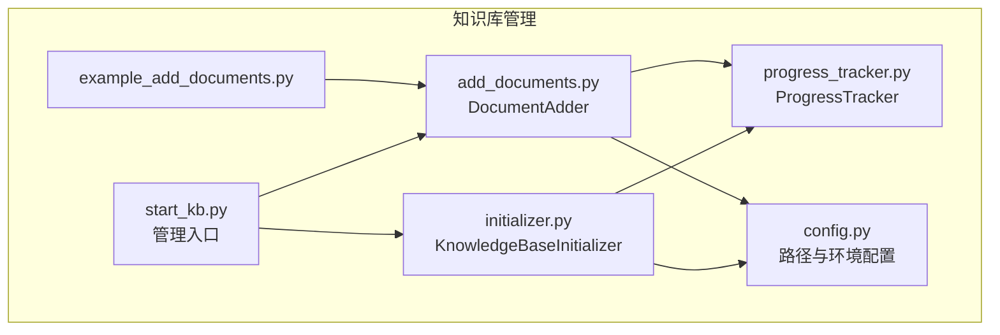
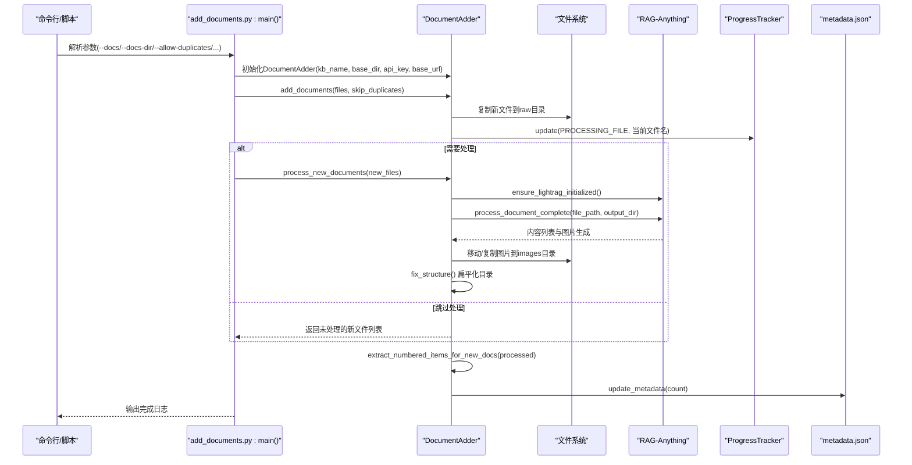
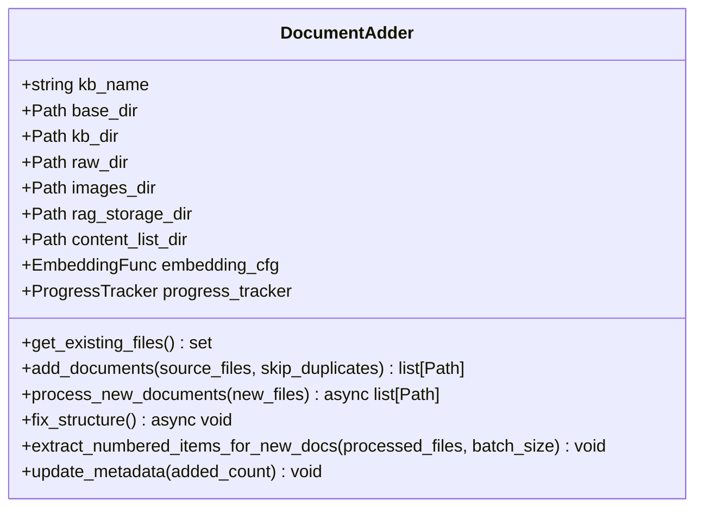
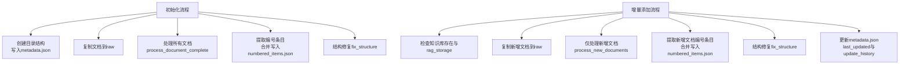
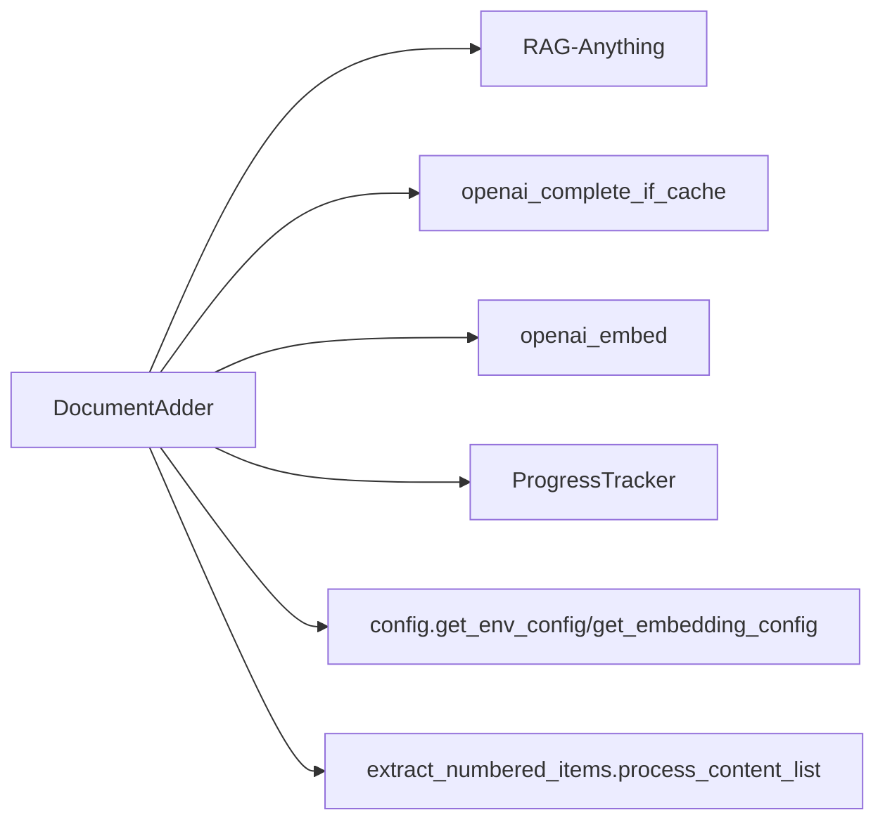

# 增量式文档添加

<cite>
**本文引用的文件**
- [add_documents.py](file://src/knowledge/add_documents.py)
- [initializer.py](file://src/knowledge/initializer.py)
- [example_add_documents.py](file://src/knowledge/example_add_documents.py)
- [progress_tracker.py](file://src/knowledge/progress_tracker.py)
- [config.py](file://src/knowledge/config.py)
- [start_kb.py](file://src/knowledge/start_kb.py)
</cite>

## 目录
1. [简介](#简介)
2. [项目结构](#项目结构)
3. [核心组件](#核心组件)
4. [架构总览](#架构总览)
5. [详细组件分析](#详细组件分析)
6. [依赖关系分析](#依赖关系分析)
7. [性能与可扩展性](#性能与可扩展性)
8. [故障排查指南](#故障排查指南)
9. [结论](#结论)
10. [附录：参数与最佳实践](#附录参数与最佳实践)

## 简介
本文件系统化阐述“增量式文档添加”机制在知识库中的实现方式，重点围绕以下目标：
- 解释如何在不重建整个知识图谱的前提下，向现有知识库添加新文档；
- 深入分析 DocumentAdder 类的 add_documents 与 process_new_documents 方法的工作流程；
- 说明 get_existing_files 如何检测重复文件，update_metadata 如何记录更新历史；
- 对比 initializer 中的初始化流程与增量添加流程的异同；
- 提供完整流程示例与 skip_duplicates 等参数的最佳实践建议。

## 项目结构
与增量式文档添加直接相关的模块位于 src/knowledge 目录，关键文件包括：
- add_documents.py：定义 DocumentAdder，负责新增文档的复制、处理、内容列表提取与元数据更新；
- initializer.py：定义 KnowledgeBaseInitializer，负责首次初始化知识库（目录结构、文档处理、RAG 构建、图片与内容列表整理）；
- example_add_documents.py：演示如何以编程方式调用 DocumentAdder 的完整流程；
- progress_tracker.py：统一的进度追踪器，支持回调与文件持久化；
- config.py：路径与环境配置工具；
- start_kb.py：知识库管理入口脚本，包含 refresh/clean 等命令，便于理解增量与全量刷新的关系。

图表来源
- [add_documents.py](file://src/knowledge/add_documents.py#L1-L120)
- [initializer.py](file://src/knowledge/initializer.py#L1-L120)
- [example_add_documents.py](file://src/knowledge/example_add_documents.py#L1-L60)
- [progress_tracker.py](file://src/knowledge/progress_tracker.py#L1-L80)
- [config.py](file://src/knowledge/config.py#L1-L66)
- [start_kb.py](file://src/knowledge/start_kb.py#L1-L120)

章节来源
- [add_documents.py](file://src/knowledge/add_documents.py#L1-L120)
- [initializer.py](file://src/knowledge/initializer.py#L1-L120)
- [example_add_documents.py](file://src/knowledge/example_add_documents.py#L1-L60)
- [progress_tracker.py](file://src/knowledge/progress_tracker.py#L1-L80)
- [config.py](file://src/knowledge/config.py#L1-L66)
- [start_kb.py](file://src/knowledge/start_kb.py#L1-L120)

## 核心组件
- DocumentAdder：面向“增量添加”的核心类，负责：
  - 复制新文档至 raw 目录；
  - 调用 RAG-Anything 对新增文档进行解析与插入，保持已有知识图谱不变；
  - 整理内容列表与图片目录结构；
  - 提取编号条目（如定义、定理、公式等）；
  - 更新 metadata.json 的 last_updated 与 update_history。
- KnowledgeBaseInitializer：面向“首次初始化”的核心类，负责创建目录结构、复制文档、处理文档、提取编号条目、统计信息等。

章节来源
- [add_documents.py](file://src/knowledge/add_documents.py#L44-L131)
- [initializer.py](file://src/knowledge/initializer.py#L47-L120)

## 架构总览
下图展示了“增量添加”从 CLI 到内部流程的关键交互，以及与初始化流程的对应关系。

图表来源
- [add_documents.py](file://src/knowledge/add_documents.py#L488-L622)
- [add_documents.py](file://src/knowledge/add_documents.py#L89-L131)
- [add_documents.py](file://src/knowledge/add_documents.py#L132-L321)
- [add_documents.py](file://src/knowledge/add_documents.py#L323-L453)
- [progress_tracker.py](file://src/knowledge/progress_tracker.py#L119-L172)

章节来源
- [add_documents.py](file://src/knowledge/add_documents.py#L488-L622)
- [progress_tracker.py](file://src/knowledge/progress_tracker.py#L119-L172)

## 详细组件分析

### DocumentAdder 类与方法
- 构造函数与目录结构校验
  - 校验知识库目录存在性与 rag_storage 存在性，确保是已初始化的知识库；
  - 定义 raw、images、rag_storage、content_list 四个子目录。
- get_existing_files
  - 遍历 raw 目录，收集现有文件名集合，用于去重判断；
  - 该集合作为后续 add_documents 的“已存在文件清单”。
- add_documents
  - 输入：待添加文件列表、skip_duplicates 参数；
  - 行为：
    - 遍历每个源文件，若不存在则跳过并记录警告；
    - 若文件名已在 existing_files 中：
      - 若 skip_duplicates=True，则跳过并记录“已存在”；
      - 否则允许覆盖并记录警告；
    - 将文件复制到 raw 目录，记录成功添加的路径；
  - 返回：仅返回新添加的文件路径列表。
- process_new_documents
  - 仅对新增文件执行处理，避免影响已有知识图谱；
  - 关键步骤：
    - 创建 RAGAnythingConfig 并初始化模型函数（文本与视觉）、嵌入函数；
    - 调用 ensure_lightrag_initialized，加载现有存储，不重建图；
    - 逐个调用 process_document_complete，输出内容列表到 content_list；
    - 复制 rag_storage/images 到知识库 images 目录；
    - 调用 fix_structure，扁平化嵌套目录，移动内容列表与图片；
    - 使用 ProgressTracker 更新进度。
- fix_structure
  - 将每个文档目录下的 auto/_content_list.json 移动到 content_list 根目录；
  - 将 auto/images 下的图片移动到 images 根目录；
  - 删除临时嵌套目录，保证最终结构整洁。
- extract_numbered_items_for_new_docs
  - 读取每个新增文档对应的内容列表 JSON；
  - 调用 process_content_list 进行编号条目抽取；
  - 若 numbered_items.json 已存在，则合并写入，避免覆盖。
- update_metadata
  - 读取或创建 metadata.json；
  - 更新 last_updated；
  - 在 update_history 中追加一条记录，包含时间戳与本次新增数量。

图表来源
- [add_documents.py](file://src/knowledge/add_documents.py#L44-L131)
- [add_documents.py](file://src/knowledge/add_documents.py#L132-L453)

章节来源
- [add_documents.py](file://src/knowledge/add_documents.py#L44-L131)
- [add_documents.py](file://src/knowledge/add_documents.py#L132-L453)

### 与初始化流程的对比（initializer.py）
- 目录结构创建
  - 初始化：create_directory_structure 会创建 raw、images、rag_storage、content_list，并写入 metadata.json；
  - 增量添加：要求知识库已存在，且 rag_storage 存在，否则报错。
- 文档复制
  - 初始化：copy_documents 将输入文档复制到 raw；
  - 增量添加：add_documents 同样复制到 raw，但基于 existing_files 去重。
- 文档处理
  - 初始化：process_documents 遍历 raw 下所有文档，逐个调用 process_document_complete；
  - 增量添加：process_new_documents 仅处理新增文件，保持现有图不变。
- 结构修复
  - 初始化与增量添加均调用 fix_structure，但初始化会先创建目录再处理，增量添加是在已有结构上补充。
- 编号条目提取
  - 初始化：extract_numbered_items 会遍历 content_list 下的所有 JSON 文件并合并写入 numbered_items.json；
  - 增量添加：extract_numbered_items_for_new_docs 仅处理新增文档对应的内容列表，合并写入。
- 元数据更新
  - 初始化：创建 metadata.json 并设置 created_at；
  - 增量添加：update_metadata 仅更新 last_updated 与 update_history。

图表来源
- [initializer.py](file://src/knowledge/initializer.py#L112-L141)
- [initializer.py](file://src/knowledge/initializer.py#L160-L367)
- [add_documents.py](file://src/knowledge/add_documents.py#L89-L131)
- [add_documents.py](file://src/knowledge/add_documents.py#L132-L321)
- [add_documents.py](file://src/knowledge/add_documents.py#L323-L453)

章节来源
- [initializer.py](file://src/knowledge/initializer.py#L112-L141)
- [initializer.py](file://src/knowledge/initializer.py#L160-L367)
- [add_documents.py](file://src/knowledge/add_documents.py#L89-L131)
- [add_documents.py](file://src/knowledge/add_documents.py#L132-L321)
- [add_documents.py](file://src/knowledge/add_documents.py#L323-L453)

### 完整流程示例（参考）
- 参考示例脚本展示了如何以编程方式调用 DocumentAdder 的完整流程，包括：
  - 实例化 DocumentAdder；
  - add_documents 添加新文档；
  - process_new_documents 处理新增文档；
  - extract_numbered_items_for_new_docs 抽取编号条目；
  - update_metadata 记录更新历史。
- 示例还演示了：
  - 仅复制文件、跳过处理（便于后续手动处理）；
  - 从目录批量添加；
  - 错误处理与日志输出。

章节来源
- [example_add_documents.py](file://src/knowledge/example_add_documents.py#L20-L151)
- [example_add_documents.py](file://src/knowledge/example_add_documents.py#L152-L236)

## 依赖关系分析
- 外部依赖
  - RAG-Anything：通过 RAGAnything 与 RAGAnythingConfig 进行文档解析与知识图谱构建；
  - LightRAG：通过 openai_complete_if_cache 与 openai_embed 提供 LLM 与嵌入能力；
  - dotenv：读取 .env 中的 LLM 绑定配置；
  - src.core.core：获取统一的 LLM/Embedding 配置。
- 内部依赖
  - progress_tracker：统一进度上报与持久化；
  - config：路径与环境配置工具；
  - extract_numbered_items：编号条目抽取工具。

图表来源
- [add_documents.py](file://src/knowledge/add_documents.py#L234-L266)
- [add_documents.py](file://src/knowledge/add_documents.py#L268-L321)
- [progress_tracker.py](file://src/knowledge/progress_tracker.py#L119-L172)
- [config.py](file://src/knowledge/config.py#L26-L42)

章节来源
- [add_documents.py](file://src/knowledge/add_documents.py#L234-L266)
- [add_documents.py](file://src/knowledge/add_documents.py#L268-L321)
- [progress_tracker.py](file://src/knowledge/progress_tracker.py#L119-L172)
- [config.py](file://src/knowledge/config.py#L26-L42)

## 性能与可扩展性
- 批量处理
  - 编号条目抽取支持 batch_size 参数，可在大知识库场景提升效率；
  - 增量添加仅处理新增文件，避免全量扫描与重算。
- I/O 优化
  - fix_structure 采用“移动+去重”的策略，减少重复拷贝；
  - 图片与内容列表的复制仅在必要时进行。
- 异步与并发
  - process_new_documents 为异步方法，适合在高并发环境下与其他任务协同；
  - ProgressTracker 支持多回调与文件持久化，便于前端轮询或广播。

[本节为通用指导，无需特定文件引用]

## 故障排查指南
- 知识库未初始化
  - 现象：提示知识库不存在或未初始化；
  - 排查：确认知识库目录与 rag_storage 是否存在；如缺失，需先初始化。
- API 密钥缺失
  - 现象：运行时报错提示需要 API Key；
  - 排查：设置 LLM_BINDING_API_KEY 或通过 --api-key 传入。
- 重复文件被跳过
  - 现象：日志显示“已存在”被跳过；
  - 排查：若确需覆盖，请使用 --allow-duplicates（注意：在 add_documents 中对应 skip_duplicates=False）。
- RAG 存储损坏
  - 现象：初始化或处理时报错；
  - 排查：使用 start_kb.py 的 clean-rag 命令清理 RAG 存储后重新处理。
- 编号条目抽取失败
  - 现象：部分文件抽取失败；
  - 排查：检查 content_list 文件是否存在、网络与模型可用性；可降低 batch_size 或分批重试。

章节来源
- [add_documents.py](file://src/knowledge/add_documents.py#L488-L622)
- [start_kb.py](file://src/knowledge/start_kb.py#L258-L274)

## 结论
- 增量式文档添加通过“仅处理新增文件、复用现有 RAG 存储”的方式，在不破坏既有知识图谱的前提下高效扩展知识库；
- DocumentAdder 的 add_documents 与 process_new_documents 明确分离了“复制+去重”与“解析+插入”，配合 fix_structure 与编号条目抽取，形成闭环；
- 通过 update_metadata 与 ProgressTracker，实现可追溯的更新历史与可观测的进度反馈；
- 与初始化流程相比，增量添加更轻量、更安全，适合持续演进的知识库维护。

[本节为总结性内容，无需特定文件引用]

## 附录：参数与最佳实践

### 关键参数与行为
- --docs / --docs-dir
  - 指定待添加的单个或多个文件，或目录；
  - 增量添加会将这些文件复制到知识库的 raw 目录。
- --allow-duplicates
  - 控制是否允许覆盖同名文件；
  - 在 add_documents 中对应 skip_duplicates=False。
- --skip-processing
  - 仅复制文件，跳过文档处理，适合离线或批量预拷贝后统一处理。
- --skip-extract
  - 跳过编号条目抽取，适合仅做结构整理或后续手动抽取。
- --batch-size
  - 编号条目抽取的批大小，默认 20；大知识库可适当增大。

章节来源
- [add_documents.py](file://src/knowledge/add_documents.py#L514-L544)
- [add_documents.py](file://src/knowledge/add_documents.py#L588-L618)

### 最佳实践
- 新增前先检查重复
  - 使用 get_existing_files 或 --allow-duplicates=false，避免无意义覆盖。
- 分批处理与并发
  - 对大量新增文档，合理设置 batch_size 与并发度，结合 ProgressTracker 观察进度。
- 结构一致性
  - 增量添加后务必执行 fix_structure，确保 content_list 与 images 目录扁平化。
- 元数据追踪
  - update_metadata 会记录每次增量添加的数量与时间，便于审计与回溯。
- 错误隔离
  - 单个文件处理失败不影响整体流程，建议记录日志并单独重试该文件。

[本节为通用指导，无需特定文件引用]