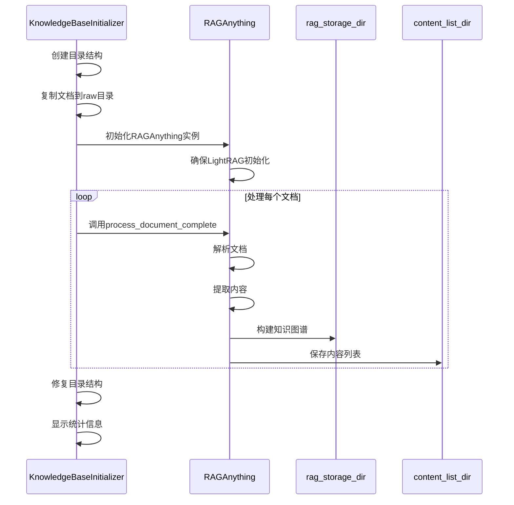
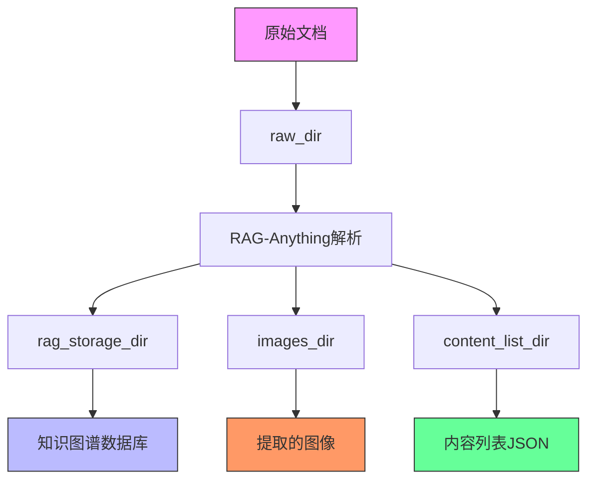
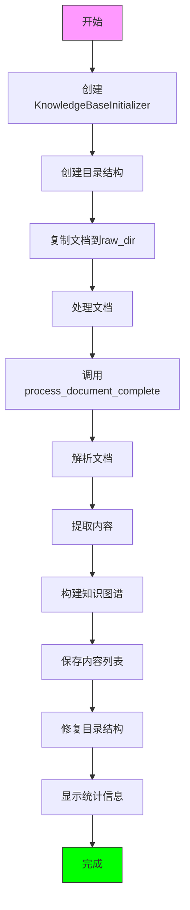
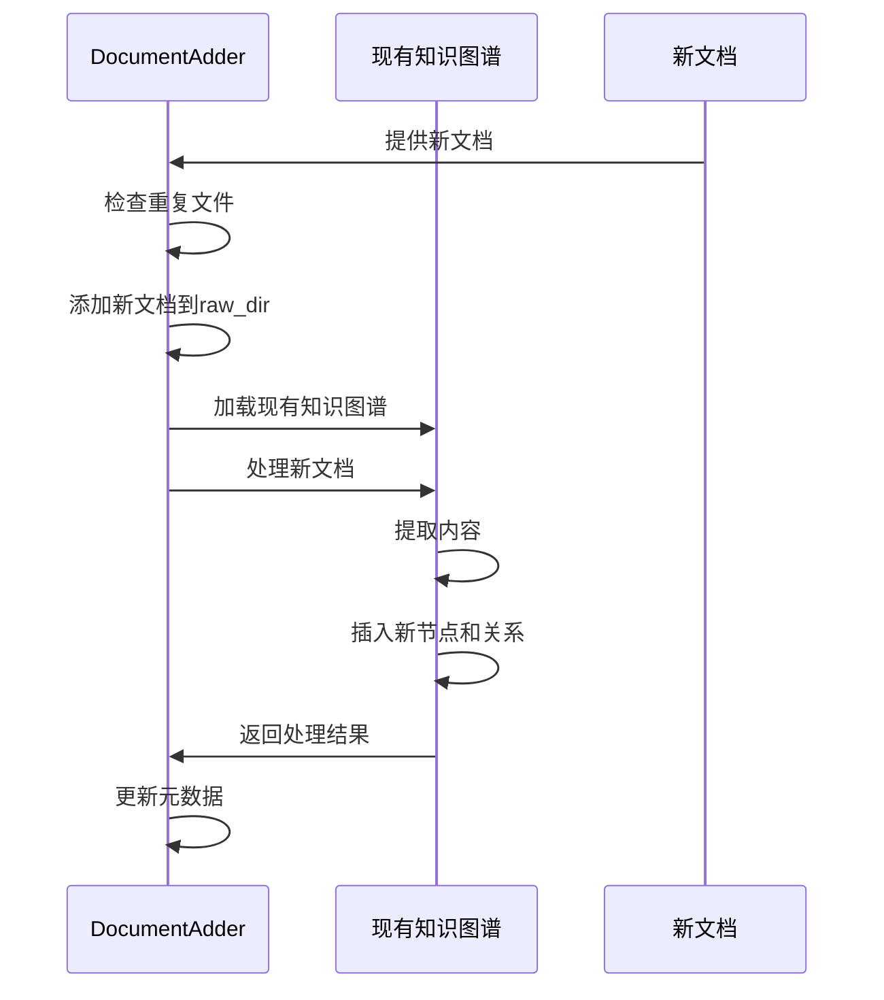

# 文档解析

<cite>
**本文档引用的文件**
- [initializer.py](file://src/knowledge/initializer.py)
- [add_documents.py](file://src/knowledge/add_documents.py)
- [extract_numbered_items.py](file://src/knowledge/extract_numbered_items.py)
- [progress_tracker.py](file://src/knowledge/progress_tracker.py)
- [config.py](file://src/knowledge/config.py)
- [main.yaml](file://config/main.yaml)
</cite>

## 目录
1. [文档解析概述](#文档解析概述)
2. [文档解析流程](#文档解析流程)
3. [文档解析目录结构](#文档解析目录结构)
4. [文档解析工作流](#文档解析工作流)
5. [增量式文档添加机制](#增量式文档添加机制)
6. [文档解析错误处理](#文档解析错误处理)
7. [总结](#总结)

## 文档解析概述

文档解析功能是DeepTutor系统的核心组件之一，负责将原始文档转换为结构化的知识图谱。该功能主要通过`initializer.py`中的`KnowledgeBaseInitializer`类和`add_documents.py`中的`DocumentAdder`类实现。系统利用RAG-Anything框架对文档进行解析、内容提取和知识图谱构建，支持PDF、DOCX、DOC、TXT和MD等多种文档格式。

文档解析过程包括文档解析、内容提取和知识图谱构建三个主要阶段。系统首先创建知识库的目录结构，然后使用RAG-Anything框架处理文档，最后构建知识图谱数据库。整个过程通过进度跟踪器（ProgressTracker）监控，确保解析过程的可视化和可追踪性。

**Section sources**
- [initializer.py](file://src/knowledge/initializer.py#L1-L50)
- [add_documents.py](file://src/knowledge/add_documents.py#L1-L50)

## 文档解析流程

文档解析的核心是`KnowledgeBaseInitializer`类的`process_documents`方法，该方法详细描述了如何利用RAG-Anything框架对原始文档进行解析、内容提取和知识图谱构建。



**Diagram sources**
- [initializer.py](file://src/knowledge/initializer.py#L160-L366)

`process_documents`方法首先获取`raw_dir`目录中的所有文档，然后创建RAGAnything配置，定义LLM模型函数、视觉模型函数和嵌入函数。接着，初始化RAGAnything实例并确保LightRAG已初始化。对于每个文档，调用`process_document_complete`方法进行完整处理，该方法负责文档解析、内容提取和插入知识图谱的完整流程。

`process_document_complete`方法的调用过程包括：文档解析、内容提取和插入知识图谱。文档解析阶段，系统会自动识别文档类型并选择合适的解析方法；内容提取阶段，提取文本、表格、公式和图像等元素；知识图谱构建阶段，将提取的内容转换为知识图谱的节点和关系。

**Section sources**
- [initializer.py](file://src/knowledge/initializer.py#L160-L366)

## 文档解析目录结构

文档解析过程中涉及多个关键目录，每个目录都有特定的作用和数据流转路径。主要目录包括`raw_dir`、`rag_storage_dir`、`images_dir`和`content_list_dir`。



**Diagram sources**
- [initializer.py](file://src/knowledge/initializer.py#L63-L66)

`raw_dir`目录用于存储原始文档文件，是文档解析的输入源。当使用`KnowledgeBaseInitializer`或`DocumentAdder`类时，文档首先被复制到此目录。`rag_storage_dir`目录是RAG-Anything框架的存储目录，包含知识图谱数据库文件，如实体、关系和文本块的存储文件。`images_dir`目录存储从文档中提取的图像文件，这些图像在解析过程中被分离并保存。`content_list_dir`目录存储文档内容列表的JSON文件，包含文档的结构化内容信息。

这些目录之间的数据流转遵循特定的路径：原始文档从外部源复制到`raw_dir`，然后由RAG-Anything框架读取并解析，解析过程中提取的图像保存到`images_dir`，内容列表保存到`content_list_dir`，而知识图谱数据则存储在`rag_storage_dir`中。

**Section sources**
- [initializer.py](file://src/knowledge/initializer.py#L63-L66)
- [add_documents.py](file://src/knowledge/add_documents.py#L64-L67)

## 文档解析工作流

文档解析的完整工作流可以通过代码示例来展示。以下是一个典型的文档解析工作流示例：



**Diagram sources**
- [initializer.py](file://src/knowledge/initializer.py#L650-L678)

实际代码工作流如下：
1. 创建`KnowledgeBaseInitializer`实例，指定知识库名称和基础目录
2. 调用`create_directory_structure`方法创建必要的目录结构
3. 使用`copy_documents`方法将原始文档复制到`raw_dir`目录
4. 调用`process_documents`方法启动文档处理流程
5. 在`process_documents`方法中，系统会自动调用`process_document_complete`处理每个文档
6. 处理完成后，调用`fix_structure`方法修复目录结构
7. 最后，显示处理统计信息

这个工作流确保了文档从原始状态到结构化知识的完整转换过程，每个步骤都有明确的职责和输出。

**Section sources**
- [initializer.py](file://src/knowledge/initializer.py#L650-L678)

## 增量式文档添加机制

增量式文档添加机制通过`add_documents.py`中的`DocumentAdder`类实现，允许在不影响现有知识图谱的情况下处理新文档。这种机制对于维护和更新知识库至关重要，避免了重新处理所有文档的高成本。



**Diagram sources**
- [add_documents.py](file://src/knowledge/add_documents.py#L132-L321)

`DocumentAdder`类的工作流程如下：
1. 初始化时检查知识库是否存在以及目录结构是否完整
2. 使用`add_documents`方法添加新文档，可以选择是否跳过重复文件
3. 调用`process_new_documents`方法处理新添加的文档
4. 在处理过程中，RAGAnything实例会加载现有的知识图谱
5. 使用`process_document_complete`方法处理新文档，将内容插入现有知识图谱
6. 最后更新知识库的元数据，记录添加操作

这种增量式机制的关键优势在于它只处理新文档，避免了对已有知识的重复处理，大大提高了效率并降低了API调用成本。

**Section sources**
- [add_documents.py](file://src/knowledge/add_documents.py#L132-L321)

## 文档解析错误处理

文档解析过程中可能会遇到各种错误，系统提供了相应的错误处理机制和解决方案。

### 常见解析错误及解决方案

| 错误类型 | 原因 | 解决方案 |
|--------|-----|--------|
| API调用失败 | API密钥未设置或网络问题 | 检查`.env`文件中的`LLM_BINDING_API_KEY`和`LLM_BINDING_HOST`配置 |
| RAG初始化失败 | RAG存储文件损坏 | 使用`python -m src.knowledge.start_kb clean-rag your_kb_name`清理损坏的存储 |
| 路径问题 | 模块路径未正确设置 | 调用`setup_paths()`函数统一设置路径 |
| raganything模块未找到 | 模块路径不正确 | 确保`raganything/RAG-Anything`位于项目父目录，或修改`config.py`中的路径 |
| 无文档可处理 | `raw_dir`目录中没有支持的文档 | 检查文档格式是否为PDF、DOCX、DOC、TXT或MD |

当RAG初始化失败并出现"no element found"或GraphML解析错误时，通常是由于RAG存储文件损坏所致。解决方案是先清理损坏的RAG存储，然后重新处理文档：

```bash
# 清理损坏的RAG存储
python -m src.knowledge.start_kb clean-rag your_kb_name

# 然后重新处理文档
python -m src.knowledge.start_kb refresh your_kb_name
```

系统还提供了`ProgressTracker`类来跟踪解析进度，当解析失败时，可以在进度文件中查看详细的错误信息，帮助定位问题。

**Section sources**
- [initializer.py](file://src/knowledge/initializer.py#L334-L347)
- [add_documents.py](file://src/knowledge/add_documents.py#L296-L301)
- [progress_tracker.py](file://src/knowledge/progress_tracker.py#L119-L171)

## 总结

文档解析功能是DeepTutor系统的核心，通过`KnowledgeBaseInitializer`和`DocumentAdder`类实现了完整的文档处理流程。系统利用RAG-Anything框架对原始文档进行解析、内容提取和知识图谱构建，支持多种文档格式。

关键特性包括：
- 完整的文档解析流程，从原始文档到结构化知识
- 增量式文档添加机制，支持知识库的持续更新
- 详细的目录结构管理，确保数据的有序存储
- 全面的错误处理机制，提高系统的稳定性和可靠性

通过合理使用这些功能，用户可以高效地构建和维护知识库，为后续的知识查询和应用提供坚实的基础。