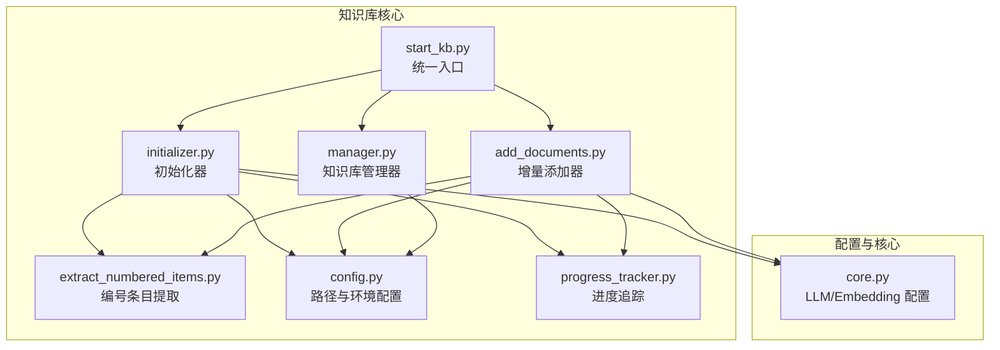
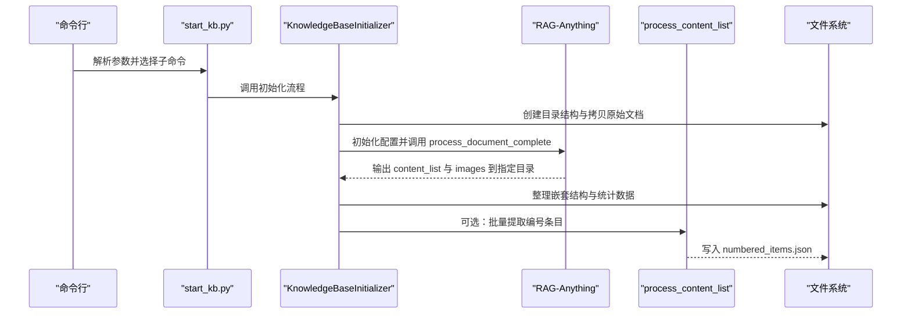
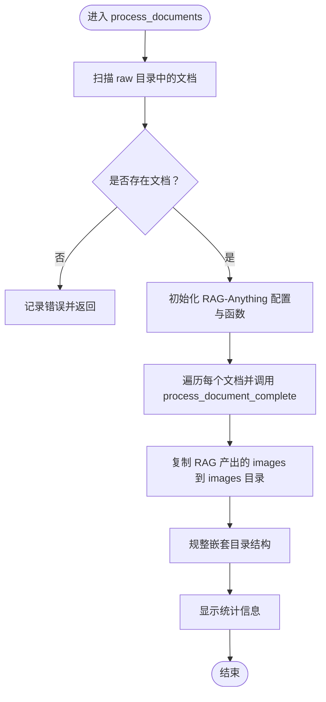
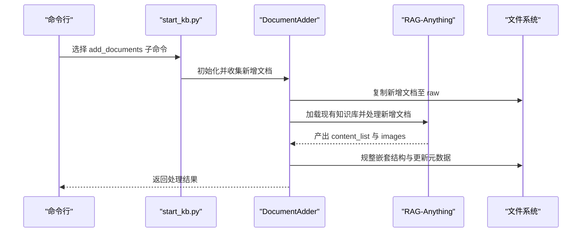
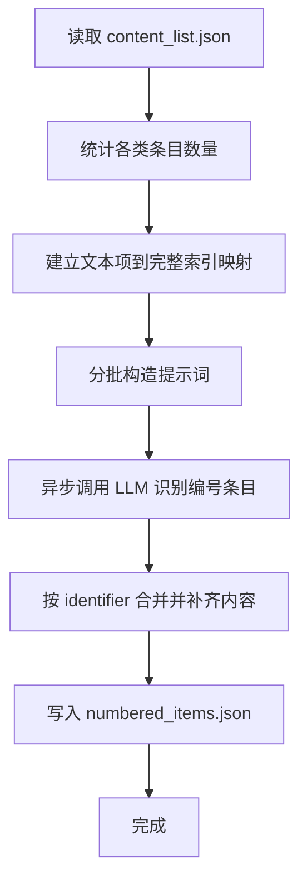
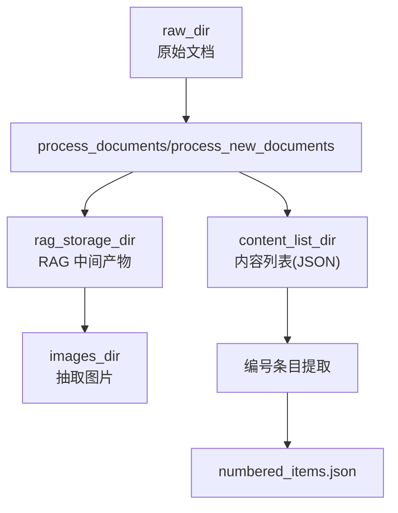
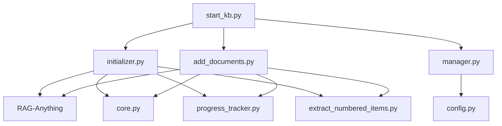

# 文档解析流程

<cite>
**本文引用的文件**
- [src/knowledge/initializer.py](file://src/knowledge/initializer.py)
- [src/knowledge/add_documents.py](file://src/knowledge/add_documents.py)
- [src/knowledge/extract_numbered_items.py](file://src/knowledge/extract_numbered_items.py)
- [src/knowledge/manager.py](file://src/knowledge/manager.py)
- [src/knowledge/config.py](file://src/knowledge/config.py)
- [src/knowledge/start_kb.py](file://src/knowledge/start_kb.py)
- [src/knowledge/progress_tracker.py](file://src/knowledge/progress_tracker.py)
- [src/core/core.py](file://src/core/core.py)
</cite>

## 目录
1. [引言](#引言)
2. [项目结构](#项目结构)
3. [核心组件](#核心组件)
4. [架构总览](#架构总览)
5. [详细组件分析](#详细组件分析)
6. [依赖关系分析](#依赖关系分析)
7. [性能考量](#性能考量)
8. [故障排查指南](#故障排查指南)
9. [结论](#结论)
10. [附录](#附录)

## 引言
本文件围绕 DeepTutor 项目中的“知识库文档解析与增量更新”能力，系统性梳理从原始文档到知识图谱的完整流程。重点聚焦以下目标：
- 深入解析 KnowledgeBaseInitializer 类的 process_documents 方法，阐明其如何借助 RAG-Anything 对原始文档执行解析、内容提取与知识图谱构建。
- 详述 process_document_complete 的调用链路，包括文档解析、内容提取与插入知识图谱的全过程。
- 结合 DocumentAdder 类，说明增量式文档添加机制，确保新增文档在不破坏既有知识图谱的前提下被正确处理。
- 明确 raw_dir、rag_storage_dir 等目录的职责与数据流转路径。
- 提供可操作的工作流示例与常见错误的排查建议。

## 项目结构
本项目的知识库相关模块集中在 src/knowledge 目录，围绕初始化、增量添加、内容提取、管理与配置展开；同时通过统一的配置与日志系统贯穿各组件。

图表来源
- [src/knowledge/initializer.py](file://src/knowledge/initializer.py#L1-L120)
- [src/knowledge/add_documents.py](file://src/knowledge/add_documents.py#L1-L120)
- [src/knowledge/extract_numbered_items.py](file://src/knowledge/extract_numbered_items.py#L1-L120)
- [src/knowledge/manager.py](file://src/knowledge/manager.py#L1-L120)
- [src/knowledge/config.py](file://src/knowledge/config.py#L1-L66)
- [src/knowledge/start_kb.py](file://src/knowledge/start_kb.py#L1-L120)
- [src/knowledge/progress_tracker.py](file://src/knowledge/progress_tracker.py#L1-L120)
- [src/core/core.py](file://src/core/core.py#L1-L120)

章节来源
- [src/knowledge/initializer.py](file://src/knowledge/initializer.py#L1-L120)
- [src/knowledge/add_documents.py](file://src/knowledge/add_documents.py#L1-L120)
- [src/knowledge/manager.py](file://src/knowledge/manager.py#L1-L120)
- [src/knowledge/config.py](file://src/knowledge/config.py#L1-L66)
- [src/knowledge/start_kb.py](file://src/knowledge/start_kb.py#L1-L120)
- [src/knowledge/progress_tracker.py](file://src/knowledge/progress_tracker.py#L1-L120)
- [src/core/core.py](file://src/core/core.py#L1-L120)

## 核心组件
- 初始化器（KnowledgeBaseInitializer）：负责创建知识库目录结构、复制原始文档、调用 RAG-Anything 完成文档解析与知识图谱构建，并将结果整理为 content_list 与 images。
- 增量添加器（DocumentAdder）：在已有知识库基础上，仅对新增文档进行处理，保持现有知识图谱不变。
- 编号条目提取器（process_content_list）：基于 LLM 将 content_list 中的文本、公式、图像等内容聚合成编号条目（定义、定理、方程、图等），输出 numbered_items.json。
- 知识库管理器（KnowledgeBaseManager）：统一管理多个知识库的注册、查询、统计与清理。
- 统一入口（start_kb.py）：提供 list/info/set-default/init/extract/clean-rag/refresh 等命令行接口。
- 进度追踪器（ProgressTracker）：记录初始化/处理/提取阶段的进度与错误信息。
- 配置与核心（config.py、core.py）：提供路径注入、环境变量读取与 LLM/Embedding 配置。

章节来源
- [src/knowledge/initializer.py](file://src/knowledge/initializer.py#L47-L141)
- [src/knowledge/add_documents.py](file://src/knowledge/add_documents.py#L44-L120)
- [src/knowledge/extract_numbered_items.py](file://src/knowledge/extract_numbered_items.py#L762-L800)
- [src/knowledge/manager.py](file://src/knowledge/manager.py#L12-L120)
- [src/knowledge/start_kb.py](file://src/knowledge/start_kb.py#L112-L176)
- [src/knowledge/progress_tracker.py](file://src/knowledge/progress_tracker.py#L27-L120)
- [src/knowledge/config.py](file://src/knowledge/config.py#L1-L66)
- [src/core/core.py](file://src/core/core.py#L40-L212)

## 架构总览
下图展示了从命令行到具体实现的调用链路，以及 RAG-Anything 在其中的角色。

图表来源
- [src/knowledge/start_kb.py](file://src/knowledge/start_kb.py#L112-L176)
- [src/knowledge/initializer.py](file://src/knowledge/initializer.py#L160-L366)
- [src/knowledge/extract_numbered_items.py](file://src/knowledge/extract_numbered_items.py#L762-L800)

章节来源
- [src/knowledge/start_kb.py](file://src/knowledge/start_kb.py#L112-L176)
- [src/knowledge/initializer.py](file://src/knowledge/initializer.py#L160-L366)
- [src/knowledge/extract_numbered_items.py](file://src/knowledge/extract_numbered_items.py#L762-L800)

## 详细组件分析

### KnowledgeBaseInitializer 类与 process_documents 方法
- 目录结构与元数据
  - 初始化器在指定 base_dir 下创建知识库目录，包含 raw、images、rag_storage、content_list 四个子目录，并生成 metadata.json 与 kb_config.json 注册信息。
- 文档复制
  - 将传入的源文档复制到 raw 目录，便于后续统一处理。
- 文档处理（process_documents）
  - 使用 RAG-Anything 的 RAGAnythingConfig 指定 working_dir 为 rag_storage_dir，并启用图片/表格/公式处理。
  - 通过 get_llm_config 与 get_embedding_config 获取模型与嵌入配置，封装 llm_model_func、vision_model_func 与 embedding_func。
  - 逐个遍历 raw 目录中的文档，调用 RAG 的 process_document_complete(file_path, output_dir, parse_method="auto")，完成解析、抽取与知识图谱构建。
  - 处理完成后复制 RAG 产出的 images 到 images 目录，并调用 fix_structure 规整嵌套目录，最后显示统计信息。
- 编号条目提取（extract_numbered_items）
  - 读取 content_list 目录下的所有 JSON 文件，逐个调用 process_content_list，合并写入 numbered_items.json。

图表来源
- [src/knowledge/initializer.py](file://src/knowledge/initializer.py#L160-L366)

章节来源
- [src/knowledge/initializer.py](file://src/knowledge/initializer.py#L112-L141)
- [src/knowledge/initializer.py](file://src/knowledge/initializer.py#L142-L159)
- [src/knowledge/initializer.py](file://src/knowledge/initializer.py#L160-L366)
- [src/knowledge/initializer.py](file://src/knowledge/initializer.py#L367-L443)
- [src/knowledge/initializer.py](file://src/knowledge/initializer.py#L444-L524)
- [src/knowledge/initializer.py](file://src/knowledge/initializer.py#L525-L568)

### DocumentAdder 类与增量文档添加
- 目录检查与存在性验证
  - 确保知识库目录存在且已初始化（包含 rag_storage），否则抛出异常。
- 新增文档策略
  - 通过 get_existing_files 获取现有文件名集合，支持跳过重复或允许覆盖。
  - 将新增文档复制到 raw 目录。
- 新文档处理（process_new_documents）
  - 与初始化流程类似，使用 RAG-AnythingConfig 指向现有 rag_storage_dir，从而复用已有知识图谱。
  - 调用 RAG 的 process_document_complete，仅对新增文档进行解析与插入。
  - 复制 images 并规整嵌套结构。
- 编号条目提取（extract_numbered_items_for_new_docs）
  - 仅对新增文档对应的 content_list 执行提取，并与已存在的 numbered_items.json 合并。
- 元数据更新（update_metadata）
  - 记录最近更新时间与更新历史，便于审计。

图表来源
- [src/knowledge/add_documents.py](file://src/knowledge/add_documents.py#L44-L120)
- [src/knowledge/add_documents.py](file://src/knowledge/add_documents.py#L132-L321)
- [src/knowledge/add_documents.py](file://src/knowledge/add_documents.py#L323-L452)
- [src/knowledge/add_documents.py](file://src/knowledge/add_documents.py#L453-L486)
- [src/knowledge/start_kb.py](file://src/knowledge/start_kb.py#L494-L618)

章节来源
- [src/knowledge/add_documents.py](file://src/knowledge/add_documents.py#L44-L120)
- [src/knowledge/add_documents.py](file://src/knowledge/add_documents.py#L132-L321)
- [src/knowledge/add_documents.py](file://src/knowledge/add_documents.py#L323-L452)
- [src/knowledge/add_documents.py](file://src/knowledge/add_documents.py#L453-L486)
- [src/knowledge/start_kb.py](file://src/knowledge/start_kb.py#L494-L618)

### 编号条目提取流程（process_content_list）
- 输入：content_list.json（由 RAG-Anything 生成）
- 处理步骤：
  - 读取 content_list，统计 plain text、带标题的 text、带 caption 的 image、带标签的 equation 数量。
  - 将文本项映射到完整 content_items 的索引，以便后续边界判定。
  - 分批调用 LLM，识别编号条目（定义、命题、定理、推论、示例、备注、图、方程、表等），并根据 LLM 提供的 full_text 或自动补齐规则（含后续公式/图像）生成完整内容。
  - 将结果按 identifier 去重合并，写入 numbered_items.json。
- 并发控制：通过 asyncio.Semaphore 控制最大并发任务数，避免 LLM 调用过载。

图表来源
- [src/knowledge/extract_numbered_items.py](file://src/knowledge/extract_numbered_items.py#L541-L678)
- [src/knowledge/extract_numbered_items.py](file://src/knowledge/extract_numbered_items.py#L762-L800)

章节来源
- [src/knowledge/extract_numbered_items.py](file://src/knowledge/extract_numbered_items.py#L1-L120)
- [src/knowledge/extract_numbered_items.py](file://src/knowledge/extract_numbered_items.py#L541-L678)
- [src/knowledge/extract_numbered_items.py](file://src/knowledge/extract_numbered_items.py#L762-L800)

### 目录与数据流（raw_dir、rag_storage_dir、content_list_dir、images_dir）
- raw_dir：存放用户提供的原始文档，作为统一输入源。
- rag_storage_dir：RAG-Anything 的工作目录，存储中间产物（如 kv_store_full_entities.json、kv_store_full_relations.json、kv_store_text_chunks.json、images 等）。
- content_list_dir：保存每份文档解析后的结构化内容列表（JSON），用于后续编号条目提取。
- images_dir：保存从文档中抽取的图片，以及 RAG 产出的图片。

图表来源
- [src/knowledge/initializer.py](file://src/knowledge/initializer.py#L47-L72)
- [src/knowledge/initializer.py](file://src/knowledge/initializer.py#L349-L366)
- [src/knowledge/add_documents.py](file://src/knowledge/add_documents.py#L63-L79)
- [src/knowledge/add_documents.py](file://src/knowledge/add_documents.py#L302-L321)

章节来源
- [src/knowledge/initializer.py](file://src/knowledge/initializer.py#L47-L72)
- [src/knowledge/initializer.py](file://src/knowledge/initializer.py#L349-L366)
- [src/knowledge/add_documents.py](file://src/knowledge/add_documents.py#L63-L79)
- [src/knowledge/add_documents.py](file://src/knowledge/add_documents.py#L302-L321)

## 依赖关系分析
- 初始化器依赖
  - RAG-Anything：通过 RAGAnythingConfig、llm_model_func、vision_model_func、embedding_func 与 process_document_complete 完成解析与知识图谱构建。
  - 统一配置：get_llm_config/get_embedding_config 提供模型与嵌入参数。
  - 日志与进度：LightRAGLogContext 与 ProgressTracker。
- 增量添加器依赖
  - 与初始化器相同，但加载现有 rag_storage_dir，避免重建整个知识图谱。
- 编号条目提取依赖
  - LLM 接口 openai_complete_if_cache 与 JSON 解析容错逻辑。
- 管理器与入口
  - KnowledgeBaseManager 提供路径与统计查询；start_kb.py 提供命令行入口与流程编排。

图表来源
- [src/knowledge/initializer.py](file://src/knowledge/initializer.py#L190-L306)
- [src/knowledge/add_documents.py](file://src/knowledge/add_documents.py#L144-L259)
- [src/knowledge/extract_numbered_items.py](file://src/knowledge/extract_numbered_items.py#L541-L678)
- [src/knowledge/manager.py](file://src/knowledge/manager.py#L12-L120)
- [src/knowledge/start_kb.py](file://src/knowledge/start_kb.py#L112-L176)
- [src/knowledge/config.py](file://src/knowledge/config.py#L1-L66)
- [src/core/core.py](file://src/core/core.py#L40-L212)

章节来源
- [src/knowledge/initializer.py](file://src/knowledge/initializer.py#L190-L306)
- [src/knowledge/add_documents.py](file://src/knowledge/add_documents.py#L144-L259)
- [src/knowledge/extract_numbered_items.py](file://src/knowledge/extract_numbered_items.py#L541-L678)
- [src/knowledge/manager.py](file://src/knowledge/manager.py#L12-L120)
- [src/knowledge/start_kb.py](file://src/knowledge/start_kb.py#L112-L176)
- [src/knowledge/config.py](file://src/knowledge/config.py#L1-L66)
- [src/core/core.py](file://src/core/core.py#L40-L212)

## 性能考量
- 并发与批处理
  - 编号条目提取采用 asyncio.Semaphore 控制最大并发任务数，避免 LLM 调用过载。
  - 分批处理 content_list，降低单次请求长度与 JSON 解析压力。
- I/O 与目录规整
  - 处理完成后统一规整嵌套目录，减少深层嵌套带来的文件系统访问开销。
- LLM 调用优化
  - 通过统一的 llm_model_func/vision_model_func 封装，避免重复初始化与参数传递错误。
- 存储与缓存
  - 使用 rag_storage_dir 作为持久化存储，避免重复解析；必要时可通过 clean-rag 清理并重建。

[本节为通用指导，无需特定文件来源]

## 故障排查指南
- API 密钥缺失
  - 现象：初始化/增量添加时报错要求设置 LLM_BINDING_API_KEY。
  - 处理：在 .env 中配置 LLM_MODEL、LLM_BINDING_API_KEY、LLM_BINDING_HOST，或通过命令行参数传入。
  - 参考
    - [src/knowledge/initializer.py](file://src/knowledge/initializer.py#L621-L644)
    - [src/knowledge/add_documents.py](file://src/knowledge/add_documents.py#L548-L569)
    - [src/core/core.py](file://src/core/core.py#L40-L72)
- 知识库未初始化
  - 现象：增量添加时报错提示知识库未初始化或缺少 rag_storage。
  - 处理：先运行初始化流程创建知识库，再进行增量添加。
  - 参考
    - [src/knowledge/add_documents.py](file://src/knowledge/add_documents.py#L63-L79)
- 文档目录不存在
  - 现象：命令行报错提示文档目录不存在。
  - 处理：确认 --docs-dir 指向的目录存在且包含目标文档类型。
  - 参考
    - [src/knowledge/initializer.py](file://src/knowledge/initializer.py#L633-L640)
    - [src/knowledge/add_documents.py](file://src/knowledge/add_documents.py#L559-L566)
- JSON 解析失败
  - 现象：编号条目提取过程中 JSON 解析报错。
  - 处理：自动尝试非严格模式与 ast.literal_eval 修复；若仍失败，检查 content_list 的格式或减少 batch_size。
  - 参考
    - [src/knowledge/extract_numbered_items.py](file://src/knowledge/extract_numbered_items.py#L443-L471)
- RAG 数据损坏
  - 现象：知识图谱统计无法读取或行为异常。
  - 处理：使用 clean-rag 清理并备份后重建。
  - 参考
    - [src/knowledge/manager.py](file://src/knowledge/manager.py#L304-L340)
    - [src/knowledge/start_kb.py](file://src/knowledge/start_kb.py#L258-L274)
- 进度与日志
  - 使用 ProgressTracker 记录阶段、百分比与错误信息，便于定位问题。
  - 参考
    - [src/knowledge/progress_tracker.py](file://src/knowledge/progress_tracker.py#L119-L172)

章节来源
- [src/knowledge/initializer.py](file://src/knowledge/initializer.py#L621-L644)
- [src/knowledge/add_documents.py](file://src/knowledge/add_documents.py#L548-L569)
- [src/knowledge/extract_numbered_items.py](file://src/knowledge/extract_numbered_items.py#L443-L471)
- [src/knowledge/manager.py](file://src/knowledge/manager.py#L304-L340)
- [src/knowledge/start_kb.py](file://src/knowledge/start_kb.py#L258-L274)
- [src/knowledge/progress_tracker.py](file://src/knowledge/progress_tracker.py#L119-L172)
- [src/core/core.py](file://src/core/core.py#L40-L72)

## 结论
本流程以 RAG-Anything 为核心，结合统一的配置与日志体系，实现了从原始文档到结构化内容与知识图谱的自动化处理，并通过增量添加器保证在不破坏既有知识图谱的前提下持续扩展。目录规整与编号条目提取进一步提升了知识库的可用性与检索效率。建议在生产环境中配合 clean-rag 与合理的 batch size/并发策略，以获得更稳定与高效的处理体验。

[本节为总结，无需特定文件来源]

## 附录
- 常用命令参考
  - 初始化知识库：python knowledge_init/kb.py init <name> [--docs/--docs-dir] [--api-key/--base-url] [--skip-processing/--skip-extract] [--batch-size]
  - 增量添加：python knowledge_init/kb.py add <kb_name> [--docs/--docs-dir] [--api-key/--base-url] [--allow-duplicates/--skip-processing/--skip-extract] [--batch-size]
  - 编号条目提取：python knowledge_init/kb.py extract --kb <kb_name> [--content-file] [--batch-size] [--max-concurrent]
  - 清理 RAG：python knowledge_init/kb.py clean-rag <kb_name> [--no-backup]
  - 刷新知识库：python knowledge_init/kb.py refresh <kb_name> [--full/--no-backup/--skip-extract] [--batch-size]

章节来源
- [src/knowledge/start_kb.py](file://src/knowledge/start_kb.py#L357-L532)