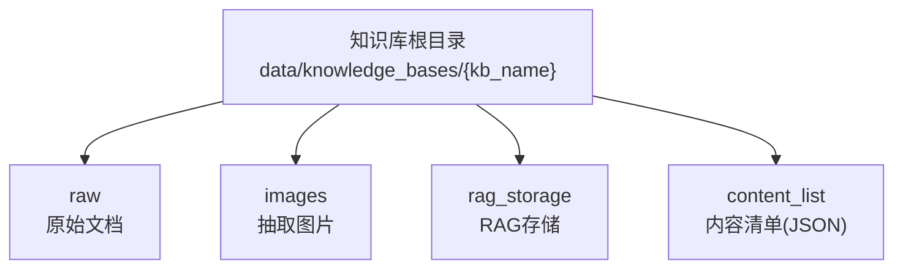
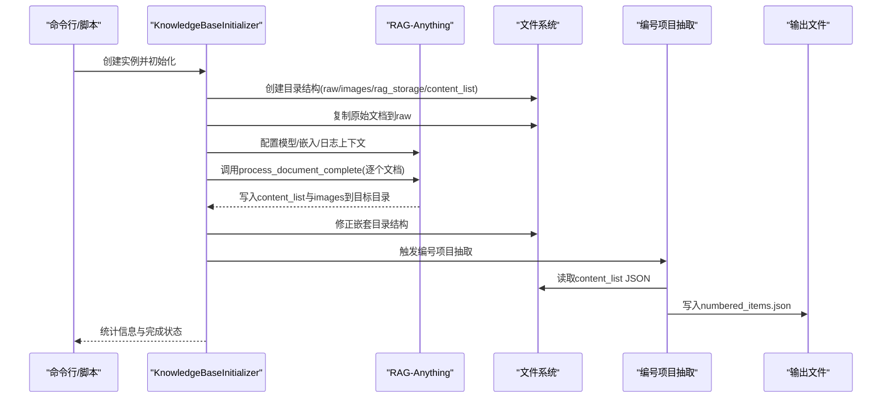
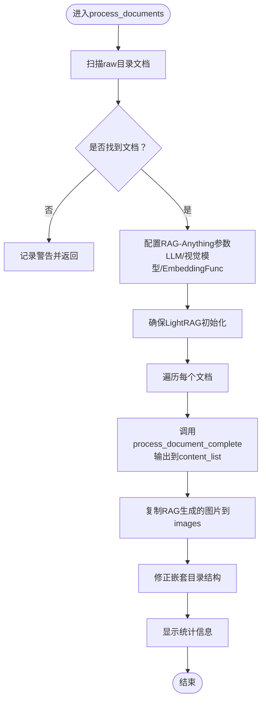
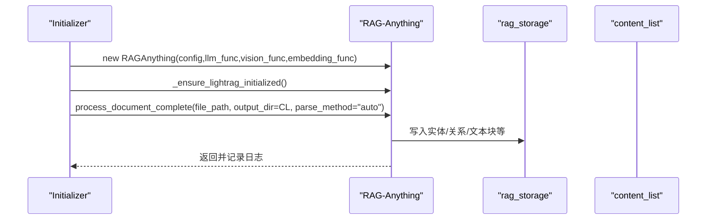
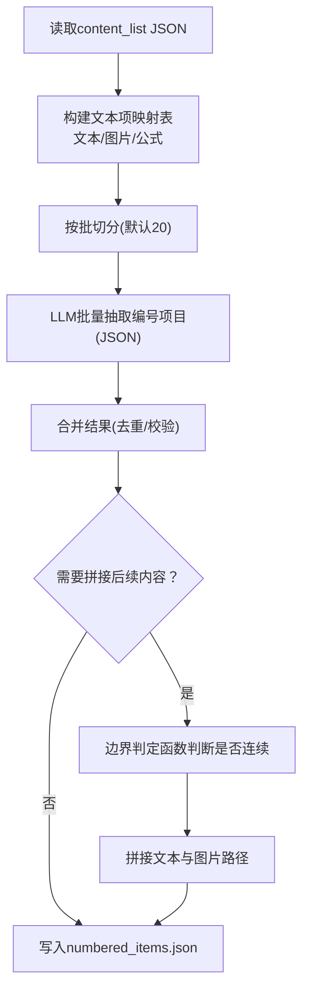
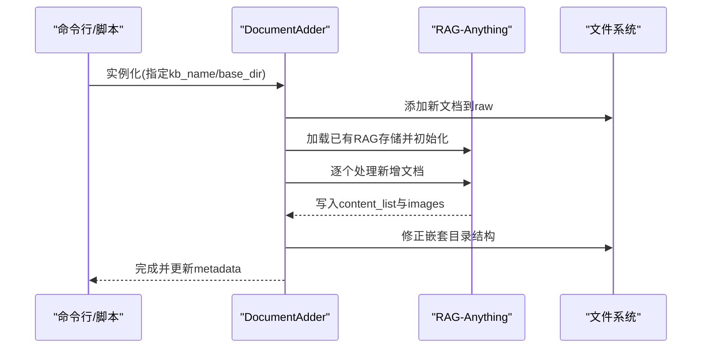
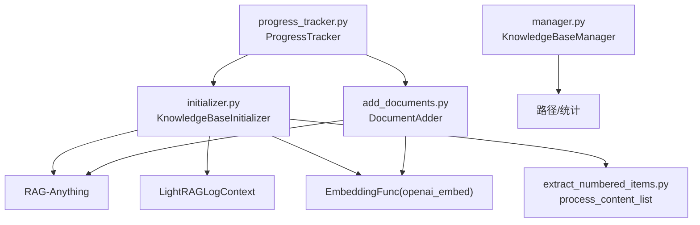

# 文档预处理

<cite>
**本文引用的文件列表**
- [src/knowledge/initializer.py](file://src/knowledge/initializer.py)
- [src/knowledge/extract_numbered_items.py](file://src/knowledge/extract_numbered_items.py)
- [src/knowledge/add_documents.py](file://src/knowledge/add_documents.py)
- [src/knowledge/manager.py](file://src/knowledge/manager.py)
- [src/knowledge/config.py](file://src/knowledge/config.py)
- [src/knowledge/start_kb.py](file://src/knowledge/start_kb.py)
- [src/knowledge/progress_tracker.py](file://src/knowledge/progress_tracker.py)
- [src/knowledge/kb.py](file://src/knowledge/kb.py)
- [src/knowledge/example_add_documents.py](file://src/knowledge/example_add_documents.py)
</cite>

## 目录
1. [简介](#简介)
2. [项目结构](#项目结构)
3. [核心组件](#核心组件)
4. [架构总览](#架构总览)
5. [详细组件分析](#详细组件分析)
6. [依赖关系分析](#依赖关系分析)
7. [性能考量](#性能考量)
8. [故障排查指南](#故障排查指南)
9. [结论](#结论)
10. [附录](#附录)

## 简介
本文件聚焦于DeepTutor项目中的“文档预处理”能力，围绕KnowledgeBaseInitializer类的process_documents方法与process_document_complete调用链路，解释如何借助RAG-Anything框架完成原始文档的解析、内容抽取与知识图谱构建；同时结合extract_numbered_items.py中的process_content_list函数，说明从content_list中提取定义、命题、公式等编号项目的流程与JSON输出结构，以及这些JSON文件在后续检索中的作用。文末提供完整工作流示例与常见问题的解决方案。

## 项目结构
与文档预处理直接相关的模块主要位于src/knowledge目录：
- 初始化与管理：initializer.py、add_documents.py、manager.py、start_kb.py、config.py、kb.py、progress_tracker.py
- 编号项目抽取：extract_numbered_items.py
- 示例与使用：example_add_documents.py

下面以知识库目录结构为例，展示各子目录的作用（由初始化器创建）：
- raw：存放原始待处理文档
- images：存放从文档中抽取的图片
- rag_storage：RAG-Anything的内部存储（包含实体、关系、文本块等）
- content_list：存放每篇文档解析后生成的content_list JSON，用于后续编号项目抽取

图表来源
- [src/knowledge/initializer.py](file://src/knowledge/initializer.py#L112-L141)
- [src/knowledge/add_documents.py](file://src/knowledge/add_documents.py#L44-L88)

章节来源
- [src/knowledge/initializer.py](file://src/knowledge/initializer.py#L112-L141)
- [src/knowledge/add_documents.py](file://src/knowledge/add_documents.py#L44-L88)

## 核心组件
- KnowledgeBaseInitializer：负责创建知识库目录结构、复制文档、调用RAG-Anything进行文档解析与知识图谱构建、复制图片、修正嵌套目录结构、统计信息展示、以及触发编号项目抽取。
- RAG-Anything：作为底层解析与知识图谱引擎，提供process_document_complete方法，完成文档解析、内容抽取、向量嵌入与知识图谱入库。
- extract_numbered_items：负责从content_list中批量抽取编号项目（定义、命题、定理、引理、推论、示例、注记、图、公式、表格等），并输出numbered_items.json。
- DocumentAdder：面向增量添加场景，复用RAG-Anything流程，仅处理新增文档并合并到现有知识图谱。

章节来源
- [src/knowledge/initializer.py](file://src/knowledge/initializer.py#L160-L366)
- [src/knowledge/extract_numbered_items.py](file://src/knowledge/extract_numbered_items.py#L762-L800)
- [src/knowledge/add_documents.py](file://src/knowledge/add_documents.py#L132-L321)

## 架构总览
下图展示了从命令入口到最终产出的端到端流程，包括RAG-Anything的集成点与编号项目抽取的衔接。

图表来源
- [src/knowledge/initializer.py](file://src/knowledge/initializer.py#L160-L366)
- [src/knowledge/extract_numbered_items.py](file://src/knowledge/extract_numbered_items.py#L762-L800)

## 详细组件分析

### KnowledgeBaseInitializer.process_documents 方法
该方法是文档预处理的核心，职责包括：
- 扫描raw目录下的文档（支持pdf/docx/doc/txt/md）
- 基于RAG-Anything配置启用图像、表格、公式处理
- 定义LLM与视觉模型函数，统一通过openai_complete_if_cache调用
- 定义EmbeddingFunc，封装openai_embed
- 初始化RAG-Anything实例并确保LightRAG已初始化
- 逐个文档调用process_document_complete，传入输出目录为content_list
- 复制RAG-Anything生成的图片到images目录
- 修正嵌套目录结构，扁平化content_list与images
- 展示统计信息（实体、关系、文本块数量）

图表来源
- [src/knowledge/initializer.py](file://src/knowledge/initializer.py#L160-L366)

章节来源
- [src/knowledge/initializer.py](file://src/knowledge/initializer.py#L160-L366)

### process_document_complete 调用链与RAG-Anything集成
- 初始化器在process_documents中构造RAGAnythingConfig，开启图像/表格/公式处理
- 定义llm_model_func与vision_model_func，统一走openai_complete_if_cache
- 定义EmbeddingFunc，统一走openai_embed
- 使用LightRAGLogContext包裹，保证日志转发
- 对每个文档调用RAG.process_document_complete(file_path, output_dir="content_list", parse_method="auto")

图表来源
- [src/knowledge/initializer.py](file://src/knowledge/initializer.py#L190-L306)

章节来源
- [src/knowledge/initializer.py](file://src/knowledge/initializer.py#L190-L306)

### 编号项目抽取：extract_numbered_items.process_content_list
该函数负责从单个content_list JSON中抽取编号项目，流程要点：
- 读取content_list JSON
- 将文本项、带标题的图片、带标签的公式映射为“虚拟文本项”，统一批次处理
- 使用LLM批量抽取（默认批大小20，最大并发5），返回JSON数组
- 对于非文本项（如图片、公式），优先采用LLM提供的完整文本；对于文本项，通过边界判定函数判断后续连续内容是否属于同一编号条目
- 输出numbered_items.json，包含text、type、page、img_paths等字段

图表来源
- [src/knowledge/extract_numbered_items.py](file://src/knowledge/extract_numbered_items.py#L541-L678)
- [src/knowledge/extract_numbered_items.py](file://src/knowledge/extract_numbered_items.py#L762-L800)

章节来源
- [src/knowledge/extract_numbered_items.py](file://src/knowledge/extract_numbered_items.py#L541-L678)
- [src/knowledge/extract_numbered_items.py](file://src/knowledge/extract_numbered_items.py#L762-L800)

### content_list 目录中JSON结构与检索用途
- content_list目录中的每个JSON对应一篇文档的解析结果，包含按顺序排列的内容项（文本、公式、图片等），每项通常包含类型、页码、坐标、图片路径、文本级别等元数据。
- numbered_items.json是基于content_list进一步抽取得到的“编号项目清单”，包含标识符（如“定义 1.5”、“(1.2.1)”）、类型（Definition/Proposition/Theorem/Equation/Figure/Table等）、完整文本、所在页码、相关图片路径等。
- 检索阶段可基于numbered_items.json进行精确或语义检索：例如根据标识符快速定位、根据类型过滤、根据页码范围筛选等。

章节来源
- [src/knowledge/extract_numbered_items.py](file://src/knowledge/extract_numbered_items.py#L346-L539)
- [src/knowledge/extract_numbered_items.py](file://src/knowledge/extract_numbered_items.py#L541-L678)

### 增量添加与现有知识图谱融合
DocumentAdder在已有知识库基础上，仅处理新增文档并将其内容插入到现有知识图谱中，不破坏原有图谱。其流程与初始化器类似，但会加载已有RAG存储，避免重复初始化。

图表来源
- [src/knowledge/add_documents.py](file://src/knowledge/add_documents.py#L132-L321)

章节来源
- [src/knowledge/add_documents.py](file://src/knowledge/add_documents.py#L132-L321)

## 依赖关系分析
- 初始化器依赖RAG-Anything模块与LightRAG日志上下文，通过openai_complete_if_cache与openai_embed统一LLM与嵌入接口。
- 编号项目抽取依赖LLM进行结构化抽取与边界判定，同时读取content_list JSON。
- 知识库管理器提供路径查询与统计信息，便于诊断与运维。
- 进度跟踪器提供阶段化进度上报与回调机制，便于前端或外部系统监听。

图表来源
- [src/knowledge/initializer.py](file://src/knowledge/initializer.py#L190-L306)
- [src/knowledge/extract_numbered_items.py](file://src/knowledge/extract_numbered_items.py#L762-L800)
- [src/knowledge/add_documents.py](file://src/knowledge/add_documents.py#L132-L321)
- [src/knowledge/manager.py](file://src/knowledge/manager.py#L127-L261)
- [src/knowledge/progress_tracker.py](file://src/knowledge/progress_tracker.py#L119-L172)

章节来源
- [src/knowledge/initializer.py](file://src/knowledge/initializer.py#L190-L306)
- [src/knowledge/extract_numbered_items.py](file://src/knowledge/extract_numbered_items.py#L762-L800)
- [src/knowledge/add_documents.py](file://src/knowledge/add_documents.py#L132-L321)
- [src/knowledge/manager.py](file://src/knowledge/manager.py#L127-L261)
- [src/knowledge/progress_tracker.py](file://src/knowledge/progress_tracker.py#L119-L172)

## 性能考量
- 批处理与并发：编号项目抽取默认批大小20、最大并发5，可根据资源情况调整；大KB建议增大批大小以减少LLM调用次数。
- 事件循环兼容：在存在uvloop或嵌套事件循环时，抽取逻辑内置回退策略（线程池+新事件循环），确保稳定运行。
- I/O与磁盘：content_list与images目录频繁读写，建议使用SSD与充足空间；必要时对大文件进行分片或压缩。
- 日志与进度：LightRAGLogContext与ProgressTracker会带来额外开销，生产环境可按需关闭或降级。

章节来源
- [src/knowledge/extract_numbered_items.py](file://src/knowledge/extract_numbered_items.py#L264-L344)
- [src/knowledge/extract_numbered_items.py](file://src/knowledge/extract_numbered_items.py#L680-L760)
- [src/knowledge/progress_tracker.py](file://src/knowledge/progress_tracker.py#L59-L118)

## 故障排查指南
- API密钥缺失
  - 现象：初始化或抽取时报错提示未设置API Key
  - 解决：在命令行传入--api-key或设置环境变量LLM_BINDING_API_KEY；或在start_kb.py中读取统一配置
  章节来源
  - [src/knowledge/start_kb.py](file://src/knowledge/start_kb.py#L112-L123)

- RAG存储损坏或缺失
  - 现象：无法加载知识图谱或统计信息为空
  - 解决：使用清理命令清理RAG存储并重新初始化；或在刷新流程中重建
  章节来源
  - [src/knowledge/start_kb.py](file://src/knowledge/start_kb.py#L258-L274)
  - [src/knowledge/manager.py](file://src/knowledge/manager.py#L304-L341)

- 文档格式不支持
  - 现象：扫描不到文档或解析失败
  - 解决：确认扩展名是否在支持列表（pdf/docx/doc/txt/md）；检查文件权限与完整性
  章节来源
  - [src/knowledge/initializer.py](file://src/knowledge/initializer.py#L170-L188)

- LLM响应异常或JSON解析失败
  - 现象：抽取阶段报JSON解析错误或LLM返回非预期格式
  - 解决：查看日志中的原始响应片段；适当提高批大小、降低并发；检查模型参数与温度
  章节来源
  - [src/knowledge/extract_numbered_items.py](file://src/knowledge/extract_numbered_items.py#L430-L471)

- 图片或content_list嵌套结构异常
  - 现象：images或content_list出现多层嵌套导致路径不一致
  - 解决：初始化器与增量添加器均提供结构修复逻辑，自动移动与扁平化
  章节来源
  - [src/knowledge/initializer.py](file://src/knowledge/initializer.py#L367-L443)
  - [src/knowledge/add_documents.py](file://src/knowledge/add_documents.py#L323-L396)

## 结论
本文系统梳理了DeepTutor的文档预处理流程，重点解析了KnowledgeBaseInitializer.process_documents方法与RAG-Anything的集成方式，以及extract_numbered_items的编号项目抽取机制。通过content_list与numbered_items.json，系统实现了从原始文档到可检索知识的完整闭环。配合增量添加与清理工具，用户可在不破坏既有知识图谱的前提下持续扩展与维护知识库。

## 附录

### 完整工作流示例（命令行）
以下示例展示从初始化到编号项目抽取的完整步骤，适用于单次全量初始化或增量添加场景。

- 全量初始化
  - 步骤：创建知识库目录结构 → 复制文档 → 处理文档（RAG-Anything）→ 抽取编号项目 → 显示统计
  - 参考实现位置
    - [src/knowledge/initializer.py](file://src/knowledge/initializer.py#L569-L684)
    - [src/knowledge/start_kb.py](file://src/knowledge/start_kb.py#L112-L176)

- 增量添加
  - 步骤：添加新文档到raw → 处理新增文档（仅新增部分）→ 抽取新增文档的编号项目 → 更新metadata
  - 参考实现位置
    - [src/knowledge/add_documents.py](file://src/knowledge/add_documents.py#L132-L321)
    - [src/knowledge/example_add_documents.py](file://src/knowledge/example_add_documents.py#L20-L151)

- 直接抽取content_list
  - 步骤：选择知识库 → 指定content_list文件或批量处理 → 输出numbered_items.json
  - 参考实现位置
    - [src/knowledge/start_kb.py](file://src/knowledge/start_kb.py#L178-L241)
    - [src/knowledge/extract_numbered_items.py](file://src/knowledge/extract_numbered_items.py#L762-L800)

### 常见错误与解决方案速查
- API Key未配置：设置LLM_BINDING_API_KEY或在命令行传参
- RAG存储缺失：执行清理命令后重新初始化
- 文件不存在/权限不足：检查路径与权限
- LLM返回非标准JSON：调整批大小/并发，或检查模型参数
- 目录结构异常：使用初始化器/增量添加器的结构修复逻辑

章节来源
- [src/knowledge/start_kb.py](file://src/knowledge/start_kb.py#L112-L176)
- [src/knowledge/add_documents.py](file://src/knowledge/add_documents.py#L132-L321)
- [src/knowledge/extract_numbered_items.py](file://src/knowledge/extract_numbered_items.py#L430-L471)
- [src/knowledge/initializer.py](file://src/knowledge/initializer.py#L367-L443)