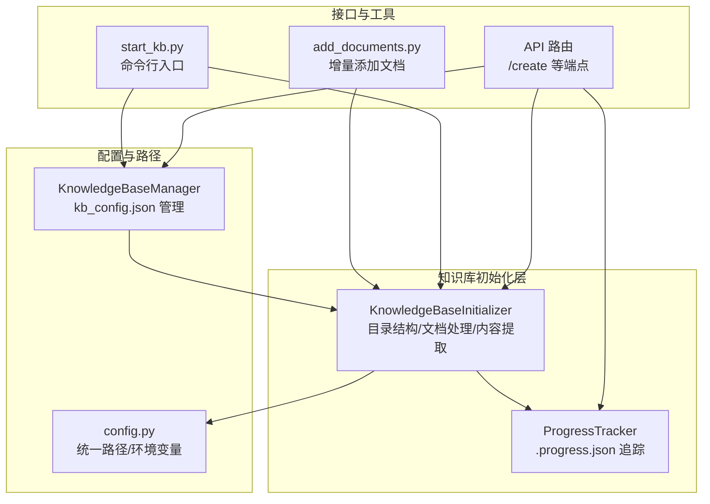
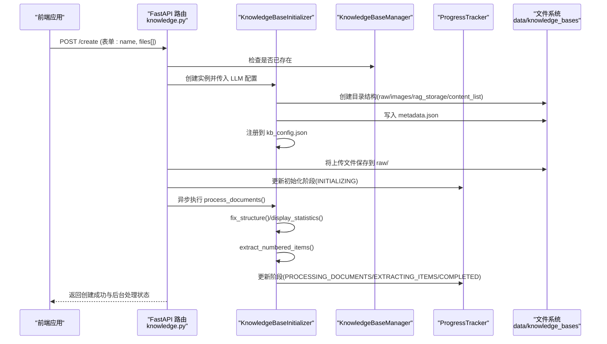
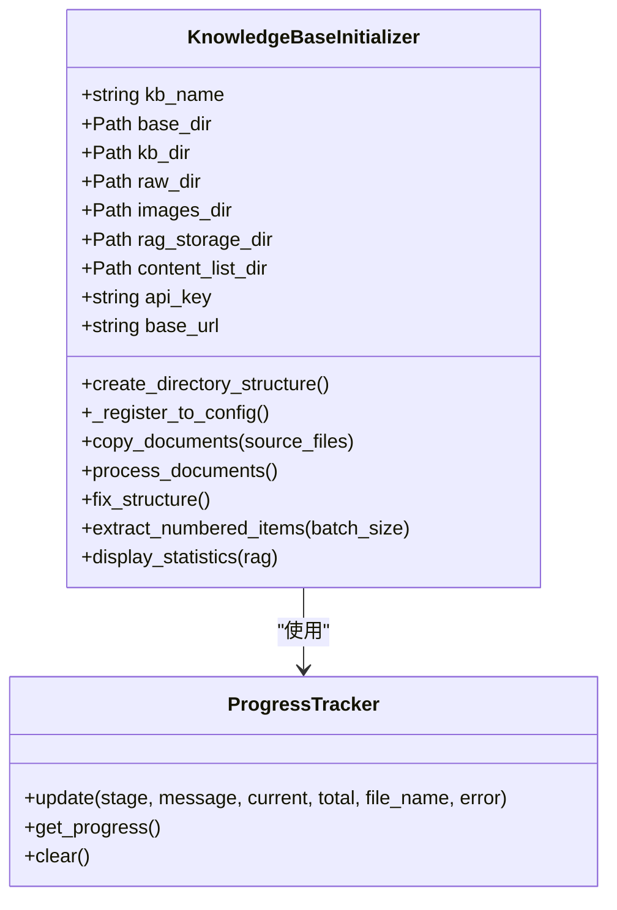
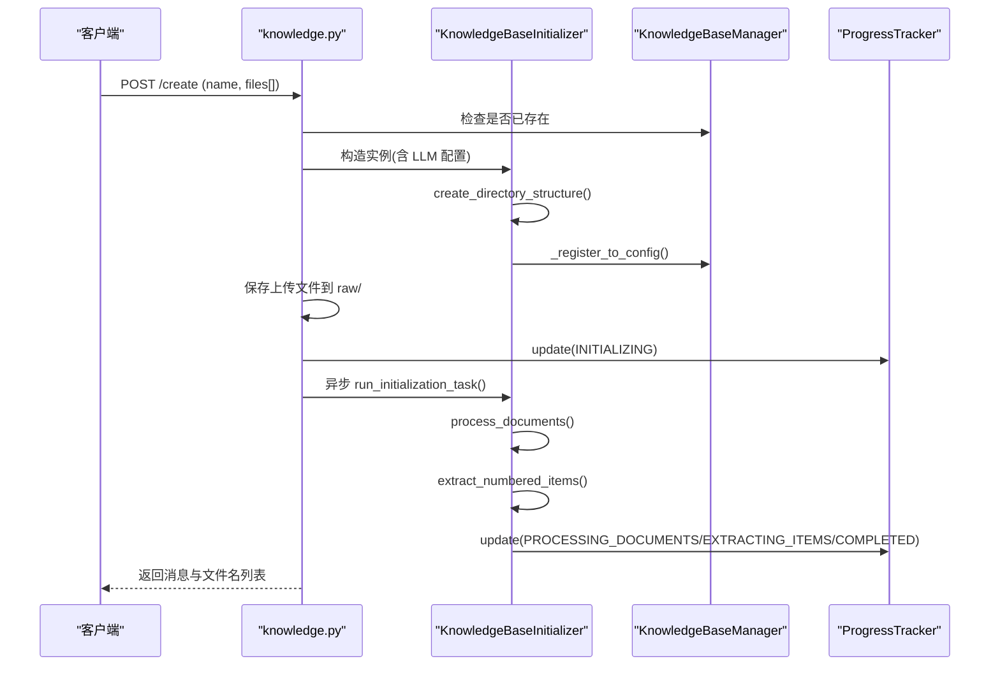
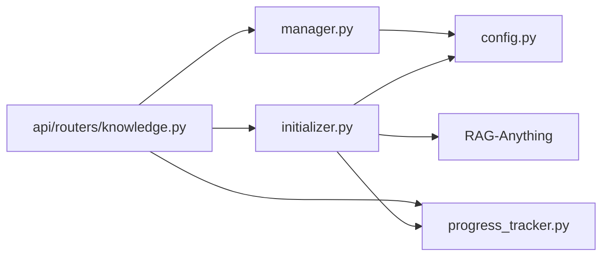

# 知识库创建

<cite>
**本文引用的文件**
- [src/knowledge/initializer.py](file://src/knowledge/initializer.py)
- [src/knowledge/config.py](file://src/knowledge/config.py)
- [src/knowledge/manager.py](file://src/knowledge/manager.py)
- [src/knowledge/progress_tracker.py](file://src/knowledge/progress_tracker.py)
- [src/knowledge/start_kb.py](file://src/knowledge/start_kb.py)
- [src/api/routers/knowledge.py](file://src/api/routers/knowledge.py)
- [src/knowledge/add_documents.py](file://src/knowledge/add_documents.py)
</cite>

## 目录
1. [简介](#简介)
2. [项目结构](#项目结构)
3. [核心组件](#核心组件)
4. [架构总览](#架构总览)
5. [详细组件分析](#详细组件分析)
6. [依赖关系分析](#依赖关系分析)
7. [性能考量](#性能考量)
8. [故障排查指南](#故障排查指南)
9. [结论](#结论)
10. [附录](#附录)

## 简介
本文件聚焦“知识库创建”能力，系统性说明以下内容：
- KnowledgeBaseInitializer 类的初始化流程与职责边界
- 目录结构创建（raw、images、rag_storage、content_list）与元数据生成
- 配置注册机制（kb_config.json）与默认知识库策略
- API 路由中 /create 端点的前端调用链路与后台任务执行
- CLI 与 API 的使用示例、错误处理与常见问题解决

## 项目结构
知识库创建涉及多个模块协同工作：
- 初始化器：负责目录结构创建、文档复制、RAG 处理、内容列表提取与统计
- 配置模块：统一路径与环境变量读取
- 管理器：对知识库进行注册、查询、删除、清理等管理操作
- 进度追踪：记录初始化阶段、进度百分比、错误信息并通过文件与广播通知
- API 路由：对外暴露 /create 等端点，支持上传文件并异步初始化
- CLI 启动脚本：提供命令行入口，便于批量或自动化场景

图表来源
- [src/knowledge/initializer.py](file://src/knowledge/initializer.py#L47-L141)
- [src/knowledge/config.py](file://src/knowledge/config.py#L1-L66)
- [src/knowledge/manager.py](file://src/knowledge/manager.py#L12-L121)
- [src/knowledge/progress_tracker.py](file://src/knowledge/progress_tracker.py#L38-L192)
- [src/api/routers/knowledge.py](file://src/api/routers/knowledge.py#L346-L422)
- [src/knowledge/start_kb.py](file://src/knowledge/start_kb.py#L112-L176)
- [src/knowledge/add_documents.py](file://src/knowledge/add_documents.py#L44-L131)

章节来源
- [src/knowledge/initializer.py](file://src/knowledge/initializer.py#L47-L141)
- [src/knowledge/config.py](file://src/knowledge/config.py#L1-L66)
- [src/knowledge/manager.py](file://src/knowledge/manager.py#L12-L121)
- [src/knowledge/progress_tracker.py](file://src/knowledge/progress_tracker.py#L38-L192)
- [src/api/routers/knowledge.py](file://src/api/routers/knowledge.py#L346-L422)
- [src/knowledge/start_kb.py](file://src/knowledge/start_kb.py#L112-L176)
- [src/knowledge/add_documents.py](file://src/knowledge/add_documents.py#L44-L131)

## 核心组件
- KnowledgeBaseInitializer：知识库初始化器，负责目录结构创建、文档复制、RAG 处理、内容列表提取、统计输出与结构修复
- KnowledgeBaseManager：知识库管理器，负责 kb_config.json 的读写、默认知识库设置、路径解析与统计信息聚合
- ProgressTracker：进度追踪器，持久化进度到 .progress.json，并通过回调与广播推送进度
- config.py：统一路径与环境变量读取，确保 RAG-Anything 模块可用
- API 路由 knowledge.py：提供 /create 端点，接收文件上传并启动后台初始化任务
- CLI start_kb.py：提供命令行入口，支持初始化、刷新、清理等操作

章节来源
- [src/knowledge/initializer.py](file://src/knowledge/initializer.py#L47-L141)
- [src/knowledge/manager.py](file://src/knowledge/manager.py#L12-L121)
- [src/knowledge/progress_tracker.py](file://src/knowledge/progress_tracker.py#L38-L192)
- [src/knowledge/config.py](file://src/knowledge/config.py#L1-L66)
- [src/api/routers/knowledge.py](file://src/api/routers/knowledge.py#L346-L422)
- [src/knowledge/start_kb.py](file://src/knowledge/start_kb.py#L112-L176)

## 架构总览
从“前端调用 -> 后台任务 -> 物理目录创建 -> RAG 处理 -> 内容提取”的完整链路如下：

图表来源
- [src/api/routers/knowledge.py](file://src/api/routers/knowledge.py#L346-L422)
- [src/knowledge/initializer.py](file://src/knowledge/initializer.py#L112-L141)
- [src/knowledge/manager.py](file://src/knowledge/manager.py#L12-L121)
- [src/knowledge/progress_tracker.py](file://src/knowledge/progress_tracker.py#L119-L172)

## 详细组件分析

### KnowledgeBaseInitializer 类
- 职责边界
  - 目录结构创建：raw、images、rag_storage、content_list 四个子目录
  - 元数据生成：在知识库根目录生成 metadata.json
  - 配置注册：自动写入 kb_config.json，首次创建时设为默认
  - 文档处理：基于 RAG-Anything 完成文档解析、抽取、插入与图像复制
  - 结构修复：扁平化嵌套目录，移动内容列表与图片
  - 内容提取：从 content_list 中抽取编号条目并合并输出
  - 统计输出：统计原始文档、图片、内容列表数量及 RAG 存储统计

- 关键方法与行为
  - create_directory_structure：创建四类目录并写入 metadata.json，随后注册到 kb_config.json
  - _register_to_config：读取/更新 kb_config.json，首次创建时设置默认知识库
  - process_documents：扫描 raw 目录，构建 RAGAnything 配置，逐文件处理并复制图片
  - fix_structure：修复嵌套目录，移动内容列表与图片，清理临时目录
  - extract_numbered_items：遍历 content_list/*.json，调用内容提取函数并合并结果
  - display_statistics：读取 RAG 存储统计文件，输出实体、关系、文本块数量

图表来源
- [src/knowledge/initializer.py](file://src/knowledge/initializer.py#L47-L141)
- [src/knowledge/progress_tracker.py](file://src/knowledge/progress_tracker.py#L38-L192)

章节来源
- [src/knowledge/initializer.py](file://src/knowledge/initializer.py#L112-L141)
- [src/knowledge/initializer.py](file://src/knowledge/initializer.py#L160-L367)
- [src/knowledge/initializer.py](file://src/knowledge/initializer.py#L368-L525)
- [src/knowledge/initializer.py](file://src/knowledge/initializer.py#L526-L567)

### 目录结构与元数据
- 目录结构
  - raw：存放原始文档
  - images：存放抽取的图片
  - rag_storage：RAG 存储（LightRAG）
  - content_list：内容列表（JSON），用于后续编号条目提取
- 元数据
  - metadata.json：包含名称、创建时间、描述、版本等字段

章节来源
- [src/knowledge/initializer.py](file://src/knowledge/initializer.py#L112-L141)

### 配置注册机制（kb_config.json）
- 作用
  - 记录所有知识库的路径与描述，作为权威索引
  - 支持默认知识库设置
- 注册时机
  - 初始化器在创建目录结构后自动注册
  - API 路由在创建成功后若未在配置中发现，会手动触发注册
- 读取与回退
  - 管理器优先从 kb_config.json 读取，若不存在则回退到扫描目录并检查 metadata.json

章节来源
- [src/knowledge/initializer.py](file://src/knowledge/initializer.py#L73-L111)
- [src/knowledge/manager.py](file://src/knowledge/manager.py#L12-L121)
- [src/api/routers/knowledge.py](file://src/api/routers/knowledge.py#L383-L389)

### API 路由 /create 端点与前端调用链路
- 请求参数
  - 表单字段：name（知识库名称）、files[]（多文件上传）
- 控制流
  - 校验知识库是否存在
  - 获取 LLM 配置（api_key/base_url）
  - 创建 KnowledgeBaseInitializer 实例
  - 调用 create_directory_structure 并写入 metadata.json
  - 若配置中缺失，则调用 _register_to_config 手动注册
  - 将上传文件保存到 raw/ 目录
  - 更新进度为 INITIALIZING
  - 启动后台任务 run_initialization_task，异步执行 process_documents 与 extract_numbered_items
- 前端调用建议
  - 使用 multipart/form-data 提交 name 与 files[]
  - 通过 /{kb_name}/progress 或 WebSocket /{kb_name}/progress/ws 实时获取进度

图表来源
- [src/api/routers/knowledge.py](file://src/api/routers/knowledge.py#L346-L422)
- [src/knowledge/initializer.py](file://src/knowledge/initializer.py#L112-L141)
- [src/knowledge/progress_tracker.py](file://src/knowledge/progress_tracker.py#L119-L172)

章节来源
- [src/api/routers/knowledge.py](file://src/api/routers/knowledge.py#L346-L422)

### CLI 使用示例
- 初始化新知识库（直接运行）
  - python -m knowledge_init.start_kb init <name> --docs <file1> [--docs-dir <dir>] [--api-key <key>] [--base-url <url>]
- 列出知识库
  - python -m knowledge_init.start_kb list
- 查看知识库详情
  - python -m knowledge_init.start_kb info <name>
- 设置默认知识库
  - python -m knowledge_init.start_kb set-default <name>
- 删除知识库
  - python -m knowledge_init.start_kb delete <name> [--force]
- 清理 RAG 存储
  - python -m knowledge_init.start_kb clean-rag <name> [--no-backup]
- 刷新知识库（重新处理文档）
  - python -m knowledge_init.start_kb refresh <name> [--full] [--skip-extract] [--batch-size N]

章节来源
- [src/knowledge/start_kb.py](file://src/knowledge/start_kb.py#L357-L535)

### 错误处理机制
- API 层
  - 对重复名称、配置缺失、文件不存在等情况抛出 HTTPException
  - 后台任务捕获异常并更新进度为 ERROR，同时记录日志
- 初始化器与管理器
  - 文件读写失败时记录警告并跳过；目录不存在时抛出异常
  - 进度追踪器持久化失败时打印提示，不影响主流程
- 前端
  - 建议对响应状态码与错误信息进行解析，必要时显示详细错误堆栈

章节来源
- [src/api/routers/knowledge.py](file://src/api/routers/knowledge.py#L346-L422)
- [src/knowledge/initializer.py](file://src/knowledge/initializer.py#L160-L367)
- [src/knowledge/manager.py](file://src/knowledge/manager.py#L262-L341)
- [src/knowledge/progress_tracker.py](file://src/knowledge/progress_tracker.py#L119-L172)

## 依赖关系分析
- 初始化器依赖
  - config.py：获取统一路径与环境变量
  - progress_tracker.py：进度持久化与广播
  - RAG-Anything：文档解析与知识图谱构建
- API 路由依赖
  - KnowledgeBaseInitializer：执行初始化
  - KnowledgeBaseManager：校验与注册
  - ProgressTracker：进度上报
- 管理器依赖
  - kb_config.json：知识库索引
  - metadata.json：元数据回退

图表来源
- [src/knowledge/initializer.py](file://src/knowledge/initializer.py#L47-L141)
- [src/knowledge/config.py](file://src/knowledge/config.py#L1-L66)
- [src/knowledge/manager.py](file://src/knowledge/manager.py#L12-L121)
- [src/knowledge/progress_tracker.py](file://src/knowledge/progress_tracker.py#L38-L192)
- [src/api/routers/knowledge.py](file://src/api/routers/knowledge.py#L346-L422)

章节来源
- [src/knowledge/initializer.py](file://src/knowledge/initializer.py#L47-L141)
- [src/knowledge/manager.py](file://src/knowledge/manager.py#L12-L121)
- [src/knowledge/progress_tracker.py](file://src/knowledge/progress_tracker.py#L38-L192)
- [src/knowledge/config.py](file://src/knowledge/config.py#L1-L66)
- [src/api/routers/knowledge.py](file://src/api/routers/knowledge.py#L346-L422)

## 性能考量
- 文档处理并发
  - RAG-Anything 的处理是异步的，初始化器按文件顺序处理，避免并发冲突
  - 若需要更高吞吐，可在上层增加并发控制（例如分批处理）
- I/O 优化
  - 批量复制文件与移动图片时尽量减少中间目录层级，避免多次重命名
  - 结构修复阶段先复制再删除，降低磁盘碎片
- 进度追踪
  - 进度文件写入频繁，建议在高并发场景下合并写入或采用异步写入策略

[本节为通用指导，不直接分析具体文件]

## 故障排查指南
- 常见问题
  - 知识库名称重复：/create 返回 400，需更换名称
  - LLM 配置缺失：API 层返回 500，需设置 LLM_BINDING_API_KEY/LLM_BINDING_HOST
  - 无文档可处理：process_documents 会记录警告并更新进度为 ERROR
  - RAG 存储损坏：使用 clean-rag 命令清理并备份
  - 进度卡住：通过 /{kb_name}/progress/clear 清理 .progress.json
- 定位手段
  - 查看日志：ProgressTracker 会在终端与日志文件输出进度
  - 检查 kb_config.json 与 metadata.json 是否存在
  - 使用 /health 端点确认配置文件与基础目录状态

章节来源
- [src/api/routers/knowledge.py](file://src/api/routers/knowledge.py#L173-L206)
- [src/knowledge/manager.py](file://src/knowledge/manager.py#L304-L341)
- [src/knowledge/progress_tracker.py](file://src/knowledge/progress_tracker.py#L173-L192)

## 结论
知识库创建以 KnowledgeBaseInitializer 为核心，配合 kb_config.json 注册、metadata.json 元数据与 ProgressTracker 进度追踪，形成“目录结构 -> 文档处理 -> 内容提取 -> 统计输出”的闭环。API /create 端点提供前端友好的创建与进度查询能力，CLI 则覆盖更丰富的管理场景。通过合理的错误处理与回退策略，系统在异常情况下仍能保持稳健运行。

[本节为总结性内容，不直接分析具体文件]

## 附录

### API 端点定义（与知识库创建相关）
- POST /create
  - 表单参数：name、files[]
  - 成功响应：返回知识库名称与处理的文件列表
  - 异常：400（已存在）、500（配置缺失/内部错误）

章节来源
- [src/api/routers/knowledge.py](file://src/api/routers/knowledge.py#L346-L422)

### 目录结构与文件清单
- 知识库根目录
  - raw：原始文档
  - images：抽取图片
  - rag_storage：RAG 存储
  - content_list：内容列表（JSON）
  - metadata.json：元数据
  - .progress.json：进度追踪文件（由 ProgressTracker 生成）

章节来源
- [src/knowledge/initializer.py](file://src/knowledge/initializer.py#L112-L141)
- [src/knowledge/progress_tracker.py](file://src/knowledge/progress_tracker.py#L173-L192)