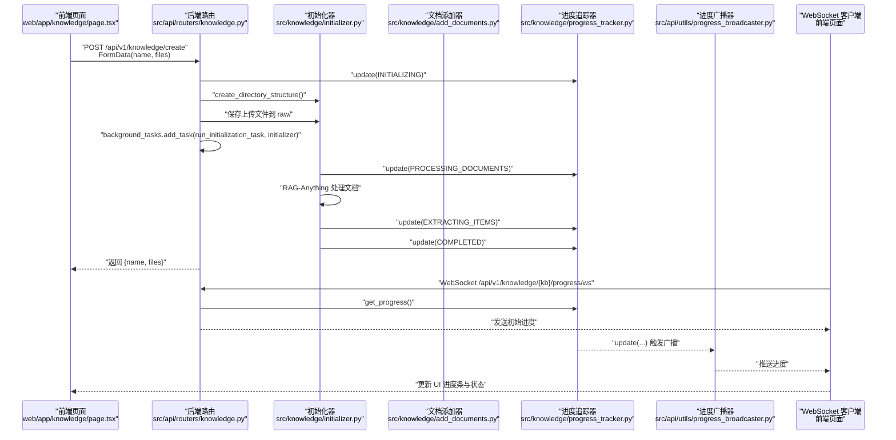
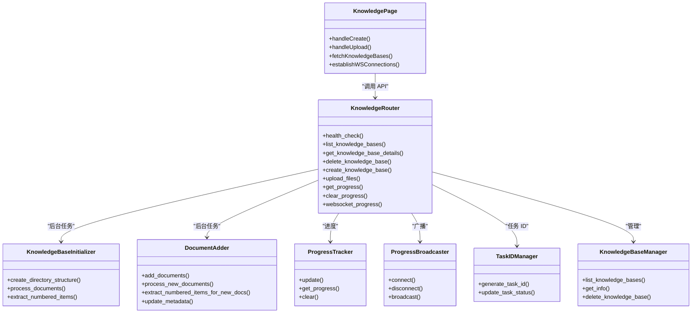

# 知识库创建工作流

<cite>
**本文引用的文件列表**
- [web/app/knowledge/page.tsx](file://web/app/knowledge/page.tsx)
- [src/api/routers/knowledge.py](file://src/api/routers/knowledge.py)
- [src/knowledge/progress_tracker.py](file://src/knowledge/progress_tracker.py)
- [src/knowledge/initializer.py](file://src/knowledge/initializer.py)
- [src/knowledge/add_documents.py](file://src/knowledge/add_documents.py)
- [src/api/utils/progress_broadcaster.py](file://src/api/utils/progress_broadcaster.py)
- [src/api/utils/task_id_manager.py](file://src/api/utils/task_id_manager.py)
- [src/knowledge/manager.py](file://src/knowledge/manager.py)
- [web/lib/api.ts](file://web/lib/api.ts)
</cite>

## 目录
1. [引言](#引言)
2. [项目结构](#项目结构)
3. [核心组件](#核心组件)
4. [架构总览](#架构总览)
5. [详细组件分析](#详细组件分析)
6. [依赖关系分析](#依赖关系分析)
7. [性能考量](#性能考量)
8. [故障排查指南](#故障排查指南)
9. [结论](#结论)

## 引言
本文件系统性梳理“知识库创建”的完整工作流程：从前端页面发起请求，到后端异步初始化与文档处理，再到进度实时反馈与状态展示。重点覆盖以下方面：
- 前端 UI 如何触发创建与上传
- 后端 API 路由如何接收请求并启动后台任务
- 初始化任务 run_initialization_task 的执行阶段（文档处理、内容提取、进度更新）
- ProgressTracker 如何记录与广播进度
- WebSocket 与轮询机制如何将状态回传给前端
- 常见问题与解决方案（创建失败、重复名称、长时间无响应等）

## 项目结构
该功能涉及前后端多模块协作：
- 前端：Next.js 页面组件负责用户交互、上传与进度展示
- 后端：FastAPI 路由处理请求、管理知识库、调度后台任务
- 进度追踪：本地文件与 WebSocket 广播双通道
- 工具与服务：任务 ID 管理、知识库管理器、文档添加器

```mermaid
graph TB
subgraph "前端"
FE_Page["web/app/knowledge/page.tsx"]
FE_API["web/lib/api.ts"]
end
subgraph "后端"
API_Router["src/api/routers/knowledge.py"]
API_Broadcaster["src/api/utils/progress_broadcaster.py"]
API_TaskMgr["src/api/utils/task_id_manager.py"]
end
subgraph "知识库处理"
KB_Init["src/knowledge/initializer.py"]
KB_Adder["src/knowledge/add_documents.py"]
KB_Progress["src/knowledge/progress_tracker.py"]
KB_Manager["src/knowledge/manager.py"]
end
FE_Page --> FE_API
FE_API --> API_Router
API_Router --> API_TaskMgr
API_Router --> KB_Manager
API_Router --> API_Broadcaster
API_Router --> KB_Init
API_Router --> KB_Adder
KB_Init --> KB_Progress
KB_Adder --> KB_Progress
API_Broadcaster <- --> FE_Page
```

图表来源
- [web/app/knowledge/page.tsx](file://web/app/knowledge/page.tsx#L1-L120)
- [web/lib/api.ts](file://web/lib/api.ts#L1-L59)
- [src/api/routers/knowledge.py](file://src/api/routers/knowledge.py#L1-L120)
- [src/api/utils/progress_broadcaster.py](file://src/api/utils/progress_broadcaster.py#L1-L73)
- [src/api/utils/task_id_manager.py](file://src/api/utils/task_id_manager.py#L1-L103)
- [src/knowledge/initializer.py](file://src/knowledge/initializer.py#L1-L120)
- [src/knowledge/add_documents.py](file://src/knowledge/add_documents.py#L1-L120)
- [src/knowledge/progress_tracker.py](file://src/knowledge/progress_tracker.py#L1-L120)
- [src/knowledge/manager.py](file://src/knowledge/manager.py#L1-L120)

章节来源
- [web/app/knowledge/page.tsx](file://web/app/knowledge/page.tsx#L1-L120)
- [src/api/routers/knowledge.py](file://src/api/routers/knowledge.py#L1-L120)

## 核心组件
- 前端页面组件：负责创建知识库、上传文件、建立 WebSocket 连接、持久化进度、清理过期状态
- 后端路由：提供健康检查、列出知识库、删除知识库、创建知识库、上传文件、进度查询、WebSocket 实时进度
- 初始化器：创建目录结构、复制文档、使用 RAG-Anything 处理文档、提取编号条目、统计信息
- 文档添加器：为已有知识库增量添加新文档并处理
- 进度追踪器：写入本地进度文件、回调通知、WebSocket 广播
- 进度广播器：维护每个知识库的 WebSocket 连接集合，向订阅者广播进度
- 任务 ID 管理器：为后台任务生成唯一 ID，记录状态
- 知识库管理器：读取/写入配置、统计信息、路径管理

章节来源
- [web/app/knowledge/page.tsx](file://web/app/knowledge/page.tsx#L1-L200)
- [src/api/routers/knowledge.py](file://src/api/routers/knowledge.py#L1-L200)
- [src/knowledge/initializer.py](file://src/knowledge/initializer.py#L1-L120)
- [src/knowledge/add_documents.py](file://src/knowledge/add_documents.py#L1-L120)
- [src/knowledge/progress_tracker.py](file://src/knowledge/progress_tracker.py#L1-L120)
- [src/api/utils/progress_broadcaster.py](file://src/api/utils/progress_broadcaster.py#L1-L73)
- [src/api/utils/task_id_manager.py](file://src/api/utils/task_id_manager.py#L1-L103)
- [src/knowledge/manager.py](file://src/knowledge/manager.py#L1-L120)

## 架构总览
从 UI 到后台的端到端流程如下：



图表来源
- [web/app/knowledge/page.tsx](file://web/app/knowledge/page.tsx#L474-L550)
- [src/api/routers/knowledge.py](file://src/api/routers/knowledge.py#L346-L422)
- [src/knowledge/initializer.py](file://src/knowledge/initializer.py#L160-L210)
- [src/knowledge/progress_tracker.py](file://src/knowledge/progress_tracker.py#L119-L172)
- [src/api/utils/progress_broadcaster.py](file://src/api/utils/progress_broadcaster.py#L44-L73)

## 详细组件分析

### 前端：知识库创建与进度展示
- 用户在页面点击“新建知识库”，选择文件并提交表单
- 前端构造 FormData，包含 name 与 files 字段，调用创建接口
- 创建成功后，前端乐观地将新 KB 加入列表，并初始化进度状态
- 前端定时刷新知识库列表，同时为每个 KB 建立 WebSocket 连接以接收实时进度
- 进度持久化到本地存储，支持清理过期状态

章节来源
- [web/app/knowledge/page.tsx](file://web/app/knowledge/page.tsx#L474-L550)
- [web/app/knowledge/page.tsx](file://web/app/knowledge/page.tsx#L209-L358)
- [web/app/knowledge/page.tsx](file://web/app/knowledge/page.tsx#L400-L442)
- [web/lib/api.ts](file://web/lib/api.ts#L1-L59)

### 后端：创建与上传 API
- 健康检查：返回配置与目录状态
- 列出知识库：读取配置与目录，汇总统计信息
- 删除知识库：删除目录并更新配置
- 创建知识库：
  - 校验重名
  - 保存文件至 raw 目录
  - 初始化进度为“初始化中”
  - 启动后台任务 run_initialization_task
- 上传文件：
  - 保存文件至目标 KB 的 raw 目录
  - 启动后台任务 run_upload_processing_task
- 进度查询与清除：读取/清空进度文件
- WebSocket 实时进度：连接后发送初始进度，周期性推送变更

章节来源
- [src/api/routers/knowledge.py](file://src/api/routers/knowledge.py#L173-L266)
- [src/api/routers/knowledge.py](file://src/api/routers/knowledge.py#L296-L344)
- [src/api/routers/knowledge.py](file://src/api/routers/knowledge.py#L346-L422)
- [src/api/routers/knowledge.py](file://src/api/routers/knowledge.py#L424-L448)
- [src/api/routers/knowledge.py](file://src/api/routers/knowledge.py#L450-L535)

### 初始化任务：run_initialization_task
- 生成任务 ID，绑定到进度追踪器
- 调用 KnowledgeBaseInitializer.process_documents 执行文档处理
- 调用 extract_numbered_items 提取编号条目
- 更新进度为完成或错误，并记录任务状态

章节来源
- [src/api/routers/knowledge.py](file://src/api/routers/knowledge.py#L65-L107)
- [src/knowledge/initializer.py](file://src/knowledge/initializer.py#L160-L210)

### 文档处理与内容提取
- process_documents：
  - 遍历 raw 目录文档
  - 使用 RAG-Anything 完整处理（解析、抽取、插入）
  - 复制提取图片到 images 目录
  - 修正嵌套结构，统计信息
- extract_numbered_items：
  - 读取 content_list 文件
  - 调用内容提取工具合并输出到 numbered_items.json
  - 更新进度并标记完成

章节来源
- [src/knowledge/initializer.py](file://src/knowledge/initializer.py#L160-L366)
- [src/knowledge/initializer.py](file://src/knowledge/initializer.py#L444-L524)

### 增量上传处理：run_upload_processing_task
- 保存上传文件到目标 KB 的 raw 目录
- 初始化进度为“处理文档”
- 使用 DocumentAdder.process_new_documents 仅处理新增文档
- 提取新增文档的编号条目并更新元数据
- 发送完成或错误状态

章节来源
- [src/api/routers/knowledge.py](file://src/api/routers/knowledge.py#L108-L171)
- [src/knowledge/add_documents.py](file://src/knowledge/add_documents.py#L132-L321)
- [src/knowledge/add_documents.py](file://src/knowledge/add_documents.py#L397-L453)

### 进度追踪与广播：ProgressTracker 与 ProgressBroadcaster
- ProgressTracker：
  - 写入 .progress.json 文件
  - 支持回调与事件循环兼容的广播
  - 记录时间戳、百分比、当前/总数、文件名、错误信息
- ProgressBroadcaster：
  - 维护每个 KB 的 WebSocket 连接集合
  - 广播进度消息，自动清理断开连接

章节来源
- [src/knowledge/progress_tracker.py](file://src/knowledge/progress_tracker.py#L1-L192)
- [src/api/utils/progress_broadcaster.py](file://src/api/utils/progress_broadcaster.py#L1-L73)

### 任务 ID 管理：TaskIDManager
- 为不同任务类型生成稳定且唯一的任务 ID
- 记录任务元数据（类型、键、创建/结束时间、状态）
- 支持清理旧任务

章节来源
- [src/api/utils/task_id_manager.py](file://src/api/utils/task_id_manager.py#L1-L103)

### 知识库管理：KnowledgeBaseManager
- 统一管理知识库配置与目录
- 提供统计信息（原始文档数、图片数、内容列表数、是否已初始化）
- 支持删除知识库、清理 RAG 存储

章节来源
- [src/knowledge/manager.py](file://src/knowledge/manager.py#L1-L260)

## 依赖关系分析



图表来源
- [web/app/knowledge/page.tsx](file://web/app/knowledge/page.tsx#L1-L120)
- [src/api/routers/knowledge.py](file://src/api/routers/knowledge.py#L1-L120)
- [src/knowledge/initializer.py](file://src/knowledge/initializer.py#L1-L120)
- [src/knowledge/add_documents.py](file://src/knowledge/add_documents.py#L1-L120)
- [src/knowledge/progress_tracker.py](file://src/knowledge/progress_tracker.py#L1-L120)
- [src/api/utils/progress_broadcaster.py](file://src/api/utils/progress_broadcaster.py#L1-L73)
- [src/api/utils/task_id_manager.py](file://src/api/utils/task_id_manager.py#L1-L103)
- [src/knowledge/manager.py](file://src/knowledge/manager.py#L1-L120)

## 性能考量
- 后台任务采用异步执行，避免阻塞主请求线程
- 进度文件与 WebSocket 双通道确保前端及时感知状态变化
- 增量上传仅处理新增文档，减少重复计算
- 任务 ID 管理器可清理旧任务，避免内存泄漏
- 前端对 ready 状态的 KB 会过滤掉过期进度，避免误导

[本节为通用指导，不直接分析具体文件]

## 故障排查指南

- 创建失败（重名）
  - 现象：后端返回 400，提示知识库已存在
  - 处理：更换知识库名称或删除同名 KB 后重试
  - 参考
    - [src/api/routers/knowledge.py](file://src/api/routers/knowledge.py#L352-L364)

- 创建失败（LLM 配置缺失）
  - 现象：后端返回 500，提示 LLM 配置错误
  - 处理：检查环境变量或配置文件，确保提供正确的 API Key 与 Base URL
  - 参考
    - [src/api/routers/knowledge.py](file://src/api/routers/knowledge.py#L357-L363)

- 上传失败（KB 不存在）
  - 现象：后端返回 404
  - 处理：确认知识库名称正确或先创建知识库
  - 参考
    - [src/api/routers/knowledge.py](file://src/api/routers/knowledge.py#L340-L344)

- WebSocket 未收到进度
  - 现象：页面不显示进度或进度卡住
  - 排查：
    - 检查 WebSocket URL 是否与 API Base URL 一致
    - 确认后端 WebSocket 端点正常
    - 查看浏览器控制台与后端日志
  - 参考
    - [web/lib/api.ts](file://web/lib/api.ts#L41-L59)
    - [src/api/routers/knowledge.py](file://src/api/routers/knowledge.py#L450-L535)
    - [src/api/utils/progress_broadcaster.py](file://src/api/utils/progress_broadcaster.py#L44-L73)

- 进度文件异常或卡住
  - 现象：前端显示“已完成/错误”但页面仍显示进行中
  - 处理：使用“清除进度”按钮清理前端与后端进度文件，然后刷新
  - 参考
    - [web/app/knowledge/page.tsx](file://web/app/knowledge/page.tsx#L400-L442)
    - [src/api/routers/knowledge.py](file://src/api/routers/knowledge.py#L439-L448)

- 增量上传未生效
  - 现象：新增文档未被处理
  - 处理：确认已调用上传接口；检查 RAG 存储是否存在；必要时重新初始化
  - 参考
    - [src/api/routers/knowledge.py](file://src/api/routers/knowledge.py#L296-L344)
    - [src/knowledge/add_documents.py](file://src/knowledge/add_documents.py#L132-L321)

- 后端无法连接
  - 现象：前端网络错误
  - 处理：检查 NEXT_PUBLIC_API_BASE 是否正确；确认后端服务运行
  - 参考
    - [web/lib/api.ts](file://web/lib/api.ts#L1-L40)
    - [README.md](file://README.md#L1126-L1141)

## 结论
本工作流通过“前端触发 + 后端异步任务 + 进度文件与 WebSocket 双通道反馈”的设计，实现了从 UI 到后台的完整闭环。初始化阶段涵盖文档处理与内容提取两大步骤，配合任务 ID 管理与进度广播，既保证了用户体验，也便于问题定位与恢复。建议在生产环境中：
- 明确配置与权限（API Key、Base URL、目录权限）
- 对长耗时任务设置合理的超时与重试策略
- 前端对 ready 状态的 KB 过滤过期进度，避免误导
- 使用“清除进度”功能快速恢复异常状态