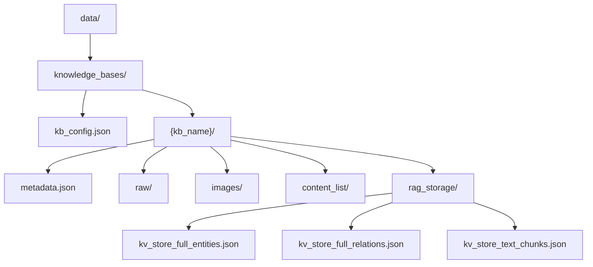
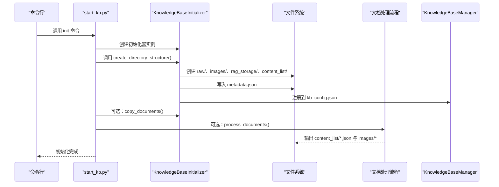
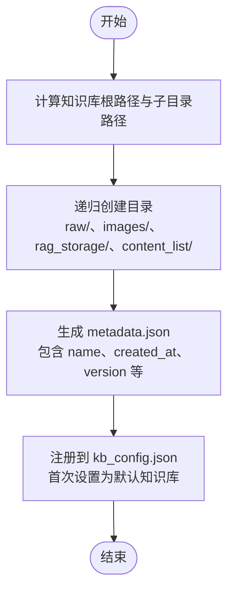
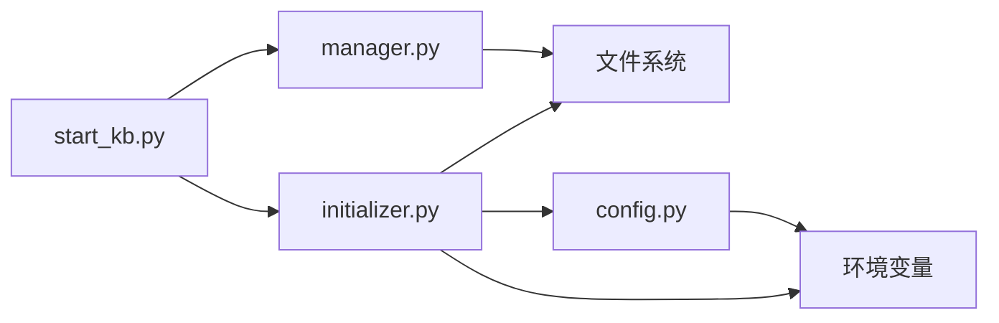

# 知识库目录结构

<cite>
**本文引用的文件**
- [src/knowledge/initializer.py](file://src/knowledge/initializer.py)
- [src/knowledge/start_kb.py](file://src/knowledge/start_kb.py)
- [src/knowledge/config.py](file://src/knowledge/config.py)
- [src/knowledge/manager.py](file://src/knowledge/manager.py)
- [src/knowledge/add_documents.py](file://src/knowledge/add_documents.py)
- [src/knowledge/README.md](file://src/knowledge/README.md)
- [data/README.md](file://data/README.md)
</cite>

## 目录
1. [简介](#简介)
2. [项目结构](#项目结构)
3. [核心组件](#核心组件)
4. [架构总览](#架构总览)
5. [详细组件分析](#详细组件分析)
6. [依赖关系分析](#依赖关系分析)
7. [性能考量](#性能考量)
8. [故障排查指南](#故障排查指南)
9. [结论](#结论)
10. [附录](#附录)

## 简介
本文件围绕知识库初始化时创建的目录结构进行系统性说明，重点覆盖以下四类核心目录：
- raw：存放原始文档（PDF、Word、Markdown等）
- images：存放从文档中提取出的图片
- rag_storage：存放RAG处理后的知识图谱与向量索引等数据
- content_list：存放结构化的“内容清单”（JSON格式）

同时，本文将解释 create_directory_structure 方法如何创建这些目录，以及 metadata.json 元数据文件的结构与作用；并结合代码示例展示目录创建流程，说明每个目录在知识处理流程中的角色，提供实际路径示例与权限管理建议，最后阐述该目录结构如何支撑后续的知识检索与分析功能。

## 项目结构
知识库目录位于统一的数据根目录下，采用“按知识库名分组”的组织方式。每个知识库包含一个独立的子目录，内部按上述四类目录划分职责，配合 metadata.json 与 kb_config.json 实现可发现、可管理、可追踪的结构化存储。

图表来源
- [data/README.md](file://data/README.md#L1-L73)
- [src/knowledge/README.md](file://src/knowledge/README.md#L185-L208)

章节来源
- [data/README.md](file://data/README.md#L1-L73)
- [src/knowledge/README.md](file://src/knowledge/README.md#L185-L208)

## 核心组件
- 知识库初始化器：负责创建目录结构、写入 metadata.json、注册到 kb_config.json，并驱动后续文档处理与内容清单抽取。
- 启动入口脚本：提供命令行入口，统一调用初始化器与管理器。
- 配置模块：统一路径与环境变量读取，确保模块导入与路径一致性。
- 管理器：提供知识库列表、默认知识库设置、信息查询、清理 RAG 存储等功能。
- 增量添加器：在已有知识库基础上追加新文档，复用同一目录结构。

章节来源
- [src/knowledge/initializer.py](file://src/knowledge/initializer.py#L47-L141)
- [src/knowledge/start_kb.py](file://src/knowledge/start_kb.py#L112-L176)
- [src/knowledge/config.py](file://src/knowledge/config.py#L1-L66)
- [src/knowledge/manager.py](file://src/knowledge/manager.py#L1-L120)
- [src/knowledge/add_documents.py](file://src/knowledge/add_documents.py#L44-L120)

## 架构总览
下面的序列图展示了“初始化知识库”的典型流程，突出目录创建与后续处理的关键步骤。

图表来源
- [src/knowledge/start_kb.py](file://src/knowledge/start_kb.py#L112-L176)
- [src/knowledge/initializer.py](file://src/knowledge/initializer.py#L112-L141)
- [src/knowledge/manager.py](file://src/knowledge/manager.py#L63-L90)

## 详细组件分析

### 目录结构与职责
- raw 目录
  - 用途：存放用户上传或复制进来的原始文档（PDF、DOCX、TXT、MD 等）。
  - 特点：仅存放原始文件，不包含解析产物。
- images 目录
  - 用途：存放从文档中提取出的图片资源，供后续展示与检索使用。
  - 特点：由 RAG 处理阶段自动产出，初始化后可能为空。
- rag_storage 目录
  - 用途：存放 RAG 知识图谱与向量索引等持久化数据，是检索与问答的核心数据层。
  - 特点：包含多个 kv_store_* 与 vdb_* 文件，初始化后通常为空，待处理完成后生成。
- content_list 目录
  - 用途：存放结构化的“内容清单”，记录文档的章节、条目、公式、图表等结构化信息。
  - 特点：每份文档对应一个 JSON 文件，命名与文档同名；初始化后可能为空，待处理完成后生成。

章节来源
- [src/knowledge/README.md](file://src/knowledge/README.md#L185-L208)
- [data/README.md](file://data/README.md#L60-L73)

### create_directory_structure 方法详解
该方法负责创建知识库所需的四类核心目录，并生成 metadata.json，同时自动注册到 kb_config.json。

- 关键步骤
  - 计算知识库根路径与各子目录路径（raw、images、rag_storage、content_list）。
  - 使用递归创建目录，确保父目录不存在时一并创建。
  - 写入 metadata.json，包含名称、创建时间、版本等基础字段。
  - 自动注册到 kb_config.json，若为首个知识库则设为默认。

- 代码定位
  - 目录创建与 metadata 写入：[src/knowledge/initializer.py](file://src/knowledge/initializer.py#L112-L141)
  - 自动注册到 kb_config.json：[src/knowledge/initializer.py](file://src/knowledge/initializer.py#L73-L111)

- 目录创建流程示意

图表来源
- [src/knowledge/initializer.py](file://src/knowledge/initializer.py#L63-L141)

章节来源
- [src/knowledge/initializer.py](file://src/knowledge/initializer.py#L63-L141)

### metadata.json 结构与作用
- 结构要点
  - 字段示例：name、created_at、last_updated、description、version、update_history 等。
  - update_history：记录每次操作的时间戳、动作类型与新增文件数量，便于审计与回溯。
- 作用
  - 提供知识库元信息，便于 UI 展示与管理。
  - 记录更新历史，支持增量维护与问题定位。
  - 作为知识库“身份标识”，被管理器读取用于信息汇总与统计。

- 示例参考
  - 结构示例与字段说明：[src/knowledge/README.md](file://src/knowledge/README.md#L209-L234)

- 读取与更新
  - 初始化时写入：[src/knowledge/initializer.py](file://src/knowledge/initializer.py#L126-L136)
  - 增量添加时更新：[src/knowledge/add_documents.py](file://src/knowledge/add_documents.py#L453-L486)
  - 管理器读取：[src/knowledge/manager.py](file://src/knowledge/manager.py#L127-L176)

章节来源
- [src/knowledge/README.md](file://src/knowledge/README.md#L209-L234)
- [src/knowledge/initializer.py](file://src/knowledge/initializer.py#L126-L136)
- [src/knowledge/add_documents.py](file://src/knowledge/add_documents.py#L453-L486)
- [src/knowledge/manager.py](file://src/knowledge/manager.py#L127-L176)

### 目录在知识处理流程中的角色
- 原始文档阶段
  - 将用户提供的 PDF/DOCX/TXT/MD 等文件复制到 raw/，作为后续处理的输入源。
  - 位置参考：[src/knowledge/initializer.py](file://src/knowledge/initializer.py#L142-L158)
- RAG 处理阶段
  - 使用 RAG-Anything 对 raw/ 中的文档进行解析、抽取、向量化与知识图谱构建，结果写入 rag_storage/。
  - 位置参考：[src/knowledge/initializer.py](file://src/knowledge/initializer.py#L160-L366)
- 图片提取阶段
  - 将 RAG 处理过程中抽取的图片复制到 images/，便于后续展示与检索。
  - 位置参考：[src/knowledge/initializer.py](file://src/knowledge/initializer.py#L349-L358)
- 结构化内容清单阶段
  - 将解析后的结构化内容写入 content_list/ 下的 JSON 文件，命名与原文档一致。
  - 位置参考：[src/knowledge/initializer.py](file://src/knowledge/initializer.py#L307-L333)

章节来源
- [src/knowledge/initializer.py](file://src/knowledge/initializer.py#L142-L366)

### 实际路径示例与权限管理建议
- 默认知识库根路径
  - data/knowledge_bases/{kb_name}/
  - 其中 kb_name 为知识库名称，如 ai_textbook、math2211 等。
- 四类核心目录
  - raw：data/knowledge_bases/{kb_name}/raw/
  - images：data/knowledge_bases/{kb_name}/images/
  - rag_storage：data/knowledge_bases/{kb_name}/rag_storage/
  - content_list：data/knowledge_bases/{kb_name}/content_list/
- 权限管理建议
  - 应用需对 data/ 具备读写权限，确保能创建目录与写入文件。
  - 建议将 data/ 加入版本控制忽略列表，避免提交大文件。
  - 定期备份 knowledge_bases/，尤其是 rag_storage/ 与 numbered_items.json。

章节来源
- [data/README.md](file://data/README.md#L1-L73)
- [src/knowledge/README.md](file://src/knowledge/README.md#L432-L443)

### 如何支持后续的知识检索与分析
- 检索能力
  - rag_storage/ 中的向量索引与知识图谱为检索提供底层支撑，管理器可读取统计信息辅助诊断。
  - 位置参考：[src/knowledge/manager.py](file://src/knowledge/manager.py#L208-L259)
- 分析能力
  - content_list/ 的结构化 JSON 文件便于二次加工与统计分析。
  - numbered_items.json 作为“编号条目”的聚合结果，可用于教学大纲、题库生成等场景。
  - 位置参考：[src/knowledge/README.md](file://src/knowledge/README.md#L185-L208)

章节来源
- [src/knowledge/manager.py](file://src/knowledge/manager.py#L208-L259)
- [src/knowledge/README.md](file://src/knowledge/README.md#L185-L208)

## 依赖关系分析
- 路径与环境
  - 统一路径配置：KNOWLEDGE_BASES_DIR 指向 data/knowledge_bases，确保所有模块使用一致路径。
  - 环境变量：通过 get_env_config 读取 LLM_BINDING_API_KEY 与 LLM_BINDING_HOST，用于模型调用。
- 模块耦合
  - start_kb.py 作为统一入口，依赖 initializer.py 进行初始化，依赖 manager.py 进行信息查询与维护。
  - initializer.py 在创建目录与写入 metadata 后，自动注册到 kb_config.json，便于后续管理。
- 外部依赖
  - RAG-Anything 与 LightRAG：用于文档解析、向量化与知识图谱构建，其输出写入 rag_storage/。

图表来源
- [src/knowledge/start_kb.py](file://src/knowledge/start_kb.py#L1-L60)
- [src/knowledge/initializer.py](file://src/knowledge/initializer.py#L1-L46)
- [src/knowledge/config.py](file://src/knowledge/config.py#L25-L42)
- [src/knowledge/manager.py](file://src/knowledge/manager.py#L1-L34)

章节来源
- [src/knowledge/start_kb.py](file://src/knowledge/start_kb.py#L1-L60)
- [src/knowledge/initializer.py](file://src/knowledge/initializer.py#L1-L46)
- [src/knowledge/config.py](file://src/knowledge/config.py#L25-L42)
- [src/knowledge/manager.py](file://src/knowledge/manager.py#L1-L34)

## 性能考量
- 批量处理
  - content_list 抽取支持批量与并发参数，可根据文档规模调整 batch-size 与并发度，提升整体吞吐。
- 存储布局
  - 将原始文档与解析产物分离（raw/ 与 content_list/），有利于缓存命中与增量更新。
- 清理策略
  - 当 RAG 数据损坏时，可通过 clean-rag 命令清理并重建，减少重复全量处理成本。

[本节为通用指导，无需列出具体文件来源]

## 故障排查指南
- 目录未创建或权限不足
  - 确认应用对 data/ 具有写权限；检查路径是否正确（默认 data/knowledge_bases）。
- metadata.json 缺失或损坏
  - 初始化器会在创建目录时写入；若缺失，可重新初始化或手动恢复。
- RAG 存储异常
  - 使用 clean-rag 命令清理并重建；必要时执行 refresh 或增量添加流程。
- 增量添加失败
  - 检查目标知识库是否存在且已初始化；确认新增文件未重复导致跳过。

章节来源
- [src/knowledge/manager.py](file://src/knowledge/manager.py#L262-L340)
- [src/knowledge/add_documents.py](file://src/knowledge/add_documents.py#L488-L621)

## 结论
知识库初始化采用清晰的目录分层设计：raw 存原始文档、images 存提取图片、rag_storage 存 RAG 数据、content_list 存结构化内容清单。create_directory_structure 方法统一创建目录并写入 metadata.json，随后自动注册到 kb_config.json，形成可发现、可管理、可追踪的知识库体系。该结构为后续检索与分析提供了坚实基础，配合增量添加与清理修复机制，能够高效支撑大规模知识库的生命周期管理。

[本节为总结性内容，无需列出具体文件来源]

## 附录
- 命令行入口与常用命令
  - 初始化知识库：python -m src.knowledge.start_kb init {kb_name} --docs ...
  - 查看知识库信息：python -m src.knowledge.start_kb info {kb_name}
  - 清理 RAG 存储：python -m src.knowledge.start_kb clean-rag {kb_name}
  - 增量添加文档：python -m src.knowledge.add_documents {kb_name} --docs ...

章节来源
- [src/knowledge/README.md](file://src/knowledge/README.md#L61-L115)
- [src/knowledge/start_kb.py](file://src/knowledge/start_kb.py#L357-L535)