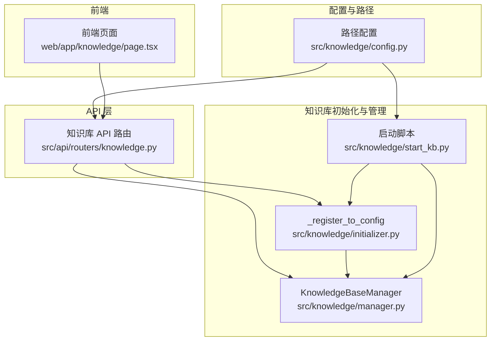
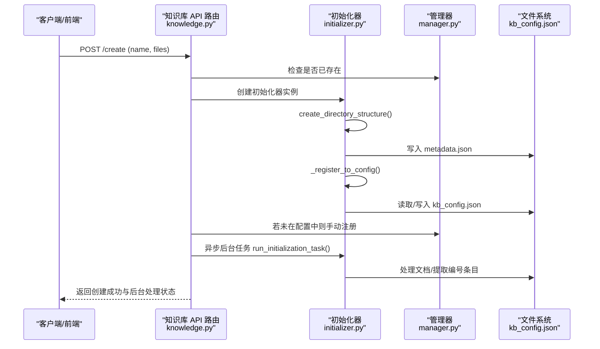
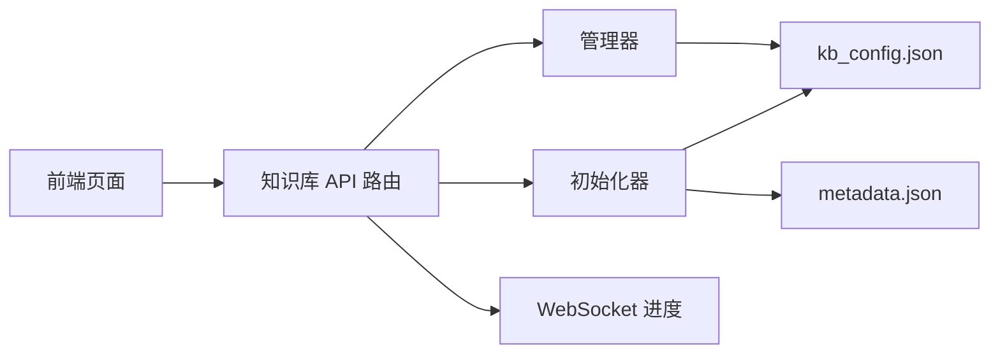

# 知识库配置管理

<cite>
**本文引用的文件列表**
- [src/api/routers/knowledge.py](file://src/api/routers/knowledge.py)
- [src/knowledge/initializer.py](file://src/knowledge/initializer.py)
- [src/knowledge/manager.py](file://src/knowledge/manager.py)
- [src/knowledge/start_kb.py](file://src/knowledge/start_kb.py)
- [src/knowledge/config.py](file://src/knowledge/config.py)
- [src/knowledge/README.md](file://src/knowledge/README.md)
- [web/app/knowledge/page.tsx](file://web/app/knowledge/page.tsx)
</cite>

## 目录
1. [简介](#简介)
2. [项目结构](#项目结构)
3. [核心组件](#核心组件)
4. [架构总览](#架构总览)
5. [详细组件分析](#详细组件分析)
6. [依赖关系分析](#依赖关系分析)
7. [性能考量](#性能考量)
8. [故障排查指南](#故障排查指南)
9. [结论](#结论)
10. [附录：配置文件格式规范](#附录配置文件格式规范)

## 简介
本文件聚焦于知识库配置注册机制，系统性解析以下关键问题：
- 如何通过 _register_to_config 方法将新创建的知识库信息写入 kb_config.json 配置文件
- 配置文件中 knowledge_bases 和 default 字段的结构与作用
- 首次创建知识库时默认设置的逻辑
- 结合 API 路由中的处理流程，展示从知识库创建请求到配置文件更新的完整链路
- 配置文件格式规范、错误处理机制（如文件读写失败）以及并发访问注意事项
- 通过代码片段路径演示配置注册过程，并说明如何通过配置文件实现知识库的动态加载与管理

## 项目结构
知识库配置管理涉及后端 API 路由、知识库初始化器、知识库管理器以及命令行启动脚本等多个模块。下图展示了与“配置注册”直接相关的模块与交互关系。

图表来源
- [src/api/routers/knowledge.py](file://src/api/routers/knowledge.py#L346-L422)
- [src/knowledge/initializer.py](file://src/knowledge/initializer.py#L73-L111)
- [src/knowledge/manager.py](file://src/knowledge/manager.py#L19-L34)
- [src/knowledge/start_kb.py](file://src/knowledge/start_kb.py#L112-L176)
- [src/knowledge/config.py](file://src/knowledge/config.py#L12-L23)

章节来源
- [src/api/routers/knowledge.py](file://src/api/routers/knowledge.py#L346-L422)
- [src/knowledge/initializer.py](file://src/knowledge/initializer.py#L73-L111)
- [src/knowledge/manager.py](file://src/knowledge/manager.py#L19-L34)
- [src/knowledge/start_kb.py](file://src/knowledge/start_kb.py#L112-L176)
- [src/knowledge/config.py](file://src/knowledge/config.py#L12-L23)

## 核心组件
- 知识库初始化器（KnowledgeBaseInitializer）
  - 负责创建目录结构、复制文档、处理文档、提取编号条目等
  - 提供 _register_to_config 方法用于向 kb_config.json 注册新知识库
- 知识库管理器（KnowledgeBaseManager）
  - 统一管理多个知识库，负责读取/保存 kb_config.json
  - 提供查询、设置默认知识库、删除知识库等功能
- 知识库 API 路由（knowledge.py）
  - 对外暴露创建知识库、上传文件、获取进度等接口
  - 在创建流程中调用初始化器并确保配置注册
- 启动脚本（start_kb.py）
  - 命令行入口，支持初始化、列出、设置默认、刷新、清理等操作
  - 初始化过程中自动调用 _register_to_config
- 路径配置（config.py）
  - 定义项目根目录、知识库基目录等路径常量，为其他模块提供统一路径来源

章节来源
- [src/knowledge/initializer.py](file://src/knowledge/initializer.py#L73-L111)
- [src/knowledge/manager.py](file://src/knowledge/manager.py#L19-L34)
- [src/api/routers/knowledge.py](file://src/api/routers/knowledge.py#L346-L422)
- [src/knowledge/start_kb.py](file://src/knowledge/start_kb.py#L112-L176)
- [src/knowledge/config.py](file://src/knowledge/config.py#L12-L23)

## 架构总览
从“创建知识库”的视角，完整的调用链如下所示：

图表来源
- [src/api/routers/knowledge.py](file://src/api/routers/knowledge.py#L346-L422)
- [src/knowledge/initializer.py](file://src/knowledge/initializer.py#L112-L141)
- [src/knowledge/manager.py](file://src/knowledge/manager.py#L63-L78)

章节来源
- [src/api/routers/knowledge.py](file://src/api/routers/knowledge.py#L346-L422)
- [src/knowledge/initializer.py](file://src/knowledge/initializer.py#L112-L141)
- [src/knowledge/manager.py](file://src/knowledge/manager.py#L63-L78)

## 详细组件分析

### 组件 A：_register_to_config 方法与 kb_config.json 注册
- 位置与职责
  - _register_to_config 实现位于知识库初始化器中，负责将新知识库写入 kb_config.json
  - 当知识库目录结构创建完成后，会自动触发该注册逻辑
- 关键行为
  - 读取现有配置（若不存在则以空结构初始化）
  - 将新知识库加入 knowledge_bases 映射，字段包含 path 与 description
  - 若当前配置中没有 default，则将新知识库设为默认
  - 写回 kb_config.json；若写入失败，记录警告日志
- 并发与一致性
  - 该方法在单次初始化流程中执行一次，不涉及跨进程并发
  - 若需多进程并发写入同一文件，建议引入锁或原子写策略（见“并发访问注意事项”）

章节来源
- [src/knowledge/initializer.py](file://src/knowledge/initializer.py#L73-L111)
- [src/knowledge/initializer.py](file://src/knowledge/initializer.py#L138-L141)

### 组件 B：KnowledgeBaseManager 的配置读写
- 读取配置
  - _load_config 会在 kb_config.json 存在时读取，否则返回空结构（knowledge_bases 为空字典，default 为 None）
- 写入配置
  - _save_config 使用标准 JSON 序列化写回文件
- 列表与默认值
  - list_knowledge_bases 以 kb_config.json 为权威来源，同时进行目录存在性校验
  - set_default/get_default 提供默认知识库的设置与查询

章节来源
- [src/knowledge/manager.py](file://src/knowledge/manager.py#L23-L34)
- [src/knowledge/manager.py](file://src/knowledge/manager.py#L35-L62)
- [src/knowledge/manager.py](file://src/knowledge/manager.py#L115-L126)

### 组件 C：API 路由中的创建流程与注册联动
- 创建知识库
  - 接口接收 name 与文件列表，先检查是否已存在
  - 创建初始化器并调用 create_directory_structure
  - 若发现配置中尚未登记该知识库，显式调用 _register_to_config 进行注册
  - 后台异步任务 run_initialization_task 执行文档处理与编号条目提取
- 进度与状态
  - 提供进度查询与 WebSocket 实时推送，便于前端感知初始化状态

章节来源
- [src/api/routers/knowledge.py](file://src/api/routers/knowledge.py#L346-L422)
- [src/api/routers/knowledge.py](file://src/api/routers/knowledge.py#L65-L107)

### 组件 D：命令行启动脚本中的初始化与注册
- 初始化流程
  - 支持从文档或目录初始化知识库
  - 自动创建目录结构并写入 metadata.json
  - 自动调用 _register_to_config 注册到 kb_config.json
- 其他能力
  - 列出知识库、显示详情、设置默认、删除、清理 RAG 存储、刷新等

章节来源
- [src/knowledge/start_kb.py](file://src/knowledge/start_kb.py#L112-L176)
- [src/knowledge/start_kb.py](file://src/knowledge/start_kb.py#L32-L63)

### 组件 E：路径配置与环境变量
- 路径常量
  - 提供 PROJECT_ROOT、KNOWLEDGE_BASES_DIR 等路径常量，统一知识库基目录来源
- 环境变量
  - 提供 get_env_config 获取 LLM 相关配置，供初始化器使用

章节来源
- [src/knowledge/config.py](file://src/knowledge/config.py#L12-L23)
- [src/knowledge/config.py](file://src/knowledge/config.py#L25-L41)

### 组件 F：前端与后端的集成
- 前端页面
  - 通过 HTTP 请求拉取知识库列表，对非数组响应进行严格校验与错误提示
- 后端 API
  - 提供 list、info、create、upload、progress 等接口，保障前端可动态加载与管理知识库

章节来源
- [web/app/knowledge/page.tsx](file://web/app/knowledge/page.tsx#L157-L192)
- [src/api/routers/knowledge.py](file://src/api/routers/knowledge.py#L194-L278)

## 依赖关系分析
- 模块耦合
  - API 路由依赖初始化器与管理器，管理器依赖 kb_config.json 文件
  - 初始化器在创建目录结构后自动注册，避免重复注册
  - 路径配置为全局提供统一路径来源
- 外部依赖
  - JSON 文件读写、FastAPI 路由、WebSocket 进度推送、后台任务队列

图表来源
- [src/api/routers/knowledge.py](file://src/api/routers/knowledge.py#L346-L422)
- [src/knowledge/initializer.py](file://src/knowledge/initializer.py#L112-L141)
- [src/knowledge/manager.py](file://src/knowledge/manager.py#L19-L34)

章节来源
- [src/api/routers/knowledge.py](file://src/api/routers/knowledge.py#L346-L422)
- [src/knowledge/initializer.py](file://src/knowledge/initializer.py#L112-L141)
- [src/knowledge/manager.py](file://src/knowledge/manager.py#L19-L34)

## 性能考量
- JSON 文件读写
  - 读写频率低，通常仅在创建与设置默认时发生，性能影响可忽略
- 后台任务
  - 文档处理与编号条目提取为异步后台任务，避免阻塞主请求
- 目录扫描
  - list_knowledge_bases 会遍历目录进行存在性校验，建议在知识库数量较多时优化为缓存或索引

[本节为通用指导，无需特定文件来源]

## 故障排查指南
- 配置文件读写失败
  - _register_to_config 在读取/写入 kb_config.json 失败时会记录警告日志，建议检查文件权限与磁盘空间
  - 管理器在读取配置失败时返回空结构，不影响后续初始化流程
- 默认知识库缺失
  - 若配置中无 default，且目录为空，list_knowledge_bases 会回退到目录扫描，但可能遗漏未正确注册的知识库
- 前端响应异常
  - 前端对非数组响应进行严格校验，若后端返回结构不符合预期，前端会抛出错误并打印详细信息
- 删除与清理
  - 删除知识库会移除目录并同步更新配置；清理 RAG 存储前可选择备份

章节来源
- [src/knowledge/initializer.py](file://src/knowledge/initializer.py#L73-L111)
- [src/knowledge/manager.py](file://src/knowledge/manager.py#L23-L34)
- [web/app/knowledge/page.tsx](file://web/app/knowledge/page.tsx#L157-L192)
- [src/knowledge/manager.py](file://src/knowledge/manager.py#L262-L303)
- [src/knowledge/manager.py](file://src/knowledge/manager.py#L304-L340)

## 结论
- _register_to_config 是知识库配置注册的核心方法，确保新知识库被可靠地登记到 kb_config.json
- knowledge_bases 字段维护知识库名称到元数据的映射，default 字段标识当前默认知识库
- 首次创建时，若配置为空，新知识库会被自动设为默认
- API 路由与命令行脚本均在初始化完成后保证配置注册，前端通过接口动态加载与管理知识库
- 建议在高并发场景下为配置文件写入增加互斥保护，并在生产环境中对配置文件进行备份与校验

[本节为总结，无需特定文件来源]

## 附录：配置文件格式规范

- 文件位置
  - data/knowledge_bases/kb_config.json
- 结构定义
  - knowledge_bases: object
    - 键：知识库名称（字符串）
    - 值：对象，包含
      - path: 知识库相对路径（字符串）
      - description: 描述（字符串）
  - default: string 或 null
    - 当前默认知识库名称，若未设置则为 null
- 示例
  - 参考知识库模块文档中的示例结构
- 首次创建默认设置
  - 若 knowledge_bases 为空或 default 为 null，则新知识库会被设为默认
- 动态加载与管理
  - 列表接口以 kb_config.json 为权威来源，结合 metadata.json 与统计信息提供完整视图
  - 设置默认知识库会更新 default 字段

章节来源
- [src/knowledge/manager.py](file://src/knowledge/manager.py#L23-L34)
- [src/knowledge/manager.py](file://src/knowledge/manager.py#L115-L126)
- [src/knowledge/README.md](file://src/knowledge/README.md#L209-L234)