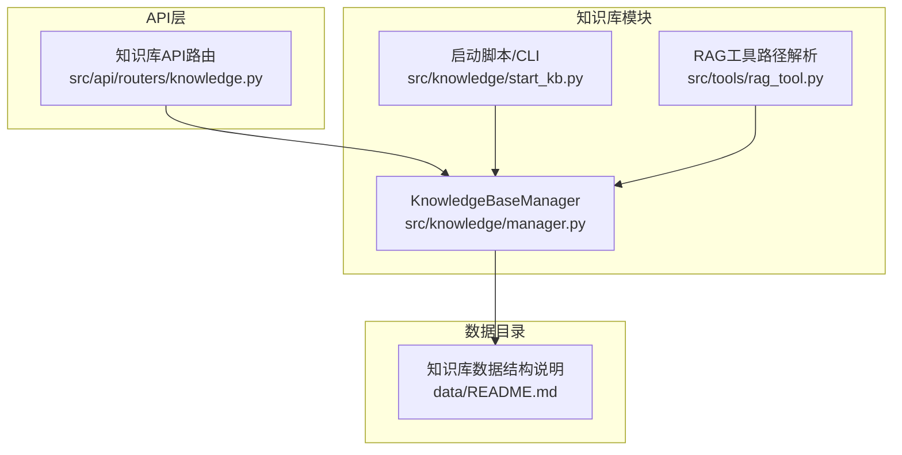
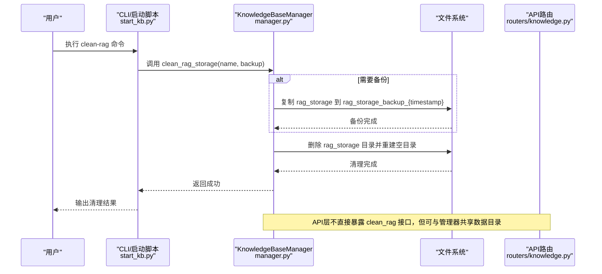
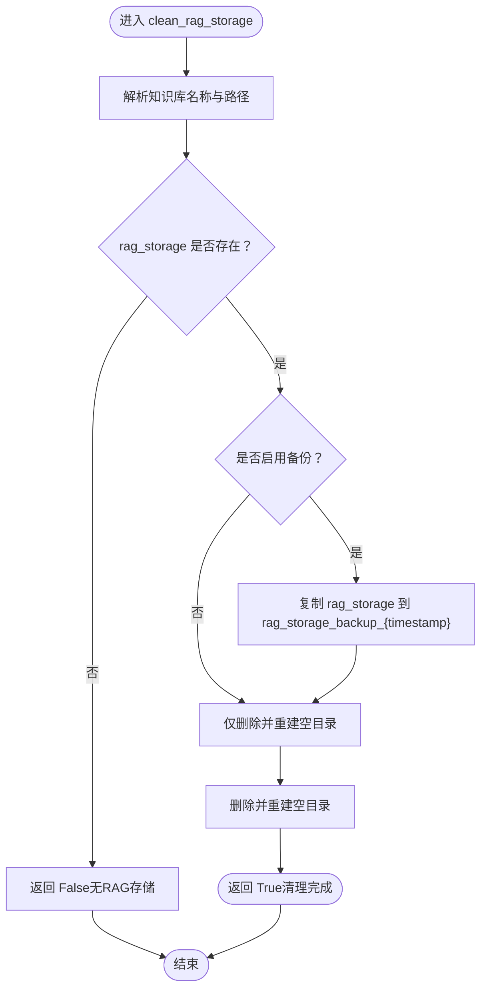
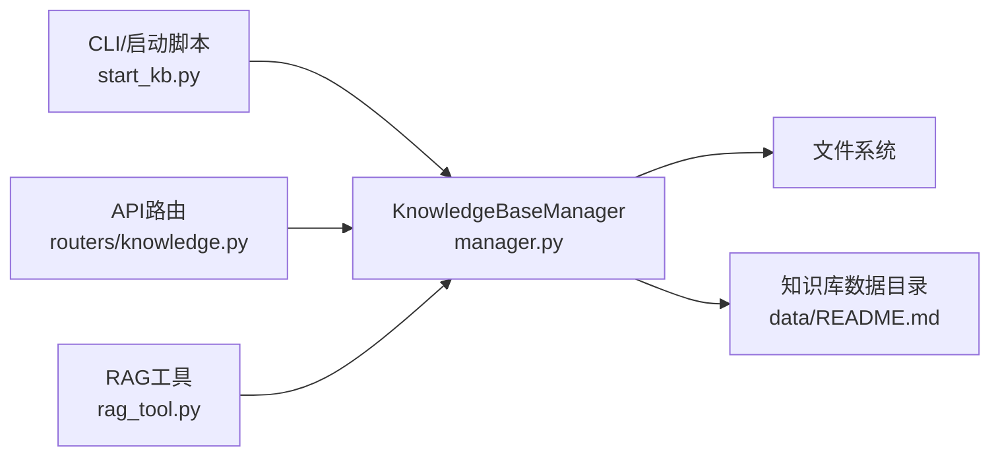

# RAG存储管理

<cite>
**本文引用的文件**
- [src/knowledge/manager.py](file://src/knowledge/manager.py)
- [src/knowledge/start_kb.py](file://src/knowledge/start_kb.py)
- [data/README.md](file://data/README.md)
- [src/api/routers/knowledge.py](file://src/api/routers/knowledge.py)
- [src/tools/rag_tool.py](file://src/tools/rag_tool.py)
- [src/knowledge/README.md](file://src/knowledge/README.md)
</cite>

## 目录
1. [简介](#简介)
2. [项目结构](#项目结构)
3. [核心组件](#核心组件)
4. [架构总览](#架构总览)
5. [详细组件分析](#详细组件分析)
6. [依赖关系分析](#依赖关系分析)
7. [性能考量](#性能考量)
8. [故障排查指南](#故障排查指南)
9. [结论](#结论)
10. [附录](#附录)

## 简介
本文件聚焦于RAG存储管理功能，特别是KnowledgeBaseManager类中的clean_rag_storage方法，用于修复RAG数据损坏问题。文档详细说明：
- 清理前的备份策略：基于时间戳创建rag_storage_backup_{timestamp}备份目录
- 安全清理流程：检测目标知识库是否存在RAG存储，按需备份后删除并重建空目录
- 结合data/README.md对rag_storage目录结构（graphml文件、kv_store和vdb的json文件）的说明，强调备份的重要性
- API层如何暴露此功能（当前API未直接暴露，但可通过CLI使用）
- 运维最佳实践：何时需要清理存储、如何从备份恢复

## 项目结构
与RAG存储管理相关的关键位置：
- 知识库管理器：src/knowledge/manager.py
- 启动脚本与CLI命令入口：src/knowledge/start_kb.py
- 数据目录结构说明：data/README.md
- API路由（知识库相关）：src/api/routers/knowledge.py
- RAG工具访问路径解析：src/tools/rag_tool.py
- 常见问题与修复指引：src/knowledge/README.md

图表来源
- [src/knowledge/manager.py](file://src/knowledge/manager.py#L1-L120)
- [src/knowledge/start_kb.py](file://src/knowledge/start_kb.py#L258-L273)
- [src/api/routers/knowledge.py](file://src/api/routers/knowledge.py#L1-L120)
- [src/tools/rag_tool.py](file://src/tools/rag_tool.py#L104-L136)
- [data/README.md](file://data/README.md#L1-L120)

章节来源
- [src/knowledge/manager.py](file://src/knowledge/manager.py#L1-L120)
- [src/knowledge/start_kb.py](file://src/knowledge/start_kb.py#L258-L273)
- [data/README.md](file://data/README.md#L1-L120)

## 核心组件
- KnowledgeBaseManager：提供知识库注册、查询、统计、删除以及RAG存储清理等能力
- CLI入口：通过start_kb.py提供clean-rag命令，调用KnowledgeBaseManager.clean_rag_storage
- API路由：提供知识库列表、详情、上传、创建等接口；当前未直接暴露clean_rag接口
- RAG工具：在访问RAG存储时解析工作目录，若不存在则提示初始化

章节来源
- [src/knowledge/manager.py](file://src/knowledge/manager.py#L1-L120)
- [src/knowledge/start_kb.py](file://src/knowledge/start_kb.py#L443-L454)
- [src/api/routers/knowledge.py](file://src/api/routers/knowledge.py#L193-L277)
- [src/tools/rag_tool.py](file://src/tools/rag_tool.py#L104-L136)

## 架构总览
下图展示从CLI到知识库管理器再到RAG存储清理的整体流程，以及API层与管理器的关系。

图表来源
- [src/knowledge/start_kb.py](file://src/knowledge/start_kb.py#L443-L454)
- [src/knowledge/manager.py](file://src/knowledge/manager.py#L304-L339)
- [src/api/routers/knowledge.py](file://src/api/routers/knowledge.py#L193-L277)

## 详细组件分析

### KnowledgeBaseManager.clean_rag_storage 方法
- 功能定位：当RAG数据损坏时，清理指定知识库的RAG存储，并可选备份
- 输入参数：
  - name：知识库名称，默认使用默认知识库
  - backup：是否在清理前进行备份，默认开启
- 行为流程：
  1) 解析知识库路径并定位rag_storage目录
  2) 若存在且允许备份，则按“rag_storage_backup_{timestamp}”命名复制备份
  3) 删除原rag_storage目录并重建空目录
  4) 输出清理结果

图表来源
- [src/knowledge/manager.py](file://src/knowledge/manager.py#L304-L339)

章节来源
- [src/knowledge/manager.py](file://src/knowledge/manager.py#L304-L339)

### 数据目录结构与备份重要性
- rag_storage目录包含：
  - graph_chunk_entity_relation.graphml：知识图谱结构
  - kv_store_*.json：键值存储（文档、实体、关系等）
  - vdb_*.json：向量数据库索引
- 备份的重要性：上述文件可能因异常或版本升级导致损坏，备份可确保在清理后能快速恢复到最近可用状态

章节来源
- [data/README.md](file://data/README.md#L1-L120)

### CLI入口与API层
- CLI入口：start_kb.py提供clean-rag子命令，内部调用KnowledgeBaseManager.clean_rag_storage
- API层：routers/knowledge.py提供知识库列表、详情、上传、创建等接口；当前未直接暴露clean_rag接口
- RAG工具：rag_tool.py在访问RAG存储时解析工作目录，若不存在会提示初始化

章节来源
- [src/knowledge/start_kb.py](file://src/knowledge/start_kb.py#L443-L454)
- [src/api/routers/knowledge.py](file://src/api/routers/knowledge.py#L193-L277)
- [src/tools/rag_tool.py](file://src/tools/rag_tool.py#L104-L136)

### 常见问题与修复指引
- 当出现“GraphML解析错误”或“no element found”等RAG初始化失败时，可通过CLI清理RAG存储并重新处理文档

章节来源
- [src/knowledge/README.md](file://src/knowledge/README.md#L399-L419)

## 依赖关系分析
- KnowledgeBaseManager依赖文件系统进行目录操作（复制、删除、重建）
- CLI与API均通过管理器访问同一数据目录，保持一致性
- RAG工具在运行时依赖管理器提供的RAG存储路径

图表来源
- [src/knowledge/start_kb.py](file://src/knowledge/start_kb.py#L443-L454)
- [src/knowledge/manager.py](file://src/knowledge/manager.py#L1-L120)
- [src/api/routers/knowledge.py](file://src/api/routers/knowledge.py#L193-L277)
- [src/tools/rag_tool.py](file://src/tools/rag_tool.py#L104-L136)
- [data/README.md](file://data/README.md#L1-L120)

章节来源
- [src/knowledge/manager.py](file://src/knowledge/manager.py#L1-L120)
- [src/knowledge/start_kb.py](file://src/knowledge/start_kb.py#L443-L454)
- [src/api/routers/knowledge.py](file://src/api/routers/knowledge.py#L193-L277)
- [src/tools/rag_tool.py](file://src/tools/rag_tool.py#L104-L136)
- [data/README.md](file://data/README.md#L1-L120)

## 性能考量
- 备份与清理涉及大文件复制与目录重建，建议在低峰期执行
- 对于大型知识库，备份耗时与磁盘IO开销显著，应提前评估资源
- 清理后需重新处理文档以重建RAG索引，注意批量任务并发与进度跟踪

## 故障排查指南
- 现象：RAG初始化失败，提示GraphML解析错误或“no element found”
  - 处理：使用CLI清理RAG存储，再重新处理文档
  - 参考：[src/knowledge/README.md](file://src/knowledge/README.md#L407-L419)
- 现象：API访问RAG存储报错，提示未初始化
  - 处理：确认知识库已初始化，或先执行清理再重新处理文档
  - 参考：[src/tools/rag_tool.py](file://src/tools/rag_tool.py#L104-L136)
- 现象：清理后无法恢复
  - 处理：检查备份目录是否存在，必要时手动恢复
  - 参考：[src/knowledge/manager.py](file://src/knowledge/manager.py#L304-L339)

章节来源
- [src/knowledge/README.md](file://src/knowledge/README.md#L407-L419)
- [src/tools/rag_tool.py](file://src/tools/rag_tool.py#L104-L136)
- [src/knowledge/manager.py](file://src/knowledge/manager.py#L304-L339)

## 结论
- clean_rag_storage提供了安全可靠的RAG存储清理能力，配合时间戳备份可有效降低数据损坏风险
- 当前API层未直接暴露清理接口，推荐通过CLI完成运维操作
- 恢复流程：从备份目录复制回rag_storage，或重新处理文档重建索引
- 建议在生产环境中定期备份知识库，并在升级或迁移前后执行清理与重建流程

## 附录

### 运维最佳实践
- 何时清理：
  - RAG初始化失败（如GraphML解析错误）
  - 索引损坏或检索异常
  - 版本升级后兼容性问题
- 清理步骤：
  - 使用CLI清理：python -m src.knowledge.start_kb clean-rag <kb_name>
  - 如需跳过备份，请谨慎使用--no-backup
- 恢复方式：
  - 从备份目录恢复：将rag_storage_backup_{timestamp}重命名为rag_storage
  - 或重新处理文档重建索引

章节来源
- [src/knowledge/start_kb.py](file://src/knowledge/start_kb.py#L443-L454)
- [src/knowledge/manager.py](file://src/knowledge/manager.py#L304-L339)
- [data/README.md](file://data/README.md#L1-L120)