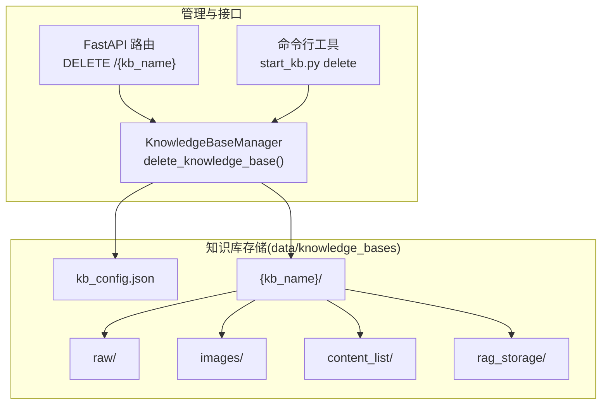
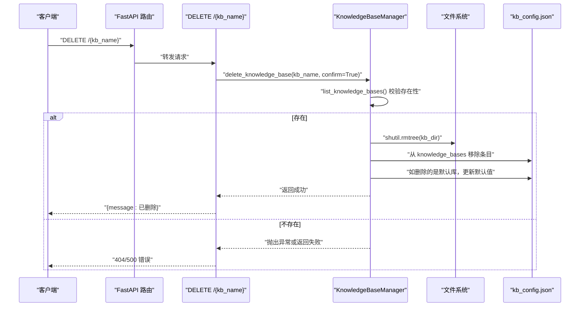
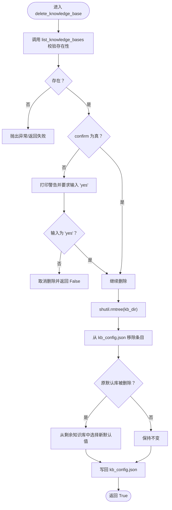
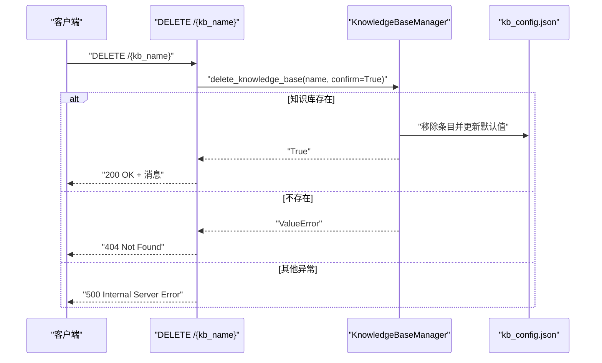
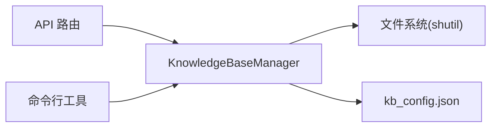

# 知识库删除

<cite>
**本文引用的文件**
- [src/knowledge/manager.py](file://src/knowledge/manager.py)
- [src/api/routers/knowledge.py](file://src/api/routers/knowledge.py)
- [src/knowledge/start_kb.py](file://src/knowledge/start_kb.py)
- [data/README.md](file://data/README.md)
- [src/knowledge/config.py](file://src/knowledge/config.py)
</cite>

## 目录
1. [简介](#简介)
2. [项目结构](#项目结构)
3. [核心组件](#核心组件)
4. [架构总览](#架构总览)
5. [详细组件分析](#详细组件分析)
6. [依赖关系分析](#依赖关系分析)
7. [性能考量](#性能考量)
8. [故障排查指南](#故障排查指南)
9. [结论](#结论)

## 简介
本文件聚焦“知识库删除”能力，系统化梳理并解释以下关键点：
- KnowledgeBaseManager 类中 delete_knowledge_base 方法的安全删除流程
- 如何通过 list_knowledge_bases 验证知识库存在性
- 在 CLI 环境下的交互式确认机制，防止误删
- 使用 shutil.rmtree 删除目录的实现细节
- 删除后的配置同步：从 kb_config.json 中移除对应条目，并在删除默认知识库时更新默认值
- 结合 API 路由 DELETE /{kb_name} 端点，解释 confirm=True 参数在自动化场景中的使用，以及 HTTP 异常处理机制

## 项目结构
知识库删除涉及的核心模块与数据路径如下：
- 知识库管理器：src/knowledge/manager.py
- API 路由：src/api/routers/knowledge.py
- 命令行入口：src/knowledge/start_kb.py
- 数据目录结构与配置：data/README.md、src/knowledge/config.py

图表来源
- [src/knowledge/manager.py](file://src/knowledge/manager.py#L262-L302)
- [src/api/routers/knowledge.py](file://src/api/routers/knowledge.py#L280-L294)
- [src/knowledge/start_kb.py](file://src/knowledge/start_kb.py#L246-L256)
- [data/README.md](file://data/README.md#L1-L73)

章节来源
- [data/README.md](file://data/README.md#L1-L73)
- [src/knowledge/config.py](file://src/knowledge/config.py#L1-L66)

## 核心组件
- KnowledgeBaseManager：提供知识库注册、查询、信息获取、删除等能力；删除流程集中在 delete_knowledge_base 方法
- FastAPI 路由：提供 REST 接口 DELETE /{kb_name}，内部调用管理器执行删除
- 命令行工具：提供 delete 子命令，支持 --force 跳过确认
- 数据目录：每个知识库为独立目录，根目录包含 kb_config.json 统一记录知识库清单与默认项

章节来源
- [src/knowledge/manager.py](file://src/knowledge/manager.py#L262-L302)
- [src/api/routers/knowledge.py](file://src/api/routers/knowledge.py#L280-L294)
- [src/knowledge/start_kb.py](file://src/knowledge/start_kb.py#L438-L442)

## 架构总览
下图展示“删除知识库”的端到端流程，包括 API 调用链、管理器方法与数据一致性保障。

图表来源
- [src/api/routers/knowledge.py](file://src/api/routers/knowledge.py#L280-L294)
- [src/knowledge/manager.py](file://src/knowledge/manager.py#L262-L302)

## 详细组件分析

### KnowledgeBaseManager.delete_knowledge_base 安全删除流程
- 输入参数
  - name：知识库名称
  - confirm：是否跳过交互确认（默认 False）
- 关键步骤
  1) 存在性校验：通过 list_knowledge_bases() 判断目标知识库是否存在于配置且目录存在
  2) 交互确认（仅 confirm=False 时）：在 CLI 环境打印警告与路径，要求用户输入“yes”确认
  3) 删除目录：使用 shutil.rmtree 递归删除知识库目录
  4) 同步配置：
     - 从 kb_config.json 的 knowledge_bases 字典中移除该条目
     - 若删除的是默认知识库，则从剩余知识库列表中选择新的默认值（若存在）
  5) 保存配置：写回 kb_config.json
  6) 返回结果：删除成功返回 True，否则返回 False 或抛出异常

图表来源
- [src/knowledge/manager.py](file://src/knowledge/manager.py#L262-L302)

章节来源
- [src/knowledge/manager.py](file://src/knowledge/manager.py#L262-L302)

### list_knowledge_bases 的存在性验证
- 优先从 kb_config.json 的 knowledge_bases 字典读取并校验目录是否存在
- 若目录缺失但配置存在，会打印警告但不加入返回列表
- 若无配置或为空，回退扫描 data/knowledge_bases 下的子目录，检查是否存在 metadata.json 作为知识库标识
- 返回排序后的知识库名称列表

章节来源
- [src/knowledge/manager.py](file://src/knowledge/manager.py#L35-L61)

### CLI 交互式确认机制
- 当 confirm=False 时，方法会在控制台输出删除风险提示与目标路径，并要求用户输入“yes”
- 输入非“yes”则取消删除并返回 False
- 该机制用于避免误删

章节来源
- [src/knowledge/manager.py](file://src/knowledge/manager.py#L280-L288)

### 使用 shutil.rmtree 删除目录
- 采用递归删除知识库目录，确保所有内容（raw、images、content_list、rag_storage 及其子文件）被彻底清除
- 删除前已通过 list_knowledge_bases 校验存在性，避免误删

章节来源
- [src/knowledge/manager.py](file://src/knowledge/manager.py#L289-L290)

### 删除后的配置同步
- 从 kb_config.json 的 knowledge_bases 中移除对应条目
- 若删除的是默认知识库，则从剩余知识库中选择新的默认值（若存在），否则默认值置空
- 最后将更新后的配置写回 kb_config.json

章节来源
- [src/knowledge/manager.py](file://src/knowledge/manager.py#L292-L301)

### API 路由 DELETE /{kb_name} 的行为
- 路由层直接调用 KnowledgeBaseManager.delete_knowledge_base(kb_name, confirm=True)
- 将 confirm 设为 True，表示在自动化/服务端场景下无需人工确认
- 对异常进行捕获并转换为 HTTP 异常：
  - 404：知识库不存在
  - 500：其他运行时错误
  - 成功时返回标准消息体

图表来源
- [src/api/routers/knowledge.py](file://src/api/routers/knowledge.py#L280-L294)
- [src/knowledge/manager.py](file://src/knowledge/manager.py#L262-L302)

章节来源
- [src/api/routers/knowledge.py](file://src/api/routers/knowledge.py#L280-L294)

### 命令行工具中的删除
- 提供 delete 子命令，支持 --force 跳过确认
- 内部同样调用 KnowledgeBaseManager.delete_knowledge_base 并传入 confirm 参数

章节来源
- [src/knowledge/start_kb.py](file://src/knowledge/start_kb.py#L438-L442)
- [src/knowledge/start_kb.py](file://src/knowledge/start_kb.py#L246-L256)

## 依赖关系分析
- 管理器依赖
  - 文件系统：shutil.rmtree 用于删除目录树
  - 配置文件：kb_config.json 记录知识库清单与默认值
- API 路由依赖
  - 管理器：统一删除逻辑
  - FastAPI：HTTP 异常与响应封装
- 命令行工具依赖
  - 管理器：统一删除逻辑
  - argparse：解析 --force 参数

图表来源
- [src/api/routers/knowledge.py](file://src/api/routers/knowledge.py#L280-L294)
- [src/knowledge/start_kb.py](file://src/knowledge/start_kb.py#L246-L256)
- [src/knowledge/manager.py](file://src/knowledge/manager.py#L262-L302)

章节来源
- [src/api/routers/knowledge.py](file://src/api/routers/knowledge.py#L280-L294)
- [src/knowledge/start_kb.py](file://src/knowledge/start_kb.py#L246-L256)
- [src/knowledge/manager.py](file://src/knowledge/manager.py#L262-L302)

## 性能考量
- 删除操作主要受磁盘 I/O 影响，删除大体量知识库时耗时较长
- 配置写回为小文件 I/O，开销可忽略
- 建议在批量删除或自动化场景中配合 confirm=True，减少交互等待
- 删除前建议提前备份重要数据（参见 data/README.md 的维护建议）

[本节为通用指导，不直接分析具体文件]

## 故障排查指南
- 404 未找到知识库
  - 现象：API 返回 404 或命令行报错
  - 原因：知识库不在 kb_config.json 或目录不存在
  - 处理：先通过 list 接口确认，必要时手动修复 kb_config.json
- 删除失败或权限不足
  - 现象：shutil.rmtree 抛出异常
  - 原因：进程无权限或文件被占用
  - 处理：检查文件锁与权限，重启服务后重试
- 默认知识库被删除导致后续访问异常
  - 现象：默认知识库为空
  - 处理：重新设置默认知识库或在删除后手动恢复
- 自动化场景误删风险
  - 建议：始终使用 confirm=True 时谨慎评估，保留日志与备份

章节来源
- [src/api/routers/knowledge.py](file://src/api/routers/knowledge.py#L280-L294)
- [src/knowledge/manager.py](file://src/knowledge/manager.py#L262-L302)
- [data/README.md](file://data/README.md#L120-L172)

## 结论
- delete_knowledge_base 通过“存在性校验 + 可选交互确认 + 递归删除 + 配置同步”的组合，确保删除过程安全可控
- API 层 confirm=True 适配自动化与服务端场景，命令行层 --force 提供一致体验
- 删除后对 kb_config.json 的同步保证了配置与实际目录的一致性，避免悬挂引用
- 建议在生产环境配合备份策略与严格的权限控制，降低误删风险