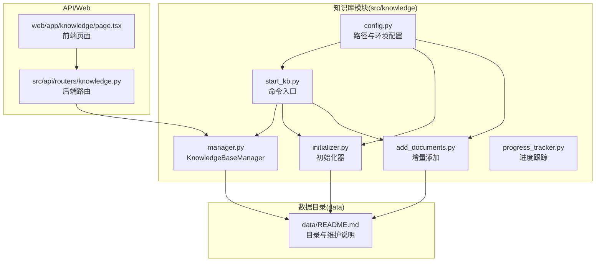
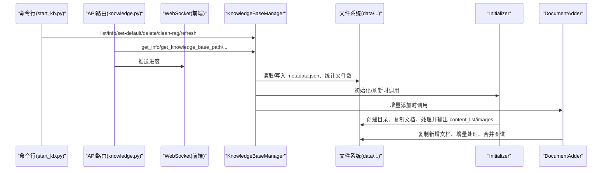
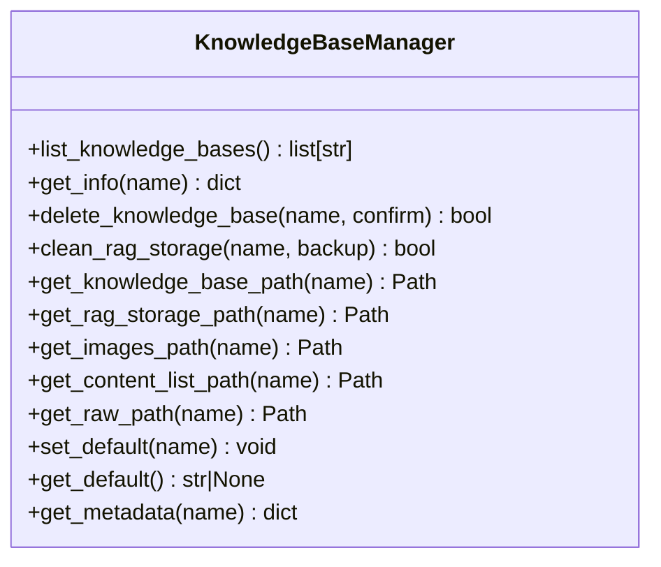
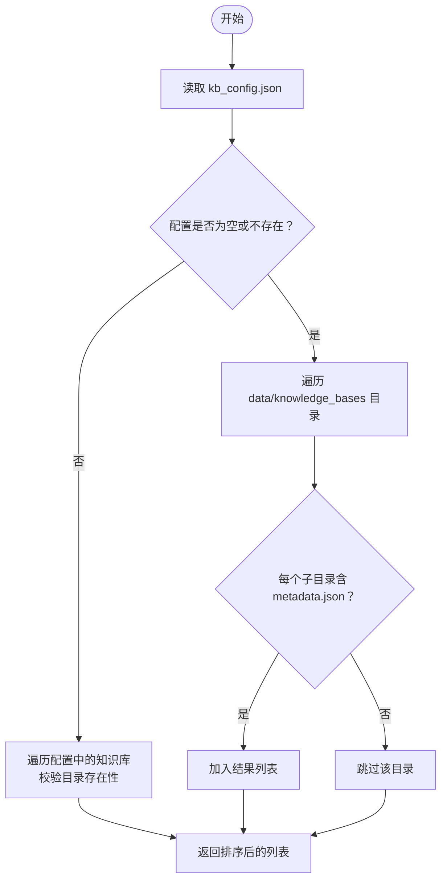
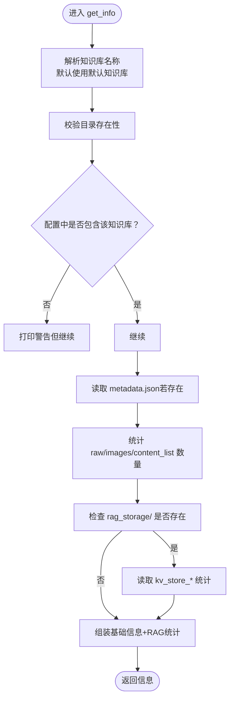
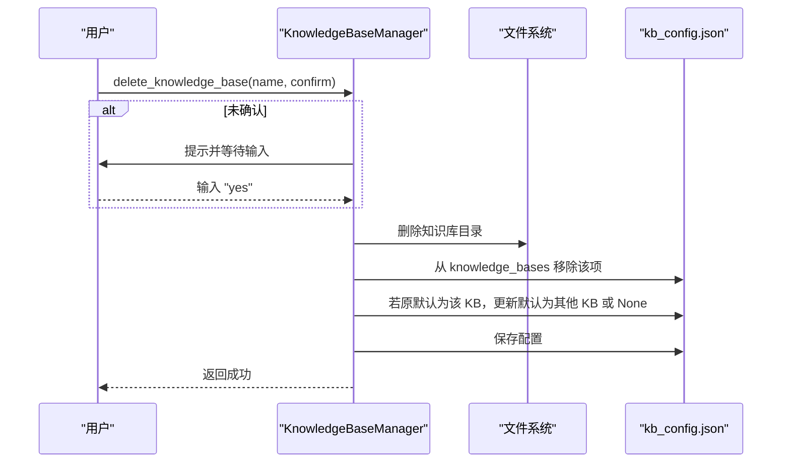
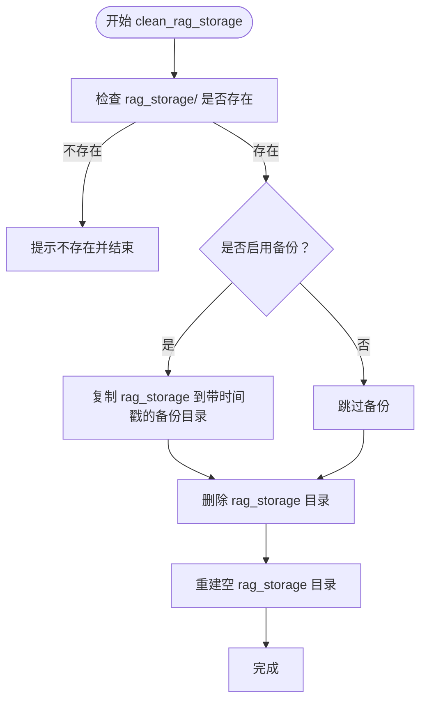
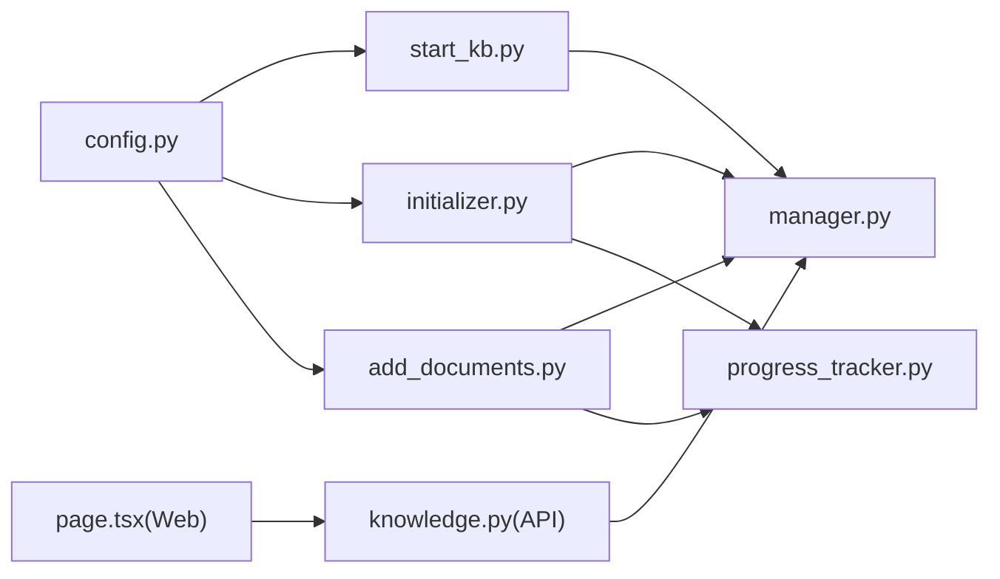

# 知识库操作

<cite>
**本文引用的文件**
- [src/knowledge/manager.py](file://src/knowledge/manager.py)
- [src/knowledge/start_kb.py](file://src/knowledge/start_kb.py)
- [src/knowledge/config.py](file://src/knowledge/config.py)
- [data/README.md](file://data/README.md)
- [src/knowledge/README.md](file://src/knowledge/README.md)
- [src/knowledge/initializer.py](file://src/knowledge/initializer.py)
- [src/knowledge/add_documents.py](file://src/knowledge/add_documents.py)
- [src/knowledge/progress_tracker.py](file://src/knowledge/progress_tracker.py)
- [src/api/routers/knowledge.py](file://src/api/routers/knowledge.py)
- [web/app/knowledge/page.tsx](file://web/app/knowledge/page.tsx)
</cite>

## 目录
1. [简介](#简介)
2. [项目结构](#项目结构)
3. [核心组件](#核心组件)
4. [架构总览](#架构总览)
5. [详细组件分析](#详细组件分析)
6. [依赖关系分析](#依赖关系分析)
7. [性能与可靠性考量](#性能与可靠性考量)
8. [故障排查指南](#故障排查指南)
9. [结论](#结论)
10. [附录：生命周期与最佳实践](#附录生命周期与最佳实践)

## 简介
本文件围绕知识库操作功能，系统化梳理 KnowledgeBaseManager 类提供的核心能力，包括：
- 列表查询的“配置文件优先、目录扫描后备”双重验证机制
- get_info 聚合元数据与统计信息的完整流程
- 删除操作的安全确认与配置同步
- clean_rag_storage 的备份策略与 RAG 存储重建路径
并结合 data/README.md 的备份恢复指南，给出知识库全生命周期管理方案，涵盖迁移、备份与版本控制的最佳实践。

## 项目结构
知识库相关模块主要位于 src/knowledge 下，配合 data/README.md 的目录规范与备份建议，形成统一的知识库数据与工具链。

图表来源
- [src/knowledge/manager.py](file://src/knowledge/manager.py#L1-L120)
- [src/knowledge/start_kb.py](file://src/knowledge/start_kb.py#L1-L120)
- [src/knowledge/config.py](file://src/knowledge/config.py#L1-L66)
- [data/README.md](file://data/README.md#L1-L172)
- [src/knowledge/initializer.py](file://src/knowledge/initializer.py#L1-L120)
- [src/knowledge/add_documents.py](file://src/knowledge/add_documents.py#L1-L120)
- [src/knowledge/progress_tracker.py](file://src/knowledge/progress_tracker.py#L1-L60)
- [src/api/routers/knowledge.py](file://src/api/routers/knowledge.py#L43-L90)
- [web/app/knowledge/page.tsx](file://web/app/knowledge/page.tsx#L474-L944)

章节来源
- [src/knowledge/README.md](file://src/knowledge/README.md#L1-L120)
- [data/README.md](file://data/README.md#L1-L172)

## 核心组件
- KnowledgeBaseManager：统一管理多个知识库，提供列表、信息查询、默认设置、路径解析、删除与 RAG 清理等能力。
- KnowledgeBaseInitializer：创建目录结构、复制文档、调用 RAG-Anything 处理、提取编号条目、注册到配置文件。
- DocumentAdder：在已有知识库中增量添加文档，仅处理新增文件，自动合并到现有图谱。
- start_kb.py：命令行入口，封装 list/info/set-default/init/extract/delete/clean-rag/refresh 等子命令。
- config.py：统一路径与环境变量读取，确保 raganything 模块可用性。
- progress_tracker.py：记录初始化进度，支持回调与持久化。
- API 路由与前端：提供进度查询、清理进度、WebSocket 实时推送等。

章节来源
- [src/knowledge/manager.py](file://src/knowledge/manager.py#L1-L120)
- [src/knowledge/initializer.py](file://src/knowledge/initializer.py#L1-L120)
- [src/knowledge/add_documents.py](file://src/knowledge/add_documents.py#L1-L120)
- [src/knowledge/start_kb.py](file://src/knowledge/start_kb.py#L350-L535)
- [src/knowledge/config.py](file://src/knowledge/config.py#L1-L66)
- [src/knowledge/progress_tracker.py](file://src/knowledge/progress_tracker.py#L1-L60)
- [src/api/routers/knowledge.py](file://src/api/routers/knowledge.py#L43-L90)
- [web/app/knowledge/page.tsx](file://web/app/knowledge/page.tsx#L474-L944)

## 架构总览
下图展示从命令行到后端 API，再到知识库管理器与数据目录的整体交互。

图表来源
- [src/knowledge/start_kb.py](file://src/knowledge/start_kb.py#L350-L535)
- [src/api/routers/knowledge.py](file://src/api/routers/knowledge.py#L43-L90)
- [src/knowledge/manager.py](file://src/knowledge/manager.py#L1-L200)
- [src/knowledge/initializer.py](file://src/knowledge/initializer.py#L120-L220)
- [src/knowledge/add_documents.py](file://src/knowledge/add_documents.py#L1-L120)

## 详细组件分析

### KnowledgeBaseManager 类与核心方法
- list_knowledge_bases：配置文件优先，若不存在则回退到目录扫描（仅当存在 metadata.json 才计入）。
- get_info：聚合元数据与统计信息，包含 raw 文档数、图片数、内容列表数、RAG 是否初始化，以及 RAG 统计（实体/关系/分块数量）。
- delete_knowledge_base：安全确认流程（CLI 输入 yes）、删除目录、从配置移除、更新默认知识库。
- clean_rag_storage：可选备份（时间戳命名）、删除并重建 rag_storage 目录，便于后续重新构建 RAG。

图表来源
- [src/knowledge/manager.py](file://src/knowledge/manager.py#L1-L200)

章节来源
- [src/knowledge/manager.py](file://src/knowledge/manager.py#L35-L120)
- [src/knowledge/manager.py](file://src/knowledge/manager.py#L138-L260)
- [src/knowledge/manager.py](file://src/knowledge/manager.py#L262-L340)

### 列表查询的双重验证机制
- 配置文件优先：从 kb_config.json 中读取知识库列表，校验对应目录是否存在，不存在则告警但不加入结果。
- 目录扫描后备：若无配置或为空，则遍历 data/knowledge_bases 下的子目录，要求存在 metadata.json 才视为有效知识库。

图表来源
- [src/knowledge/manager.py](file://src/knowledge/manager.py#L35-L61)

章节来源
- [src/knowledge/manager.py](file://src/knowledge/manager.py#L35-L61)

### get_info 方法：元数据与统计聚合
- 元数据：读取 metadata.json（若存在），否则为空字典。
- 统计：
  - raw 文档数：统计 raw/ 下文件数
  - 图片数：统计 images/ 下文件数
  - 内容列表数：统计 content_list/ 下 .json 文件数
  - RAG 初始化状态：判断 rag_storage/ 是否存在且为目录
  - RAG 统计：尝试读取 kv_store_full_entities.json、kv_store_full_relations.json、kv_store_text_chunks.json 并统计条目数
- 默认知识库标记：根据当前默认值判断

图表来源
- [src/knowledge/manager.py](file://src/knowledge/manager.py#L138-L260)

章节来源
- [src/knowledge/manager.py](file://src/knowledge/manager.py#L138-L260)

### 删除操作：安全确认与配置同步
- 安全确认：若未显式传入 confirm，则通过 CLI 提示输入“yes”才执行删除。
- 删除流程：先删除目录，再从 kb_config.json 中移除该项；若被删除的是默认知识库，则从剩余知识库中选择新的默认值。
- 配置同步：删除后立即保存 kb_config.json。

图表来源
- [src/knowledge/manager.py](file://src/knowledge/manager.py#L262-L303)

章节来源
- [src/knowledge/manager.py](file://src/knowledge/manager.py#L262-L303)

### clean_rag_storage：备份策略与重建流程
- 备份策略：可选备份（backup=True）。若启用，以当前时间戳命名备份目录，复制 rag_storage 至备份目录。
- 清理与重建：删除 rag_storage 目录并重建空目录，供后续重新构建 RAG 使用。
- 重建路径：通常配合 refresh 或 add_documents 流程再次处理文档并生成新的 RAG 数据。

图表来源
- [src/knowledge/manager.py](file://src/knowledge/manager.py#L304-L340)

章节来源
- [src/knowledge/manager.py](file://src/knowledge/manager.py#L304-L340)

### 命令行入口与生命周期命令
- start_kb.py 提供 list、info、set-default、init、extract、delete、clean-rag、refresh 等命令，并在内部调用 KnowledgeBaseManager 与 KnowledgeBaseInitializer/DocumentAdder。
- 生命周期关键命令：
  - init：创建目录结构、复制文档、处理并提取编号条目，自动注册到 kb_config.json。
  - refresh：清理 RAG 存储后，重新处理所有文档并可选清理 content_list/images。
  - add_documents：仅处理新增文档，自动合并到现有图谱，更新 metadata 与历史。

章节来源
- [src/knowledge/start_kb.py](file://src/knowledge/start_kb.py#L1-L120)
- [src/knowledge/start_kb.py](file://src/knowledge/start_kb.py#L120-L275)
- [src/knowledge/start_kb.py](file://src/knowledge/start_kb.py#L275-L350)
- [src/knowledge/initializer.py](file://src/knowledge/initializer.py#L120-L220)
- [src/knowledge/add_documents.py](file://src/knowledge/add_documents.py#L1-L120)

## 依赖关系分析
- 路径与环境：config.py 统一管理 KNOWLEDGE_BASES_DIR、RAGANYTHING_PATH，并提供 get_env_config/setup_paths。
- 后端集成：API 路由通过懒加载 KnowledgeBaseManager 访问知识库信息；前端通过 WebSocket 获取实时进度。
- 进度跟踪：initializer 与 add_documents 使用 ProgressTracker 将阶段与进度持久化至 .progress.json，并支持回调与广播。

图表来源
- [src/knowledge/config.py](file://src/knowledge/config.py#L1-L66)
- [src/knowledge/start_kb.py](file://src/knowledge/start_kb.py#L1-L120)
- [src/knowledge/initializer.py](file://src/knowledge/initializer.py#L1-L120)
- [src/knowledge/add_documents.py](file://src/knowledge/add_documents.py#L1-L120)
- [src/knowledge/manager.py](file://src/knowledge/manager.py#L1-L120)
- [src/api/routers/knowledge.py](file://src/api/routers/knowledge.py#L43-L90)
- [web/app/knowledge/page.tsx](file://web/app/knowledge/page.tsx#L474-L944)

章节来源
- [src/knowledge/config.py](file://src/knowledge/config.py#L1-L66)
- [src/knowledge/progress_tracker.py](file://src/knowledge/progress_tracker.py#L1-L60)
- [src/api/routers/knowledge.py](file://src/api/routers/knowledge.py#L43-L90)
- [web/app/knowledge/page.tsx](file://web/app/knowledge/page.tsx#L474-L944)

## 性能与可靠性考量
- 列表查询的双重验证避免误判：配置文件优先保证权威性，目录扫描后备提升兼容性。
- get_info 的统计采用惰性读取与异常保护，避免单点失败影响整体返回。
- 删除操作强制确认与配置同步，降低误删风险。
- clean_rag_storage 支持备份，保障数据可恢复；重建流程与增量添加配合，减少重复处理成本。
- 前端对“已就绪”的知识库过滤掉过期进度更新，避免误导。

章节来源
- [src/knowledge/manager.py](file://src/knowledge/manager.py#L35-L120)
- [src/knowledge/manager.py](file://src/knowledge/manager.py#L138-L260)
- [src/knowledge/manager.py](file://src/knowledge/manager.py#L262-L340)
- [web/app/knowledge/page.tsx](file://web/app/knowledge/page.tsx#L282-L320)

## 故障排查指南
- RAG 初始化失败/GraphML 解析错误：使用 clean-rag 清理 RAG 存储，随后 refresh 或 add_documents 重新构建。
- 删除知识库前务必备份：确认重要数据（如 numbered_items.json、rag_storage/）已备份。
- API Key 缺失：确保 LLM_BINDING_API_KEY 和 LLM_BINDING_HOST 已正确配置。
- 路径问题：使用 setup_paths() 统一设置模块搜索路径，避免找不到 raganything。
- 进度卡住：前端可清理本地进度，后端可通过 API 清理 .progress.json；必要时重启任务。

章节来源
- [src/knowledge/README.md](file://src/knowledge/README.md#L407-L431)
- [src/knowledge/start_kb.py](file://src/knowledge/start_kb.py#L438-L535)
- [src/knowledge/config.py](file://src/knowledge/config.py#L25-L66)
- [src/api/routers/knowledge.py](file://src/api/routers/knowledge.py#L439-L468)
- [web/app/knowledge/page.tsx](file://web/app/knowledge/page.tsx#L393-L423)

## 结论
KnowledgeBaseManager 为知识库提供了稳定、可审计的操作接口，配合 start_kb.py 的命令行工具与 API/Web 的进度可视化，形成了从创建、增量更新、清理到重建的完整闭环。通过配置文件优先的列表验证、完善的元数据与统计聚合、安全的删除流程与可选备份的 RAG 清理，能够满足生产环境对可靠性与可维护性的要求。

## 附录：生命周期与最佳实践
- 生命周期阶段
  - 创建：init 命令创建目录结构、复制文档、处理并提取编号条目，自动注册到 kb_config.json。
  - 增量更新：add_documents 仅处理新增文档，自动合并到现有图谱，更新 metadata 与历史。
  - 刷新重建：refresh 清理 RAG 存储后重新处理全部文档；clean-rag 用于修复损坏的 RAG 数据。
  - 删除：delete 前务必备份，确认删除后同步清理配置与默认知识库。
- 备份与恢复
  - 参考 data/README.md 的备份与恢复命令，定期打包 knowledge_bases/ 或特定 KB。
- 版本控制
  - 建议将 data/ 加入 .gitignore，避免提交大文件；对 metadata 与 numbered_items.json 的变更纳入版本控制。
- 迁移
  - 在新环境中部署后，使用恢复命令还原知识库；或通过备份归档迁移至新主机。

章节来源
- [src/knowledge/README.md](file://src/knowledge/README.md#L123-L184)
- [data/README.md](file://data/README.md#L156-L172)
- [src/knowledge/initializer.py](file://src/knowledge/initializer.py#L120-L220)
- [src/knowledge/add_documents.py](file://src/knowledge/add_documents.py#L1-L120)
- [src/knowledge/start_kb.py](file://src/knowledge/start_kb.py#L275-L350)