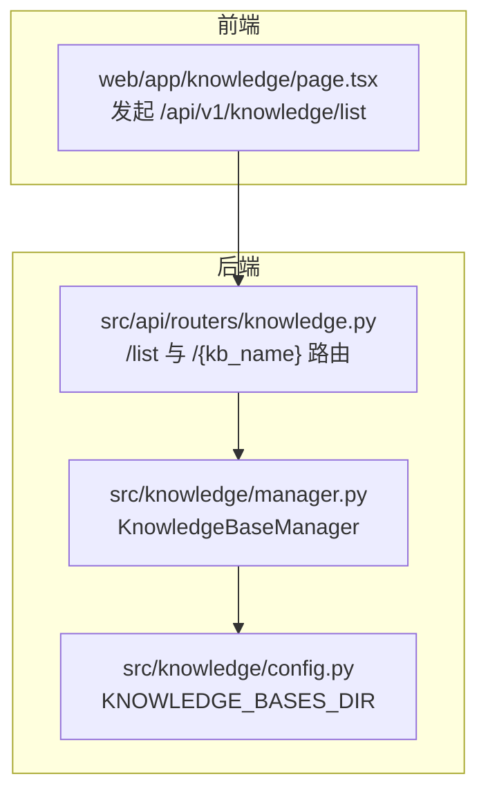
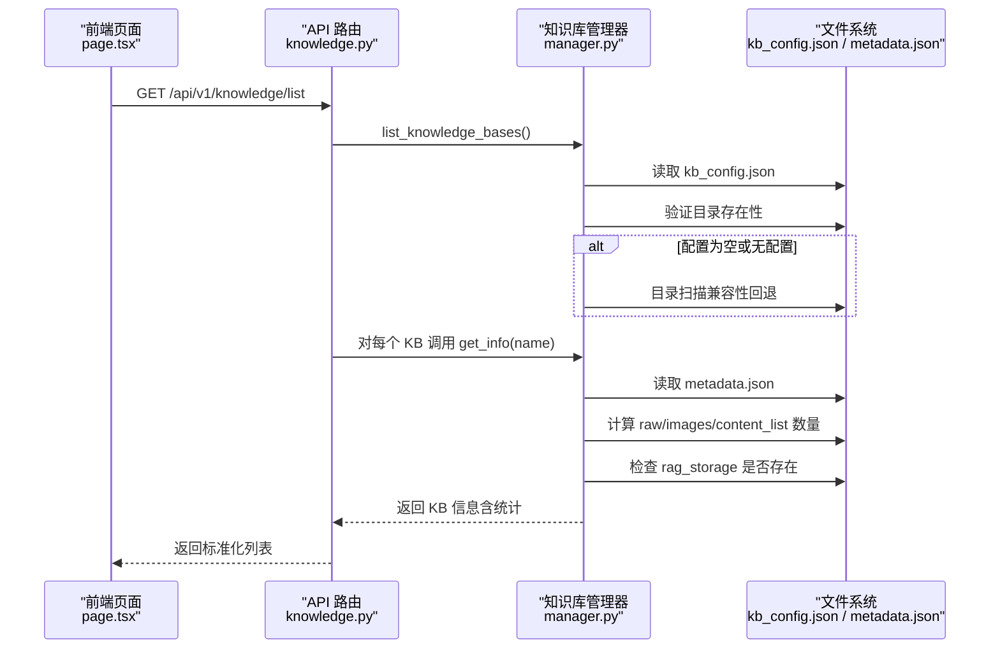
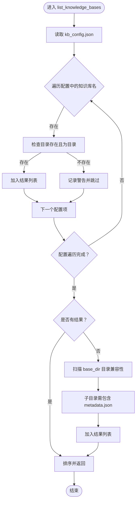
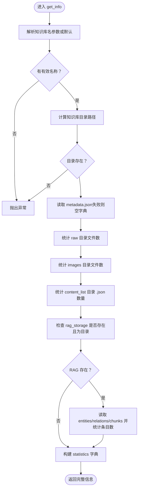
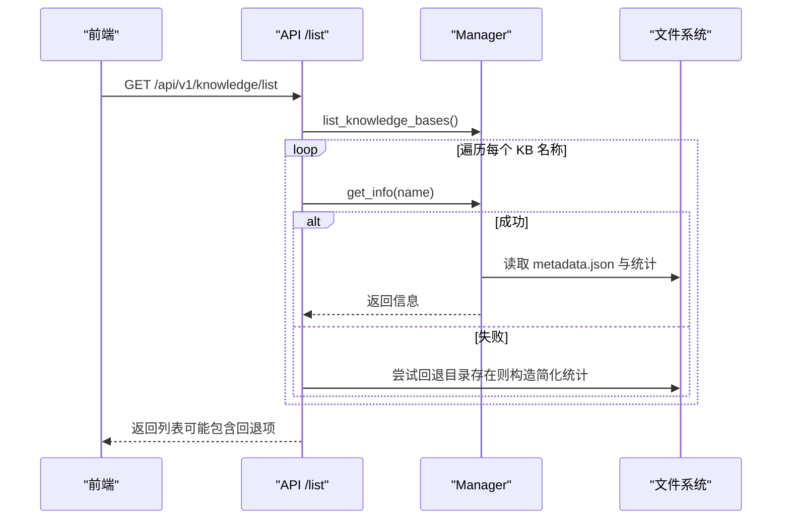
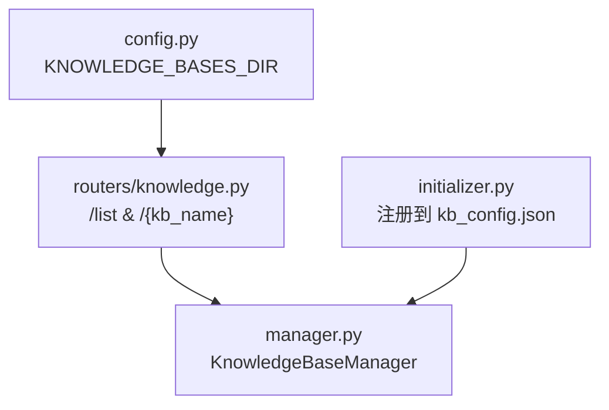

# 知识库查询

<cite>
**本文引用的文件**
- [src/knowledge/manager.py](file://src/knowledge/manager.py)
- [src/api/routers/knowledge.py](file://src/api/routers/knowledge.py)
- [web/app/knowledge/page.tsx](file://web/app/knowledge/page.tsx)
- [src/knowledge/config.py](file://src/knowledge/config.py)
- [src/knowledge/README.md](file://src/knowledge/README.md)
</cite>

## 目录
1. [简介](#简介)
2. [项目结构](#项目结构)
3. [核心组件](#核心组件)
4. [架构总览](#架构总览)
5. [详细组件分析](#详细组件分析)
6. [依赖分析](#依赖分析)
7. [性能考虑](#性能考虑)
8. [故障排查指南](#故障排查指南)
9. [结论](#结论)

## 简介
本文件围绕知识库查询功能进行系统化文档化，重点阐述以下内容：
- KnowledgeBaseManager 类中 list_knowledge_bases 的双重验证流程与兼容性回退机制
- get_info 方法如何聚合元数据与统计信息（原始文档、图片、内容列表计数；RAG 存储初始化状态及内部实体、关系、文本块统计）
- 前端通过 /api/v1/knowledge/list 与 /api/v1/knowledge/{kb_name} 获取知识库列表与详情，并说明错误处理与降级策略

## 项目结构
知识库查询涉及后端 API 路由、知识库管理器、前端页面三部分协同工作：
- 后端 API 路由：提供 /list 与 /{kb_name} 两个端点，负责调用管理器并返回标准化结果
- 知识库管理器：负责读取 kb_config.json、校验目录存在性、聚合元数据与统计信息
- 前端页面：发起 /list 请求，展示知识库列表与状态；对健康检查失败、响应格式异常等进行降级处理

图表来源
- [src/api/routers/knowledge.py](file://src/api/routers/knowledge.py#L194-L277)
- [src/knowledge/manager.py](file://src/knowledge/manager.py#L1-L166)
- [src/knowledge/config.py](file://src/knowledge/config.py#L1-L66)

章节来源
- [src/api/routers/knowledge.py](file://src/api/routers/knowledge.py#L194-L277)
- [src/knowledge/manager.py](file://src/knowledge/manager.py#L1-L166)
- [src/knowledge/config.py](file://src/knowledge/config.py#L1-L66)

## 核心组件
- KnowledgeBaseManager：统一管理知识库配置与信息聚合
  - 列表与默认值：list_knowledge_bases、get_default、set_default
  - 路径与元数据：get_knowledge_base_path、get_metadata
  - 信息聚合：get_info（含统计与 RAG 统计）
- API 路由：
  - /list：遍历知识库，逐个调用 get_info 并返回标准化列表
  - /{kb_name}：返回单个知识库的详细信息
  - /health：用于前端健康检查
- 前端页面：
  - 发起 /list 请求，解析响应并渲染；对网络错误、响应格式异常进行降级提示

章节来源
- [src/knowledge/manager.py](file://src/knowledge/manager.py#L1-L260)
- [src/api/routers/knowledge.py](file://src/api/routers/knowledge.py#L194-L277)
- [web/app/knowledge/page.tsx](file://web/app/knowledge/page.tsx#L119-L203)

## 架构总览
下图展示了从前端到后端再到知识库管理器的数据流与控制流。

图表来源
- [src/api/routers/knowledge.py](file://src/api/routers/knowledge.py#L194-L277)
- [src/knowledge/manager.py](file://src/knowledge/manager.py#L35-L166)

## 详细组件分析

### KnowledgeBaseManager.list_knowledge_bases 实现机制
- 权威来源优先：从 kb_config.json 中读取知识库列表
- 双重验证：
  - 遍历配置项，逐一检查对应目录是否存在且为目录
  - 若目录不存在，记录警告但不加入结果
- 兼容性回退：当配置为空或不存在时，扫描 base_dir 下所有子目录，要求子目录包含 metadata.json 才视为有效知识库
- 返回排序后的名称列表

图表来源
- [src/knowledge/manager.py](file://src/knowledge/manager.py#L35-L61)

章节来源
- [src/knowledge/manager.py](file://src/knowledge/manager.py#L35-L61)

### KnowledgeBaseManager.get_info 聚合机制
- 输入与定位：支持传入名称或使用默认知识库；若两者都不可得则抛出异常
- 目录校验：确保目标目录存在
- 元数据读取：尝试读取 metadata.json，失败时保留空字典
- 统计聚合：
  - 原始文档：统计 raw 目录下的文件数量
  - 图片：统计 images 目录下的文件数量
  - 内容列表：统计 content_list 目录下的 .json 文件数量
  - RAG 初始化状态：判断 rag_storage 目录是否存在且为目录
- RAG 细粒度统计（可选）：若 rag_storage 存在，则尝试读取 kv_store_full_entities.json、kv_store_full_relations.json、kv_store_text_chunks.json，并统计其条目数量（以列表或字典长度为准），将结果放入 statistics.rag 字段
- 输出结构：包含 name、path、is_default、metadata、statistics

图表来源
- [src/knowledge/manager.py](file://src/knowledge/manager.py#L138-L260)
- [src/knowledge/README.md](file://src/knowledge/README.md#L209-L234)

章节来源
- [src/knowledge/manager.py](file://src/knowledge/manager.py#L138-L260)
- [src/knowledge/README.md](file://src/knowledge/README.md#L209-L234)

### API 路由 /list 与 /{kb_name} 的行为
- /list：
  - 调用管理器列出知识库
  - 对每个名称调用 get_info，收集结果
  - 若部分 KB 获取信息失败，记录错误并尝试回退：只要目录存在，就构造一个包含基础统计字段（原始文档、图片、内容列表计数为 0，RAG 初始化状态为 False）的简化信息
  - 当全部失败且无回退结果时，抛出 500 错误
  - 当存在部分错误但仍有回退结果时，仍返回可用结果并记录警告
- /{kb_name}：
  - 直接调用 get_info 返回详细信息
  - 若知识库不存在，抛出 404；其他异常抛出 500

图表来源
- [src/api/routers/knowledge.py](file://src/api/routers/knowledge.py#L194-L277)
- [src/knowledge/manager.py](file://src/knowledge/manager.py#L138-L260)

章节来源
- [src/api/routers/knowledge.py](file://src/api/routers/knowledge.py#L194-L277)

### 前端如何获取知识库列表与详细信息
- 列表获取：
  - 前端先访问 /api/v1/knowledge/health 进行健康检查
  - 再请求 /api/v1/knowledge/list 获取知识库数组
  - 对非 2xx 响应进行解析与降级：优先尝试解析 JSON 的 detail/message 字段，否则读取文本并截断显示；同时区分网络错误与服务端错误
  - 对响应类型进行校验（必须为数组），否则抛错
- 详情获取：
  - 访问 /api/v1/knowledge/{kb_name} 获取单个 KB 的详细信息
  - 对 404 与 500 进行相应提示
- 错误处理与降级策略：
  - 健康检查失败：记录警告并继续尝试 /list
  - 网络错误：提供明确的“后端未运行”提示
  - 响应格式异常：解析文本并截断，避免崩溃
  - 空列表：视为正常空状态，不作为错误处理

章节来源
- [web/app/knowledge/page.tsx](file://web/app/knowledge/page.tsx#L119-L203)
- [src/api/routers/knowledge.py](file://src/api/routers/knowledge.py#L173-L192)

## 依赖分析
- 知识库基目录来源：通过配置模块统一提供 KNOWLEDGE_BASES_DIR，API 路由与管理器均基于该路径组织知识库目录
- API 路由依赖：
  - KnowledgeBaseManager：用于列表与详情查询
  - KnowledgeBaseInitializer：创建/注册知识库时写入 kb_config.json
- 前端依赖：
  - 通过 apiUrl/wsUrl 组装请求地址，分别访问 /list 与 /{kb_name}/progress/ws

图表来源
- [src/knowledge/config.py](file://src/knowledge/config.py#L1-L66)
- [src/api/routers/knowledge.py](file://src/api/routers/knowledge.py#L194-L277)
- [src/knowledge/manager.py](file://src/knowledge/manager.py#L1-L166)
- [src/knowledge/initializer.py](file://src/knowledge/initializer.py#L73-L138)

章节来源
- [src/knowledge/config.py](file://src/knowledge/config.py#L1-L66)
- [src/api/routers/knowledge.py](file://src/api/routers/knowledge.py#L194-L277)
- [src/knowledge/manager.py](file://src/knowledge/manager.py#L1-L166)
- [src/knowledge/initializer.py](file://src/knowledge/initializer.py#L73-L138)

## 性能考虑
- 列表阶段的 IO 开销：
  - list_knowledge_bases 在配置为空时会进行目录扫描，建议尽量保持 kb_config.json 完整，减少不必要的目录遍历
- 统计阶段的 IO 开销：
  - get_info 对 raw/images/content_list 目录进行文件计数，对 rag_storage 的 kv 文件进行读取与统计，建议在大量文件场景下避免频繁刷新列表
- 前端渲染优化：
  - 使用本地缓存（localStorage）保存进度状态，减少重复请求
  - 对已就绪的 KB 忽略过期进度更新，降低前端渲染压力

## 故障排查指南
- 健康检查失败：
  - 检查后端是否启动，确认 /api/v1/knowledge/health 返回的 base_dir 与 config_file 路径正确
- /list 返回空列表：
  - 确认 kb_config.json 是否存在且包含知识库条目；若为空，检查 base_dir 下是否存在包含 metadata.json 的知识库目录
- 单个 KB 详情 404：
  - 确认知识库名称正确，且目录存在
- 部分 KB 获取信息失败：
  - 后端会记录错误并尝试回退；若全部失败，将返回 500。前端会提示“无法加载知识库”，建议检查后端日志
- 前端网络错误：
  - 提示“后端未运行”，请确认后端服务与端口可用

章节来源
- [src/api/routers/knowledge.py](file://src/api/routers/knowledge.py#L173-L192)
- [web/app/knowledge/page.tsx](file://web/app/knowledge/page.tsx#L119-L203)

## 结论
- list_knowledge_bases 采用“配置权威 + 目录验证”的双保险策略，并在配置缺失时提供目录扫描的兼容性回退
- get_info 将元数据与多维度统计整合为统一信息结构，便于前端展示与后续扩展
- API 路由对错误与异常进行了稳健处理，前端具备完善的降级与提示机制
- 建议在生产环境中维护完整的 kb_config.json，以获得最佳性能与可靠性