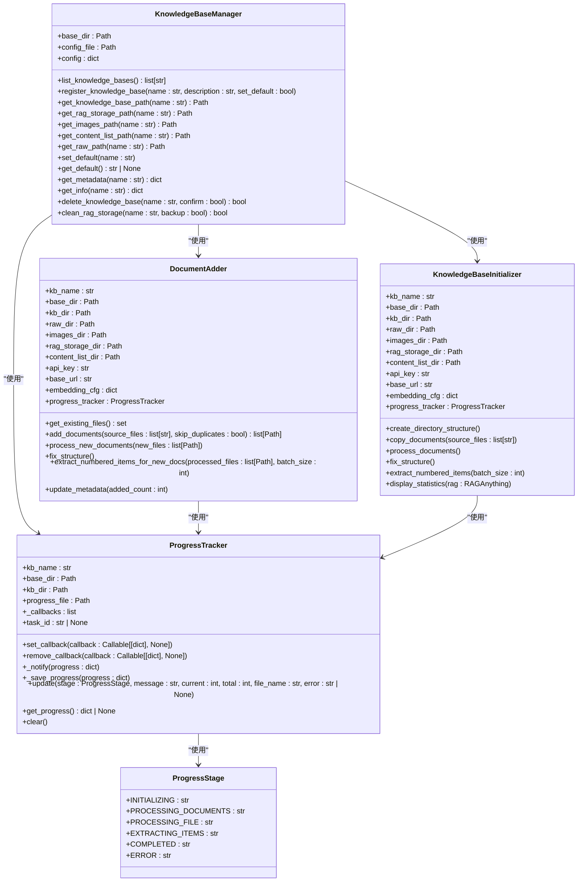
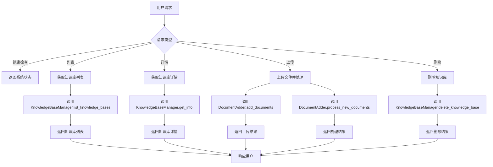
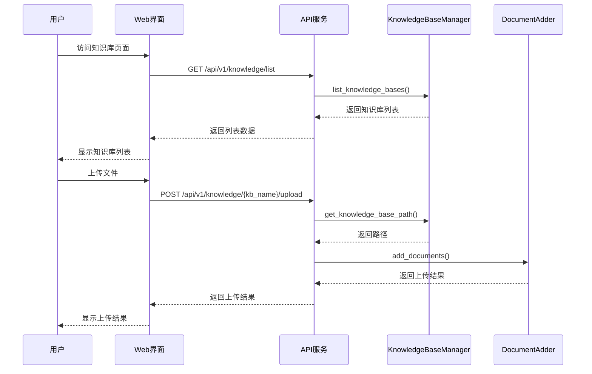

# 知识库管理

<cite>
**本文档引用的文件**   
- [__init__.py](file://src/knowledge/__init__.py)
- [add_documents.py](file://src/knowledge/add_documents.py)
- [config.py](file://src/knowledge/config.py)
- [extract_numbered_items.py](file://src/knowledge/extract_numbered_items.py)
- [initializer.py](file://src/knowledge/initializer.py)
- [kb.py](file://src/knowledge/kb.py)
- [manager.py](file://src/knowledge/manager.py)
- [progress_tracker.py](file://src/knowledge/progress_tracker.py)
- [start_kb.py](file://src/knowledge/start_kb.py)
- [knowledge.py](file://src/api/routers/knowledge.py)
- [page.tsx](file://web/app/knowledge/page.tsx)
- [README.md](file://src/knowledge/README.md)
</cite>

## 目录
1. [引言](#引言)
2. [知识库实体关系与数据结构](#知识库实体关系与数据结构)
3. [数据库模式与示例数据](#数据库模式与示例数据)
4. [数据访问模式与缓存策略](#数据访问模式与缓存策略)
5. [性能考虑与优化](#性能考虑与优化)
6. [数据生命周期与保留策略](#数据生命周期与保留策略)
7. [数据迁移路径与版本管理](#数据迁移路径与版本管理)
8. [数据安全与访问控制](#数据安全与访问控制)
9. [Web接口与API](#web接口与api)
10. [总结](#总结)

## 引言

本文档全面阐述了DeepTutor项目中的知识库管理系统。该系统提供了一套完整的知识库创建、管理、查询和维护功能，支持从文档初始化到增量更新的全生命周期管理。系统通过模块化设计，实现了知识库的高效管理，包括文档处理、知识图谱构建、重要项目提取和Web接口访问等功能。本文档详细说明了系统的实体关系、数据结构、访问模式、性能优化、安全控制等关键方面，旨在为开发者和用户提供全面的技术参考。

## 知识库实体关系与数据结构

知识库管理系统的核心是`KnowledgeBaseManager`类，它负责管理多个知识库实例。每个知识库由多个组件构成，包括原始文档、提取的图像、内容列表和RAG存储。这些组件通过清晰的目录结构和配置文件进行组织和管理。



**图源**
- [manager.py](file://src/knowledge/manager.py#L12-L458)
- [add_documents.py](file://src/knowledge/add_documents.py#L44-L88)
- [initializer.py](file://src/knowledge/initializer.py#L47-L684)
- [progress_tracker.py](file://src/knowledge/progress_tracker.py#L38-L192)

### 核心实体关系

知识库管理系统的核心实体关系如下：

1. **KnowledgeBaseManager**：知识库管理器，负责管理所有知识库的注册、查询和删除。它维护一个配置文件`kb_config.json`，记录所有知识库的名称、路径和默认知识库。
2. **DocumentAdder**：文档添加器，用于向现有知识库增量添加新文档。它只处理新文档，避免重新处理整个知识库，从而节省时间和成本。
3. **KnowledgeBaseInitializer**：知识库初始化器，用于创建新的知识库并初始化其目录结构。它负责处理文档、构建知识图谱和提取重要项目。
4. **ProgressTracker**：进度跟踪器，用于跟踪知识库初始化和文档添加的进度。它支持通过WebSocket实时更新进度，并将进度信息保存到文件中。

这些组件通过清晰的接口和依赖关系协同工作，确保知识库管理的高效性和可靠性。

## 数据库模式与示例数据

知识库的数据库模式基于文件系统目录结构，每个知识库都有一个独立的目录，包含多个子目录和文件。这种设计使得知识库易于管理和备份。

### 知识库目录结构

```
knowledge_bases/
├── kb_config.json              # 知识库配置文件
└── my_textbook/                # 知识库目录
    ├── metadata.json           # 元数据文件
    ├── numbered_items.json     # 编号项目文件
    ├── raw/                    # 原始文档
    │   ├── textbook.pdf        # 初始文档
    │   └── new_chapter.pdf     # 增量添加的文档
    ├── images/                 # 提取的图像
    │   ├── figure_1_1.jpg
    │   └── new_figure.jpg      # 新文档中的图像
    ├── content_list/           # 文档内容列表
    │   ├── textbook.json
    │   └── new_chapter.json    # 新文档的内容列表
    └── rag_storage/            # RAG知识图谱（增量更新）
        ├── kv_store_full_entities.json
        ├── kv_store_full_relations.json
        └── kv_store_text_chunks.json
```

### 元数据文件结构

`metadata.json`文件存储知识库的元数据，包括创建时间、最后更新时间、描述、版本和更新历史。

```json
{
  "name": "my_textbook",
  "created_at": "2025-01-15 10:30:00",
  "last_updated": "2025-01-20 14:25:00",
  "description": "知识库: my_textbook",
  "version": "1.0",
  "update_history": [
    {
      "timestamp": "2025-01-15 10:30:00",
      "action": "create",
      "files_added": 1
    },
    {
      "timestamp": "2025-01-20 14:25:00",
      "action": "add_documents",
      "files_added": 2
    }
  ]
}
```

### 编号项目文件结构

`numbered_items.json`文件存储从文档中提取的编号项目，如定义、命题、定理、公式、图表等。

```json
{
  "Definition 1.5": {
    "text": "定义1.5: ...",
    "type": "Definition",
    "page": 15,
    "img_paths": []
  },
  "Figure 1.1": {
    "text": "图1.1: ...",
    "type": "Figure",
    "page": 20,
    "img_paths": ["images/figure_1_1.jpg"]
  },
  "(1.2.1)": {
    "text": "$$S = 1,2,3,4,5,6,\\\\ldots ,n,n + 1,\\\\ldots \\\\tag{{1.2.1}}$$",
    "type": "Equation",
    "page": 25,
    "img_paths": []
  }
}
```

## 数据访问模式与缓存策略

知识库管理系统提供了多种数据访问模式，包括命令行接口、API接口和Web界面。这些接口通过统一的管理器类访问知识库数据，确保数据的一致性和安全性。

### 数据访问模式

1. **命令行接口**：通过`start_kb.py`脚本提供，支持列出、查看、创建、删除和刷新知识库。
2. **API接口**：通过FastAPI提供，支持HTTP请求访问知识库数据，包括健康检查、列表、详情、上传和删除等操作。
3. **Web界面**：通过Next.js提供，用户可以通过浏览器访问知识库管理功能，包括创建、上传和查看知识库。

### 缓存策略

系统通过以下方式实现缓存和性能优化：

1. **进度跟踪**：`ProgressTracker`类将进度信息保存到`.progress.json`文件中，避免重复计算和处理。
2. **RAG存储**：RAG知识图谱存储在`rag_storage`目录中，支持快速检索和查询。
3. **内容列表**：文档内容列表存储在`content_list`目录中，支持快速访问和处理。

## 性能考虑与优化

知识库管理系统在设计时充分考虑了性能优化，通过多种技术手段确保系统的高效运行。

### 性能优化措施

1. **增量更新**：`DocumentAdder`类支持增量添加文档，只处理新文档，避免重新处理整个知识库，从而节省时间和成本。
2. **异步处理**：系统使用异步处理技术，支持并发处理多个文档和任务，提高处理速度。
3. **批量处理**：`extract_numbered_items`函数支持批量处理，减少API调用次数，提高处理效率。
4. **路径优化**：`config.py`文件统一管理所有路径，避免路径冲突和错误。

### 性能监控

系统通过`ProgressTracker`类提供实时进度监控，用户可以通过WebSocket或API接口查看处理进度。此外，系统还提供了健康检查接口，用于监控系统的运行状态。



**图源**
- [knowledge.py](file://src/api/routers/knowledge.py#L1-L535)
- [manager.py](file://src/knowledge/manager.py#L35-L61)
- [add_documents.py](file://src/knowledge/add_documents.py#L89-L130)

## 数据生命周期与保留策略

知识库管理系统提供了完整的数据生命周期管理，包括创建、更新、删除和归档。

### 数据生命周期

1. **创建**：通过`KnowledgeBaseInitializer`类创建新的知识库，初始化目录结构和元数据。
2. **更新**：通过`DocumentAdder`类增量添加新文档，更新知识库内容和元数据。
3. **删除**：通过`KnowledgeBaseManager.delete_knowledge_base`方法删除知识库，永久删除所有相关文件。
4. **归档**：系统未提供自动归档功能，但建议用户定期备份`knowledge_bases`目录。

### 保留策略

1. **默认保留**：所有知识库默认永久保留，直到用户手动删除。
2. **备份建议**：建议用户定期备份`knowledge_bases`目录，特别是`numbered_items.json`和`rag_storage`目录。
3. **版本控制**：建议将`knowledge_bases`目录添加到`.gitignore`文件中，避免版本控制冲突。

## 数据迁移路径与版本管理

知识库管理系统支持数据迁移和版本管理，确保系统的可维护性和可扩展性。

### 数据迁移路径

1. **从旧版本迁移**：如果从旧版本升级，建议备份现有知识库，然后重新初始化。
2. **跨平台迁移**：知识库目录可以轻松迁移到其他平台，只需确保路径配置正确。

### 版本管理

1. **配置文件版本**：`metadata.json`文件中的`version`字段记录知识库的版本。
2. **系统版本**：通过`config/main.yaml`文件管理系统的版本和配置。

## 数据安全与访问控制

知识库管理系统通过多种机制确保数据的安全性和访问控制。

### 数据安全

1. **环境变量**：API密钥和主机地址通过`.env`文件配置，避免硬编码。
2. **路径安全**：`config.py`文件统一管理所有路径，避免路径遍历攻击。
3. **文件权限**：建议设置适当的文件权限，限制对知识库目录的访问。

### 访问控制

1. **API认证**：API接口通过API密钥进行认证，确保只有授权用户可以访问。
2. **Web界面认证**：Web界面建议集成用户认证系统，限制对知识库管理功能的访问。

## Web接口与API

知识库管理系统提供了丰富的Web接口和API，支持多种操作和功能。

### API端点

| 端点 | 方法 | 描述 |
|:---:|:---|:---|
| `/health` | GET | 健康检查，返回系统状态 |
| `/list` | GET | 列出所有知识库 |
| `/{kb_name}` | GET | 获取指定知识库的详细信息 |
| `/{kb_name}` | DELETE | 删除指定知识库 |
| `/{kb_name}/upload` | POST | 上传文件到指定知识库 |
| `/create` | POST | 创建新的知识库 |
| `/{kb_name}/progress` | GET | 获取知识库的进度信息 |
| `/{kb_name}/progress/clear` | POST | 清除知识库的进度信息 |
| `/{kb_name}/progress/ws` | WebSocket | 实时进度更新 |

### Web界面

Web界面通过Next.js实现，用户可以通过浏览器访问知识库管理功能。界面提供了创建、上传、查看和删除知识库的功能，并支持实时进度监控。



**图源**
- [knowledge.py](file://src/api/routers/knowledge.py#L173-L535)
- [page.tsx](file://web/app/knowledge/page.tsx#L119-L192)

## 总结

DeepTutor的知识库管理系统提供了一套完整、高效且安全的知识库管理解决方案。通过模块化设计和多种接口支持，系统能够满足不同用户的需求。系统的核心优势包括增量更新、异步处理、实时进度监控和丰富的API接口。建议用户遵循最佳实践，定期备份数据，合理使用增量更新功能，确保知识库的高效管理和安全运行。