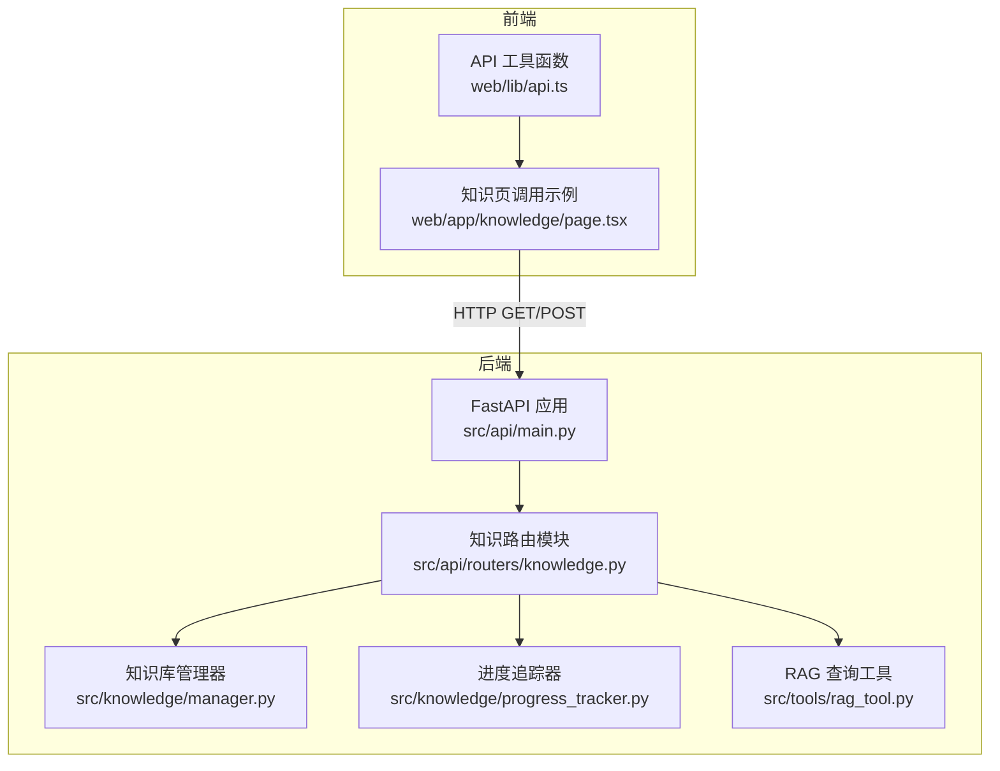
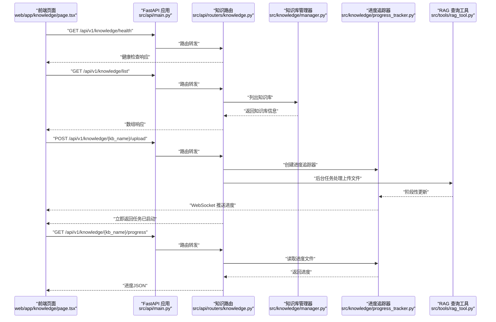
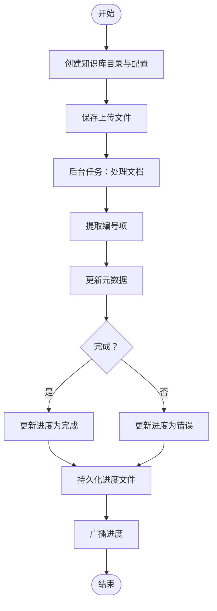
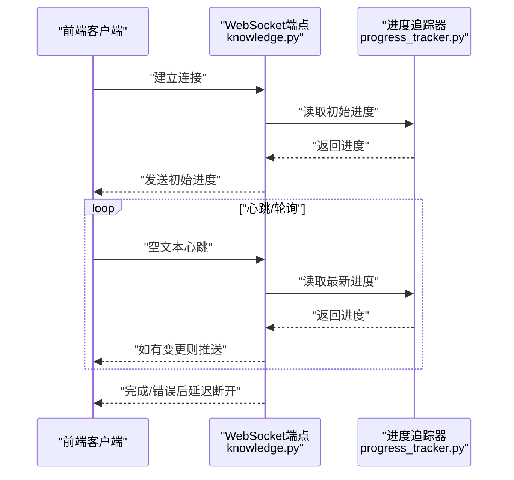
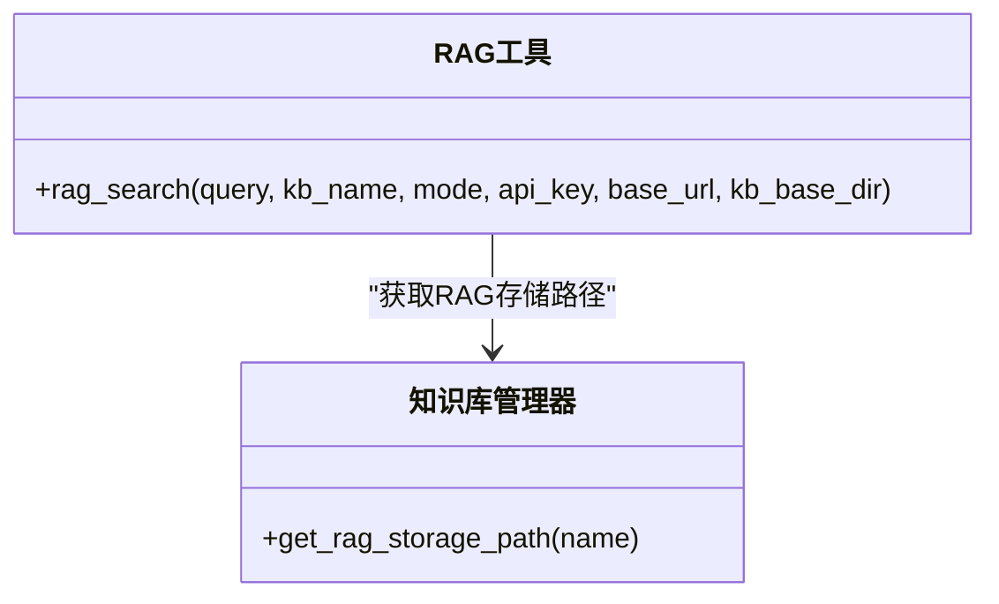
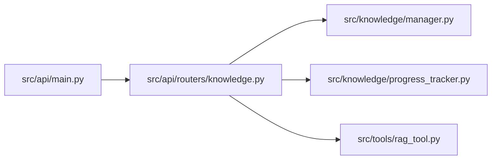

# API接口

<cite>
**本文引用的文件列表**
- [knowledge.py](file://src/api/routers/knowledge.py)
- [main.py](file://src/api/main.py)
- [api.ts](file://web/lib/api.ts)
- [page.tsx](file://web/app/knowledge/page.tsx)
- [rag_tool.py](file://src/tools/rag_tool.py)
- [manager.py](file://src/knowledge/manager.py)
- [progress_tracker.py](file://src/knowledge/progress_tracker.py)
- [README.md](file://src/api/README.md)
</cite>

## 目录
1. [简介](#简介)
2. [项目结构](#项目结构)
3. [核心组件](#核心组件)
4. [架构总览](#架构总览)
5. [详细组件分析](#详细组件分析)
6. [依赖关系分析](#依赖关系分析)
7. [性能与并发特性](#性能与并发特性)
8. [故障排查指南](#故障排查指南)
9. [结论](#结论)
10. [附录：请求-响应与调用示例](#附录请求-响应与调用示例)

## 简介
本文件面向“知识检索API”的完整使用文档，聚焦于后端在 src/api/routers/knowledge.py 中定义的RESTful端点，覆盖以下方面：
- 端点清单：HTTP方法、URL路径、请求参数、请求体结构与响应格式
- 实时查询与初始化流程：如何通过后台任务与WebSocket实现实时进度反馈
- 身份验证与安全：当前实现未内置认证，建议在生产环境增加鉴权中间件
- 前后端集成：基于 web/lib/api.ts 的前端URL构造与 web/app/knowledge/page.tsx 的调用示例
- 错误处理与状态码：统一异常转换为HTTP异常，便于前端捕获与提示
- 同步与异步查询：通过后台任务实现异步处理，前端轮询或WebSocket订阅进度

## 项目结构
知识检索API位于后端 FastAPI 应用中，采用模块化路由组织，知识相关端点挂载在 /api/v1/knowledge 前缀下。前端通过 Next.js 应用调用这些接口。

图表来源
- [main.py](file://src/api/main.py#L69-L81)
- [knowledge.py](file://src/api/routers/knowledge.py#L173-L535)
- [manager.py](file://src/knowledge/manager.py#L1-L120)
- [progress_tracker.py](file://src/knowledge/progress_tracker.py#L1-L192)
- [rag_tool.py](file://src/tools/rag_tool.py#L1-L120)
- [api.ts](file://web/lib/api.ts#L1-L59)
- [page.tsx](file://web/app/knowledge/page.tsx#L119-L192)

章节来源
- [main.py](file://src/api/main.py#L69-L81)
- [README.md](file://src/api/README.md#L45-L80)

## 核心组件
- 知识路由模块：提供知识库生命周期管理、上传与初始化、进度查询与WebSocket实时推送等能力
- 知识库管理器：负责知识库目录结构、元数据读取、统计信息汇总与删除
- 进度追踪器：记录初始化/上传过程的阶段、计数、百分比与时间戳，并持久化到文件
- RAG 查询工具：封装对 RAGAnything 的异步查询，支持多种模式（hybrid/naive/local/global）
- 前端API工具：统一构造HTTP与WebSocket URL，确保前后端一致的端点访问

章节来源
- [knowledge.py](file://src/api/routers/knowledge.py#L173-L535)
- [manager.py](file://src/knowledge/manager.py#L120-L260)
- [progress_tracker.py](file://src/knowledge/progress_tracker.py#L1-L192)
- [rag_tool.py](file://src/tools/rag_tool.py#L1-L120)
- [api.ts](file://web/lib/api.ts#L1-L59)

## 架构总览
后端通过 FastAPI 挂载知识路由，前端通过 Next.js 页面发起HTTP请求；初始化与上传操作采用后台任务异步执行，进度通过文件与WebSocket广播同步给前端。

图表来源
- [main.py](file://src/api/main.py#L69-L81)
- [knowledge.py](file://src/api/routers/knowledge.py#L173-L535)
- [manager.py](file://src/knowledge/manager.py#L120-L260)
- [progress_tracker.py](file://src/knowledge/progress_tracker.py#L120-L192)
- [rag_tool.py](file://src/tools/rag_tool.py#L1-L120)
- [page.tsx](file://web/app/knowledge/page.tsx#L119-L192)

## 详细组件分析

### 端点一览与规范
- 健康检查
  - 方法与路径：GET /api/v1/knowledge/health
  - 请求参数：无
  - 请求体：无
  - 响应：包含状态、配置文件存在性、基础目录存在性与知识库数量等信息
  - 异常：内部错误时返回错误详情与堆栈

- 列出知识库
  - 方法与路径：GET /api/v1/knowledge/list
  - 请求参数：无
  - 请求体：无
  - 响应：数组，元素为包含名称、是否默认、统计信息的对象
  - 异常：当所有知识库加载失败时返回500

- 获取知识库详情
  - 方法与路径：GET /api/v1/knowledge/{kb_name}
  - 路径参数：kb_name（知识库名称）
  - 请求体：无
  - 响应：知识库详细信息（含统计、元数据、默认标记等）
  - 异常：未找到返回404，其他错误返回500

- 删除知识库
  - 方法与路径：DELETE /api/v1/knowledge/{kb_name}
  - 路径参数：kb_name
  - 请求体：无
  - 响应：成功消息
  - 异常：未找到返回404，删除失败返回400，其他错误返回500

- 创建知识库并初始化
  - 方法与路径：POST /api/v1/knowledge/create
  - 表单字段：name（必填）、files（多文件，必填）
  - 请求体：multipart/form-data
  - 响应：包含知识库名称与上传文件列表的消息
  - 异常：重名返回400，其他错误返回500
  - 后台任务：初始化知识库（文档处理、编号项提取），进度持久化与广播

- 上传文件至知识库
  - 方法与路径：POST /api/v1/knowledge/{kb_name}/upload
  - 路径参数：kb_name
  - 表单字段：files（多文件，必填）
  - 请求体：multipart/form-data
  - 响应：包含上传文件数量与文件名列表的消息
  - 异常：未找到返回404，其他错误返回500
  - 后台任务：处理新文档、提取编号项、更新元数据

- 获取初始化进度
  - 方法与路径：GET /api/v1/knowledge/{kb_name}/progress
  - 路径参数：kb_name
  - 请求体：无
  - 响应：进度对象（阶段、消息、计数、百分比、时间戳、可选错误）
  - 异常：返回500

- 清除进度
  - 方法与路径：POST /api/v1/knowledge/{kb_name}/progress/clear
  - 路径参数：kb_name
  - 请求体：无
  - 响应：清除结果
  - 异常：返回500

- WebSocket 实时进度
  - 方法与路径：WS /api/v1/knowledge/{kb_name}/progress/ws
  - 路径参数：kb_name
  - 协议：ws:// 或 wss://
  - 数据类型：JSON，包含 type 与 data 字段
    - type="progress"：发送进度对象
    - type="error"：发送错误消息
  - 断开：客户端心跳超时或断开连接时自动关闭

章节来源
- [knowledge.py](file://src/api/routers/knowledge.py#L173-L535)
- [README.md](file://src/api/README.md#L69-L80)

### 处理逻辑与数据流

#### 后台任务与进度追踪
- 初始化任务：创建目录、写入配置、保存上传文件、后台执行文档处理与编号项提取，最终更新进度为完成或错误
- 上传处理任务：复制文件到原始目录、后台执行文档处理与编号项提取、更新元数据，最终更新进度
- 进度持久化：进度以JSON写入知识库根目录下的进度文件，包含阶段、计数、百分比与时间戳
- 进度广播：通过进度追踪器通知回调与WebSocket广播器，前端可订阅实时进度

图表来源
- [knowledge.py](file://src/api/routers/knowledge.py#L346-L422)
- [knowledge.py](file://src/api/routers/knowledge.py#L108-L171)
- [progress_tracker.py](file://src/knowledge/progress_tracker.py#L119-L172)

章节来源
- [knowledge.py](file://src/api/routers/knowledge.py#L108-L171)
- [progress_tracker.py](file://src/knowledge/progress_tracker.py#L119-L172)

#### WebSocket 实时进度推送
- 客户端连接：建立WS连接，服务端发送初始进度（若KB未就绪或进度最近）
- 心跳与轮询：客户端定期发送空文本保持连接，服务端定时轮询进度文件，有变化则推送
- 结束条件：进度达到完成或错误后等待短暂时间再断开

图表来源
- [knowledge.py](file://src/api/routers/knowledge.py#L450-L535)
- [progress_tracker.py](file://src/knowledge/progress_tracker.py#L173-L192)

章节来源
- [knowledge.py](file://src/api/routers/knowledge.py#L450-L535)
- [progress_tracker.py](file://src/knowledge/progress_tracker.py#L173-L192)

#### RAG 查询集成
- 统一查询入口：通过 RAG 查询工具封装不同模式（hybrid/naive/local/global），返回包含问题、答案与模式的字典
- 配置来源：优先从配置读取LLM与嵌入模型参数，否则回退到默认路径
- 使用场景：在研究、问答等Agent流程中调用该工具进行检索增强生成

图表来源
- [rag_tool.py](file://src/tools/rag_tool.py#L1-L120)
- [manager.py](file://src/knowledge/manager.py#L92-L98)

章节来源
- [rag_tool.py](file://src/tools/rag_tool.py#L1-L120)
- [manager.py](file://src/knowledge/manager.py#L92-L98)

### 前后端集成与调用示例

#### 前端URL构造
- 基于环境变量 NEXT_PUBLIC_API_BASE 构造HTTP与WebSocket URL
- 提供 apiUrl(path) 与 wsUrl(path) 辅助函数，自动规范化路径与协议

章节来源
- [api.ts](file://web/lib/api.ts#L1-L59)

#### 前端调用示例（知识页）
- 健康检查：先请求健康端点，再请求知识库列表
- 列表获取：GET /api/v1/knowledge/list，解析数组并渲染
- 错误处理：对非OK响应解析错误详情并提示

章节来源
- [page.tsx](file://web/app/knowledge/page.tsx#L119-L192)

## 依赖关系分析
- 路由注册：主应用在启动时挂载知识路由，前缀为 /api/v1/knowledge
- 组件耦合：
  - 知识路由依赖知识库管理器与进度追踪器
  - 初始化/上传任务依赖RAG工具与配置读取
  - WebSocket依赖进度广播器与进度文件
- 外部依赖：FastAPI、WebSocket、文件系统、RAGAnything

图表来源
- [main.py](file://src/api/main.py#L69-L81)
- [knowledge.py](file://src/api/routers/knowledge.py#L173-L535)

章节来源
- [main.py](file://src/api/main.py#L69-L81)
- [knowledge.py](file://src/api/routers/knowledge.py#L173-L535)

## 性能与并发特性
- 异步处理：初始化与上传均通过后台任务执行，避免阻塞主线程
- 并发控制：后台任务内部按批次处理文件，减少内存峰值
- 进度持久化：进度文件作为轻量级状态存储，降低数据库压力
- WebSocket：长连接用于实时推送，客户端可选择心跳维持或断线重连

[本节为通用性能讨论，不直接分析具体文件]

## 故障排查指南
- 健康检查失败：检查知识库配置文件是否存在、基础目录是否可访问
- 列表为空：确认知识库目录结构与元数据文件存在，必要时清理并重新初始化
- 上传失败：检查LLM配置读取是否成功，确认目标知识库存在
- 初始化卡住：使用进度清除端点清理进度文件，或检查RAG存储目录是否正确
- WebSocket断开：确认前端心跳策略与后端超时设置，必要时延长超时或调整轮询间隔

章节来源
- [knowledge.py](file://src/api/routers/knowledge.py#L173-L266)
- [knowledge.py](file://src/api/routers/knowledge.py#L424-L448)
- [progress_tracker.py](file://src/knowledge/progress_tracker.py#L173-L192)

## 结论
知识检索API提供了从创建、上传、初始化到实时进度监控的完整能力，配合RAG工具实现检索增强生成。当前实现未内置认证，建议在生产环境增加鉴权中间件与限流策略，同时优化WebSocket的心跳与断线重连机制，提升用户体验与系统稳定性。

[本节为总结性内容，不直接分析具体文件]

## 附录：请求-响应与调用示例

### curl 示例（不含认证）
- 健康检查
  - curl -i "http://localhost:8000/api/v1/knowledge/health"
- 列出知识库
  - curl -i "http://localhost:8000/api/v1/knowledge/list"
- 获取知识库详情
  - curl -i "http://localhost:8000/api/v1/knowledge/{kb_name}"
- 删除知识库
  - curl -i -X DELETE "http://localhost:8000/api/v1/knowledge/{kb_name}"
- 创建知识库并初始化
  - curl -i -F "name=your_kb" -F "files=@file1.pdf" -F "files=@file2.pdf" "http://localhost:8000/api/v1/knowledge/create"
- 上传文件至知识库
  - curl -i -F "files=@file1.pdf" -F "files=@file2.pdf" "http://localhost:8000/api/v1/knowledge/{kb_name}/upload"
- 获取进度
  - curl -i "http://localhost:8000/api/v1/knowledge/{kb_name}/progress"
- 清除进度
  - curl -i -X POST "http://localhost:8000/api/v1/knowledge/{kb_name}/progress/clear"

### TypeScript（前端）调用要点
- 使用 apiUrl 构造HTTP端点，使用 wsUrl 构造WebSocket端点
- 健康检查与列表获取的错误处理与日志输出参考页面示例
- WebSocket订阅进度时，注意断线重连与错误上报

章节来源
- [api.ts](file://web/lib/api.ts#L1-L59)
- [page.tsx](file://web/app/knowledge/page.tsx#L119-L192)