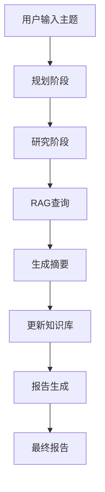

# 工具集成

<cite>
**本文档引用的文件**   
- [rag_tool.py](file://src/tools/rag_tool.py)
- [tool_agent.py](file://src/agents/solve/solve_loop/tool_agent.py)
- [research_pipeline.py](file://src/agents/research/research_pipeline.py)
- [research_agent.py](file://src/agents/research/agents/research_agent.py)
- [main_solver.py](file://src/agents/solve/main_solver.py)
- [manager.py](file://src/knowledge/manager.py)
- [core.py](file://src/core/core.py)
- [main.yaml](file://config/main.yaml)
</cite>

## 目录
1. [引言](#引言)
2. [RAG工具核心功能](#rag工具核心功能)
3. [RAG工具在智能体系统中的集成](#rag工具在智能体系统中的集成)
4. [工作流中的调用方式](#工作流中的调用方式)
5. [输入输出格式与错误处理](#输入输出格式与错误处理)
6. [参数调优与检索效果](#参数调优与检索效果)
7. [总结](#总结)

## 引言
RAG（检索增强生成）工具是连接智能体系统与知识库的核心桥梁。它通过将智能体的自然语言查询转换为结构化的检索请求，从知识库中获取相关信息，并生成上下文增强的响应。本文档详细阐述了`rag_tool.py`中`RAGTool`类的实现机制，以及其在`solve`和`research`模块中的实际应用。通过分析智能体的工作流，展示RAG工具如何被调用、处理数据，并讨论参数调优对检索效果的影响。

## RAG工具核心功能
`RAGTool`类的主要功能是封装RAG查询功能，为智能体提供一个统一的接口来访问知识库。其核心功能包括：

- **查询处理**：接收自然语言查询，根据指定的模式（如`hybrid`、`naive`）执行检索。
- **配置管理**：从环境变量和配置文件中加载LLM和嵌入模型的配置，确保与系统其他部分的一致性。
- **知识库管理**：利用`KnowledgeBaseManager`确定知识库的存储路径，确保能够正确访问RAG存储。
- **结果返回**：返回包含查询、答案和模式的字典，为上层智能体提供结构化数据。

**Section sources**
- [rag_tool.py](file://src/tools/rag_tool.py#L31-L241)

## RAG工具在智能体系统中的集成
RAG工具通过`rag_search`函数被集成到智能体系统中。该函数作为异步接口，允许智能体在不阻塞主线程的情况下执行检索操作。智能体通过调用`rag_search`并传入查询和相关参数，即可获取知识库中的信息。

在`solve`模块中，`ToolAgent`负责执行工具调用，包括RAG查询。当`ToolAgent`检测到需要执行RAG查询时，会调用`rag_search`函数，并将结果用于生成最终答案。类似地，在`research`模块中，`ResearchAgent`通过`call_tool_callback`调用`rag_search`，实现对知识库的动态检索。

**Section sources**
- [tool_agent.py](file://src/agents/solve/solve_loop/tool_agent.py#L197-L209)
- [research_pipeline.py](file://src/agents/research/research_pipeline.py#L273-L304)

## 工作流中的调用方式
RAG工具在智能体的工作流中扮演着关键角色。以`research`模块为例，其工作流分为三个阶段：规划、研究和报告。在研究阶段，`ResearchAgent`根据当前主题生成查询计划，选择合适的工具（如`rag_hybrid`或`rag_naive`），并通过`call_tool_callback`调用`rag_search`执行查询。查询结果随后被`NoteAgent`处理，生成摘要并更新知识库。



**Diagram sources**
- [research_pipeline.py](file://src/agents/research/research_pipeline.py#L375-L411)
- [research_agent.py](file://src/agents/research/agents/research_agent.py#L426-L460)

## 输入输出格式与错误处理
RAG工具的输入格式包括查询字符串、知识库名称、查询模式等。输出格式为一个字典，包含查询、答案和模式。例如：

```python
{
    "query": "What is the lookup table (LUT) in FPGA?",
    "answer": "A lookup table (LUT) in FPGA is a configurable logic block that can implement any Boolean function.",
    "mode": "hybrid"
}
```

错误处理机制包括配置错误、知识库访问错误和查询失败等。当发生错误时，RAG工具会抛出相应的异常，并提供详细的错误信息，帮助开发者快速定位问题。

**Section sources**
- [rag_tool.py](file://src/tools/rag_tool.py#L59-L240)
- [main_solver.py](file://src/agents/solve/main_solver.py#L287-L293)

## 参数调优与检索效果
参数调优对RAG工具的检索效果有显著影响。例如，`mode`参数决定了查询的模式，`hybrid`模式结合了多种检索策略，通常能提供更全面的结果，而`naive`模式则更直接，适合简单查询。此外，`kb_name`参数指定了知识库的名称，不同的知识库可能包含不同的信息，影响检索结果的相关性。

通过调整这些参数，可以优化检索效果，提高智能体的性能。例如，在需要深度挖掘信息的场景中，可以使用`hybrid`模式；而在需要快速获取答案的场景中，可以使用`naive`模式。

**Section sources**
- [main.yaml](file://config/main.yaml#L91-L94)
- [rag_tool.py](file://src/tools/rag_tool.py#L34-L49)

## 总结
RAG工具作为智能体系统与知识库之间的桥梁，通过将自然语言查询转换为结构化检索请求，实现了高效的信息获取。其在`solve`和`research`模块中的集成，展示了其在复杂工作流中的应用价值。通过合理的参数调优，可以进一步提升检索效果，为智能体提供更准确、更全面的信息支持。