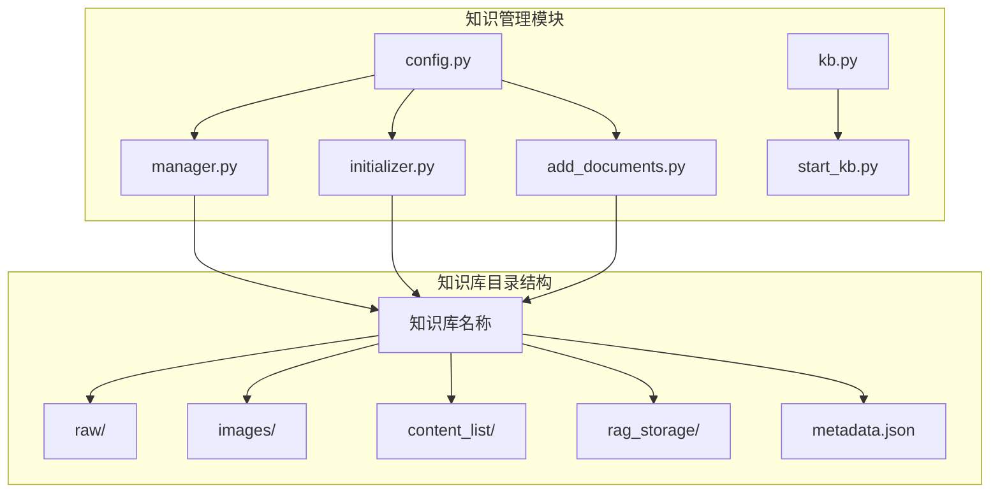
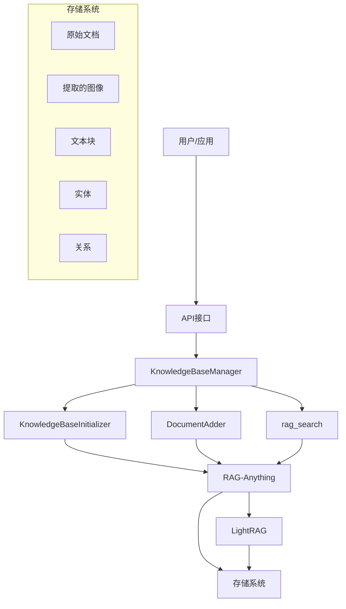
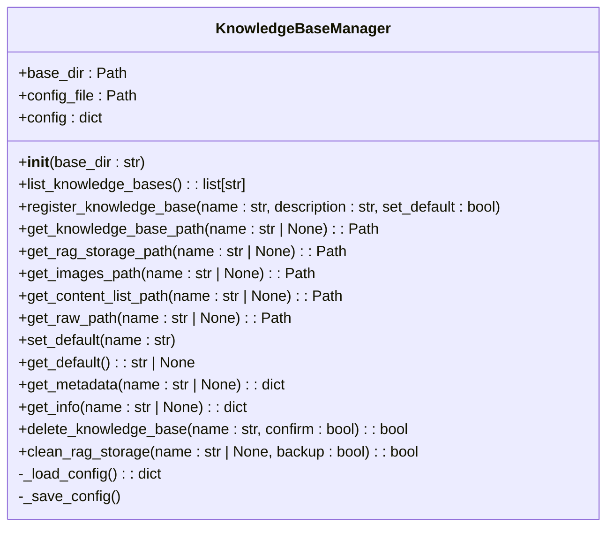
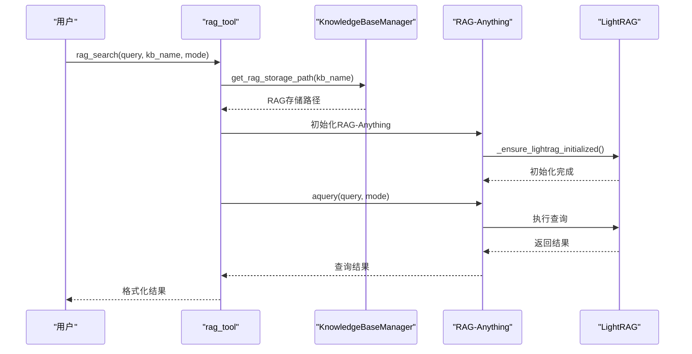
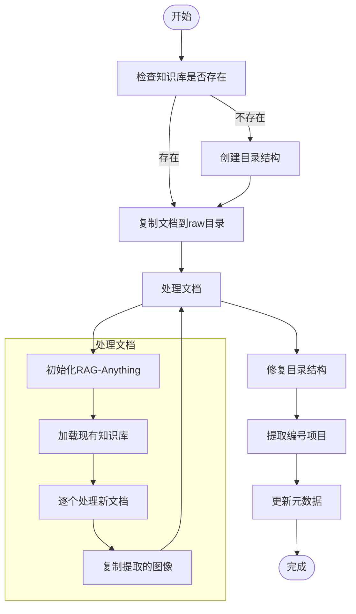
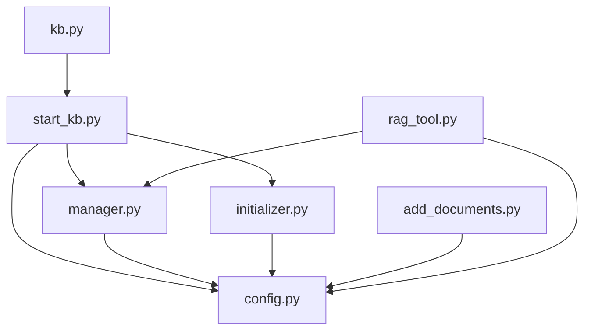

# 检索引擎

<cite>
**本文档引用的文件**   
- [kb.py](file://src/knowledge/kb.py)
- [manager.py](file://src/knowledge/manager.py)
- [config.py](file://src/knowledge/config.py)
- [start_kb.py](file://src/knowledge/start_kb.py)
- [add_documents.py](file://src/knowledge/add_documents.py)
- [initializer.py](file://src/knowledge/initializer.py)
- [rag_tool.py](file://src/tools/rag_tool.py)
- [main.yaml](file://config/main.yaml)
</cite>

## 目录
1. [简介](#简介)
2. [项目结构](#项目结构)
3. [核心组件](#核心组件)
4. [架构概述](#架构概述)
5. [详细组件分析](#详细组件分析)
6. [依赖分析](#依赖分析)
7. [性能考虑](#性能考虑)
8. [故障排除指南](#故障排除指南)
9. [结论](#结论)

## 简介
本文档详细描述了DeepTutor系统中知识检索引擎的技术实现。重点分析了`kb.py`中的`KnowledgeBase`类如何封装RAG（检索增强生成）能力，包括向量索引构建、相似性计算、top-k结果返回和元数据过滤等功能。同时，文档解释了`manager.py`中的知识库管理逻辑如何与检索过程协同工作，以及`config.py`中定义的检索参数对结果的影响。

**Section sources**
- [kb.py](file://src/knowledge/kb.py#L1-L20)
- [manager.py](file://src/knowledge/manager.py#L1-L458)
- [config.py](file://src/knowledge/config.py#L1-L66)

## 项目结构
知识检索引擎的文件组织遵循模块化设计原则，主要组件位于`src/knowledge/`目录下。系统通过清晰的目录结构管理知识库的各个方面，包括原始文档、提取的图像、内容列表和RAG存储。

**Diagram sources **
- [manager.py](file://src/knowledge/manager.py#L12-L30)
- [initializer.py](file://src/knowledge/initializer.py#L62-L67)

**Section sources**
- [manager.py](file://src/knowledge/manager.py#L1-L458)
- [initializer.py](file://src/knowledge/initializer.py#L1-L684)

## 核心组件
知识检索引擎的核心由`KnowledgeBaseManager`类实现，该类负责管理多个知识库的生命周期。系统通过`KnowledgeBaseInitializer`和`DocumentAdder`类分别处理知识库的初始化和文档增量添加，确保知识库可以动态更新。

**Section sources**
- [manager.py](file://src/knowledge/manager.py#L12-L458)
- [initializer.py](file://src/knowledge/initializer.py#L47-L684)
- [add_documents.py](file://src/knowledge/add_documents.py#L44-L622)

## 架构概述
知识检索引擎采用分层架构设计，将知识库管理、文档处理和检索功能分离。系统通过RAG-Anything框架实现文档解析和向量索引构建，利用LightRAG进行高效的相似性搜索。

**Diagram sources **
- [manager.py](file://src/knowledge/manager.py#L12-L30)
- [rag_tool.py](file://src/tools/rag_tool.py#L31-L263)
- [initializer.py](file://src/knowledge/initializer.py#L47-L684)

## 详细组件分析

### KnowledgeBaseManager分析
`KnowledgeBaseManager`类是知识库管理系统的核心，负责管理多个知识库的注册、配置和访问。该类通过`kb_config.json`文件持久化知识库的元数据，确保系统重启后仍能正确识别所有知识库。

**Diagram sources **
- [manager.py](file://src/knowledge/manager.py#L12-L304)

**Section sources**
- [manager.py](file://src/knowledge/manager.py#L12-L458)

### 检索流程分析
知识检索引擎的查询流程涉及多个组件的协同工作。从用户发起查询到返回结果，系统需要经过参数解析、知识库定位、RAG查询执行和结果格式化等步骤。

**Diagram sources **
- [rag_tool.py](file://src/tools/rag_tool.py#L31-L263)
- [manager.py](file://src/knowledge/manager.py#L92-L98)

### 文档处理流程分析
知识库初始化和文档添加过程遵循相似的处理流程，包括文档复制、RAG处理、结构修复和元数据更新等步骤。这一流程确保新文档能够正确集成到现有知识库中。

**Diagram sources **
- [add_documents.py](file://src/knowledge/add_documents.py#L132-L321)
- [initializer.py](file://src/knowledge/initializer.py#L160-L365)

## 依赖分析
知识检索引擎依赖于多个内部和外部组件，形成复杂的依赖关系网络。系统通过清晰的模块划分和接口定义，确保各组件之间的松耦合。

**Diagram sources **
- [kb.py](file://src/knowledge/kb.py#L1-L20)
- [start_kb.py](file://src/knowledge/start_kb.py#L1-L535)
- [config.py](file://src/knowledge/config.py#L1-L66)

**Section sources**
- [kb.py](file://src/knowledge/kb.py#L1-L20)
- [start_kb.py](file://src/knowledge/start_kb.py#L1-L535)
- [config.py](file://src/knowledge/config.py#L1-L66)

## 性能考虑
知识检索引擎在设计时考虑了高并发场景下的性能优化。系统通过异步处理、批量操作和合理的资源管理，确保在高负载下仍能提供稳定的服务。

**Section sources**
- [add_documents.py](file://src/knowledge/add_documents.py#L132-L321)
- [rag_tool.py](file://src/tools/rag_tool.py#L31-L263)

## 故障排除指南
当知识检索引擎出现问题时，可以通过以下步骤进行排查和解决：

1. **检查知识库是否存在**：使用`list_knowledge_bases()`方法确认目标知识库已正确注册
2. **验证RAG存储**：确保`rag_storage`目录存在且包含必要的索引文件
3. **检查API密钥**：确认LLM API密钥已正确配置
4. **查看日志信息**：检查系统日志以获取详细的错误信息

**Section sources**
- [manager.py](file://src/knowledge/manager.py#L34-L61)
- [rag_tool.py](file://src/tools/rag_tool.py#L60-L75)

## 结论
DeepTutor的知识检索引擎通过模块化设计和清晰的接口定义，实现了高效的知识库管理和检索功能。系统支持知识库的初始化、增量更新和复杂查询，为上层应用提供了强大的RAG能力。通过合理的架构设计和性能优化，该引擎能够在高并发场景下稳定运行，满足实际应用需求。