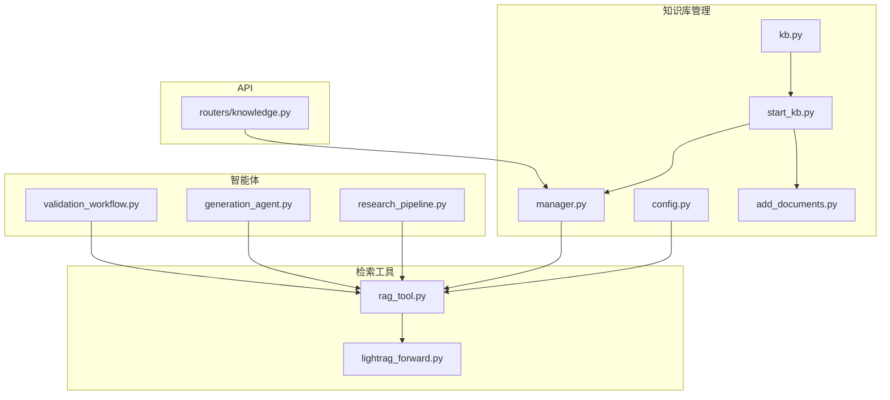
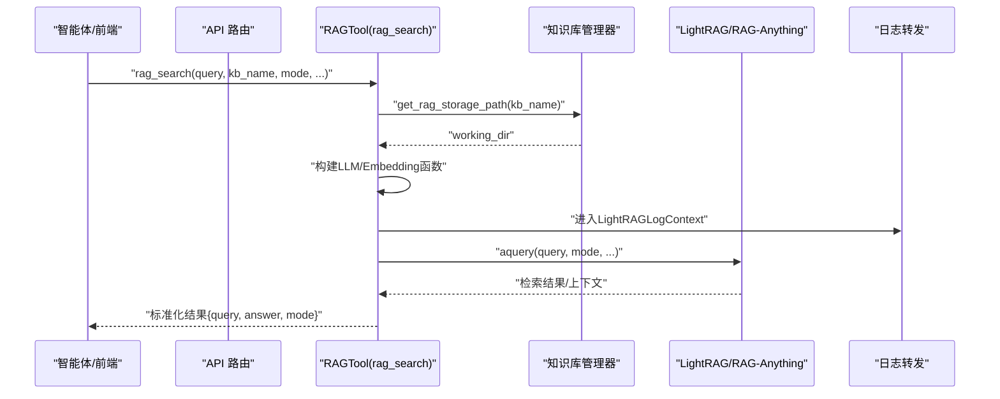
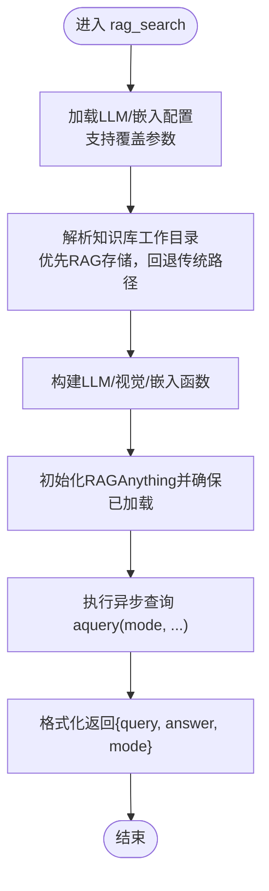
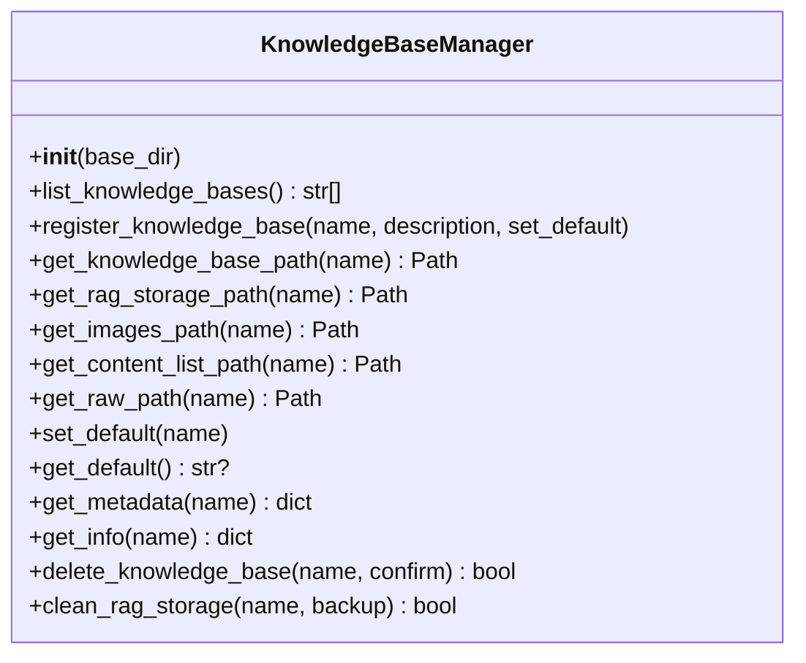
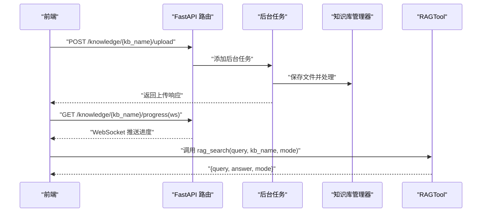
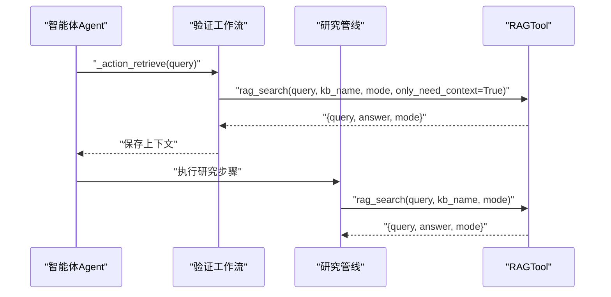
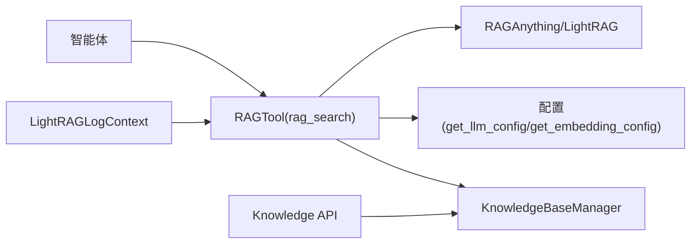

# 知识检索

<cite>
**本文引用的文件**
- [src/knowledge/kb.py](file://src/knowledge/kb.py)
- [src/knowledge/start_kb.py](file://src/knowledge/start_kb.py)
- [src/knowledge/manager.py](file://src/knowledge/manager.py)
- [src/knowledge/config.py](file://src/knowledge/config.py)
- [src/knowledge/add_documents.py](file://src/knowledge/add_documents.py)
- [src/tools/rag_tool.py](file://src/tools/rag_tool.py)
- [src/api/routers/knowledge.py](file://src/api/routers/knowledge.py)
- [src/core/logging/lightrag_forward.py](file://src/core/logging/lightrag_forward.py)
- [src/agents/question/validation_workflow.py](file://src/agents/question/validation_workflow.py)
- [src/agents/question/agents/generation_agent.py](file://src/agents/question/agents/generation_agent.py)
- [src/agents/research/research_pipeline.py](file://src/agents/research/research_pipeline.py)
</cite>

## 目录
1. [简介](#简介)
2. [项目结构](#项目结构)
3. [核心组件](#核心组件)
4. [架构总览](#架构总览)
5. [详细组件分析](#详细组件分析)
6. [依赖关系分析](#依赖关系分析)
7. [性能考量](#性能考量)
8. [故障排查指南](#故障排查指南)
9. [结论](#结论)
10. [附录](#附录)

## 简介
本文件围绕知识检索功能进行全面技术文档化，重点说明：
- kb.py 中的 KnowledgeBase 类如何封装 RAG 检索能力（通过 rag_tool 的统一入口）
- rag_tool.py 中 RAGTool 如何作为智能体系统与知识库之间的桥梁，实现从自然语言查询到结构化检索的转换
- 检索结果的格式规范、相关性排序机制与上下文提取策略
- 结合 API 端点说明实时查询的工作流程，包括请求处理、缓存机制与性能优化
- 实际查询示例：覆盖事实性、概念性、关联性三类问题，并给出参数调优建议

## 项目结构
知识检索相关模块主要分布在以下位置：
- 知识库管理与启动：src/knowledge/kb.py、src/knowledge/start_kb.py、src/knowledge/manager.py、src/knowledge/config.py、src/knowledge/add_documents.py
- 检索工具与日志：src/tools/rag_tool.py、src/core/logging/lightrag_forward.py
- API 路由与前端交互：src/api/routers/knowledge.py
- 智能体使用检索：src/agents/question/*、src/agents/research/*

图表来源
- [src/knowledge/kb.py](file://src/knowledge/kb.py#L1-L20)
- [src/knowledge/start_kb.py](file://src/knowledge/start_kb.py#L1-L120)
- [src/knowledge/manager.py](file://src/knowledge/manager.py#L1-L120)
- [src/knowledge/config.py](file://src/knowledge/config.py#L1-L66)
- [src/knowledge/add_documents.py](file://src/knowledge/add_documents.py#L1-L120)
- [src/tools/rag_tool.py](file://src/tools/rag_tool.py#L1-L120)
- [src/core/logging/lightrag_forward.py](file://src/core/logging/lightrag_forward.py#L1-L120)
- [src/api/routers/knowledge.py](file://src/api/routers/knowledge.py#L1-L120)
- [src/agents/question/validation_workflow.py](file://src/agents/question/validation_workflow.py#L216-L246)
- [src/agents/question/agents/generation_agent.py](file://src/agents/question/agents/generation_agent.py#L118-L151)
- [src/agents/research/research_pipeline.py](file://src/agents/research/research_pipeline.py#L272-L305)

章节来源
- [src/knowledge/kb.py](file://src/knowledge/kb.py#L1-L20)
- [src/knowledge/start_kb.py](file://src/knowledge/start_kb.py#L1-L120)
- [src/knowledge/manager.py](file://src/knowledge/manager.py#L1-L120)
- [src/knowledge/config.py](file://src/knowledge/config.py#L1-L66)
- [src/knowledge/add_documents.py](file://src/knowledge/add_documents.py#L1-L120)
- [src/tools/rag_tool.py](file://src/tools/rag_tool.py#L1-L120)
- [src/core/logging/lightrag_forward.py](file://src/core/logging/lightrag_forward.py#L1-L120)
- [src/api/routers/knowledge.py](file://src/api/routers/knowledge.py#L1-L120)
- [src/agents/question/validation_workflow.py](file://src/agents/question/validation_workflow.py#L216-L246)
- [src/agents/question/agents/generation_agent.py](file://src/agents/question/agents/generation_agent.py#L118-L151)
- [src/agents/research/research_pipeline.py](file://src/agents/research/research_pipeline.py#L272-L305)

## 核心组件
- 知识库管理器 KnowledgeBaseManager：负责知识库目录结构、默认知识库、统计信息与路径解析；为检索工具提供工作目录定位。
- RAG 检索工具 rag_search：封装 LLM 与嵌入函数，构建 RAGAnything 实例，执行查询并返回标准化结果。
- 日志转发 LightRAGLogContext：将 LightRAG/RAG-Anything 日志接入统一日志系统，便于调试与监控。
- API 路由 routers/knowledge：提供知识库健康检查、列表、详情、上传、初始化等端点，支撑前端与后端协同。
- 智能体使用检索：在问题生成与验证、研究管线中调用 rag_search，实现从自然语言到结构化检索的桥接。

章节来源
- [src/knowledge/manager.py](file://src/knowledge/manager.py#L1-L120)
- [src/tools/rag_tool.py](file://src/tools/rag_tool.py#L31-L120)
- [src/core/logging/lightrag_forward.py](file://src/core/logging/lightrag_forward.py#L85-L183)
- [src/api/routers/knowledge.py](file://src/api/routers/knowledge.py#L173-L266)
- [src/agents/question/validation_workflow.py](file://src/agents/question/validation_workflow.py#L216-L246)
- [src/agents/question/agents/generation_agent.py](file://src/agents/question/agents/generation_agent.py#L118-L151)
- [src/agents/research/research_pipeline.py](file://src/agents/research/research_pipeline.py#L272-L305)

## 架构总览
检索链路自上而下分为三层：
- 应用层（智能体/前端）：发起查询，传入知识库名称、查询语句与模式参数
- 工具层（RAGTool）：解析配置、定位知识库工作目录、构造 LLM/Embedding 函数、调用 RAGAnything 执行查询
- 基础设施层（LightRAG/RAG-Anything）：执行检索、排序、上下文抽取与生成

图表来源
- [src/tools/rag_tool.py](file://src/tools/rag_tool.py#L31-L120)
- [src/knowledge/manager.py](file://src/knowledge/manager.py#L92-L114)
- [src/core/logging/lightrag_forward.py](file://src/core/logging/lightrag_forward.py#L85-L183)

## 详细组件分析

### 组件A：RAGTool（检索工具）
- 功能职责
  - 解析 LLM 与嵌入配置，支持覆盖参数（api_key/base_url/model/dim/max_tokens）
  - 自动定位知识库工作目录（优先使用 RAG 存储，回退到传统路径），若不存在则抛出友好错误
  - 构造 LLM 与视觉模型函数（支持 messages 与单图输入）
  - 构造嵌入函数（维度、最大 token 数）
  - 初始化 RAGAnything 并执行异步查询，返回标准化字典
- 关键参数
  - query：自然语言查询
  - kb_name：知识库名称（可选，默认使用默认知识库）
  - mode：检索模式（local/global/hybrid/naive）
  - api_key/base_url：覆盖 LLM 配置
  - kb_base_dir：知识库基目录（默认 data/knowledge_bases）
  - 其他：如 only_need_context/only_need_prompt 等透传给底层
- 返回格式
  - 字典包含 query、answer、mode 三项，answer 为字符串或可序列化对象的字符串表示
- 错误处理
  - 配置缺失、知识库未初始化、路径不存在时抛出异常并提示初始化命令
- 性能与缓存
  - 使用 openai_complete_if_cache 进行 LLM 调用缓存
  - 嵌入函数按维度与最大 token 数限制控制成本
  - 日志转发减少重复输出，便于观测

图表来源
- [src/tools/rag_tool.py](file://src/tools/rag_tool.py#L31-L120)
- [src/tools/rag_tool.py](file://src/tools/rag_tool.py#L120-L241)

章节来源
- [src/tools/rag_tool.py](file://src/tools/rag_tool.py#L31-L120)
- [src/tools/rag_tool.py](file://src/tools/rag_tool.py#L120-L241)

### 组件B：知识库管理器（KnowledgeBaseManager）
- 功能职责
  - 列举知识库、注册/设置默认知识库、读取元数据与统计
  - 获取各子目录路径（raw/images/content_list/rag_storage）
  - 提供 get_rag_storage_path 定位 RAG 存储，用于检索工具
- 关键点
  - 统一从 kb_config.json 读取权威列表，兼容目录扫描回退
  - 统计信息包含 raw 文档数、图片数、内容列表数、RAG 是否初始化
  - 支持清理 RAG 存储并可选择备份

图表来源
- [src/knowledge/manager.py](file://src/knowledge/manager.py#L1-L260)

章节来源
- [src/knowledge/manager.py](file://src/knowledge/manager.py#L1-L260)

### 组件C：检索结果格式与上下文策略
- 结果格式
  - 字典：包含 query、answer、mode
  - answer 为字符串，便于跨层传递与前端渲染
- 上下文提取策略
  - 通过 RAGAnything 的 aquery 执行检索与上下文抽取
  - 可通过 only_need_context/only_need_prompt 等参数控制返回内容
  - 在智能体侧通常仅需要上下文（answer），以便后续推理与生成
- 相关性排序机制
  - 由底层 LightRAG/RAG-Anything 内部完成，具体算法不暴露在工具层
  - 模式参数 mode 控制检索策略（hybrid/naive/local/global）

章节来源
- [src/tools/rag_tool.py](file://src/tools/rag_tool.py#L31-L120)
- [src/agents/question/validation_workflow.py](file://src/agents/question/validation_workflow.py#L216-L246)
- [src/agents/question/agents/generation_agent.py](file://src/agents/question/agents/generation_agent.py#L118-L151)

### 组件D：API 端点与实时查询流程
- 端点概览
  - GET /knowledge/health：健康检查，返回配置存在性、基础目录状态、知识库数量
  - GET /knowledge/list：列出所有知识库及其统计信息
  - GET /knowledge/{kb_name}：获取指定知识库详情
  - DELETE /knowledge/{kb_name}：删除知识库
  - POST /knowledge/{kb_name}/upload：上传文件并后台处理
  - POST /knowledge/create：创建知识库并后台初始化
  - GET /knowledge/{kb_name}/progress：获取初始化进度
  - POST /knowledge/{kb_name}/progress/clear：清除进度
  - WebSocket /knowledge/{kb_name}/progress/ws：实时进度推送
- 实时查询流程
  - 前端调用知识库相关端点（如上传、初始化）触发后台任务
  - 后台任务通过 ProgressTracker 记录阶段与进度，WebSocket 推送
  - 智能体在需要时调用 rag_search 执行检索，返回标准化结果

图表来源
- [src/api/routers/knowledge.py](file://src/api/routers/knowledge.py#L296-L344)
- [src/api/routers/knowledge.py](file://src/api/routers/knowledge.py#L424-L535)
- [src/tools/rag_tool.py](file://src/tools/rag_tool.py#L31-L120)

章节来源
- [src/api/routers/knowledge.py](file://src/api/routers/knowledge.py#L173-L266)
- [src/api/routers/knowledge.py](file://src/api/routers/knowledge.py#L296-L344)
- [src/api/routers/knowledge.py](file://src/api/routers/knowledge.py#L424-L535)

### 组件E：智能体系统中的检索桥接
- 问题生成与验证
  - 在动作中调用 rag_search，设置 only_need_context=True，仅获取上下文
  - 将检索结果追加到 retrieved_knowledge，用于后续生成与验证
- 研究管线
  - 根据配置选择模式（hybrid/naive/local），失败时自动回退到 fallback_mode
  - 统一封装为 _call_tool_with_retry，提升鲁棒性

图表来源
- [src/agents/question/agents/generation_agent.py](file://src/agents/question/agents/generation_agent.py#L118-L151)
- [src/agents/question/validation_workflow.py](file://src/agents/question/validation_workflow.py#L216-L246)
- [src/agents/research/research_pipeline.py](file://src/agents/research/research_pipeline.py#L272-L305)

章节来源
- [src/agents/question/agents/generation_agent.py](file://src/agents/question/agents/generation_agent.py#L118-L151)
- [src/agents/question/validation_workflow.py](file://src/agents/question/validation_workflow.py#L216-L246)
- [src/agents/research/research_pipeline.py](file://src/agents/research/research_pipeline.py#L272-L305)

## 依赖关系分析
- 组件耦合
  - RAGTool 依赖 KnowledgeBaseManager 获取工作目录，依赖配置模块读取 LLM/嵌入参数
  - 智能体通过统一的 rag_search 调用检索，降低对具体实现的耦合
  - 日志转发独立于检索逻辑，仅在上下文中启用
- 外部依赖
  - LightRAG/RAG-Anything：检索与上下文抽取的核心引擎
  - FastAPI：提供知识库管理 API
  - OpenAI 接口：LLM 与嵌入服务

图表来源
- [src/tools/rag_tool.py](file://src/tools/rag_tool.py#L31-L120)
- [src/knowledge/manager.py](file://src/knowledge/manager.py#L1-L120)
- [src/core/logging/lightrag_forward.py](file://src/core/logging/lightrag_forward.py#L85-L183)
- [src/api/routers/knowledge.py](file://src/api/routers/knowledge.py#L1-L120)

章节来源
- [src/tools/rag_tool.py](file://src/tools/rag_tool.py#L31-L120)
- [src/knowledge/manager.py](file://src/knowledge/manager.py#L1-L120)
- [src/core/logging/lightrag_forward.py](file://src/core/logging/lightrag_forward.py#L85-L183)
- [src/api/routers/knowledge.py](file://src/api/routers/knowledge.py#L1-L120)

## 性能考量
- 缓存与并发
  - 使用 openai_complete_if_cache 对 LLM 调用进行缓存，减少重复请求
  - RAG-Anything 支持多模态（图像/表格/公式）处理，注意 token 与并发控制
- 参数优化
  - 适当增大 batch_size 与并发度（需结合硬件与 API 限额）
  - 合理设置 embedding_dim 与 max_tokens，避免超限
  - 选择合适的检索模式（hybrid 通常兼顾召回与重排，naive 更快但召回可能不足）
- 日志与可观测性
  - 通过 LightRAGLogContext 将底层日志接入统一系统，便于定位性能瓶颈

[本节为通用指导，无需特定文件来源]

## 故障排查指南
- 知识库未初始化
  - 现象：提示 RAG 存储未初始化
  - 处理：运行知识库初始化脚本或通过 API 创建并初始化
- 路径不存在或权限不足
  - 现象：无法访问知识库目录
  - 处理：检查 kb_base_dir 与权限，确认目录存在且可读写
- LLM/嵌入配置缺失
  - 现象：配置读取失败
  - 处理：设置环境变量或在调用时显式传入 api_key/base_url
- 查询失败
  - 现象：异常“Query failed”
  - 处理：查看日志转发输出，确认模式参数与 only_need_* 参数是否合理

章节来源
- [src/tools/rag_tool.py](file://src/tools/rag_tool.py#L120-L241)
- [src/knowledge/manager.py](file://src/knowledge/manager.py#L92-L114)
- [src/core/logging/lightrag_forward.py](file://src/core/logging/lightrag_forward.py#L85-L183)

## 结论
本知识检索体系以 RAGTool 为核心，通过统一的配置与路径解析，将自然语言查询转化为结构化检索结果，并在智能体与 API 层面提供稳定、可扩展的检索能力。通过合理的模式选择、参数调优与日志可观测性，可在不同场景下平衡召回、重排与性能。

[本节为总结，无需特定文件来源]

## 附录

### 实际查询示例与参数调优
- 事实性问题
  - 示例：某知识点定义或事实陈述
  - 建议：使用 hybrid 模式，必要时开启 only_need_context 获取上下文
- 概念性问题
  - 示例：解释某个概念的原理或关系
  - 建议：使用 hybrid 或 naive，根据召回速度需求选择；适当增加上下文长度
- 关联性问题
  - 示例：跨文档或多段落的关联推理
  - 建议：使用 hybrid；若召回不足，可尝试 local 模式缩小范围；必要时分步检索并合并上下文

### 检索参数清单（工具层）
- 必填
  - query：自然语言查询
- 可选
  - kb_name：知识库名称（默认使用默认知识库）
  - mode：检索模式（hybrid/naive/local/global）
  - api_key/base_url：覆盖 LLM 配置
  - kb_base_dir：知识库基目录
  - only_need_context/only_need_prompt：控制返回内容
  - 其他：透传给底层的检索参数

章节来源
- [src/tools/rag_tool.py](file://src/tools/rag_tool.py#L31-L120)
- [src/agents/question/validation_workflow.py](file://src/agents/question/validation_workflow.py#L216-L246)
- [src/agents/question/agents/generation_agent.py](file://src/agents/question/agents/generation_agent.py#L118-L151)
- [src/agents/research/research_pipeline.py](file://src/agents/research/research_pipeline.py#L272-L305)