# API集成

<cite>
**本文档引用的文件**   
- [api.ts](file://web/lib/api.ts)
- [i18n.ts](file://web/lib/i18n.ts)
- [latex.ts](file://web/lib/latex.ts)
- [pdfExport.ts](file://web/lib/pdfExport.ts)
- [useQuestionReducer.ts](file://web/hooks/useQuestionReducer.ts)
- [useResearchReducer.ts](file://web/hooks/useResearchReducer.ts)
- [question.ts](file://web/types/question.ts)
- [research.ts](file://web/types/research.ts)
- [GlobalContext.tsx](file://web/context/GlobalContext.tsx)
- [question/page.tsx](file://web/app/question/page.tsx)
- [research/page.tsx](file://web/app/research/page.tsx)
- [QuestionDashboard.tsx](file://web/components/question/QuestionDashboard.tsx)
- [ResearchDashboard.tsx](file://web/components/research/ResearchDashboard.tsx)
</cite>

## 目录
1. [引言](#引言)
2. [RESTful与WebSocket客户端封装](#restful与websocket客户端封装)
3. [实时通信消息协议](#实时通信消息协议)
4. [辅助服务集成](#辅助服务集成)
5. [API调用序列图](#api调用序列图)
6. [错误处理流程图](#错误处理流程图)
7. [性能监控与最佳实践](#性能监控与最佳实践)
8. [结论](#结论)

## 引言
本系统采用前后端分离架构，前端通过`api.ts`文件统一管理所有API通信。系统核心功能包括RESTful API调用和WebSocket实时通信，分别用于常规数据请求和实时进度更新。`GlobalContext.tsx`作为全局状态管理器，协调各模块的API调用与状态同步。`useQuestionReducer.ts`和`useResearchReducer.ts`等自定义Hook处理特定业务逻辑的状态管理，确保API响应能正确更新UI。

**Section sources**
- [api.ts](file://web/lib/api.ts#L1-L59)
- [GlobalContext.tsx](file://web/context/GlobalContext.tsx#L1-L1341)

## RESTful与WebSocket客户端封装

### RESTful客户端设计
`api.ts`文件中的`apiUrl`函数负责构建完整的RESTful API URL。该函数通过环境变量`NEXT_PUBLIC_API_BASE`获取基础URL，确保前后端通信的端口配置正确。当环境变量未设置时，会抛出详细错误提示，指导用户通过`config/main.yaml`进行配置。

```mermaid
functionDiagram
apiUrl(path) --> "normalizePath"
apiUrl(path) --> "normalizeBase"
apiUrl(path) --> "return base + normalizedPath"
```

**Diagram sources**
- [api.ts](file://web/lib/api.ts#L29-L39)

### WebSocket客户端设计
`api.ts`文件中的`wsUrl`函数将HTTP协议转换为WebSocket协议（`http://`转`ws://`，`https://`转`wss://`），并构建WebSocket连接URL。该设计确保了前后端在实时通信时使用正确的协议。

```mermaid
functionDiagram
wsUrl(path) --> "replace http with ws"
wsUrl(path) --> "normalizePath"
wsUrl(path) --> "normalizeBase"
wsUrl(path) --> "return normalizedBase + normalizedPath"
```

**Diagram sources**
- [api.ts](file://web/lib/api.ts#L47-L58)

### 认证机制
系统通过`GlobalContext.tsx`中的`startSolver`、`startQuestionGen`和`startResearch`函数实现WebSocket连接的认证。这些函数在建立WebSocket连接后，立即发送包含认证信息（如`kb_name`）的JSON消息，确保后端能验证用户权限并初始化会话。

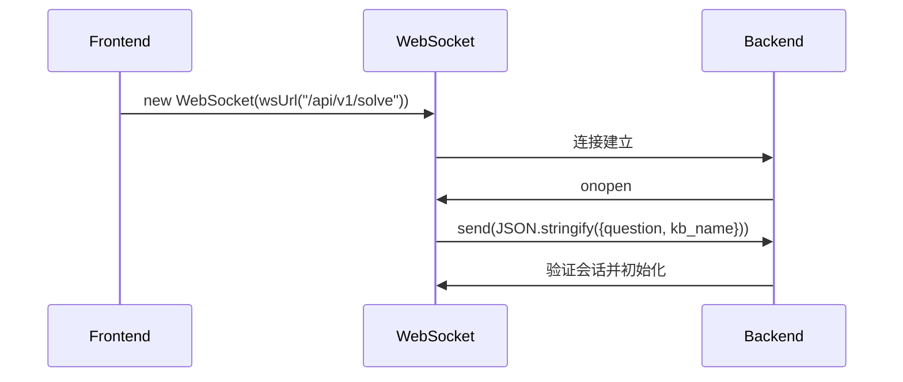

**Diagram sources**
- [GlobalContext.tsx](file://web/context/GlobalContext.tsx#L350-L355)
- [GlobalContext.tsx](file://web/context/GlobalContext.tsx#L529-L544)
- [GlobalContext.tsx](file://web/context/GlobalContext.tsx#L1177-L1189)

**Section sources**
- [api.ts](file://web/lib/api.ts#L1-L59)
- [GlobalContext.tsx](file://web/context/GlobalContext.tsx#L287-L1330)

## 实时通信消息协议

### 消息结构设计
系统定义了统一的WebSocket消息结构，包含`type`字段标识消息类型，以及`payload`携带具体数据。`question.ts`和`research.ts`中的`QuestionEvent`和`ResearchEvent`接口定义了消息的类型系统。

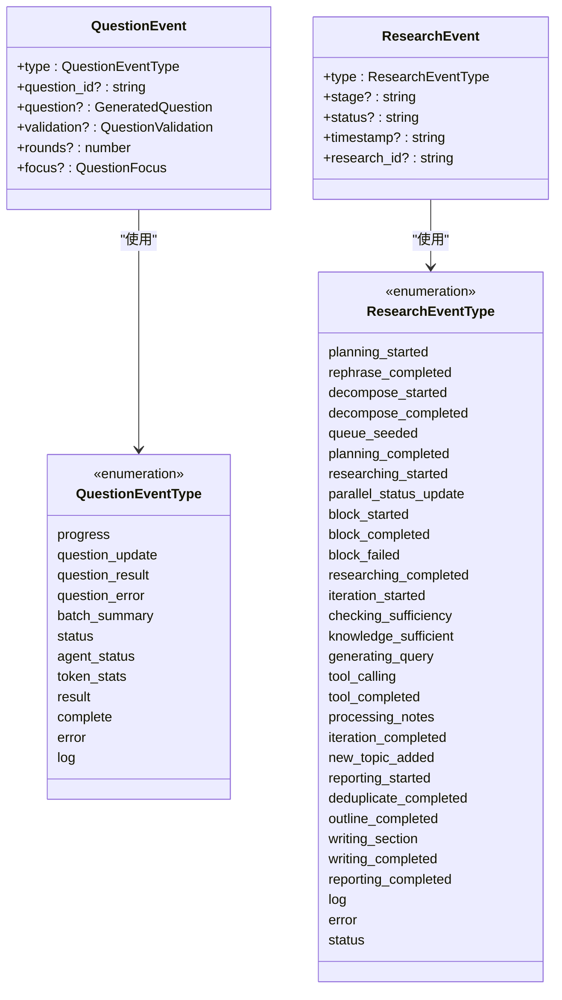

**Diagram sources**
- [types/question.ts](file://web/types/question.ts#L166-L230)
- [types/research.ts](file://web/types/research.ts#L112-L161)

### 研究进度协议
研究模块使用`ResearchEvent`消息实时更新进度。`research/page.tsx`中的`startResearchLocal`函数监听WebSocket消息，并根据`type`字段分发到`useResearchReducer`进行状态更新。

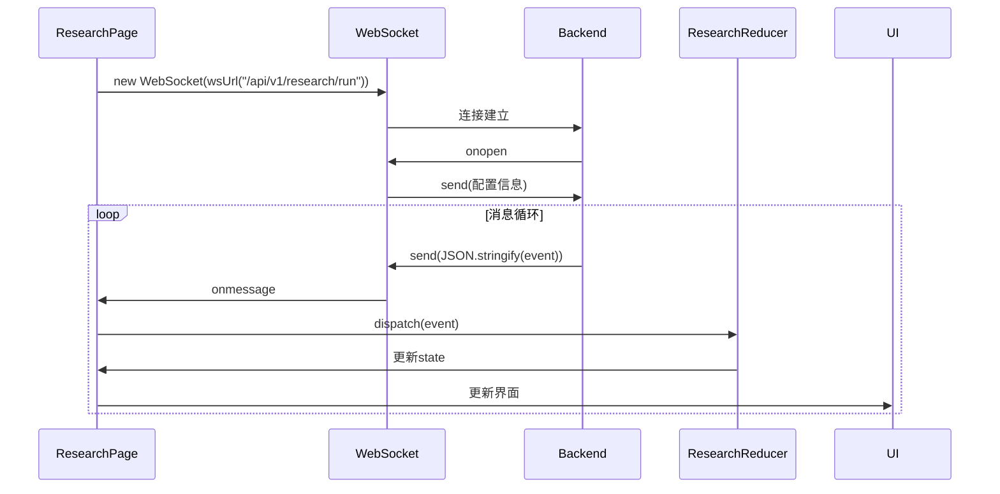

**Diagram sources**
- [research/page.tsx](file://web/app/research/page.tsx#L135-L205)
- [useResearchReducer.ts](file://web/hooks/useResearchReducer.ts#L75-L547)

### 解题状态协议
解题模块使用`QuestionEvent`消息实时更新生成状态。`question/page.tsx`中的`handleStart`函数触发生成流程，`useQuestionReducer`处理`question_update`、`question_result`等事件。

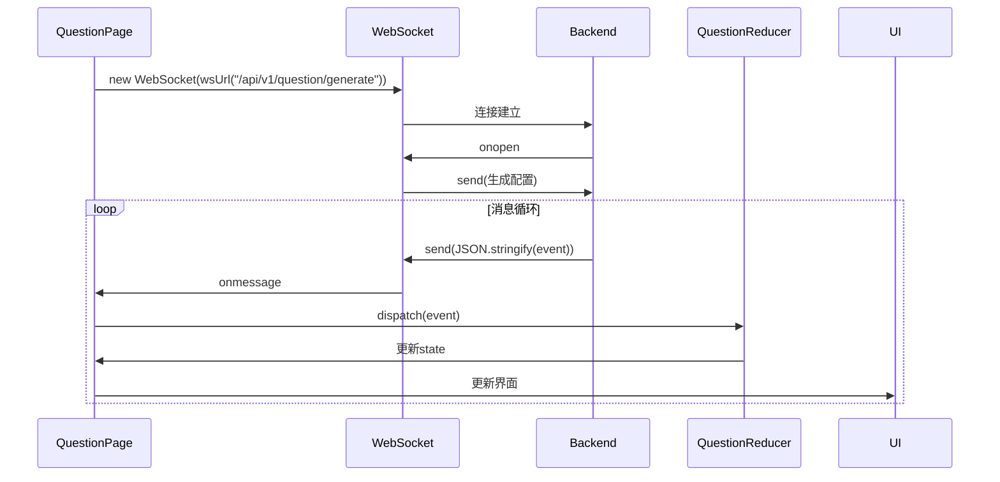

**Diagram sources**
- [question/page.tsx](file://web/app/question/page.tsx#L84-L109)
- [useQuestionReducer.ts](file://web/hooks/useQuestionReducer.ts#L65-L418)

**Section sources**
- [types/question.ts](file://web/types/question.ts#L166-L230)
- [types/research.ts](file://web/types/research.ts#L112-L161)
- [question/page.tsx](file://web/app/question/page.tsx#L84-L109)
- [research/page.tsx](file://web/app/research/page.tsx#L135-L205)
- [useQuestionReducer.ts](file://web/hooks/useQuestionReducer.ts#L65-L418)
- [useResearchReducer.ts](file://web/hooks/useResearchReducer.ts#L75-L547)

## 辅助服务集成

### 国际化服务(i18n.ts)
`i18n.ts`文件定义了多语言翻译系统，支持英语(en)和中文(zh)。`getTranslation`函数根据当前语言和键名返回对应的翻译文本。

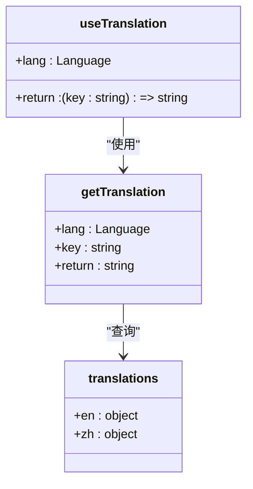

**Diagram sources**
- [i18n.ts](file://web/lib/i18n.ts#L1-L211)

### LaTeX处理服务(latex.ts)
`latex.ts`文件提供LaTeX格式转换功能，将`\( ... \)`和`\[ ... \]`格式转换为`$ ... $`和`$$ ... $$`，以兼容`remark-math`渲染器。

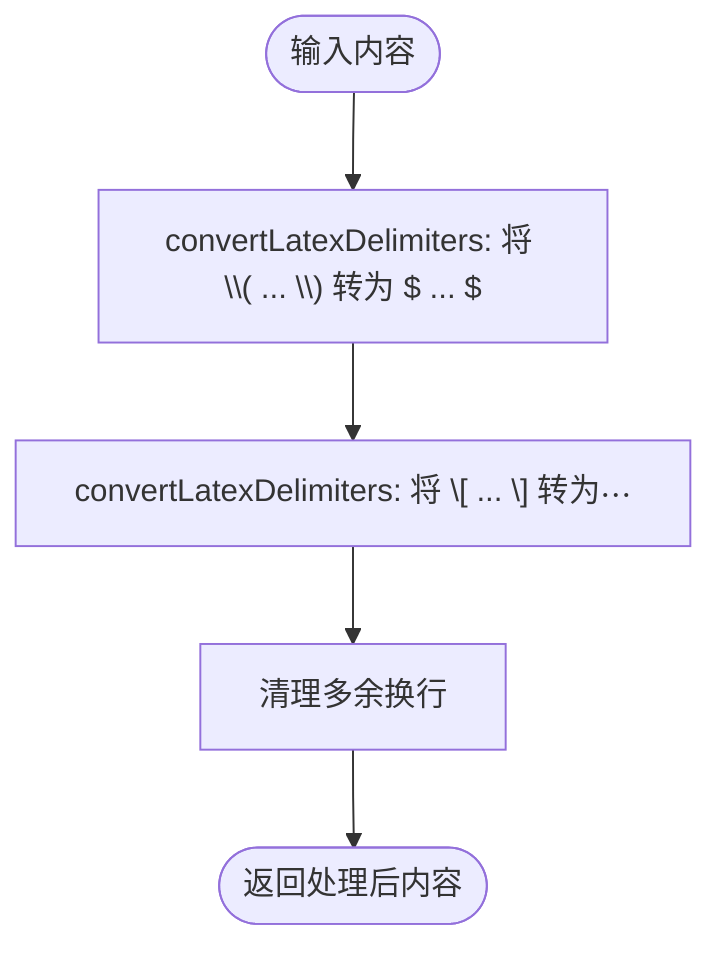

**Diagram sources**
- [latex.ts](file://web/lib/latex.ts#L16-L37)

### PDF导出服务(pdfExport.ts)
`pdfExport.ts`文件实现HTML到PDF的转换，处理SVG图像、分页和页码。`exportToPdf`函数是主要入口，`convertSvgsToImages`和`splitCanvasIntoPages`是关键辅助函数。

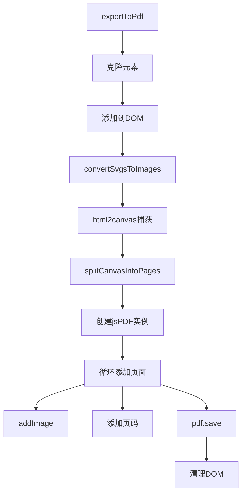

**Diagram sources**
- [pdfExport.ts](file://web/lib/pdfExport.ts#L187-L278)

**Section sources**
- [i18n.ts](file://web/lib/i18n.ts#L1-L211)
- [latex.ts](file://web/lib/latex.ts#L1-L56)
- [pdfExport.ts](file://web/lib/pdfExport.ts#L1-L310)

## API调用序列图

### 问题生成API调用流程
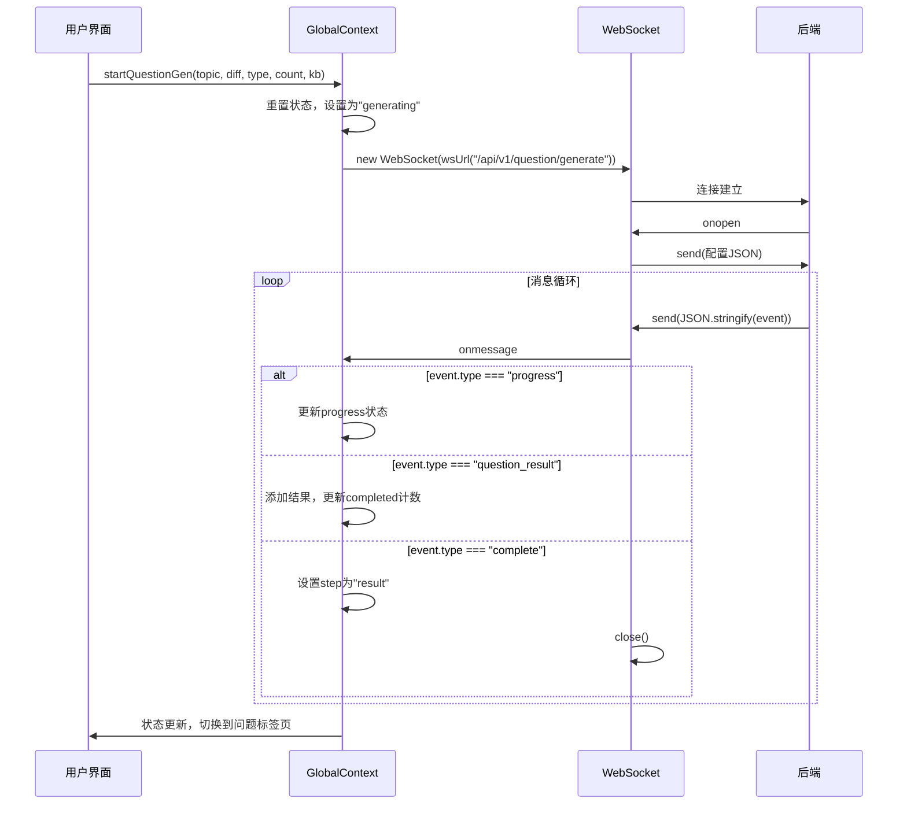

**Diagram sources**
- [GlobalContext.tsx](file://web/context/GlobalContext.tsx#L486-L780)
- [question/page.tsx](file://web/app/question/page.tsx#L84-L109)

### 研究API调用流程
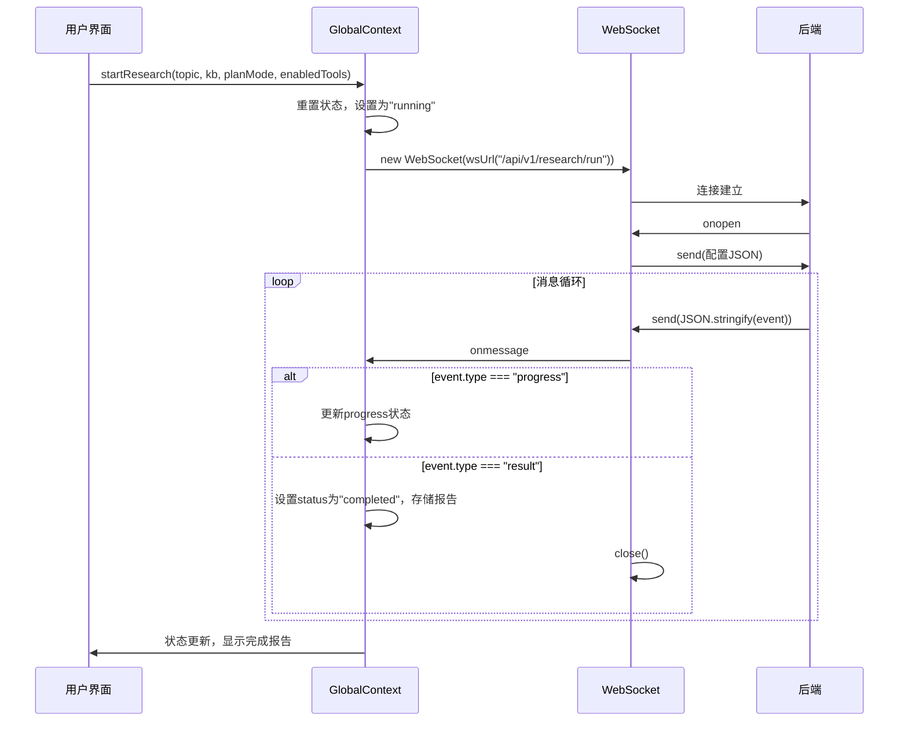

**Diagram sources**
- [GlobalContext.tsx](file://web/context/GlobalContext.tsx#L1136-L1297)
- [research/page.tsx](file://web/app/research/page.tsx#L129-L205)

## 错误处理流程图

### WebSocket错误处理
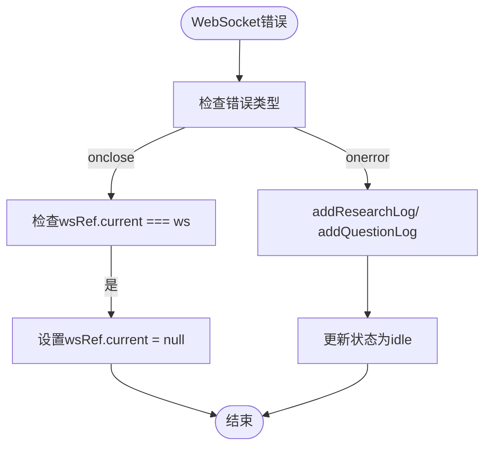

**Diagram sources**
- [GlobalContext.tsx](file://web/context/GlobalContext.tsx#L1277-L1296)

### RESTful API错误处理
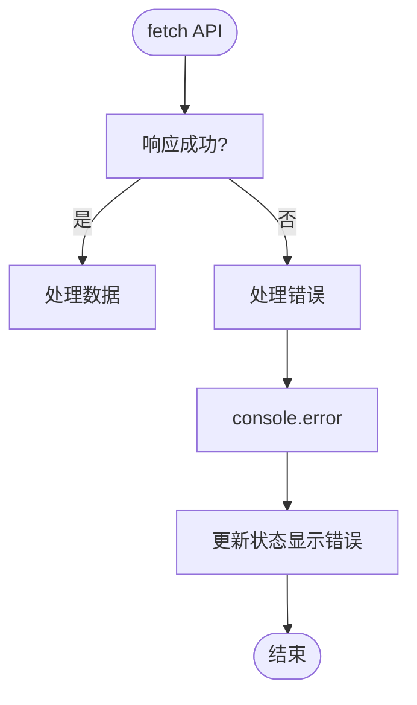

**Diagram sources**
- [question/page.tsx](file://web/app/question/page.tsx#L70-L82)
- [research/page.tsx](file://web/app/research/page.tsx#L80-L94)

## 性能监控与最佳实践

### 请求节流与缓存
系统通过`GlobalContext`中的`refreshSettings`函数实现配置的缓存，避免重复请求。对于频繁的API调用，建议在`useEffect`中添加依赖数组，防止不必要的重复调用。

### 性能监控
系统通过`tokenStats`对象监控API调用的成本和性能。`GlobalContext`中的`addQuestionLog`和`addResearchLog`函数记录详细的日志，可用于性能分析。

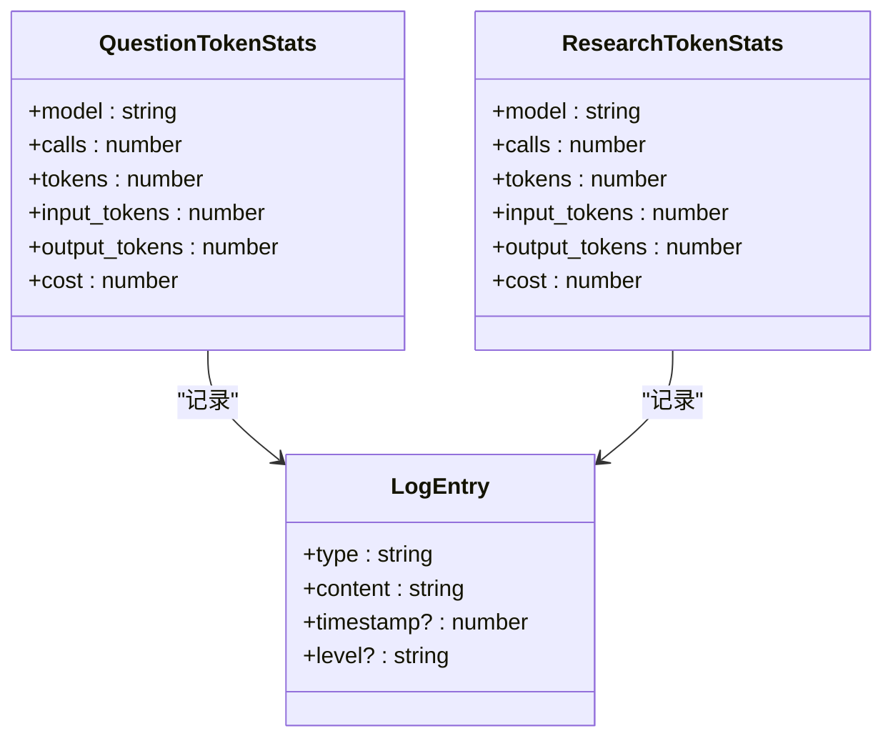

**Diagram sources**
- [GlobalContext.tsx](file://web/context/GlobalContext.tsx#L99-L106)
- [GlobalContext.tsx](file://web/context/GlobalContext.tsx#L31-L39)

### 最佳实践指南
1. **环境变量管理**: 所有API基础URL通过`NEXT_PUBLIC_API_BASE`环境变量配置，确保开发和生产环境的隔离。
2. **错误处理**: 所有WebSocket连接都实现了`onerror`和`onclose`处理，确保连接异常时能正确清理状态。
3. **状态同步**: 使用`useReducer`和`useState`进行状态管理，确保UI与API响应保持同步。
4. **资源清理**: WebSocket连接关闭时，及时清理`wsRef.current`引用，防止内存泄漏。

**Section sources**
- [GlobalContext.tsx](file://web/context/GlobalContext.tsx#L259-L280)
- [GlobalContext.tsx](file://web/context/GlobalContext.tsx#L1277-L1296)

## 结论
本系统通过精心设计的API集成架构，实现了高效、可靠的前后端通信。RESTful API用于常规数据操作，WebSocket用于实时进度更新。消息协议设计清晰，辅助服务集成完善，为用户提供流畅的交互体验。遵循本文档的最佳实践，可确保系统的稳定性和可维护性。