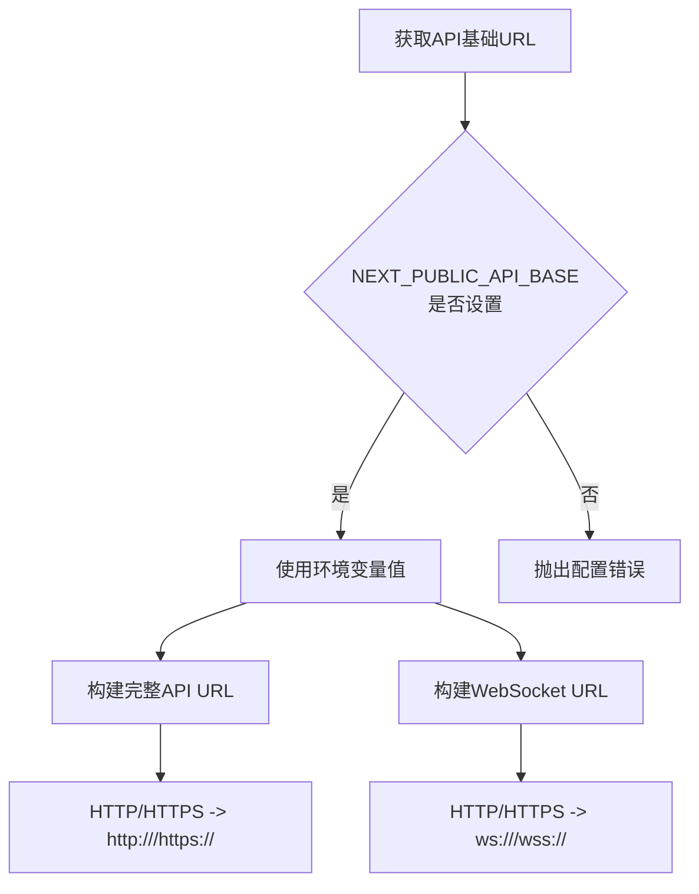
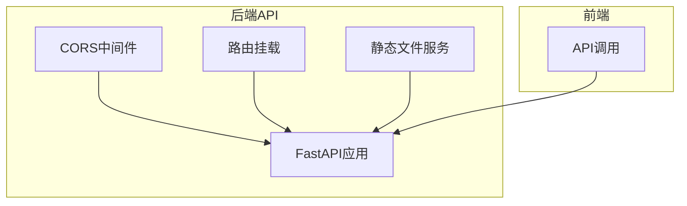
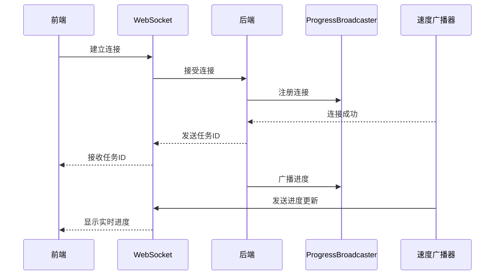
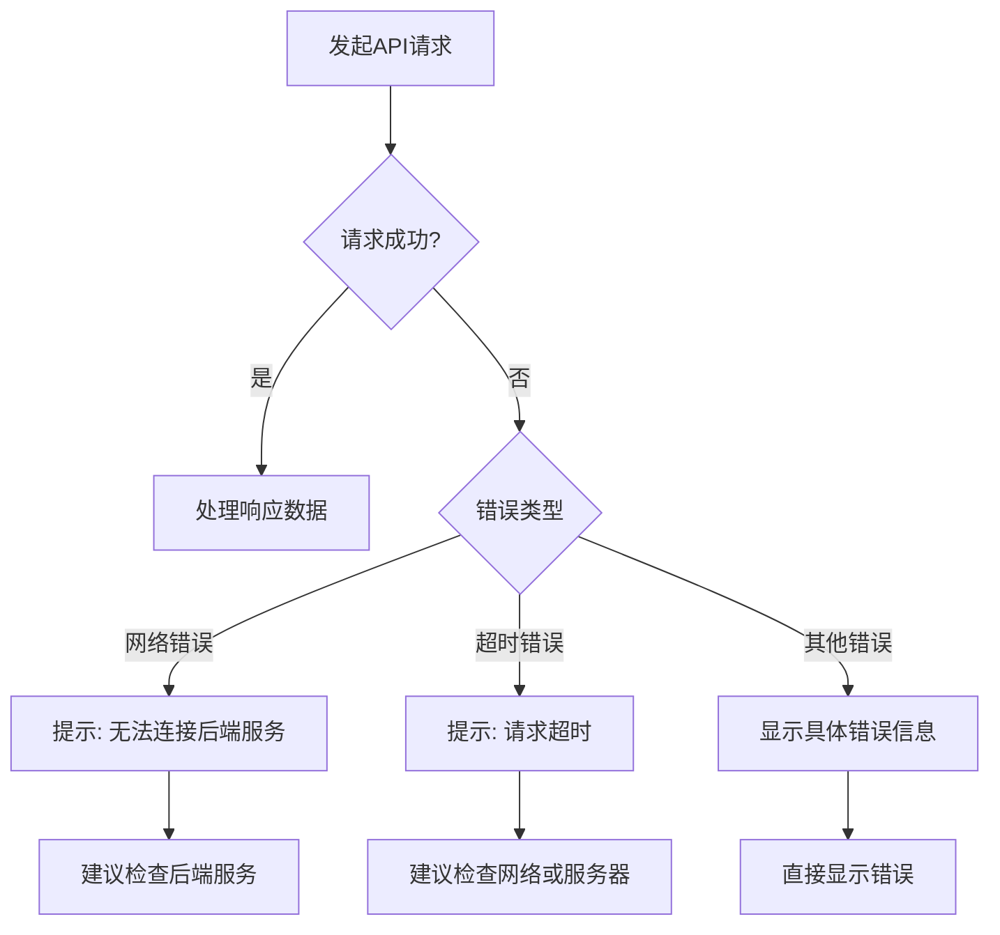
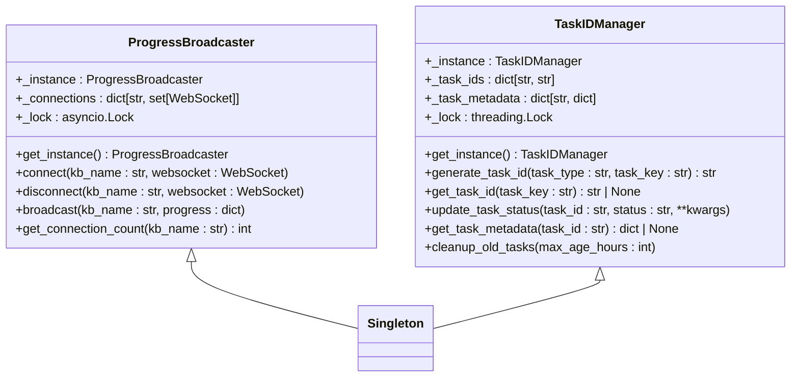
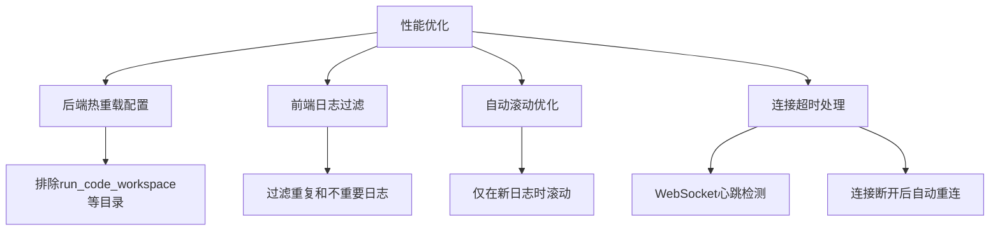
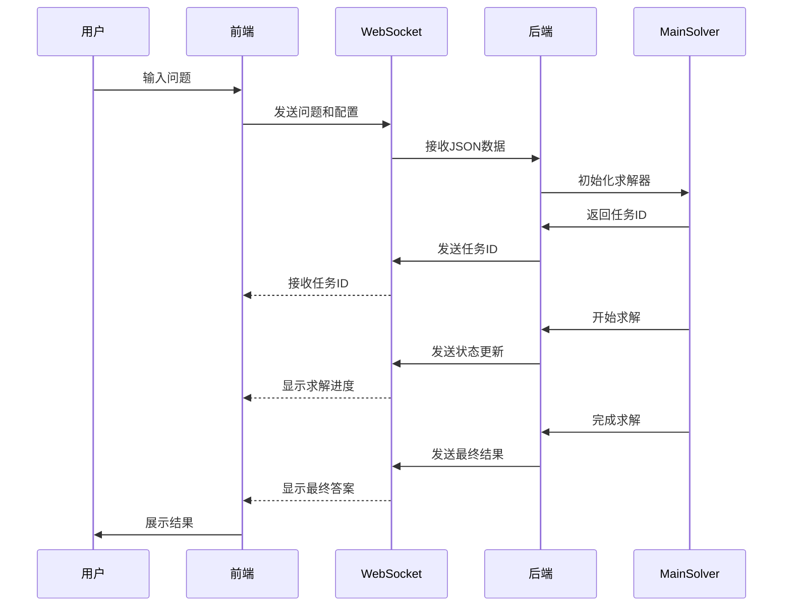

# 核心API集成

<cite>
**本文档引用的文件**   
- [api.ts](file://web/lib/api.ts)
- [main.py](file://src/api/main.py)
- [solve.py](file://src/api/routers/solve.py)
- [research.py](file://src/api/routers/research.py)
- [knowledge.py](file://src/api/routers/knowledge.py)
- [progress_broadcaster.py](file://src/api/utils/progress_broadcaster.py)
- [task_id_manager.py](file://src/api/utils/task_id_manager.py)
- [history.py](file://src/api/utils/history.py)
- [solver/page.tsx](file://web/app/solver/page.tsx)
- [research/page.tsx](file://web/app/research/page.tsx)
</cite>

## 目录
1. [API基础配置与工具函数](#api基础配置与工具函数)
2. [RESTful API设计与前后端契约](#restful-api设计与前后端契约)
3. [WebSocket客户端封装与实时通信](#websocket客户端封装与实时通信)
4. [请求拦截、认证与错误处理](#请求拦截认证与错误处理)
5. [连接管理与恢复机制](#连接管理与恢复机制)
6. [性能优化与超时处理](#性能优化与超时处理)
7. [API调用示例与序列图](#api调用示例与序列图)
8. [总结](#总结)

## API基础配置与工具函数

`web/lib/api.ts` 文件提供了API基础配置和工具函数，用于构建完整的API和WebSocket URL。API基础URL通过环境变量 `NEXT_PUBLIC_API_BASE` 获取，该变量由 `start_web.py` 脚本根据 `config/main.yaml` 中的配置自动生成。如果未正确配置，系统会抛出错误并提示用户检查配置。

**代码片段路径**
- [api.ts](file://web/lib/api.ts#L6-L22)

## RESTful API设计与前后端契约

后端API通过FastAPI框架实现，`src/api/main.py` 定义了应用的生命周期和路由配置。所有API路由均通过 `app.include_router()` 方法挂载，并遵循统一的版本控制前缀 `/api/v1`。CORS（跨域资源共享）已配置为允许所有来源，生产环境中应限制为特定前端域名。

**代码片段路径**
- [main.py](file://src/api/main.py#L39-L80)

## WebSocket客户端封装与实时通信

WebSocket连接用于实现实时通信，支持问题求解、研究流程等长时间运行任务的进度更新。`api.ts` 中的 `wsUrl()` 函数将HTTP协议转换为WS协议，确保WebSocket连接的正确建立。后端通过 `ProgressBroadcaster` 类管理WebSocket连接，实现进度广播。

**代码片段路径**
- [api.ts](file://web/lib/api.ts#L47-L58)
- [progress_broadcaster.py](file://src/api/utils/progress_broadcaster.py#L11-L73)

## 请求拦截、认证与错误处理

API请求的统一拦截和错误处理机制确保了系统的稳定性和用户体验。前端在调用API时会进行错误捕获，根据错误类型显示不同的提示信息。例如，网络连接错误会提示用户检查后端服务是否运行，超时错误会建议检查网络连接或服务器负载。

**代码片段路径**
- [CoMarkerEditor.tsx](file://web/components/CoMarkerEditor.tsx#L808-L844)
- [CoWriterEditor.tsx](file://web/components/CoWriterEditor.tsx#L808-L844)

## 连接管理与恢复机制

WebSocket连接管理包括连接建立、消息广播和异常断开处理。`ProgressBroadcaster` 类使用线程锁确保多连接操作的线程安全，当连接异常断开时，系统会自动清理连接并移除对应的WebSocket实例。此外，系统还实现了任务ID管理器，为每个后台任务分配唯一ID，便于状态跟踪和管理。

**代码片段路径**
- [progress_broadcaster.py](file://src/api/utils/progress_broadcaster.py#L11-L73)
- [task_id_manager.py](file://src/api/utils/task_id_manager.py#L11-L103)

## 性能优化与超时处理

系统通过多种机制优化性能和处理超时情况。后端配置了Uvicorn服务器的热重载功能，但排除了代码执行工作区等目录，避免文件监控触发不必要的服务重启。前端通过自动滚动和日志过滤优化了大量日志输出的显示性能。对于长时间运行的任务，系统实现了超时处理和连接恢复机制。

**代码片段路径**
- [main.py](file://src/api/main.py#L107-L128)
- [solver/page.tsx](file://web/app/solver/page.tsx#L95-L128)

## API调用示例与序列图

以下是一个典型的问题求解API调用序列图，展示了从用户输入问题到获取最终答案的完整流程。

**代码片段路径**
- [solve.py](file://src/api/routers/solve.py#L34-L294)
- [solver/page.tsx](file://web/app/solver/page.tsx#L129-L166)

## 总结

本系统通过精心设计的RESTful API和WebSocket通信机制，实现了前后端的高效协作。API基础配置确保了服务的可配置性和灵活性，WebSocket实时通信支持了长时间运行任务的进度更新。统一的错误处理和连接管理机制提高了系统的稳定性和用户体验。前后端通过明确定义的契约保持一致性，确保了系统的可靠运行。

**代码片段路径**
- [api.ts](file://web/lib/api.ts)
- [main.py](file://src/api/main.py)
- [solve.py](file://src/api/routers/solve.py)
- [research.py](file://src/api/routers/research.py)
- [knowledge.py](file://src/api/routers/knowledge.py)