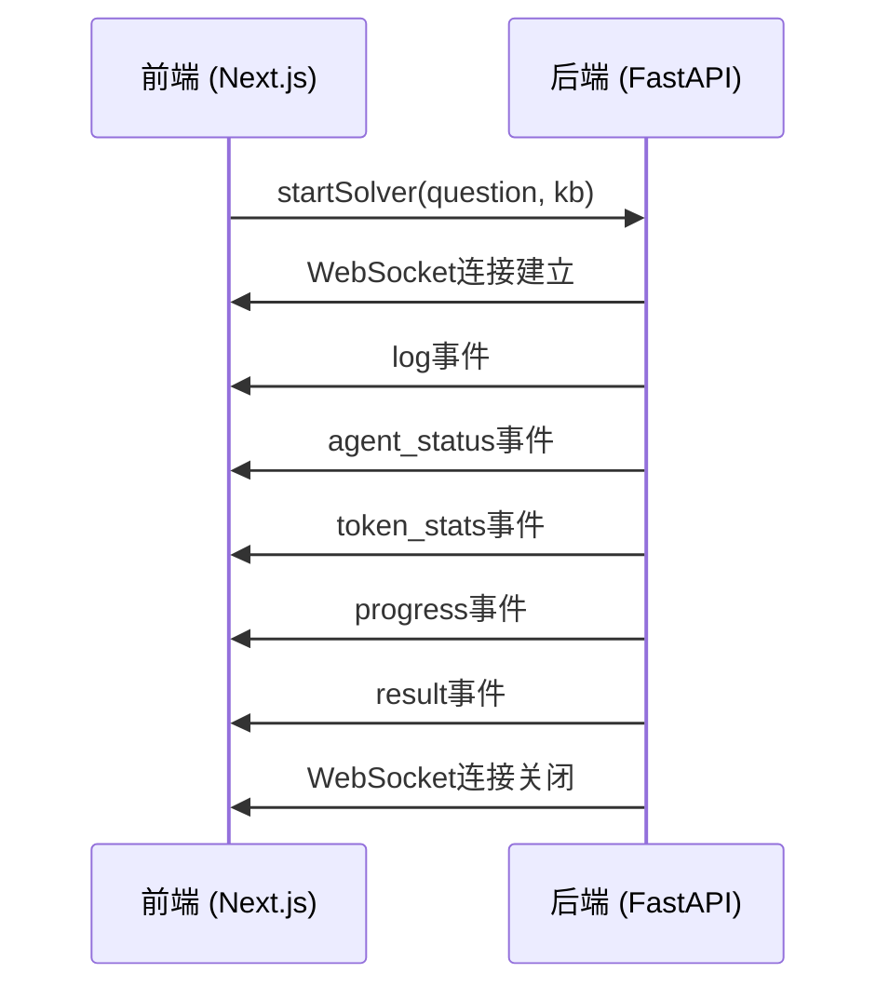

# 前端架构

<cite>
**本文档引用的文件**
- [layout.tsx](file://web/app/layout.tsx)
- [GlobalContext.tsx](file://web/context/GlobalContext.tsx)
- [api.ts](file://web/lib/api.ts)
- [page.tsx](file://web/app/page.tsx)
- [Sidebar.tsx](file://web/components/Sidebar.tsx)
- [useQuestionReducer.ts](file://web/hooks/useQuestionReducer.ts)
- [useResearchReducer.ts](file://web/hooks/useResearchReducer.ts)
- [question.ts](file://web/types/question.ts)
- [research.ts](file://web/types/research.ts)
- [Button.tsx](file://web/components/ui/Button.tsx)
- [Modal.tsx](file://web/components/ui/Modal.tsx)
- [globals.css](file://web/app/globals.css)
- [tailwind.config.js](file://web/tailwind.config.js)
- [next.config.js](file://web/next.config.js)
</cite>

## 目录
1. [简介](#简介)
2. [项目结构](#项目结构)
3. [页面路由](#页面路由)
4. [组件结构](#组件结构)
5. [状态管理](#状态管理)
6. [API客户端](#api客户端)
7. [前端与后端交互模式](#前端与后端交互模式)
8. [技术决策](#技术决策)
9. [可扩展性考虑](#可扩展性考虑)
10. [响应式设计与用户体验](#响应式设计与用户体验)
11. [横切关注点](#横切关注点)
12. [架构图](#架构图)

## 简介
DeepTutor是一个基于Next.js的多智能体教学与研究助手平台，提供问题求解、题目生成、深度研究等多种功能。本架构文档详细描述了前端系统的整体设计，包括基于Next.js的页面路由、组件组织结构、全局状态管理（GlobalContext）、API客户端设计，以及前端与后端通过WebSocket和RESTful API进行实时通信的实现机制。

## 项目结构
DeepTutor前端项目位于`web/`目录下，采用标准的Next.js应用结构。核心目录包括：
- `app/`：基于Next.js App Router的页面路由
- `components/`：可复用的UI组件
- `context/`：React上下文提供程序，用于全局状态管理
- `hooks/`：自定义React Hook
- `lib/`：工具函数和API客户端
- `types/`：TypeScript类型定义
- `ui/`：基础UI组件库

**Section sources**
- [layout.tsx](file://web/app/layout.tsx)
- [page.tsx](file://web/app/page.tsx)

## 页面路由
前端采用Next.js 13+的App Router模式，通过文件系统实现路由。每个功能模块对应一个独立的页面目录，如`solver/`、`question/`、`research/`等。根布局文件`app/layout.tsx`定义了全局布局，包含侧边栏和主内容区域，所有页面共享此布局。

路由结构清晰地反映了应用的功能划分：
- `/`：仪表板页面
- `/solver`：智能求解器
- `/question`：题目生成器
- `/research`：深度研究
- `/ideagen`：创意生成
- `/co_writer`：协同写作
- `/guide`：引导学习
- `/knowledge`：知识库管理
- `/notebook`：笔记本
- `/settings`：设置

**Section sources**
- [layout.tsx](file://web/app/layout.tsx)
- [page.tsx](file://web/app/page.tsx)

## 组件结构
前端组件采用分层架构设计，主要分为：
1. **布局组件**：`Sidebar.tsx`提供导航侧边栏，`layout.tsx`定义全局布局
2. **页面组件**：位于`app/`目录下的各个`page.tsx`文件
3. **功能组件**：位于`components/`目录，按功能模块组织，如`question/`、`research/`
4. **UI组件**：位于`components/ui/`的基础组件库，如`Button.tsx`、`Modal.tsx`

组件间通过props和上下文进行通信，遵循单向数据流原则。UI组件设计为无状态或受控组件，便于复用和测试。

**Section sources**
- [Sidebar.tsx](file://web/components/Sidebar.tsx)
- [Button.tsx](file://web/components/ui/Button.tsx)
- [Modal.tsx](file://web/components/ui/Modal.tsx)

## 状态管理
前端采用React Context API实现全局状态管理，核心是`GlobalContext.tsx`中定义的`GlobalProvider`。该上下文管理多个功能模块的状态，包括：
- `solverState`：求解器状态
- `questionState`：题目生成状态
- `researchState`：研究状态
- `ideaGenState`：创意生成状态
- `uiSettings`：UI设置（主题、语言）

每个状态对象包含数据、进度信息、日志和令牌统计等。通过`useGlobal` Hook在组件中访问全局状态。对于复杂的状态逻辑，还使用了`useReducer` Hook，如`useQuestionReducer`和`useResearchReducer`，将状态更新逻辑集中管理。

**Section sources**
- [GlobalContext.tsx](file://web/context/GlobalContext.tsx)
- [useQuestionReducer.ts](file://web/hooks/useQuestionReducer.ts)
- [useResearchReducer.ts](file://web/hooks/useResearchReducer.ts)

## API客户端
API客户端位于`lib/api.ts`，提供了两个核心函数：
- `apiUrl(path)`：构造RESTful API的完整URL
- `wsUrl(path)`：构造WebSocket API的完整URL

这些函数从环境变量`NEXT_PUBLIC_API_BASE`获取基础URL，确保前后端通信的灵活性。API客户端封装了URL构造逻辑，使组件代码更简洁。前端通过fetch API调用RESTful接口，通过WebSocket API实现与后端的实时双向通信。

**Section sources**
- [api.ts](file://web/lib/api.ts)

## 前端与后端交互模式
前端与后端的交互主要通过两种模式：
1. **RESTful API**：用于获取静态数据，如仪表板数据、笔记本统计等。在`page.tsx`中使用fetch API调用。
2. **WebSocket API**：用于实时通信，如求解器、题目生成、研究等长时间运行的任务。前端创建WebSocket连接，监听来自后端的实时进度更新。

在`GlobalContext.tsx`中，每个功能模块都有独立的WebSocket连接（如`solverWs`、`questionWs`）。当启动一个任务时，前端建立WebSocket连接，发送初始请求，然后监听来自后端的各种事件，如日志、代理状态、令牌统计、进度更新和结果。这种设计实现了服务器发送事件（SSE）的效果，提供了实时的用户体验。

**Section sources**
- [GlobalContext.tsx](file://web/context/GlobalContext.tsx)
- [page.tsx](file://web/app/page.tsx)

## 技术决策
### 样式设计
采用Tailwind CSS进行样式设计，结合CSS变量实现主题切换。`globals.css`中定义了明暗两种主题的颜色变量，`tailwind.config.js`中扩展了主题以使用这些变量。这种设计使得主题切换简单高效，只需切换`dark`类即可。

### React组件组织
组件按功能模块组织，每个模块有自己的子目录。基础UI组件（如Button、Modal）位于`components/ui/`，通过props支持多种变体和大小。组件设计遵循单一职责原则，保持小而专注。

### Next.js特性应用
- **App Router**：使用最新的App Router模式，支持服务器组件和流式渲染。
- **SSR/SSG**：利用Next.js的服务器端渲染和静态生成特性，提高首屏加载速度和SEO。
- **Client Components**：在需要交互的地方使用`"use client"`指令，实现水合（hydration）。

**Section sources**
- [globals.css](file://web/app/globals.css)
- [tailwind.config.js](file://web/tailwind.config.js)
- [next.config.js](file://web/next.config.js)

## 可扩展性考虑
前端架构设计考虑了良好的可扩展性：
1. **模块化设计**：每个功能模块独立，易于添加新功能。
2. **类型安全**：使用TypeScript定义清晰的接口和类型，如`question.ts`和`research.ts`中的状态和事件类型。
3. **状态管理分离**：复杂状态逻辑使用reducer分离，便于维护和测试。
4. **API抽象**：API客户端抽象了URL构造，便于后端API变更。

这种设计使得添加新功能模块（如新的智能体）变得简单，只需添加相应的页面、组件和状态管理逻辑即可。

**Section sources**
- [question.ts](file://web/types/question.ts)
- [research.ts](file://web/types/research.ts)

## 响应式设计与用户体验
前端采用响应式设计，适配不同屏幕尺寸。侧边栏在小屏幕上可折叠，主内容区域使用Flexbox布局。用户体验优化策略包括：
- **实时反馈**：通过WebSocket提供实时进度更新，让用户了解任务状态。
- **加载状态**：组件显示加载状态，避免空白屏幕。
- **错误处理**：捕获并显示错误信息，提供友好的错误提示。
- **动画效果**：使用CSS动画（如`animate-fade-in`）提升用户体验。

**Section sources**
- [Sidebar.tsx](file://web/components/Sidebar.tsx)
- [globals.css](file://web/app/globals.css)

## 横切关注点
### 安全性
- **环境变量**：API基础URL通过环境变量配置，避免硬编码。
- **输入验证**：在组件层面进行基本的输入验证。
- **CORS**：后端负责处理CORS策略。

### 性能监控
- **WebSocket状态**：通过WebSocket连接状态监控后端服务可用性。
- **错误日志**：前端捕获并记录错误，便于调试。

### 错误处理
前端实现了全面的错误处理机制：
- **网络错误**：捕获fetch和WebSocket错误，显示友好的错误消息。
- **状态重置**：在错误发生时重置相关状态，避免应用卡在错误状态。
- **用户反馈**：通过UI组件（如Modal）向用户反馈错误信息。

**Section sources**
- [GlobalContext.tsx](file://web/context/GlobalContext.tsx)
- [page.tsx](file://web/app/page.tsx)

## 架构图

```mermaid
graph TD
subgraph "前端 (Next.js)"
A[页面组件] --> B[布局组件]
B --> C[功能组件]
C --> D[UI组件]
A --> E[全局状态]
E --> F[GlobalContext]
A --> G[API客户端]
G --> H[REST API]
G --> I[WebSocket]
end
subgraph "后端 (FastAPI)"
J[API路由] --> K[智能体]
H < --> J
I < --> J
end
style A fill:#4A90E2,stroke:#333
style B fill:#50E3C2,stroke:#333
style C fill:#B8E986,stroke:#333
style D fill:#F5A623,stroke:#333
style E fill:#9013FE,stroke:#333
style F fill:#9013FE,stroke:#333
style G fill:#4A90E2,stroke:#333
style H fill:#4A90E2,stroke:#333
style I fill:#4A90E2,stroke:#333
style J fill:#D0021B,stroke:#333
style K fill:#BD10E0,stroke:#333
```

**Diagram sources**
- [layout.tsx](file://web/app/layout.tsx)
- [GlobalContext.tsx](file://web/context/GlobalContext.tsx)
- [api.ts](file://web/lib/api.ts)

```mermaid
classDiagram
class GlobalContext {
+solverState : SolverState
+questionState : QuestionState
+researchState : ResearchState
+ideaGenState : IdeaGenState
+uiSettings : UISettings
+setSolverState()
+setQuestionState()
+setResearchState()
+setIdeaGenState()
+refreshSettings()
+startSolver()
+startQuestionGen()
+startMimicQuestionGen()
+startResearch()
}
class SolverState {
+isSolving : boolean
+logs : LogEntry[]
+messages : ChatMessage[]
+question : string
+selectedKb : string
+agentStatus : AgentStatus
+tokenStats : TokenStats
+progress : ProgressInfo
}
class QuestionState {
+step : "config" | "generating" | "result"
+mode : "knowledge" | "mimic"
+logs : LogEntry[]
+results : any[]
+topic : string
+difficulty : string
+type : string
+count : number
+selectedKb : string
+progress : QuestionProgressInfo
+agentStatus : QuestionAgentStatus
+tokenStats : QuestionTokenStats
+uploadedFile : File | null
+paperPath : string
}
class ResearchState {
+status : "idle" | "running" | "completed"
+logs : LogEntry[]
+report : string | null
+topic : string
+selectedKb : string
+progress : ResearchProgress
}
class IdeaGenState {
+isGenerating : boolean
+generationStatus : string
+generatedIdeas : ResearchIdea[]
+progress : { current : number; total : number } | null
}
GlobalContext --> SolverState
GlobalContext --> QuestionState
GlobalContext --> ResearchState
GlobalContext --> IdeaGenState
```

**Diagram sources**
- [GlobalContext.tsx](file://web/context/GlobalContext.tsx)



**Diagram sources**
- [GlobalContext.tsx](file://web/context/GlobalContext.tsx)