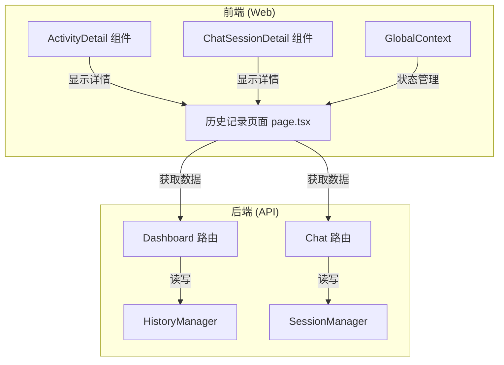
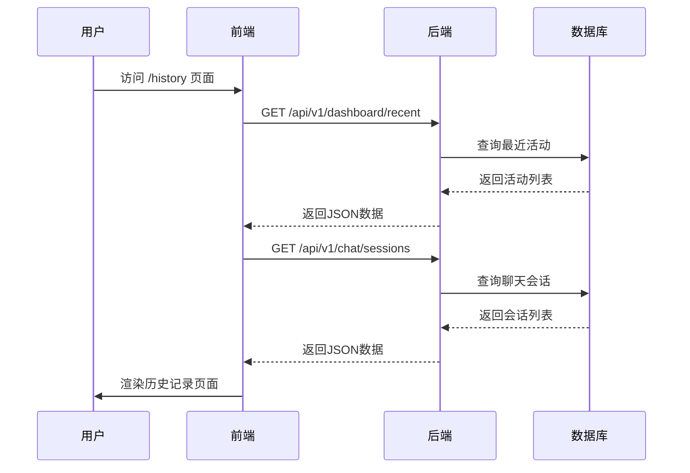
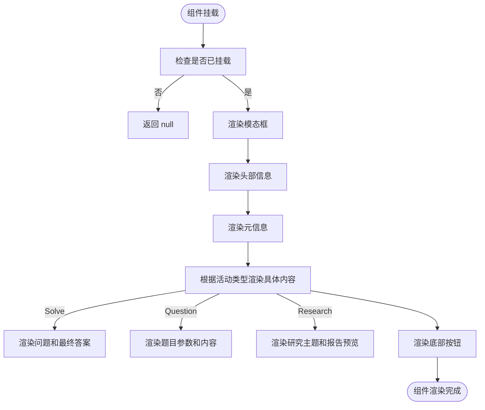
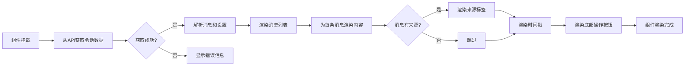
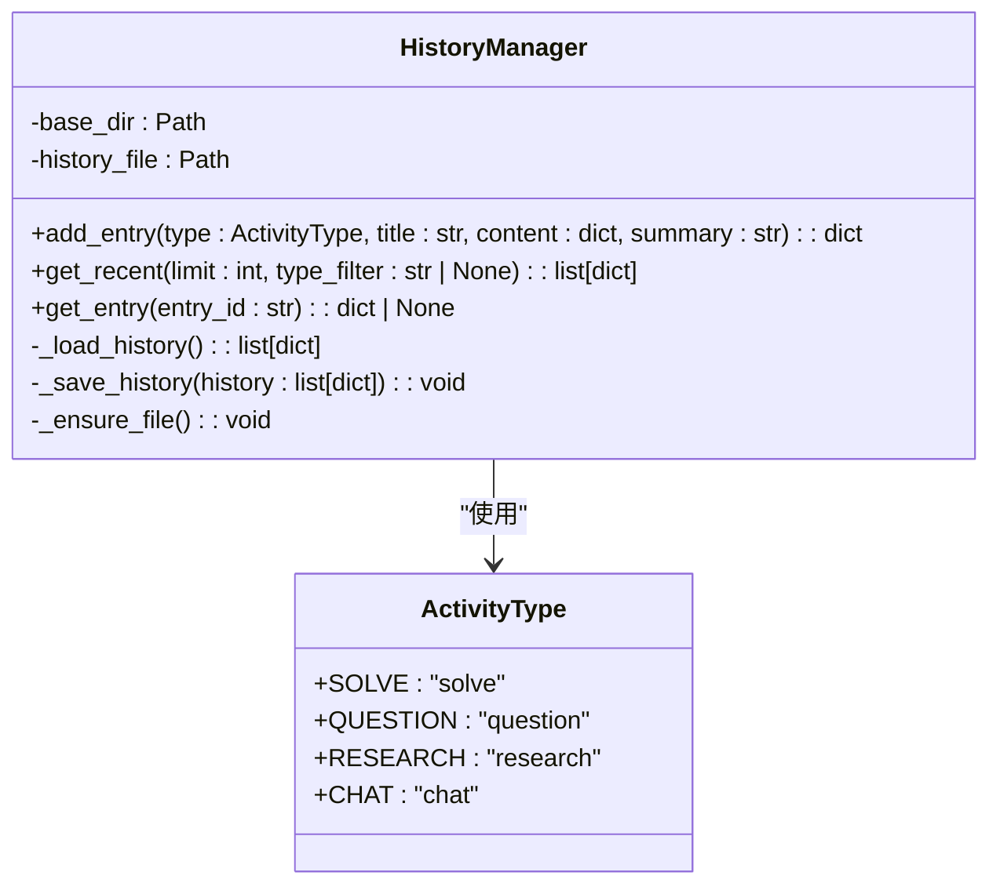
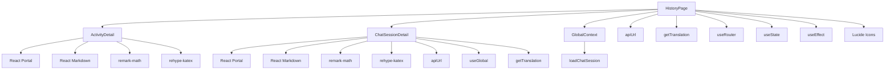

# 历史记录页面

<cite>
**本文档中引用的文件**   
- [page.tsx](file://web/app/history/page.tsx)
- [ActivityDetail.tsx](file://web/components/ActivityDetail.tsx)
- [ChatSessionDetail.tsx](file://web/components/ChatSessionDetail.tsx)
- [GlobalContext.tsx](file://web/context/GlobalContext.tsx)
- [history.py](file://src/api/utils/history.py)
- [chat.py](file://src/api/routers/chat.py)
- [session_manager.py](file://src/agents/chat/session_manager.py)
- [api.ts](file://web/lib/api.ts)
- [i18n.ts](file://web/lib/i18n.ts)
</cite>

## 目录
1. [简介](#简介)
2. [项目结构](#项目结构)
3. [核心组件](#核心组件)
4. [架构概述](#架构概述)
5. [详细组件分析](#详细组件分析)
6. [依赖分析](#依赖分析)
7. [性能考虑](#性能考虑)
8. [故障排除指南](#故障排除指南)
9. [结论](#结论)

## 简介
历史记录页面是 DeepTutor 应用程序中的一个核心功能模块，为用户提供了一个集中查看和管理所有学习活动历史的界面。该页面不仅展示了用户在解题、生成题目、深度研究等模块中的操作记录，还提供了对聊天会话历史的完整管理。通过直观的UI设计和强大的后端支持，用户可以轻松地回顾过去的活动、查看详细内容，并继续之前的聊天会话。本页面的设计充分考虑了用户体验，支持按类型过滤、全文搜索和多语言界面，确保了功能的易用性和可访问性。

## 项目结构
历史记录页面的实现涉及前端和后端多个组件的协同工作。前端部分主要由 Next.js 页面和 React 组件构成，负责用户界面的渲染和交互逻辑。后端部分则通过 FastAPI 提供 RESTful API 和 WebSocket 接口，处理数据的持久化和实时通信。整个系统通过清晰的分层架构，实现了前后端的解耦和高内聚。



**Diagram sources**
- [page.tsx](file://web/app/history/page.tsx)
- [history.py](file://src/api/utils/history.py)
- [chat.py](file://src/api/routers/chat.py)

## 核心组件
历史记录页面的核心功能由几个关键组件共同实现。`HistoryPage` 组件作为页面的入口点，负责协调数据获取和UI渲染。`ActivityDetail` 和 `ChatSessionDetail` 组件用于展示活动和聊天会话的详细信息。`GlobalContext` 提供了全局状态管理，而 `HistoryManager` 和 `SessionManager` 则在后端负责数据的持久化和会话管理。

**Section sources**
- [page.tsx](file://web/app/history/page.tsx)
- [ActivityDetail.tsx](file://web/components/ActivityDetail.tsx)
- [ChatSessionDetail.tsx](file://web/components/ChatSessionDetail.tsx)
- [GlobalContext.tsx](file://web/context/GlobalContext.tsx)
- [history.py](file://src/api/utils/history.py)
- [session_manager.py](file://src/agents/chat/session_manager.py)

## 架构概述
历史记录页面采用前后端分离的架构模式。前端通过 REST API 从后端获取数据，并使用 React 的状态管理机制来更新UI。后端使用 FastAPI 框架，通过 `HistoryManager` 和 `SessionManager` 两个核心类来管理不同类型的历史记录。这种设计使得系统具有良好的可扩展性和维护性。



**Diagram sources**
- [page.tsx](file://web/app/history/page.tsx)
- [history.py](file://src/api/utils/history.py)
- [chat.py](file://src/api/routers/chat.py)

## 详细组件分析

### HistoryPage 组件分析
`HistoryPage` 组件是历史记录页面的主要实现，负责展示所有类型的历史活动和聊天会话。该组件通过 `useEffect` 钩子在挂载时获取数据，并根据用户的选择进行过滤和搜索。

#### 组件状态和逻辑
```mermaid
classDiagram
class HistoryPage {
+entries : HistoryEntry[]
+chatSessions : ChatSession[]
+loading : boolean
+selectedEntry : HistoryEntry | null
+selectedChatSession : string | null
+filterType : string
+searchQuery : string
+fetchHistory() : Promise~void~
+handleLoadChatSession(sessionId : string) : Promise~void~
+groupEntriesByDate(entries : HistoryEntry[]) : { [key : string] : HistoryEntry[] }
}
class HistoryEntry {
+id : string
+type : "solve" | "question" | "research" | "chat"
+title : string
+summary : string
+timestamp : number
+content : any
}
class ChatSession {
+session_id : string
+title : string
+message_count : number
+last_message : string
+created_at : number
+updated_at : number
}
HistoryPage --> HistoryEntry : "包含"
HistoryPage --> ChatSession : "包含"
```

**Diagram sources**
- [page.tsx](file://web/app/history/page.tsx)

**Section sources**
- [page.tsx](file://web/app/history/page.tsx)

### ActivityDetail 组件分析
`ActivityDetail` 组件用于展示非聊天类活动的详细信息，如解题、题目生成和深度研究的结果。

#### 组件逻辑流程


**Diagram sources**
- [ActivityDetail.tsx](file://web/components/ActivityDetail.tsx)

**Section sources**
- [ActivityDetail.tsx](file://web/components/ActivityDetail.tsx)

### ChatSessionDetail 组件分析
`ChatSessionDetail` 组件用于展示聊天会话的详细信息，包括完整的消息历史和会话设置。

#### 组件数据流


**Diagram sources**
- [ChatSessionDetail.tsx](file://web/components/ChatSessionDetail.tsx)

**Section sources**
- [ChatSessionDetail.tsx](file://web/components/ChatSessionDetail.tsx)

### 后端服务分析
后端服务通过 `HistoryManager` 和 `SessionManager` 两个类来管理历史记录和聊天会话。

#### 历史记录管理器类图


**Diagram sources**
- [history.py](file://src/api/utils/history.py)

**Section sources**
- [history.py](file://src/api/utils/history.py)

#### 聊天会话管理器类图
```mermaid
classDiagram
class SessionManager {
-base_dir : Path
-sessions_file : Path
+create_session(title : str, settings : dict[str, Any] | None) : dict[str, Any]
+get_session(session_id : str) : dict[str, Any] | None
+update_session(session_id : str, messages : list[dict], title : str, settings : dict) : dict[str, Any] | None
+add_message(session_id : str, role : str, content : str, sources : dict[str, Any] | None) : dict[str, Any] | None
+list_sessions(limit : int, include_messages : bool) : list[dict[str, Any]]
+delete_session(session_id : str) : bool
-_load_data() : dict[str, Any]
-_save_data(data : dict[str, Any]) : void
-_get_sessions() : list[dict[str, Any]]
-_save_sessions(sessions : list[dict[str, Any]]) : void
}
SessionManager : +session_id : str
SessionManager : +title : str
SessionManager : +messages : list[dict]
SessionManager : +settings : dict[str, Any]
SessionManager : +created_at : float
SessionManager : +updated_at : float
```

**Diagram sources**
- [session_manager.py](file://src/agents/chat/session_manager.py)

**Section sources**
- [session_manager.py](file://src/agents/chat/session_manager.py)

## 依赖分析
历史记录页面的功能实现依赖于多个前端和后端组件的协同工作。这些组件之间通过清晰的接口进行通信，形成了一个松耦合但高内聚的系统。



**Diagram sources**
- [page.tsx](file://web/app/history/page.tsx)
- [ActivityDetail.tsx](file://web/components/ActivityDetail.tsx)
- [ChatSessionDetail.tsx](file://web/components/ChatSessionDetail.tsx)

**Section sources**
- [page.tsx](file://web/app/history/page.tsx)
- [ActivityDetail.tsx](file://web/components/ActivityDetail.tsx)
- [ChatSessionDetail.tsx](file://web/components/ChatSessionDetail.tsx)

## 性能考虑
历史记录页面在设计时充分考虑了性能因素。前端通过分页和懒加载机制来减少初始加载时间，后端则通过文件系统持久化来避免数据库的复杂性。`HistoryManager` 和 `SessionManager` 都实现了文件缓存和批量写入，以减少I/O操作的频率。

**Section sources**
- [history.py](file://src/api/utils/history.py)
- [session_manager.py](file://src/agents/chat/session_manager.py)

## 故障排除指南
当历史记录页面出现问题时，可以从以下几个方面进行排查：

1. **数据加载失败**：检查后端API是否正常运行，确认 `data/user` 目录是否存在且有读写权限。
2. **聊天会话无法加载**：验证 `chat_sessions.json` 文件格式是否正确，检查会话ID是否匹配。
3. **UI显示异常**：确认前端依赖包是否正确安装，特别是 `lucide-react` 和 `react-markdown`。
4. **搜索功能失效**：检查 `searchQuery` 状态是否正确更新，确认过滤逻辑是否按预期工作。

**Section sources**
- [page.tsx](file://web/app/history/page.tsx)
- [history.py](file://src/api/utils/history.py)
- [chat.py](file://src/api/routers/chat.py)

## 结论
历史记录页面是 DeepTutor 应用程序中一个功能丰富且设计精良的模块。它通过前后端的紧密协作，为用户提供了一个高效、直观的方式来回顾和管理他们的学习活动。该页面的设计体现了现代Web应用的最佳实践，包括组件化、状态管理和前后端分离。未来可以通过增加数据导出、活动分类和智能推荐等功能来进一步提升用户体验。