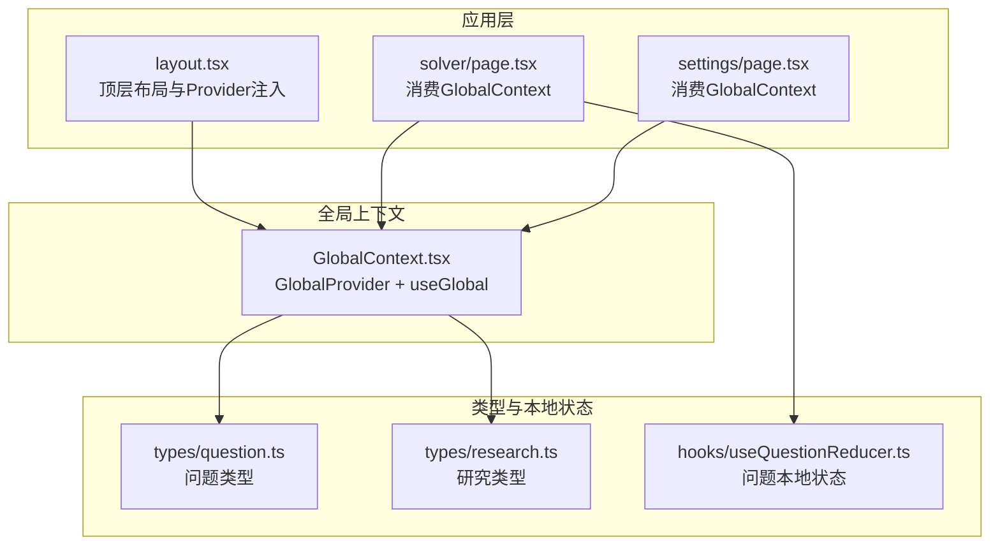
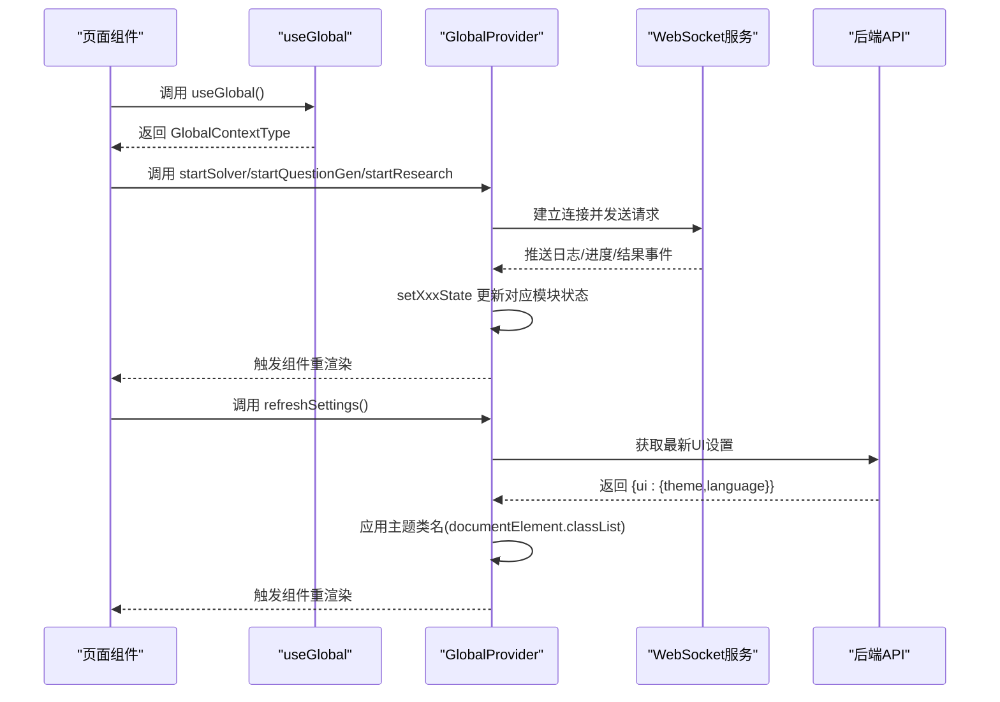
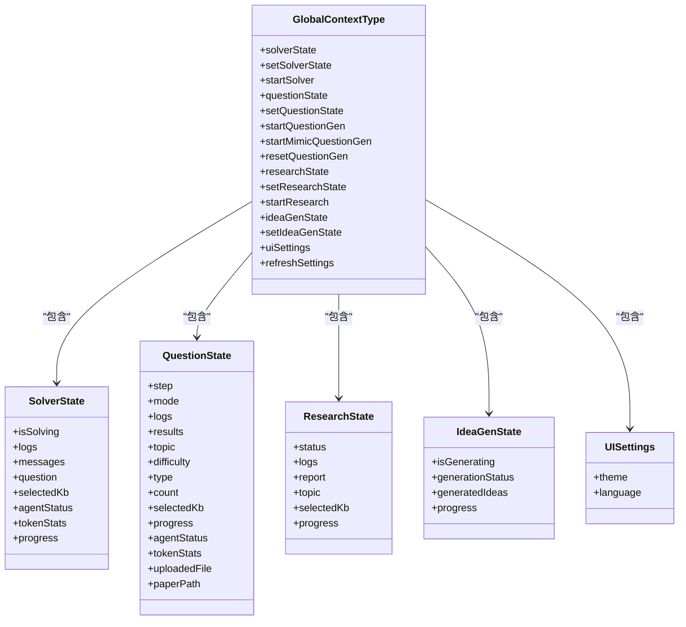
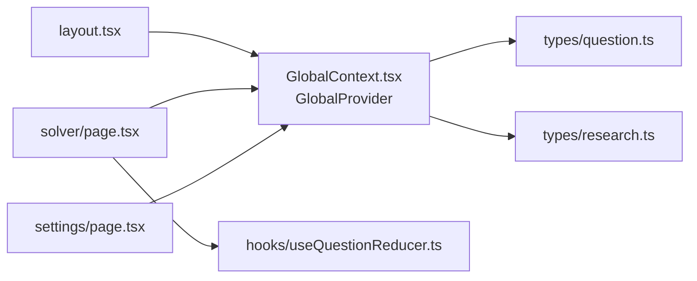

# 全局上下文结构

<cite>
**本文引用的文件**
- [GlobalContext.tsx](file://web/context/GlobalContext.tsx)
- [layout.tsx](file://web/app/layout.tsx)
- [page.tsx（Solver）](file://web/app/solver/page.tsx)
- [page.tsx（Settings）](file://web/app/settings/page.tsx)
- [useQuestionReducer.ts](file://web/hooks/useQuestionReducer.ts)
- [question.ts（类型）](file://web/types/question.ts)
- [research.ts（类型）](file://web/types/research.ts)
</cite>

## 目录
1. [引言](#引言)
2. [项目结构](#项目结构)
3. [核心组件](#核心组件)
4. [架构总览](#架构总览)
5. [详细组件分析](#详细组件分析)
6. [依赖关系分析](#依赖关系分析)
7. [性能考量](#性能考量)
8. [故障排查指南](#故障排查指南)
9. [结论](#结论)
10. [附录](#附录)

## 引言
本文件围绕前端全局上下文 GlobalContext 的设计与实现进行系统性解析，重点聚焦于 GlobalContextType 接口所定义的全局状态模型（solverState、questionState、researchState 等），阐述其初始化流程、在应用顶层的注入方式、各模块状态的更新机制（含 setSolverState、setQuestionState 等）、UI 设置（主题、语言）的持久化与动态切换策略，并给出在不同页面组件中安全消费全局上下文的最佳实践与状态树可视化图示。

## 项目结构
GlobalContext 位于 web/context 目录，作为应用顶层 Provider 注入到 web/app/layout.tsx 中，随后在各页面组件中通过 useGlobal 钩子安全消费。同时，仓库内还存在一套独立的“问题生成”与“研究”类型与 reducer，用于 UI 层的本地状态管理，二者在概念上与 GlobalContext 的模块状态形成互补。

图表来源
- [layout.tsx](file://web/app/layout.tsx#L19-L36)
- [GlobalContext.tsx](file://web/context/GlobalContext.tsx#L252-L1341)
- [question.ts（类型）](file://web/types/question.ts#L1-L263)
- [research.ts（类型）](file://web/types/research.ts#L1-L162)
- [useQuestionReducer.ts](file://web/hooks/useQuestionReducer.ts#L1-L418)

章节来源
- [layout.tsx](file://web/app/layout.tsx#L19-L36)
- [GlobalContext.tsx](file://web/context/GlobalContext.tsx#L252-L1341)

## 核心组件
- GlobalContextType：定义了全局上下文对外暴露的状态与方法，包括：
  - solver 模块：solverState、setSolverState、startSolver
  - question 模块：questionState、setQuestionState、startQuestionGen、startMimicQuestionGen、resetQuestionGen
  - research 模块：researchState、setResearchState、startResearch
  - ideaGen 模块：ideaGenState、setIdeaGenState
  - UI 设置：uiSettings、refreshSettings
- GlobalProvider：负责初始化上述状态并封装 WebSocket 交互逻辑，将 GlobalContextType 注入到 React 上下文中。
- useGlobal：自定义 Hook，用于在组件中安全获取 GlobalContextType。

章节来源
- [GlobalContext.tsx](file://web/context/GlobalContext.tsx#L206-L249)
- [GlobalContext.tsx](file://web/context/GlobalContext.tsx#L252-L1341)

## 架构总览
GlobalContext 将多个业务模块的状态与控制流聚合为统一的上下文，通过 WebSocket 与后端服务进行实时通信，驱动各模块状态的增量更新。UI 设置（主题、语言）由后端配置驱动，支持运行时刷新与即时生效。

图表来源
- [GlobalContext.tsx](file://web/context/GlobalContext.tsx#L252-L1341)
- [page.tsx（Settings）](file://web/app/settings/page.tsx#L1-L200)

## 详细组件分析

### GlobalContextType 接口与模块状态
- solverState
  - 结构要点：isSolving、logs、messages、question、selectedKb、agentStatus、tokenStats、progress
  - 用途：承载“智能求解器”的执行状态、对话消息、代理状态、令牌统计与阶段进度
- questionState
  - 结构要点：step、mode、logs、results、topic、difficulty、type、count、selectedKb、progress(agentStatus/tokenStats)、uploadedFile、paperPath
  - 用途：承载“题目生成器”的配置、生成流程、并行焦点、结果集与进度
- researchState
  - 结构要点：status、logs、report、topic、selectedKb、progress
  - 用途：承载“研究管线”的状态、日志、报告与进度
- ideaGenState
  - 结构要点：isGenerating、generationStatus、generatedIdeas、progress
  - 用途：承载“想法生成”的状态与结果
- uiSettings
  - 结构要点：theme、language
  - 用途：承载界面主题与语言偏好

章节来源
- [GlobalContext.tsx](file://web/context/GlobalContext.tsx#L53-L249)

### 初始化与注入流程
- 初始化
  - GlobalProvider 内部通过 useState 初始化各模块状态，默认值覆盖关键字段（如 agentStatus、tokenStats、progress 等）
  - UI 设置 uiSettings 默认 light/en，首次挂载时调用 refreshSettings 从后端拉取最新配置并应用主题类名
- 注入
  - 在 web/app/layout.tsx 中，GlobalProvider 包裹整个应用树，使任意子组件可通过 useGlobal 访问全局上下文

章节来源
- [GlobalContext.tsx](file://web/context/GlobalContext.tsx#L252-L314)
- [GlobalContext.tsx](file://web/context/GlobalContext.tsx#L259-L284)
- [layout.tsx](file://web/app/layout.tsx#L19-L36)

### 各模块状态更新机制与副作用
- solver 模块
  - startSolver：建立 WebSocket 连接，发送问题与知识库参数；onmessage 分发日志、代理状态、令牌统计、进度与最终结果；onerror/onclose 清理状态
  - addSolverLog：追加日志
- question 模块
  - startQuestionGen：支持“知识库模式”批量生成；onmessage 处理日志、代理状态、令牌统计、进度（含并行生成）、单题更新、批次汇总、完成与错误
  - startMimicQuestionGen：支持“上传PDF/预解析目录”两种模式；onmessage 处理状态映射、进度、单题状态、结果与最终摘要
  - resetQuestionGen：重置为初始配置态
  - addQuestionLog：追加日志
- research 模块
  - startResearch：发送研究主题、知识库、计划模式与工具列表；onmessage 解析并行任务、查询轨迹、阶段进度与最终报告；onerror/onclose 清理状态
  - addResearchLog：追加日志
- ideaGen 模块
  - 仅包含本地状态，未见 WebSocket 交互

章节来源
- [GlobalContext.tsx](file://web/context/GlobalContext.tsx#L317-L447)
- [GlobalContext.tsx](file://web/context/GlobalContext.tsx#L449-L780)
- [GlobalContext.tsx](file://web/context/GlobalContext.tsx#L782-L1097)
- [GlobalContext.tsx](file://web/context/GlobalContext.tsx#L1103-L1301)
- [GlobalContext.tsx](file://web/context/GlobalContext.tsx#L1303-L1341)

### UI 设置（主题、语言）的持久化与动态切换
- 持久化策略
  - 页面 Settings 通过后端 API 保存 UI 设置（/api/v1/settings/ui），保存成功后调用 refreshSettings 刷新前端状态
- 动态切换实现
  - refreshSettings 会根据后端返回的 ui.theme 动态为 documentElement 添加/移除 "dark" 类名，从而立即切换主题
  - 页面 Settings 提供主题与语言选择控件，变更时即时应用主题类名并保存至后端

章节来源
- [GlobalContext.tsx](file://web/context/GlobalContext.tsx#L259-L284)
- [page.tsx（Settings）](file://web/app/settings/page.tsx#L1-L200)
- [page.tsx（Settings）](file://web/app/settings/page.tsx#L301-L307)

### 在页面组件中安全消费全局上下文与避免不必要重渲染
- 使用 useGlobal 获取所需字段与方法
- 在组件内部仅订阅必要的状态片段，避免将整个 GlobalContextType 作为依赖项传入昂贵计算或副作用
- 对于频繁更新的日志与进度，建议在组件内部做去重与节流（例如按内容去重、限制滚动行为）
- 在页面 Solver 中对 logs/messages/isSolving 的变化做了细粒度的副作用处理，避免首屏滚动与首次消息导致的误触发

章节来源
- [page.tsx（Solver）](file://web/app/solver/page.tsx#L54-L120)
- [page.tsx（Solver）](file://web/app/solver/page.tsx#L120-L160)

### 状态树可视化与边界划分
- 全局状态树（GlobalContext）
  - solverState：isSolving、logs、messages、question、selectedKb、agentStatus、tokenStats、progress
  - questionState：step、mode、logs、results、topic、difficulty、type、count、selectedKb、progress、agentStatus、tokenStats、uploadedFile、paperPath
  - researchState：status、logs、report、topic、selectedKb、progress
  - ideaGenState：isGenerating、generationStatus、generatedIdeas、progress
  - uiSettings：theme、language
- 边界划分原则
  - 每个模块状态独立初始化与更新，避免跨模块耦合
  - WebSocket 事件仅更新对应模块状态，减少全局重渲染
  - UI 设置与业务状态分离，UI 设置通过 refreshSettings 从后端同步

图表来源
- [GlobalContext.tsx](file://web/context/GlobalContext.tsx#L206-L249)

## 依赖关系分析
- 组件依赖
  - layout.tsx 依赖 GlobalContext.tsx 的 GlobalProvider
  - 页面组件（如 Solver、Settings）依赖 useGlobal Hook
- 类型依赖
  - GlobalContext.tsx 依赖 question.ts 与 research.ts 中的类型定义（用于 WebSocket 事件解析与状态结构）
- 本地状态补充
  - useQuestionReducer.ts 与 question.ts 定义了“问题生成”的本地状态机，与 GlobalContext 的 questionState 形成互补，前者更偏向 UI 层的并行任务与日志管理

图表来源
- [layout.tsx](file://web/app/layout.tsx#L19-L36)
- [GlobalContext.tsx](file://web/context/GlobalContext.tsx#L252-L1341)
- [question.ts（类型）](file://web/types/question.ts#L1-L263)
- [research.ts（类型）](file://web/types/research.ts#L1-L162)
- [useQuestionReducer.ts](file://web/hooks/useQuestionReducer.ts#L1-L418)

章节来源
- [layout.tsx](file://web/app/layout.tsx#L19-L36)
- [GlobalContext.tsx](file://web/context/GlobalContext.tsx#L252-L1341)
- [question.ts（类型）](file://web/types/question.ts#L1-L263)
- [research.ts（类型）](file://web/types/research.ts#L1-L162)
- [useQuestionReducer.ts](file://web/hooks/useQuestionReducer.ts#L1-L418)

## 性能考量
- WebSocket 事件驱动的增量更新可显著降低全局重渲染频率，但需注意：
  - 在 onmessage 中避免一次性构造大对象，优先合并字段更新
  - 日志过滤与去重（如 Solver 页面对重复日志的过滤）可减少渲染压力
  - 并行生成场景下，尽量使用浅拷贝与局部状态更新，避免深层不可变更新
- 主题切换通过类名切换，成本极低，无需额外状态管理

[本节为通用指导，不直接分析具体文件]

## 故障排查指南
- WebSocket 连接失败
  - 观察 onerror 回调是否触发，检查后端服务连通性与路径
  - 在 GlobalContext.tsx 中相关 onerror/onclose 逻辑已清理对应模块状态，确保不会残留错误状态
- UI 设置未生效
  - 确认 Settings 页面保存成功后调用了 refreshSettings
  - 检查 documentElement 是否正确添加/移除 "dark" 类名
- 日志噪声过多
  - 可参考 Solver 页面的日志过滤策略，在组件内部对重复内容与调试信息进行过滤

章节来源
- [GlobalContext.tsx](file://web/context/GlobalContext.tsx#L416-L443)
- [GlobalContext.tsx](file://web/context/GlobalContext.tsx#L757-L779)
- [GlobalContext.tsx](file://web/context/GlobalContext.tsx#L1277-L1296)
- [page.tsx（Solver）](file://web/app/solver/page.tsx#L677-L800)

## 结论
GlobalContext 通过统一的状态模型与 WebSocket 驱动的增量更新，实现了多模块协同的前端状态管理。其设计将 UI 设置与业务状态解耦，支持运行时刷新与即时生效；在页面组件中通过 useGlobal 安全消费，配合日志过滤与细粒度副作用，可有效避免不必要的重渲染。对于并行生成与研究管线等复杂场景，建议在组件层进一步细化渲染边界与数据缓存策略。

[本节为总结性内容，不直接分析具体文件]

## 附录
- 代码示例路径（不展示具体代码内容）
  - GlobalContext 初始化与 Provider 注入：[GlobalContext.tsx](file://web/context/GlobalContext.tsx#L252-L314)，[layout.tsx](file://web/app/layout.tsx#L19-L36)
  - Solver 启动与 WebSocket 事件处理：[GlobalContext.tsx](file://web/context/GlobalContext.tsx#L317-L447)
  - 问题生成（知识库模式）事件处理：[GlobalContext.tsx](file://web/context/GlobalContext.tsx#L449-L780)
  - 问题生成（模拟模式）事件处理：[GlobalContext.tsx](file://web/context/GlobalContext.tsx#L782-L1097)
  - 研究管线事件处理：[GlobalContext.tsx](file://web/context/GlobalContext.tsx#L1103-L1301)
  - UI 设置刷新与主题应用：[GlobalContext.tsx](file://web/context/GlobalContext.tsx#L259-L284)，[page.tsx（Settings）](file://web/app/settings/page.tsx#L301-L307)
  - 页面组件安全消费示例：[page.tsx（Solver）](file://web/app/solver/page.tsx#L54-L120)