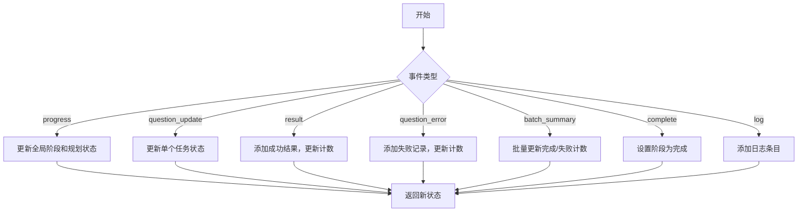
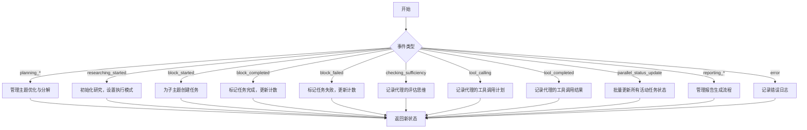
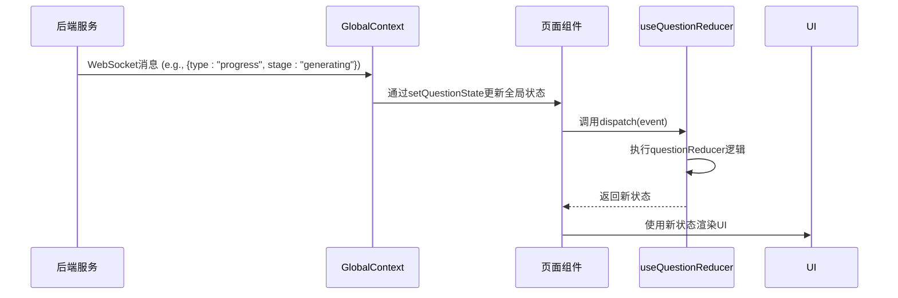

# 模块化状态管理

<cite>
**本文档引用的文件**   
- [useQuestionReducer.ts](file://web/hooks/useQuestionReducer.ts)
- [useResearchReducer.ts](file://web/hooks/useResearchReducer.ts)
- [GlobalContext.tsx](file://web/context/GlobalContext.tsx)
- [question.ts](file://web/types/question.ts)
- [research.ts](file://web/types/research.ts)
- [QuestionDashboard.tsx](file://web/components/question/QuestionDashboard.tsx)
- [ResearchDashboard.tsx](file://web/components/research/ResearchDashboard.tsx)
- [page.tsx](file://web/app/question/page.tsx)
- [page.tsx](file://web/app/research/page.tsx)
</cite>

## 目录
1. [引言](#引言)
2. [核心状态机设计](#核心状态机设计)
3. [useQuestionReducer 与 questionReducer 分析](#usequestionreducer-与-questionreducer-分析)
4. [useResearchReducer 与 researchReducer 分析](#userearchreducer-与-researchreducer-分析)
5. [初始状态数据结构设计](#初始状态数据结构设计)
6. [Context 与 useReducer 结合使用实践](#context-与-usereducer-结合使用实践)
7. [状态变更调试与性能优化](#状态变更调试与性能优化)
8. [Context + useReducer 与 Redux Toolkit 对比](#context--usereducer-与-redux-toolkit-对比)
9. [结论](#结论)

## 引言

本项目通过 `useQuestionReducer` 和 `useResearchReducer` 两个自定义 Hook 实现了模块化的状态管理。这两个 Hook 封装了复杂任务流（如生成问题和进行研究）的状态机逻辑，利用 React 的 `useReducer` 原语来管理状态变更。状态管理与 `GlobalContext` 结合，实现了跨组件通信，同时保持了逻辑的内聚性和可维护性。本文档将深入分析其设计与实现。

## 核心状态机设计

`useQuestionReducer` 和 `useResearchReducer` 的核心是两个纯函数 `questionReducer` 和 `researchReducer`。它们遵循 Redux 的设计模式，接收当前状态和一个描述变更的 `action`（在本项目中称为 `event`），并返回一个新的状态。这种不可变性确保了状态变更的可预测性和可追溯性。

状态机的每个 `event` 类型（如 `START_GENERATION`, `UPDATE_PROGRESS`, `COMPLETE`）都对应一个特定的业务流程阶段。Reducer 通过 `switch` 语句处理这些事件，根据当前状态和事件负载（payload）计算出下一个状态。例如，当收到 `progress` 事件时，reducer 会根据事件中的 `stage` 字段（如 "planning", "researching", "generating"）来更新全局状态，并可能触发日志记录或子任务的初始化。

**Section sources**
- [useQuestionReducer.ts](file://web/hooks/useQuestionReducer.ts#L65-L407)
- [useResearchReducer.ts](file://web/hooks/useResearchReducer.ts#L75-L541)

## useQuestionReducer 与 questionReducer 分析

`useQuestionReducer` 是一个自定义 Hook，它通过调用 `useReducer(questionReducer, initialQuestionState)` 来创建和管理问题生成任务的状态。

`questionReducer` 函数处理多种事件类型，驱动问题生成流程：
- **`progress`**: 这是最核心的事件，由后端通过 WebSocket 推送。它携带了当前的 `stage`（阶段）和 `status`（状态）。Reducer 根据这些信息更新 `global.stage`，并可能更新 `planning` 或 `tasks` 等子状态。例如，当 `stage` 为 "generating" 时，它会根据 `focuses` 数组初始化 `tasks` 对象。
- **`question_update`**: 用于更新单个问题任务的进度。它会更新 `tasks` 中对应任务的状态（如 "generating", "validating"），并维护 `activeTaskIds` 数组以跟踪正在进行的任务。
- **`result` / `question_result`**: 当一个问题生成成功时触发。它会将结果添加到 `results` 数组中，更新 `global.completedQuestions` 计数，并将该任务的状态标记为 "done"。
- **`question_error`**: 处理单个问题生成失败的情况。它会将错误信息记录到 `failures` 数组中，并更新 `global.failedQuestions` 计数。
- **`batch_summary`**: 在批量生成模式下，提供一个汇总报告，用于一次性更新 `completedQuestions` 和 `failedQuestions` 等全局计数。
- **`complete`**: 标志着整个问题生成流程的结束，将 `global.stage` 设置为 "complete"。
- **`log`**: 用于记录日志条目，所有日志都存储在 `logs` 数组中，便于用户追踪和调试。

**Diagram sources**
- [useQuestionReducer.ts](file://web/hooks/useQuestionReducer.ts#L65-L407)

**Section sources**
- [useQuestionReducer.ts](file://web/hooks/useQuestionReducer.ts#L65-L407)
- [question.ts](file://web/types/question.ts#L166-L229)

## useResearchReducer 与 researchReducer 分析

`useResearchReducer` 的设计与 `useQuestionReducer` 类似，但其状态机更为复杂，因为它管理的是一个多阶段的研究流程。

`researchReducer` 处理以下关键事件：
- **规划阶段 (`planning_started`, `rephrase_completed`, `decompose_completed`)**: 这些事件驱动研究主题的优化和分解。`planning_started` 初始化状态，`rephrase_completed` 更新优化后的主题，`decompose_completed` 记录生成的子主题数量。
- **研究阶段 (`researching_started`, `block_started`, `block_completed`, `block_failed`)**: `researching_started` 触发研究阶段的开始，并设置执行模式（串行或并行）。`block_started` 为每个子主题块创建一个 `TaskState`。`block_completed` 和 `block_failed` 则分别处理成功和失败的块，并更新 `completedBlocks` 计数。
- **代理内部事件 (`checking_sufficiency`, `tool_calling`, `tool_completed`)**: 这些事件提供了更细粒度的代理内部思维过程。`checking_sufficiency` 表示代理正在评估知识是否充足，`tool_calling` 表示代理正在调用工具（如搜索），`tool_completed` 表示工具调用已完成。这些事件通过 `addThought` 函数被记录到对应任务的 `thoughts` 数组中。
- **报告阶段 (`reporting_started`, `outline_completed`, `writing_section`, `reporting_completed`)**: 这些事件管理报告的生成。`reporting_completed` 是最终事件，它会将生成的报告内容、字数、章节和引用数等信息存储到 `reporting` 子状态中，并将 `global.stage` 设置为 "completed"。
- **`parallel_status_update`**: 这是一个关键的批量更新事件，用于在并行模式下高效地同步所有活动任务的状态，避免了频繁的单个状态更新。

**Diagram sources**
- [useResearchReducer.ts](file://web/hooks/useResearchReducer.ts#L75-L541)

**Section sources**
- [useResearchReducer.ts](file://web/hooks/useResearchReducer.ts#L75-L541)
- [research.ts](file://web/types/research.ts#L113-L152)

## 初始状态数据结构设计

`initialQuestionState` 和 `initialResearchState` 的数据结构设计精巧，支持了复杂任务流的管理。

`initialQuestionState` 的结构清晰地划分了不同关注点：
- **`global`**: 存储跨阶段的全局信息，如 `stage`、`startTime` 和各种计数器（`totalQuestions`, `completedQuestions` 等）。这使得上层组件可以轻松获取整体进度。
- **`planning`**: 专门用于存储规划阶段的数据，如 `topic`、`difficulty` 和 `queries`。这保证了状态的模块化。
- **`tasks`**: 一个以 `taskId` 为键的对象，用于存储每个独立问题任务的详细状态（`QuestionTask`）。这种结构便于通过 ID 快速查找和更新特定任务。
- **`results` 和 `failures`**: 分别存储成功和失败的结果，便于后续展示和分析。
- **`logs`**: 一个数组，用于存储所有日志条目，是调试和用户反馈的关键。

`initialResearchState` 的设计更为复杂，反映了研究流程的多阶段特性：
- **`global`**: 同样包含 `stage` 和计数器（`totalBlocks`, `completedBlocks`）。
- **`planning`**: 存储原始和优化后的主题，以及子主题列表。
- **`tasks`**: 与问题生成类似，但 `TaskState` 包含了更丰富的信息，如 `iteration`（迭代次数）、`currentAction`（当前动作）和 `thoughts`（思维链）。
- **`executionMode`**: 明确区分了串行和并行执行模式。
- **`reporting`**: 专门用于存储报告生成过程中的数据，如 `outline` 和最终的 `generatedReport`。
- **`activeTaskIds`**: 一个数组，用于跟踪当前正在运行的任务 ID，这对于 UI 上高亮显示活跃任务至关重要。

这种分层和模块化的数据结构设计，使得状态既易于管理，又能够高效地支持复杂的 UI 交互。

**Section sources**
- [useQuestionReducer.ts](file://web/hooks/useQuestionReducer.ts#L12-L34)
- [useResearchReducer.ts](file://web/hooks/useResearchReducer.ts#L12-L33)
- [question.ts](file://web/types/question.ts#L111-L157)
- [research.ts](file://web/types/research.ts#L76-L109)

## Context 与 useReducer 结合使用实践

本项目通过 `GlobalContext` 将 `useReducer` 的能力提升到了应用级别，实现了跨组件通信的最佳实践。

在 `GlobalContext.tsx` 中，使用 `useState` 创建了 `questionState` 和 `researchState`，并通过 `startQuestionGen` 和 `startResearch` 等函数来启动 WebSocket 连接。当 WebSocket 收到消息时，这些函数会解析消息并调用 `setQuestionState` 或 `setResearchState` 来更新状态。

然而，`useQuestionReducer` 和 `useResearchReducer` 提供了更精细的控制。在 `web/app/question/page.tsx` 和 `web/app/research/page.tsx` 中，页面组件通过 `useGlobal()` 获取全局状态，但同时使用 `useQuestionReducer()` 和 `useResearchReducer()` 创建了本地的状态机。

这种设计模式的优势在于：
1.  **解耦**: `GlobalContext` 负责与后端通信和管理全局状态，而 `useQuestionReducer` 负责处理从后端接收到的原始事件，并将其转换为更结构化的状态。这实现了关注点分离。
2.  **灵活性**: 本地组件可以完全控制其状态机，而无需修改全局上下文。例如，`QuestionDashboard` 组件可以直接 `dispatch` 事件来响应用户交互。
3.  **可维护性**: 状态逻辑被封装在自定义 Hook 中，易于测试和复用。

**Diagram sources**
- [GlobalContext.tsx](file://web/context/GlobalContext.tsx#L445-L774)
- [page.tsx](file://web/app/question/page.tsx#L44)
- [useQuestionReducer.ts](file://web/hooks/useQuestionReducer.ts#L409-L411)

**Section sources**
- [GlobalContext.tsx](file://web/context/GlobalContext.tsx#L445-L774)
- [page.tsx](file://web/app/question/page.tsx#L44)
- [page.tsx](file://web/app/research/page.tsx#L52)

## 状态变更调试与性能优化

### 调试方法
为了追踪状态变更，可以使用 **React DevTools**。通过其 "Profiler" 和 "Components" 面板，可以：
1.  监控 `dispatch` 调用，查看每次 `action` 的类型和负载。
2.  检查组件的重渲染次数，识别不必要的更新。
3.  查看 `useReducer` Hook 的状态快照，对比变更前后的差异。

此外，项目中内置了详细的日志系统。`logs` 数组记录了所有关键事件，开发者可以通过检查这些日志来理解状态机的执行流程。

### 性能优化
尽管 `useReducer` 本身是高效的，但仍需注意性能：
- **`useMemo`**: 可以用于缓存从状态派生的复杂计算结果。例如，在 `QuestionDashboard` 中，`buildTasksFromResults` 函数的结果可以被 `useMemo` 缓存，避免在每次渲染时重新计算。
- **`useCallback`**: 用于缓存传递给子组件的回调函数。例如，`onTaskSelect` 回调函数应使用 `useCallback` 包装，以防止子组件因接收到新的函数引用而发生不必要的重渲染。
- **避免深层对象比较**: `useReducer` 的 `dispatch` 会触发使用该状态的组件重新渲染。确保返回的新状态对象是不可变的，即只创建真正发生变化的部分，而不是整个状态树。

**Section sources**
- [QuestionDashboard.tsx](file://web/components/question/QuestionDashboard.tsx#L150)
- [ResearchDashboard.tsx](file://web/components/research/ResearchDashboard.tsx#L53)

## Context + useReducer 与 Redux Toolkit 对比

| 特性 | Context + useReducer | Redux Toolkit |
| :--- | :--- | :--- |
| **复杂度** | 轻量级，学习曲线平缓，适合中小型应用。 | 功能更丰富，但引入了额外的抽象和概念（如 `createSlice`, `createAsyncThunk`），适合大型复杂应用。 |
| **包大小** | 无额外依赖，仅使用 React 内置 API，包体积最小。 | 需要引入 `@reduxjs/toolkit` 和 `react-redux`，增加包体积。 |
| **开发体验** | 需要手动编写 `reducer` 和 `action`，样板代码较多。 | `createSlice` 自动生成 `actions` 和 `reducer`，大大减少了样板代码。 |
| **中间件与副作用** | 需要手动在组件中处理副作用（如 WebSocket 通信），逻辑可能分散。 | 内置 `createAsyncThunk` 和 `middleware`，提供了处理异步逻辑的标准模式，逻辑更集中。 |
| **调试工具** | 可以使用 React DevTools，但功能不如 Redux DevTools 强大。 | 与 Redux DevTools 集成完美，提供时间旅行调试、action 回放等高级功能。 |
| **性能** | 状态更新可能导致所有订阅了 `Context` 的组件重渲染，需谨慎使用。 | `react-redux` 的 `useSelector` 允许选择性订阅，能有效避免不必要的重渲染。 |

**技术考量**:
本项目选择轻量级的 `Context + useReducer` 方案是合理的。其业务逻辑虽然复杂，但主要围绕 WebSocket 事件驱动，且状态结构相对清晰。使用 `useReducer` 可以很好地管理这些状态变更，而无需引入 Redux 的复杂性。此外，通过将状态逻辑封装在自定义 Hook 中，已经实现了良好的代码组织和复用，达到了与 Redux 相似的内聚性。对于当前项目规模，此方案在开发效率、维护性和性能之间取得了最佳平衡。

**Section sources**
- [useQuestionReducer.ts](file://web/hooks/useQuestionReducer.ts)
- [useResearchReducer.ts](file://web/hooks/useResearchReducer.ts)

## 结论

`useQuestionReducer` 和 `useResearchReducer` 是本项目状态管理的基石。它们通过精心设计的状态机和数据结构，有效地管理了复杂任务流。与 `GlobalContext` 的结合使用，实现了跨组件通信，同时保持了逻辑的清晰和可维护性。尽管 `Context + useReducer` 在处理大规模应用时可能面临性能挑战，但对于本项目而言，它是一个简洁、高效且合适的技术选择。通过遵循最佳实践，如使用 `useMemo` 和 `useCallback` 进行优化，并利用 React DevTools 进行调试，可以确保状态管理系统的健壮性和高性能。