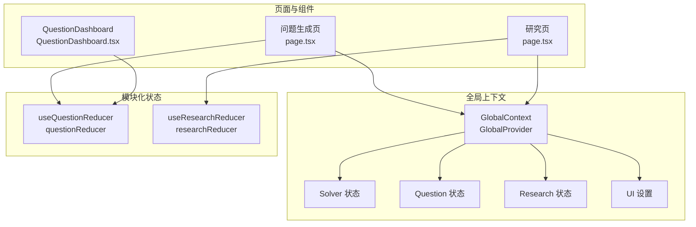
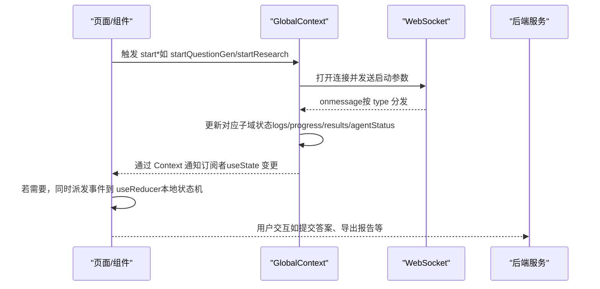
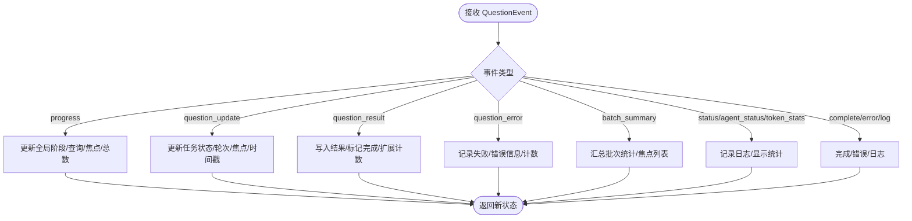
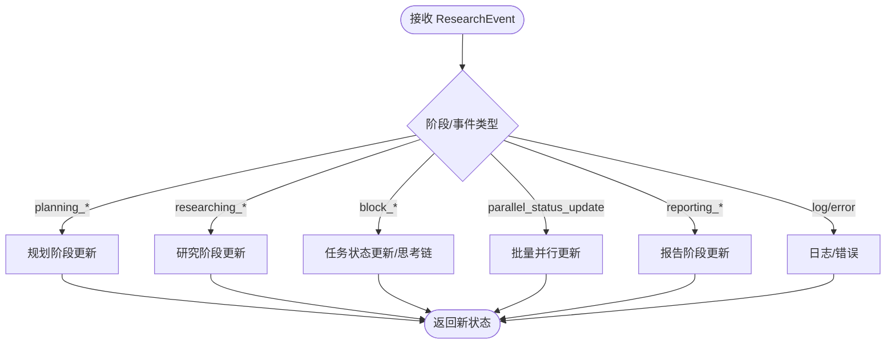
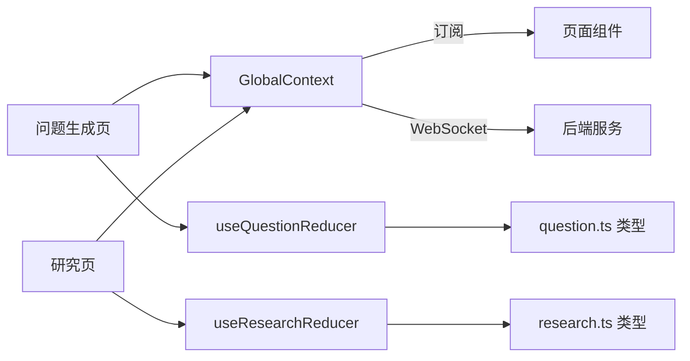

# 状态管理

<cite>
**本文引用的文件**
- [GlobalContext.tsx](file://web/context/GlobalContext.tsx)
- [useQuestionReducer.ts](file://web/hooks/useQuestionReducer.ts)
- [useResearchReducer.ts](file://web/hooks/useResearchReducer.ts)
- [question.ts](file://web/types/question.ts)
- [research.ts](file://web/types/research.ts)
- [page.tsx（问题生成）](file://web/app/question/page.tsx)
- [page.tsx（研究）](file://web/app/research/page.tsx)
- [QuestionDashboard.tsx](file://web/components/question/QuestionDashboard.tsx)
</cite>

## 目录
1. [引言](#引言)
2. [项目结构](#项目结构)
3. [核心组件](#核心组件)
4. [架构总览](#架构总览)
5. [详细组件分析](#详细组件分析)
6. [依赖关系分析](#依赖关系分析)
7. [性能考虑](#性能考虑)
8. [故障排查指南](#故障排查指南)
9. [结论](#结论)

## 引言
本文件系统性阐述 DeepTutor 前端的状态管理方案，重点聚焦于 GlobalContext 的全局状态设计、useQuestionReducer 与 useResearchReducer 的模块化状态管理、状态持久化与初始化策略、错误恢复机制，以及与 Redux 等方案的技术选型考量。文档同时提供状态流图与状态机模型，并给出常见状态同步问题的调试方法与性能优化建议，帮助开发者在复杂工作流场景下高效定位与解决问题。

## 项目结构
DeepTutor 的前端采用 React + Context API 实现全局状态管理，结合 useReducer 提供细粒度的模块化状态更新能力：
- 全局状态：通过 GlobalContext 暴露 Solver、Question、Research、UI 设置等状态与操作函数，统一由 GlobalProvider 注入。
- 模块化状态：useQuestionReducer 与 useResearchReducer 分别维护各自领域的事件驱动状态机，用于深度仪表盘与实时进度展示。
- 类型体系：question.ts 与 research.ts 定义了领域内事件、状态、任务与日志的数据结构，确保前后端消息契约一致。
- 页面与组件：问题生成页与研究页分别消费 GlobalContext 与本地 useReducer，实现“全局状态 + 局部状态”的双层状态管理。

图表来源
- [GlobalContext.tsx](file://web/context/GlobalContext.tsx#L252-L1341)
- [useQuestionReducer.ts](file://web/hooks/useQuestionReducer.ts#L1-L418)
- [useResearchReducer.ts](file://web/hooks/useResearchReducer.ts#L1-L547)
- [page.tsx（问题生成）](file://web/app/question/page.tsx#L1-L120)
- [page.tsx（研究）](file://web/app/research/page.tsx#L1-L120)
- [QuestionDashboard.tsx](file://web/components/question/QuestionDashboard.tsx#L1-L200)

章节来源
- [GlobalContext.tsx](file://web/context/GlobalContext.tsx#L252-L1341)
- [useQuestionReducer.ts](file://web/hooks/useQuestionReducer.ts#L1-L418)
- [useResearchReducer.ts](file://web/hooks/useResearchReducer.ts#L1-L547)
- [question.ts](file://web/types/question.ts#L1-L263)
- [research.ts](file://web/types/research.ts#L1-L162)
- [page.tsx（问题生成）](file://web/app/question/page.tsx#L1-L120)
- [page.tsx（研究）](file://web/app/research/page.tsx#L1-L120)
- [QuestionDashboard.tsx](file://web/components/question/QuestionDashboard.tsx#L1-L200)

## 核心组件
- GlobalContext（全局上下文）
  - 职责：集中管理 Solver、Question、Research、UI 设置等状态；封装 WebSocket 事件处理与状态更新；提供 start* 方法触发后端流程。
  - 关键点：使用 useState 维护各子域状态；通过 useRef 管理 WebSocket 连接；onmessage 中按 data.type 分发到对应状态字段。
- useQuestionReducer（问题生成模块化状态）
  - 职责：以事件驱动的方式维护问题生成的阶段、任务、结果、失败与日志；支持并行任务追踪与聚合统计。
  - 关键点：initialQuestionState 定义初始结构；questionReducer 根据事件类型更新 tasks、activeTaskIds、results、failures、logs 等。
- useResearchReducer（研究模块化状态）
  - 职责：维护研究规划、执行、报告阶段的任务状态与链式思考记录；支持并行模式下的批量状态更新。
  - 关键点：initialResearchState 定义初始结构；researchReducer 将后端事件映射为具体阶段与任务状态变更。
- 类型系统（question.ts、research.ts）
  - 职责：定义事件类型、状态结构、任务结构、日志结构与 Token 统计结构，保证前后端消息契约一致。

章节来源
- [GlobalContext.tsx](file://web/context/GlobalContext.tsx#L252-L1341)
- [useQuestionReducer.ts](file://web/hooks/useQuestionReducer.ts#L1-L418)
- [useResearchReducer.ts](file://web/hooks/useResearchReducer.ts#L1-L547)
- [question.ts](file://web/types/question.ts#L1-L263)
- [research.ts](file://web/types/research.ts#L1-L162)

## 架构总览
DeepTutor 的状态管理采用“全局 Context + 局部 Reducer”的混合架构：
- 全局层（GlobalContext）：负责跨页面共享的状态与后端交互（WebSocket），确保用户在不同页面间切换时仍能感知流程状态。
- 局部层（useReducer）：在页面内部维护更细粒度的状态机，便于构建深度仪表盘与实时可视化。
- 事件驱动：后端通过 WebSocket 推送事件，前端根据事件类型更新全局或局部状态，形成闭环。

图表来源
- [GlobalContext.tsx](file://web/context/GlobalContext.tsx#L317-L443)
- [page.tsx（问题生成）](file://web/app/question/page.tsx#L84-L120)
- [page.tsx（研究）](file://web/app/research/page.tsx#L128-L205)

## 详细组件分析

### GlobalContext 全局状态设计
- 状态结构
  - SolverState：包含 isSolving、logs、messages、question、selectedKb、agentStatus、tokenStats、progress 等字段，支撑“解题”流程的实时反馈。
  - QuestionState：包含 step、mode、logs、results、topic、difficulty、type、count、selectedKb、progress、agentStatus、tokenStats、uploadedFile、paperPath 等字段，覆盖“自定义生成”与“模拟考试”两种模式。
  - ResearchState：包含 status、logs、report、topic、selectedKb、progress 等字段，支持规划、研究、报告三阶段的进度与并行任务信息。
  - IdeaGenState：用于“想法生成”的轻量状态。
  - UISettings：主题与语言设置。
- 更新机制
  - startSolver/startQuestionGen/startResearch 内部创建 WebSocket，onmessage 中按 data.type 更新对应字段，例如：
    - type === "log"：追加日志
    - type === "agent_status"：更新 agentStatus
    - type === "token_stats"：更新 tokenStats
    - type === "progress"：合并 progress 字段
    - type === "result"：写入最终结果并结束流程
    - type === "error"：记录错误并重置状态
- 跨组件通信策略
  - GlobalProvider 将状态与操作函数注入 Context，任意子树可通过 useGlobal 获取。
  - 页面组件在 mount 时拉取知识库列表、刷新 UI 设置，保证初始状态完整。
- 初始化与清理
  - 各子域在 start* 时重置为“开始态”，清理历史 logs/progress/results/agentStatus。
  - WebSocket 在每次 start* 前关闭旧连接，避免重复监听。
- 错误恢复
  - onerror/onclose 中将状态回退至“空闲/配置”态，并清空活动任务与进度，确保 UI 一致性。
  - 日志中记录错误信息，便于用户与开发者定位问题。

章节来源
- [GlobalContext.tsx](file://web/context/GlobalContext.tsx#L286-L443)
- [GlobalContext.tsx](file://web/context/GlobalContext.tsx#L449-L780)
- [GlobalContext.tsx](file://web/context/GlobalContext.tsx#L800-L1097)
- [GlobalContext.tsx](file://web/context/GlobalContext.tsx#L1103-L1341)

### useQuestionReducer 模块化状态管理
- 设计模式
  - 事件驱动状态机：根据 QuestionEvent.type 分派到相应分支，更新 tasks、activeTaskIds、results、failures、logs 等。
  - 并行任务追踪：维护 activeTaskIds，自动过滤已完成/失败的任务，保持 UI 响应性。
  - 结果聚合：将单条 question_result 合并到 results，并统计 completedQuestions、failedQuestions、extendedQuestions。
- 数据结构与复杂度
  - tasks 使用对象字典存储，按 taskId 快速更新；activeTaskIds 为数组，过滤与去重操作平均 O(n)。
  - logs 为数组，append 操作 O(1)，渲染时注意虚拟滚动或分页。
- 依赖链
  - 依赖 question.ts 中的 QuestionState、QuestionEvent、QuestionTask、QuestionResult、QuestionFailure、QuestionFocus 等类型。
  - 页面组件通过 useQuestionReducer 获取 state 与 dispatch，实时渲染仪表盘与进度。
- 优化机会
  - 对 tasks 的频繁更新可引入浅比较与选择性更新，减少不必要的重渲染。
  - 对 logs 的无限增长进行截断，避免内存膨胀。

图表来源
- [useQuestionReducer.ts](file://web/hooks/useQuestionReducer.ts#L65-L407)

章节来源
- [useQuestionReducer.ts](file://web/hooks/useQuestionReducer.ts#L1-L418)
- [question.ts](file://web/types/question.ts#L1-L263)
- [QuestionDashboard.tsx](file://web/components/question/QuestionDashboard.tsx#L1-L200)

### useResearchReducer 模块化状态管理
- 设计模式
  - 阶段化状态机：planning_started/rephrase_completed/decompose_started/decompose_completed/planning_completed 等事件驱动阶段推进。
  - 任务级状态：block_started/block_completed/block_failed 维护每个 TopicBlock 的状态与思考链（thoughts）。
  - 并行模式：parallel_status_update 批量更新多个任务的运行状态与工具使用情况。
- 数据结构与复杂度
  - tasks 使用对象字典存储，按 block_id 快速更新；activeTaskIds 为数组，过滤与去重操作平均 O(n)。
  - thoughts 数组记录链式思考，渲染时注意分页或折叠。
- 依赖链
  - 依赖 research.ts 中的 ResearchState、ResearchEvent、TaskState、ThoughtEntry、ReportOutline 等类型。
  - 页面组件通过 useResearchReducer 获取 state 与 dispatch，渲染研究仪表盘与报告。
- 优化机会
  - 对并行更新进行批处理，减少多次 setState 导致的重渲染。
  - 对 long-running tasks 的思考链进行节流或分页展示。

图表来源
- [useResearchReducer.ts](file://web/hooks/useResearchReducer.ts#L75-L542)

章节来源
- [useResearchReducer.ts](file://web/hooks/useResearchReducer.ts#L1-L547)
- [research.ts](file://web/types/research.ts#L1-L162)
- [page.tsx（研究）](file://web/app/research/page.tsx#L128-L205)

### 页面与组件中的状态消费
- 问题生成页（page.tsx）
  - 通过 useGlobal 获取 questionState 与 startQuestionGen/startMimicQuestionGen/resetQuestionGen。
  - 通过 useQuestionReducer 获取 dashboardState 与 dispatch，用于深度仪表盘与并行任务视图。
  - 切换“问题/过程”标签，动态展示生成结果与实时进度。
- 研究页（page.tsx）
  - 通过 useGlobal 获取 researchState 与 startResearch。
  - 通过 useResearchReducer 获取本地状态，将 WebSocket 事件映射为具体事件类型并派发。
  - 支持主题优化、工具选择、知识库选择与报告导出。

章节来源
- [page.tsx（问题生成）](file://web/app/question/page.tsx#L1-L120)
- [page.tsx（研究）](file://web/app/research/page.tsx#L1-L120)
- [QuestionDashboard.tsx](file://web/components/question/QuestionDashboard.tsx#L1-L200)

## 依赖关系分析
- GlobalContext 依赖
  - WebSocket 事件与后端协议（按 type 分发）
  - 页面组件通过 useGlobal 订阅状态变化
- useQuestionReducer 依赖
  - question.ts 类型定义
  - 页面组件通过 useQuestionReducer 订阅状态变化
- useResearchReducer 依赖
  - research.ts 类型定义
  - 页面组件通过 useResearchReducer 订阅状态变化

图表来源
- [GlobalContext.tsx](file://web/context/GlobalContext.tsx#L252-L1341)
- [useQuestionReducer.ts](file://web/hooks/useQuestionReducer.ts#L1-L418)
- [useResearchReducer.ts](file://web/hooks/useResearchReducer.ts#L1-L547)
- [question.ts](file://web/types/question.ts#L1-L263)
- [research.ts](file://web/types/research.ts#L1-L162)
- [page.tsx（问题生成）](file://web/app/question/page.tsx#L1-L120)
- [page.tsx（研究）](file://web/app/research/page.tsx#L1-L120)

章节来源
- [GlobalContext.tsx](file://web/context/GlobalContext.tsx#L252-L1341)
- [useQuestionReducer.ts](file://web/hooks/useQuestionReducer.ts#L1-L418)
- [useResearchReducer.ts](file://web/hooks/useResearchReducer.ts#L1-L547)
- [question.ts](file://web/types/question.ts#L1-L263)
- [research.ts](file://web/types/research.ts#L1-L162)
- [page.tsx（问题生成）](file://web/app/question/page.tsx#L1-L120)
- [page.tsx（研究）](file://web/app/research/page.tsx#L1-L120)

## 性能考虑
- 渲染优化
  - 对长列表（logs、results、tasks）采用虚拟滚动或分页，降低 DOM 节点数量。
  - 对并行任务视图，仅渲染活跃任务，隐藏已完成/失败任务以减少重绘。
- 状态更新优化
  - useReducer 中对 tasks 的更新尽量使用浅拷贝与选择性合并，避免深层复制。
  - 对日志与统计数据的高频更新，考虑节流或批量合并。
- WebSocket 事件处理
  - 在 onmessage 中按类型分流，避免一次性处理过多数据；必要时拆分为多步 setState。
  - 对并行模式的批量更新，先在内存中聚合后再一次性更新，减少重渲染次数。
- 内存管理
  - 对 logs 与 results 进行上限控制，超过阈值则截断或归档。
  - 在页面卸载或流程结束时清理 WebSocket 引用，防止内存泄漏。

[本节为通用指导，不直接分析具体文件]

## 故障排查指南
- WebSocket 连接异常
  - 现象：UI 显示“连接错误”，流程中断。
  - 处理：检查 GlobalContext 中 ws.onerror/ws.onclose 的错误恢复逻辑，确认状态已回退至“空闲/配置”态。
  - 参考路径
    - [GlobalContext.tsx](file://web/context/GlobalContext.tsx#L416-L435)
    - [GlobalContext.tsx](file://web/context/GlobalContext.tsx#L757-L772)
    - [GlobalContext.tsx](file://web/context/GlobalContext.tsx#L1277-L1296)
- 事件类型不匹配
  - 现象：仪表盘不更新或显示异常。
  - 处理：核对后端推送的 data.type 是否与前端 reducer 的 switch 分支一致；必要时在本地 reducer 中增加默认分支记录未知事件。
  - 参考路径
    - [useQuestionReducer.ts](file://web/hooks/useQuestionReducer.ts#L373-L407)
    - [useResearchReducer.ts](file://web/hooks/useResearchReducer.ts#L530-L542)
- 并行任务状态错乱
  - 现象：并行视图中任务状态闪烁或不一致。
  - 处理：检查 parallel_status_update 的批量更新逻辑，确保不会覆盖已完成/失败任务的状态；对 activeTaskIds 做去重与过滤。
  - 参考路径
    - [useResearchReducer.ts](file://web/hooks/useResearchReducer.ts#L205-L255)
- 日志过多导致卡顿
  - 现象：页面滚动缓慢或内存占用高。
  - 处理：限制 logs 长度，启用分页或虚拟列表；对日志内容做摘要展示。
  - 参考路径
    - [useQuestionReducer.ts](file://web/hooks/useQuestionReducer.ts#L396-L407)
    - [useResearchReducer.ts](file://web/hooks/useResearchReducer.ts#L530-L542)
- UI 主题与语言设置未生效
  - 现象：切换主题/语言后界面未更新。
  - 处理：检查 GlobalContext.refreshSettings 的网络请求与类名切换逻辑。
  - 参考路径
    - [GlobalContext.tsx](file://web/context/GlobalContext.tsx#L259-L280)

章节来源
- [GlobalContext.tsx](file://web/context/GlobalContext.tsx#L259-L280)
- [GlobalContext.tsx](file://web/context/GlobalContext.tsx#L416-L435)
- [GlobalContext.tsx](file://web/context/GlobalContext.tsx#L757-L772)
- [GlobalContext.tsx](file://web/context/GlobalContext.tsx#L1277-L1296)
- [useQuestionReducer.ts](file://web/hooks/useQuestionReducer.ts#L373-L407)
- [useResearchReducer.ts](file://web/hooks/useResearchReducer.ts#L205-L255)
- [useResearchReducer.ts](file://web/hooks/useResearchReducer.ts#L530-L542)

## 结论
DeepTutor 的状态管理方案以 Context API 为核心，结合 useReducer 实现模块化与事件驱动的状态机，既满足全局跨页面共享的需求，又能在页面内部提供精细化的进度与任务视图。通过清晰的类型定义与严格的事件分发机制，系统在复杂工作流场景下实现了良好的可维护性与可观测性。建议在后续迭代中进一步优化渲染性能与内存占用，并完善错误事件的可视化提示，提升用户体验与开发效率。