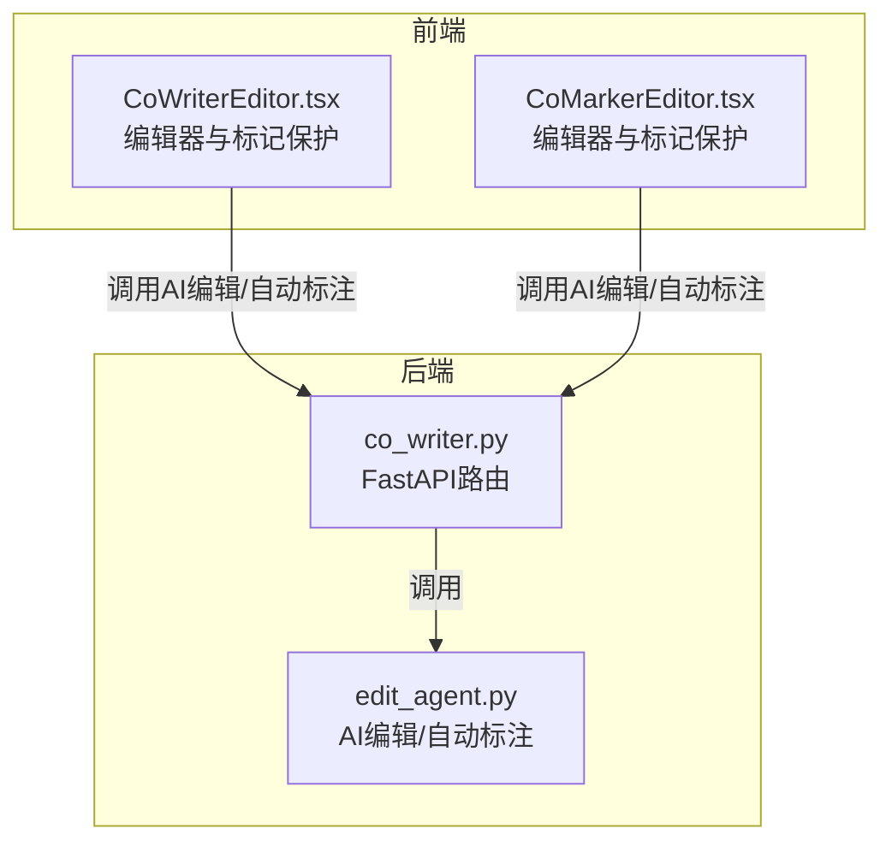
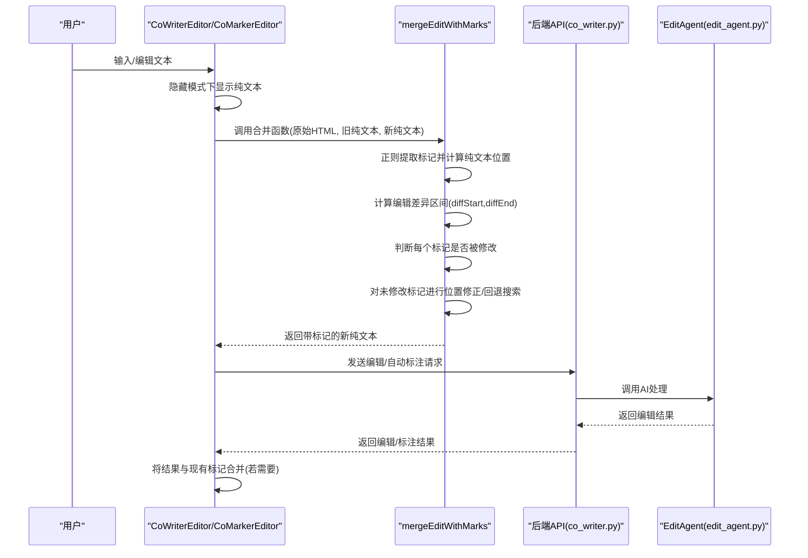
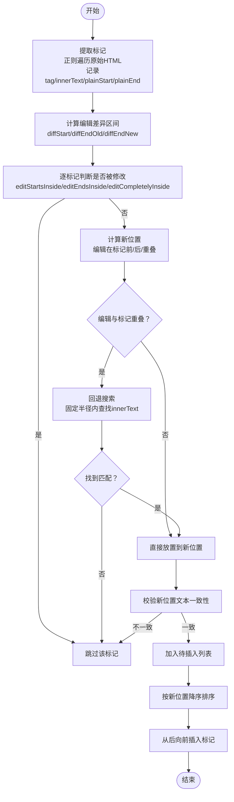
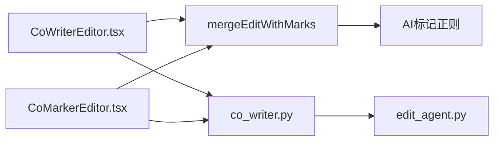

# AI标记保护机制

<cite>
**本文引用的文件**
- [CoWriterEditor.tsx](file://web/components/CoWriterEditor.tsx)
- [CoMarkerEditor.tsx](file://web/components/CoMarkerEditor.tsx)
- [edit_agent.py](file://src/agents/co_writer/edit_agent.py)
- [co_writer.py](file://src/api/routers/co_writer.py)
</cite>

## 目录
1. [引言](#引言)
2. [项目结构](#项目结构)
3. [核心组件](#核心组件)
4. [架构总览](#架构总览)
5. [详细组件分析](#详细组件分析)
6. [依赖分析](#依赖分析)
7. [性能考虑](#性能考虑)
8. [故障排查指南](#故障排查指南)
9. [结论](#结论)

## 引言
本文件系统性解析前端“mergeEditWithMarks”算法的实现原理与技术细节，重点说明：
- 如何通过正则表达式从HTML中提取AI标记信息（包含标签类型与纯文本内容）；
- 如何将标记映射到纯文本位置，计算标记在纯文本中的起止偏移；
- 基于编辑差异检测，智能判断哪些标记应保留、哪些应删除；
- 在编辑发生重叠或跨标记编辑时，如何进行位置修正与回退搜索；
- 如何保证在用户编辑过程中，AI生成的语义标记得到有效保护；
- 提供性能优化策略与边界情况处理建议。

该算法位于前端组件中，用于在隐藏AI标记模式下，对用户输入进行“原位编辑”，同时尽可能保留未被修改的AI标记，避免破坏语义标注。

## 项目结构
本项目采用前后端分离架构：前端负责编辑器UI与标记保护逻辑；后端提供AI编辑与自动标注服务。

图表来源
- [CoWriterEditor.tsx](file://web/components/CoWriterEditor.tsx#L342-L518)
- [CoMarkerEditor.tsx](file://web/components/CoMarkerEditor.tsx#L342-L518)
- [co_writer.py](file://src/api/routers/co_writer.py#L70-L108)
- [edit_agent.py](file://src/agents/co_writer/edit_agent.py#L120-L329)

章节来源
- [CoWriterEditor.tsx](file://web/components/CoWriterEditor.tsx#L1-L120)
- [CoMarkerEditor.tsx](file://web/components/CoMarkerEditor.tsx#L1-L120)
- [co_writer.py](file://src/api/routers/co_writer.py#L1-L60)

## 核心组件
- 合并编辑与标记保护函数：在隐藏AI标记模式下，对用户输入进行原位编辑，同时保留未被修改的AI标记。
- AI编辑/自动标注服务：由后端提供，返回带标注或已编辑的内容，前端再进行标记保护合并。
- 标记渲染与样式：前端在预览区域根据data-rough-notation属性渲染手写风格标注。

章节来源
- [CoWriterEditor.tsx](file://web/components/CoWriterEditor.tsx#L342-L518)
- [CoMarkerEditor.tsx](file://web/components/CoMarkerEditor.tsx#L342-L518)
- [edit_agent.py](file://src/agents/co_writer/edit_agent.py#L120-L329)
- [co_writer.py](file://src/api/routers/co_writer.py#L70-L108)

## 架构总览
下面以序列图展示“隐藏模式下的内容变更流程”，体现mergeEditWithMarks在其中的关键作用。

图表来源
- [CoWriterEditor.tsx](file://web/components/CoWriterEditor.tsx#L342-L518)
- [CoMarkerEditor.tsx](file://web/components/CoMarkerEditor.tsx#L342-L518)
- [co_writer.py](file://src/api/routers/co_writer.py#L70-L108)
- [edit_agent.py](file://src/agents/co_writer/edit_agent.py#L120-L329)

## 详细组件分析

### 合并编辑与标记保护算法（mergeEditWithMarks）
该算法位于两个编辑器组件中，功能完全一致，职责如下：
- 从原始HTML中提取所有AI标记及其纯文本内容与位置；
- 计算编辑差异区间（前缀相同与后缀相同），定位用户实际修改范围；
- 对每个标记进行“是否被修改”的判定；
- 对未被修改的标记，计算其在新文本中的新位置（考虑插入/删除长度差）；
- 当编辑与标记重叠但不完全包含时，采用局部回退搜索定位标记；
- 最终按从后向前的顺序插入标记，避免位置偏移。

图表来源
- [CoWriterEditor.tsx](file://web/components/CoWriterEditor.tsx#L342-L488)
- [CoMarkerEditor.tsx](file://web/components/CoMarkerEditor.tsx#L342-L488)

章节来源
- [CoWriterEditor.tsx](file://web/components/CoWriterEditor.tsx#L342-L518)
- [CoMarkerEditor.tsx](file://web/components/CoMarkerEditor.tsx#L342-L518)

#### 关键实现要点
- 标记提取与纯文本位置映射
  - 使用正则遍历原始HTML，提取每个标记的标签类型与内部纯文本，并累计纯文本偏移，得到每个标记在纯文本中的起止位置。
  - 纯文本偏移通过“标记前HTML长度累加”实现，避免误判。
- 编辑差异区间计算
  - 从前向后扫描，定位第一个不同字符索引；
  - 从后向前扫描，定位最后一个相同字符索引；
  - 得到编辑区间的起点与终点（旧文本与新文本分别对应）。
- 标记修改判定
  - 若编辑起点/终点落在标记范围内，或编辑完全包含标记，则认为标记被修改，应删除。
- 未修改标记的位置修正
  - 若编辑发生在标记之前：新位置 = 旧位置 + (新编辑长度差)；
  - 若编辑发生在标记之后：新位置不变；
  - 若编辑与标记重叠：在固定半径内回退搜索，定位标记文本首次出现位置。
- 安全校验与插入顺序
  - 插入前校验新位置处的文本与标记innerText一致；
  - 按新位置降序排序，从后向前插入，避免前面插入导致后续位置偏移。

章节来源
- [CoWriterEditor.tsx](file://web/components/CoWriterEditor.tsx#L342-L488)
- [CoMarkerEditor.tsx](file://web/components/CoMarkerEditor.tsx#L342-L488)

### AI编辑与自动标注服务
- 编辑接口：支持重写、缩短、扩展三种动作，可选RAG/Web上下文来源；
- 自动标注接口：为用户提供AI自动添加标注的功能；
- 历史记录：保存每次操作的输入输出与工具调用详情；
- Token统计：记录LLM调用用量，便于成本控制与性能监控。

章节来源
- [co_writer.py](file://src/api/routers/co_writer.py#L48-L108)
- [edit_agent.py](file://src/agents/co_writer/edit_agent.py#L120-L329)

### 标记渲染与样式
- 预览区域通过ReactMarkdown渲染，针对span[data-rough-notation]元素应用手写风格标注类名；
- 支持多种标注类型（圆圈、高亮、方框、下划线、括号），并在包含特定标注的段落上附加容器样式；
- 导出PDF时注入完整的Rough Notation样式，确保导出文档中标注可见。

章节来源
- [CoWriterEditor.tsx](file://web/components/CoWriterEditor.tsx#L1678-L1788)
- [CoMarkerEditor.tsx](file://web/components/CoMarkerEditor.tsx#L1670-L1788)

## 依赖分析
- 前端编辑器依赖：
  - 合并函数：mergeEditWithMarks（在两个编辑器组件中复用）
  - 标记正则：用于从HTML中提取标记
  - 预览渲染：ReactMarkdown + rehypeRaw + 自定义组件映射
- 后端服务依赖：
  - EditAgent：封装LLM调用、上下文检索、历史记录与统计
  - FastAPI路由：提供编辑/自动标注/历史查询/TTS相关接口

图表来源
- [CoWriterEditor.tsx](file://web/components/CoWriterEditor.tsx#L342-L518)
- [CoMarkerEditor.tsx](file://web/components/CoMarkerEditor.tsx#L342-L518)
- [co_writer.py](file://src/api/routers/co_writer.py#L70-L108)
- [edit_agent.py](file://src/agents/co_writer/edit_agent.py#L120-L329)

章节来源
- [CoWriterEditor.tsx](file://web/components/CoWriterEditor.tsx#L342-L518)
- [CoMarkerEditor.tsx](file://web/components/CoMarkerEditor.tsx#L342-L518)
- [co_writer.py](file://src/api/routers/co_writer.py#L70-L108)
- [edit_agent.py](file://src/agents/co_writer/edit_agent.py#L120-L329)

## 性能考虑
- 正则遍历标记
  - 时间复杂度近似O(N)，N为原始HTML长度；建议仅在隐藏模式切换或内容变更时触发，避免频繁执行。
- 差异区间计算
  - 双向扫描O(M)，M为比较长度；通常远小于HTML长度，开销可控。
- 回退搜索
  - 半径固定（例如50），最坏O(R×K)，R为半径，K为新文本子串长度；建议限制半径大小，避免极端情况。
- 插入顺序
  - 从后向前插入避免重复偏移计算，整体插入成本O(T)，T为保留标记数量。
- 建议优化
  - 对长文档，可在隐藏模式下延迟执行或节流；
  - 对高频编辑，可缓存上次标记位置映射，仅对受影响区间重新计算；
  - 对重叠编辑，优先尝试“编辑在标记前/后”的简单偏移，再回退搜索，减少回退搜索次数。

[本节为通用性能讨论，无需具体文件引用]

## 故障排查指南
- 合并后标记丢失
  - 检查是否误判为“被修改”：确认编辑区间与标记位置关系；
  - 检查回退搜索是否命中：适当增大搜索半径或检查文本一致性；
  - 检查插入顺序：确保按新位置降序插入。
- 合并后标记错位
  - 检查编辑长度差计算：diffEndNew - diffStart - (diffEndOld - diffStart)；
  - 检查重叠编辑分支：确认半径内查找逻辑与文本校验。
- 预览中标注不显示
  - 检查span[data-rough-notation]渲染映射与样式注入；
  - 导出PDF时确认样式注入逻辑与容器类名。
- 后端不可用或超时
  - 检查连接状态与错误提示；
  - 查看历史记录与工具调用文件，定位失败原因。

章节来源
- [CoWriterEditor.tsx](file://web/components/CoWriterEditor.tsx#L800-L844)
- [CoMarkerEditor.tsx](file://web/components/CoMarkerEditor.tsx#L800-L840)
- [co_writer.py](file://src/api/routers/co_writer.py#L110-L148)
- [edit_agent.py](file://src/agents/co_writer/edit_agent.py#L90-L117)

## 结论
mergeEditWithMarks算法通过“正则提取+纯文本位置映射+编辑差异检测+回退搜索+安全校验+有序插入”的组合，实现了在隐藏AI标记模式下的智能保护。其核心优势在于：
- 精确识别标记在纯文本中的位置，避免误删；
- 面对编辑重叠与跨标记编辑，采用半径回退搜索提升鲁棒性；
- 严格的文本一致性校验与从后向前插入，确保最终结果正确；
- 与后端AI编辑/自动标注服务无缝衔接，形成完整的协作闭环。

在工程实践中，建议结合文档长度与编辑频率，合理设置回退半径与缓存策略，以获得更佳的性能与稳定性。