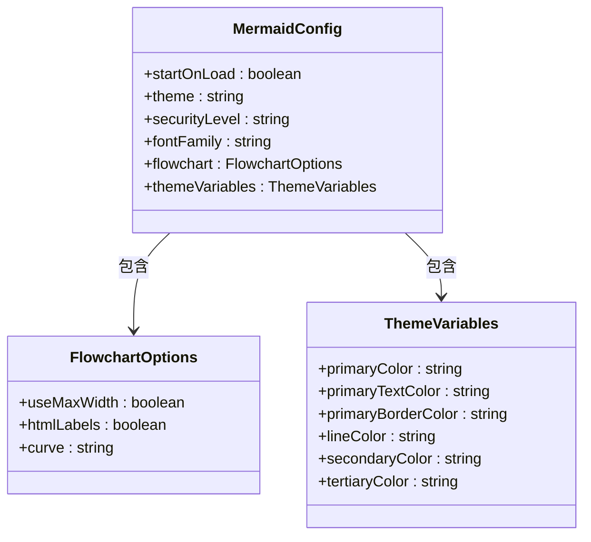
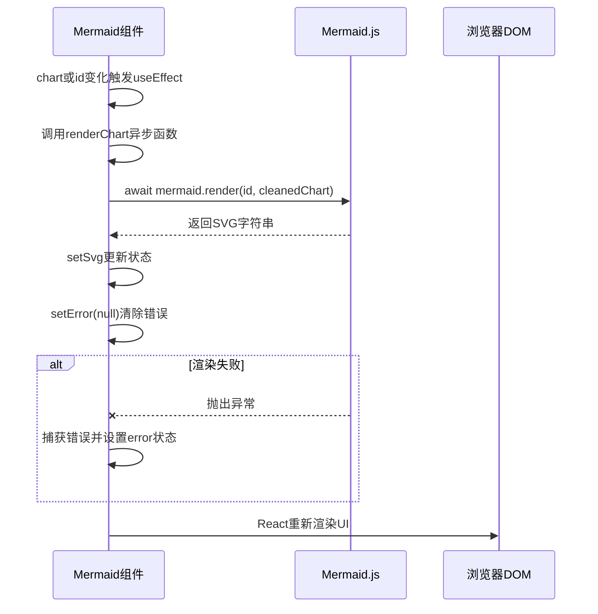
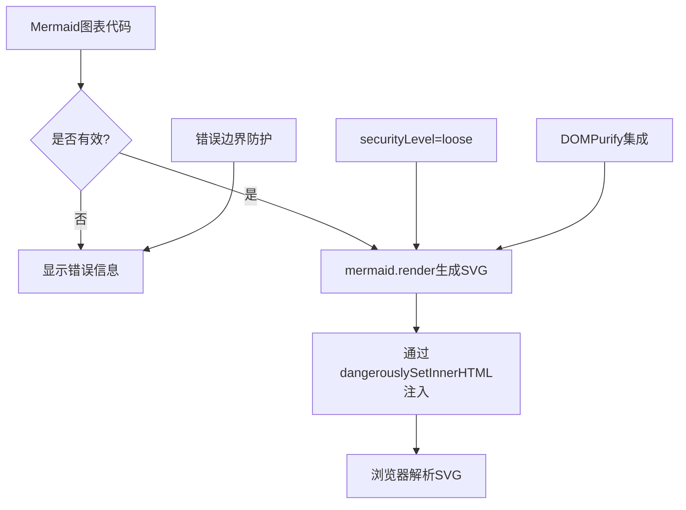
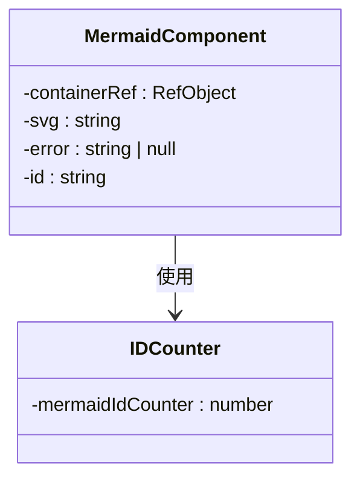
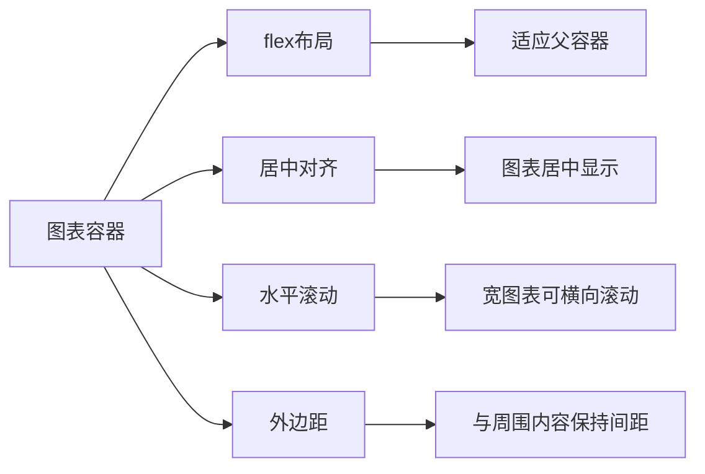
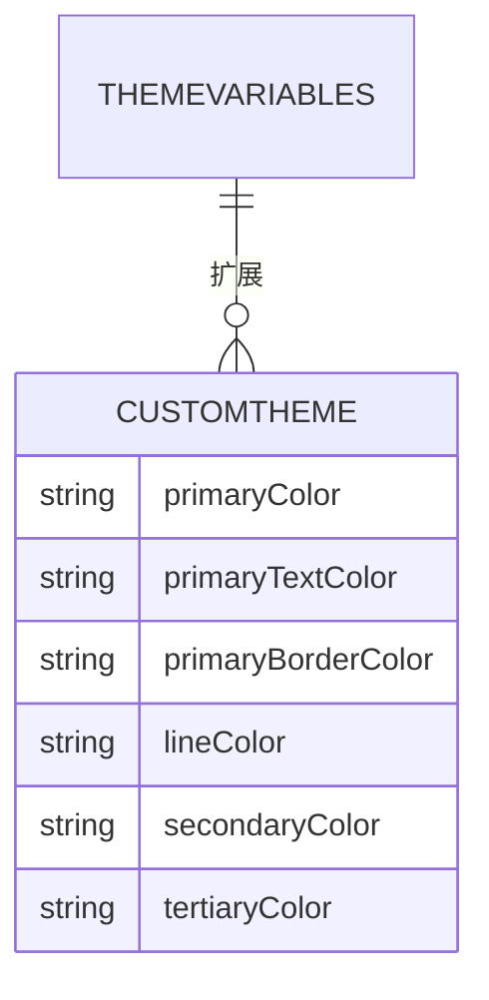
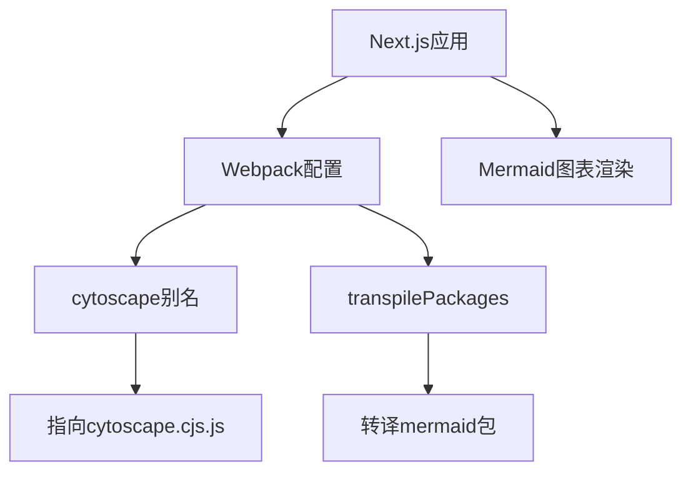

# Mermaid图表渲染集成

<cite>
**本文档引用文件**  
- [Mermaid.tsx](file://web/components/Mermaid.tsx#L1-L93)
- [next.config.js](file://web/next.config.js#L1-L25)
- [page.tsx](file://web/app/research/page.tsx#L666-L745)
- [ResearchDashboard.tsx](file://web/components/research/ResearchDashboard.tsx#L795-L829)
- [package.json](file://web/package.json#L1-L41)
</cite>

## 目录
1. [简介](#简介)
2. [核心配置解析](#核心配置解析)
3. [异步渲染与错误处理](#异步渲染与错误处理)
4. [SVG安全注入机制](#svg安全注入机制)
5. [图表重渲染与ID生成策略](#图表重渲染与id生成策略)
6. [响应式布局适配](#响应式布局适配)
7. [自定义主题与扩展支持](#自定义主题与扩展支持)
8. [集成使用模式](#集成使用模式)
9. [依赖与构建配置](#依赖与构建配置)
10. [总结](#总结)

## 简介
本项目通过Mermaid组件实现了在React应用中动态渲染流程图、时序图等各类图表的功能。该组件封装了Mermaid.js库的核心能力，提供了安全、可复用且具备错误处理机制的图表渲染方案。组件广泛应用于研究、问答等模块的Markdown内容解析流程中，支持从代码块中提取Mermaid语法并实时转换为SVG图形。

**Section sources**
- [Mermaid.tsx](file://web/components/Mermaid.tsx#L1-L93)

## 核心配置解析

### 初始化参数详解
Mermaid通过`mermaid.initialize()`进行全局配置，确保所有图表具有一致的视觉风格和行为特性。



**Diagram sources**
- [Mermaid.tsx](file://web/components/Mermaid.tsx#L12-L30)

#### 配置参数说明
- **startOnLoad**: 设置为`false`以禁用自动初始化，由React组件手动控制渲染时机
- **theme**: 使用`neutral`主题，提供中性、简洁的视觉风格
- **securityLevel**: 设为`loose`以允许HTML标签在图表中使用（需配合其他安全措施）
- **fontFamily**: 指定系统无衬线字体栈，确保跨平台一致性
- **flowchart.useMaxWidth**: 启用最大宽度适配容器
- **flowchart.htmlLabels**: 允许在节点中使用HTML标签增强表现力
- **flowchart.curve**: 使用`basis`曲线算法绘制连接线，更平滑自然

#### 自定义主题变量
通过`themeVariables`对象深度定制图表配色：
- `primaryColor`: 主色调 #6366f1 (靛蓝色)
- `primaryTextColor`: 文本色 #1e293b (深灰蓝)
- `primaryBorderColor`: 边框色 #c7d2fe (浅蓝)
- `lineColor`: 连线色 #94a3b8 (中灰)
- `secondaryColor`: 次级背景 #f1f5f9 (极浅灰蓝)
- `tertiaryColor`: 三级背景 #f8fafc (纯白灰)

**Section sources**
- [Mermaid.tsx](file://web/components/Mermaid.tsx#L12-L30)

## 异步渲染与错误处理

### useEffect中的异步渲染流程
组件利用`useEffect`钩子监听图表代码变化，实现异步渲染逻辑。



**Diagram sources**
- [Mermaid.tsx](file://web/components/Mermaid.tsx#L40-L61)

#### 渲染流程关键步骤
1. 检查`chart`内容和`containerRef`是否存在
2. 对图表代码执行`trim()`清理空白字符
3. 调用`mermaid.render(id, cleanedChart)`异步生成SVG
4. 成功时更新`svg`状态并清空错误
5. 失败时捕获异常并设置错误信息

#### 依赖数组设计
`useEffect`的依赖项为`[chart, id]`，确保：
- 当图表代码变更时重新渲染
- 每个实例拥有唯一ID避免冲突
- 避免不必要的重复渲染

**Section sources**
- [Mermaid.tsx](file://web/components/Mermaid.tsx#L40-L61)

## SVG安全注入机制

### 安全风险与应对策略
由于`mermaid.render()`返回的是原始SVG HTML字符串，直接插入存在XSS风险。项目采用多层防护：



**Diagram sources**
- [Mermaid.tsx](file://web/components/Mermaid.tsx#L88)
- [package.json](file://web/package.json#L18)

#### 关键安全措施
- **securityLevel: "loose"**: 允许部分HTML标签，但依赖Mermaid内置的sanitization
- **DOMPurify集成**: 虽未在代码中显式调用，但`mermaid`依赖`dompurify`包进行内容净化
- **错误边界**: 组件内部捕获渲染异常，防止崩溃
- **输入验证**: 空值检查和基本清理

#### dangerouslySetInnerHTML使用
通过`dangerouslySetInnerHTML={{ __html: svg }}`将SVG注入DOM，这是React中插入动态HTML的唯一方式，但需确保内容已净化。

**Section sources**
- [Mermaid.tsx](file://web/components/Mermaid.tsx#L88)
- [package.json](file://web/package.json#L5732)

## 图表重渲染与ID生成策略

### ID生成冲突解决方案
为避免多个图表实例间的ID冲突，组件采用全局计数器机制。



**Diagram sources**
- [Mermaid.tsx](file://web/components/Mermaid.tsx#L32-L38)

#### 实现细节
- 全局变量`mermaidIdCounter`跟踪已创建实例数量
- 使用`useState(() => \`mermaid-\${++mermaidIdCounter}\`)`生成唯一ID
- 闭包确保每个组件实例获得递增的唯一标识
- ID格式为`mermaid-1`, `mermaid-2`等

#### 重渲染控制
- 依赖`[chart, id]`确保代码变更时重新渲染
- `id`变化会触发全新渲染，避免状态残留
- `cleanedChart.trim()`确保空白变化也能触发更新

**Section sources**
- [Mermaid.tsx](file://web/components/Mermaid.tsx#L32-L38)

## 响应式布局适配

### 容器级响应式设计
图表容器通过CSS类实现自适应布局。



**Diagram sources**
- [Mermaid.tsx](file://web/components/Mermaid.tsx#L87)

#### CSS类解析
- `my-6`: 上下外边距，与周围内容保持距离
- `flex`: Flex布局，便于内容对齐
- `justify-center`: 水平居中对齐图表
- `overflow-x-auto`: 当图表宽度超过容器时显示水平滚动条
- `${className}`: 支持外部传入的自定义样式类

#### 布局优势
- 在窄屏设备上可通过滚动查看完整图表
- 图表始终居中显示，视觉效果更佳
- 与Tailwind CSS设计系统无缝集成
- 支持通过`className`进一步定制样式

**Section sources**
- [Mermaid.tsx](file://web/components/Mermaid.tsx#L87)

## 自定义主题与扩展支持

### 主题变量扩展方法
通过`themeVariables`可扩展或覆盖默认主题。



**Diagram sources**
- [Mermaid.tsx](file://web/components/Mermaid.tsx#L22-L29)

#### 扩展建议
- 可添加`darkThemeVariables`支持暗色模式
- 可通过CSS变量实现动态主题切换
- 可创建主题配置文件集中管理

#### 图表类型支持
Mermaid 11.12.2版本支持以下图表类型：
- 流程图 (Flowchart)
- 时序图 (Sequence Diagram)
- 类图 (Class Diagram)
- 状态图 (State Diagram)
- 实体关系图 (ER Diagram)
- 用户旅程图 (User Journey)
- 甘特图 (Gantt)
- 饼图 (Pie Chart)
- 需求图 (Requirement Diagram)
- Git图 (Git Graph)
- 二维码 (Quadrant Chart)

无需额外注册，所有类型均可直接使用。

**Section sources**
- [Mermaid.tsx](file://web/components/Mermaid.tsx#L22-L29)

## 集成使用模式

### Markdown中集成方式
Mermaid组件被集成到Markdown解析流程中，自动识别并渲染图表。

```mermaid
sequenceDiagram
participant Markdown as Markdown解析器
participant CodeBlock as 代码块处理器
participant Mermaid as Mermaid组件
Markdown->>CodeBlock : 遇到
```mermaid代码块
    CodeBlock->>CodeBlock: 提取代码内容
    CodeBlock->>Mermaid: 创建Mermaid组件实例
    CodeBlock->>Mermaid: 传递chart属性
    Mermaid->>Mermaid: 执行渲染流程
    Mermaid-->>CodeBlock: 返回图表UI
    CodeBlock-->>Markdown: 插入图表
    Markdown-->>用户: 显示含图表的页面
```

**Diagram sources**
- [page.tsx](file://web/app/research/page.tsx#L704-L706)
- [ResearchDashboard.tsx](file://web/components/research/ResearchDashboard.tsx#L796-L798)

#### 典型使用场景
- 研究报告中的流程图展示
- 问答系统中的结构化数据可视化
- 笔记中的概念关系图
- 教学材料中的算法流程图

#### 使用代码示例
```tsx
<ReactMarkdown
  components={{
    code: ({ node, className, children }) => {
      if (className?.includes('language-mermaid')) {
        const chartCode = String(children).replace(/\n$/, "");
        return <Mermaid chart={chartCode} />;
      }
      // 其他代码块处理...
    }
  }}
>
  {markdownContent}
</ReactMarkdown>
```

**Section sources**
- [page.tsx](file://web/app/research/page.tsx#L704-L706)
- [ResearchDashboard.tsx](file://web/components/research/ResearchDashboard.tsx#L796-L798)

## 依赖与构建配置

### Webpack特殊配置
由于Mermaid依赖Cytoscape库存在ESM/CJS兼容性问题，需特殊配置。



**Diagram sources**
- [next.config.js](file://web/next.config.js#L9-L22)

#### 关键配置项
- **cytoscape别名**: 将`cytoscape`模块指向CJS版本，解决SSR兼容性问题
- **transpilePackages**: 启用`mermaid`包的转译，确保ESM模块正确处理
- **esmExternals**: 设置为`loose`，放宽ESM外部依赖限制

#### 依赖版本
- `mermaid`: 11.12.2
- `cytoscape`: 3.33.1
- `dompurify`: 3.3.1 (用于内容净化)

**Section sources**
- [next.config.js](file://web/next.config.js#L9-L22)
- [package.json](file://web/package.json#L18)

## 总结
本项目的Mermaid集成方案展现了现代化React应用中复杂第三方库集成的最佳实践。通过合理的初始化配置、安全的SVG注入、健壮的错误处理和优雅的响应式设计，实现了稳定可靠的图表渲染能力。组件设计充分考虑了可复用性、安全性和用户体验，为知识密集型应用提供了强大的可视化支持。未来可进一步扩展主题系统和暗色模式支持，提升整体用户体验。