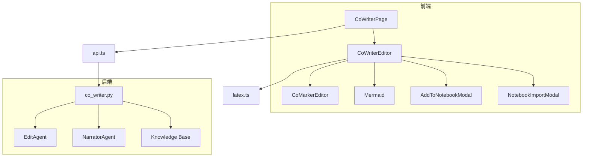
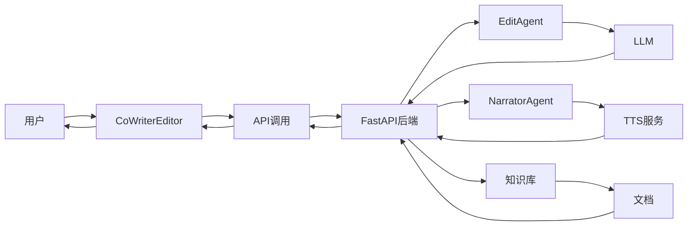
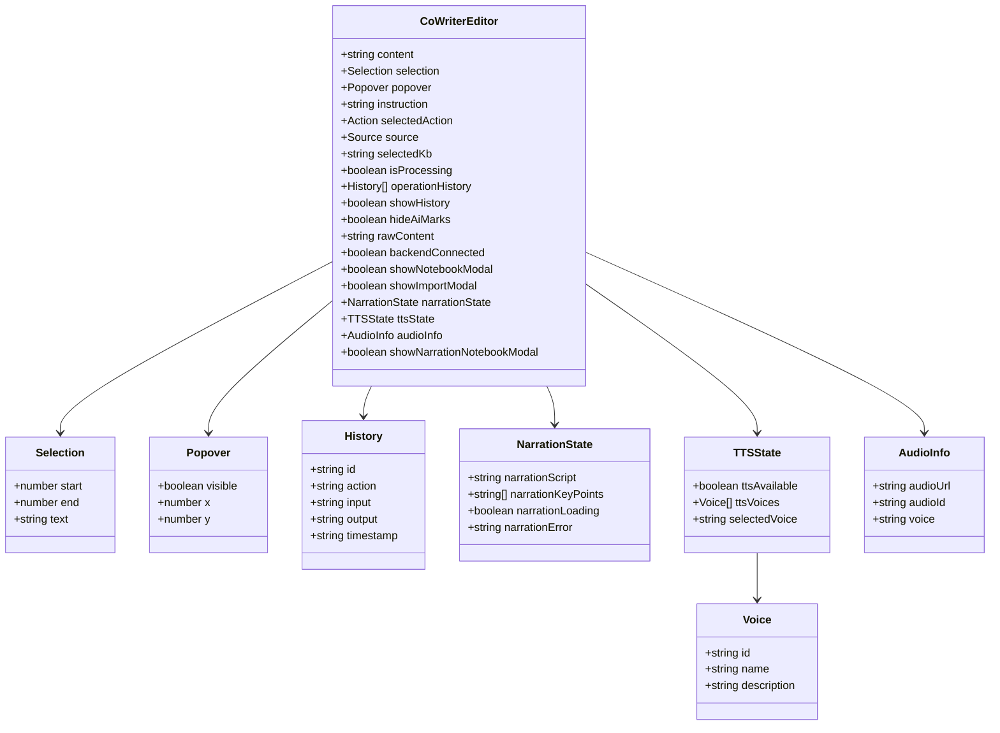
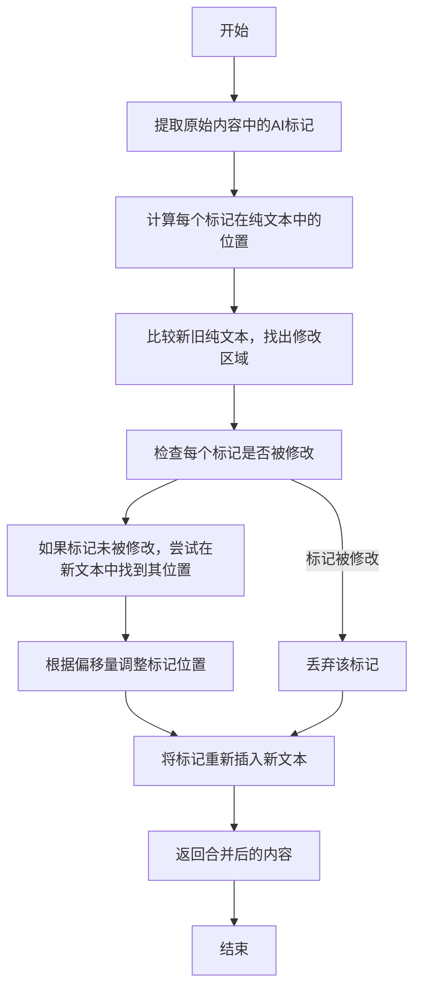
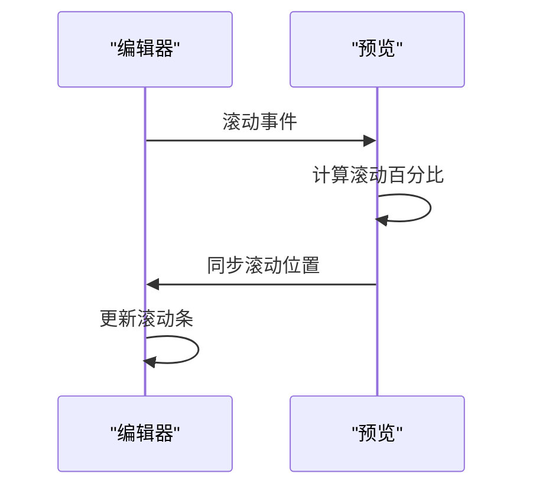
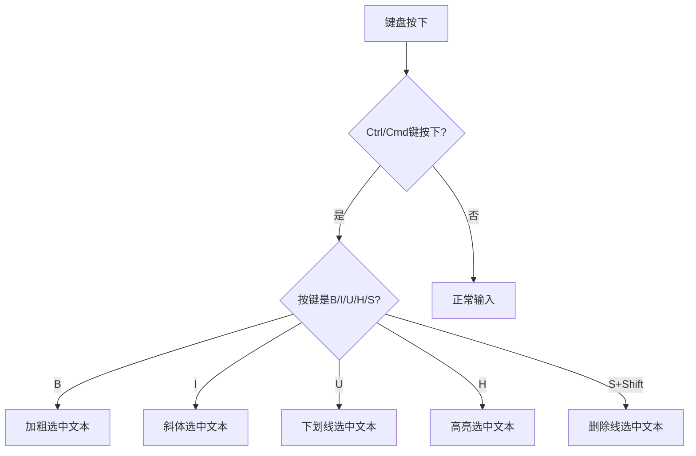
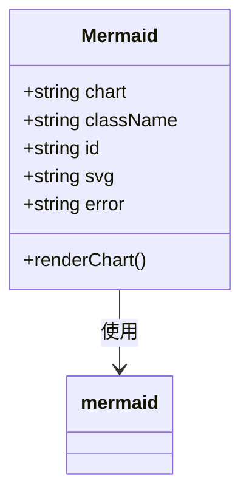
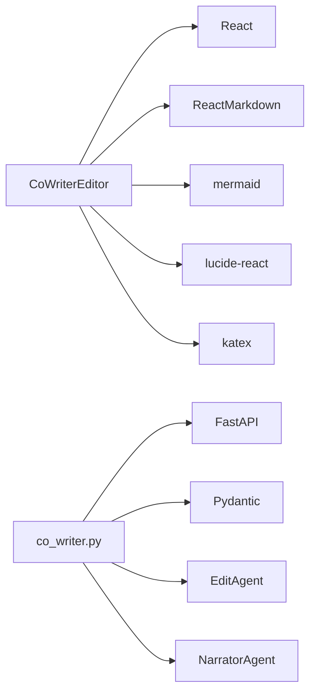

# 专用编辑器组件

<cite>
**本文档引用的文件**   
- [CoWriterEditor.tsx](file://web/components/CoWriterEditor.tsx)
- [CoMarkerEditor.tsx](file://web/components/CoMarkerEditor.tsx)
- [Mermaid.tsx](file://web/components/Mermaid.tsx)
- [co_writer.py](file://src/api/routers/co_writer.py)
- [api.ts](file://web/lib/api.ts)
- [latex.ts](file://web/lib/latex.ts)
- [page.tsx](file://web/app/co_writer/page.tsx)
</cite>

## 目录
1. [引言](#引言)
2. [项目结构](#项目结构)
3. [核心组件](#核心组件)
4. [架构概述](#架构概述)
5. [详细组件分析](#详细组件分析)
6. [依赖分析](#依赖分析)
7. [性能考虑](#性能考虑)
8. [故障排除指南](#故障排除指南)
9. [结论](#结论)
10. [附录](#附录) (如有必要)

## 引言
本文档全面解析CoWriterEditor和CoMarkerEditor协同写作编辑器的技术实现。详细说明富文本编辑器的状态管理（content、selection、popover等）、AI标记保护机制（mergeEditWithMarks算法）、同步滚动功能及键盘快捷键系统。阐述Mermaid组件的图表渲染集成方案。重点分析编辑器与后端API的交互流程，包括TTS语音合成集成、知识库检索调用和操作历史记录同步。提供编辑器内容变更处理、AI标记智能保留、多模式切换（显示/隐藏AI标记）等核心功能的实现原理与最佳实践。

## 项目结构
CoWriterEditor和CoMarkerEditor是基于React的富文本编辑器组件，位于`web/components/`目录下。它们通过Next.js框架在`web/app/co_writer/page.tsx`页面中被调用。编辑器前端通过`web/lib/api.ts`中的`apiUrl`函数与后端API进行通信，后端路由定义在`src/api/routers/co_writer.py`中。编辑器支持Markdown实时预览、AI辅助编辑、TTS语音合成和知识库集成等功能。

**Diagram sources**
- [page.tsx](file://web/app/co_writer/page.tsx)
- [CoWriterEditor.tsx](file://web/components/CoWriterEditor.tsx)
- [CoMarkerEditor.tsx](file://web/components/CoMarkerEditor.tsx)
- [Mermaid.tsx](file://web/components/Mermaid.tsx)
- [co_writer.py](file://src/api/routers/co_writer.py)
- [api.ts](file://web/lib/api.ts)
- [latex.ts](file://web/lib/latex.ts)

**Section sources**
- [page.tsx](file://web/app/co_writer/page.tsx)
- [CoWriterEditor.tsx](file://web/components/CoWriterEditor.tsx)
- [CoMarkerEditor.tsx](file://web/components/CoMarkerEditor.tsx)
- [Mermaid.tsx](file://web/components/Mermaid.tsx)
- [co_writer.py](file://src/api/routers/co_writer.py)
- [api.ts](file://web/lib/api.ts)
- [latex.ts](file://web/lib/latex.ts)

## 核心组件
CoWriterEditor和CoMarkerEditor是功能相同的协同写作编辑器，提供富文本编辑、AI辅助、TTS语音合成和知识库集成等功能。编辑器状态通过React Hooks管理，包括内容(content)、选区(selection)、弹出框(popover)等。AI标记通过``标签实现，支持多种样式如高亮、圆圈、下划线等。

**Section sources**
- [CoWriterEditor.tsx](file://web/components/CoWriterEditor.tsx)
- [CoMarkerEditor.tsx](file://web/components/CoMarkerEditor.tsx)

## 架构概述
编辑器采用客户端-服务器架构，前端使用React和Next.js构建，后端使用FastAPI。编辑器通过HTTP API与后端通信，实现AI编辑、TTS语音合成和知识库检索等功能。前端组件通过`useEffect`和`useCallback`等Hooks管理状态和副作用，确保性能和响应性。

**Diagram sources**
- [CoWriterEditor.tsx](file://web/components/CoWriterEditor.tsx)
- [co_writer.py](file://src/api/routers/co_writer.py)

## 详细组件分析

### CoWriterEditor分析
CoWriterEditor是主要的编辑器组件，提供富文本编辑、AI辅助、TTS语音合成和知识库集成等功能。它通过`useState`管理多个状态变量，包括内容(content)、选区(selection)、弹出框(popover)等。键盘快捷键通过`useEffect`监听键盘事件实现，支持Ctrl+B（加粗）、Ctrl+I（斜体）等。

#### 状态管理

**Diagram sources**
- [CoWriterEditor.tsx](file://web/components/CoWriterEditor.tsx)

#### AI标记保护机制

**Diagram sources**
- [CoWriterEditor.tsx](file://web/components/CoWriterEditor.tsx#L342-L488)

#### 同步滚动功能

**Diagram sources**
- [CoWriterEditor.tsx](file://web/components/CoWriterEditor.tsx#L291-L323)

#### 键盘快捷键系统

**Diagram sources**
- [CoWriterEditor.tsx](file://web/components/CoWriterEditor.tsx#L620-L658)

**Section sources**
- [CoWriterEditor.tsx](file://web/components/CoWriterEditor.tsx)

### Mermaid组件分析
Mermaid组件用于在编辑器中渲染图表，支持流程图、序列图、类图等多种类型。它通过`mermaid.initialize`配置图表样式，并使用`mermaid.render`方法将Mermaid代码转换为SVG。

#### 图表渲染集成

**Diagram sources**
- [Mermaid.tsx](file://web/components/Mermaid.tsx)

**Section sources**
- [Mermaid.tsx](file://web/components/Mermaid.tsx)

## 依赖分析
编辑器依赖多个前端库，包括React、ReactMarkdown、mermaid等。后端依赖FastAPI、Pydantic等。通过`package.json`和`requirements.txt`管理依赖。

**Diagram sources**
- [package.json](file://web/package.json)
- [requirements.txt](file://requirements.txt)

**Section sources**
- [package.json](file://web/package.json)
- [requirements.txt](file://requirements.txt)

## 性能考虑
编辑器通过`useCallback`和`useMemo`优化性能，避免不必要的重新渲染。同步滚动功能使用`requestAnimationFrame`确保流畅性。TTS语音合成和知识库检索使用异步调用，避免阻塞UI。

## 故障排除指南
- **后端连接失败**: 确保后端服务正在运行，检查`NEXT_PUBLIC_API_BASE`环境变量。
- **TTS不可用**: 检查`.env`文件中的TTS配置。
- **知识库列表为空**: 确保知识库已正确配置和加载。
- **图表渲染错误**: 检查Mermaid代码语法是否正确。

**Section sources**
- [CoWriterEditor.tsx](file://web/components/CoWriterEditor.tsx)
- [co_writer.py](file://src/api/routers/co_writer.py)

## 结论
CoWriterEditor和CoMarkerEditor是功能强大的协同写作编辑器，集成了AI辅助、TTS语音合成和知识库检索等功能。通过合理的状态管理和API设计，提供了流畅的用户体验。未来可以进一步优化性能，增加更多AI功能。