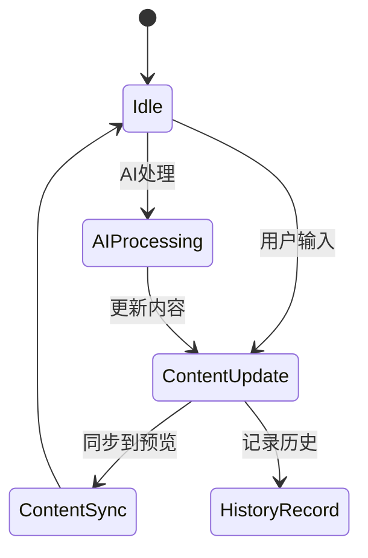
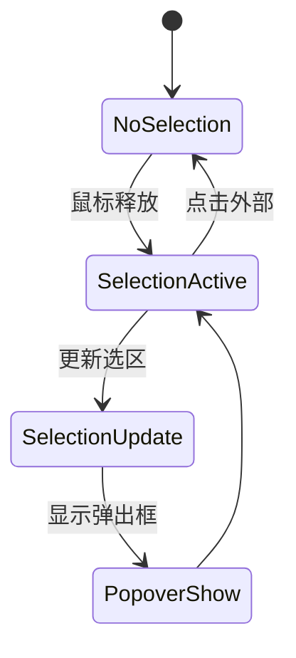
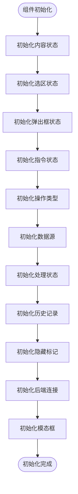
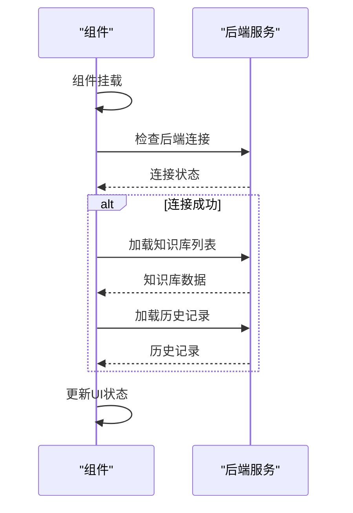
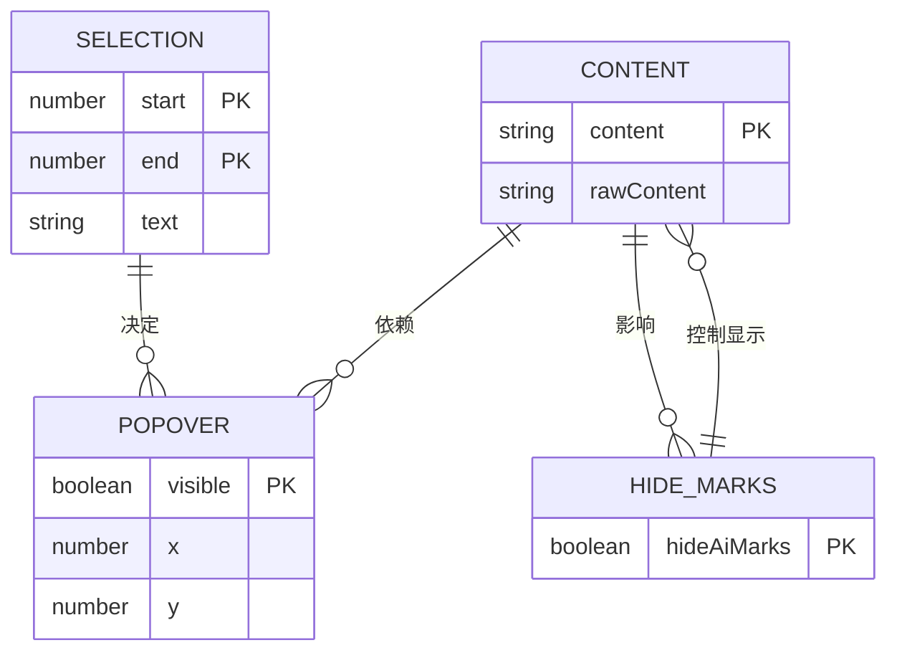
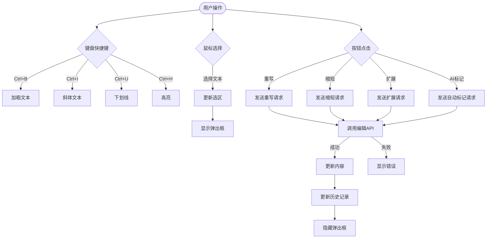

# 协同写作编辑器状态管理

<cite>
**本文档引用的文件**   
- [CoWriterEditor.tsx](file://web/components/CoWriterEditor.tsx)
- [CoMarkerEditor.tsx](file://web/components/CoMarkerEditor.tsx)
- [api.ts](file://web/lib/api.ts)
</cite>

## 目录
1. [引言](#引言)
2. [核心状态管理机制](#核心状态管理机制)
3. [状态初始化与生命周期](#状态初始化与生命周期)
4. [状态依赖与同步机制](#状态依赖与同步机制)
5. [实时协作支持](#实时协作支持)
6. [用户交互场景下的状态流转](#用户交互场景下的状态流转)
7. [最佳实践与常见问题解决方案](#最佳实践与常见问题解决方案)

## 引言
CoWriterEditor和CoMarkerEditor是协同写作系统中的核心编辑器组件，它们通过复杂的状态管理体系实现了智能文本编辑、AI标记和实时协作功能。本文档深入解析这两个组件的状态管理机制，包括content、selection、popover等核心状态的管理策略，以及状态之间的依赖关系和同步机制。

**Section sources**
- [CoWriterEditor.tsx](file://web/components/CoWriterEditor.tsx#L66-L72)
- [CoMarkerEditor.tsx](file://web/components/CoMarkerEditor.tsx#L66-L72)

## 核心状态管理机制

### 内容状态 (content)
内容状态是编辑器的核心，通过useState Hook进行管理。初始值可以通过initialValue属性设置，若未提供则使用默认的欢迎文本。内容状态不仅存储纯文本，还包含AI标记的HTML标签。

**Diagram sources**
- [CoWriterEditor.tsx](file://web/components/CoWriterEditor.tsx#L69-L72)
- [CoMarkerEditor.tsx](file://web/components/CoMarkerEditor.tsx#L69-L72)

### 选区状态 (selection)
选区状态记录了用户当前选中的文本范围，包括起始位置、结束位置和选中文本内容。当用户释放鼠标时，通过handleMouseUp函数更新选区状态，并触发弹出框的显示。

**Diagram sources**
- [CoWriterEditor.tsx](file://web/components/CoWriterEditor.tsx#L73-L77)
- [CoMarkerEditor.tsx](file://web/components/CoMarkerEditor.tsx#L73-L77)

### 弹出框状态 (popover)
弹出框状态控制AI编辑助手的显示位置和可见性。它依赖于选区状态，当有有效选区时显示，点击外部区域时隐藏。

**Section sources**
- [CoWriterEditor.tsx](file://web/components/CoWriterEditor.tsx#L78-L82)
- [CoMarkerEditor.tsx](file://web/components/CoMarkerEditor.tsx#L78-L82)

## 状态初始化与生命周期

### 状态初始化
组件使用多个useState Hook初始化各种状态，包括内容、选区、弹出框、指令、操作类型等。这些状态在组件挂载时被初始化。

**Diagram sources**
- [CoWriterEditor.tsx](file://web/components/CoWriterEditor.tsx#L69-L99)
- [CoMarkerEditor.tsx](file://web/components/CoMarkerEditor.tsx#L69-L99)

### 生命周期管理
通过useEffect Hook管理组件的生命周期，包括后端连接检查、知识库加载和历史记录获取。

**Diagram sources**
- [CoWriterEditor.tsx](file://web/components/CoWriterEditor.tsx#L205-L256)
- [CoMarkerEditor.tsx](file://web/components/CoMarkerEditor.tsx#L205-L256)

## 状态依赖与同步机制

### 状态依赖关系
各状态之间存在明确的依赖关系，如弹出框状态依赖于选区状态，内容显示依赖于隐藏标记状态。

**Diagram sources**
- [CoWriterEditor.tsx](file://web/components/CoWriterEditor.tsx#L69-L99)
- [CoMarkerEditor.tsx](file://web/components/CoMarkerEditor.tsx#L69-L99)

### 内容与选区联动
文本内容与选区状态之间存在紧密的联动逻辑。当用户选择文本时，系统会自动更新选区状态，并相应地调整弹出框的位置。

**Section sources**
- [CoWriterEditor.tsx](file://web/components/CoWriterEditor.tsx#L660-L683)
- [CoMarkerEditor.tsx](file://web/components/CoMarkerEditor.tsx#L660-L683)

## 实时协作支持
通过API调用实现与后端服务的实时通信，支持AI编辑、自动标记和语音叙述等功能。状态管理确保了在协作场景下的数据一致性。

**Section sources**
- [CoWriterEditor.tsx](file://web/components/CoWriterEditor.tsx#L702-L799)
- [CoMarkerEditor.tsx](file://web/components/CoMarkerEditor.tsx#L702-L799)

## 用户交互场景下的状态流转
不同的用户交互会触发特定的状态流转，如键盘快捷键、鼠标操作和按钮点击等。

**Diagram sources**
- [CoWriterEditor.tsx](file://web/components/CoWriterEditor.tsx#L619-L658)
- [CoMarkerEditor.tsx](file://web/components/CoMarkerEditor.tsx#L619-L658)

## 最佳实践与常见问题解决方案

### 状态管理最佳实践
1. 使用useCallback优化事件处理函数
2. 合理使用useEffect的依赖数组
3. 保持状态的单一职责
4. 使用函数式更新确保状态一致性

### 常见问题及解决方案
1. **后端连接失败**：检查服务是否运行，验证API基础URL配置
2. **状态不同步**：确保所有相关状态都在适当的依赖数组中
3. **性能问题**：避免不必要的重新渲染，使用memoization技术

**Section sources**
- [CoWriterEditor.tsx](file://web/components/CoWriterEditor.tsx#L130-L167)
- [CoMarkerEditor.tsx](file://web/components/CoMarkerEditor.tsx#L130-L167)
- [api.ts](file://web/lib/api.ts#L6-L22)