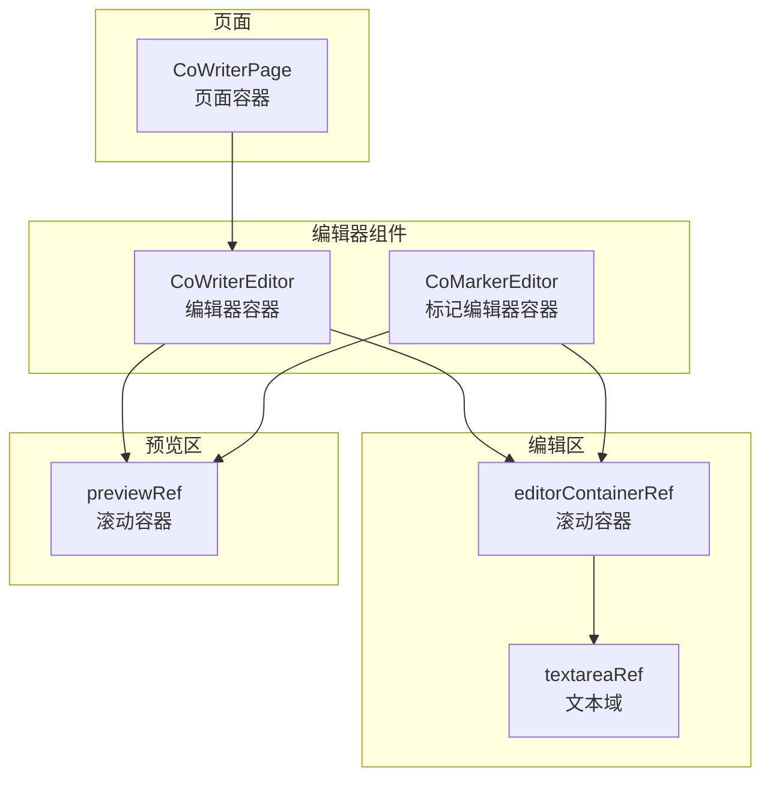
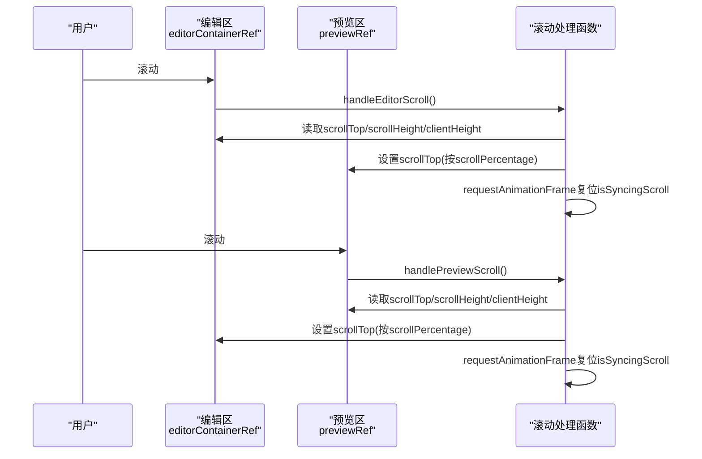
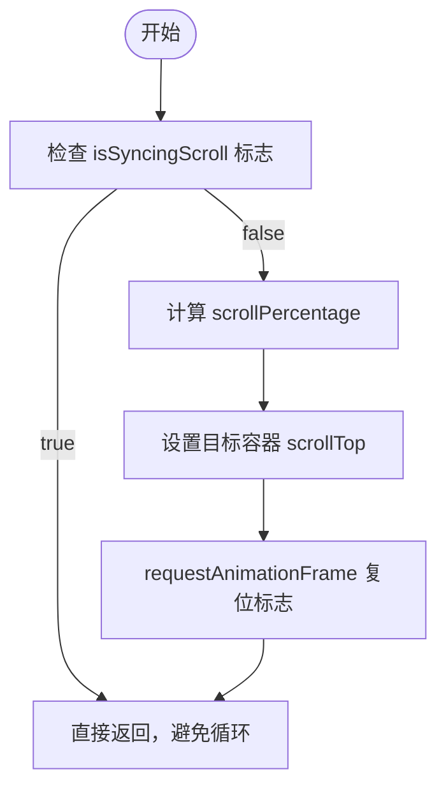
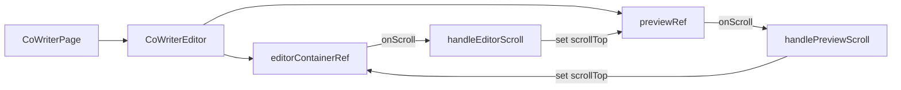

# 同步滚动功能

<cite>
**本文引用的文件**
- [CoWriterEditor.tsx](file://web/components/CoWriterEditor.tsx)
- [CoMarkerEditor.tsx](file://web/components/CoMarkerEditor.tsx)
- [page.tsx](file://web/app/co_writer/page.tsx)
</cite>

## 目录
1. [引言](#引言)
2. [项目结构](#项目结构)
3. [核心组件](#核心组件)
4. [架构总览](#架构总览)
5. [详细组件分析](#详细组件分析)
6. [依赖关系分析](#依赖关系分析)
7. [性能考量](#性能考量)
8. [故障排查指南](#故障排查指南)
9. [结论](#结论)

## 引言
本篇文档聚焦于编辑器与预览区之间的“双向同步滚动”机制，系统性解析以下关键点：
- 如何通过 scrollPercentage 计算滚动比例
- 利用 requestAnimationFrame 实现平滑同步
- 使用 isSyncingScroll 标志避免循环触发
- 同步滚动的精度控制、性能优化与容器尺寸适配策略
- 在高频滚动事件下的稳定性保障措施

## 项目结构
- 编辑器与预览采用左右两栏布局：左侧为编辑区（textarea），右侧为预览区（ReactMarkdown 渲染）。
- 两个编辑器组件均在同一页面中使用，且都实现了相同的双向同步逻辑。

图表来源
- [page.tsx](file://web/app/co_writer/page.tsx#L1-L27)
- [CoWriterEditor.tsx](file://web/components/CoWriterEditor.tsx#L1257-L1440)
- [CoMarkerEditor.tsx](file://web/components/CoMarkerEditor.tsx#L1255-L1440)

章节来源
- [page.tsx](file://web/app/co_writer/page.tsx#L1-L27)
- [CoWriterEditor.tsx](file://web/components/CoWriterEditor.tsx#L1257-L1440)
- [CoMarkerEditor.tsx](file://web/components/CoMarkerEditor.tsx#L1255-L1440)

## 核心组件
- CoWriterEditor：提供 Markdown 编辑、AI 辅助编辑、预览、导出等能力；包含双向同步滚动。
- CoMarkerEditor：提供标记高亮、预览、导出等能力；同样包含双向同步滚动。
- 页面容器 CoWriterPage：将编辑器组件挂载到页面中。

章节来源
- [CoWriterEditor.tsx](file://web/components/CoWriterEditor.tsx#L1-L120)
- [CoMarkerEditor.tsx](file://web/components/CoMarkerEditor.tsx#L1-L120)
- [page.tsx](file://web/app/co_writer/page.tsx#L1-L27)

## 架构总览
编辑器与预览的双向同步由两个滚动处理函数驱动：
- handleEditorScroll：当编辑区滚动时，根据编辑区 scrollTop 与可滚动高度计算 scrollPercentage，再按比例设置预览区 scrollTop。
- handlePreviewScroll：当预览区滚动时，反向计算并设置编辑区 scrollTop。

两者均通过 isSyncingScroll 原子标志防止互相触发导致的无限循环；并通过 requestAnimationFrame 将标志复位，确保一次滚动只触发一次同步。

图表来源
- [CoWriterEditor.tsx](file://web/components/CoWriterEditor.tsx#L290-L330)
- [CoMarkerEditor.tsx](file://web/components/CoMarkerEditor.tsx#L290-L330)

## 详细组件分析

### 双向同步滚动实现要点
- 比例计算
  - 编辑区滚动时：scrollPercentage = scrollTop / (scrollHeight - clientHeight)
  - 预览区滚动时：scrollPercentage = scrollTop / (scrollHeight - clientHeight)
- 目标容器滚动
  - 编辑区滚动 -> 预览区：preview.scrollTop = scrollPercentage * (preview.scrollHeight - preview.clientHeight)
  - 预览区滚动 -> 编辑区：editor.scrollTop = scrollPercentage * (editor.scrollHeight - editor.clientHeight)
- 循环防护
  - 使用 isSyncingScroll useRef 标志，进入处理函数时立即置位；在 requestAnimationFrame 回调中复位，避免相互触发。
- 平滑同步
  - 使用 requestAnimationFrame 将标志复位，使同步发生在下一帧，减少抖动并降低主线程压力。

图表来源
- [CoWriterEditor.tsx](file://web/components/CoWriterEditor.tsx#L290-L330)
- [CoMarkerEditor.tsx](file://web/components/CoMarkerEditor.tsx#L290-L330)

章节来源
- [CoWriterEditor.tsx](file://web/components/CoWriterEditor.tsx#L290-L330)
- [CoMarkerEditor.tsx](file://web/components/CoMarkerEditor.tsx#L290-L330)

### 容器尺寸适配与精度控制
- 容器尺寸
  - 编辑区与预览区均为可滚动容器，使用 ref 获取 scrollTop、scrollHeight、clientHeight。
  - 当内容变化或窗口尺寸变化时，scrollHeight 会动态更新，从而保证比例计算准确。
- 精度控制
  - 比例计算基于像素级 scrollTop，理论上具备较高精度。
  - 对于极小差异，可通过 requestAnimationFrame 的节流效果自然平滑。
- 边界处理
  - 当 scrollHeight - clientHeight ≈ 0（无滚动条）时，比例为 NaN 或 0，代码中通过条件判断避免无效滚动。
  - 建议在容器尺寸变化后，可在合适的时机重新计算一次滚动位置以对齐。

章节来源
- [CoWriterEditor.tsx](file://web/components/CoWriterEditor.tsx#L290-L330)
- [CoMarkerEditor.tsx](file://web/components/CoMarkerEditor.tsx#L290-L330)

### 性能优化与稳定性保障
- requestAnimationFrame 节流
  - 将 isSyncingScroll 复位放在 requestAnimationFrame 中，确保同步发生在下一帧，避免高频滚动导致的卡顿。
- 循环触发防护
  - isSyncingScroll 原子标志在单次同步周期内阻止再次触发，彻底消除编辑区与预览区互相拉扯的可能。
- 事件绑定
  - 编辑区 onScroll 绑定 handleEditorScroll，预览区 onScroll 绑定 handlePreviewScroll，职责清晰、耦合度低。
- 内容渲染影响
  - 预览区使用 ReactMarkdown 渲染，内容变化会改变 scrollHeight；同步逻辑会在下一次滚动时自动对齐，无需额外干预。

章节来源
- [CoWriterEditor.tsx](file://web/components/CoWriterEditor.tsx#L1670-L1676)
- [CoWriterEditor.tsx](file://web/components/CoWriterEditor.tsx#L1426-L1430)
- [CoMarkerEditor.tsx](file://web/components/CoMarkerEditor.tsx#L1670-L1676)
- [CoMarkerEditor.tsx](file://web/components/CoMarkerEditor.tsx#L1424-L1430)

### 交互流程与错误处理
- 用户在编辑区滚动，触发 handleEditorScroll，计算比例并设置预览区滚动位置。
- 用户在预览区滚动，触发 handlePreviewScroll，计算比例并设置编辑区滚动位置。
- 若出现异常（如网络问题导致的渲染失败），组件会进行降级处理，但滚动同步本身不依赖后端服务，因此不受此影响。

章节来源
- [CoWriterEditor.tsx](file://web/components/CoWriterEditor.tsx#L1670-L1676)
- [CoWriterEditor.tsx](file://web/components/CoWriterEditor.tsx#L1426-L1430)
- [CoMarkerEditor.tsx](file://web/components/CoMarkerEditor.tsx#L1670-L1676)
- [CoMarkerEditor.tsx](file://web/components/CoMarkerEditor.tsx#L1424-L1430)

## 依赖关系分析
- 组件间依赖
  - CoWriterEditor 与 CoMarkerEditor 共享同一套同步逻辑，分别在各自的页面中使用。
  - 页面 CoWriterPage 将 CoWriterEditor 作为子组件渲染。
- DOM 依赖
  - 通过 ref 获取编辑区与预览区的滚动属性，依赖容器具备 overflow-y-auto 与可滚动高度。
- 外部渲染
  - 预览区依赖 ReactMarkdown 进行渲染，内容变化会影响 scrollHeight，从而影响同步比例。

图表来源
- [page.tsx](file://web/app/co_writer/page.tsx#L1-L27)
- [CoWriterEditor.tsx](file://web/components/CoWriterEditor.tsx#L1257-L1440)
- [CoWriterEditor.tsx](file://web/components/CoWriterEditor.tsx#L1670-L1676)

章节来源
- [page.tsx](file://web/app/co_writer/page.tsx#L1-L27)
- [CoWriterEditor.tsx](file://web/components/CoWriterEditor.tsx#L1257-L1440)
- [CoWriterEditor.tsx](file://web/components/CoWriterEditor.tsx#L1670-L1676)

## 性能考量
- requestAnimationFrame 节流：将标志复位延迟到下一帧，避免高频滚动导致的重复计算与重排。
- 单次同步：isSyncingScroll 标志确保每次滚动仅执行一次同步，避免链式触发。
- 比例计算轻量：仅涉及除法与乘法，开销极低。
- 容器尺寸变化：当内容大幅变化时，建议在渲染完成后触发一次滚动对齐，以减少视觉偏差。

[本节为通用指导，不直接分析具体文件]

## 故障排查指南
- 同步无效
  - 检查编辑区与预览区是否正确绑定 onScroll 与 ref。
  - 确认容器具备可滚动高度（scrollHeight > clientHeight）。
- 循环滚动
  - 确保 isSyncingScroll 标志在 requestAnimationFrame 中被复位。
  - 避免在同步回调中再次手动设置 scrollTop 导致二次触发。
- 滚动错位
  - 内容渲染后 scrollHeight 变化可能导致错位，可在渲染完成后的下一帧主动对齐一次。
- 高频滚动卡顿
  - 已通过 requestAnimationFrame 节流，若仍卡顿，检查是否存在大量重排或第三方样式影响。

章节来源
- [CoWriterEditor.tsx](file://web/components/CoWriterEditor.tsx#L290-L330)
- [CoMarkerEditor.tsx](file://web/components/CoMarkerEditor.tsx#L290-L330)

## 结论
该双向同步滚动方案通过：
- 精准的比例计算
- requestAnimationFrame 的平滑节流
- isSyncingScroll 的循环防护
实现了稳定、顺滑的编辑器与预览区同步滚动体验。

在不同容器尺寸与高频率滚动场景下，该实现具备良好的鲁棒性与可维护性。