# 编辑器与后端API交互

<cite>
**本文档引用的文件**   
- [api.ts](file://web/lib/api.ts)
- [CoWriterEditor.tsx](file://web/components/CoWriterEditor.tsx)
- [co_writer.py](file://src/api/routers/co_writer.py)
- [knowledge.py](file://src/api/routers/knowledge.py)
- [system.py](file://src/api/routers/system.py)
- [SystemStatus.tsx](file://web/components/SystemStatus.tsx)
- [GlobalContext.tsx](file://web/context/GlobalContext.tsx)
- [history.py](file://src/api/utils/history.py)
- [task_id_manager.py](file://src/api/utils/task_id_manager.py)
- [progress_broadcaster.py](file://src/api/utils/progress_broadcaster.py)
</cite>

## 目录
1. [简介](#简介)
2. [API基础配置与工具函数](#api基础配置与工具函数)
3. [关键API端点调用流程](#关键api端点调用流程)
4. [健壮性机制](#健壮性机制)
5. [高级功能API集成](#高级功能api集成)
6. [操作历史记录同步](#操作历史记录同步)
7. [性能优化与异常恢复最佳实践](#性能优化与异常恢复最佳实践)

## 简介
本文档全面解析了DeepTutor项目中前端编辑器与后端API的交互流程。重点阐述了`apiUrl`工具函数的使用、`fetch`请求的封装模式，以及`/automark`和`/edit`等关键API端点的调用细节。文档还详细说明了请求错误处理、超时控制、连接状态检测等健壮性机制，分析了TTS语音合成、知识库检索等高级功能的API集成方式，以及操作历史记录的同步策略，并提供了API调用性能优化和异常恢复的最佳实践。

## API基础配置与工具函数

### API基础URL配置
前端通过`web/lib/api.ts`文件中的`API_BASE_URL`常量来获取API的基础URL。该URL从环境变量`NEXT_PUBLIC_API_BASE`中读取，如果未设置，则会抛出错误并提示用户在`config/main.yaml`中配置服务器端口。

**Section sources**
- [api.ts](file://web/lib/api.ts#L1-L22)

### apiUrl工具函数
`apiUrl`函数用于根据相对路径构造完整的API URL。该函数会自动处理路径前后的斜杠，确保生成的URL格式正确。

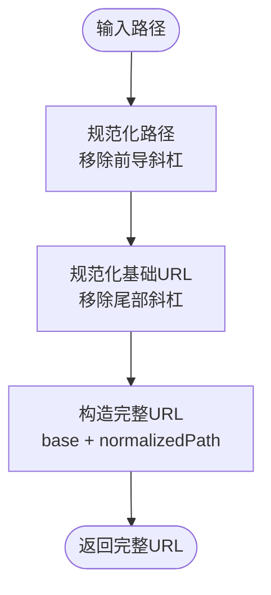

**Diagram sources**
- [api.ts](file://web/lib/api.ts#L29-L39)

### wsUrl工具函数
`wsUrl`函数用于构造WebSocket URL，将HTTP协议转换为WS协议，用于实时通信。

**Section sources**
- [api.ts](file://web/lib/api.ts#L47-L58)

## 关键API端点调用流程

### /automark端点
`/automark`端点用于AI自动标记文本。前端通过`CoWriterEditor`组件调用此API，将选中的文本发送到后端进行处理。

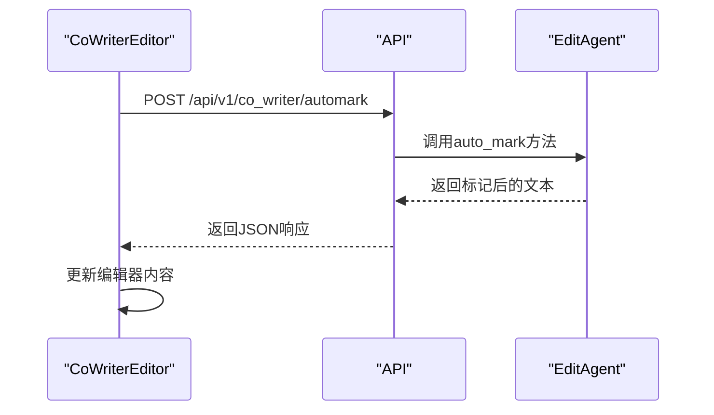

**Diagram sources**
- [CoWriterEditor.tsx](file://web/components/CoWriterEditor.tsx#L733-L756)
- [co_writer.py](file://src/api/routers/co_writer.py#L93-L108)

### /edit端点
`/edit`端点用于文本编辑操作，支持重写、缩短、扩展等操作。该端点还支持从知识库或网络检索信息。

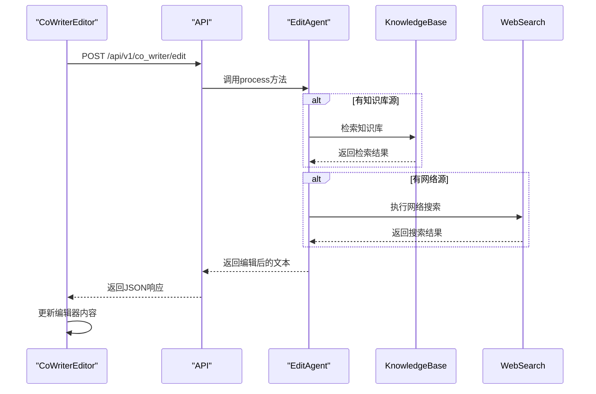

**Diagram sources**
- [CoWriterEditor.tsx](file://web/components/CoWriterEditor.tsx#L727-L793)
- [co_writer.py](file://src/api/routers/co_writer.py#L70-L89)

### 知识库API端点
知识库API提供了创建、上传、删除知识库等功能，支持后台任务处理和实时进度更新。

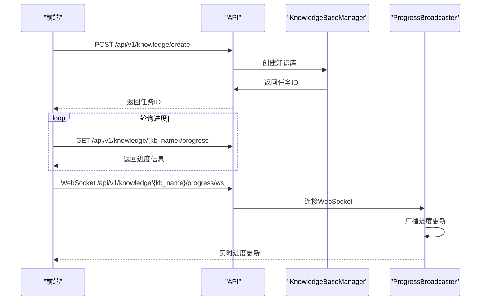

**Diagram sources**
- [knowledge.py](file://src/api/routers/knowledge.py#L346-L413)
- [knowledge.py](file://src/api/routers/knowledge.py#L450-L535)

## 健壮性机制

### 错误处理
系统实现了多层次的错误处理机制，包括HTTP状态码检查、响应内容验证和用户友好的错误提示。

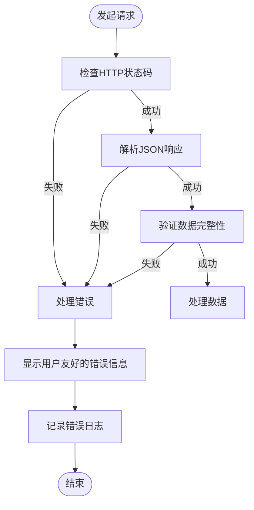

**Section sources**
- [CoWriterEditor.tsx](file://web/components/CoWriterEditor.tsx#L743-L749)
- [co_writer.py](file://src/api/routers/co_writer.py#L86-L91)

### 超时控制
使用`AbortController`实现请求超时控制，避免请求长时间挂起。

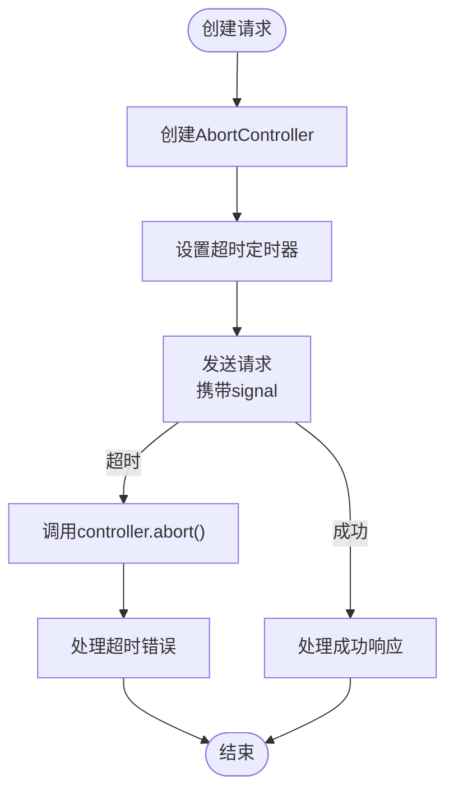

**Section sources**
- [CoWriterEditor.tsx](file://web/components/CoWriterEditor.tsx#L134-L135)
- [SystemStatus.tsx](file://web/components/SystemStatus.tsx#L75-L76)

### 连接状态检测
系统定期检查后端连接状态，并在连接断开时提供用户提示。

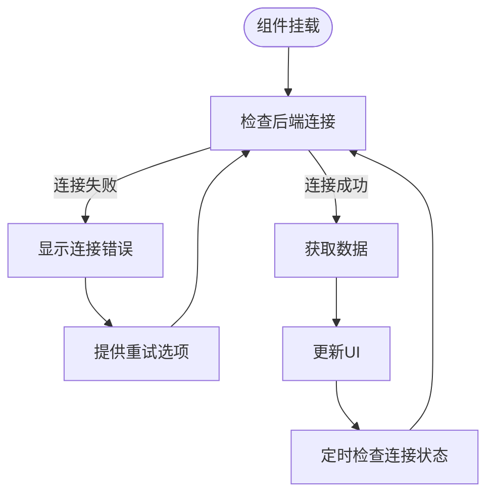

**Section sources**
- [CoWriterEditor.tsx](file://web/components/CoWriterEditor.tsx#L130-L167)
- [SystemStatus.tsx](file://web/components/SystemStatus.tsx#L73-L93)

## 高级功能API集成

### TTS语音合成
TTS功能通过`/api/v1/co_writer/narrate`端点实现，支持多种语音风格和角色。

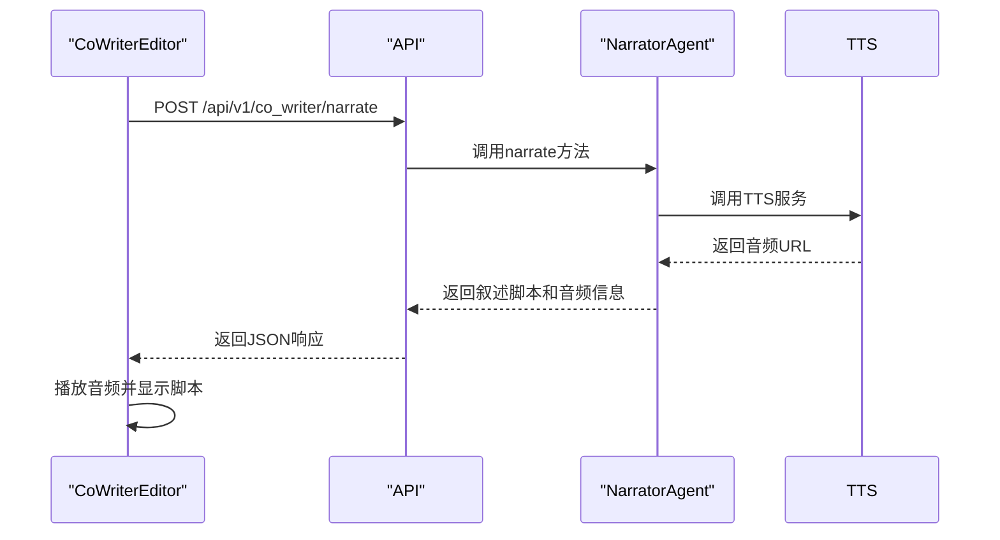

**Diagram sources**
- [co_writer.py](file://src/api/routers/co_writer.py#L200-L229)
- [CoWriterEditor.tsx](file://web/components/CoWriterEditor.tsx#L102-L122)

### 知识库检索
知识库检索功能通过`/api/v1/knowledge/list`端点获取可用的知识库列表。

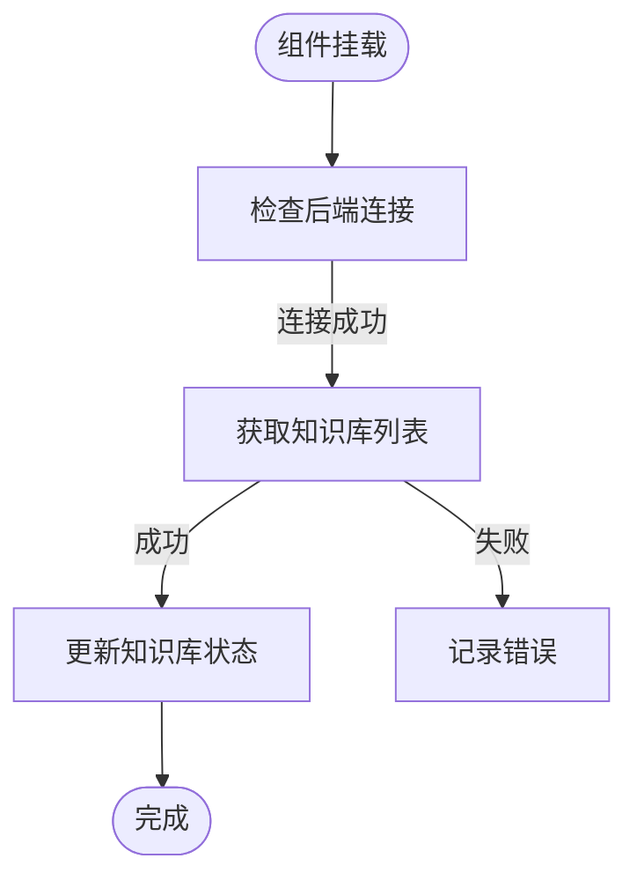

**Section sources**
- [CoWriterEditor.tsx](file://web/components/CoWriterEditor.tsx#L205-L239)

## 操作历史记录同步

### 历史记录管理
系统使用`HistoryManager`类管理操作历史记录，支持添加、获取和限制历史记录数量。

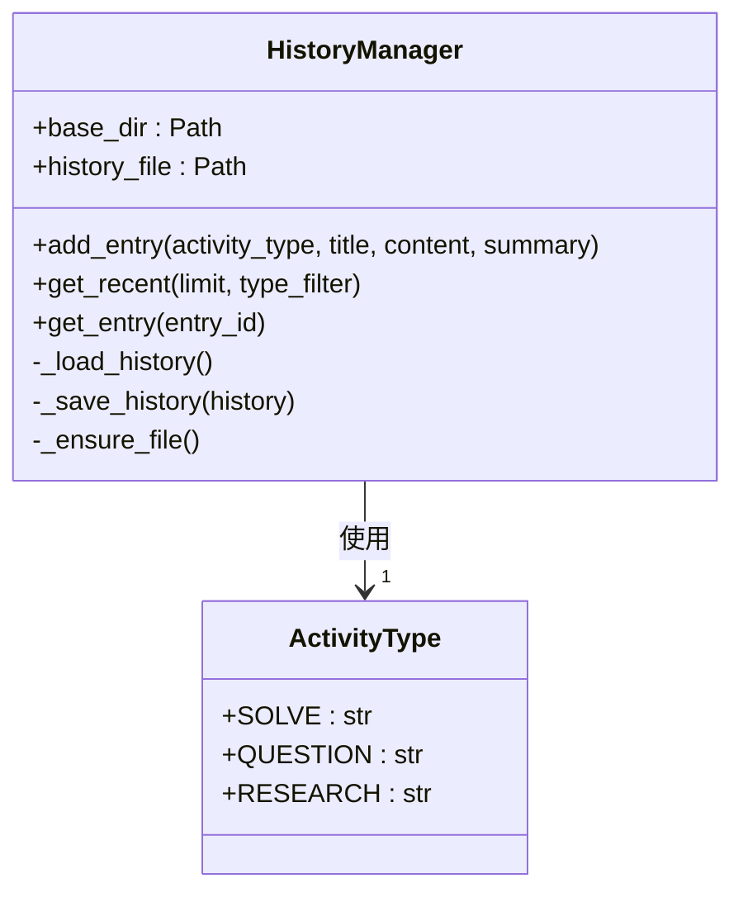

**Diagram sources**
- [history.py](file://src/api/utils/history.py#L13-L171)

### 历史记录同步流程
编辑器通过`/api/v1/co_writer/history`端点同步操作历史记录。

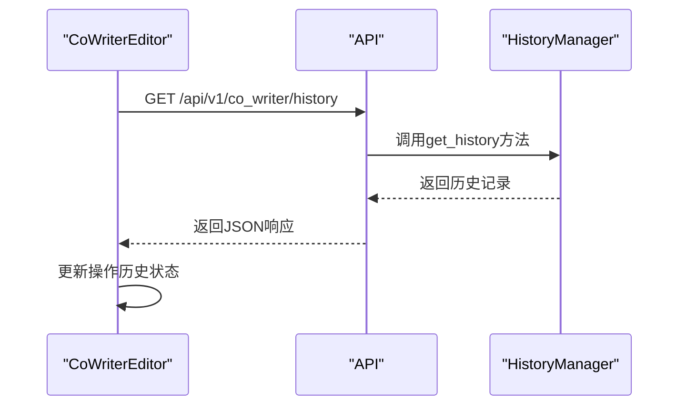

**Section sources**
- [CoWriterEditor.tsx](file://web/components/CoWriterEditor.tsx#L258-L281)
- [co_writer.py](file://src/api/routers/co_writer.py#L110-L118)

## 性能优化与异常恢复最佳实践

### 请求优化
- 使用`AbortController`实现请求超时，避免长时间等待
- 对知识库列表等静态数据进行缓存，减少重复请求
- 使用WebSocket实现实时进度更新，减少轮询开销

### 异常恢复
- 实现连接状态检测，自动重试失败的请求
- 提供用户友好的错误提示，指导用户解决问题
- 记录详细的错误日志，便于问题排查

### 最佳实践
1. **错误处理**：始终检查HTTP状态码和响应数据完整性
2. **超时控制**：为所有网络请求设置合理的超时时间
3. **连接检测**：定期检查后端连接状态，及时向用户反馈
4. **用户体验**：提供清晰的加载状态和错误提示
5. **日志记录**：在开发环境中记录详细的调试信息

**Section sources**
- [CoWriterEditor.tsx](file://web/components/CoWriterEditor.tsx)
- [co_writer.py](file://src/api/routers/co_writer.py)
- [system.py](file://src/api/routers/system.py)