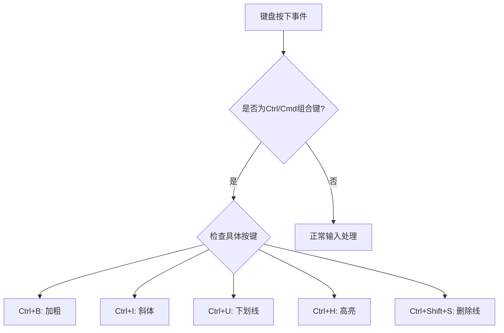
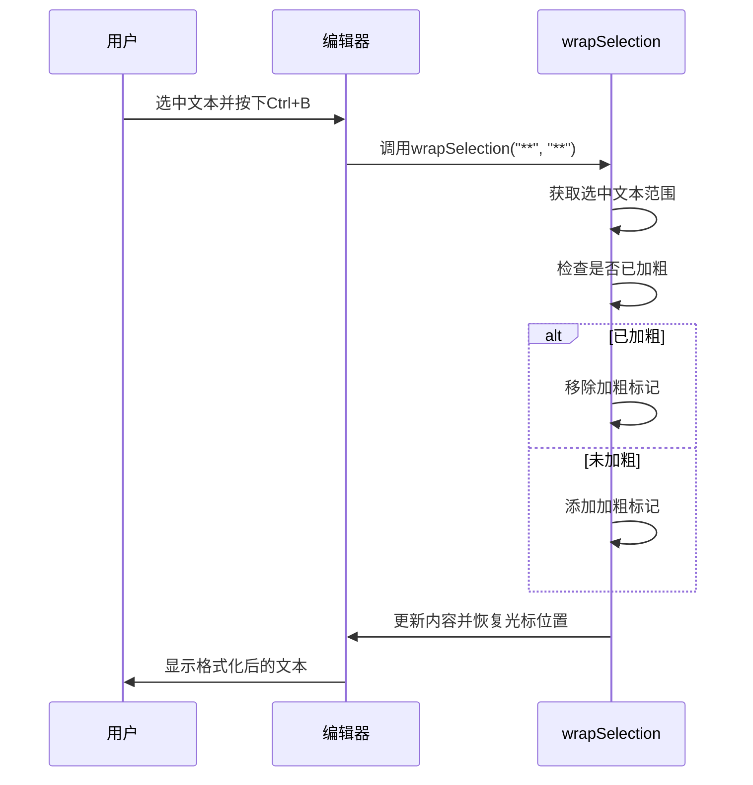

# 键盘快捷键系统

<cite>
**本文档引用的文件**   
- [CoMarkerEditor.tsx](file://web/components/CoMarkerEditor.tsx)
- [CoWriterEditor.tsx](file://web/components/CoWriterEditor.tsx)
</cite>

## 目录
1. [简介](#简介)
2. [快捷键事件监听机制](#快捷键事件监听机制)
3. [preventDefault使用时机](#preventdefault使用时机)
4. [格式化操作实现](#格式化操作实现)
5. [浏览器默认行为冲突处理](#浏览器默认行为冲突处理)
6. [输入法状态兼容性](#输入法状态兼容性)
7. [快捷键扩展与自定义](#快捷键扩展与自定义)

## 简介
本系统实现了编辑器中的键盘快捷键功能，支持Ctrl/Cmd组合键的文本格式化操作。系统通过监听键盘事件，拦截特定的快捷键组合，执行相应的格式化操作，如加粗、斜体、下划线等。该实现确保了在不同操作系统和输入法状态下的兼容性，并提供了扩展和自定义的接口。

**Section sources**
- [CoMarkerEditor.tsx](file://web/components/CoMarkerEditor.tsx#L619-L658)
- [CoWriterEditor.tsx](file://web/components/CoWriterEditor.tsx#L619-L658)

## 快捷键事件监听机制
系统通过useEffect钩子在组件挂载时注册全局的键盘事件监听器。当检测到Ctrl或Cmd键与特定字母键的组合时，系统会触发相应的格式化操作。事件监听器检查当前焦点元素是否为编辑器的textarea，确保快捷键仅在编辑器内有效。

**Diagram sources **
- [CoMarkerEditor.tsx](file://web/components/CoMarkerEditor.tsx#L619-L658)
- [CoWriterEditor.tsx](file://web/components/CoWriterEditor.tsx#L619-L658)

**Section sources**
- [CoMarkerEditor.tsx](file://web/components/CoMarkerEditor.tsx#L619-L658)
- [CoWriterEditor.tsx](file://web/components/CoWriterEditor.tsx#L619-L658)

## preventDefault使用时机
系统在执行自定义格式化操作前调用preventDefault方法，阻止浏览器的默认行为。这确保了快捷键不会触发浏览器的内置功能（如Ctrl+B在某些浏览器中会触发书签功能）。preventDefault仅在识别到有效的格式化快捷键时调用，不影响其他键盘操作。

**Section sources**
- [CoMarkerEditor.tsx](file://web/components/CoMarkerEditor.tsx#L631-L649)
- [CoWriterEditor.tsx](file://web/components/CoWriterEditor.tsx#L631-L649)

## 格式化操作实现
wrapSelection函数负责实现加粗、斜体、下划线等格式化操作。该函数获取当前选中的文本，根据指定的前后标记字符串进行包装。如果文本已被相同格式标记，则移除标记实现切换效果。操作完成后，系统会恢复光标位置到适当位置。

**Diagram sources **
- [CoMarkerEditor.tsx](file://web/components/CoMarkerEditor.tsx#L523-L571)
- [CoWriterEditor.tsx](file://web/components/CoWriterEditor.tsx#L523-L571)

**Section sources**
- [CoMarkerEditor.tsx](file://web/components/CoMarkerEditor.tsx#L523-L571)
- [CoWriterEditor.tsx](file://web/components/CoWriterEditor.tsx#L523-L571)

## 浏览器默认行为冲突处理
系统通过精确的事件处理逻辑避免与浏览器默认行为的冲突。通过检查document.activeElement确保快捷键仅在编辑器获得焦点时生效。preventDefault的使用时机经过精心设计，只在执行自定义格式化操作时阻止默认行为，不影响其他正常的键盘功能。

**Section sources**
- [CoMarkerEditor.tsx](file://web/components/CoMarkerEditor.tsx#L622-L626)
- [CoWriterEditor.tsx](file://web/components/CoWriterEditor.tsx#L622-L626)

## 输入法状态兼容性
系统在设计时考虑了不同输入法状态的兼容性。通过直接监听keydown事件而非依赖输入法的最终输出，确保在中文、日文等复杂输入法环境下快捷键仍能正常工作。系统不依赖compositionstart、compositionupdate和compositionend事件，避免了输入法组合过程对快捷键功能的干扰。

**Section sources**
- [CoMarkerEditor.tsx](file://web/components/CoMarkerEditor.tsx#L621-L658)
- [CoWriterEditor.tsx](file://web/components/CoWriterEditor.tsx#L621-L658)

## 快捷键扩展与自定义
系统提供了扩展和自定义快捷键的路径。通过修改键盘事件监听器中的switch语句，可以添加新的快捷键组合。wrapSelection函数的设计使其易于扩展支持新的格式化类型。开发者可以基于现有模式添加自定义的文本处理功能。

**Section sources**
- [CoMarkerEditor.tsx](file://web/components/CoMarkerEditor.tsx#L619-L658)
- [CoWriterEditor.tsx](file://web/components/CoWriterEditor.tsx#L619-L658)