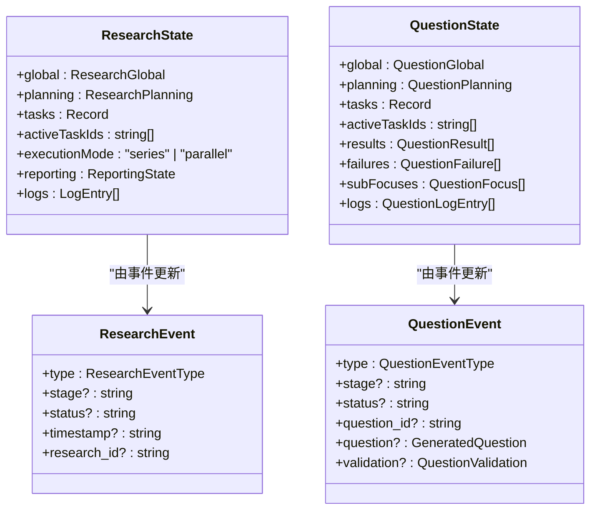
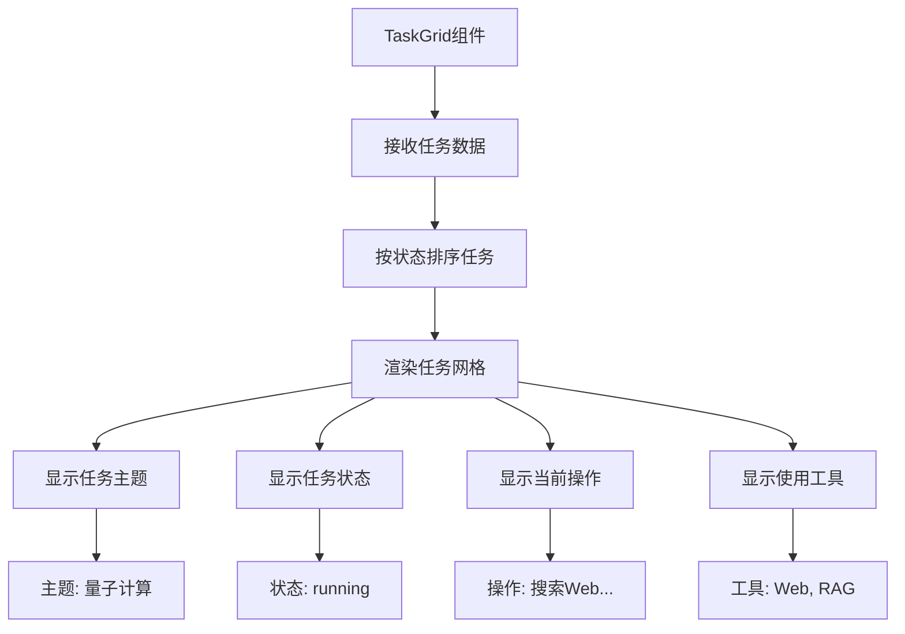
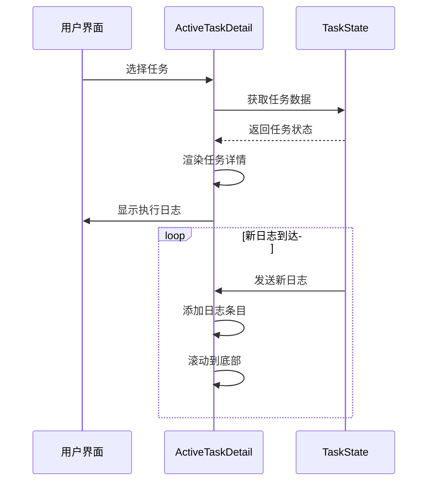
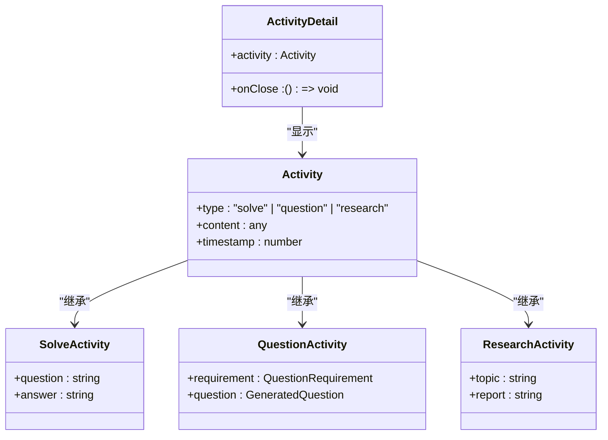
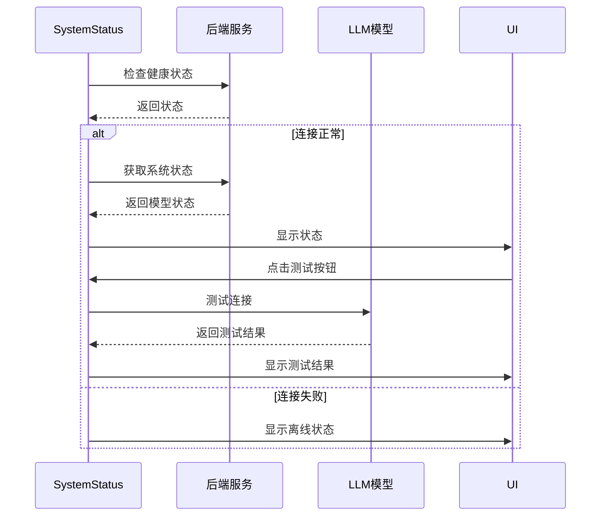
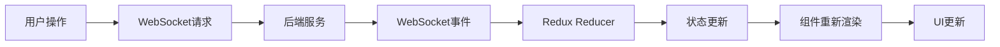

# 业务复合组件

<cite>
**本文档引用的文件**   
- [ResearchDashboard.tsx](file://web/components/research/ResearchDashboard.tsx)
- [QuestionDashboard.tsx](file://web/components/question/QuestionDashboard.tsx)
- [TaskGrid.tsx](file://web/components/research/TaskGrid.tsx)
- [QuestionTaskGrid.tsx](file://web/components/question/QuestionTaskGrid.tsx)
- [ActiveTaskDetail.tsx](file://web/components/research/ActiveTaskDetail.tsx)
- [ActiveQuestionDetail.tsx](file://web/components/question/ActiveQuestionDetail.tsx)
- [ActivityDetail.tsx](file://web/components/ActivityDetail.tsx)
- [SystemStatus.tsx](file://web/components/SystemStatus.tsx)
- [research.ts](file://web/types/research.ts)
- [question.ts](file://web/types/question.ts)
- [useResearchReducer.ts](file://web/hooks/useResearchReducer.ts)
- [useQuestionReducer.ts](file://web/hooks/useQuestionReducer.ts)
- [GlobalContext.tsx](file://web/context/GlobalContext.tsx)
</cite>

## 目录
1. [引言](#引言)
2. [全局状态管理机制](#全局状态管理机制)
3. [任务调度可视化逻辑](#任务调度可视化逻辑)
4. [动态详情渲染策略](#动态详情渲染策略)
5. [多类型活动数据聚合](#多类型活动数据聚合)
6. [实时系统监控实现](#实时系统监控实现)
7. [组件间通信与数据流](#组件间通信与数据流)
8. [错误边界设计](#错误边界设计)
9. [结论](#结论)

## 引言
DeepTutor系统通过一系列复杂的业务复合组件实现了智能化的研究、问题生成和学习辅助功能。本文档深入剖析其核心组件体系，重点阐述ResearchDashboard和QuestionDashboard的全局状态管理机制，TaskGrid组件的任务调度可视化逻辑，以及ActiveTaskDetail/ActiveQuestionDetail的动态详情渲染策略。同时，文档将详细说明ActivityDetail组件如何聚合多类型活动数据，SystemStatus组件的实时系统监控实现方式，并提供组件间通信模式、数据流处理、错误边界设计等关键技术细节。

## 全局状态管理机制

DeepTutor采用Redux状态管理与React Context相结合的混合模式来管理全局状态。ResearchDashboard和QuestionDashboard组件通过自定义的`useResearchReducer`和`useQuestionReducer`钩子函数，利用Redux的reducer模式来处理复杂的状态转换。

**ResearchDashboard状态管理**  
ResearchDashboard的状态由`ResearchState`接口定义，包含全局状态、规划阶段、任务状态、执行模式和报告生成等多个维度。`useResearchReducer`钩子函数接收来自WebSocket的`ResearchEvent`事件，根据事件类型（如`planning_started`、`block_started`、`reporting_completed`等）更新状态。例如，当接收到`block_started`事件时，reducer会将对应任务的状态更新为"running"，并更新全局已完成块的数量。

**QuestionDashboard状态管理**  
QuestionDashboard的状态由`QuestionState`接口定义，包含全局状态、规划阶段、任务列表、结果集和日志等。`useQuestionReducer`钩子函数处理`QuestionEvent`事件，如`progress`、`question_update`、`result`等。该组件支持两种数据源：通过reducer管理的`QuestionState`和通过`GlobalContext`传递的全局数据。当`state`为空或处于"idle"阶段时，组件会自动切换到使用`GlobalContext`中的数据。

**Diagram sources**
- [research.ts](file://web/types/research.ts#L76-L110)
- [question.ts](file://web/types/question.ts#L111-L157)
- [useResearchReducer.ts](file://web/hooks/useResearchReducer.ts#L75-L541)
- [useQuestionReducer.ts](file://web/hooks/useQuestionReducer.ts#L65-L405)

**Section sources**
- [ResearchDashboard.tsx](file://web/components/research/ResearchDashboard.tsx#L34-L42)
- [QuestionDashboard.tsx](file://web/components/question/QuestionDashboard.tsx#L66-L83)
- [useResearchReducer.ts](file://web/hooks/useResearchReducer.ts#L12-L33)
- [useQuestionReducer.ts](file://web/hooks/useQuestionReducer.ts#L12-L34)

## 任务调度可视化逻辑

TaskGrid组件负责可视化展示任务的调度状态，包括ResearchDashboard中的`TaskGrid`和QuestionDashboard中的`QuestionTaskGrid`。

**Research TaskGrid**  
`TaskGrid`组件接收`tasks`、`activeTaskIds`和`selectedTaskId`等属性，将任务按活动状态排序（活动任务优先），并以网格布局展示。每个任务卡片显示其主题、状态、当前操作和使用的工具。活动任务会显示脉冲指示器，选中的任务会用蓝色边框高亮。工具使用情况通过小图标展示，如数据库图标表示RAG工具，地球图标表示Web搜索。

**Question TaskGrid**  
`QuestionTaskGrid`组件与`TaskGrid`类似，但针对问题生成任务进行了优化。它显示问题的焦点、状态、生成轮次和扩展状态。扩展问题会用闪电图标标记，失败问题用红色标记。组件还显示每个问题的进度，如"3/5 completed"。

**Diagram sources**
- [TaskGrid.tsx](file://web/components/research/TaskGrid.tsx#L16-L21)
- [QuestionTaskGrid.tsx](file://web/components/question/QuestionTaskGrid.tsx)
- [TaskGrid.tsx](file://web/components/research/TaskGrid.tsx#L80-L190)

**Section sources**
- [TaskGrid.tsx](file://web/components/research/TaskGrid.tsx#L1-L193)
- [QuestionTaskGrid.tsx](file://web/components/question/QuestionTaskGrid.tsx)

## 动态详情渲染策略

ActiveTaskDetail和ActiveQuestionDetail组件负责动态渲染任务的详细执行信息。

**ActiveTaskDetail**  
该组件显示研究任务的执行细节，包括任务主题、状态和思维链。思维链以时间线形式展示，每个条目包含一个图标（如大脑表示充分性检查，数据库表示工具调用）、类型标签和内容。内容使用`react-markdown`渲染，支持代码块和数学公式。组件会自动滚动到底部以显示最新日志。

**ActiveQuestionDetail**  
该组件显示问题生成任务的详细信息，包括问题焦点、生成状态和最终结果。对于已生成的问题，它会显示问题内容、选项、正确答案和解释。扩展问题会特别标记，并显示扩展分析。组件还显示验证摘要，包括决策、轮次和推理。

**Diagram sources**
- [ActiveTaskDetail.tsx](file://web/components/research/ActiveTaskDetail.tsx#L15-L184)
- [ActiveQuestionDetail.tsx](file://web/components/question/ActiveQuestionDetail.tsx#L21-L367)
- [ActiveTaskDetail.tsx](file://web/components/research/ActiveTaskDetail.tsx#L45-L183)
- [ActiveQuestionDetail.tsx](file://web/components/question/ActiveQuestionDetail.tsx#L78-L366)

**Section sources**
- [ActiveTaskDetail.tsx](file://web/components/research/ActiveTaskDetail.tsx#L1-L184)
- [ActiveQuestionDetail.tsx](file://web/components/question/ActiveQuestionDetail.tsx#L1-L367)

## 多类型活动数据聚合

ActivityDetail组件是一个通用的模态对话框，用于聚合和展示多种类型的活动数据，包括解决问题、生成问题和研究活动。

该组件接收一个`activity`对象，根据其类型（"solve"、"question"或"research"）渲染不同的内容。对于解决问题活动，它显示问题和最终答案；对于生成问题活动，它显示问题参数、生成的问题和正确答案；对于研究活动，它显示研究主题和报告预览。组件还显示活动的元信息，如类型、知识库和时间戳。

**Diagram sources**
- [ActivityDetail.tsx](file://web/components/ActivityDetail.tsx#L4-L219)
- [page.tsx](file://web/app/page.tsx#L28-L35)

**Section sources**
- [ActivityDetail.tsx](file://web/components/ActivityDetail.tsx#L1-L219)

## 实时系统监控实现

SystemStatus组件实现实时系统监控，通过WebSocket连接定期检查后端服务和模型的状态。

组件在挂载时启动一个定时器，每30秒检查一次后端连接状态。如果连接正常，它会获取系统状态，包括LLM、嵌入和TTS模型的状态。用户可以点击"Test Connection"按钮手动测试模型连接。测试结果会显示在对应模型的状态下方，包括响应时间和成功/失败状态。

**Diagram sources**
- [SystemStatus.tsx](file://web/components/SystemStatus.tsx#L3-L440)
- [SystemStatus.tsx](file://web/components/SystemStatus.tsx#L72-L102)

**Section sources**
- [SystemStatus.tsx](file://web/components/SystemStatus.tsx#L1-L440)

## 组件间通信与数据流

DeepTutor的组件间通信主要通过Redux状态管理和WebSocket事件驱动。数据流从后端通过WebSocket推送到前端，由reducer处理并更新状态，然后通过React的props传递给子组件。

**数据流示例：研究任务**  
1. 用户在ResearchDashboard中启动研究任务
2. 前端通过WebSocket发送启动请求
3. 后端开始研究流程，并通过WebSocket发送`ResearchEvent`事件
4. `useResearchReducer`接收事件并更新`ResearchState`
5. `ResearchDashboard`组件重新渲染，反映新的状态
6. `TaskGrid`和`ActiveTaskDetail`组件接收更新后的任务数据并更新UI

**Section sources**
- [GlobalContext.tsx](file://web/context/GlobalContext.tsx#L250-L1341)
- [useResearchReducer.ts](file://web/hooks/useResearchReducer.ts#L75-L541)
- [useQuestionReducer.ts](file://web/hooks/useQuestionReducer.ts#L65-L405)

## 错误边界设计

DeepTutor在多个层面实现了错误边界设计，确保系统的稳定性和用户体验。

**组件级错误边界**  
关键组件如`ActivityDetail`和`SystemStatus`都实现了错误处理逻辑。例如，`ActivityDetail`组件在`activity`为空时直接返回null，避免渲染错误。

**状态级错误处理**  
reducer函数在处理事件时包含错误处理逻辑。例如，在`questionReducer`中，当接收到`error`事件时，它会将相关任务的状态更新为"error"，并添加错误日志。

**WebSocket级错误处理**  
`GlobalContext`中的WebSocket连接实现了完整的错误处理，包括`onerror`和`onclose`事件处理。当连接出错时，系统会清理WebSocket引用并更新状态。

**Section sources**
- [ActivityDetail.tsx](file://web/components/ActivityDetail.tsx#L13-L14)
- [useQuestionReducer.ts](file://web/hooks/useQuestionReducer.ts#L385-L394)
- [GlobalContext.tsx](file://web/context/GlobalContext.tsx#L757-L759)

## 结论
DeepTutor的业务复合组件体系通过精心设计的状态管理、数据流和组件通信模式，实现了高性能的用户体验和一致的UI更新。ResearchDashboard和QuestionDashboard通过Redux reducer模式高效管理复杂状态，TaskGrid组件提供了直观的任务调度可视化，而ActiveTaskDetail和ActiveQuestionDetail组件则通过动态渲染策略展示了详细的执行信息。ActivityDetail组件的聚合设计和SystemStatus组件的实时监控功能进一步增强了系统的可用性和可靠性。整体架构体现了现代前端应用的最佳实践，为用户提供了一个强大而直观的智能学习平台。