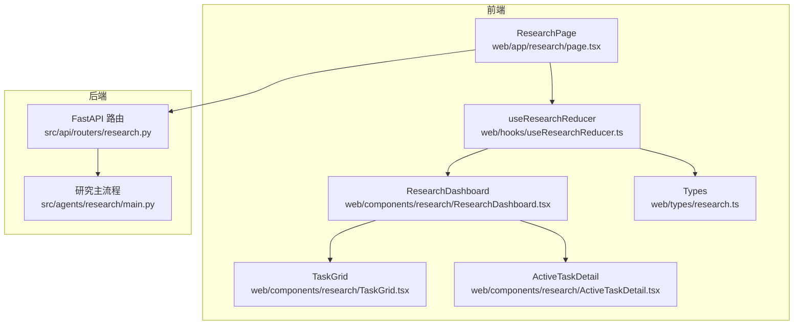
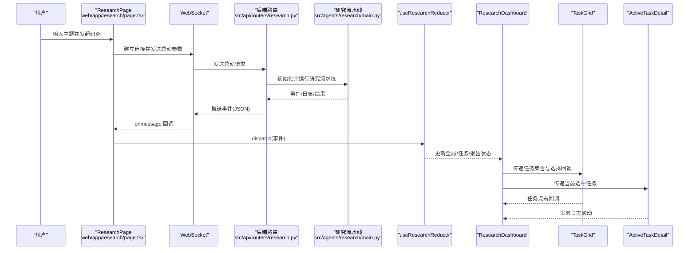
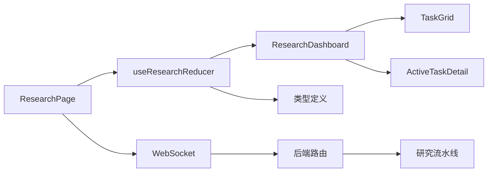
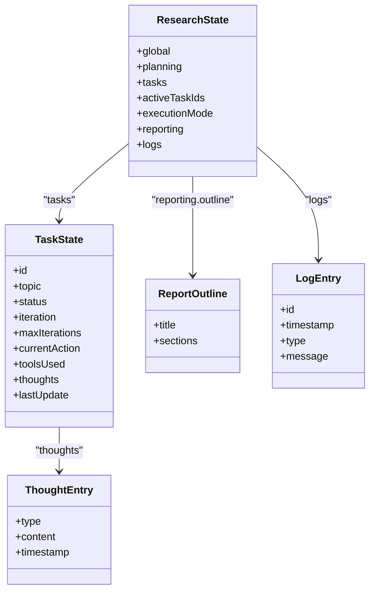

# 研究模块复合组件

<cite>
**本文引用的文件**
- [ResearchDashboard.tsx](file://web/components/research/ResearchDashboard.tsx)
- [TaskGrid.tsx](file://web/components/research/TaskGrid.tsx)
- [ActiveTaskDetail.tsx](file://web/components/research/ActiveTaskDetail.tsx)
- [useResearchReducer.ts](file://web/hooks/useResearchReducer.ts)
- [research.ts](file://web/types/research.ts)
- [page.tsx（研究页面）](file://web/app/research/page.tsx)
- [research.py（后端路由）](file://src/api/routers/research.py)
- [main.py（研究主入口）](file://src/agents/research/main.py)
</cite>

## 目录
1. [简介](#简介)
2. [项目结构](#项目结构)
3. [核心组件](#核心组件)
4. [架构总览](#架构总览)
5. [组件详解](#组件详解)
6. [依赖关系分析](#依赖关系分析)
7. [性能考量](#性能考量)
8. [故障排查指南](#故障排查指南)
9. [结论](#结论)
10. [附录](#附录)

## 简介
本文件系统性解析研究模块的三大复合组件：ResearchDashboard（研究任务总控面板）、TaskGrid（研究任务网格布局与动态排序）、ActiveTaskDetail（当前活动任务的详细执行视图）。围绕 useResearchReducer 状态管理机制，说明这些组件如何通过 React Context 与 Redux 模式协同数据流，实现高效渲染与实时更新。文档同时给出组件 Props 接口定义、事件回调机制、错误处理策略，并结合 src/agents/research 模块阐明前后端数据联动逻辑。

## 项目结构
研究模块位于前端 web/components/research 与 web/hooks 下，后端位于 src/api/routers/research.py 与 src/agents/research 主流程中。页面入口为 web/app/research/page.tsx，负责建立 WebSocket 连接、接收后端事件并派发到 useResearchReducer，再由三个组件消费状态进行渲染。

图表来源
- [page.tsx（研究页面）](file://web/app/research/page.tsx#L1-L200)
- [ResearchDashboard.tsx](file://web/components/research/ResearchDashboard.tsx#L1-L120)
- [TaskGrid.tsx](file://web/components/research/TaskGrid.tsx#L1-L80)
- [ActiveTaskDetail.tsx](file://web/components/research/ActiveTaskDetail.tsx#L1-L80)
- [useResearchReducer.ts](file://web/hooks/useResearchReducer.ts#L1-L120)
- [research.py（后端路由）](file://src/api/routers/research.py#L80-L160)
- [main.py（研究主入口）](file://src/agents/research/main.py#L1-L120)

章节来源
- [page.tsx（研究页面）](file://web/app/research/page.tsx#L1-L200)
- [research.py（后端路由）](file://src/api/routers/research.py#L80-L160)

## 核心组件
- ResearchDashboard：研究任务总控面板，集成任务状态同步、进度追踪与操作入口，包含“规划/研究/报告”三阶段视图与“过程/报告”视图切换。
- TaskGrid：研究任务网格布局与动态排序，支持按活跃度、运行状态等优先级排序，分页加载与过滤交互（通过外部传入 tasks 集合与分页/过滤参数）。
- ActiveTaskDetail：当前活动研究任务的详细信息展示，包括阶段进度、中间结果与智能体交互日志（thoughts），并自动滚动至最新日志。

章节来源
- [ResearchDashboard.tsx](file://web/components/research/ResearchDashboard.tsx#L1-L200)
- [TaskGrid.tsx](file://web/components/research/TaskGrid.tsx#L1-L120)
- [ActiveTaskDetail.tsx](file://web/components/research/ActiveTaskDetail.tsx#L1-L120)

## 架构总览
前端通过 WebSocket 与后端研究流水线通信，后端在运行过程中将事件推送到前端，前端使用 useResearchReducer 将事件转换为状态变更，驱动三个组件渲染。类型定义统一于 web/types/research.ts，确保前后端事件契约一致。

图表来源
- [page.tsx（研究页面）](file://web/app/research/page.tsx#L120-L210)
- [research.py（后端路由）](file://src/api/routers/research.py#L315-L380)
- [main.py（研究主入口）](file://src/agents/research/main.py#L120-L188)
- [useResearchReducer.ts](file://web/hooks/useResearchReducer.ts#L75-L120)
- [ResearchDashboard.tsx](file://web/components/research/ResearchDashboard.tsx#L300-L420)
- [TaskGrid.tsx](file://web/components/research/TaskGrid.tsx#L54-L120)
- [ActiveTaskDetail.tsx](file://web/components/research/ActiveTaskDetail.tsx#L45-L120)

## 组件详解

### ResearchDashboard 组件
- 角色定位：研究任务总控面板，负责三阶段视图（规划/研究/报告）与“过程/报告”视图切换，展示全局阶段、主题、并行模式、完成进度等。
- 关键能力：
  - 自动根据全局阶段切换步骤标签与视图。
  - 在研究完成后自动切换到报告视图。
  - 提供“过程/报告”视图切换按钮，以及导出 Markdown/PDF、添加到笔记本等操作入口。
  - 规划阶段显示原始/优化主题、子主题列表。
  - 研究阶段左侧网格展示任务，右侧展示当前选中任务的实时执行日志。
  - 报告阶段展示报告生成进度、字数统计、章节概览与“查看全文”按钮。
- Props 接口定义
  - state: ResearchState（来自 useResearchReducer）
  - selectedTaskId: string | null
  - onTaskSelect: (taskId: string) => void
  - onAddToNotebook?: () => void
  - onExportMarkdown?: () => void
  - onExportPdf?: () => void
  - isExportingPdf?: boolean
- 事件回调机制
  - onTaskSelect：用于在 TaskGrid 中选择任务并驱动右侧详情展示。
  - onAddToNotebook/onExportMarkdown/onExportPdf：触发上层操作（如打开模态框或下载）。
- 错误处理策略
  - 通过全局日志与错误事件类型统一记录与提示。
  - 报告视图禁用条件受 global.stage 与 reporting.generatedReport 控制。
- 数据流
  - 从 useResearchReducer 的 state 分解出 global、tasks、activeTaskIds、planning、reporting，驱动 UI 渲染与视图切换。

章节来源
- [ResearchDashboard.tsx](file://web/components/research/ResearchDashboard.tsx#L34-L120)
- [ResearchDashboard.tsx](file://web/components/research/ResearchDashboard.tsx#L120-L220)
- [ResearchDashboard.tsx](file://web/components/research/ResearchDashboard.tsx#L220-L420)
- [ResearchDashboard.tsx](file://web/components/research/ResearchDashboard.tsx#L420-L790)

### TaskGrid 组件
- 角色定位：研究任务网格布局与动态排序，支持按活跃度、运行状态等优先级排序，展示任务状态、迭代次数、当前动作与工具使用情况。
- 关键能力：
  - 动态排序：活跃任务优先，其次运行中，再待执行，最后已完成/失败。
  - 交互：点击任务触发 onTaskSelect 回调，选中项高亮。
  - 工具图标映射：根据工具名称映射到不同图标，便于识别。
- Props 接口定义
  - tasks: Record<string, TaskState>
  - activeTaskIds: string[]
  - selectedTaskId: string | null
  - onTaskSelect: (taskId: string) => void
- 错误处理策略
  - 当无任务初始化时，显示占位提示。
- 数据流
  - 从 ResearchDashboard 传入 tasks 集合与 activeTaskIds，内部根据状态与活跃度排序渲染。

章节来源
- [TaskGrid.tsx](file://web/components/research/TaskGrid.tsx#L16-L40)
- [TaskGrid.tsx](file://web/components/research/TaskGrid.tsx#L40-L120)
- [TaskGrid.tsx](file://web/components/research/TaskGrid.tsx#L120-L193)

### ActiveTaskDetail 组件
- 角色定位：当前活动任务的详细执行视图，展示任务主题、状态、ID、时间戳与链式思考（thoughts）日志。
- 关键能力：
  - 自动滚动：当任务的 thoughts 数量变化时，自动滚动到底部，保证最新日志可见。
  - 思考类型可视化：根据类型映射不同图标与颜色，区分 Sufficiency/Plan/Tool/Note/Error。
  - 时间戳格式化：统一本地时间格式。
- Props 接口定义
  - task: TaskState | null
- 错误处理策略
  - 当未选择任务时，显示占位提示。
- 数据流
  - 从 ResearchDashboard 传入当前选中的任务对象，内部渲染链式思考与工具调用日志。

章节来源
- [ActiveTaskDetail.tsx](file://web/components/research/ActiveTaskDetail.tsx#L15-L40)
- [ActiveTaskDetail.tsx](file://web/components/research/ActiveTaskDetail.tsx#L40-L120)
- [ActiveTaskDetail.tsx](file://web/components/research/ActiveTaskDetail.tsx#L120-L184)

### useResearchReducer 状态管理
- 角色定位：基于 useReducer 的状态机，统一处理研究生命周期事件，维护全局阶段、任务集合、并行活跃任务列表、报告进度与日志。
- 关键能力：
  - 初始状态：包含 global、planning、tasks、activeTaskIds、executionMode、reporting、logs。
  - 事件处理：覆盖规划、研究、报告各阶段事件，以及 agent 思考事件与错误事件。
  - 并行模式：parallel_status_update 批量更新活跃任务状态与进度。
  - 日志：所有事件均可生成日志条目，便于审计与调试。
- 数据结构复杂度
  - tasks 为 Record<string, TaskState>，增删改查均摊 O(1)。
  - activeTaskIds 为数组，排序与筛选在 TaskGrid 内部完成，不影响 reducer 复杂度。
- 错误处理策略
  - error 事件统一写入日志。
  - block_failed 将任务标记为失败并追加错误 thought。
- 典型事件路径
  - planning_started → rephrase_completed → decompose_started → decompose_completed → queue_seeded → planning_completed
  - researching_started → block_started → parallel_status_update → block_completed/block_failed → researching_completed
  - reporting_started → outline_completed → writing_section/writing_completed → reporting_completed

章节来源
- [useResearchReducer.ts](file://web/hooks/useResearchReducer.ts#L1-L60)
- [useResearchReducer.ts](file://web/hooks/useResearchReducer.ts#L60-L140)
- [useResearchReducer.ts](file://web/hooks/useResearchReducer.ts#L140-L260)
- [useResearchReducer.ts](file://web/hooks/useResearchReducer.ts#L260-L440)
- [useResearchReducer.ts](file://web/hooks/useResearchReducer.ts#L440-L547)

### 类型定义与事件契约
- 类型定义
  - ResearchState：包含 global、planning、tasks、activeTaskIds、executionMode、reporting、logs。
  - TaskState：任务状态、迭代次数、当前动作、工具使用、thoughts 列表与最后更新时间。
  - ThoughtEntry：链式思考条目，含类型、内容与时间戳。
  - ReportOutline：报告大纲结构。
  - LogEntry：全局日志条目。
- 事件类型
  - 规划阶段：planning_started、rephrase_completed、decompose_started、decompose_completed、queue_seeded、planning_completed。
  - 研究阶段：researching_started、parallel_status_update、block_started、block_completed、block_failed、researching_completed。
  - 报告阶段：reporting_started、deduplicate_completed、outline_completed、writing_section、writing_completed、reporting_completed。
  - 系统：log、error、status。
- 事件负载
  - 后端通过 WebSocket 推送事件，前端在 onmessage 中解析并 dispatch 到 reducer。

章节来源
- [research.ts](file://web/types/research.ts#L1-L110)
- [research.ts](file://web/types/research.ts#L110-L162)

### 前后端数据联动逻辑
- 页面启动
  - ResearchPage 建立 WebSocket 连接，发送启动参数（主题、知识库、计划模式、启用工具、是否跳过重述等）。
- 后端路由
  - /api/v1/research/run：接受启动参数，初始化 ResearchPipeline，创建日志队列与进度队列，后台推送日志与进度事件。
  - /api/v1/research/optimize_topic：可选的主题优化接口，返回优化后的主题与理由。
- 研究流水线
  - main.py 作为 CLI 入口，加载配置并运行 ResearchPipeline，事件通过队列异步推送到前端。
- 事件映射
  - 前端将后端的 progress/log/result/error 等事件映射为 reducer 可识别的 ResearchEvent，并更新状态树。

章节来源
- [page.tsx（研究页面）](file://web/app/research/page.tsx#L120-L210)
- [research.py（后端路由）](file://src/api/routers/research.py#L80-L160)
- [research.py（后端路由）](file://src/api/routers/research.py#L315-L380)
- [main.py（研究主入口）](file://src/agents/research/main.py#L120-L188)

## 依赖关系分析
- 组件耦合
  - ResearchDashboard 依赖 TaskGrid 与 ActiveTaskDetail，形成“网格+详情”的双栏布局。
  - TaskGrid 仅依赖外部传入的任务集合与选择回调，内聚性高。
  - ActiveTaskDetail 仅依赖当前选中任务对象，内聚性高。
- 状态耦合
  - useResearchReducer 作为单一事实来源，被 ResearchDashboard 消费，避免多处状态分散。
- 外部依赖
  - WebSocket 事件源来自后端路由，类型契约来自 web/types/research.ts。
  - 导出功能依赖 PDF 工具与笔记本模态框，属于 UI 层扩展。

图表来源
- [useResearchReducer.ts](file://web/hooks/useResearchReducer.ts#L1-L120)
- [ResearchDashboard.tsx](file://web/components/research/ResearchDashboard.tsx#L300-L420)
- [TaskGrid.tsx](file://web/components/research/TaskGrid.tsx#L54-L120)
- [ActiveTaskDetail.tsx](file://web/components/research/ActiveTaskDetail.tsx#L45-L120)
- [page.tsx（研究页面）](file://web/app/research/page.tsx#L120-L210)
- [research.py（后端路由）](file://src/api/routers/research.py#L315-L380)
- [main.py（研究主入口）](file://src/agents/research/main.py#L120-L188)
- [research.ts](file://web/types/research.ts#L110-L162)

## 性能考量
- 渲染优化
  - 使用 React.memo 化（组件内部未显式包裹，但 props 明确且稳定，天然具备良好渲染特性）。
  - TaskGrid 内部排序为 O(n log n)，n 为任务数量，通常较小，影响有限。
- 状态更新
  - useResearchReducer 采用不可变更新，避免不必要的重渲染。
  - 并行模式下批量更新通过一次 dispatch 完成，减少多次重渲染。
- WebSocket 事件
  - 后端采用队列异步推送，前端按事件粒度更新，避免阻塞主线程。
- 导出与渲染
  - PDF 导出前等待渲染稳定（Mermaid/KaTeX），避免截取空白或半渲染内容。

[本节为通用指导，不直接分析具体文件]

## 故障排查指南
- WebSocket 连接失败
  - 现象：前端收到 error 事件，全局状态回到 idle。
  - 处理：检查后端服务可用性、网络连通性与路由路径。
- 任务状态异常
  - 现象：任务长时间处于 running 或 pending。
  - 处理：查看 parallel_status_update 是否持续推送；确认后端流水线是否正常。
- 报告未生成
  - 现象：reporting.completed 事件未到达或 generatedReport 为空。
  - 处理：确认后端完成事件已发送，前端已 dispatch reporting_completed。
- 日志缺失
  - 现象：前端日志为空。
  - 处理：确认后端 log 队列是否正确推送；前端 onmessage 是否解析成功。

章节来源
- [page.tsx（研究页面）](file://web/app/research/page.tsx#L180-L210)
- [useResearchReducer.ts](file://web/hooks/useResearchReducer.ts#L520-L547)
- [research.py（后端路由）](file://src/api/routers/research.py#L315-L380)

## 结论
研究模块通过三大组件与 useResearchReducer 协同，实现了从规划、研究到报告的完整闭环。前端以 Redux 模式管理状态，后端以流水线事件驱动，二者通过 WebSocket 事件契约保持强一致。组件职责清晰、耦合度低、扩展性强，适合在复杂研究场景中持续演进。

[本节为总结，不直接分析具体文件]

## 附录

### 组件 Props 与事件回调一览
- ResearchDashboard
  - Props: state, selectedTaskId, onTaskSelect, onAddToNotebook, onExportMarkdown, onExportPdf, isExportingPdf
  - 事件: 任务选择、导出、添加到笔记本
- TaskGrid
  - Props: tasks, activeTaskIds, selectedTaskId, onTaskSelect
  - 事件: 任务点击
- ActiveTaskDetail
  - Props: task
  - 行为: 自动滚动至最新日志

章节来源
- [ResearchDashboard.tsx](file://web/components/research/ResearchDashboard.tsx#L34-L60)
- [TaskGrid.tsx](file://web/components/research/TaskGrid.tsx#L16-L40)
- [ActiveTaskDetail.tsx](file://web/components/research/ActiveTaskDetail.tsx#L15-L20)

### 数据模型类图

图表来源
- [research.ts](file://web/types/research.ts#L1-L110)