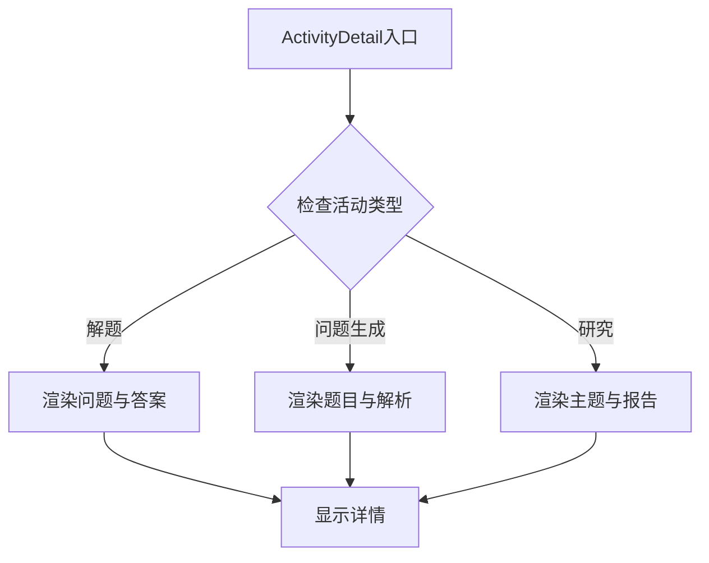
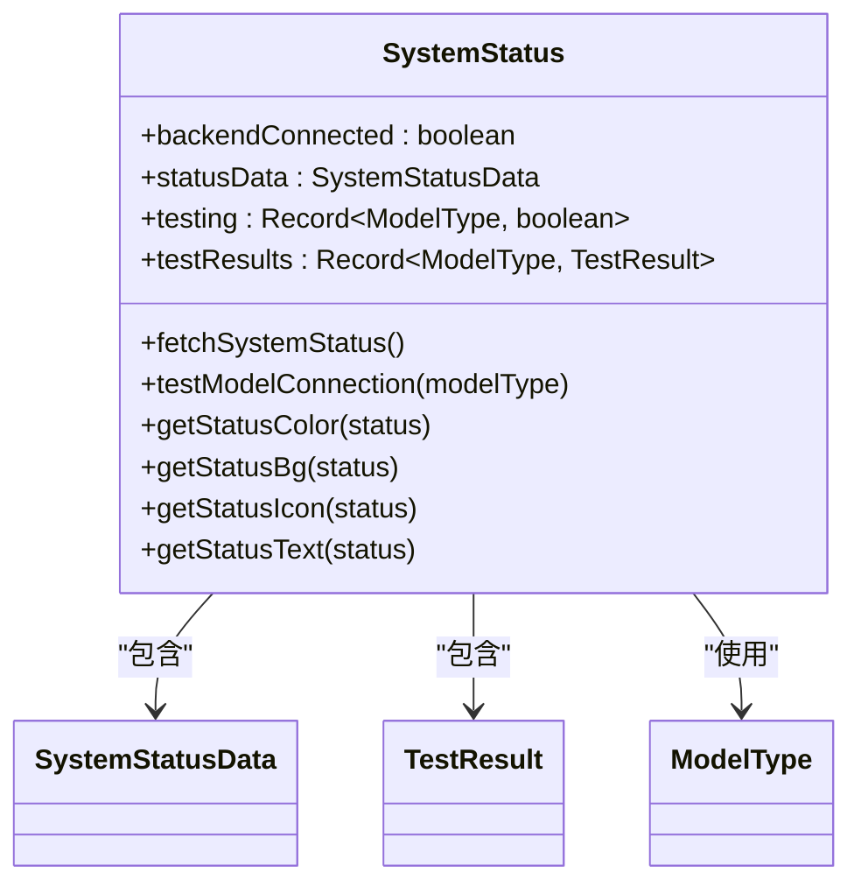
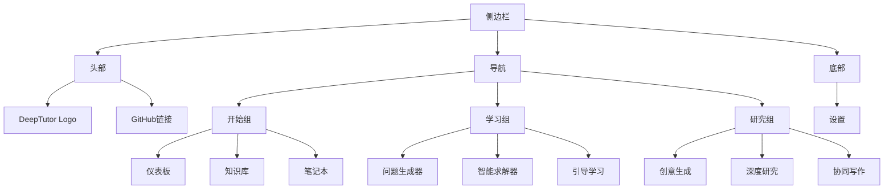
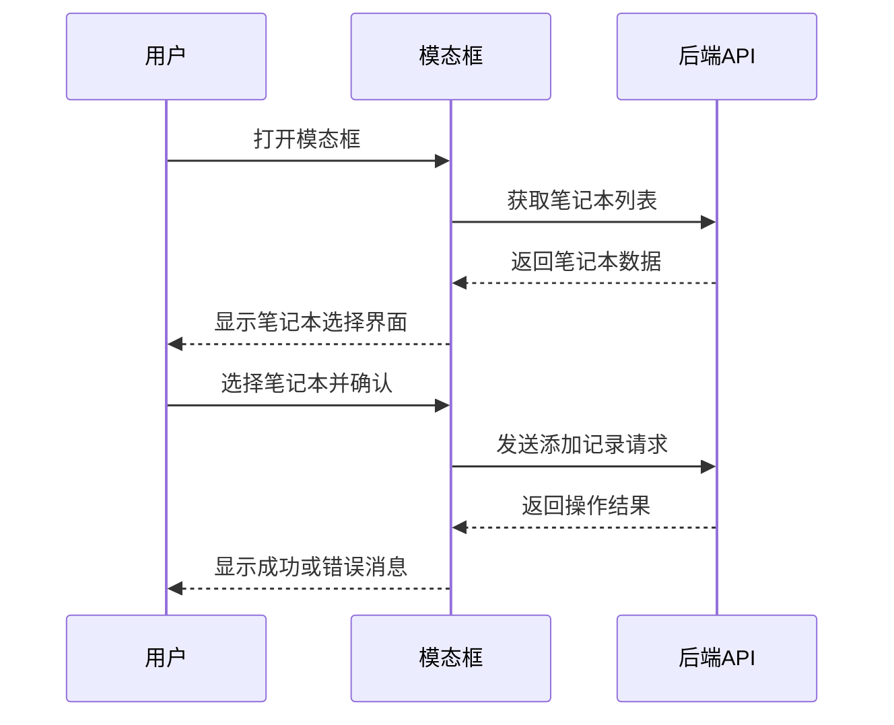
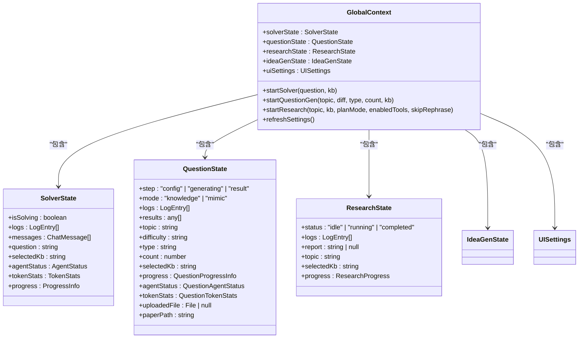
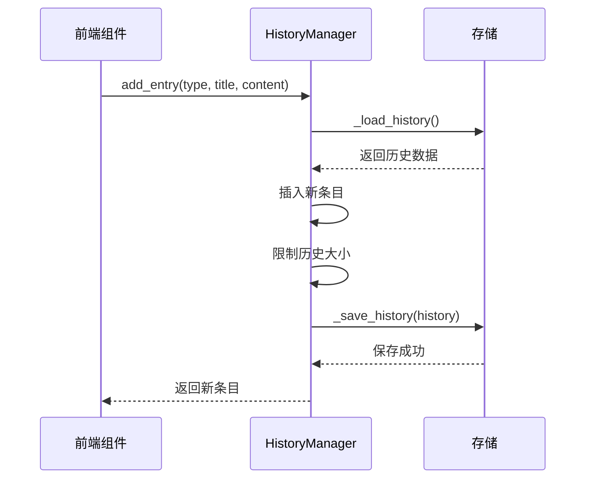
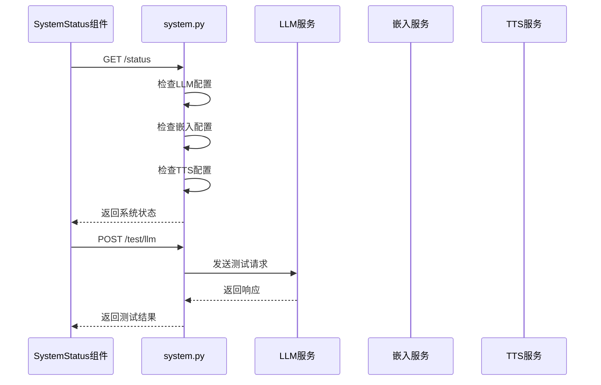
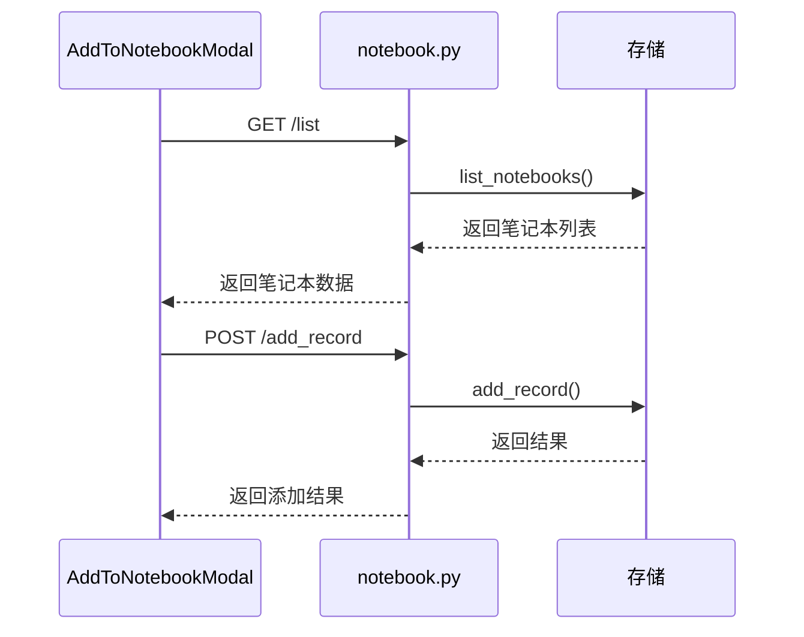
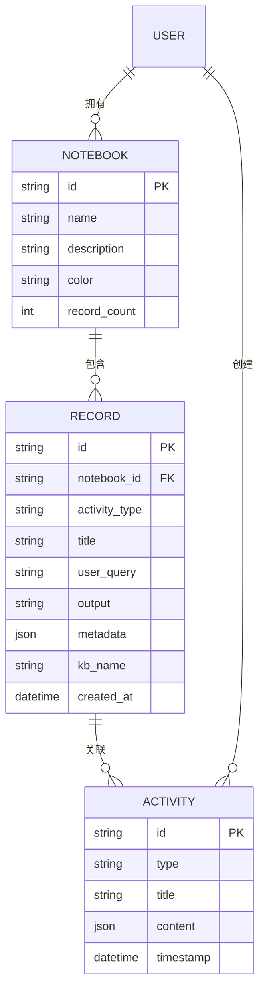

# 通用业务复合组件

<cite>
**本文档引用文件**  
- [ActivityDetail.tsx](file://web/components/ActivityDetail.tsx)
- [SystemStatus.tsx](file://web/components/SystemStatus.tsx)
- [Sidebar.tsx](file://web/components/Sidebar.tsx)
- [AddToNotebookModal.tsx](file://web/components/AddToNotebookModal.tsx)
- [NotebookImportModal.tsx](file://web/components/NotebookImportModal.tsx)
- [GlobalContext.tsx](file://web/context/GlobalContext.tsx)
- [history.py](file://src/api/utils/history.py)
- [system.py](file://src/api/routers/system.py)
- [notebook.py](file://src/api/routers/notebook.py)
- [knowledge.py](file://src/api/routers/knowledge.py)
- [api.ts](file://web/lib/api.ts)
</cite>

## 目录
1. [简介](#简介)
2. [核心组件分析](#核心组件分析)
3. [全局状态管理](#全局状态管理)
4. [后端协同机制](#后端协同机制)
5. [可复用设计模式](#可复用设计模式)
6. [访问控制与响应式布局](#访问控制与响应式布局)
7. [总结](#总结)

## 简介
DeepTutor系统中的通用业务复合组件为多类型活动提供统一的交互界面和功能支持。这些组件包括ActivityDetail（活动详情展示容器）、SystemStatus（系统状态监控）、Sidebar（全局导航）、AddToNotebookModal和NotebookImportModal（笔记本交互操作）。它们通过GlobalContext.tsx实现全局状态共享，并与后端服务协同工作，形成完整的用户交互闭环。

**Section sources**
- [ActivityDetail.tsx](file://web/components/ActivityDetail.tsx#L1-L219)
- [SystemStatus.tsx](file://web/components/SystemStatus.tsx#L1-L440)
- [Sidebar.tsx](file://web/components/Sidebar.tsx#L1-L152)

## 核心组件分析

### ActivityDetail组件
ActivityDetail组件作为多类型活动（研究、解题、问题生成）的统一详情展示容器，实现了动态内容渲染与标签页切换功能。该组件根据活动类型动态渲染不同的内容结构，支持解题、问题生成和研究三种活动类型的详情展示。

对于解题活动，组件显示问题原文和最终答案；对于问题生成活动，展示生成参数、题目内容及正确答案与解析；对于研究活动，则呈现研究主题和报告预览。组件采用响应式设计，确保在不同设备上均有良好的显示效果。

**Diagram sources**
- [ActivityDetail.tsx](file://web/components/ActivityDetail.tsx#L77-L203)

**Section sources**
- [ActivityDetail.tsx](file://web/components/ActivityDetail.tsx#L1-L219)

### SystemStatus组件
SystemStatus组件实时显示系统运行状态，包括LLM调用统计、知识库连接状态与WebSocket健康检查。该组件通过WebSocket连接定期检查后端服务状态，并提供手动测试功能。

组件监控多个关键系统组件的状态，包括LLM模型、嵌入模型和TTS模型。每个模型的状态通过颜色编码显示：绿色表示在线，红色表示离线或错误。用户可以点击"Test Connection"按钮测试模型连接，系统会显示响应时间和测试结果。

**Diagram sources**
- [SystemStatus.tsx](file://web/components/SystemStatus.tsx#L18-L440)

**Section sources**
- [SystemStatus.tsx](file://web/components/SystemStatus.tsx#L1-L440)

### Sidebar组件
Sidebar组件提供全局导航与快捷入口，是系统的主要导航界面。组件根据用户当前路径高亮显示活动菜单项，并支持多语言切换。

导航菜单分为三个主要部分："开始"、"学习"和"研究"，每个部分包含相关的功能入口。组件使用Next.js的usePathname钩子来跟踪当前路径，并相应地更新UI状态。侧边栏采用半透明背景和毛玻璃效果，提供现代化的视觉体验。

**Diagram sources**
- [Sidebar.tsx](file://web/components/Sidebar.tsx#L1-L152)

**Section sources**
- [Sidebar.tsx](file://web/components/Sidebar.tsx#L1-L152)

### 笔记本交互组件
AddToNotebookModal和NotebookImportModal组件处理笔记本相关的交互操作。AddToNotebookModal允许用户将当前活动记录添加到一个或多个笔记本中，支持创建新笔记本和选择现有笔记本。

NotebookImportModal提供从现有笔记本导入内容的功能，用户可以浏览不同笔记本并选择要导入的记录。两个组件都实现了流畅的用户交互，包括加载状态、成功反馈和错误处理。

**Diagram sources**
- [AddToNotebookModal.tsx](file://web/components/AddToNotebookModal.tsx#L1-L370)
- [NotebookImportModal.tsx](file://web/components/NotebookImportModal.tsx#L1-L355)

**Section sources**
- [AddToNotebookModal.tsx](file://web/components/AddToNotebookModal.tsx#L1-L370)
- [NotebookImportModal.tsx](file://web/components/NotebookImportModal.tsx#L1-L355)

## 全局状态管理
通用业务复合组件通过GlobalContext.tsx进行全局状态共享。GlobalContext提供了一个集中式的状态管理解决方案，使不同组件能够访问和更新共享状态。

GlobalContext包含多个状态对象，分别对应不同的业务功能：
- solverState：求解器状态，包括日志、消息、问题、知识库选择等
- questionState：问题生成状态，包括生成配置、结果、进度等
- researchState：研究状态，包括报告、进度、日志等
- ideaGenState：创意生成状态
- uiSettings：UI设置，包括主题和语言

**Diagram sources**
- [GlobalContext.tsx](file://web/context/GlobalContext.tsx#L1-L1341)

**Section sources**
- [GlobalContext.tsx](file://web/context/GlobalContext.tsx#L1-L1341)

## 后端协同机制
通用业务复合组件与后端服务通过REST API和WebSocket进行协同。前端组件通过api.ts中的工具函数构造API URL，并与后端路由进行通信。

### 历史记录协同
ActivityDetail组件与src/api/utils/history.py中的HistoryManager协同工作，实现活动历史记录的持久化。当用户完成一项活动时，相关数据会被添加到历史记录中。

**Diagram sources**
- [history.py](file://src/api/utils/history.py#L1-L172)

**Section sources**
- [history.py](file://src/api/utils/history.py#L1-L172)

### 系统状态协同
SystemStatus组件与src/api/routers/system.py中的路由协同，实时获取系统状态信息。组件通过GET /api/v1/system/status获取系统状态，并通过POST请求测试各个模型的连接。

**Diagram sources**
- [system.py](file://src/api/routers/system.py#L1-L256)

**Section sources**
- [system.py](file://src/api/routers/system.py#L1-L256)

### 笔记本协同
笔记本相关组件与src/api/routers/notebook.py中的路由协同，实现笔记本的创建、查询、更新和删除功能。AddToNotebookModal通过POST /api/v1/notebook/add_record将记录添加到笔记本中。

**Diagram sources**
- [notebook.py](file://src/api/routers/notebook.py#L1-L248)

**Section sources**
- [notebook.py](file://src/api/routers/notebook.py#L1-L248)

## 可复用设计模式
通用业务复合组件采用了多种可复用的设计模式，提高了代码的可维护性和扩展性。

### 组件化设计
所有组件都遵循单一职责原则，每个组件只负责特定的功能。这种设计使得组件可以在不同场景下复用，降低了代码耦合度。

### 状态管理模式
采用Context API进行全局状态管理，避免了繁琐的props传递。通过Provider模式，子组件可以方便地访问共享状态。

### API抽象模式
通过api.ts文件抽象API调用，提供了apiUrl和wsUrl工具函数，使前端组件无需关心具体的API地址配置。

### 模态框设计模式
AddToNotebookModal和NotebookImportModal采用了相似的设计模式，包括加载状态、成功反馈、错误处理等，形成了可复用的模态框组件模板。

## 访问控制与响应式布局
### 访问控制策略
系统通过WebSocket连接状态和后端API权限控制实现访问控制。只有在后端服务正常连接的情况下，相关功能才可用。

### 响应式布局实现
所有组件都采用了响应式设计，使用Tailwind CSS的响应式类名确保在不同设备上均有良好的显示效果。例如，ActivityDetail组件的最大宽度设置为max-w-3xl，在小屏幕上会自动调整。

**Diagram sources**
- [notebook.py](file://src/api/routers/notebook.py#L1-L248)
- [history.py](file://src/api/utils/history.py#L1-L172)

**Section sources**
- [notebook.py](file://src/api/routers/notebook.py#L1-L248)
- [history.py](file://src/api/utils/history.py#L1-L172)

## 总结
DeepTutor的通用业务复合组件通过精心设计的架构和协同机制，实现了多类型活动的统一管理。这些组件不仅提供了丰富的功能，还通过全局状态管理和后端协同机制确保了系统的稳定性和可扩展性。其可复用的设计模式和响应式布局为用户提供了优质的交互体验。