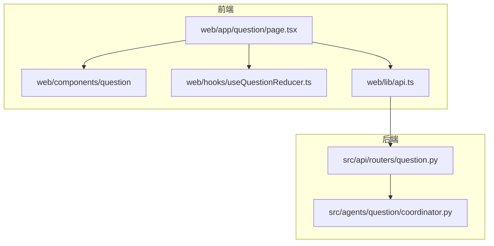
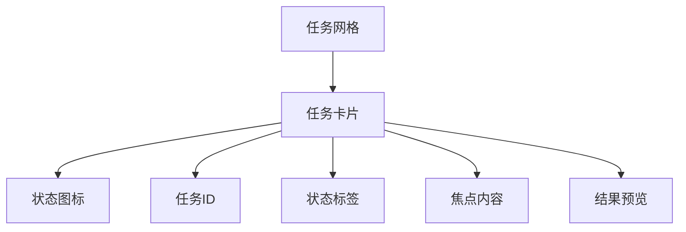
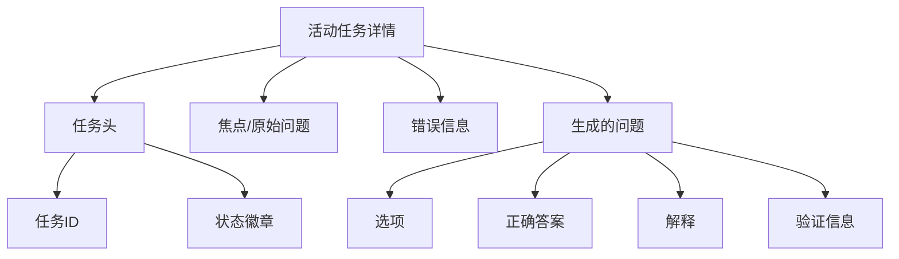
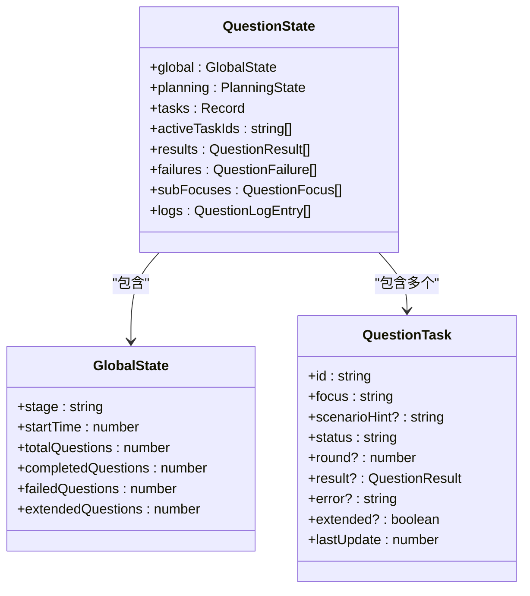
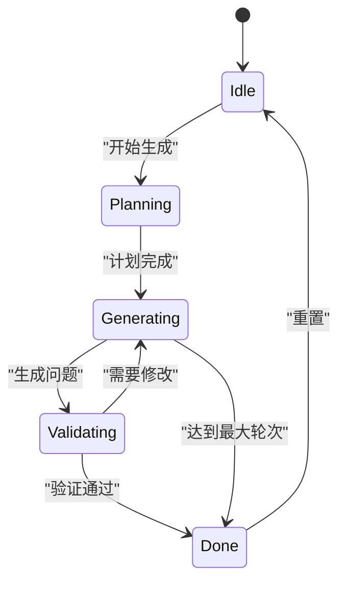
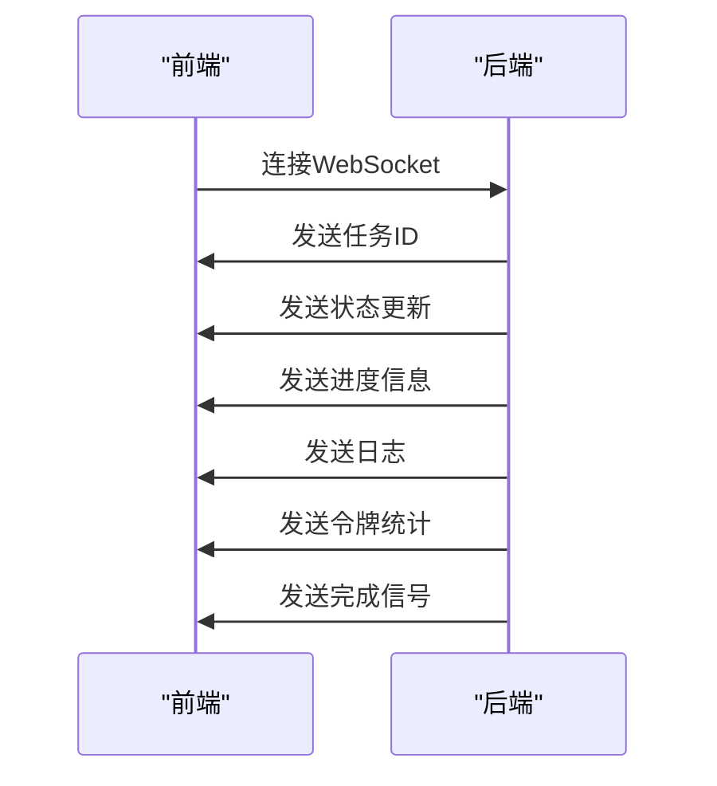
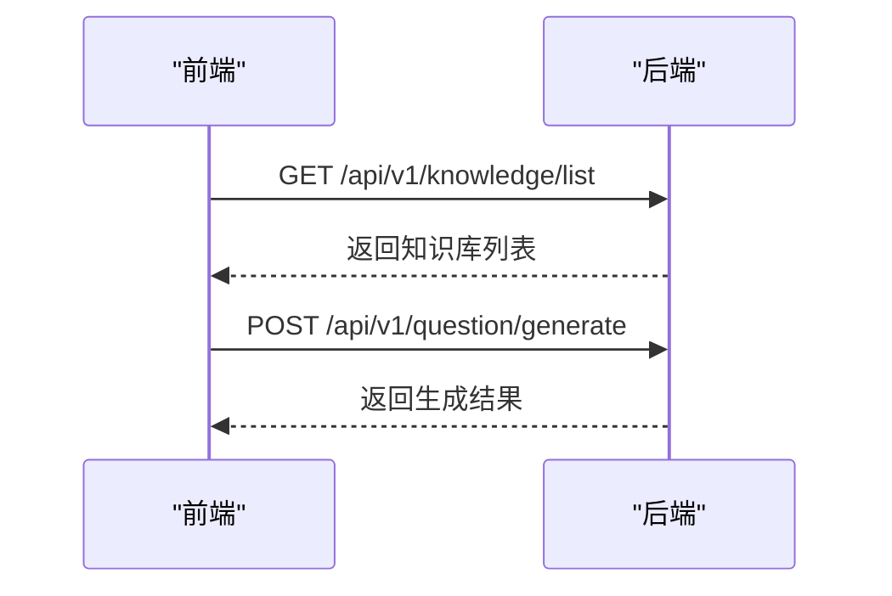

# 问题生成模块复合组件

<cite>
**本文档引用的文件**   
- [page.tsx](file://web/app/question/page.tsx)
- [QuestionDashboard.tsx](file://web/components/question/QuestionDashboard.tsx)
- [QuestionTaskGrid.tsx](file://web/components/question/QuestionTaskGrid.tsx)
- [ActiveQuestionDetail.tsx](file://web/components/question/ActiveQuestionDetail.tsx)
- [useQuestionReducer.ts](file://web/hooks/useQuestionReducer.ts)
- [coordinator.py](file://src/agents/question/coordinator.py)
- [question.py](file://src/api/routers/question.py)
- [api.ts](file://web/lib/api.ts)
- [question.ts](file://web/types/question.ts)
</cite>

## 目录
1. [项目结构](#项目结构)
2. [核心组件分析](#核心组件分析)
3. [状态管理机制](#状态管理机制)
4. [API交互模式](#api交互模式)
5. [性能优化建议](#性能优化建议)
6. [结论](#结论)

## 项目结构
问题生成模块采用分层架构设计，前端组件与后端服务分离。前端位于`web/`目录，包含主页面、组件和状态管理；后端位于`src/agents/question/`目录，包含核心协调器和API路由。

**图源**
- [page.tsx](file://web/app/question/page.tsx)
- [QuestionDashboard.tsx](file://web/components/question/QuestionDashboard.tsx)
- [coordinator.py](file://src/agents/question/coordinator.py)
- [question.py](file://src/api/routers/question.py)

**本节源**
- [page.tsx](file://web/app/question/page.tsx)
- [coordinator.py](file://src/agents/question/coordinator.py)

## 核心组件分析
问题生成模块由三个核心UI组件构成：QuestionDashboard作为主界面，QuestionTaskGrid实现任务列表展示，ActiveQuestionDetail用于展示单个任务详情。

### QuestionDashboard
作为问题生成任务的主界面，集成任务创建、状态监控与结果导出功能。通过标签页切换配置与处理视图。

**本节源**
- [QuestionDashboard.tsx](file://web/components/question/QuestionTaskGrid.tsx)

### QuestionTaskGrid
实现生成任务的可视化列表展示，支持状态筛选与批量操作。采用网格布局展示任务卡片。

**图源**
- [QuestionTaskGrid.tsx](file://web/components/question/QuestionTaskGrid.tsx)

**本节源**
- [QuestionTaskGrid.tsx](file://web/components/question/QuestionTaskGrid.tsx)

### ActiveQuestionDetail
用于展示单个问题生成任务的详细内容，包括题目预览、难度评估与知识点标注。

**图源**
- [ActiveQuestionDetail.tsx](file://web/components/question/ActiveQuestionDetail.tsx)

**本节源**
- [ActiveQuestionDetail.tsx](file://web/components/question/ActiveQuestionDetail.tsx)

## 状态管理机制
使用useQuestionReducer进行状态管理，实现组件间的数据传递与UI响应。

### 状态结构

**图源**
- [useQuestionReducer.ts](file://web/hooks/useQuestionReducer.ts)
- [question.ts](file://web/types/question.ts)

### 状态流转

**图源**
- [useQuestionReducer.ts](file://web/hooks/useQuestionReducer.ts)

**本节源**
- [useQuestionReducer.ts](file://web/hooks/useQuestionReducer.ts)

## API交互模式
前端通过WebSocket与RESTful API与后端服务交互。

### WebSocket实时进度推送

**图源**
- [question.py](file://src/api/routers/question.py)
- [page.tsx](file://web/app/question/page.tsx)

### RESTful结果获取

**图源**
- [question.py](file://src/api/routers/question.py)
- [api.ts](file://web/lib/api.ts)

**本节源**
- [question.py](file://src/api/routers/question.py)
- [api.ts](file://web/lib/api.ts)

## 性能优化建议
为提升用户体验，建议实现以下性能优化：

### 虚拟滚动
对于大量任务的展示，实现虚拟滚动以减少DOM节点数量。

### 懒加载
延迟加载非关键组件，如模态框和详细视图。

### 缓存机制
缓存API响应结果，减少重复请求。

**本节源**
- [QuestionTaskGrid.tsx](file://web/components/question/QuestionTaskGrid.tsx)
- [ActiveQuestionDetail.tsx](file://web/components/question/ActiveQuestionDetail.tsx)

## 结论
问题生成模块通过复合组件体系实现了完整的任务管理功能。前端组件与后端服务通过WebSocket实现实时通信，useQuestionReducer提供了可靠的状态管理。建议通过虚拟滚动和懒加载进一步优化性能。

**本节源**
- [page.tsx](file://web/app/question/page.tsx)
- [coordinator.py](file://src/agents/question/coordinator.py)