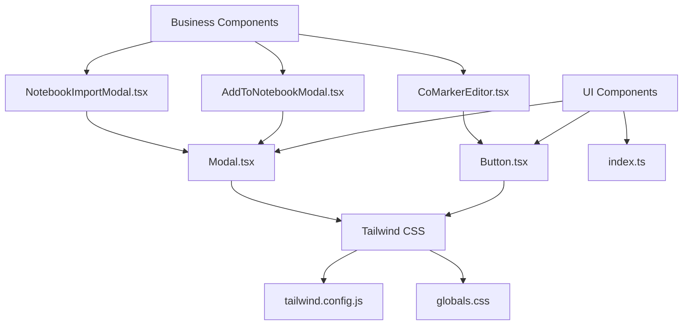
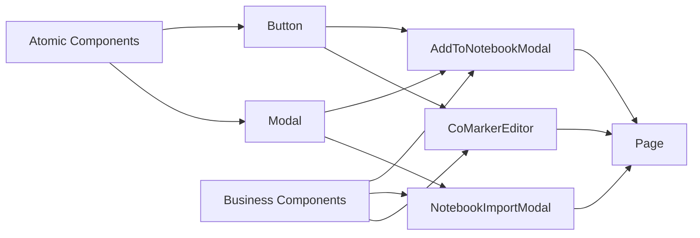
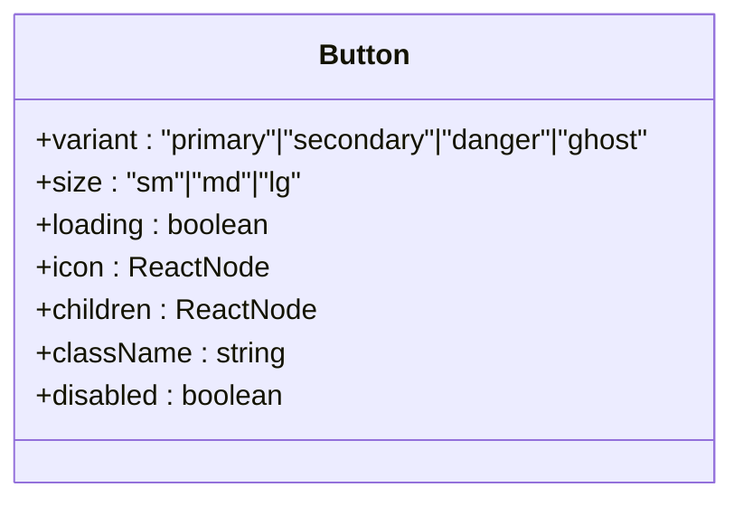
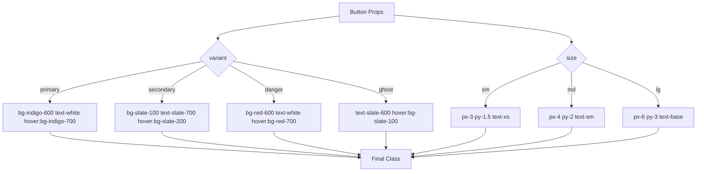
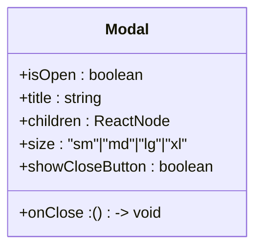
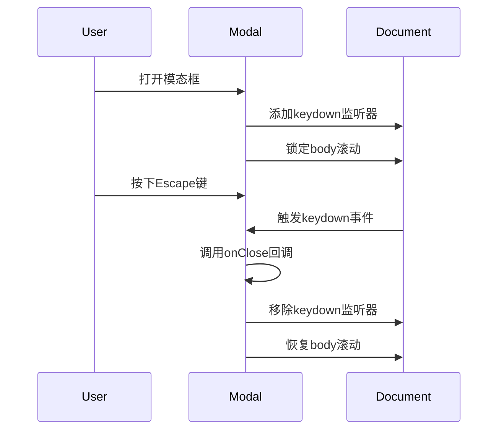
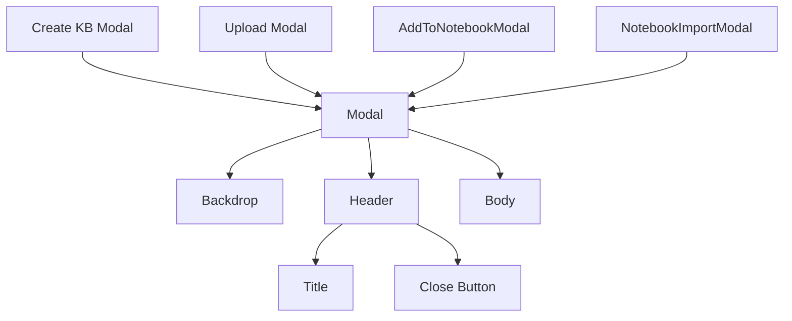
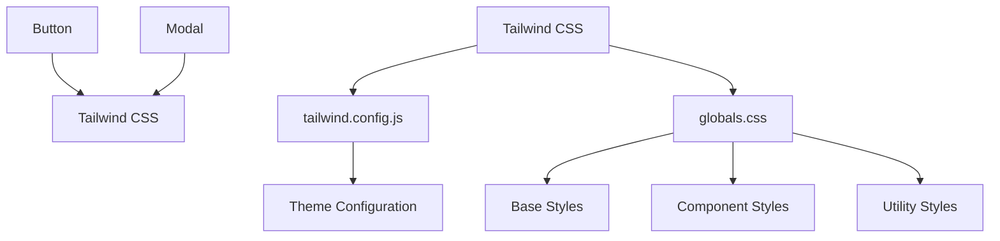

# 基础UI组件

<cite>
**本文档引用的文件**  
- [Button.tsx](file://web/components/ui/Button.tsx)
- [Modal.tsx](file://web/components/ui/Modal.tsx)
- [index.ts](file://web/components/ui/index.ts)
- [tailwind.config.js](file://web/tailwind.config.js)
- [globals.css](file://web/app/globals.css)
- [AddToNotebookModal.tsx](file://web/components/AddToNotebookModal.tsx)
- [CoMarkerEditor.tsx](file://web/components/CoMarkerEditor.tsx)
- [NotebookImportModal.tsx](file://web/components/NotebookImportModal.tsx)
- [ideagen/page.tsx](file://web/app/ideagen/page.tsx)
- [knowledge/page.tsx](file://web/app/knowledge/page.tsx)
</cite>

## 目录
1. [简介](#简介)
2. [项目结构](#项目结构)
3. [核心组件](#核心组件)
4. [架构概述](#架构概述)
5. [详细组件分析](#详细组件分析)
6. [依赖分析](#依赖分析)
7. [性能考虑](#性能考虑)
8. [故障排除指南](#故障排除指南)
9. [结论](#结论)

## 简介
本文档详细解析DeepTutor的基础UI组件设计与实现，重点分析Button和Modal两个原子化组件的属性配置、样式实现、可访问性支持及集成模式。通过Tailwind CSS实现样式隔离与主题一致性，确保组件在不同场景下的稳定表现。

## 项目结构
DeepTutor的UI组件集中于`web/components/ui`目录，采用原子化设计原则，通过Tailwind CSS实现样式隔离与主题一致性。组件通过`index.ts`统一导出，便于在项目中引用。

**图示来源**
- [Button.tsx](file://web/components/ui/Button.tsx)
- [Modal.tsx](file://web/components/ui/Modal.tsx)
- [tailwind.config.js](file://web/tailwind.config.js)
- [globals.css](file://web/app/globals.css)

**本节来源**
- [Button.tsx](file://web/components/ui/Button.tsx)
- [Modal.tsx](file://web/components/ui/Modal.tsx)
- [index.ts](file://web/components/ui/index.ts)

## 核心组件
本文档重点分析Button和Modal两个基础UI组件的设计与实现。Button组件提供多种变体和尺寸配置，Modal组件支持可定制化显示，两者均通过Tailwind CSS实现样式隔离与主题一致性。

**本节来源**
- [Button.tsx](file://web/components/ui/Button.tsx)
- [Modal.tsx](file://web/components/ui/Modal.tsx)

## 架构概述
DeepTutor的UI组件架构采用原子化设计原则，基础组件（Button、Modal）作为构建块，被业务组件（AddToNotebookModal、NotebookImportModal）复用。通过Tailwind CSS的utility-first方法实现样式隔离，避免样式污染。

**图示来源**
- [Button.tsx](file://web/components/ui/Button.tsx)
- [Modal.tsx](file://web/components/ui/Modal.tsx)
- [AddToNotebookModal.tsx](file://web/components/AddToNotebookModal.tsx)
- [NotebookImportModal.tsx](file://web/components/NotebookImportModal.tsx)
- [CoMarkerEditor.tsx](file://web/components/CoMarkerEditor.tsx)

## 详细组件分析

### Button组件分析
Button组件是DeepTutor中最常用的交互元素，支持多种变体和尺寸配置，通过props扩展机制保持灵活性的同时确保API稳定性。

#### 变体与尺寸配置
Button组件通过`variant`和`size`属性实现多种视觉样式：
- **变体(variant)**：primary（主按钮）、secondary（次级按钮）、danger（危险操作）、ghost（幽灵按钮）
- **尺寸(size)**：sm（小）、md（中）、lg（大）

**图示来源**
- [Button.tsx](file://web/components/ui/Button.tsx#L6-L12)

#### 样式实现
Button组件通过Tailwind CSS的utility classes实现样式隔离，避免全局样式污染。样式配置采用对象映射方式，确保主题一致性。

**图示来源**
- [Button.tsx](file://web/components/ui/Button.tsx#L14-L26)

**本节来源**
- [Button.tsx](file://web/components/ui/Button.tsx)

### Modal组件分析
Modal组件提供可定制化的模态对话框功能，支持标题、尺寸、关闭按钮等配置，通过可访问性设计确保用户体验。

#### 可定制化特性
Modal组件通过以下props实现可定制化：
- **showCloseButton**: 控制是否显示右上角关闭按钮
- **size**: 控制模态框尺寸（sm/md/lg/xl）
- **title**: 设置模态框标题
- **isOpen**: 控制模态框显示状态
- **onClose**: 关闭回调函数

**图示来源**
- [Modal.tsx](file://web/components/ui/Modal.tsx#L6-L13)

#### 可访问性支持
Modal组件实现了完整的可访问性支持：
- 通过`useEffect`监听Escape键实现键盘关闭
- 模态框显示时锁定页面滚动
- 背景点击可关闭模态框
- 关闭按钮提供明确的视觉反馈

**图示来源**
- [Modal.tsx](file://web/components/ui/Modal.tsx#L30-L45)

#### 实际使用示例
Modal组件在多个业务场景中被复用，如知识库创建、文件上传等。

**图示来源**
- [Modal.tsx](file://web/components/ui/Modal.tsx)
- [knowledge/page.tsx](file://web/app/knowledge/page.tsx#L845-L921)
- [AddToNotebookModal.tsx](file://web/components/AddToNotebookModal.tsx)

**本节来源**
- [Modal.tsx](file://web/components/ui/Modal.tsx)
- [AddToNotebookModal.tsx](file://web/components/AddToNotebookModal.tsx)
- [NotebookImportModal.tsx](file://web/components/NotebookImportModal.tsx)

## 依赖分析
DeepTutor的UI组件依赖于Tailwind CSS进行样式管理，通过`tailwind.config.js`和`globals.css`实现主题配置和基础样式。

**图示来源**
- [tailwind.config.js](file://web/tailwind.config.js)
- [globals.css](file://web/app/globals.css)

**本节来源**
- [tailwind.config.js](file://web/tailwind.config.js)
- [globals.css](file://web/app/globals.css)

## 性能考虑
UI组件在设计时考虑了性能优化：
- 使用`use client`指令明确组件为客户端组件
- 通过`useEffect`清理事件监听器避免内存泄漏
- 采用条件渲染避免不必要的DOM操作
- 利用Tailwind CSS的JIT模式减少CSS文件体积

## 故障排除指南
### 常见问题
1. **模态框无法关闭**：检查`onClose`回调函数是否正确传递
2. **按钮样式异常**：确认Tailwind CSS配置正确加载
3. **响应式问题**：检查`globals.css`中的媒体查询设置

### 调试建议
- 使用浏览器开发者工具检查组件props传递
- 验证Tailwind CSS类名是否正确生成
- 检查事件监听器是否正确绑定和清理

**本节来源**
- [Modal.tsx](file://web/components/ui/Modal.tsx#L30-L45)
- [Button.tsx](file://web/components/ui/Button.tsx)

## 结论
DeepTutor的基础UI组件设计体现了现代前端开发的最佳实践：
- 通过原子化设计原则提高组件复用性
- 利用Tailwind CSS实现样式隔离与主题一致性
- 提供灵活的props配置同时保持API稳定性
- 实现完整的可访问性支持
- 通过合理的架构设计支持响应式行为

这些组件为上层业务功能提供了稳定、可预测的构建基础，确保了用户体验的一致性。