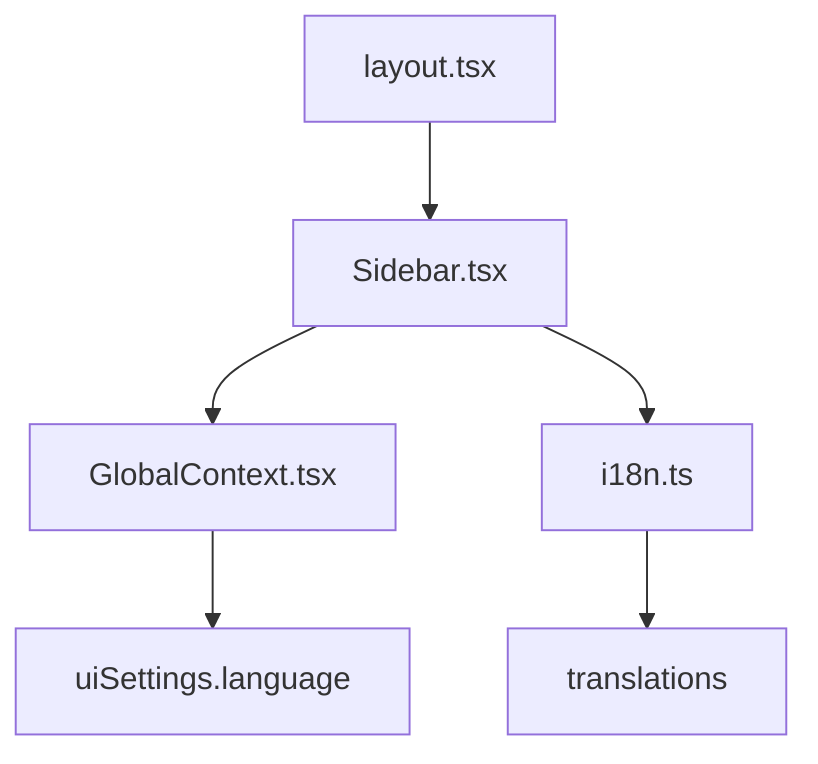
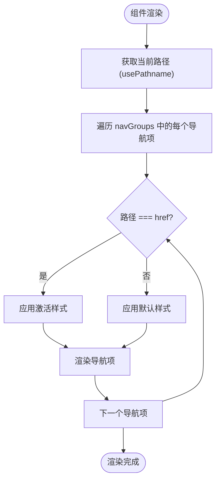
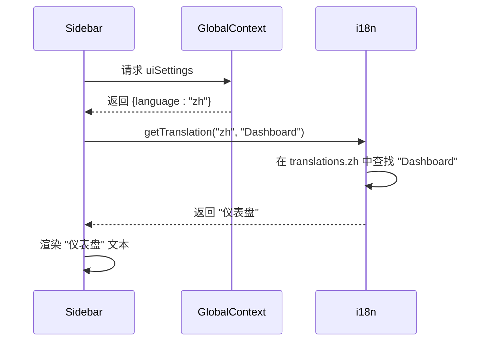
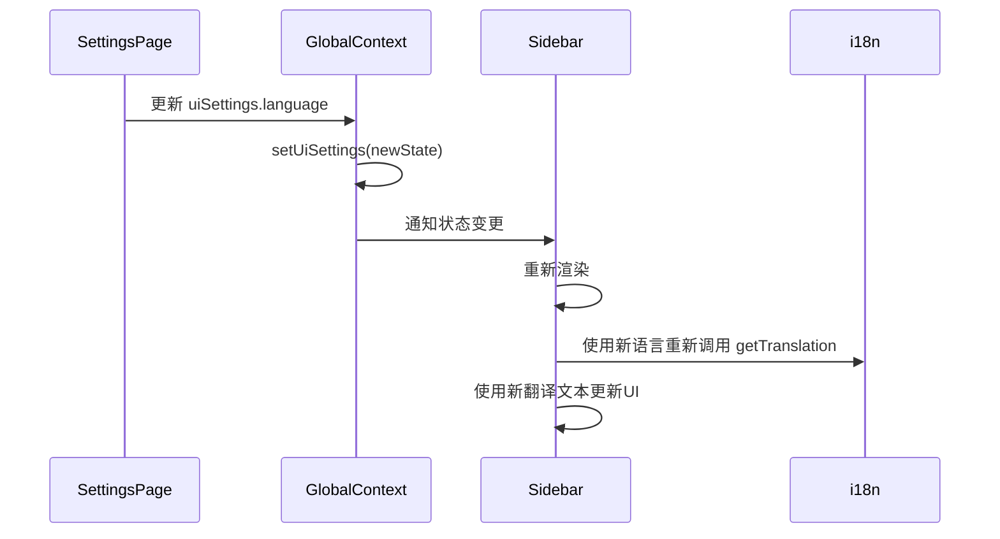
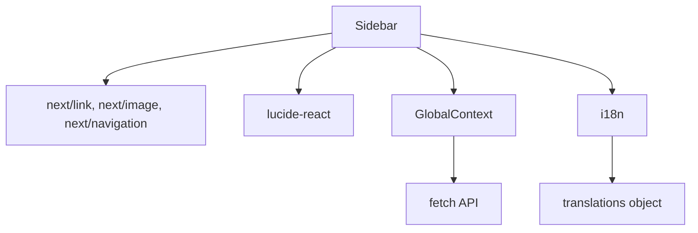

# 导航与布局组件

<cite>
**本文档引用的文件**  
- [Sidebar.tsx](file://web/components/Sidebar.tsx)
- [GlobalContext.tsx](file://web/context/GlobalContext.tsx)
- [i18n.ts](file://web/lib/i18n.ts)
- [layout.tsx](file://web/app/layout.tsx)
</cite>

## 目录
1. [简介](#简介)
2. [项目结构](#项目结构)
3. [核心组件](#核心组件)
4. [架构概述](#架构概述)
5. [详细组件分析](#详细组件分析)
6. [依赖分析](#依赖分析)
7. [性能考虑](#性能考虑)
8. [故障排除指南](#故障排除指南)
9. [结论](#结论)
10. [附录](#附录)（如有必要）

## 简介
本文档深入解析Sidebar导航组件的架构设计与实现细节。该组件作为DeepTutor平台的核心导航界面，集成了路由状态管理、多语言支持、动态导航分组构建、响应式布局、主题切换兼容性、徽标与GitHub链接集成等关键特性。通过usePathname实现精确的导航项激活状态检测，结合GlobalContext实现全局状态订阅，确保了组件在不同页面间的高效复用和性能优化。

## 项目结构
Sidebar组件位于`web/components/`目录下，作为布局组件被`web/app/layout.tsx`引入并渲染。该组件依赖于`web/context/GlobalContext.tsx`提供的全局状态，特别是语言设置，以及`web/lib/i18n.ts`提供的多语言翻译功能。其设计遵循Next.js的App Router模式，使用客户端组件（"use client"）来处理交互逻辑。



**图示来源**
- [layout.tsx](file://web/app/layout.tsx#L4)
- [Sidebar.tsx](file://web/components/Sidebar.tsx#L19)
- [GlobalContext.tsx](file://web/context/GlobalContext.tsx#L246)
- [i18n.ts](file://web/lib/i18n.ts#L1)

**本节来源**
- [Sidebar.tsx](file://web/components/Sidebar.tsx)
- [layout.tsx](file://web/app/layout.tsx)

## 核心组件
Sidebar组件是DeepTutor平台的主导航栏，负责提供用户在不同功能模块（如Dashboard、Knowledge Bases、Question Generator等）之间的快速跳转。其核心功能包括基于当前路由的激活状态高亮、多语言文本渲染、动态导航分组展示以及与全局主题设置的集成。

**本节来源**
- [Sidebar.tsx](file://web/components/Sidebar.tsx#L22-L152)

## 架构概述
Sidebar组件的架构设计围绕着状态管理、国际化和UI渲染三个核心方面展开。它通过`usePathname` Hook获取当前路由路径，以确定哪个导航项应处于激活状态。多语言支持通过`GlobalContext`中的`uiSettings.language`和`getTranslation`函数实现。整个组件的UI采用Tailwind CSS进行样式化，确保了响应式布局和视觉一致性。

```mermaid
classDiagram
class Sidebar {
+usePathname() string
+useGlobal() GlobalContextType
+getTranslation(lang, key) string
+navGroups : NavGroup[]
+render()
}
class GlobalContext {
+uiSettings : {theme, language}
+refreshSettings()
}
class i18n {
+translations : {en, zh}
+getTranslation(lang, key) string
}
Sidebar --> GlobalContext : "使用"
Sidebar --> i18n : "使用"
usePathname --> Sidebar : "提供"
```

**图示来源**
- [Sidebar.tsx](file://web/components/Sidebar.tsx#L5)
- [GlobalContext.tsx](file://web/context/GlobalContext.tsx#L246)
- [i18n.ts](file://web/lib/i18n.ts#L202)

## 详细组件分析

### Sidebar组件分析
Sidebar组件的实现细节体现了现代React应用的最佳实践，包括客户端组件的使用、状态管理、国际化和动态UI构建。

#### 路由状态管理与激活状态检测
组件通过`usePathname` Hook获取当前的URL路径，并与每个导航项的`href`属性进行比较，以确定其激活状态。这一逻辑在渲染导航项时直接内联实现，确保了状态检测的实时性和准确性。



**图示来源**
- [Sidebar.tsx](file://web/components/Sidebar.tsx#L23)
- [Sidebar.tsx](file://web/components/Sidebar.tsx#L105)

**本节来源**
- [Sidebar.tsx](file://web/components/Sidebar.tsx#L23-L114)

#### 多语言支持实现
多语言支持是通过`GlobalContext`和`i18n.ts`库协同工作实现的。首先，组件从`GlobalContext`中获取当前的语言设置（`lang`），然后使用`getTranslation`函数，结合该语言和一个键（key），从预定义的翻译字典中查找并返回对应的本地化文本。



**图示来源**
- [Sidebar.tsx](file://web/components/Sidebar.tsx#L24-L25)
- [Sidebar.tsx](file://web/components/Sidebar.tsx#L27)
- [i18n.ts](file://web/lib/i18n.ts#L202)

**本节来源**
- [Sidebar.tsx](file://web/components/Sidebar.tsx#L24-L28)
- [i18n.ts](file://web/lib/i18n.ts#L1-L211)

#### 动态导航分组构建
导航项被组织成逻辑分组（如“开始”、“学习”、“研究”），这些分组在`navGroups`数组中定义。每个分组包含一个名称和一个项目列表。名称和项目文本都通过`t`函数进行翻译，确保了整个导航结构的国际化。这种数据驱动的方式使得导航结构的修改变得非常简单，只需调整`navGroups`数组即可。

**本节来源**
- [Sidebar.tsx](file://web/components/Sidebar.tsx#L29-L54)

#### UI特性分析
Sidebar的UI特性包括徽标、GitHub链接、响应式布局和主题兼容性。徽标通过`next/image`组件加载，确保了优化的图片加载性能。GitHub链接以图标形式嵌入在侧边栏头部，提供了一键访问项目源码的便捷方式。整个组件使用了`backdrop-blur-xl`等Tailwind CSS类，实现了现代化的毛玻璃效果，并通过`dark:`前缀类实现了与深色/浅色主题的无缝集成。

**本节来源**
- [Sidebar.tsx](file://web/components/Sidebar.tsx#L57-L85)

#### 过渡动画与无障碍访问
组件的交互元素（如导航项）应用了`transition-all duration-200 ease-in-out`等CSS类，为背景色、文字颜色和阴影的变化提供了平滑的过渡动画。无障碍访问方面，使用了语义化的HTML标签（如`<nav>`）、`aria-label`属性（在GitHub链接的`title`属性中体现）以及足够的对比度，确保了不同能力的用户都能有效使用。

**本节来源**
- [Sidebar.tsx](file://web/components/Sidebar.tsx#L110-L114)

### GlobalContext集成分析
Sidebar组件通过`useGlobal` Hook与`GlobalContext`深度集成，订阅了`uiSettings`中的`language`状态。每当用户在设置中更改语言时，`GlobalContext`会更新其状态，从而触发Sidebar组件的重新渲染，并使用新的语言重新翻译所有导航文本。



**图示来源**
- [GlobalContext.tsx](file://web/context/GlobalContext.tsx#L254-L257)
- [Sidebar.tsx](file://web/components/Sidebar.tsx#L24)

**本节来源**
- [GlobalContext.tsx](file://web/context/GlobalContext.tsx#L254-L285)
- [Sidebar.tsx](file://web/components/Sidebar.tsx#L24)

## 依赖分析
Sidebar组件的依赖关系清晰且合理。它直接依赖于Next.js的核心库（`next/link`, `next/image`, `next/navigation`）来处理路由和图片。它依赖于`lucide-react`提供高质量的SVG图标。最关键的是，它依赖于`GlobalContext`来获取全局的UI设置，并依赖于`i18n.ts`来实现多语言功能。这些依赖都通过模块导入的方式声明，确保了代码的可维护性。



**图示来源**
- [Sidebar.tsx](file://web/components/Sidebar.tsx#L3-L19)
- [GlobalContext.tsx](file://web/context/GlobalContext.tsx#L10)
- [i18n.ts](file://web/lib/i18n.ts#L1)

**本节来源**
- [Sidebar.tsx](file://web/components/Sidebar.tsx#L3-L19)
- [GlobalContext.tsx](file://web/context/GlobalContext.tsx)
- [i18n.ts](file://web/lib/i18n.ts)

## 性能考虑
Sidebar组件的性能表现良好。作为一个布局组件，它在应用的整个生命周期内只渲染一次，避免了不必要的重复渲染。其依赖的状态（`uiSettings.language`）变化频率较低，因此重新渲染的开销很小。多语言翻译函数`getTranslation`是一个纯函数，执行速度快。整个组件的UI使用了Tailwind CSS的原子化类，生成的CSS文件体积小，加载速度快。

**本节来源**
- [Sidebar.tsx](file://web/components/Sidebar.tsx)
- [GlobalContext.tsx](file://web/context/GlobalContext.tsx)

## 故障排除指南
如果Sidebar组件出现显示问题，可以按照以下步骤进行排查：
1.  **检查语言设置**：确认`GlobalContext`中的`uiSettings.language`值是否正确（"en"或"zh"）。如果值不正确，检查`refreshSettings`函数是否成功从后端API获取了配置。
2.  **检查翻译键**：如果导航文本显示为英文键（如"Dashboard"），请检查`i18n.ts`文件中对应语言的翻译字典是否包含该键。
3.  **检查路由匹配**：如果激活状态不正确，请检查`usePathname`返回的路径是否与`navGroups`中定义的`href`完全匹配（包括斜杠）。
4.  **检查图标导入**：如果图标未显示，请确认`lucide-react`库已正确安装，并且图标名称拼写无误。

**本节来源**
- [Sidebar.tsx](file://web/components/Sidebar.tsx#L23)
- [GlobalContext.tsx](file://web/context/GlobalContext.tsx#L259-L279)
- [i18n.ts](file://web/lib/i18n.ts#L202)

## 结论
Sidebar导航组件是DeepTutor平台用户界面的关键组成部分。它通过精巧的架构设计，将路由管理、多语言支持、动态UI构建和全局状态集成等功能无缝结合，为用户提供了一个直观、高效且美观的导航体验。其代码结构清晰，依赖关系明确，遵循了现代前端开发的最佳实践，具有良好的可维护性和扩展性。