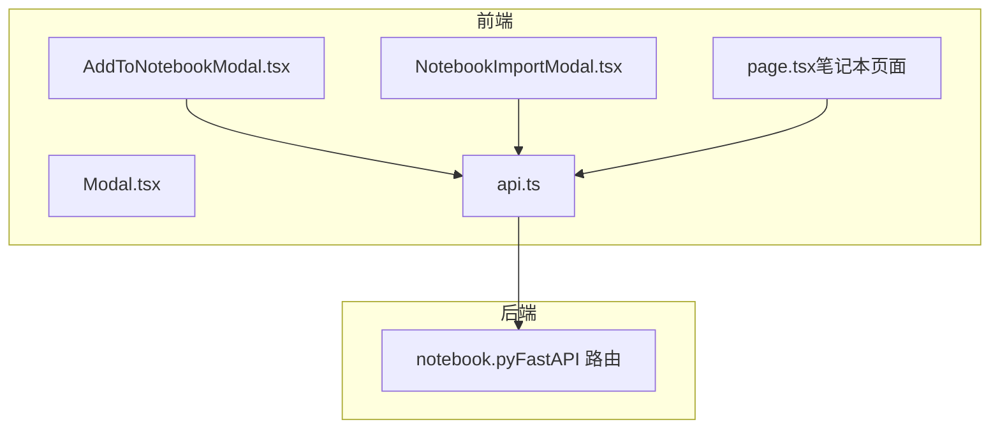
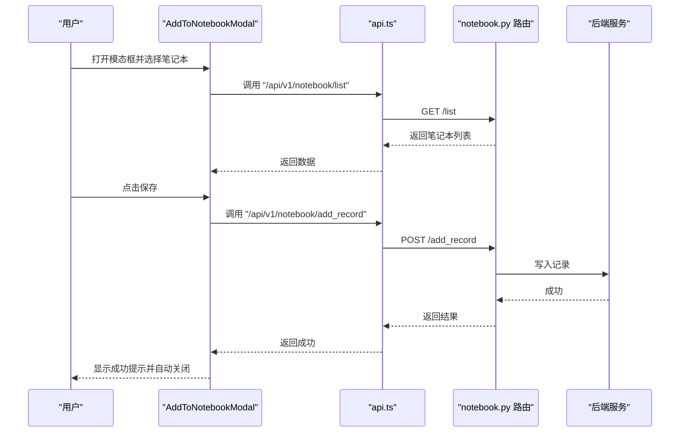
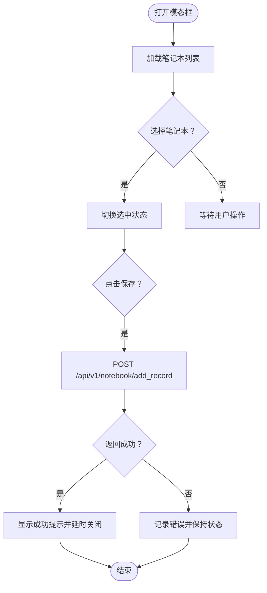
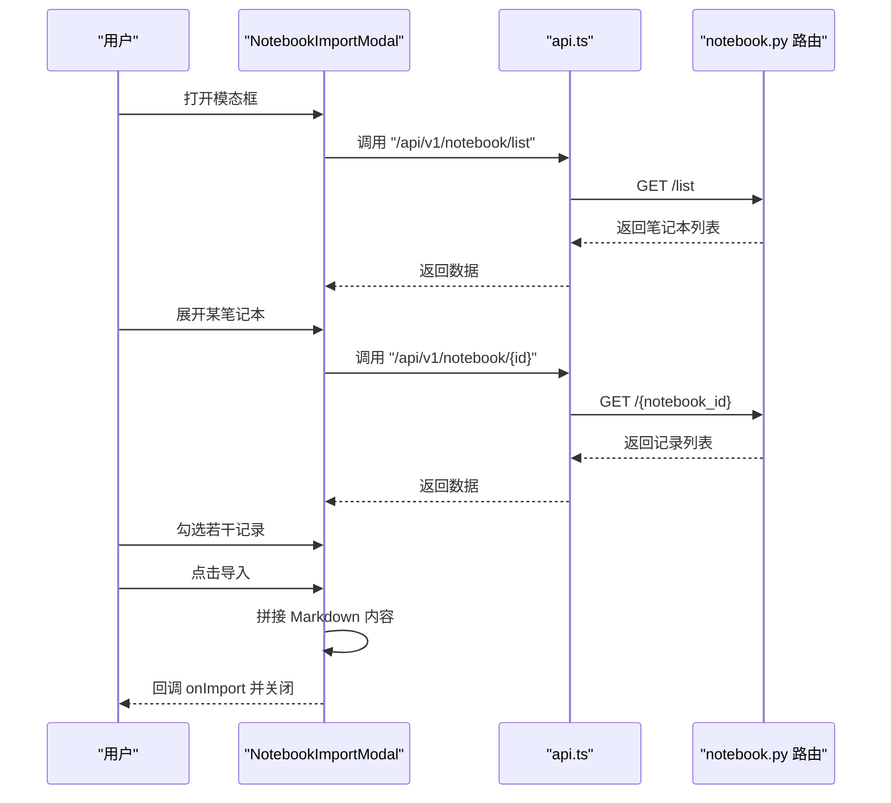
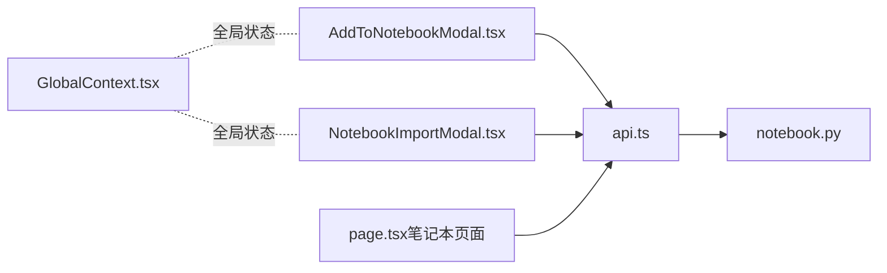

# 模态对话框组件

<cite>
**本文引用的文件列表**
- [AddToNotebookModal.tsx](file://web/components/AddToNotebookModal.tsx)
- [NotebookImportModal.tsx](file://web/components/NotebookImportModal.tsx)
- [Modal.tsx](file://web/components/ui/Modal.tsx)
- [api.ts](file://web/lib/api.ts)
- [notebook.py](file://src/api/routers/notebook.py)
- [page.tsx（笔记本页面）](file://web/app/notebook/page.tsx)
- [GlobalContext.tsx](file://web/context/GlobalContext.tsx)
</cite>

## 目录
1. [引言](#引言)
2. [项目结构](#项目结构)
3. [核心组件](#核心组件)
4. [架构总览](#架构总览)
5. [详细组件分析](#详细组件分析)
6. [依赖关系分析](#依赖关系分析)
7. [性能考量](#性能考量)
8. [故障排查指南](#故障排查指南)
9. [结论](#结论)

## 引言
本文件系统性阐述 AddToNotebookModal 与 NotebookImportModal 两个模态对话框的设计与实现，覆盖以下关键主题：
- 模态框的状态控制机制（showXxxModal 与 isOpen/onClose 的协作）
- 表单数据管理与本地状态流转
- 与笔记系统的集成逻辑（后端接口、请求/响应模型）
- 导入/导出功能的数据流处理、文件解析策略与错误处理
- 动画效果与遮罩层交互行为
- 非阻塞式用户体验设计
- 在实际使用场景中如何保持界面一致性并满足业务需求

## 项目结构
这两个模态组件位于前端 web/components 下，分别负责“添加到笔记本”和“从笔记本导入”的用户操作；它们通过统一的 API 工具函数访问后端服务，并与后端 FastAPI 路由进行对接。

图表来源
- [AddToNotebookModal.tsx](file://web/components/AddToNotebookModal.tsx#L1-L370)
- [NotebookImportModal.tsx](file://web/components/NotebookImportModal.tsx#L1-L355)
- [Modal.tsx](file://web/components/ui/Modal.tsx#L1-L86)
- [api.ts](file://web/lib/api.ts#L1-L59)
- [notebook.py](file://src/api/routers/notebook.py#L1-L248)
- [page.tsx（笔记本页面）](file://web/app/notebook/page.tsx#L129-L328)

章节来源
- [AddToNotebookModal.tsx](file://web/components/AddToNotebookModal.tsx#L1-L370)
- [NotebookImportModal.tsx](file://web/components/NotebookImportModal.tsx#L1-L355)
- [Modal.tsx](file://web/components/ui/Modal.tsx#L1-L86)
- [api.ts](file://web/lib/api.ts#L1-L59)
- [notebook.py](file://src/api/routers/notebook.py#L1-L248)
- [page.tsx（笔记本页面）](file://web/app/notebook/page.tsx#L129-L328)

## 核心组件
- AddToNotebookModal：用于将当前记录（标题、查询、输出、元数据等）批量添加到一个或多个笔记本中。支持新建笔记本、选择现有笔记本、保存成功后的自动关闭。
- NotebookImportModal：用于在多个笔记本之间选择记录并合并导出为文本内容，或在笔记本页面中执行跨笔记本导入。

章节来源
- [AddToNotebookModal.tsx](file://web/components/AddToNotebookModal.tsx#L1-L370)
- [NotebookImportModal.tsx](file://web/components/NotebookImportModal.tsx#L1-L355)

## 架构总览
前端通过 api.ts 提供的 apiUrl 统一构造后端地址，调用 notebook.py 中的 FastAPI 接口完成笔记本与记录的增删改查、统计、以及记录添加等操作。模态框内部以受控组件方式管理状态，避免阻塞主流程。

图表来源
- [AddToNotebookModal.tsx](file://web/components/AddToNotebookModal.tsx#L69-L148)
- [api.ts](file://web/lib/api.ts#L1-L59)
- [notebook.py](file://src/api/routers/notebook.py#L191-L219)

## 详细组件分析

### AddToNotebookModal 分析
- 状态控制
  - 通过 isOpen/onClose 受控渲染，useEffect 在 isOpen 为真时拉取笔记本列表并重置本地状态。
  - 支持新建笔记本与选择现有笔记本，保存成功后自动关闭。
- 数据管理
  - 本地状态包括 notebooks、selectedIds、loading/saving、创建表单字段、成功态等。
  - 新建笔记本时校验名称非空，创建成功后刷新列表并选中新笔记本。
  - 保存记录时将 recordType、title、userQuery、output、metadata、kbName 等参数提交给后端。
- 错误处理
  - 各异步请求均包含 try/catch 并在 finally 中恢复 loading/saving 状态。
  - 控制台打印错误日志，保证不中断用户操作。
- 动画与交互
  - 使用淡入/缩放动画类实现进入动效；成功态采用缩放动画；加载态使用旋转指示器。
  - 遮罩层点击可关闭，按钮禁用基于本地状态判断。
- 与笔记系统的集成
  - 列表接口：GET /api/v1/notebook/list
  - 创建接口：POST /api/v1/notebook/create
  - 添加记录接口：POST /api/v1/notebook/add_record

图表来源
- [AddToNotebookModal.tsx](file://web/components/AddToNotebookModal.tsx#L69-L148)
- [notebook.py](file://src/api/routers/notebook.py#L191-L219)

章节来源
- [AddToNotebookModal.tsx](file://web/components/AddToNotebookModal.tsx#L1-L370)
- [notebook.py](file://src/api/routers/notebook.py#L65-L116)
- [notebook.py](file://src/api/routers/notebook.py#L191-L219)

### NotebookImportModal 分析
- 状态控制
  - 通过 isOpen/onClose 受控渲染；useEffect 在打开时仅拉取笔记本列表，关闭时重置选择与展开状态。
- 数据管理
  - 展开笔记本集合、记录缓存 Map、选中记录集合与数据数组。
  - 展开某个笔记本时按需懒加载其记录；选择记录时同步更新选中集合与数据数组。
  - 导入时将选中记录的标题与输出拼接为 Markdown 文本，回调上层 onImport 并关闭模态框。
- 错误处理
  - 拉取笔记本与记录均包含 try/catch 并在 finally 中恢复 loading 状态。
- 动画与交互
  - 使用淡入/缩放动画与 backdrop-blur 实现柔和遮罩；展开/折叠使用箭头图标切换。
- 与笔记系统的集成
  - 列表接口：GET /api/v1/notebook/list（过滤 record_count > 0）
  - 获取笔记本详情接口：GET /api/v1/notebook/{notebook_id}

图表来源
- [NotebookImportModal.tsx](file://web/components/NotebookImportModal.tsx#L64-L158)
- [notebook.py](file://src/api/routers/notebook.py#L118-L138)

章节来源
- [NotebookImportModal.tsx](file://web/components/NotebookImportModal.tsx#L1-L355)
- [notebook.py](file://src/api/routers/notebook.py#L65-L116)
- [notebook.py](file://src/api/routers/notebook.py#L118-L138)

### 通用 Modal 抽象与遮罩层交互
- 通用 Modal 组件提供统一的遮罩层、Esc 关闭、滚动锁定等基础能力，AddToNotebookModal 与 NotebookImportModal 均直接使用该抽象。
- 遮罩层点击可关闭，Esc 键也可关闭，body overflow 在打开时被隐藏，避免背景滚动。

章节来源
- [Modal.tsx](file://web/components/ui/Modal.tsx#L1-L86)

### 与笔记本页面的联动
- 笔记本页面中存在 showImportModal 等状态，用于在笔记本详情页发起跨笔记本导入流程；该流程与 NotebookImportModal 的数据流一致，但后端调用路径不同（直接对目标笔记本添加记录）。

章节来源
- [page.tsx（笔记本页面）](file://web/app/notebook/page.tsx#L168-L447)

## 依赖关系分析
- 前端依赖
  - AddToNotebookModal/NotebookImportModal 依赖 api.ts 的 apiUrl 统一构造后端地址。
  - 两者均依赖 notebook.py 提供的接口：/list、/create、/add_record、/{id}。
- 后端依赖
  - notebook.py 定义了请求/响应模型（CreateNotebookRequest、AddRecordRequest 等），并提供健康检查接口。
- 上下文与全局状态
  - GlobalContext.tsx 提供全局状态与 WebSocket 连接，与模态框无直接耦合，但体现了整体 UI 状态管理思路。

图表来源
- [AddToNotebookModal.tsx](file://web/components/AddToNotebookModal.tsx#L1-L370)
- [NotebookImportModal.tsx](file://web/components/NotebookImportModal.tsx#L1-L355)
- [api.ts](file://web/lib/api.ts#L1-L59)
- [notebook.py](file://src/api/routers/notebook.py#L1-L248)
- [page.tsx（笔记本页面）](file://web/app/notebook/page.tsx#L129-L328)
- [GlobalContext.tsx](file://web/context/GlobalContext.tsx#L1-L800)

章节来源
- [api.ts](file://web/lib/api.ts#L1-L59)
- [notebook.py](file://src/api/routers/notebook.py#L1-L248)

## 性能考量
- 懒加载与分页
  - NotebookImportModal 对笔记本记录采用按需加载，避免一次性拉取大量数据导致卡顿。
- 本地状态最小化
  - 仅维护必要的本地状态（如 selectedIds、selectedRecords、loadingRecords），减少不必要的重渲染。
- 动画与交互
  - 使用轻量级动画类实现进入/退出动效，避免复杂 JS 动画带来的性能损耗。
- 请求去抖与并发
  - 展开笔记本时使用 Set 记录加载中的笔记本 ID，避免重复请求同一笔记本的记录。
- 错误与回退
  - 失败时保留当前状态，允许用户重试，避免因失败而丢失已选内容。

[本节为通用指导，无需列出具体文件来源]

## 故障排查指南
- 无法连接后端
  - 检查 NEXT_PUBLIC_API_BASE 是否正确配置，api.ts 会在未配置时抛出错误并提示配置方法。
- 列表为空
  - 确认后端 notebook.py 的 /list 接口正常；前端在加载完成后会将 notebooks 设置为 data.notebooks 或空数组。
- 新建笔记本失败
  - 确认名称非空；查看后端 /create 返回的 success 字段；检查网络面板是否有异常响应。
- 添加记录失败
  - 检查 recordType、title、userQuery、output、metadata、kbName 参数是否完整；查看后端 /add_record 返回的 success 字段。
- 导入记录失败
  - NotebookImportModal 的 onImport 回调应正确接收合并内容；笔记本页面的跨笔记本导入需确认目标笔记本 ID 与选中记录集合。
- 遮罩层点击无效
  - 确认 Modal 抽象组件的遮罩层 onClick 事件绑定正常；检查是否有其他元素阻止了事件传播。

章节来源
- [api.ts](file://web/lib/api.ts#L1-L59)
- [notebook.py](file://src/api/routers/notebook.py#L65-L116)
- [notebook.py](file://src/api/routers/notebook.py#L191-L219)
- [Modal.tsx](file://web/components/ui/Modal.tsx#L1-L86)

## 结论
AddToNotebookModal 与 NotebookImportModal 通过清晰的状态控制、稳健的错误处理与良好的动画交互，实现了非阻塞式的笔记系统操作体验。二者均依赖统一的 API 工具与后端路由，前者聚焦“添加记录”，后者聚焦“导入记录”。在实际使用场景中，它们既可独立使用，也可与笔记本页面联动，共同满足多样化的业务需求。