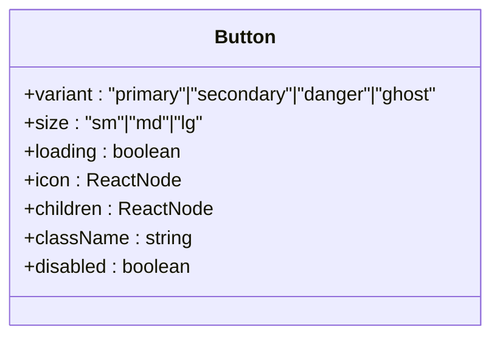
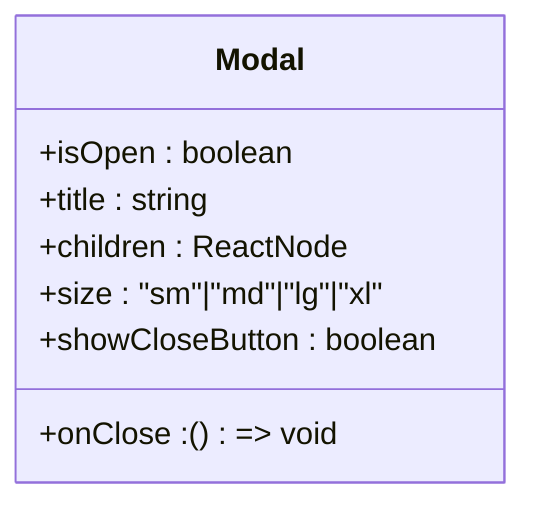
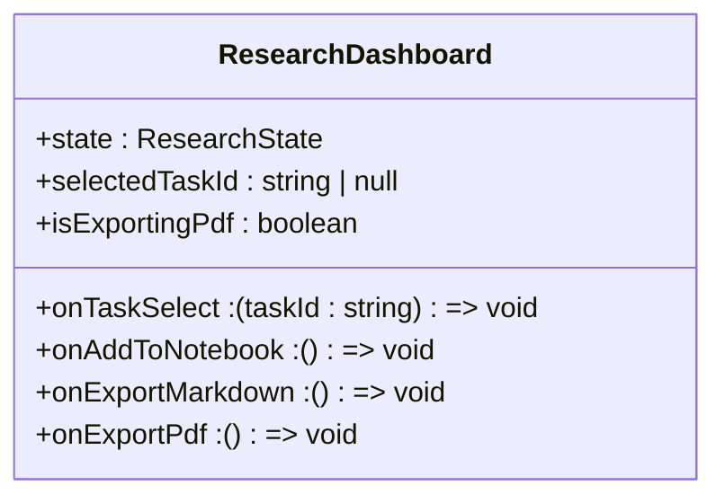
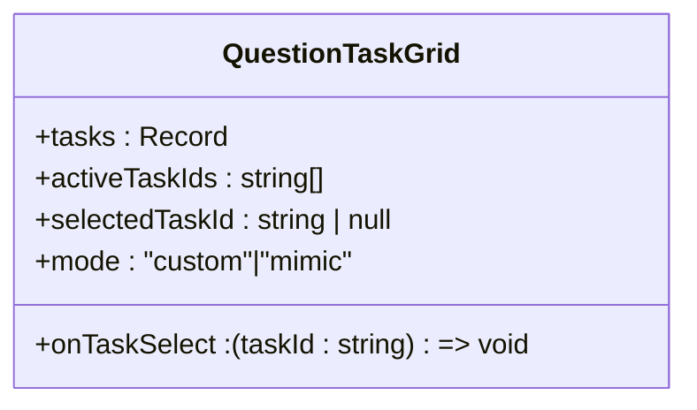
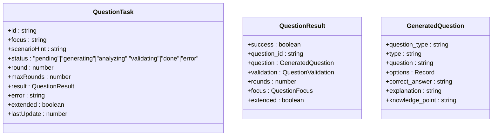
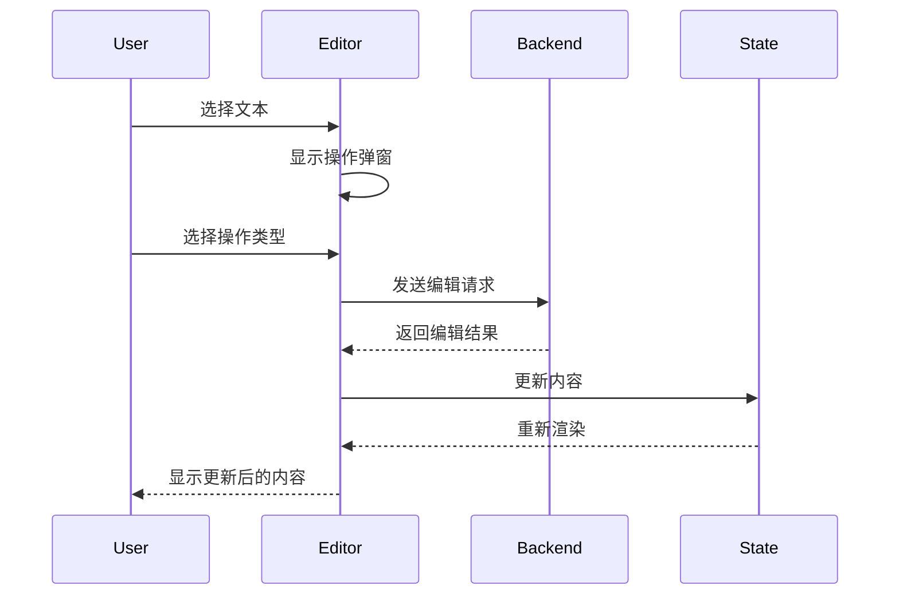
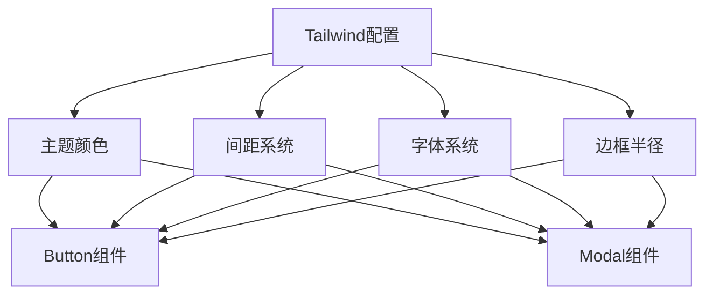
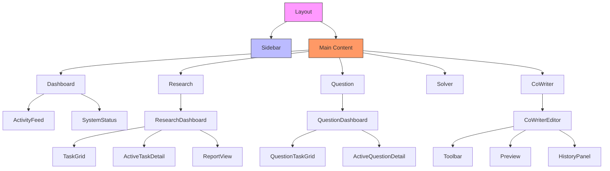
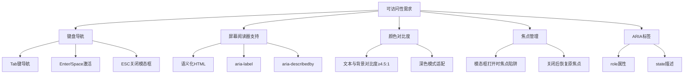

# 组件结构

<cite>
**本文档引用的文件**   
- [Button.tsx](file://web/components/ui/Button.tsx)
- [Modal.tsx](file://web/components/ui/Modal.tsx)
- [QuestionTaskGrid.tsx](file://web/components/question/QuestionTaskGrid.tsx)
- [ResearchDashboard.tsx](file://web/components/research/ResearchDashboard.tsx)
- [CoWriterEditor.tsx](file://web/components/CoWriterEditor.tsx)
- [CoMarkerEditor.tsx](file://web/components/CoMarkerEditor.tsx)
- [question.ts](file://web/types/question.ts)
- [research.ts](file://web/types/research.ts)
- [tailwind.config.js](file://web/tailwind.config.js)
</cite>

## 目录
1. [简介](#简介)
2. [基础UI组件](#基础ui组件)
3. [复合业务组件](#复合业务组件)
4. [专用编辑器组件](#专用编辑器组件)
5. [可复用性设计与接口规范](#可复用性设计与接口规范)
6. [事件处理机制](#事件处理机制)
7. [样式隔离与Tailwind CSS实践](#样式隔离与tailwind-css实践)
8. [组件层级关系图](#组件层级关系图)
9. [UI模式库](#ui模式库)
10. [性能优化与可访问性](#性能优化与可访问性)

## 简介
DeepTutor前端组件体系采用分层架构设计，分为基础UI组件、复合业务组件和专用编辑器组件三大类别。该体系基于React框架构建，结合Next.js服务端渲染能力，实现了高度可复用、可维护的组件化开发模式。组件设计遵循单一职责原则，通过props接口进行数据传递，利用Tailwind CSS实现原子化样式管理。整个系统支持深色模式，并通过Context API实现全局状态管理。

**Section sources**
- [page.tsx](file://web/app/page.tsx)
- [layout.tsx](file://web/app/layout.tsx)

## 基础UI组件
基础UI组件位于`web/components/ui/`目录下，提供最基础的可视化元素。这些组件被设计为高度可配置的原子化组件，通过props控制外观和行为。

### Button组件
Button组件是系统中最常用的基础组件，支持多种变体（primary、secondary、danger、ghost）和尺寸（sm、md、lg）。组件通过Tailwind CSS的实用类实现样式组合，支持加载状态和图标显示。当处于加载状态时，会显示旋转的加载动画。



**Diagram sources**
- [Button.tsx](file://web/components/ui/Button.tsx#L6-L12)

### Modal组件
Modal组件提供模态对话框功能，支持键盘ESC键关闭、点击遮罩层关闭等交互行为。组件通过useEffect Hook管理键盘事件监听器，在打开时禁用页面滚动以防止背景内容滚动。支持不同尺寸（sm、md、lg、xl）和可选的关闭按钮。



**Diagram sources**
- [Modal.tsx](file://web/components/ui/Modal.tsx#L6-L13)

**Section sources**
- [Button.tsx](file://web/components/ui/Button.tsx)
- [Modal.tsx](file://web/components/ui/Modal.tsx)

## 复合业务组件
复合业务组件由基础UI组件组合而成，实现特定业务场景的功能。

### ResearchDashboard组件
ResearchDashboard是研究功能的核心组件，采用多标签页设计展示研究流程的不同阶段（规划、研究、报告）。组件通过状态管理跟踪当前激活的视图（过程或报告）和处理流程标签。支持并行和串行两种执行模式，并提供研究进度的可视化展示。



**Diagram sources**
- [ResearchDashboard.tsx](file://web/components/research/ResearchDashboard.tsx#L34-L42)

### QuestionTaskGrid组件
QuestionTaskGrid用于展示问题生成任务的网格布局，支持自定义模式和模拟模式。组件根据任务状态（pending、generating、analyzing、validating、done、error）显示不同的图标和颜色。支持任务排序（活动任务优先）和状态指示器（脉冲动画表示活动状态）。



**Diagram sources**
- [QuestionTaskGrid.tsx](file://web/components/question/QuestionTaskGrid.tsx#L19-L25)

**Section sources**
- [ResearchDashboard.tsx](file://web/components/research/ResearchDashboard.tsx)
- [QuestionTaskGrid.tsx](file://web/components/question/QuestionTaskGrid.tsx)
- [TaskGrid.tsx](file://web/components/research/TaskGrid.tsx)
- [ActiveTaskDetail.tsx](file://web/components/research/ActiveTaskDetail.tsx)

## 专用编辑器组件
专用编辑器组件为特定功能提供高级编辑能力。

### CoWriterEditor组件
CoWriterEditor是协作写作编辑器，提供富文本编辑功能和AI辅助写作能力。组件支持Markdown语法快捷键（Ctrl+B加粗、Ctrl+I斜体等），并集成AI自动标记功能。编辑器采用双栏设计，左侧为编辑区，右侧为预览区，支持同步滚动。组件还提供知识库（RAG）和网络搜索两种信息源选择。

```mermaid
classDiagram
class CoWriterEditor {
+initialValue : string
+content : string
+selection : {start : number, end : number, text : string}
+instruction : string
+selectedAction : "rewrite"|"shorten"|"expand"|"automark"
+source : "rag"|"web"|null
+selectedKb : string
+isProcessing : boolean
+operationHistory : any[]
+showHistory : boolean
+hideAiMarks : boolean
+backendConnected : boolean | null
}
```

**Diagram sources**
- [CoWriterEditor.tsx](file://web/components/CoWriterEditor.tsx#L57-L59)

### CoMarkerEditor组件
CoMarkerEditor与CoWriterEditor功能相似，但更专注于文本标记和注释功能。组件允许用户选择文本并应用AI生成的标记，支持多种标记类型和样式。编辑器提供历史记录功能，可追溯所有编辑操作。

```mermaid
classDiagram
class CoMarkerEditor {
+initialValue : string
+content : string
+selection : {start : number, end : number, text : string}
+popover : {visible : boolean, x : number, y : number}
+instruction : string
+selectedAction : "rewrite"|"shorten"|"expand"|"automark"
+source : "rag"|"web"|null
+selectedKb : string
+isProcessing : boolean
}
```

**Diagram sources**
- [CoMarkerEditor.tsx](file://web/components/CoMarkerEditor.tsx#L57-L59)

**Section sources**
- [CoWriterEditor.tsx](file://web/components/CoWriterEditor.tsx)
- [CoMarkerEditor.tsx](file://web/components/CoMarkerEditor.tsx)

## 可复用性设计与接口规范
组件体系通过严格的接口规范确保可复用性。所有组件遵循props类型定义，使用TypeScript接口明确声明输入参数。

### Props接口规范
基础组件使用扩展HTML原生属性的方式定义接口，如Button组件继承`React.ButtonHTMLAttributes<HTMLButtonElement>`。业务组件则定义特定的数据结构，如QuestionTaskGrid使用`QuestionTask`类型定义任务数据结构。



**Diagram sources**
- [question.ts](file://web/types/question.ts#L63-L80)

### 组件组合模式
组件采用组合模式构建复杂界面。例如ResearchDashboard由TaskGrid和ActiveTaskDetail组合而成，形成主从视图。这种设计模式提高了组件的可复用性，TaskGrid可独立使用于其他场景。

**Section sources**
- [question.ts](file://web/types/question.ts)
- [research.ts](file://web/types/research.ts)

## 事件处理机制
组件体系采用标准的React事件处理模式，通过回调函数实现父子组件通信。

### 用户交互事件
基础组件如Button和Modal通过onClick、onClose等回调处理用户交互。业务组件如QuestionTaskGrid通过onTaskSelect回调通知父组件任务选择变化。

### 异步操作处理
专用编辑器组件处理复杂的异步操作，如CoWriterEditor的AI编辑请求。组件使用useState管理加载状态，通过fetch API与后端通信，并在处理完成后更新内容。



**Diagram sources**
- [CoWriterEditor.tsx](file://web/components/CoWriterEditor.tsx#L702-L799)

**Section sources**
- [CoWriterEditor.tsx](file://web/components/CoWriterEditor.tsx#L702-L800)

## 样式隔离与Tailwind CSS实践
组件体系采用Tailwind CSS实现原子化样式管理，确保样式的一致性和可维护性。

### 原子化样式应用
所有组件使用Tailwind的实用类直接在JSX中定义样式，避免创建大量的CSS类名。通过组合实用类实现复杂的样式效果，如按钮的变体样式：

```typescript
const variantStyles = {
  primary: "bg-indigo-600 text-white hover:bg-indigo-700 shadow-md shadow-indigo-500/20",
  secondary: "bg-slate-100 text-slate-700 hover:bg-slate-200",
  danger: "bg-red-600 text-white hover:bg-red-700 shadow-md shadow-red-500/20",
  ghost: "text-slate-600 hover:bg-slate-100",
};
```

### 样式隔离策略
组件通过模块化CSS和BEM命名约定实现样式隔离。每个组件的样式作用域限制在组件内部，避免全局样式污染。使用CSS变量和Tailwind的配置文件统一设计系统。



**Diagram sources**
- [tailwind.config.js](file://web/tailwind.config.js)

**Section sources**
- [Button.tsx](file://web/components/ui/Button.tsx#L14-L20)
- [tailwind.config.js](file://web/tailwind.config.js)

## 组件层级关系图


**Diagram sources**
- [layout.tsx](file://web/app/layout.tsx)
- [page.tsx](file://web/app/page.tsx)

## UI模式库
### 状态指示模式
组件使用统一的状态指示设计模式，通过颜色和图标传达状态信息：
- **成功**：绿色（emerald）搭配对勾图标
- **进行中**：蓝色（indigo）搭配旋转加载图标
- **错误**：红色（red）搭配警告图标
- **待处理**：灰色（slate）搭配时钟图标

### 加载反馈模式
所有异步操作提供即时的视觉反馈：
- 按钮加载状态显示旋转动画
- 活动任务显示脉冲动画指示器
- 进度条显示操作完成百分比

### 响应式布局模式
组件适应不同屏幕尺寸：
- 移动端：单列布局
- 平板：双列布局
- 桌面端：多栏布局

**Section sources**
- [ResearchDashboard.tsx](file://web/components/research/ResearchDashboard.tsx)
- [QuestionTaskGrid.tsx](file://web/components/question/QuestionTaskGrid.tsx)

## 性能优化与可访问性
### 性能优化
组件采用多种性能优化策略：
- 使用React.memo进行组件记忆化
- 使用useCallback优化事件处理函数
- 实现虚拟滚动处理大量数据
- 采用代码分割按需加载

### 可访问性实现
组件遵循WCAG可访问性标准：
- 所有交互元素支持键盘导航
- 提供适当的ARIA标签
- 确保足够的颜色对比度
- 支持屏幕阅读器
- 实现焦点管理



**Diagram sources**
- [Modal.tsx](file://web/components/ui/Modal.tsx#L30-L45)
- [Button.tsx](file://web/components/ui/Button.tsx#L47-L48)

**Section sources**
- [Modal.tsx](file://web/components/ui/Modal.tsx)
- [Button.tsx](file://web/components/ui/Button.tsx)