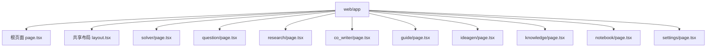
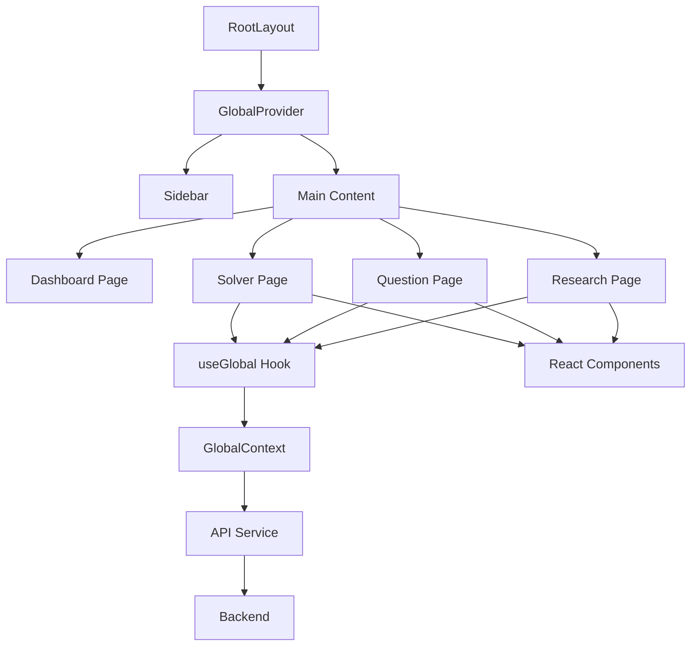

# 页面路由

<cite>
**本文档引用的文件**
- [layout.tsx](file://web/app/layout.tsx)
- [page.tsx](file://web/app/page.tsx)
- [solver/page.tsx](file://web/app/solver/page.tsx)
- [question/page.tsx](file://web/app/question/page.tsx)
- [research/page.tsx](file://web/app/research/page.tsx)
- [co_writer/page.tsx](file://web/app/co_writer/page.tsx)
- [guide/page.tsx](file://web/app/guide/page.tsx)
- [ideagen/page.tsx](file://web/app/ideagen/page.tsx)
- [knowledge/page.tsx](file://web/app/knowledge/page.tsx)
- [notebook/page.tsx](file://web/app/notebook/page.tsx)
- [settings/page.tsx](file://web/app/settings/page.tsx)
- [GlobalContext.tsx](file://web/context/GlobalContext.tsx)
- [i18n.ts](file://web/lib/i18n.ts)
</cite>

## 目录
1. [介绍](#介绍)
2. [项目结构](#项目结构)
3. [核心组件](#核心组件)
4. [架构概述](#架构概述)
5. [详细组件分析](#详细组件分析)
6. [依赖分析](#依赖分析)
7. [性能考虑](#性能考虑)
8. [故障排除指南](#故障排除指南)
9. [结论](#结论)

## 介绍
DeepTutor 是一个基于 Next.js App Router 构建的多智能体教学与研究平台。本项目利用 Next.js 的现代化 App Router 架构，实现了清晰的页面路由组织、高效的共享布局、动态和嵌套路由，并集成了全局状态管理、API 服务、权限控制、国际化（i18n）和 SEO 优化等高级功能。其核心功能模块包括智能解题（/solver）、题目生成（/question）、深度研究（/research）等，每个模块都通过独立的路由进行组织，确保了代码的模块化和可维护性。

**Section sources**
- [page.tsx](file://web/app/page.tsx#L1-L384)
- [layout.tsx](file://web/app/layout.tsx#L1-L39)

## 项目结构
DeepTutor 项目的页面路由结构遵循 Next.js App Router 的约定，所有页面和布局文件都位于 `web/app` 目录下。该目录的结构清晰地映射了应用的导航结构。

```
web/app/
├── co_writer/
│   └── page.tsx
├── guide/
│   └── page.tsx
├── ideagen/
│   └── page.tsx
├── knowledge/
│   └── page.tsx
├── notebook/
│   └── page.tsx
├── question/
│   └── page.tsx
├── research/
│   └── page.tsx
├── settings/
│   └── page.tsx
├── solver/
│   └── page.tsx
├── globals.css
├── layout.tsx
└── page.tsx
```

`page.tsx` 文件是应用的根页面，即仪表盘（Dashboard）。其他功能模块如 `/solver`、`/question`、`/research` 等，各自拥有独立的子目录，每个子目录下的 `page.tsx` 文件定义了该模块的入口页面。这种扁平化的结构使得路由的组织非常直观，易于理解和维护。



**Diagram sources**
- [web/app](file://web/app)

**Section sources**
- [web/app](file://web/app)

## 核心组件
DeepTutor 的核心功能由多个独立的页面组件构成，这些组件通过 App Router 的路由机制进行组织和访问。每个功能模块（如 Solver、Question、Research）都封装在自己的目录中，实现了高内聚、低耦合的设计原则。

### 共享布局 (layout.tsx)
`layout.tsx` 文件定义了整个应用的共享布局。它使用 React Server Components (RSC) 在服务器端渲染，为所有子页面提供一致的 UI 框架，包括侧边栏（Sidebar）和全局状态提供者（GlobalProvider）。

```tsx
export default function RootLayout({ children }: { children: React.ReactNode }) {
  return (
    <html lang="en" suppressHydrationWarning>
      <body className={font.className}>
        <GlobalProvider>
          <div className="flex h-screen bg-slate-50 dark:bg-slate-900 overflow-hidden transition-colors duration-200">
            <Sidebar />
            <main className="flex-1 overflow-y-auto bg-slate-50 dark:bg-slate-900">
              <div className="w-full p-8">{children}</div>
            </main>
          </div>
        </GlobalProvider>
      </body>
    </html>
  );
}
```

此布局将 `children`（即当前路由的页面内容）包裹在侧边栏和主内容区之间，确保了所有页面都具有一致的导航和视觉风格。

**Section sources**
- [layout.tsx](file://web/app/layout.tsx#L1-L39)

### 功能模块页面
每个功能模块的 `page.tsx` 文件都是一个客户端组件（通过 `"use client"` 指令声明），负责渲染该模块的用户界面和处理用户交互。

- **智能解题 (`/solver/page.tsx`)**：提供一个聊天界面，用户可以输入问题，系统通过多智能体协作进行解答。
- **题目生成 (`/question/page.tsx`)**：允许用户配置参数（如难度、类型）来生成练习题或模拟考试。
- **深度研究 (`/research/page.tsx`)**：提供一个研究实验室，用户可以输入研究主题，系统会进行深入的文献调研并生成报告。
- **智能写作 (`/co_writer/page.tsx`)**：集成一个智能 Markdown 编辑器，辅助用户进行内容创作。
- **引导式学习 (`/guide/page.tsx`)** 和 **创意生成 (`/ideagen/page.tsx`)**：基于用户笔记提供个性化的学习路径和研究创意。
- **知识库 (`/knowledge/page.tsx`)** 和 **笔记本 (`/notebook/page.tsx`)**：用于管理和组织学习资料。

这些页面组件通过导入和使用共享的 UI 组件（如按钮、模态框）和业务逻辑（如 API 调用、状态管理）来构建其功能。

**Section sources**
- [solver/page.tsx](file://web/app/solver/page.tsx#L1-L890)
- [question/page.tsx](file://web/app/question/page.tsx#L1-L1095)
- [research/page.tsx](file://web/app/research/page.tsx#L1-L775)
- [co_writer/page.tsx](file://web/app/co_writer/page.tsx#L1-L27)

## 架构概述
DeepTutor 应用的架构是一个典型的客户端-服务器模型，结合了 Next.js App Router 的现代特性。其核心是围绕全局状态和 API 服务构建的。

```mermaid
graph TD
A[客户端: Next.js App Router] --> B[共享布局 layout.tsx]
A --> C[功能页面 (solver, question, research...)]
C --> D[UI 组件 (React)]
C --> E[全局状态 GlobalContext]
E --> F[API 服务 (fetch, WebSocket)]
F --> G[后端 API (Python FastAPI)]
G --> H[数据库/知识库]
C --> I[第三方库 (lucide-react, react-markdown)]
```

**Diagram sources**
- [layout.tsx](file://web/app/layout.tsx#L1-L39)
- [solver/page.tsx](file://web/app/solver/page.tsx#L1-L890)
- [GlobalContext.tsx](file://web/context/GlobalContext.tsx#L1-L1341)

**Section sources**
- [layout.tsx](file://web/app/layout.tsx#L1-L39)
- [solver/page.tsx](file://web/app/solver/page.tsx#L1-L890)
- [GlobalContext.tsx](file://web/context/GlobalContext.tsx#L1-L1341)

## 详细组件分析

### 全局状态管理 (GlobalContext)
`GlobalContext.tsx` 是应用的核心，它使用 React Context API 创建了一个全局状态管理器。该上下文为所有页面组件提供了一个统一的状态访问和更新接口。

```tsx
const GlobalContext = createContext<GlobalContextType | undefined>(undefined);

export function GlobalProvider({ children }: { children: React.ReactNode }) {
  // --- Solver State ---
  const [solverState, setSolverState] = useState<SolverState>({ ... });
  const startSolver = (question: string, kb: string) => { ... };

  // --- Question State ---
  const [questionState, setQuestionState] = useState<QuestionState>({ ... });
  const startQuestionGen = (topic: string, diff: string, type: string, count: number, kb: string) => { ... };

  // --- Research State ---
  const [researchState, setResearchState] = useState<ResearchState>({ ... });
  const startResearch = (topic: string, kb: string, planMode?: string, enabledTools?: string[]) => { ... };

  // --- UI Settings ---
  const [uiSettings, setUiSettings] = useState<{ theme: "light" | "dark"; language: "en" | "zh" }>({ theme: "light", language: "en" });

  return (
    <GlobalContext.Provider value={{
      solverState, setSolverState, startSolver,
      questionState, setQuestionState, startQuestionGen,
      researchState, setResearchState, startResearch,
      uiSettings, refreshSettings
    }}>
      {children}
    </GlobalContext.Provider>
  );
}
```

各个页面组件通过 `useGlobal()` Hook 来消费这个上下文，从而访问和修改全局状态。例如，`solver/page.tsx` 通过 `useGlobal()` 获取 `solverState` 和 `startSolver` 函数，实现了与后端的 WebSocket 通信和状态同步。

**Section sources**
- [GlobalContext.tsx](file://web/context/GlobalContext.tsx#L1-L1341)
- [solver/page.tsx](file://web/app/solver/page.tsx#L1-L890)

### API 服务集成 (lib/api.ts)
`lib/api.ts` 文件封装了与后端 API 通信的逻辑，提供了 `apiUrl` 和 `wsUrl` 工具函数，用于生成 HTTP 和 WebSocket 的 URL。

```tsx
export const API_BASE_URL = process.env.NEXT_PUBLIC_API_BASE_URL || "http://localhost:8000";
export const WS_BASE_URL = process.env.NEXT_PUBLIC_WS_BASE_URL || "ws://localhost:8000";

export function apiUrl(path: string) {
  return `${API_BASE_URL}${path}`;
}

export function wsUrl(path: string) {
  return `${WS_BASE_URL}${path}`;
}
```

页面组件通过调用 `fetch(apiUrl("/api/v1/solve"))` 或 `new WebSocket(wsUrl("/api/v1/solve"))` 来与后端交互，实现了数据的获取和实时通信。

**Section sources**
- [lib/api.ts](file://web/lib/api.ts)
- [solver/page.tsx](file://web/app/solver/page.tsx#L1-L890)

## 依赖分析
DeepTutor 项目的依赖关系清晰，主要分为以下几个层次：



**Diagram sources**
- [layout.tsx](file://web/app/layout.tsx#L1-L39)
- [GlobalContext.tsx](file://web/context/GlobalContext.tsx#L1-L1341)
- [solver/page.tsx](file://web/app/solver/page.tsx#L1-L890)

**Section sources**
- [layout.tsx](file://web/app/layout.tsx#L1-L39)
- [GlobalContext.tsx](file://web/context/GlobalContext.tsx#L1-L1341)
- [solver/page.tsx](file://web/app/solver/page.tsx#L1-L890)

## 性能考虑
DeepTutor 在性能方面采取了以下策略：
1.  **共享布局**：`layout.tsx` 在服务器端渲染，避免了客户端的重复渲染，提升了首屏加载速度。
2.  **客户端组件**：功能页面作为客户端组件，利用 React 的状态管理和事件处理能力，提供流畅的交互体验。
3.  **WebSocket 通信**：对于需要实时更新的场景（如解题过程、研究进度），使用 WebSocket 而非轮询，减少了网络开销。
4.  **代码分割**：Next.js App Router 天然支持基于路由的代码分割，确保用户只加载当前页面所需的代码。

## 故障排除指南
- **页面无法加载**：检查后端服务是否已启动，以及 `NEXT_PUBLIC_API_BASE_URL` 环境变量是否正确配置。
- **WebSocket 连接失败**：确认 `NEXT_PUBLIC_WS_BASE_URL` 配置正确，并检查后端 WebSocket 服务是否正常运行。
- **状态不同步**：确保所有需要访问全局状态的组件都正确使用了 `useGlobal()` Hook。
- **国际化失效**：检查 `uiSettings.language` 的值，并确认 `i18n.ts` 文件中的翻译键是否正确。

**Section sources**
- [GlobalContext.tsx](file://web/context/GlobalContext.tsx#L1-L1341)
- [i18n.ts](file://web/lib/i18n.ts#L1-L211)

## 结论
DeepTutor 项目通过采用 Next.js App Router，构建了一个结构清晰、可扩展性强的现代化 Web 应用。其路由架构以功能模块为核心，通过共享布局保证了 UI 的一致性，并通过全局状态管理器和 API 服务实现了组件间的高效通信。这种架构设计不仅提升了开发效率，也为未来的功能扩展奠定了坚实的基础。