# API路由设计

<cite>
**本文档引用的文件**
- [main.py](file://src/api/main.py)
- [solve.py](file://src/api/routers/solve.py)
- [question.py](file://src/api/routers/question.py)
- [research.py](file://src/api/routers/research.py)
- [co_writer.py](file://src/api/routers/co_writer.py)
- [guide.py](file://src/api/routers/guide.py)
- [ideagen.py](file://src/api/routers/ideagen.py)
- [knowledge.py](file://src/api/routers/knowledge.py)
- [notebook.py](file://src/api/routers/notebook.py)
- [dashboard.py](file://src/api/routers/dashboard.py)
- [settings.py](file://src/api/routers/settings.py)
- [system.py](file://src/api/routers/system.py)
- [task_id_manager.py](file://src/api/utils/task_id_manager.py)
- [history.py](file://src/api/utils/history.py)
</cite>

## 目录
1. [简介](#简介)
2. [项目结构](#项目结构)
3. [核心组件](#核心组件)
4. [架构概述](#架构概述)
5. [详细组件分析](#详细组件分析)
6. [依赖分析](#依赖分析)
7. [性能考虑](#性能考虑)
8. [故障排除指南](#故障排除指南)
9. [结论](#结论)

## 简介
DeepTutor是一个基于FastAPI的智能教育平台，提供解题、研究、引导、问题生成等多种AI辅助学习功能。本API文档详细描述了系统的RESTful和WebSocket路由设计，包括各功能模块的实现逻辑、路由注册机制、生命周期事件处理以及CORS跨域配置策略。

## 项目结构
DeepTutor的API路由采用模块化设计，每个功能模块都有独立的路由器文件，统一在主应用中注册。这种设计提高了代码的可维护性和可扩展性。

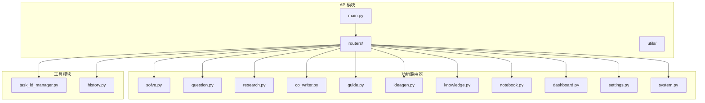

**图源**
- [main.py](file://src/api/main.py#L1-L129)
- [routers目录](file://src/api/routers/)

**章节源**
- [main.py](file://src/api/main.py#L1-L129)

## 核心组件
DeepTutor的API核心组件包括基于FastAPI的应用实例、模块化路由器、任务ID管理器和历史记录管理器。这些组件协同工作，提供了完整的RESTful和WebSocket服务。

**章节源**
- [main.py](file://src/api/main.py#L1-L129)
- [task_id_manager.py](file://src/api/utils/task_id_manager.py#L1-L103)
- [history.py](file://src/api/utils/history.py#L1-L172)

## 架构概述
DeepTutor的API架构采用分层设计，包括应用层、路由层、服务层和工具层。应用层负责初始化FastAPI实例和配置中间件；路由层包含各个功能模块的API端点；服务层提供业务逻辑实现；工具层提供通用功能支持。

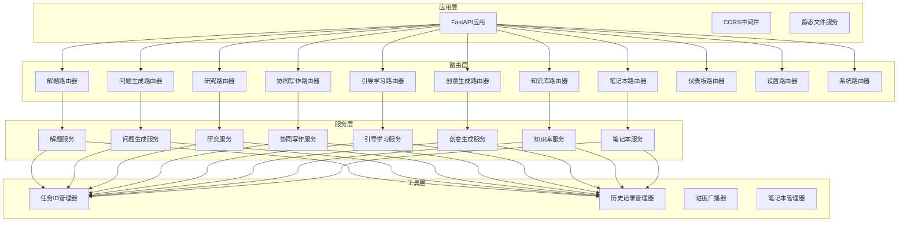

**图源**
- [main.py](file://src/api/main.py#L1-L129)
- [各路由器文件](file://src/api/routers/)

**章节源**
- [main.py](file://src/api/main.py#L1-L129)

## 详细组件分析
### 解题功能分析
解题功能通过WebSocket提供实时问题解决服务，支持流式日志输出和进度更新。

#### 解题路由器实现
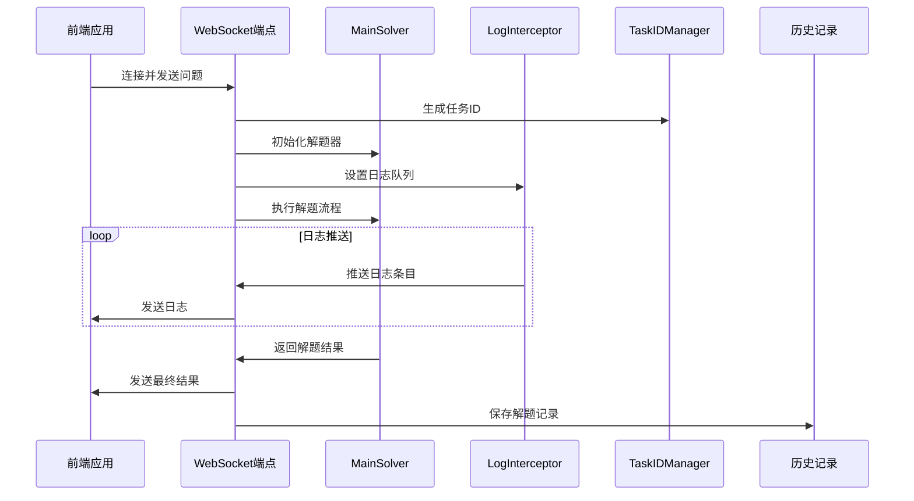

**图源**
- [solve.py](file://src/api/routers/solve.py#L1-L294)

**章节源**
- [solve.py](file://src/api/routers/solve.py#L1-L294)

### 问题生成功能分析
问题生成功能支持两种模式：直接上传PDF试卷和使用预解析的试卷目录。

#### 问题生成路由器实现
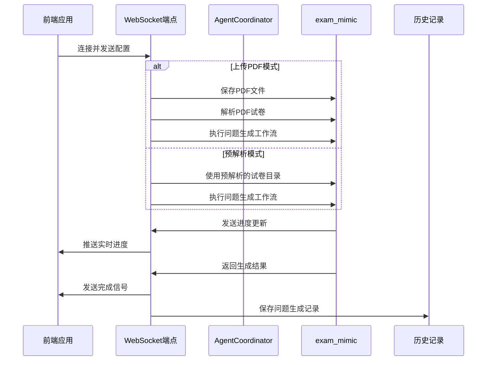

**图源**
- [question.py](file://src/api/routers/question.py#L1-L465)

**章节源**
- [question.py](file://src/api/routers/question.py#L1-L465)

### 研究功能分析
研究功能提供学术研究支持，包括主题优化和研究流程执行。

#### 研究路由器实现
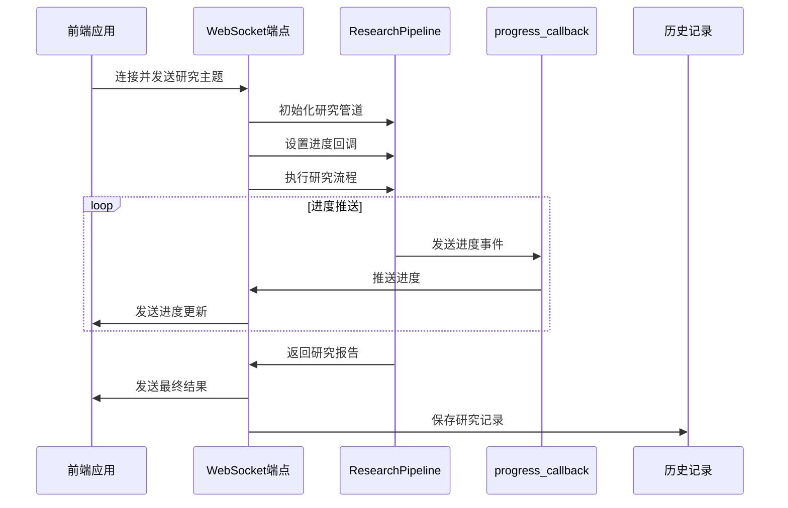

**图源**
- [research.py](file://src/api/routers/research.py#L1-L407)

**章节源**
- [research.py](file://src/api/routers/research.py#L1-L407)

### 协同写作功能分析
协同写作功能提供文本编辑、自动批改和语音讲解功能。

#### 协同写作路由器实现
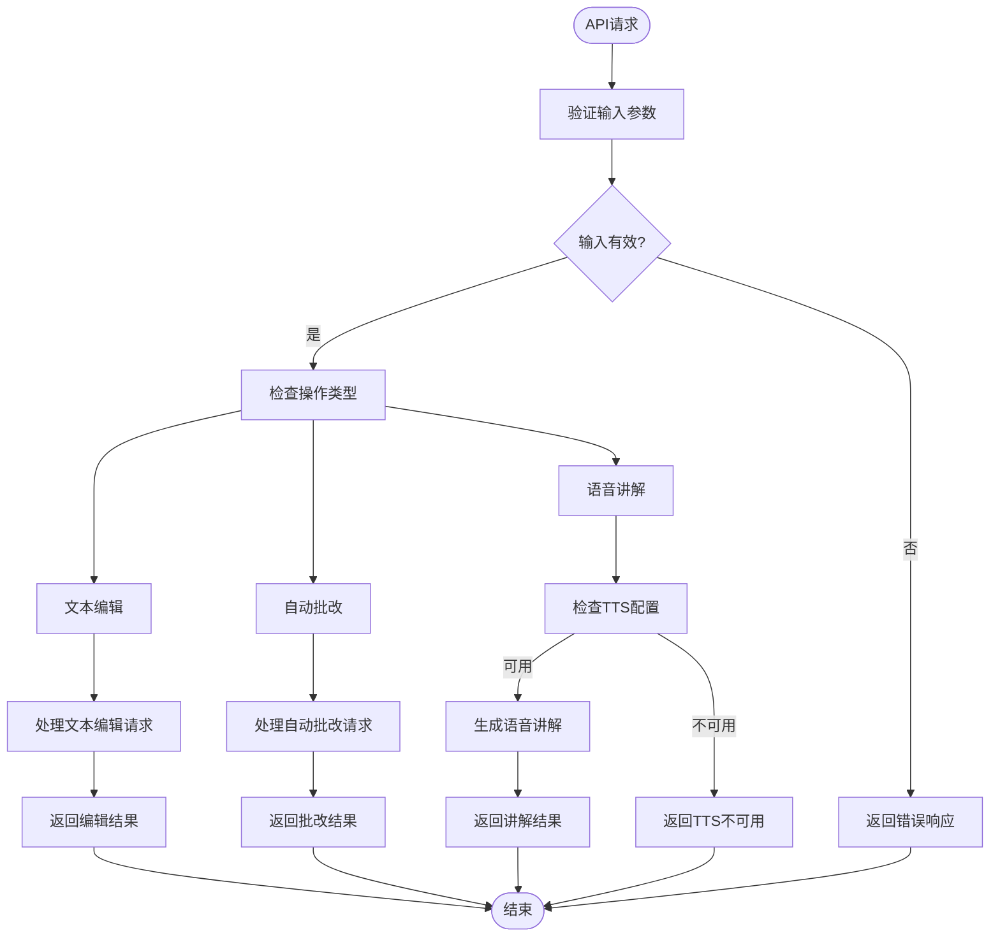

**图源**
- [co_writer.py](file://src/api/routers/co_writer.py#L1-L313)

**章节源**
- [co_writer.py](file://src/api/routers/co_writer.py#L1-L313)

### 引导学习功能分析
引导学习功能提供会话管理、学习进度跟踪和聊天交互。

#### 引导学习路由器实现
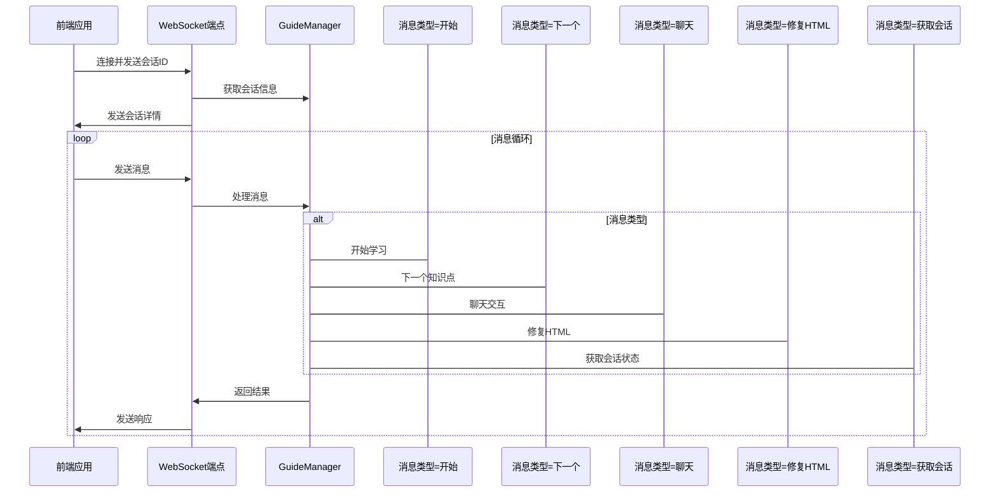

**图源**
- [guide.py](file://src/api/routers/guide.py#L1-L337)

**章节源**
- [guide.py](file://src/api/routers/guide.py#L1-L337)

### 创意生成功能分析
创意生成功能从笔记本内容中生成研究创意。

#### 创意生成路由器实现
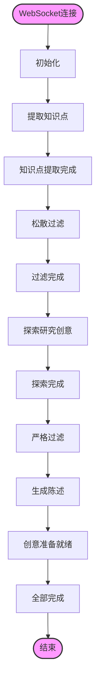

**图源**
- [ideagen.py](file://src/api/routers/ideagen.py#L1-L414)

**章节源**
- [ideagen.py](file://src/api/routers/ideagen.py#L1-L414)

### 知识库功能分析
知识库功能提供知识库的CRUD操作、文件上传和初始化。

#### 知识库路由器实现
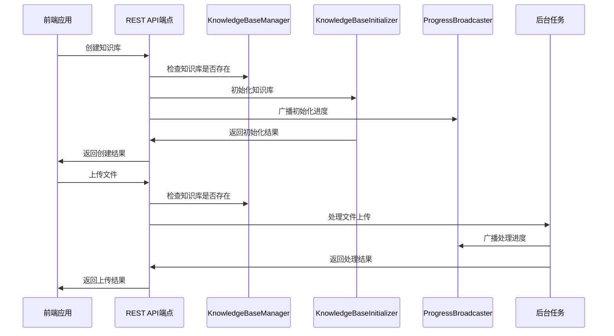

**图源**
- [knowledge.py](file://src/api/routers/knowledge.py#L1-L535)

**章节源**
- [knowledge.py](file://src/api/routers/knowledge.py#L1-L535)

### 笔记本功能分析
笔记本功能提供笔记本的创建、查询、更新和删除，以及记录管理。

#### 笔记本路由器实现
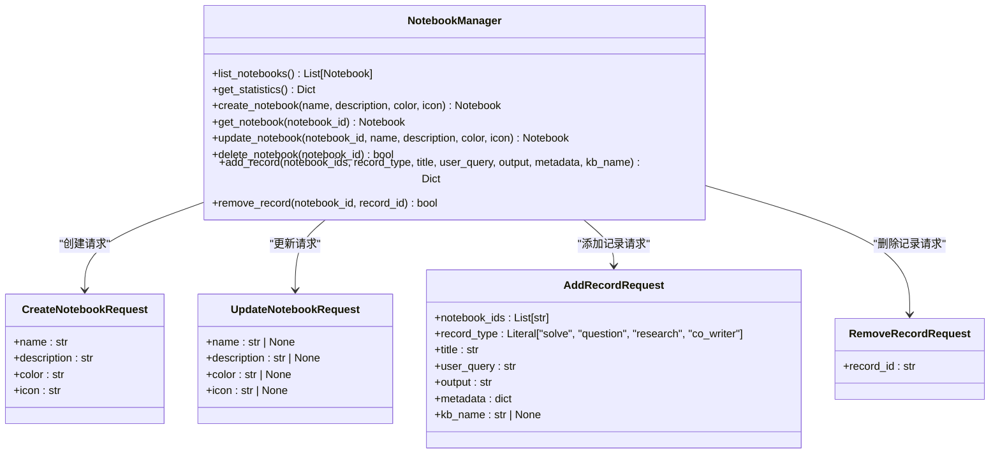

**图源**
- [notebook.py](file://src/api/routers/notebook.py#L1-L248)

**章节源**
- [notebook.py](file://src/api/routers/notebook.py#L1-L248)

### 仪表板功能分析
仪表板功能提供最近历史记录和历史条目查询。

#### 仪表板路由器实现
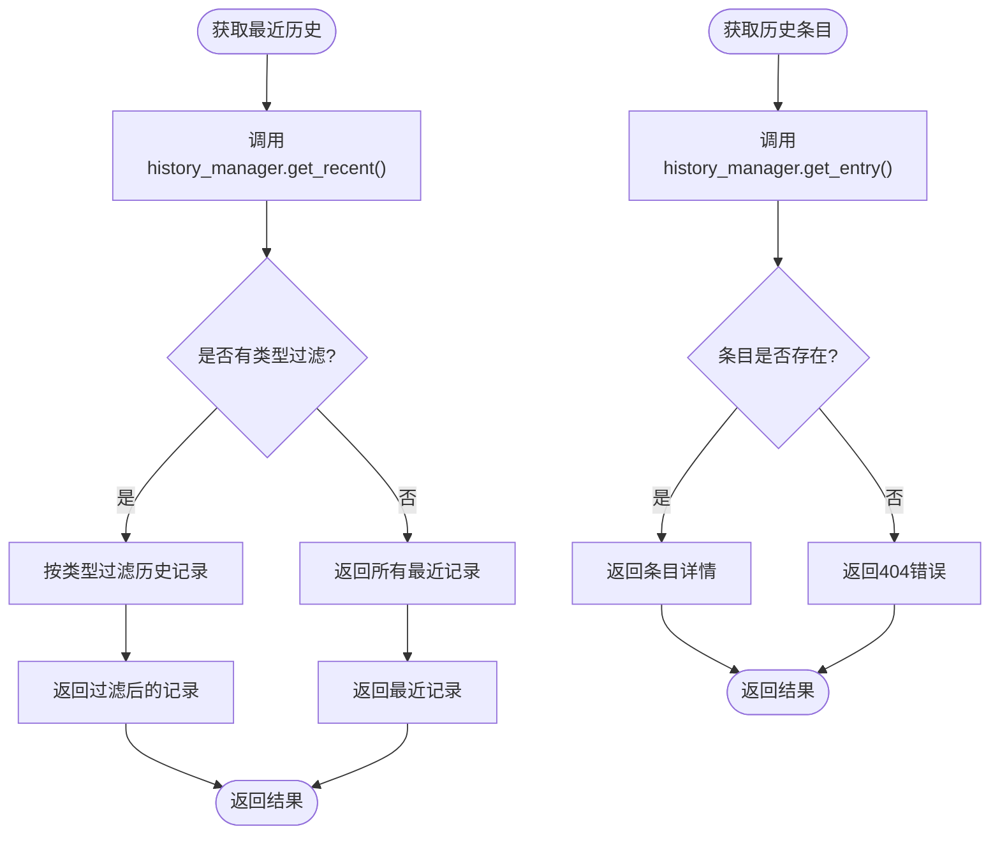

**图源**
- [dashboard.py](file://src/api/routers/dashboard.py#L1-L19)

**章节源**
- [dashboard.py](file://src/api/routers/dashboard.py#L1-L19)

### 设置功能分析
设置功能管理用户设置，包括主题、语言和环境变量。

#### 设置路由器实现
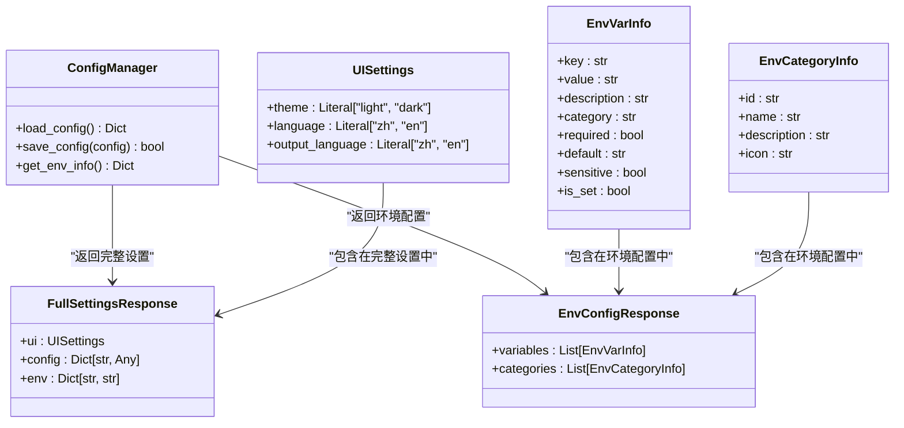

**图源**
- [settings.py](file://src/api/routers/settings.py#L1-L597)

**章节源**
- [settings.py](file://src/api/routers/settings.py#L1-L597)

### 系统功能分析
系统功能提供系统状态检查和模型连接测试。

#### 系统路由器实现
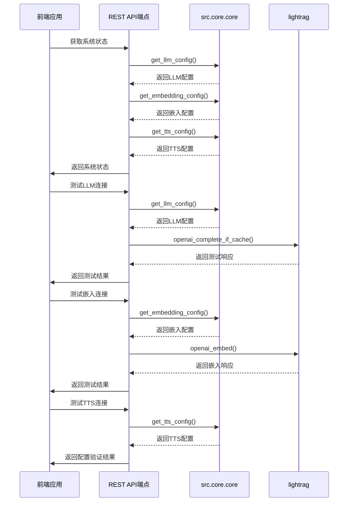

**图源**
- [system.py](file://src/api/routers/system.py#L1-L256)

**章节源**
- [system.py](file://src/api/routers/system.py#L1-L256)

## 依赖分析
DeepTutor的API组件之间存在明确的依赖关系，通过模块化设计降低了耦合度。

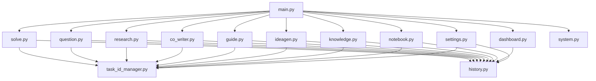

**图源**
- [main.py](file://src/api/main.py#L1-L129)
- [各路由器文件](file://src/api/routers/)

**章节源**
- [main.py](file://src/api/main.py#L1-L129)

## 性能考虑
DeepTutor的API设计考虑了性能优化，包括异步处理、后台任务和连接池管理。

**章节源**
- [main.py](file://src/api/main.py#L1-L129)
- [各路由器文件](file://src/api/routers/)

## 故障排除指南
当遇到API问题时，可以按照以下步骤进行排查：

1. 检查服务器是否正常运行
2. 验证请求的URL路径和HTTP方法是否正确
3. 检查请求参数是否符合API文档要求
4. 查看服务器日志以获取详细错误信息
5. 验证认证令牌是否有效且未过期
6. 检查网络连接是否正常

**章节源**
- [main.py](file://src/api/main.py#L1-L129)
- [各路由器文件](file://src/api/routers/)

## 结论
DeepTutor的API路由设计采用了现代化的FastAPI框架，提供了丰富的RESTful和WebSocket接口。通过模块化设计，各个功能组件保持了良好的独立性和可维护性。系统实现了完整的错误处理、日志记录和安全性措施，为用户提供稳定可靠的AI辅助学习服务。