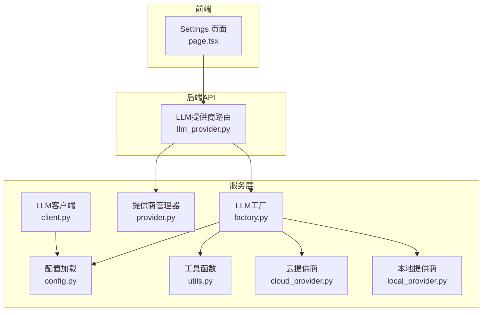
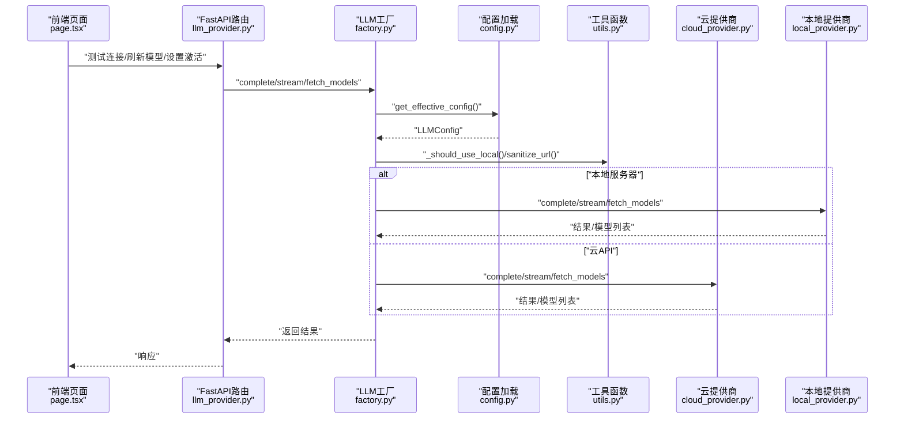
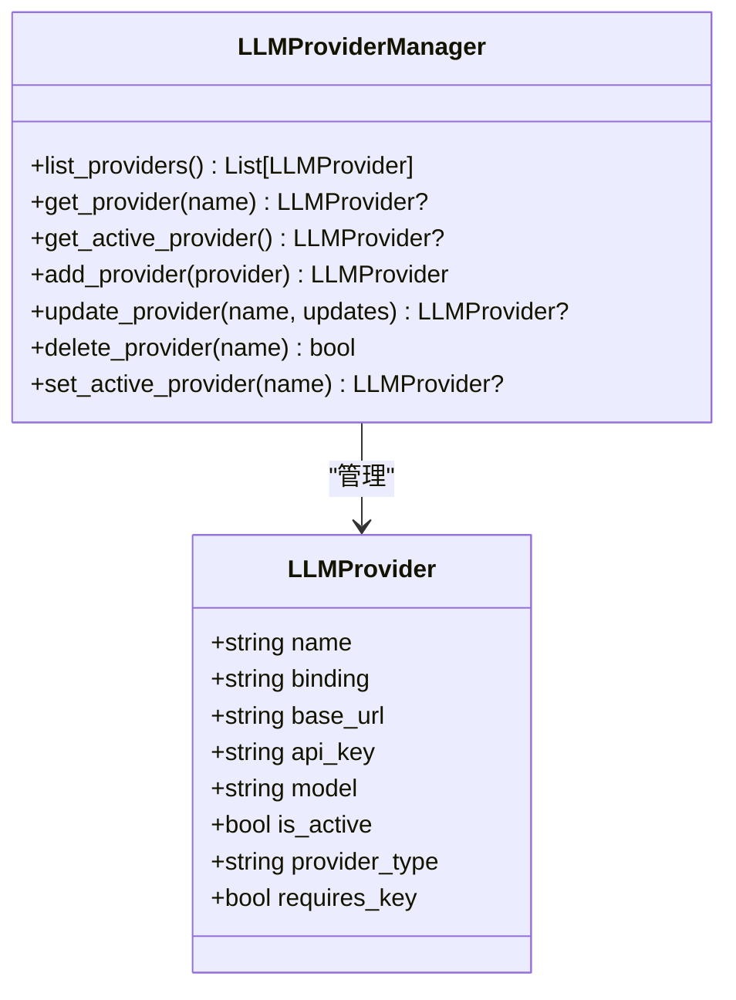
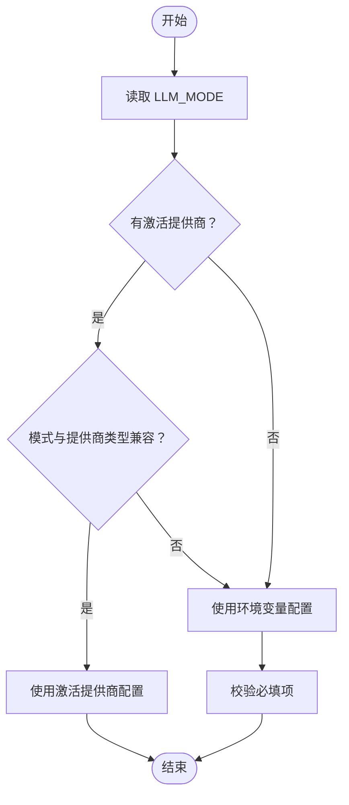
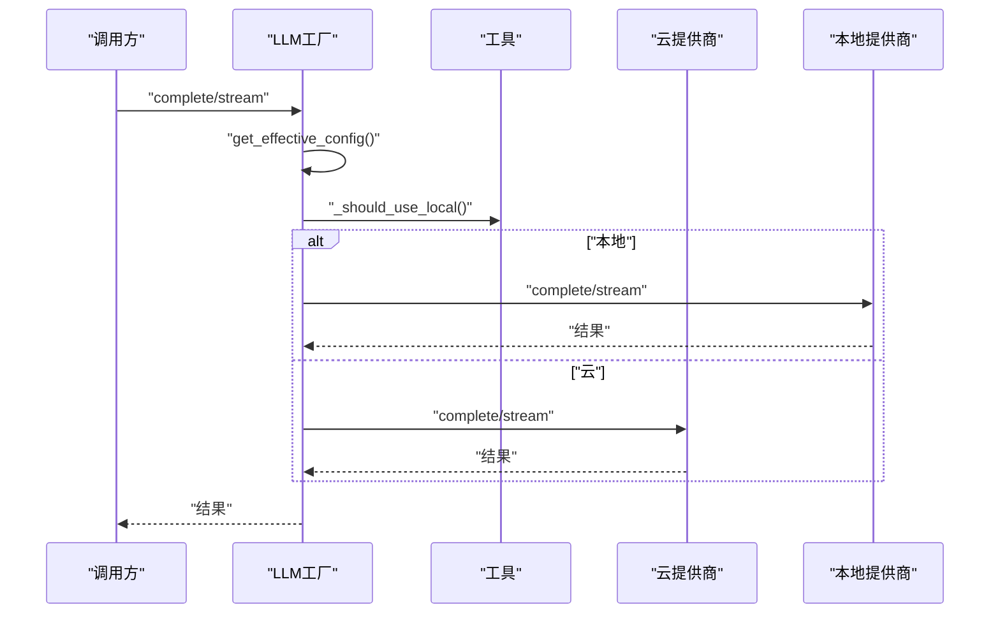
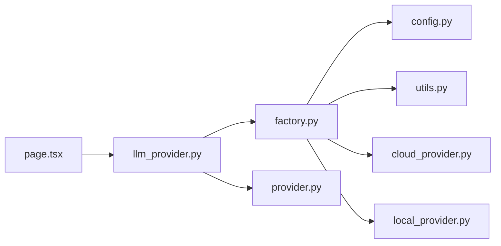

# LLM提供商管理

<cite>
**本文引用的文件**
- [provider.py](file://src/services/llm/provider.py)
- [cloud_provider.py](file://src/services/llm/cloud_provider.py)
- [local_provider.py](file://src/services/llm/local_provider.py)
- [factory.py](file://src/services/llm/factory.py)
- [config.py](file://src/services/llm/config.py)
- [utils.py](file://src/services/llm/utils.py)
- [client.py](file://src/services/llm/client.py)
- [llm_provider.py](file://src/api/routers/llm_provider.py)
- [page.tsx](file://web/app/settings/page.tsx)
- [main.yaml](file://config/main.yaml)
</cite>

## 目录
1. [简介](#简介)
2. [项目结构](#项目结构)
3. [核心组件](#核心组件)
4. [架构总览](#架构总览)
5. [详细组件分析](#详细组件分析)
6. [依赖关系分析](#依赖关系分析)
7. [性能与可用性考量](#性能与可用性考量)
8. [故障排查指南](#故障排查指南)
9. [结论](#结论)
10. [附录](#附录)

## 简介
本文件系统化梳理 DeepTutor 中“LLM提供商管理”的整体设计与实现，覆盖从配置持久化、运行时路由、到前端设置界面的全链路。目标是帮助开发者与运维人员快速理解如何在不同部署模式（云API、本地自托管、混合）下统一管理 LLM 提供商，并通过 API 与前端界面进行配置、测试与切换。

## 项目结构
围绕 LLM 提供商管理的关键目录与文件：
- 服务层：提供统一的 LLM 调用入口与提供商配置管理
  - provider.py：提供商配置模型与持久化管理
  - config.py：环境变量解析与部署模式判定
  - utils.py：URL 规范化与本地服务器识别
  - factory.py：统一工厂，按模式与配置路由至云或本地实现
  - cloud_provider.py：云 API 完成与流式调用（OpenAI 兼容、Anthropic）
  - local_provider.py：本地自托管完成与流式调用（Ollama、LM Studio、vLLM 等）
  - client.py：面向服务的 LLM 客户端封装
- API 层：FastAPI 路由，提供提供商 CRUD、连接测试、模型查询、模式信息等接口
  - llm_provider.py
- 前端层：Next.js 页面，提供提供商列表、新增/编辑、删除、测试连接、查看预设等功能
  - page.tsx

图表来源
- [llm_provider.py](file://src/api/routers/llm_provider.py#L1-L162)
- [factory.py](file://src/services/llm/factory.py#L1-L391)
- [provider.py](file://src/services/llm/provider.py#L1-L195)
- [config.py](file://src/services/llm/config.py#L1-L221)
- [utils.py](file://src/services/llm/utils.py#L1-L79)
- [cloud_provider.py](file://src/services/llm/cloud_provider.py#L1-L438)
- [local_provider.py](file://src/services/llm/local_provider.py#L1-L372)
- [client.py](file://src/services/llm/client.py#L1-L215)
- [page.tsx](file://web/app/settings/page.tsx#L1-L200)

章节来源
- [llm_provider.py](file://src/api/routers/llm_provider.py#L1-L162)
- [factory.py](file://src/services/llm/factory.py#L1-L391)
- [provider.py](file://src/services/llm/provider.py#L1-L195)
- [config.py](file://src/services/llm/config.py#L1-L221)
- [utils.py](file://src/services/llm/utils.py#L1-L79)
- [cloud_provider.py](file://src/services/llm/cloud_provider.py#L1-L438)
- [local_provider.py](file://src/services/llm/local_provider.py#L1-L372)
- [client.py](file://src/services/llm/client.py#L1-L215)
- [page.tsx](file://web/app/settings/page.tsx#L1-L200)

## 核心组件
- 提供商配置模型与持久化
  - LLMProvider：定义提供商名称、绑定类型、基础地址、API Key、模型名、是否激活、提供商类型、是否需要密钥等字段
  - LLMProviderManager：提供增删改查、设置激活提供商、列出与加载持久化数据等能力
- 配置加载与部署模式
  - LLMConfig：封装模型、API Key、基础地址、绑定类型、温度、最大令牌数、提供商类型等
  - get_llm_config/get_llm_mode：从环境变量与激活提供商中选择有效配置；支持 api/local/hybrid 模式
- 工厂与路由
  - LLMMode：枚举三种模式
  - get_effective_config/_should_use_local/get_mode_info：根据模式与激活提供商决定使用云还是本地实现
  - complete/stream/fetch_models：统一路由至 cloud_provider 或 local_provider
- 云提供商
  - complete/stream：OpenAI 兼容与 Anthropic 的完成与流式处理；支持缓存优先调用与回退直连
  - fetch_models：从 /models 获取可用模型列表
- 本地提供商
  - complete/stream：兼容本地 OpenAI 兼容接口；处理思考标签清理与 SSE 流式输出；失败时回退非流式
  - fetch_models：优先尝试 Ollama /api/tags，其次 OpenAI 兼容 /models
- 工具函数
  - sanitize_url：统一 URL 格式，确保本地服务器带 /v1 并去除多余后缀
  - is_local_llm_server：判断是否为本地服务器
- LLM 客户端
  - LLMClient：面向服务的同步/异步封装，提供与 LightRAG/RAG-Anything 兼容的函数接口
- API 路由
  - 列表/新增/更新/删除提供商
  - 设置激活提供商
  - 连接测试与模型查询
  - 模式信息与预设获取
- 前端页面
  - 提供商列表、新增/编辑、删除、测试连接、刷新模型、查看预设
  - 与后端 API 对接，展示当前模式与有效配置来源

章节来源
- [provider.py](file://src/services/llm/provider.py#L21-L195)
- [config.py](file://src/services/llm/config.py#L33-L221)
- [factory.py](file://src/services/llm/factory.py#L39-L391)
- [cloud_provider.py](file://src/services/llm/cloud_provider.py#L1-L438)
- [local_provider.py](file://src/services/llm/local_provider.py#L1-L372)
- [utils.py](file://src/services/llm/utils.py#L1-L79)
- [client.py](file://src/services/llm/client.py#L1-L215)
- [llm_provider.py](file://src/api/routers/llm_provider.py#L1-L162)
- [page.tsx](file://web/app/settings/page.tsx#L1-L200)

## 架构总览
统一工厂负责在运行时根据部署模式与激活提供商选择合适的实现：
- 模式判定：LLM_MODE=api/local/hybrid
- 有效配置：优先激活提供商（需与模式匹配），否则回退到环境变量
- 路由规则：本地 URL 识别走 local_provider，否则走 cloud_provider
- 特殊处理：云侧优先使用缓存封装，失败再直连；本地侧增强流式兼容与思考标签清理

图表来源
- [llm_provider.py](file://src/api/routers/llm_provider.py#L86-L161)
- [factory.py](file://src/services/llm/factory.py#L166-L309)
- [config.py](file://src/services/llm/config.py#L63-L151)
- [utils.py](file://src/services/llm/utils.py#L58-L79)
- [cloud_provider.py](file://src/services/llm/cloud_provider.py#L18-L117)
- [local_provider.py](file://src/services/llm/local_provider.py#L49-L110)

## 详细组件分析

### 组件A：提供商配置模型与持久化（provider.py）
- 数据模型
  - 字段：name、binding、base_url、api_key、model、is_active、provider_type、requires_key
  - 类型：Pydantic BaseModel，支持序列化/反序列化与校验
- 管理器能力
  - 列出、按名获取、获取激活提供商
  - 新增：若同名已存在则报错；首次添加或显式激活时自动去激活其他
  - 更新：支持部分字段更新；变更 is_active 时自动去激活其他
  - 删除：按名删除；成功保存持久化
  - 设置激活：仅允许一个激活项
- 存储策略
  - 默认存储于 data/user/llm_providers.json
  - 首次访问自动创建目录与空文件

图表来源
- [provider.py](file://src/services/llm/provider.py#L28-L195)

章节来源
- [provider.py](file://src/services/llm/provider.py#L28-L195)

### 组件B：配置加载与部署模式（config.py）
- 模式
  - LLM_MODE：api/local/hybrid（默认 hybrid）
- 配置来源优先级
  - 优先：激活提供商（且与模式兼容）
  - 其次：环境变量（.env/.env.local/DeepTutor.env）
- 关键逻辑
  - is_local_llm_server：基于主机名/端口识别本地服务器
  - uses_max_completion_tokens/get_token_limit_kwargs：针对新模型自动选择参数名
- 异常处理
  - 缺少必要配置时抛出明确错误提示

图表来源
- [config.py](file://src/services/llm/config.py#L53-L151)

章节来源
- [config.py](file://src/services/llm/config.py#L53-L151)

### 组件C：工厂与路由（factory.py）
- 模式枚举：API、LOCAL、HYBRID
- 路由决策
  - get_effective_config：结合模式与激活提供商生成有效配置
  - _should_use_local：根据 URL 与模式判断是否走本地实现
  - get_mode_info：返回当前模式、激活提供商、环境配置状态与有效来源
- 统一接口
  - complete/stream：按需路由至 cloud_provider 或 local_provider
  - fetch_models：按 URL 判断来源
- 预设
  - API_PROVIDER_PRESETS/LOCAL_PROVIDER_PRESETS：为前端提供常用预设

图表来源
- [factory.py](file://src/services/llm/factory.py#L166-L309)
- [utils.py](file://src/services/llm/utils.py#L58-L79)
- [cloud_provider.py](file://src/services/llm/cloud_provider.py#L18-L117)
- [local_provider.py](file://src/services/llm/local_provider.py#L49-L110)

章节来源
- [factory.py](file://src/services/llm/factory.py#L39-L391)

### 组件D：云提供商（cloud_provider.py）
- 支持绑定：openai（默认）、anthropic（Claude）
- 完成与流式
  - complete/stream：OpenAI 兼容与 Anthropic 分支处理
  - 优先使用缓存封装（openai_complete_if_cache），失败回退直连 aiohttp
- URL 处理
  - sanitize_url：统一 URL，确保 /chat/completions 与 /v1 兼容
- 模型查询
  - fetch_models：通用 /models 接口，兼容多种响应格式

章节来源
- [cloud_provider.py](file://src/services/llm/cloud_provider.py#L1-L438)
- [utils.py](file://src/services/llm/utils.py#L9-L56)

### 组件E：本地提供商（local_provider.py）
- 完成与流式
  - complete/stream：OpenAI 兼容接口；流式失败自动回退非流式
  - 思考标签清理：移除推理模型输出中的思考块
- URL 处理
  - sanitize_url：本地服务器强制 /v1，兼容 Ollama/LM Studio 等
- 模型查询
  - fetch_models：优先 Ollama /api/tags，其次 OpenAI 兼容 /models

章节来源
- [local_provider.py](file://src/services/llm/local_provider.py#L1-L372)
- [utils.py](file://src/services/llm/utils.py#L58-L79)

### 组件F：工具函数（utils.py）
- sanitize_url：规范化 URL，处理本地服务器端口与 /v1
- is_local_llm_server：基于主机名/端口识别本地服务器

章节来源
- [utils.py](file://src/services/llm/utils.py#L1-L79)

### 组件G：LLM 客户端（client.py）
- LLMClient：封装 openai_complete_if_cache，提供异步/同步接口
- 兼容函数：get_model_func/get_vision_model_func，适配 LightRAG/RAG-Anything

章节来源
- [client.py](file://src/services/llm/client.py#L1-L215)

### 组件H：API 路由（llm_provider.py）
- 提供商管理
  - GET /：列出所有提供商
  - POST /：新增提供商（冲突检查）
  - PUT /{name}/：更新提供商
  - DELETE /：按名删除（支持查询参数版本）
  - POST /active/：设置激活提供商
- 连接测试与模型查询
  - POST /test/：使用统一 URL 规范化后发起测试请求
  - POST /models/：按绑定与 URL 查询可用模型
- 模式与预设
  - GET /mode/：返回当前模式与有效来源
  - GET /presets/：返回 API/Local 预设

章节来源
- [llm_provider.py](file://src/api/routers/llm_provider.py#L1-L162)

### 组件I：前端设置页面（page.tsx）
- 功能
  - 列表：显示所有提供商，支持编辑/删除
  - 新增/编辑：填写名称、绑定、基础地址、模型、是否激活、提供商类型、是否需要密钥
  - 测试连接：调用 /api/v1/config/llm/test/，显示成功/失败与响应
  - 刷新模型：调用 /api/v1/config/llm/models/，显示可用模型
  - 查看预设：GET /api/v1/config/llm/presets/，展示常见云/本地预设
  - 模式信息：GET /api/v1/config/llm/mode/，显示当前模式与有效来源
- 交互
  - 与后端 API 对接，统一处理错误与加载状态

章节来源
- [page.tsx](file://web/app/settings/page.tsx#L1-L200)
- [page.tsx](file://web/app/settings/page.tsx#L1822-L1850)

## 依赖关系分析
- 组件耦合
  - factory.py 依赖 config.py、provider.py、utils.py、cloud_provider.py、local_provider.py
  - llm_provider.py 依赖 provider_manager、factory 的 get_mode_info/get_provider_presets/sanitize_url
  - page.tsx 依赖后端提供的提供商 CRUD、测试、模型查询、模式与预设接口
- 外部依赖
  - aiohttp：云/本地 HTTP 请求
  - lightrag：云侧缓存封装与模型函数兼容
  - Pydantic：配置模型与校验
- 循环依赖
  - 未发现循环导入；模块职责清晰，分层明确

图表来源
- [factory.py](file://src/services/llm/factory.py#L1-L391)
- [llm_provider.py](file://src/api/routers/llm_provider.py#L1-L162)
- [provider.py](file://src/services/llm/provider.py#L1-L195)

章节来源
- [factory.py](file://src/services/llm/factory.py#L1-L391)
- [llm_provider.py](file://src/api/routers/llm_provider.py#L1-L162)
- [provider.py](file://src/services/llm/provider.py#L1-L195)

## 性能与可用性考量
- 云侧
  - 优先使用缓存封装以减少重复请求与网络开销
  - 回退直连时设置合理超时，避免阻塞
- 本地侧
  - 默认较长超时，适应本地推理延迟
  - 流式失败自动回退非流式，提升稳定性
- URL 规范化
  - 统一 /v1 与 /chat/completions，减少兼容性问题
- 模式控制
  - LLM_MODE 可在部署阶段锁定使用云或本地，避免误用导致的错误

[本节为通用指导，无需特定文件来源]

## 故障排查指南
- 常见错误
  - 缺少 LLM_MODEL/LLM_HOST/LLM_API_KEY：检查 .env 或激活提供商
  - 模式不匹配：hybrid 模式下激活了本地提供商但请求云接口，或反之
  - 本地流式失败：本地服务器不支持 SSE，自动回退非流式
- 排查步骤
  - 使用前端“测试连接”接口验证基础地址与密钥
  - 使用“刷新模型”接口确认可用模型列表
  - 查看“模式信息”确认当前模式与有效来源
  - 在后端日志中定位具体异常（HTTP 状态码、错误文本）

章节来源
- [config.py](file://src/services/llm/config.py#L114-L151)
- [cloud_provider.py](file://src/services/llm/cloud_provider.py#L119-L188)
- [local_provider.py](file://src/services/llm/local_provider.py#L141-L292)
- [llm_provider.py](file://src/api/routers/llm_provider.py#L86-L161)

## 结论
该体系通过“配置模型 + 持久化 + 工厂路由 + 云/本地实现 + API/前端”的完整闭环，实现了灵活、可扩展、易维护的 LLM 提供商管理。其优势在于：
- 统一接口与部署模式控制
- 云端缓存优先与本地兼容增强
- 前后端联动的可视化配置体验
建议在生产环境中：
- 明确 LLM_MODE 并在 CI/CD 中固化
- 使用激活提供商作为首选配置源，减少环境变量泄漏风险
- 对本地流式失败场景做好降级与监控

[本节为总结，无需特定文件来源]

## 附录
- 环境与路径参考
  - 用户数据目录：config/main.yaml 中 paths.user_data_dir
  - LLM 模式：config.py 中 LLM_MODE 的解析
- 前端预设
  - 本地预设：Ollama、LM Studio、vLLM、llama.cpp
  - 云预设：OpenAI、Anthropic、DeepSeek、OpenRouter

章节来源
- [main.yaml](file://config/main.yaml#L1-L139)
- [factory.py](file://src/services/llm/factory.py#L311-L377)
- [page.tsx](file://web/app/settings/page.tsx#L185-L230)