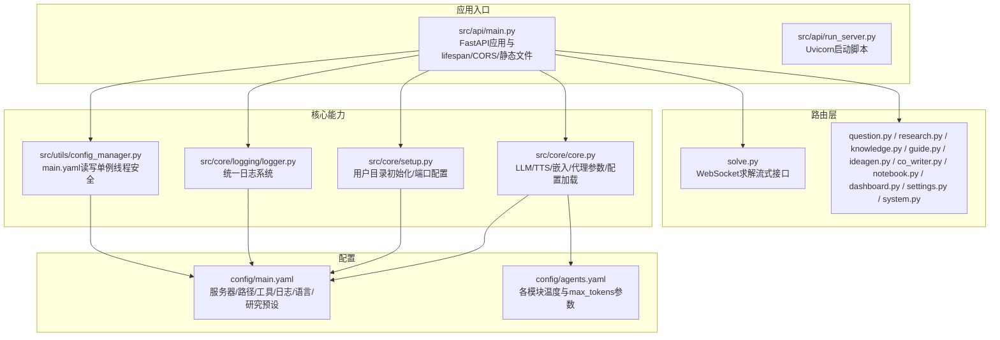
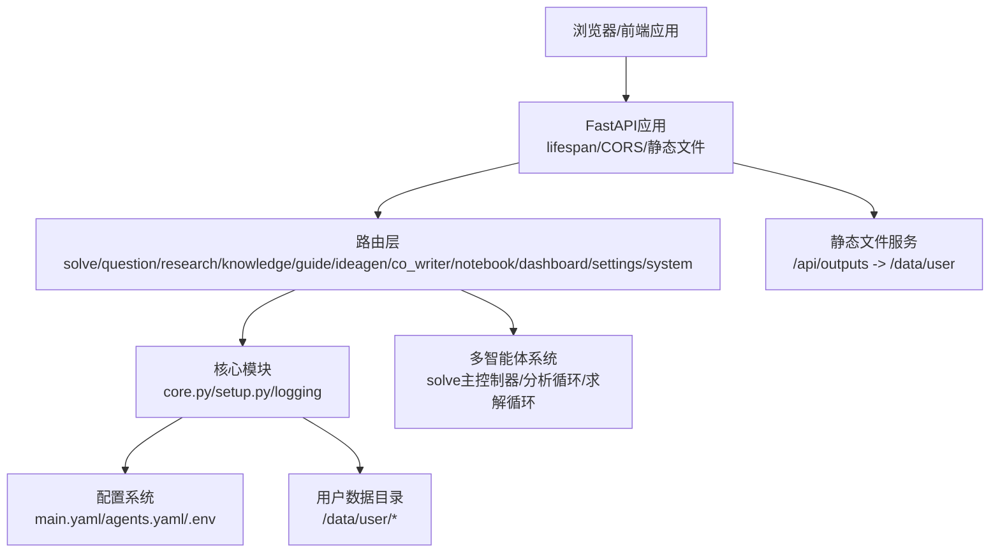
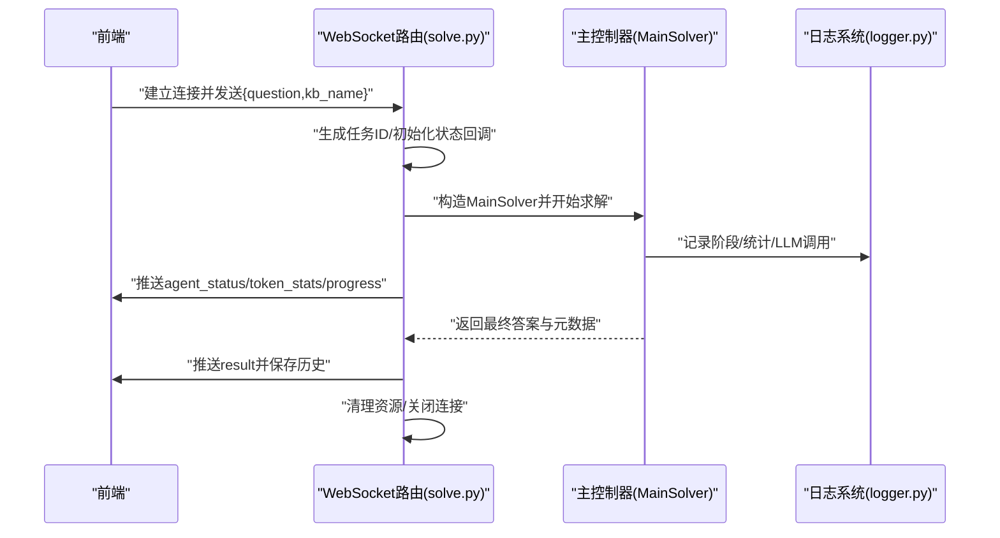
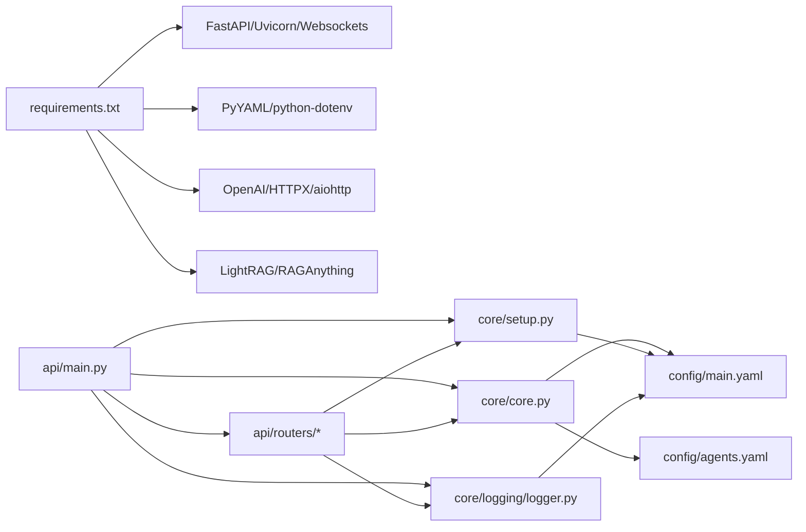

# 后端架构

<cite>
**本文引用的文件**
- [src/api/main.py](file://src/api/main.py)
- [src/api/run_server.py](file://src/api/run_server.py)
- [src/core/core.py](file://src/core/core.py)
- [src/core/setup.py](file://src/core/setup.py)
- [src/core/logging/logger.py](file://src/core/logging/logger.py)
- [src/utils/config_manager.py](file://src/utils/config_manager.py)
- [src/api/routers/solve.py](file://src/api/routers/solve.py)
- [src/agents/solve/main_solver.py](file://src/agents/solve/main_solver.py)
- [config/main.yaml](file://config/main.yaml)
- [config/agents.yaml](file://config/agents.yaml)
- [requirements.txt](file://requirements.txt)
- [scripts/start.py](file://scripts/start.py)
</cite>

## 目录
1. [简介](#简介)
2. [项目结构](#项目结构)
3. [核心组件](#核心组件)
4. [架构总览](#架构总览)
5. [详细组件分析](#详细组件分析)
6. [依赖关系分析](#依赖关系分析)
7. [性能与可扩展性](#性能与可扩展性)
8. [安全与合规](#安全与合规)
9. [故障排查指南](#故障排查指南)
10. [结论](#结论)

## 简介
本文件面向DeepTutor后端（基于FastAPI），系统化梳理其架构设计与实现要点，覆盖API路由组织、生命周期管理（lifespan）、CORS与静态文件服务、核心模块职责（LLM配置管理、配置加载机制、多智能体系统协调）、异步编程模型、错误处理与日志体系、可扩展性与微服务风格、部署拓扑以及横切关注点（安全、性能监控、灾难恢复）。文档同时提供架构图与API调用流程图，帮助读者快速理解并高效运维。

## 项目结构
后端采用“应用入口 + 路由层 + 核心能力模块 + 工具与配置”的分层组织：
- 应用入口：FastAPI应用定义、生命周期、CORS与静态文件挂载
- 路由层：按功能域划分的API路由（solve、question、research、knowledge、guide、ideagen、co_writer、notebook、dashboard、settings、system）
- 核心能力模块：统一配置加载与参数解析、用户目录初始化、日志系统
- 工具与配置：环境变量与YAML配置合并、配置管理器（单例线程安全）

图表来源
- [src/api/main.py](file://src/api/main.py#L1-L129)
- [src/api/run_server.py](file://src/api/run_server.py#L1-L60)
- [src/core/core.py](file://src/core/core.py#L1-L357)
- [src/core/setup.py](file://src/core/setup.py#L1-L346)
- [src/core/logging/logger.py](file://src/core/logging/logger.py#L1-L712)
- [src/utils/config_manager.py](file://src/utils/config_manager.py#L1-L138)
- [config/main.yaml](file://config/main.yaml#L1-L142)
- [config/agents.yaml](file://config/agents.yaml#L1-L55)

章节来源
- [src/api/main.py](file://src/api/main.py#L1-L129)
- [src/api/run_server.py](file://src/api/run_server.py#L1-L60)
- [config/main.yaml](file://config/main.yaml#L1-L142)
- [config/agents.yaml](file://config/agents.yaml#L1-L55)

## 核心组件
- FastAPI应用与生命周期
  - 使用lifespan钩子在启动时记录日志并在关闭时清理资源，避免CancelledError影响优雅退出
  - 配置CORS允许任意来源访问，生产环境建议限制为前端域名
  - 挂载静态文件服务，将用户输出目录映射到/api/outputs前缀，供前端直接访问生成产物
- 统一配置管理
  - 从环境变量与YAML加载配置，支持main.yaml与子模块配置合并
  - 提供LLM/TTS/嵌入配置读取、代理参数（temperature/max_tokens）读取、路径解析、语言标准化
- 用户目录初始化与端口配置
  - 启动时自动创建用户数据目录结构（solve、question、research、guide、notebook、co-writer、logs、run_code_workspace等）
  - 从配置读取后端/前端端口，缺失时打印配置教程并终止
- 日志系统
  - 统一日志格式与符号，支持控制台彩色输出与文件落盘
  - 支持任务级日志句柄、显示管理器（TUI/前端状态）、LLM调用统计、工具调用统计
- 配置管理器
  - 单例+锁的线程安全实现，基于文件mtime缓存，支持保存与递归更新

章节来源
- [src/api/main.py](file://src/api/main.py#L26-L129)
- [src/core/core.py](file://src/core/core.py#L1-L357)
- [src/core/setup.py](file://src/core/setup.py#L1-L346)
- [src/core/logging/logger.py](file://src/core/logging/logger.py#L1-L712)
- [src/utils/config_manager.py](file://src/utils/config_manager.py#L1-L138)

## 架构总览
后端以FastAPI为核心，通过lifespan统一生命周期，CORS与静态文件服务支撑前后端协作；核心模块负责配置与日志，路由层承载业务API，多智能体系统在solve等模块中实现。

图表来源
- [src/api/main.py](file://src/api/main.py#L1-L129)
- [src/core/core.py](file://src/core/core.py#L1-L357)
- [src/core/setup.py](file://src/core/setup.py#L1-L346)
- [src/core/logging/logger.py](file://src/core/logging/logger.py#L1-L712)
- [config/main.yaml](file://config/main.yaml#L1-L142)
- [config/agents.yaml](file://config/agents.yaml#L1-L55)

## 详细组件分析

### FastAPI应用与路由组织
- 应用入口
  - 定义title/version/lifespan，注册CORS与静态文件
  - 动态挂载各模块路由，统一前缀与标签
  - 提供根路径健康检查返回消息
- Uvicorn启动
  - 通过run_server.py以Python API方式启动，避免Windows路径问题
  - 自动从配置读取端口，设置reload_excludes排除临时与输出目录，减少热重载误触发

章节来源
- [src/api/main.py](file://src/api/main.py#L1-L129)
- [src/api/run_server.py](file://src/api/run_server.py#L1-L60)

### 生命周期管理（lifespan）
- 启动阶段：记录应用启动日志
- 关闭阶段：记录应用关闭日志
- 与用户目录初始化结合，确保首次运行时创建必要目录

章节来源
- [src/api/main.py](file://src/api/main.py#L26-L41)
- [src/core/setup.py](file://src/core/setup.py#L1-L120)

### CORS与静态文件服务
- CORS：允许任意来源、凭证、方法与头，生产环境需收紧
- 静态文件：将/data/user挂载为/api/outputs，便于前端直接访问生成物（图片/PDF等）

章节来源
- [src/api/main.py](file://src/api/main.py#L41-L81)

### 统一配置加载与参数解析（core.py）
- 环境变量配置
  - LLM/TTS/嵌入配置读取与校验，缺失时报错并提示配置项
- YAML配置加载
  - 加载main.yaml作为通用配置基座，再与子模块配置进行深合并
  - 提供路径解析函数，优先从paths/system/tools查找
- 代理参数
  - 从agents.yaml读取各模块的temperature与max_tokens，作为全局单一真相源
- 语言解析
  - 支持多种输入格式，统一标准化为“zh”或“en”

章节来源
- [src/core/core.py](file://src/core/core.py#L40-L212)
- [src/core/core.py](file://src/core/core.py#L220-L314)
- [src/core/core.py](file://src/core/core.py#L316-L357)
- [config/agents.yaml](file://config/agents.yaml#L1-L55)

### 用户目录初始化与端口配置（setup.py）
- 用户目录初始化
  - 创建solve/question/research/guide/notebook/co-writer/logs/run_code_workspace等目录
  - 初始化user_history.json与settings.json
- 端口配置
  - 从main.yaml读取server.backend_port与server.frontend_port
  - 缺失时打印配置教程并退出

章节来源
- [src/core/setup.py](file://src/core/setup.py#L30-L205)
- [src/core/setup.py](file://src/core/setup.py#L243-L345)
- [config/main.yaml](file://config/main.yaml#L1-L10)

### 日志系统（core/logging/logger.py）
- 日志级别与符号
  - 自定义LogLevel枚举，配合ConsoleFormatter/FileFormatter输出
- 统一日志格式
  - 控制台彩色+符号，文件详细时间戳与模块名
- 功能特性
  - 任务级日志句柄、显示管理器（TUI/前端状态）、LLM/工具调用统计
  - 进度/完成/阶段/工具调用/LLM调用等便捷方法
- 全局注册表
  - get_logger按名称缓存实例，支持根据配置推断日志目录

章节来源
- [src/core/logging/logger.py](file://src/core/logging/logger.py#L1-L200)
- [src/core/logging/logger.py](file://src/core/logging/logger.py#L200-L480)
- [src/core/logging/logger.py](file://src/core/logging/logger.py#L600-L712)

### 配置管理器（utils/config_manager.py）
- 单例+锁：保证线程安全
- 缓存策略：基于文件mtime判断是否需要重新加载
- 写入策略：递归更新现有配置，避免部分更新破坏其他段落
- 环境信息：读取.env中的关键变量，回退至os.environ

章节来源
- [src/utils/config_manager.py](file://src/utils/config_manager.py#L1-L138)

### 多智能体系统协调（solve路由与主控制器）
- WebSocket求解流
  - 前端连接后发送问题与知识库名，后端生成任务ID并开始求解
  - 通过队列推送agent状态、token统计、进度与最终结果
  - 异常时发送错误消息并清理资源
- 主控制器（MainSolver）
  - 从统一配置加载solve配置，构建验证器并校验
  - 初始化日志、显示管理器、令牌跟踪器
  - 双环路架构：分析循环（Investigate/Note）+ 求解循环（Manager/Solve/Tool/Response/Precision）
  - 输出Markdown/PDF等产物，修复图片相对路径为/api/outputs前缀

图表来源
- [src/api/routers/solve.py](file://src/api/routers/solve.py#L1-L294)
- [src/agents/solve/main_solver.py](file://src/agents/solve/main_solver.py#L1-L200)
- [src/core/logging/logger.py](file://src/core/logging/logger.py#L1-L200)

章节来源
- [src/api/routers/solve.py](file://src/api/routers/solve.py#L1-L294)
- [src/agents/solve/main_solver.py](file://src/agents/solve/main_solver.py#L1-L200)

## 依赖关系分析
- 外部依赖
  - FastAPI、Uvicorn、Websockets、Pydantic、OpenAI/HTTPX/aiohttp、PyYAML、python-dotenv、LightRAG/RAGAnything等
- 内部依赖
  - 路由依赖core配置加载与日志系统
  - solve路由依赖主控制器与工具链（代码执行、RAG、搜索等）
  - setup依赖core配置加载以确定用户目录与日志目录

图表来源
- [requirements.txt](file://requirements.txt#L1-L62)
- [src/api/main.py](file://src/api/main.py#L1-L129)
- [src/core/core.py](file://src/core/core.py#L1-L357)
- [src/core/setup.py](file://src/core/setup.py#L1-L346)
- [src/core/logging/logger.py](file://src/core/logging/logger.py#L1-L712)
- [config/main.yaml](file://config/main.yaml#L1-L142)
- [config/agents.yaml](file://config/agents.yaml#L1-L55)

章节来源
- [requirements.txt](file://requirements.txt#L1-L62)
- [src/api/main.py](file://src/api/main.py#L1-L129)

## 性能与可扩展性
- 异步编程模型
  - FastAPI路由与solve主控制器均采用异步，WebSocket推送使用队列与超时控制，降低阻塞风险
- 并发与资源管理
  - 使用asyncio.Event与队列保障连接关闭时及时停止后台推送任务
  - 日志系统支持并发写入（线程安全），避免阻塞主线程
- 配置驱动的可扩展性
  - 通过agents.yaml集中管理各模块参数，统一LLM/TTS/嵌入配置，便于横向扩展新模块
  - main.yaml集中管理路径、工具开关与日志策略，便于运维调整
- 微服务风格
  - 路由按功能域拆分，模块间通过配置与日志解耦，具备向微服务演进的基础（如将solve/research等独立为服务）

[本节为通用指导，不涉及具体文件分析]

## 安全与合规
- CORS策略
  - 当前允许任意来源，生产环境必须限制为可信前端域名
- 配置与密钥
  - LLM/TTS/嵌入API密钥来自环境变量，建议使用只读权限与最小暴露面
- 文件与目录
  - 用户输出目录通过静态文件服务暴露，需确保仅存放非敏感内容或增加鉴权
- 日志与审计
  - 统一日志落盘，建议开启文件轮转与访问控制

[本节为通用指导，不涉及具体文件分析]

## 故障排查指南
- 启动失败（端口未配置）
  - 现象：启动即退出并提示配置教程
  - 排查：在config/main.yaml添加server.backend_port与server.frontend_port
- LLM配置缺失
  - 现象：启动时报错提示未配置LLM_MODEL/LLM_BINDING_API_KEY/LLM_BINDING_HOST
  - 排查：在.env或DeepTutor.env中补齐相应键值
- WebSocket连接异常
  - 现象：前端无法接收进度或报错
  - 排查：查看后端日志，确认log_pusher是否正常运行；检查连接关闭事件与队列阻塞
- 静态文件无法访问
  - 现象：/api/outputs下资源404
  - 排查：确认用户目录已初始化且挂载路径正确

章节来源
- [src/core/setup.py](file://src/core/setup.py#L243-L345)
- [src/core/core.py](file://src/core/core.py#L40-L112)
- [src/api/routers/solve.py](file://src/api/routers/solve.py#L120-L294)
- [src/api/main.py](file://src/api/main.py#L41-L81)

## 结论
DeepTutor后端以FastAPI为基础，通过统一配置加载、集中日志与严格的生命周期管理，实现了高内聚、低耦合的模块化架构。solve等多智能体系统通过WebSocket实现实时流式交互，配合静态文件服务满足前端访问需求。建议在生产环境中收紧CORS、完善密钥管理与日志审计，并持续优化配置驱动的可扩展性，为未来微服务化奠定基础。