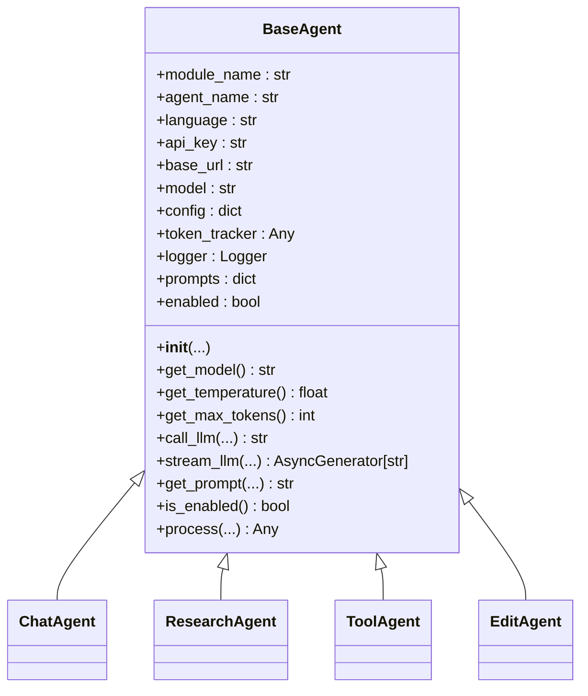
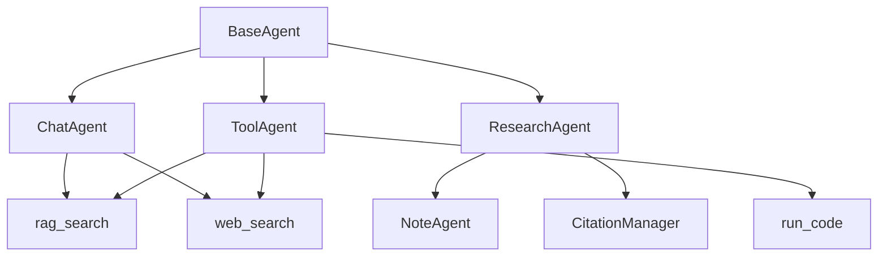

# 基础智能体

<cite>
**本文档引用文件**   
- [base_agent.py](file://src/agents/base_agent.py)
- [chat_agent.py](file://src/agents/chat/chat_agent.py)
- [edit_agent.py](file://src/agents/co_writer/edit_agent.py)
- [research_agent.py](file://src/agents/research/agents/research_agent.py)
- [tool_agent.py](file://src/agents/solve/solve_loop/tool_agent.py)
- [agents.yaml](file://config/agents.yaml)
- [main.yaml](file://config/main.yaml)
</cite>

## 目录
1. [项目结构](#项目结构)
2. [基础智能体核心功能](#基础智能体核心功能)
3. [配置管理](#配置管理)
4. [智能体实现分析](#智能体实现分析)
5. [依赖关系图](#依赖关系图)

## 项目结构

DeepTutor 项目是一个基于多智能体架构的个性化学习助手系统，其核心功能围绕智能体（Agent）展开。项目采用模块化设计，主要结构如下：

```
src/
├── agents/               # 智能体模块
│   ├── base_agent.py     # 所有智能体的基类
│   ├── chat/             # 轻量级对话智能体
│   ├── co_writer/        # 协作写作智能体
│   ├── guide/            # 引导学习智能体
│   ├── ideagen/          # 创意生成智能体
│   ├── question/         # 问题生成智能体
│   ├── research/         # 深度研究智能体
│   └── solve/            # 问题求解智能体
├── config/               # 配置文件
│   ├── agents.yaml       # 统一的智能体参数配置
│   └── main.yaml         # 主配置文件
└── tools/                # 工具集
    ├── rag_tool.py       # RAG检索工具
    ├── web_search.py     # 网络搜索工具
    └── code_executor.py  # 代码执行工具
```

**Diagram sources**
- [base_agent.py](file://src/agents/base_agent.py#L1-L606)
- [main.yaml](file://config/main.yaml#L1-L139)

**Section sources**
- [base_agent.py](file://src/agents/base_agent.py#L1-L606)
- [main.yaml](file://config/main.yaml#L1-L139)

## 基础智能体核心功能

`BaseAgent` 是 DeepTutor 项目中所有智能体的统一基类，为 `solve`、`research`、`guide`、`ideagen` 和 `co_writer` 等模块的智能体提供核心功能。它不适用于 `question` 模块，该模块使用独立的 ReAct 架构。

`BaseAgent` 的主要职责包括：

- **LLM 配置管理**：统一管理 API 密钥、基础 URL 和模型名称。
- **智能体参数加载**：从 `agents.yaml` 文件中加载温度（temperature）和最大 token 数（max_tokens）等参数。
- **提示词管理**：通过 `PromptManager` 加载和管理提示词。
- **统一的 LLM 调用接口**：提供 `call_llm`（非流式）和 `stream_llm`（流式）两个方法，屏蔽底层 LLM 提供商的差异。
- **Token 跟踪**：集成 `TokenTracker` 和 `LLMStats`，用于监控和统计 token 使用情况。
- **日志记录**：为每个智能体提供独立的日志记录器。



**Diagram sources**
- [base_agent.py](file://src/agents/base_agent.py#L36-L606)

**Section sources**
- [base_agent.py](file://src/agents/base_agent.py#L1-L606)

## 配置管理

DeepTutor 项目使用两个核心配置文件来管理智能体的行为和系统设置。

### 统一智能体参数 (agents.yaml)

`config/agents.yaml` 文件是所有智能体模块的**单一事实来源**，它为每个模块定义了统一的 `temperature` 和 `max_tokens` 参数。这种设计避免了在代码中硬编码这些值，便于集中管理和调整。

```yaml
solve:
  temperature: 0.3
  max_tokens: 8192
research:
  temperature: 0.5
  max_tokens: 12000
guide:
  temperature: 0.5
  max_tokens: 16192
co_writer:
  temperature: 0.7
  max_tokens: 4096
```

### 主配置文件 (main.yaml)

`config/main.yaml` 文件包含了更广泛的系统级配置，包括：

- **路径配置**：用户数据、知识库、日志等目录的路径。
- **工具配置**：RAG、代码执行、网络搜索等工具的启用状态和参数。
- **日志配置**：日志级别、是否保存到文件等。
- **模块特定配置**：如 `solve`、`research`、`question` 等模块的特定参数。

**Section sources**
- [agents.yaml](file://config/agents.yaml#L1-L55)
- [main.yaml](file://config/main.yaml#L1-L139)

## 智能体实现分析

### 对话智能体 (ChatAgent)

`ChatAgent` 继承自 `BaseAgent`，实现了多轮对话功能。它通过 `truncate_history` 方法管理对话历史，确保总 token 数不超过限制。该智能体支持通过 RAG 和 Web Search 增强上下文，并能以流式方式生成响应。

**Section sources**
- [chat_agent.py](file://src/agents/chat/chat_agent.py#L1-L436)

### 协作写作智能体 (EditAgent)

`EditAgent` 是一个独立的智能体，不继承自 `BaseAgent`。它实现了文本的重写、缩短和扩展功能，并支持通过 RAG 或 Web Search 获取上下文。其操作历史会被持久化到 `data/user/co-writer/history.json` 文件中。

**Section sources**
- [edit_agent.py](file://src/agents/co_writer/edit_agent.py#L1-L336)

### 研究智能体 (ResearchAgent)

`ResearchAgent` 继承自 `BaseAgent`，是深度研究模块的核心。它负责执行研究逻辑，决定工具调用，并与 `NoteAgent` 和 `CitationManager` 协作。它实现了复杂的提示词生成逻辑，以指导 LLM 在不同研究阶段使用合适的工具。

**Section sources**
- [research_agent.py](file://src/agents/research/agents/research_agent.py#L1-L708)

### 工具智能体 (ToolAgent)

`ToolAgent` 继承自 `BaseAgent`，是问题求解模块的一部分。它负责执行 `solve-chain` 中的工具调用，如 RAG 检索、网络搜索和代码执行。它会生成工具结果的摘要，并更新 `SolveMemory` 和 `CitationMemory`。

**Section sources**
- [tool_agent.py](file://src/agents/solve/solve_loop/tool_agent.py#L1-L463)

## 依赖关系图

以下图表展示了核心智能体之间的依赖关系。



**Diagram sources**
- [base_agent.py](file://src/agents/base_agent.py#L1-L606)
- [chat_agent.py](file://src/agents/chat/chat_agent.py#L1-L436)
- [research_agent.py](file://src/agents/research/agents/research_agent.py#L1-L708)
- [tool_agent.py](file://src/agents/solve/solve_loop/tool_agent.py#L1-L463)